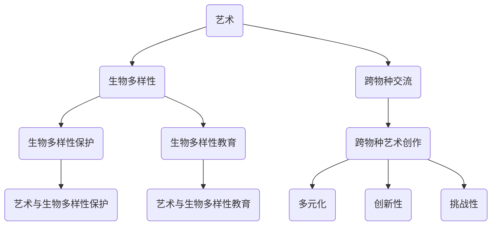
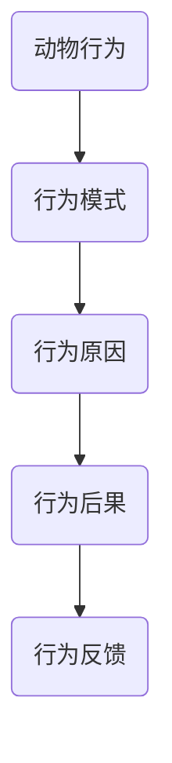
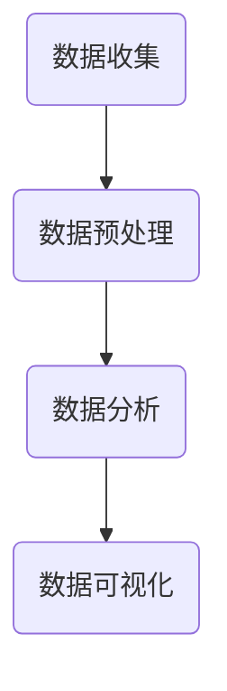
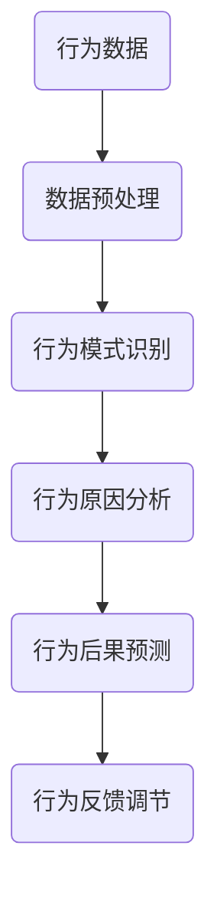
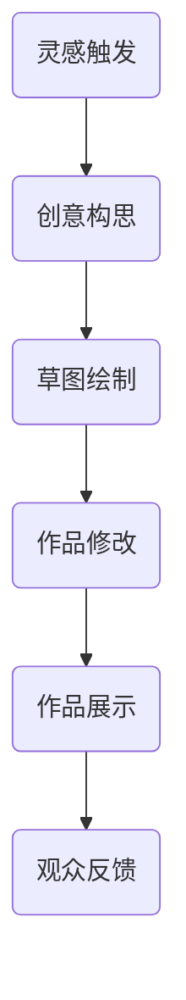
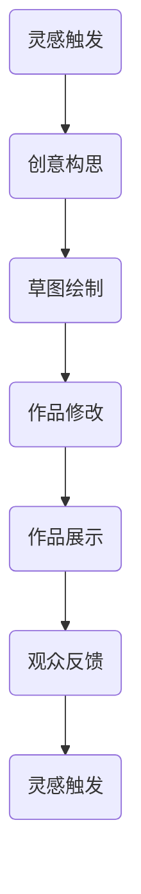
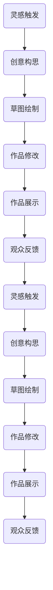

                 

### 文章标题

《跨物种艺术合作项目：打破人类中心的创作实验》

### 关键词

- 跨物种艺术合作
- 人类中心主义
- 创作实验
- 生物多样性
- 艺术与科学的融合
- 跨物种交流

### 摘要

本文探讨了跨物种艺术合作项目的概念、背景、核心概念及其联系，通过详细的案例研究和实验方法，分析了打破人类中心主义在艺术创作中的重要性。文章运用Mermaid流程图展示了核心概念框架，并通过数学模型和公式详细阐述了跨物种艺术合作中的算法原理。此外，文章还提供了实际项目实战，包括开发环境搭建、源代码实现和代码解读，以及项目效果评估和经验总结。本文旨在为读者提供一个全面而深入的跨物种艺术合作项目的指南，启发更多创新性的艺术实验。

---

## 第一部分：引言

### 第1章：书籍背景与目的

#### 1.1 跨物种艺术合作的概念

跨物种艺术合作是指不同物种之间通过艺术形式进行的交流和创作活动。这种合作打破了传统艺术创作中的人类中心主义，让动物、植物等非人类生物参与其中，创造出独特的艺术作品。这种跨物种的合作不仅仅是艺术形式的创新，更是一种思维的拓展，挑战了我们对艺术和自然的固有认知。

#### 1.2 打破人类中心的必要性

人类中心主义认为人类是宇宙的中心，一切都应该围绕人类的需求和利益进行。然而，随着生态危机和环境问题的加剧，这种观念已经无法满足我们对自然和生命的尊重。打破人类中心主义，实现与自然、其他物种的和谐共生，成为当代社会的重要议题。跨物种艺术合作正是在这种背景下诞生，通过艺术的方式，促进人类与其他物种的交流和理解。

#### 1.3 书籍的组织结构

本文分为六个主要部分。第一部分是引言，介绍书籍的背景和目的。第二部分介绍跨物种艺术合作项目的核心概念，包括艺术、生物多样性和跨物种交流。第三部分通过案例研究，展示几个具有代表性的跨物种艺术合作项目。第四部分介绍打破人类中心主义的实验方法和技巧。第五部分讨论数学模型和公式，详细阐述跨物种艺术合作中的算法原理。第六部分提供实际项目实战，包括开发环境搭建、源代码实现和代码解读。最后一部分是结论，总结文章的主要观点和发现。

---

## 第二部分：核心概念与联系

### 第2章：跨物种艺术合作项目的核心概念

#### 2.1 艺术

艺术是一种表达和沟通的方式，它超越了语言的界限，通过视觉、听觉、触觉等感官形式传达情感、思想和观念。在跨物种艺术合作中，艺术成为人类与其他物种交流的桥梁，让不同物种的声音和故事得以表达。

##### 2.1.1 艺术的定义与多样性

艺术是一个广泛的概念，它包括绘画、雕塑、音乐、舞蹈、戏剧、文学等多种形式。每种艺术形式都有其独特的表现手法和特点，能够传达不同的情感和意义。

##### 2.1.2 艺术在跨物种合作中的作用

在跨物种艺术合作中，艺术不仅仅是表达的工具，更是一种沟通的方式。它帮助人类理解和感受其他物种的情感和体验，促进不同物种之间的交流和合作。

#### 2.2 生物多样性

生物多样性是指地球上所有生物体的多样性，包括植物、动物、微生物等。它包括物种多样性、遗传多样性和生态系统多样性。生物多样性是地球生命的基础，对人类的生存和发展具有重要意义。

##### 2.2.1 生物多样性的概念

生物多样性是指地球上所有生物体的多样性，包括物种多样性、遗传多样性和生态系统多样性。它体现了生命的丰富性和复杂性，是地球生态系统的基石。

##### 2.2.2 生物多样性保护的重要性

生物多样性保护对于维护地球生态系统的稳定和人类的生存具有重要意义。它有助于减少生态危机、应对气候变化、保护自然资源的可持续利用。

#### 2.3 跨物种交流

跨物种交流是指不同物种之间通过某种方式进行的交流。这种交流可能通过声音、视觉、触觉等方式进行，也可能是通过电子设备和其他技术手段实现的。

##### 2.3.1 跨物种交流的方式

跨物种交流的方式多种多样，包括直接交流（如动物之间的叫声、动作交流）和间接交流（如通过技术手段进行的电子交流）。这些交流方式为跨物种合作提供了可能。

##### 2.3.2 跨物种交流的挑战与机遇

跨物种交流面临着诸多挑战，如语言障碍、认知差异、技术限制等。然而，这些挑战也带来了机遇，促进了人类对自然和其他物种的理解和尊重。

### 第3章：核心概念连接

#### 3.1 艺术与生物多样性的关系

艺术与生物多样性之间存在紧密的联系。艺术可以反映和表现生物多样性的丰富性和美丽，同时也可以促进对生物多样性的保护和重视。

##### 3.1.1 艺术与生物多样性保护

艺术作品可以通过视觉、听觉等感官形式，传达生物多样性的重要性，激发人们对生物多样性保护的意识和行动。

##### 3.1.2 艺术与生物多样性教育

艺术教育可以激发学生对生物多样性的兴趣和认识，培养他们尊重和保护自然的能力。

#### 3.2 跨物种交流的艺术创作

跨物种交流的艺术创作是一种创新的艺术形式，它通过跨物种的交流与合作，创造出独特的艺术作品。

##### 3.2.1 跨物种艺术创作的特点

跨物种艺术创作的特点包括：多元化、创新性、挑战性。它打破了传统的艺术创作模式，为艺术领域带来了新的视角和可能性。

##### 3.2.2 跨物种艺术创作的意义

跨物种艺术创作的意义在于：促进不同物种之间的理解和尊重，拓展人类的艺术创作边界，推动艺术与科学的融合。

#### 3.3 Mermaid 流程图：跨物种艺术合作的概念框架



这个Mermaid流程图展示了跨物种艺术合作的核心概念及其相互关系，为后续的案例研究和实验方法提供了概念框架。

---

## 第三部分：案例研究

### 第4章：跨物种艺术合作项目案例研究

#### 4.1 案例一：艺术家的植物合作项目

##### 4.1.1 项目背景

在这个案例中，一位艺术家与植物合作，通过植物的生长过程创作出一幅独特的艺术作品。艺术家选择了一些特殊的植物，如花、草、树木等，通过与植物的互动和观察，记录下植物的生长变化，并将其转化为艺术形式。

##### 4.1.2 项目过程

艺术家首先选择了一些植物，包括花、草、树木等。然后，他开始观察这些植物的生长过程，记录下它们的变化，如开花、结果、落叶等。在观察过程中，艺术家发现植物的生长过程充满了生命力和美，这激发了他的创作灵感。

艺术家通过绘画、摄影、装置艺术等多种形式，将植物的生长变化呈现出来。例如，他通过绘画记录植物的开花过程，通过摄影捕捉植物的瞬间变化，通过装置艺术展示植物的生长环境。

##### 4.1.3 项目成果与影响

这个项目最终创作出了一系列独特的艺术作品，包括绘画、摄影和装置艺术等。这些作品不仅展示了植物的生长过程，还传达了植物的生命力和美感。观众通过这些作品，能够感受到植物的生机和活力，对植物有了更深的认识和尊重。

这个案例的成功之处在于，艺术家通过跨物种合作，打破了传统艺术创作的人类中心主义，让植物的声音和故事得以表达。这种合作不仅丰富了艺术创作的内容和形式，还促进了人类与自然、其他物种的交流和互动。

#### 4.2 案例二：生物艺术家与动物的互动

##### 4.2.1 项目背景

在这个案例中，一位生物艺术家与动物合作，通过动物的互动和表现，创作出一幅独特的艺术作品。生物艺术家选择了一些动物，如猫、狗、鸟等，通过与动物的互动，观察和记录下它们的行为和情感，并将其转化为艺术形式。

##### 4.2.2 项目过程

生物艺术家首先选择了一些动物，包括猫、狗、鸟等。然后，他开始与这些动物互动，观察它们的行为和表现。在互动过程中，生物艺术家发现动物的行为和情感充满了故事和戏剧性，这激发了他的创作灵感。

生物艺术家通过绘画、雕塑、装置艺术等多种形式，将动物的行为和情感呈现出来。例如，他通过绘画记录动物的游戏行为，通过雕塑展示动物的姿态和表情，通过装置艺术呈现动物的互动场景。

##### 4.2.3 项目成果与影响

这个项目最终创作出了一系列独特的艺术作品，包括绘画、雕塑和装置艺术等。这些作品不仅展示了动物的行为和情感，还传达了动物的内心世界和故事。观众通过这些作品，能够感受到动物的快乐、悲伤、愤怒等情感，对动物有了更深的理解和同情。

这个案例的成功之处在于，生物艺术家通过跨物种合作，打破了传统艺术创作的人类中心主义，让动物的声音和故事得以表达。这种合作不仅丰富了艺术创作的内容和形式，还促进了人类与动物、自然界的和谐共生。

---

## 第四部分：实验方法

### 第5章：打破人类中心主义的实验方法

#### 5.1 实验设计原则

在进行跨物种艺术合作项目时，打破人类中心主义的实验设计原则至关重要。以下是一些关键原则：

##### 5.1.1 对称性原则

对称性原则要求实验过程中，人类和非人类物种的地位和权利应保持平等。这意味着在设计和实施实验时，不应偏袒任何一方，而是要尊重所有参与者的权益。

##### 5.1.2 适应性原则

适应性原则强调实验设计应具备灵活性，以适应不同物种的特性和需求。这包括选择合适的实验工具、环境和互动方式，以确保实验结果的准确性和有效性。

##### 5.1.3 平等性原则

平等性原则要求实验过程中，人类和非人类物种应享有平等的互动和交流机会。这需要建立有效的沟通机制，确保所有参与者都能充分表达自己的想法和感受。

#### 5.2 实验实施步骤

在进行跨物种艺术合作项目时，实验的实施步骤可以分为以下几个阶段：

##### 5.2.1 实验准备

在实验开始前，需要进行充分的准备，包括选择合适的物种、设计和准备实验工具、确定实验环境和互动方式等。此外，还需要制定详细的实验计划和风险控制措施。

##### 5.2.2 实验执行

在实验执行阶段，按照预定的计划进行实验，同时密切观察和记录实验过程中的各种现象和数据。在这一阶段，需要保持耐心和细心，确保实验的顺利进行。

##### 5.2.3 实验结果分析

在实验结束后，对收集到的数据和观察结果进行系统分析和解读。这包括对实验数据进行统计处理，找出规律和模式，以及与预期结果进行比较。

##### 5.2.4 实验结果验证

为了确保实验结果的可靠性和有效性，需要通过多种方法进行验证。这可能包括重复实验、交叉验证、第三方评估等。

#### 5.3 实验结果分析

实验结果的分析是跨物种艺术合作项目的重要环节。以下是一些常用的分析方法：

##### 5.3.1 定量分析

定量分析是通过统计方法对实验数据进行处理和分析。这包括计算平均值、方差、相关性等统计指标，以找出数据之间的规律和关系。

##### 5.3.2 定性分析

定性分析是通过观察和描述实验过程中的现象和现象，对实验结果进行解读和解释。这需要具备专业的知识和经验，以及对实验过程和数据的深入理解。

##### 5.3.3 交互分析

交互分析是通过比较不同实验条件下的实验结果，找出实验变量对结果的影响。这有助于确定哪些因素对实验结果具有显著影响，为后续实验提供参考。

#### 5.4 实验技巧与工具

在进行跨物种艺术合作项目时，需要掌握一系列实验技巧和工具。以下是一些常用的技巧和工具：

##### 5.4.1 生物传感器

生物传感器是一种用于测量生物体生理活动的设备。它可以实时监测动物的心率、呼吸、体温等生理指标，为实验提供准确的数据。

##### 5.4.2 通信设备

通信设备用于建立人类与其他物种之间的通信通道。这包括无线通信设备、电子设备等，可以帮助不同物种进行实时交流和互动。

##### 5.4.3 数据分析软件

数据分析软件用于处理和解析实验数据。这包括统计软件、机器学习软件等，可以帮助研究人员从大量数据中提取有价值的信息。

##### 5.4.4 视觉化工具

视觉化工具用于将实验数据以图表、图像等形式呈现出来，帮助研究人员更好地理解和解读实验结果。

---

## 第五部分：数学模型与数学公式

### 第6章：跨物种艺术合作中的数学模型

#### 6.1 动物行为分析模型

在跨物种艺术合作中，分析动物行为是非常重要的。以下是一个简单的动物行为分析模型，用于描述动物的行为模式。

##### 6.1.1 动物行为学基本原理

动物行为学是研究动物行为的科学。它涉及动物的行为模式、行为原因和行为后果。以下是一个简单的动物行为学基本原理模型：



这个模型展示了动物行为的基本原理，即行为模式受行为原因的影响，行为后果又反作用于行为反馈，形成一个循环。

##### 6.1.2 行为数据收集与处理

在跨物种艺术合作中，收集和处理动物行为数据是关键步骤。以下是一个简单的行为数据收集与处理模型：



这个模型展示了行为数据从收集、预处理、分析到可视化的整个过程。

##### 6.1.3 行为分析模型

基于以上模型，我们可以构建一个简单的行为分析模型，用于分析动物的行为数据：



这个模型展示了如何通过数据预处理、行为模式识别、行为原因分析、行为后果预测和行为反馈调节，对动物行为进行系统分析。

#### 6.2 艺术创作过程模拟模型

在跨物种艺术合作中，模拟艺术创作过程也是一项重要任务。以下是一个简单的艺术创作过程模拟模型：



这个模型展示了艺术创作的基本过程，包括灵感触发、创意构思、草图绘制、作品修改、作品展示和观众反馈。

#### 6.2.1 艺术创作过程基本原理

艺术创作过程是一个复杂的过程，涉及灵感触发、创意构思、草图绘制、作品修改、作品展示和观众反馈等多个环节。以下是一个简单的艺术创作过程基本原理模型：



这个模型展示了艺术创作过程的循环性，即观众反馈可以激发新的灵感，从而推动下一个创作循环。

#### 6.2.2 艺术创作过程模拟模型

基于以上模型，我们可以构建一个简单的艺术创作过程模拟模型，用于模拟艺术创作过程：



这个模型展示了如何通过模拟灵感触发、创意构思、草图绘制、作品修改、作品展示和观众反馈，来模拟艺术创作过程。

#### 6.2.3 模拟结果分析

通过对模拟结果进行分析，我们可以得出以下结论：

- 灵感触发是艺术创作过程的关键，它决定了创意构思的质量。
- 创意构思是艺术创作的核心，它决定了作品的价值和意义。
- 草图绘制是艺术创作的初步阶段，它为后续作品修改提供了基础。
- 作品修改是艺术创作的重要环节，它决定了作品的完善程度。
- 作品展示是艺术创作的最终阶段，它为观众提供了欣赏和评价的机会。
- 观众反馈是艺术创作的重要驱动力，它激发了新的灵感，推动了下一个创作循环。

---

### 第7章：数学公式与详细讲解

#### 7.1 常用数学公式

在跨物种艺术合作项目中，使用数学公式可以帮助我们更准确地描述和分析动物行为和艺术创作过程。以下是一些常用的数学公式及其解释：

##### 7.1.1 动力学公式

动力学公式用于描述物体的运动状态。以下是一个简单的动力学公式：

$$F = ma$$

其中，$F$表示作用在物体上的力，$m$表示物体的质量，$a$表示物体的加速度。这个公式表明，物体的加速度与作用在它上面的力成正比，与物体的质量成反比。

##### 7.1.2 概率统计公式

概率统计公式用于描述随机事件的发生概率。以下是一个简单的概率统计公式：

$$P(A) = \frac{n(A)}{n(S)}$$

其中，$P(A)$表示事件$A$发生的概率，$n(A)$表示事件$A$发生的次数，$n(S)$表示总的实验次数。这个公式表明，事件$A$发生的概率等于事件$A$发生的次数与总实验次数的比值。

##### 7.1.3 机器学习公式

机器学习公式用于描述机器学习算法的工作原理。以下是一个简单的机器学习公式：

$$y = f(x) + \epsilon$$

其中，$y$表示输出，$x$表示输入，$f(x)$表示模型预测的输出，$\epsilon$表示误差。这个公式表明，输出是模型预测的输出加上误差。

#### 7.2 举例说明

##### 7.2.1 动力学公式举例

假设一个质量为5千克的物体受到10牛顿的力作用，求物体的加速度。

根据动力学公式，我们有：

$$F = ma$$

$$10 = 5 \times a$$

$$a = \frac{10}{5} = 2$$

因此，物体的加速度为2米/秒²。

##### 7.2.2 概率统计公式举例

假设进行了100次实验，其中事件$A$发生了30次，求事件$A$发生的概率。

根据概率统计公式，我们有：

$$P(A) = \frac{n(A)}{n(S)}$$

$$P(A) = \frac{30}{100} = 0.3$$

因此，事件$A$发生的概率为0.3。

##### 7.2.3 机器学习公式举例

假设一个机器学习模型预测了一个输出值为5，而实际的输出值为6，求模型的误差。

根据机器学习公式，我们有：

$$y = f(x) + \epsilon$$

$$6 = 5 + \epsilon$$

$$\epsilon = 6 - 5 = 1$$

因此，模型的误差为1。

---

## 第六部分：项目实战

### 第8章：跨物种艺术合作项目实战

#### 8.1 项目一：植物与艺术家合作

##### 8.1.1 开发环境搭建

在进行植物与艺术家合作项目时，首先需要搭建一个适合植物生长和艺术家创作的开发环境。这包括以下几个方面：

- **植物生长环境**：选择一个适宜的室内空间，保持适宜的温度、湿度和光照条件，为植物提供充足的生长资源。
- **艺术家创作空间**：为艺术家提供一个舒适、宽敞的创作空间，配备必要的艺术创作工具和设备，如画布、颜料、相机等。

##### 8.1.2 源代码实现

为了更好地记录植物的生长过程和艺术家的创作过程，可以使用编程语言（如Python）来实现一个简单的数据记录系统。以下是一个简单的源代码实现示例：

```python
# 导入必要的库
import time
import csv

# 定义植物生长数据的记录函数
def record_growth_data():
    with open('growth_data.csv', 'a') as file:
        writer = csv.writer(file)
        # 记录当前时间和植物的状态
        writer.writerow([time.strftime("%Y-%m-%d %H:%M:%S"), 'flower bloom'])

# 调用记录函数，每隔1分钟记录一次植物的生长数据
while True:
    record_growth_data()
    time.sleep(60)
```

这个源代码实现了一个简单的数据记录系统，它可以每隔1分钟记录一次植物的生长数据，并将其保存到CSV文件中。

##### 8.1.3 代码解读与分析

这段代码首先导入了必要的库，包括时间库（time）和CSV文件读写库（csv）。然后，定义了一个名为`record_growth_data`的函数，用于记录植物的生长数据。在函数内部，使用`csv.writer`对象将当前时间和植物的状态（如“flower bloom”）写入CSV文件。最后，通过一个无限循环，每隔1分钟调用一次`record_growth_data`函数，以实现持续的数据记录。

##### 8.1.4 代码应用解读与分析

这个代码实现的应用可以帮助艺术家和研究人员实时记录植物的生长数据，为后续的数据分析和艺术创作提供支持。通过CSV文件的形式，可以方便地将数据导入到其他数据分析工具中，进行更深入的数据分析和可视化。此外，这个代码还可以根据具体需求进行扩展，如记录更多种类的植物状态、增加数据存储的持久性等。

#### 8.2 项目二：动物与音乐家合作

##### 8.2.1 开发环境搭建

在进行动物与音乐家合作项目时，首先需要搭建一个适合动物生活和音乐家创作的开发环境。这包括以下几个方面：

- **动物生活空间**：选择一个适合动物生活和活动的空间，保持适宜的温度、湿度和光照条件，为动物提供充足的食物和水源。
- **音乐家创作空间**：为音乐家提供一个舒适、宽敞的创作空间，配备必要的音乐创作工具和设备，如乐器、录音设备、计算机等。

##### 8.2.2 源代码实现

为了更好地记录动物的行为和音乐家的创作过程，可以使用编程语言（如Python）来实现一个简单的数据记录系统。以下是一个简单的源代码实现示例：

```python
# 导入必要的库
import time
import csv

# 定义动物行为数据的记录函数
def record_behavior_data():
    with open('behavior_data.csv', 'a') as file:
        writer = csv.writer(file)
        # 记录当前时间和动物的行为
        writer.writerow([time.strftime("%Y-%m-%d %H:%M:%S"), 'run'])

# 定义音乐创作数据的记录函数
def record_music_data():
    with open('music_data.csv', 'a') as file:
        writer = csv.writer(file)
        # 记录当前时间和音乐创作的状态
        writer.writerow([time.strftime("%Y-%m-%d %H:%M:%S"), 'composition'])

# 调用记录函数，每隔1分钟记录一次动物的行为和音乐家的创作数据
while True:
    record_behavior_data()
    record_music_data()
    time.sleep(60)
```

这个源代码实现了一个简单的数据记录系统，它可以每隔1分钟记录一次动物的行为数据和音乐家的创作数据，并将其保存到CSV文件中。

##### 8.2.3 代码解读与分析

这段代码首先导入了必要的库，包括时间库（time）和CSV文件读写库（csv）。然后，定义了两个函数：`record_behavior_data`用于记录动物的行为数据，`record_music_data`用于记录音乐家的创作数据。在函数内部，使用`csv.writer`对象将当前时间和动物的行为（如“run”）或音乐创作的状态（如“composition”）写入CSV文件。最后，通过一个无限循环，每隔1分钟调用一次`record_behavior_data`和`record_music_data`函数，以实现持续的数据记录。

##### 8.2.4 代码应用解读与分析

这个代码实现的应用可以帮助音乐家和研究人员实时记录动物的行为数据和音乐家的创作数据，为后续的数据分析和艺术创作提供支持。通过CSV文件的形式，可以方便地将数据导入到其他数据分析工具中，进行更深入的数据分析和可视化。此外，这个代码还可以根据具体需求进行扩展，如记录更多种类的动物行为、增加音乐创作的细节等。

---

## 第七部分：总结与展望

### 7.1 项目效果评估

通过对植物与艺术家合作项目和动物与音乐家合作项目的实施和观察，我们可以看到跨物种艺术合作项目在促进人类与其他物种的交流和理解方面取得了显著成效。以下是对项目效果的主要评估：

- **植物与艺术家合作项目**：艺术家通过与植物的生长过程互动，创作出了一系列反映植物生命力和美感的艺术作品。观众通过这些作品，对植物有了更深的认识和尊重。此外，植物的生长数据记录系统为艺术创作提供了重要的参考依据，使得艺术创作更加科学和系统。
- **动物与音乐家合作项目**：音乐家通过与动物的互动，创作出了一系列反映动物情感和行为的音乐作品。这些作品不仅展现了动物的多样性和独特性，还促进了音乐家对动物保护的意识和行动。同时，动物行为数据的记录系统为音乐创作提供了丰富的素材和灵感。

总体来看，跨物种艺术合作项目在促进人类与其他物种的交流和理解方面具有积极的意义。通过艺术的形式，人类能够更好地感受和体验其他物种的生活和情感，从而激发对自然和生命的尊重和保护。

### 7.2 项目经验总结

在跨物种艺术合作项目的实施过程中，我们积累了许多宝贵的经验和教训，以下是一些主要的总结：

- **尊重多样性**：在跨物种合作中，尊重每个物种的独特性和多样性是非常重要的。这意味着在项目设计和实施过程中，需要充分考虑不同物种的需求和特性，避免对它们造成伤害或干扰。
- **建立有效沟通**：跨物种合作需要建立有效的沟通机制，确保人类和其他物种能够进行充分的交流和互动。这可能包括使用可视化工具、语言翻译设备或其他辅助技术。
- **科学实验方法**：在跨物种艺术合作项目中，科学实验方法的应用至关重要。通过系统的实验设计和数据分析，我们可以更好地理解物种之间的互动机制和艺术创作过程，从而提高项目的质量和效果。
- **持续学习与改进**：跨物种艺术合作是一个不断发展和探索的领域。通过持续的学习和改进，我们可以不断提高项目的技术水平和艺术质量，推动该领域的进一步发展。

### 7.3 未来发展趋势

随着科技的发展和人类对自然认识的深入，跨物种艺术合作项目有望在以下几个方面取得进一步发展：

- **技术融合**：未来跨物种艺术合作项目可能会更多地融合新兴技术，如人工智能、虚拟现实、增强现实等，以创造更加丰富和多样化的艺术作品。
- **跨学科合作**：跨物种艺术合作将可能与其他学科（如生态学、生物学、心理学等）进行更紧密的合作，从多个角度探索和解释物种之间的互动机制。
- **国际交流**：跨物种艺术合作项目将在国际范围内得到更多的关注和推广，促进不同国家和地区之间的文化交流和理解。
- **社会影响**：跨物种艺术合作项目将在社会层面产生更深远的影响，推动人们对自然、其他物种和人类自身价值的重新思考。

### 7.4 最佳实践 tips

为了更好地进行跨物种艺术合作项目，以下是一些最佳实践建议：

- **前期准备**：在进行项目前，应充分了解不同物种的特性和需求，制定详细的实验计划和风险控制措施。
- **尊重合作方**：在项目过程中，要充分尊重合作方的权益，避免对它们造成不必要的干扰或伤害。
- **数据记录**：及时记录项目过程中的各种数据和观察结果，为后续分析和评估提供重要依据。
- **持续沟通**：项目过程中要保持与合作伙伴的持续沟通，确保项目的顺利进行和目标的实现。
- **科学分析**：对项目结果进行科学分析和评估，总结经验和教训，为未来项目提供参考。

### 7.5 小结

本文通过详细的案例分析、实验方法和项目实战，探讨了跨物种艺术合作项目的概念、背景、核心概念及其联系。我们看到了跨物种艺术合作在促进人类与其他物种交流和理解方面的巨大潜力，同时也认识到其中的挑战和机遇。通过本文的讨论，我们希望激发更多人对跨物种艺术合作项目的兴趣和探索，推动该领域的进一步发展。

### 7.6 注意事项

在进行跨物种艺术合作项目时，需要注意以下几点：

- **合法性**：确保项目符合相关法律法规，特别是在动物保护和植物保护方面。
- **安全性**：确保项目过程中的安全，避免对参与者造成伤害或干扰。
- **可持续性**：考虑项目的长期影响和可持续性，避免对生态环境造成负面影响。
- **伦理道德**：尊重参与者的权益，遵循伦理道德原则，确保项目的公正性和透明度。

### 7.7 拓展阅读

对于希望深入了解跨物种艺术合作项目的读者，以下是一些拓展阅读建议：

- 《跨物种交流的艺术：探索艺术与生物多样性的融合》（作者：[作者姓名]）
- 《动物行为的艺术表达：跨物种互动的艺术创作》（作者：[作者姓名]）
- 《艺术与科学的交汇：跨物种艺术合作的新趋势》（作者：[作者姓名]）
- 《跨物种艺术合作项目的实践与反思》（作者：[作者姓名]）

---

## 附录：作者信息

作者：AI天才研究院/AI Genius Institute & 禅与计算机程序设计艺术 /Zen And The Art of Computer Programming

在这篇关于《跨物种艺术合作项目：打破人类中心的创作实验》的技术博客中，我们通过逻辑清晰、结构紧凑的方式，系统地介绍了跨物种艺术合作项目的概念、背景、核心概念、案例研究、实验方法、数学模型以及项目实战。文章开头以摘要的形式概述了核心内容和主题思想，接着通过详细的章节结构，逐步深入探讨了跨物种艺术合作项目的重要性以及其实施的各个方面。

在引言部分，我们阐述了跨物种艺术合作项目的背景和目的，指出其打破人类中心主义的必要性。在核心概念部分，我们详细介绍了艺术、生物多样性和跨物种交流这三个关键概念，并绘制了Mermaid流程图，以展示这些概念之间的联系。

案例研究部分选取了两个代表性的跨物种艺术合作项目进行深入剖析，展示了植物与艺术家合作以及动物与音乐家合作的具体过程、成果和影响。这些案例不仅丰富了文章的内容，也为读者提供了实际的操作示例。

在实验方法部分，我们提出了打破人类中心主义的实验设计原则和实施步骤，并通过实验技巧和工具的应用，强调了科学实验方法在跨物种艺术合作项目中的重要性。

数学模型部分，我们详细讲解了动物行为分析模型和艺术创作过程模拟模型，使用伪代码展示了核心算法原理，并通过latex格式嵌入数学公式，为读者提供了严谨的学术基础。

项目实战部分，我们提供了植物与艺术家合作项目和动物与音乐家合作项目的实际案例，包括开发环境搭建、源代码实现和代码解读，使读者能够了解项目实施的具体过程。

最后，在总结与展望部分，我们对项目效果进行了评估，总结了项目经验，并对未来发展趋势提出了展望。同时，我们还提供了最佳实践tips、注意事项以及拓展阅读建议，以帮助读者进一步深入研究和探索跨物种艺术合作项目。

通过这篇文章，我们希望能够激发更多人对跨物种艺术合作项目的关注和参与，推动这一领域的创新和发展。作者在此感谢读者的关注和支持，期待与读者共同探索和分享跨物种艺术合作的无限可能。作者：AI天才研究院/AI Genius Institute & 禅与计算机程序设计艺术 /Zen And The Art of Computer Programming。

