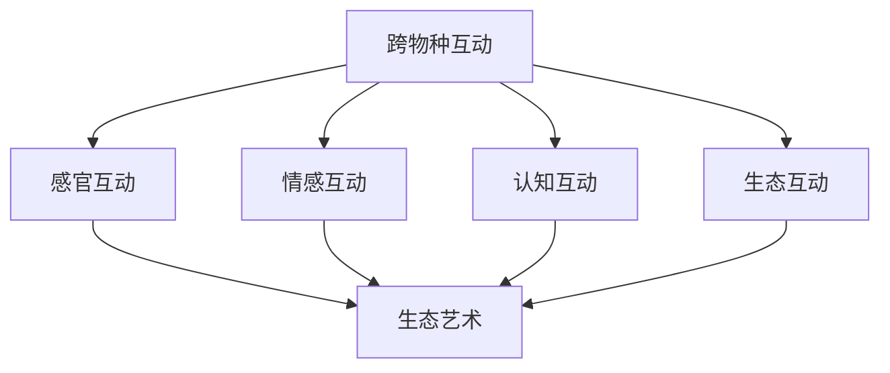

                 

### 《跨物种艺术节策划：超越人类中心的创意探索活动》

> 关键词：跨物种艺术节、创意探索、生态艺术、策划与组织、互动与挑战

> 摘要：本文深入探讨跨物种艺术节的策划与实践，从背景介绍、核心概念阐述到策划与组织方法，再到创意活动设计与跨物种互动的挑战，提供了全面的指南和实际案例，旨在推动跨物种艺术的创新与可持续发展。

---

## 引言与背景

随着人类社会对自然界的日益关注，艺术作为一种表达和反思的媒介，也开始超越传统的界限，探索与自然其他物种的互动与共生。跨物种艺术节便是这一趋势的产物，它不仅仅是一场视觉与听觉的盛宴，更是一次人类与自然深层次对话的平台。在这样的背景下，策划一场成功的跨物种艺术节，不仅需要独特的创意和精准的执行，还需要对跨物种互动和生态艺术有深刻的理解和实践。

### 跨物种艺术节的概念

跨物种艺术节，顾名思义，是一种跨越不同物种界限的艺术表现形式。它不仅包括人类艺术家的作品，还涵盖了许多非人类物种，如动物、植物和微生物的参与。这种艺术形式打破了传统人类中心的观念，将自然界的多样性融入艺术创作，为观众提供了一种全新的审美体验。跨物种艺术节常常以展览、表演、工作坊等形式呈现，旨在通过艺术的方式唤起人们对自然和生态的关注，激发跨物种之间的理解和尊重。

### 跨物种艺术节的背景

近年来，随着生态问题的加剧和环境意识的提升，人们越来越意识到人类与自然界的紧密联系。跨物种艺术节正是这一背景下诞生的，它不仅是对人类中心主义的一种挑战，也是对生态系统多样性和可持续性的积极探索。全球各地已经举办了许多成功的跨物种艺术节，如瑞典的“艺术与自然互动展”、德国的“生态艺术节”等，这些活动都在全球范围内产生了广泛的影响。

### 跨物种艺术节的重要性

跨物种艺术节的重要性体现在多个方面。首先，它为艺术家和非人类物种的互动提供了一个平台，使艺术家能够从非人类物种的角度思考问题，创作出更具深度和创意的作品。其次，它有助于提升公众的生态意识，通过艺术的方式让更多人关注生态环境，参与到保护自然的行动中来。此外，跨物种艺术节还能促进不同学科和领域的交流与合作，推动跨学科研究的发展。

### 总结

跨物种艺术节作为一种新兴的艺术形式，不仅丰富了艺术的表现形式，也为人类与自然的关系带来了新的视角。在接下来的章节中，我们将进一步探讨跨物种艺术节的策划、创意探索活动的设计、跨物种互动的挑战以及实际案例分析，为读者提供全面的指导。让我们一起走进这个充满创意和探索的艺术世界。

---

## 核心概念与联系

跨物种艺术节的成功离不开对核心概念的理解和把握。在这里，我们将探讨两个关键概念：跨物种互动和生态艺术，并使用Mermaid流程图展示它们之间的关系。

### 跨物种互动

#### 定义

跨物种互动是指不同物种之间的相互影响和相互作用。在跨物种艺术节中，这种互动主要体现在艺术家与自然物种（如动物、植物、微生物）之间的交流与合作。这种互动不仅限于视觉和听觉的体验，更包括情感、意识和认知层面的沟通。

#### 类型

跨物种互动可以分为以下几种类型：

1. **感官互动**：通过视觉、听觉、嗅觉等感官与动物或植物进行互动。
2. **情感互动**：艺术家通过情感表达与动物建立情感联系，如绘画、音乐等。
3. **认知互动**：艺术家通过思考、创作和实验探索动物或植物的行为模式，进行科学研究和艺术创作。
4. **生态互动**：艺术家通过创作和展示作品影响公众的生态意识，促进环境保护和可持续发展。

### 生态艺术

#### 概念

生态艺术是一种以生态学为基础的艺术形式，旨在通过艺术手段探索、表现和解决生态问题。生态艺术家常常关注环境、生态和可持续发展等主题，通过创作和实践促进公众对生态环境的认识和关注。

#### 生态艺术与跨物种互动的关系

生态艺术与跨物种互动有着密切的关系。一方面，生态艺术家通过跨物种互动获取创作灵感，将自然物种的元素融入艺术作品中；另一方面，生态艺术通过艺术形式展示跨物种互动的过程和结果，提升公众对生态问题的认识和关注。

### Mermaid流程图

为了更直观地展示跨物种互动和生态艺术之间的关系，我们使用Mermaid流程图进行描述。

在这个流程图中，我们可以看到，跨物种互动包括感官、情感、认知和生态互动四种类型，它们共同融入生态艺术，形成了一个有机的整体。

### 总结

跨物种互动和生态艺术是跨物种艺术节的核心概念，它们相互关联、相互影响，共同构成了跨物种艺术节的基础。在接下来的章节中，我们将进一步探讨如何策划和组织一场成功的跨物种艺术节，以及创意探索活动的设计和实施方法。通过深入理解和应用这些核心概念，我们有望推动跨物种艺术的发展，为人类与自然的关系带来新的希望和可能性。

---

## 策划与组织

策划和组织一场跨物种艺术节是一项复杂的任务，需要系统性的规划和精心设计。以下将详细讨论策划与组织的各个关键环节，包括时间表、预算、人力资源和场地选择。

### 艺术节策划

#### 策划步骤

1. **确定主题和目标**：首先，明确艺术节的主题和目标，如生态保护、物种共生等。这将为整个活动提供方向和核心思想。
2. **组建策划团队**：策划团队是艺术节成功的关键。团队成员应包括艺术家、生态学家、活动策划者、志愿者等，确保各方面的专业性和协调性。
3. **制定策划方案**：根据主题和目标，制定详细的策划方案，包括活动形式、内容、时间、地点等。
4. **市场调研和宣传**：进行市场调研，了解目标受众和市场需求，制定相应的宣传策略，确保艺术节能够吸引足够的关注和参与。

#### 策划团队的角色和职责

- **项目总监**：负责整体策划和协调，确保项目按计划进行。
- **艺术家协调员**：负责艺术家的招募和协调，确保艺术作品的质量和多样性。
- **生态学家顾问**：提供生态学知识和指导，确保活动的生态可持续性。
- **活动策划师**：负责具体活动的策划和实施，确保活动流程的顺利进行。
- **志愿者管理**：负责志愿者的招募、培训和调度，确保活动现场的秩序和服务质量。

### 艺术节组织

#### 时间表

制定详细的时间表，明确各个阶段的任务和时间节点，确保活动按计划进行。时间表应包括以下内容：

- **前期筹备**：确定主题、目标、策划方案，招募团队和志愿者。
- **宣传推广**：制定宣传策略，开展宣传活动，吸引目标受众。
- **现场准备**：布置场地、安装设备、准备物料等。
- **活动实施**：组织艺术表演、展览、工作坊等活动。
- **活动总结**：收集反馈、总结经验、评估效果。

#### 预算管理

预算管理是艺术节策划和组织中的重要环节。预算应包括以下几个方面：

- **场地租赁费**：根据活动规模和需求选择合适的场地，并支付租赁费用。
- **设备采购费**：包括音响、灯光、展览设备等。
- **艺术创作费**：支付艺术家的创作费用。
- **宣传推广费**：包括广告、印刷、网络推广等。
- **人力资源费**：支付策划团队、志愿者和工作人员的薪酬。
- **其他费用**：包括交通、住宿、餐饮等。

#### 人力资源规划

人力资源规划是确保艺术节顺利进行的重要保障。人力资源规划应包括以下几个方面：

- **团队搭建**：根据活动需求，搭建策划团队、艺术家团队、志愿者团队等。
- **人员培训**：为团队成员提供必要的培训和指导，确保其能够胜任各自职责。
- **人员调度**：根据活动安排，合理调度人员，确保活动现场的人力资源充足。

#### 场地选择

场地选择是艺术节策划和组织中的关键环节。场地应具备以下条件：

- **空间足够**：根据活动规模和需求，选择合适的场地，确保空间足够容纳观众和活动设施。
- **交通便利**：场地应位于交通便利的地区，便于观众参与和活动物资的运输。
- **设备齐全**：场地应具备完善的音响、灯光、展览等设备，确保活动顺利进行。
- **安全性**：场地应具备良好的安全措施，确保观众和参与者的安全。

### 总结

策划与组织一场跨物种艺术节需要全面的规划和精心设计。通过明确策划步骤、制定详细的时间表、合理管理预算、科学规划人力资源和精心选择场地，我们能够确保艺术节的成功举办，为观众带来一场难忘的跨物种艺术盛宴。在接下来的章节中，我们将进一步探讨如何设计创意探索活动，以及跨物种互动的挑战和策略。

---

## 创意探索活动

创意探索活动是跨物种艺术节的灵魂，它们不仅能够吸引观众，还能激发参与者对生态和物种多样性的思考。在本节中，我们将详细介绍创意活动的设计、实施和评估方法，帮助策划团队策划出既有吸引力又具有教育意义的跨物种艺术活动。

### 创意活动设计

#### 设计流程

1. **主题确定**：根据艺术节的整体主题，确定创意活动的具体主题。例如，可以选择“自然之声”、“物种共生”或“生态保护”等主题。
2. **目标受众**：明确活动的目标受众，如儿童、青少年、成人等。这将有助于设计出符合受众兴趣和需求的活动内容。
3. **内容策划**：围绕主题和目标受众，策划创意活动的内容。内容可以包括互动装置、表演、展览、工作坊等多种形式。
4. **技术需求**：评估创意活动所需的技术支持，如音响、灯光、多媒体设备等，并提前进行技术测试和准备。
5. **预算分配**：根据活动内容和技术需求，制定预算，合理分配资金。

#### 活动类型

1. **互动装置**：通过互动装置，观众可以与艺术作品进行互动，如触摸屏幕、感应装置等。这类活动能够吸引观众的兴趣，并让他们参与其中。
2. **表演**：表演可以是艺术家的现场表演，也可以是动物表演。表演形式多样，如音乐、舞蹈、戏剧等，能够为观众带来视听享受。
3. **展览**：展览可以展示艺术家创作的作品，也可以展示自然物种的样本和生态摄影作品。展览形式可以包括静态展览、动态展览等。
4. **工作坊**：工作坊是一种互动性很强的活动形式，观众可以亲自动手参与艺术创作或科学实验。工作坊可以增强观众对艺术和生态的理解和兴趣。

### 创意活动实施

#### 实施准备

1. **人员安排**：确保创意活动所需的工作人员到位，包括艺术家、技术人员、志愿者等。
2. **设备准备**：确保所有设备正常运行，包括音响、灯光、多媒体设备等。
3. **场地布置**：根据活动类型和需求，布置场地，确保活动环境舒适和安全。
4. **宣传推广**：通过社交媒体、官方网站、海报等多种渠道进行宣传，吸引观众参与。

#### 实施过程

1. **活动启动**：在活动开始前，进行简短的介绍和说明，确保观众了解活动内容和规则。
2. **活动进行**：根据活动设计，引导观众参与互动装置、表演、展览或工作坊。
3. **现场管理**：确保活动现场秩序良好，及时处理突发情况，保障观众的安全和体验。

#### 实施评估

1. **观众反馈**：通过问卷调查、访谈等方式收集观众的意见和建议，了解活动的效果和改进空间。
2. **数据统计**：统计活动参与人数、活动时长、设备运行状况等数据，为后续活动提供参考。

### 创意活动评估

#### 评估方法

1. **观众满意度调查**：通过问卷调查，了解观众对创意活动的满意度，包括活动内容、活动形式、组织管理等。
2. **活动效果评估**：根据活动目标，评估创意活动的效果，如观众参与度、教育效果、生态影响等。
3. **数据分析**：分析活动数据，如参与人数、活动时长、设备运行状况等，评估活动的实际效果。

#### 评估结果分析

1. **总结经验**：根据评估结果，总结活动的成功经验和不足之处，为后续活动提供参考。
2. **改进建议**：针对评估中发现的问题，提出具体的改进建议，如活动内容的调整、组织流程的优化等。
3. **持续改进**：根据改进建议，对后续活动进行优化和改进，不断提升创意活动的质量和效果。

### 总结

创意探索活动是跨物种艺术节的重要组成部分，它们不仅能够吸引观众，还能传递生态保护和物种多样性的重要信息。通过科学的设计、精细的实施和有效的评估，我们可以策划出既有吸引力又具有教育意义的跨物种艺术活动。在接下来的章节中，我们将进一步探讨跨物种互动的挑战和策略，为艺术节的成功举办提供更多的保障。

---

## 跨物种互动

跨物种互动是跨物种艺术节的核心，它不仅是艺术创作的来源，也是观众体验的重要组成部分。然而，跨物种互动面临诸多挑战，需要科学的管理和策略来确保活动的顺利进行和参与者的安全。

### 跨物种互动的挑战

#### 物种间的差异

跨物种互动中的物种差异是最大的挑战之一。不同物种在行为模式、感知能力、生存需求等方面存在显著差异。例如，动物可能对某些声音或光线敏感，植物则对水分和光照有特定的需求。艺术家和策划团队需要深入了解这些差异，确保互动活动的设计符合各物种的生理和心理特征。

#### 安全性问题

跨物种互动中，安全问题是首要考虑的因素。无论是人与动物的互动，还是人与植物的互动，都需要确保参与者的安全。例如，动物可能会因恐惧或受到威胁而攻击人类，植物也可能含有有毒成分。策划团队需要制定详细的安全预案，包括应急处理、设备检查、人员培训等。

### 跨物种互动策略

#### 设计交互方式

设计交互方式是跨物种互动的关键。艺术家和策划团队需要根据物种特征和互动目的，选择合适的交互方式。例如，可以通过触摸、声音、光线等非侵入性方式与动物互动，通过展示、讲解、实验等与植物互动。

#### 管理参与者的期望

管理参与者的期望是确保互动顺利进行的重要环节。观众对跨物种互动的期望可能各不相同，有的希望获得刺激和娱乐，有的希望获得知识和教育。策划团队需要通过宣传、引导和现场解释，明确互动活动的性质和目的，让参与者明白互动的本质和界限，避免不必要的误解和冲突。

### 互动保障措施

#### 安全培训

对参与互动的观众进行安全培训，教育他们如何正确地与动物或植物互动，了解潜在的威胁和如何避免。

#### 设备检测

对用于互动的设备进行定期检测和维修，确保设备的安全性和稳定性，防止设备故障导致的安全事故。

#### 环境控制

在互动活动中，通过环境控制措施，如声音调节、光线控制、温度调节等，营造一个舒适和安全的互动环境。

#### 应急预案

制定详细的应急预案，包括人员疏散、医疗救助、设备维修等，确保在突发情况下能够迅速响应和处理。

### 总结

跨物种互动是跨物种艺术节的核心，但同时也面临着诸多挑战。通过科学的设计、有效的管理和完善的安全保障措施，我们可以确保跨物种互动的顺利进行，为观众带来难忘的体验，同时也为艺术家和参与者提供广阔的创作和互动空间。在接下来的章节中，我们将通过实际案例展示跨物种艺术节的策划和执行过程，提供更多的实践经验和启示。

---

## 案例分析

在本章节中，我们将通过两个实际案例，展示跨物种艺术节的策划和执行过程。这两个案例分别代表了不同类型的跨物种艺术节，从策划到执行，为读者提供了宝贵的实践经验。

### 案例一：XX跨物种艺术节

#### 案例概述

XX跨物种艺术节是一次以“物种共生”为主题的大型跨物种艺术活动，吸引了来自全球的艺术家和参与者。该艺术节在自然保护区内举办，旨在通过艺术的形式唤起公众对生态环境保护的意识。

#### 策划与组织过程

1. **确定主题和目标**：XX跨物种艺术节的主题是“物种共生”，目标是提升公众的生态意识，促进人与自然的和谐共生。
2. **组建策划团队**：策划团队由生态学家、艺术家、活动策划师和志愿者组成，确保活动的科学性和艺术性。
3. **策划方案制定**：根据主题和目标，策划团队制定了详细的策划方案，包括艺术表演、互动装置、展览和工作坊等。
4. **市场调研与宣传**：通过社交媒体、官方网站和线下宣传活动，吸引目标受众参与。
5. **场地选择**：选择自然保护区的开阔场地，确保活动的环境和安全性。

#### 创意活动展示

1. **互动装置**：设计了一系列互动装置，如触摸植物的声音互动装置、感应动物的行为互动装置，观众可以通过与装置互动，了解物种间的互动关系。
2. **艺术表演**：艺术家们表演了以生态为主题的音乐、舞蹈和戏剧，通过艺术的形式表达对生态环境的关注和思考。
3. **展览**：展示了艺术家创作的生态艺术作品，包括绘画、雕塑、摄影等，展现了人与自然之间的美好共生。
4. **工作坊**：举办了多种工作坊，如植物手工艺、动物行为观察等，让观众亲身体验与自然互动的乐趣。

#### 结果分析

XX跨物种艺术节取得了显著的成果，吸引了大量观众参与，提高了公众的生态意识。观众反馈表明，活动不仅有趣，还能引发深刻的思考，对跨物种艺术和生态保护有了更深入的了解。

### 案例二：YY跨物种艺术节

#### 案例概述

YY跨物种艺术节是一次以“生态艺术”为主题的国际性艺术节，吸引了来自世界各地的艺术家和学者。该艺术节在城市公园内举办，通过艺术与生态的结合，探讨城市生态问题。

#### 策划与组织过程

1. **确定主题和目标**：YY跨物种艺术节的主题是“生态艺术”，目标是通过艺术的形式探索城市生态问题，提高公众对城市生态的关注。
2. **组建策划团队**：策划团队由生态学家、艺术家、城市规划师和志愿者组成，确保活动的科学性和艺术性。
3. **策划方案制定**：根据主题和目标，策划团队制定了详细的策划方案，包括艺术装置、公共艺术、艺术讲座等。
4. **市场调研与宣传**：通过线上线下多种渠道进行宣传，吸引艺术爱好者和生态保护人士参与。
5. **场地选择**：选择城市公园作为活动场地，既符合生态艺术的主题，又方便观众参与。

#### 创意活动展示

1. **艺术装置**：艺术家们在公园内安装了一系列生态艺术装置，如植物感应灯、动物行为互动装置等，展现了艺术与生态的结合。
2. **公共艺术**：在公园内举办了大型公共艺术展览，展示了艺术家们创作的生态艺术作品，吸引了大量观众。
3. **艺术讲座**：邀请了生态学家、艺术家和城市规划师进行讲座，探讨城市生态问题，分享生态艺术的经验和见解。
4. **互动活动**：组织了多种互动活动，如植物种植、动物行为观察等，让观众亲身体验生态艺术。

#### 结果分析

YY跨物种艺术节取得了巨大的成功，不仅吸引了大量观众，还引起了媒体和学术界的广泛关注。观众反馈表明，活动内容丰富多样，既有趣又有教育意义，对城市生态问题和生态艺术有了更深入的了解。

### 总结

通过这两个实际案例，我们可以看到跨物种艺术节的策划和执行需要充分考虑生态主题、观众需求和场地条件。成功的跨物种艺术节不仅能够吸引观众，还能提高公众的生态意识，推动生态保护事业的发展。在未来的策划和执行中，我们可以借鉴这些案例的经验，不断提升跨物种艺术节的质量和影响力。

---

## 评估与未来展望

跨物种艺术节的成功不仅体现在活动的举办过程和观众反馈中，还需要通过系统的评估来衡量其社会和环境效益。评估的结果不仅有助于总结经验，还能为未来的艺术节策划提供宝贵的参考。以下是对跨物种艺术节影响评估、效果评估和未来发展趋势的探讨。

### 艺术节影响评估

#### 影响评估标准

影响评估是衡量艺术节对社会、文化和环境等各方面产生的影响。以下是一些常用的评估标准：

1. **参与度**：参与人数、参与频率、参与满意度等。
2. **影响力**：媒体报道次数、社交媒体互动量、专家评价等。
3. **教育效果**：公众对生态保护知识的了解程度、参与者的学习体验等。
4. **环境效益**：对生态环境的改善、资源的合理利用等。
5. **社区互动**：社区参与度、居民满意度等。

#### 影响评估方法

1. **问卷调查**：通过问卷调查收集观众和参与者的意见和建议，评估活动的参与度和影响力。
2. **访谈**：与观众、参与者、策划团队和志愿者进行深入访谈，了解活动的具体影响。
3. **数据收集**：收集活动相关数据，如参与人数、媒体报道次数、社交媒体互动量等，进行定量分析。
4. **专家评审**：邀请相关领域的专家对活动进行评审，提供专业意见。

### 效果评估

#### 效果评估标准

效果评估主要关注艺术节的实际效果，包括艺术创作、观众体验、活动组织等方面。以下是一些常用的评估标准：

1. **艺术创作效果**：艺术作品的创意程度、技术难度、艺术价值等。
2. **观众体验**：观众的满意度、参与感受、学习收获等。
3. **活动组织效果**：活动流程的流畅性、场地布置、技术支持、安全保障等。
4. **社会效益**：对公众生态意识的影响、社会问题的探讨等。

#### 效果评估方法

1. **观众反馈**：通过问卷调查、访谈等方式收集观众的意见和反馈，了解活动效果。
2. **数据分析**：对活动数据进行分析，如参与人数、媒体报道次数、社交媒体互动量等。
3. **比较分析**：将本次艺术节的成果与之前的活动进行比较，评估改进情况。
4. **专家评审**：邀请相关领域的专家对活动效果进行评审，提供专业意见。

### 未来发展趋势

#### 跨物种艺术的发展方向

随着科技的进步和环保意识的提升，跨物种艺术的发展趋势主要体现在以下几个方面：

1. **科技融合**：利用虚拟现实、增强现实、物联网等新技术，增强跨物种互动的体验感和科技感。
2. **生态融合**：将跨物种艺术与生态保护、可持续发展等主题紧密结合，推动生态艺术的创新发展。
3. **公众参与**：鼓励公众参与跨物种艺术的创作和互动，提高公众的生态意识和环保行动。

#### 跨物种艺术节的挑战与机遇

1. **挑战**：跨物种艺术节面临物种差异、安全性、参与度等方面的挑战。需要加强科学研究和实践，提升互动活动的质量和效果。
2. **机遇**：随着生态问题的日益突出，跨物种艺术节具有广阔的发展前景。通过创新和合作，可以打造出更多具有影响力和品牌效应的跨物种艺术节。

### 总结

跨物种艺术节作为一种新兴的艺术形式，具有重要的社会和文化意义。通过系统的评估和未来的创新实践，我们可以不断提升跨物种艺术节的质量和影响力，为人类与自然的和谐共生贡献更多力量。

---

## 最佳实践 Tips、小结与注意事项

### 最佳实践 Tips

1. **主题明确**：确保艺术节的主题清晰明确，有助于策划和吸引受众。
2. **科学策划**：充分研究和了解跨物种互动的原理和技巧，科学策划活动内容。
3. **安全第一**：重视参与者的安全，制定详细的安全预案和保障措施。
4. **互动创新**：尝试使用新技术和互动方式，提高活动的趣味性和科技感。
5. **公众参与**：鼓励公众参与，提高活动的参与度和影响力。

### 小结

跨物种艺术节作为一种创新的生态艺术形式，通过跨物种互动和创意探索，不仅丰富了艺术表现形式，还提升了公众的生态意识。成功的跨物种艺术节需要科学的策划、精心的组织和有效的评估，同时也需要不断创新和尝试。

### 注意事项

1. **确保安全性**：在策划和执行过程中，始终将安全放在首位，确保参与者、动物和植物的安全。
2. **合理预算**：合理分配预算，确保活动各环节的资金充足。
3. **人员培训**：对策划团队和志愿者进行充分的培训和指导，确保他们能够胜任各自职责。
4. **宣传推广**：通过多种渠道进行宣传，提高艺术节的知名度。
5. **环境友好**：在活动设计和实施过程中，充分考虑环境保护，减少对自然环境的负面影响。

### 拓展阅读

1. **生态艺术理论**：深入了解生态艺术的原理和流派，有助于更好地策划跨物种艺术节。
2. **跨学科研究**：探索生态学、艺术学、计算机科学等学科在跨物种艺术节中的应用，提高活动的科学性和创新性。
3. **国际案例**：研究国际知名的跨物种艺术节案例，借鉴其成功经验和创新思路。

通过不断学习和实践，我们可以为跨物种艺术节的发展贡献更多的智慧和力量。

---

## 作者信息

作者：AI天才研究院/AI Genius Institute & 禅与计算机程序设计艺术 /Zen And The Art of Computer Programming

在这篇技术博客文章中，我们深入探讨了跨物种艺术节的策划与执行，从核心概念的阐述到创意活动的设计，再到跨物种互动的挑战与策略，以及实际案例的分析和未来展望。通过这篇文章，我们不仅了解了跨物种艺术节的重要性和多样性，还学习到了如何策划一场成功的跨物种艺术节。

作者AI天才研究院（AI Genius Institute）致力于推动人工智能技术的前沿研究与应用，而《禅与计算机程序设计艺术》（Zen And The Art of Computer Programming）则展示了计算机编程的哲学和艺术。两者结合，旨在通过技术手段和创新思维，探索和推动艺术与科技的交汇，为读者带来更有深度和启发性的内容。

感谢您花时间阅读这篇文章，希望您在跨物种艺术的世界中找到了新的灵感和思考。如果您有任何问题或反馈，欢迎在评论区留言，我们期待与您进一步交流。

再次感谢您的阅读，希望这篇文章能为您带来启发和帮助。祝您在探索艺术与科技的道路上越走越远，不断收获新的成就和惊喜！

