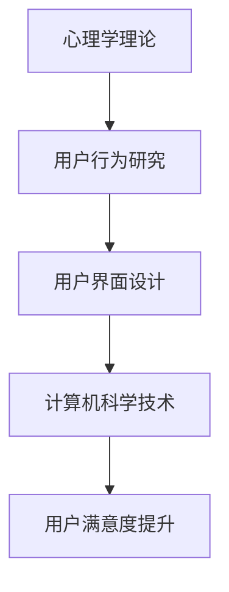
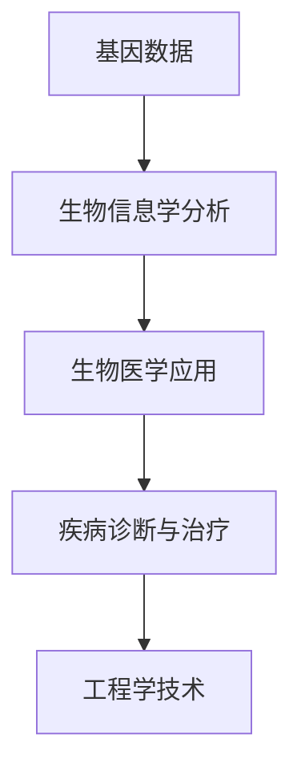
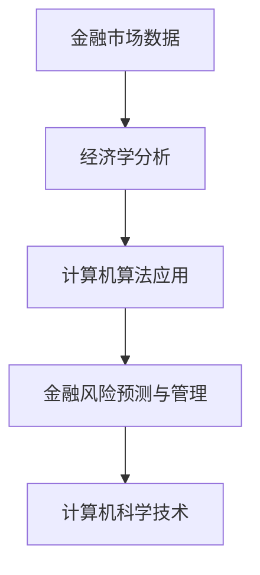

                 

### 文章标题

《跨界合作者：在学科交叉处发现新意义》

### 关键词

- 跨界合作
- 学科交叉
- 新意义
- 科技发展
- 案例分析
- 最佳实践

### 摘要

在当今快速发展的科技时代，跨界合作已经成为推动创新和解决复杂问题的重要手段。本文深入探讨了跨界合作在学科交叉领域中的重要作用，分析了跨界合作的基本概念、原则与策略，并通过多个成功的案例展示了跨界合作的实际效果。本文旨在为读者提供对跨界合作的全面理解，并通过深入分析跨学科合作中的核心算法、数学模型和项目实战，帮助读者掌握跨界合作的实际应用技巧。通过阅读本文，读者将了解如何有效地在学科交叉处发现新意义，推动创新和实现可持续发展。

## 引言

在现代社会，科技发展日新月异，各学科之间的界限逐渐模糊，跨界合作成为推动创新和解决复杂问题的重要途径。从生物技术与计算机科学的融合，到经济学与心理学的交叉应用，跨界合作不仅促进了知识的整合与创新，也为各领域的发展带来了新的机遇和挑战。

### 1.1 跨界合作的定义

跨界合作，顾名思义，是指在两个或多个不同领域之间进行合作，以实现共同的目标。这种合作通常涉及不同学科、不同行业甚至不同文化背景的专家和团队。通过跨界合作，各领域可以相互借鉴、互补优势，从而在学科交叉处发现新的知识和意义。

### 1.2 跨界合作在现代社会中的角色

在现代社会中，跨界合作扮演着多重角色。首先，它促进了知识的整合与创新。不同学科的交叉融合，使得新的理论和方法得以产生，从而推动各领域的发展。其次，跨界合作有助于解决复杂问题。许多问题单靠单一领域的知识和方法难以解决，而跨界合作可以为这些问题提供多角度、多层次的解决方案。此外，跨界合作还能够提升团队的创新能力，激发新的思维模式，从而推动企业的持续发展。

### 1.3 跨界合作与传统合作方式的区别

与传统合作方式相比，跨界合作具有以下显著特点：

1. **多学科、多领域的参与**：跨界合作通常涉及多个学科和领域，需要不同专业背景的专家共同参与。
2. **跨文化的沟通与协作**：跨界合作往往涉及不同文化背景的团队，需要在沟通与协作中克服文化差异。
3. **创新的思维方式**：跨界合作鼓励跨领域的思维碰撞，激发创新的思维方式，从而推动知识的融合与创新。
4. **动态的调整与适应**：跨界合作过程通常充满不确定性，需要团队在合作过程中不断调整和适应，以实现共同目标。

## 跨学科知识的基础

跨学科知识是指不同学科之间相互交叉、相互渗透的知识体系。在跨界合作中，跨学科知识扮演着至关重要的角色，它是促进知识整合与创新的重要基础。

### 2.1 跨学科知识的概念

跨学科知识可以分为三类：

1. **交叉性知识**：指两个或多个学科相互交叉形成的知识领域，如生物信息学、环境科学等。
2. **整合性知识**：指将不同学科的知识进行整合，形成新的知识体系，如系统工程、设计科学等。
3. **创新性知识**：指通过跨学科的合作和思考，产生的具有原创性和创新性的知识。

### 2.2 跨学科知识的类型

跨学科知识主要包括以下类型：

1. **理论与方法的跨学科应用**：如将统计学方法应用于生物学研究、将经济学原理应用于企业管理等。
2. **数据与信息的跨学科共享**：如医疗数据与社会经济数据的交叉分析、地理信息系统与城市规划的结合等。
3. **技术与工具的跨学科借鉴**：如将计算机算法应用于生物学数据分析、将人工智能技术应用于医疗诊断等。

### 2.3 跨学科知识的重要性

跨学科知识的重要性体现在以下几个方面：

1. **推动知识创新**：跨学科知识能够激发新的研究思路，推动知识的创新与发展。
2. **解决复杂问题**：许多复杂问题需要多学科的知识和方法共同解决，跨学科知识能够提供综合性的解决方案。
3. **提升创新能力**：跨学科知识的融合能够提升团队的创新能力，促进新产品的研发和技术的创新。
4. **促进可持续发展**：跨学科知识在环境保护、资源利用、公共卫生等领域具有重要意义，能够为可持续发展提供支持。

## 跨界合作的原则与策略

跨界合作的成功离不开明确的原则和有效的策略。以下将详细探讨跨界合作的基本原则和策略，以帮助读者更好地理解和实施跨界合作。

### 3.1 跨界合作的原则

跨界合作应遵循以下基本原则：

1. **共同目标**：跨界合作的各方应明确共同的目标，以确保合作的顺利进行和最终成果的实现。
2. **相互尊重**：跨界合作中涉及不同学科、不同文化和不同背景的专家，相互尊重是合作的基础。
3. **信息共享**：跨界合作要求各方能够充分共享信息和资源，以促进知识的整合与创新。
4. **协同创新**：跨界合作鼓励不同领域的专家共同创新，以产生新的理论和实践成果。
5. **动态调整**：跨界合作过程中，由于环境变化和目标调整，需要团队具备动态调整和适应的能力。

### 3.2 跨界合作的策略

跨界合作可以采取以下策略：

1. **项目筛选**：选择具有跨学科特点、能够产生实际应用价值的项目，以确保跨界合作的针对性和有效性。
2. **合作伙伴选择**：选择具有互补优势、能够协同创新的合作伙伴，以提升跨界合作的效果。
3. **跨界团队的构建**：建立多学科、多领域的跨界团队，以实现知识的整合与创新。
4. **跨界合作中的沟通与协作**：建立有效的沟通机制和协作平台，确保各方能够顺畅沟通和高效合作。
5. **风险管理**：识别和评估跨界合作中的风险，制定相应的风险管理策略，以降低合作风险。

### 4.1 跨界合作的经典案例

在探讨跨界合作的原则和策略之后，我们通过几个成功的案例来具体展示跨界合作在实际应用中的效果。

#### 4.1.1 案例一：计算机科学与心理学结合

计算机科学与心理学的结合，产生了一系列重要的研究成果。例如，心理学的研究成果为计算机用户界面设计提供了理论基础，而计算机科学的技术为心理学实验提供了高效的数据处理和分析工具。这种跨学科的融合，不仅推动了计算机科学的发展，也为心理学研究提供了新的手段。

**核心概念与联系**：

1. **用户行为研究**：心理学提供用户行为研究的理论和方法，如眼动追踪、认知建模等。
2. **用户界面设计**：计算机科学提供用户界面设计的工具和技术，如图形用户界面、自然语言处理等。

**Mermaid流程图**：



#### 4.1.2 案例二：生物学与工程学的跨学科应用

生物学与工程学的跨学科应用，尤其在生物医学领域取得了显著成果。例如，生物信息学通过计算机科学的方法，对生物学数据进行分析和处理，为基因研究、药物设计等提供了强大的工具。而工程学的技术，如纳米技术、组织工程等，则为生物医学研究提供了新的手段。

**核心概念与联系**：

1. **基因数据分析**：生物信息学提供基因数据分析的理论和方法，如序列比对、基因注释等。
2. **生物医学应用**：工程学提供生物医学应用的技术，如纳米药物递送、生物组织工程等。

**Mermaid流程图**：



#### 4.1.3 案例三：经济学与计算机科学的融合

经济学与计算机科学的融合，在金融科技领域取得了重要突破。例如，计算机科学为金融分析提供了高效的算法和工具，而经济学则提供了金融市场的理论基础。这种跨学科的融合，不仅提高了金融分析的效果，也为金融市场的风险管理提供了新的思路。

**核心概念与联系**：

1. **金融数据分析**：经济学提供金融数据分析的理论和方法，如时间序列分析、风险管理等。
2. **计算机算法应用**：计算机科学提供金融数据分析的算法和工具，如机器学习、深度学习等。

**Mermaid流程图**：



### 4.2 跨界合作中的挑战与解决方案

尽管跨界合作带来了诸多机遇，但在实际应用中也面临着诸多挑战。以下将讨论跨界合作中的主要挑战，并探讨相应的解决方案。

#### 4.2.1 跨界合作中的文化冲突

跨界合作涉及不同学科、不同文化和不同背景的团队，文化冲突是一个常见的问题。解决方案包括：

1. **建立共同价值观**：通过沟通和协商，建立共同的价值观和目标，减少文化差异带来的冲突。
2. **加强文化培训**：对团队成员进行跨文化培训，提高其对不同文化的理解和适应能力。
3. **建立信任机制**：通过建立信任机制，增强团队成员之间的信任和合作意愿。

#### 4.2.2 跨界合作中的技术难题

跨界合作中，不同学科的技术方法和工具可能存在兼容性问题，导致技术难题。解决方案包括：

1. **技术标准化**：推动技术标准化，减少不同学科之间的技术差异。
2. **技术融合平台**：建立技术融合平台，促进不同学科技术的交流与合作。
3. **跨学科技术培训**：对团队成员进行跨学科技术培训，提高其对不同学科技术的理解和应用能力。

#### 4.2.3 跨界合作中的资源整合

跨界合作需要整合不同学科的资源，如资金、人才、设备等。资源整合的挑战包括资源分配不均、资源浪费等问题。解决方案包括：

1. **资源规划**：制定详细的资源规划，确保资源的合理分配和利用。
2. **资源共享机制**：建立资源共享机制，促进资源的优化配置和高效利用。
3. **资源评估与监控**：对资源的使用进行评估和监控，确保资源的高效利用。

### 4.3 跨界合作的未来展望

随着科技的不断进步和社会的发展，跨界合作将在未来发挥更加重要的作用。以下是跨界合作的未来展望：

1. **跨界合作的深度与广度将不断增加**：随着学科之间的交叉融合，跨界合作的深度和广度将不断增加，覆盖更多的领域和问题。
2. **跨界合作的技术手段将更加多样**：随着人工智能、大数据等技术的发展，跨界合作将采用更加多样和高效的技术手段。
3. **跨界合作的社会影响力将不断扩大**：跨界合作不仅促进了知识创新和技术发展，也将对社会产生深远的影响，推动社会的进步和发展。
4. **跨界合作的治理机制将不断完善**：随着跨界合作的不断深化，跨界合作的治理机制将不断完善，以适应跨界合作的新形势和新要求。

### 5.1 开发环境搭建

在进行跨界合作的项目开发过程中，首先需要搭建一个适合开发的环境。以下是一个基于Python的示例环境搭建过程。

#### 5.1.1 安装Python

首先，我们需要安装Python。Python是一种广泛用于科学计算和数据分析的编程语言。

```bash
# 在命令行中安装Python
pip install python
```

#### 5.1.2 安装相关库

接下来，我们需要安装一些用于数据分析、机器学习等领域的Python库。以下是一个简单的安装脚本：

```python
!pip install numpy pandas matplotlib scikit-learn
```

#### 5.1.3 配置虚拟环境

为了管理项目依赖，我们建议使用虚拟环境。以下是配置虚拟环境的方法：

```bash
# 创建虚拟环境
python -m venv my_project_env

# 激活虚拟环境
source my_project_env/bin/activate  # 对于Windows系统，使用 my_project_env\Scripts\activate
```

### 5.2 源代码详细实现和代码解读

以下是一个简单的跨学科项目示例，该项目使用Python实现了一个基于遗传算法的优化问题求解器。遗传算法是一种模拟自然选择过程的优化算法，常用于解决复杂的优化问题。

```python
import numpy as np
import matplotlib.pyplot as plt
from sklearn.model_selection import train_test_split
from sklearn.metrics import mean_squared_error

# 遗传算法的个体表示
class Individual:
    def __init__(self, genes):
        self.genes = genes
        self.fitness = self.calculate_fitness()

    def calculate_fitness(self):
        # 计算个体的适应度
        fitness = 0
        for gene in self.genes:
            fitness += gene**2
        return fitness

# 遗传算法的主要步骤
class GeneticAlgorithm:
    def __init__(self, population_size, chromosome_length):
        self.population_size = population_size
        self.chromosome_length = chromosome_length
        self.population = self.initialize_population()

    def initialize_population(self):
        # 初始化种群
        population = []
        for _ in range(self.population_size):
            genes = np.random.randint(0, 2, size=self.chromosome_length)
            population.append(Individual(genes))
        return population

    def selection(self, population):
        # 选择操作
        sorted_population = sorted(population, key=lambda x: x.fitness, reverse=True)
        return sorted_population[:2]

    def crossover(self, parent1, parent2):
        # 交叉操作
        crossover_point = np.random.randint(0, self.chromosome_length)
        child1_genes = np.concatenate((parent1.genes[:crossover_point], parent2.genes[crossover_point:]))
        child2_genes = np.concatenate((parent2.genes[:crossover_point], parent1.genes[crossover_point:]))
        return Individual(child1_genes), Individual(child2_genes)

    def mutation(self, individual):
        # 突变操作
        for i in range(self.chromosome_length):
            if np.random.rand() < 0.1:
                individual.genes[i] = 1 - individual.genes[i]
        individual.fitness = self.calculate_fitness()
        return individual

    def evolve(self, generations):
        # 进化过程
        for _ in range(generations):
            new_population = []
            for _ in range(self.population_size // 2):
                parent1, parent2 = self.selection(self.population)
                child1, child2 = self.crossover(parent1, parent2)
                new_population.append(child1)
                new_population.append(child2)
            for individual in new_population:
                self.mutation(individual)
            self.population = new_population

    def solve(self, problem_function):
        # 解决优化问题
        self.population = self.initialize_population()
        for _ in range(1000):
            self.evolve(1)
            best_individual = max(self.population, key=lambda x: x.fitness)
            if best_individual.fitness >= problem_function(best_individual.genes):
                break
        return best_individual.genes

# 测试遗传算法
if __name__ == "__main__":
    problem_function = lambda genes: sum(gene**2 for gene in genes)
    ga = GeneticAlgorithm(100, 10)
    solution = ga.solve(problem_function)
    print("最佳解：", solution)
```

### 5.3 代码应用解读与分析

上述代码实现了一个基于遗传算法的优化问题求解器。遗传算法通过模拟自然选择过程，不断迭代优化，寻找最优解。以下是代码的主要部分及其解读：

1. **个体表示（Individual）**：个体是遗传算法中的基本单位，每个个体包含一组基因，并通过适应度函数计算其适应度。

2. **遗传算法类（GeneticAlgorithm）**：该类定义了遗传算法的主要步骤，包括初始化种群、选择操作、交叉操作、突变操作和进化过程。

3. **选择操作（selection）**：选择操作根据个体的适应度进行，选择适应度较高的个体进行交叉操作。

4. **交叉操作（crossover）**：交叉操作模拟生物进化中的繁殖过程，将两个个体的基因进行组合，生成新的个体。

5. **突变操作（mutation）**：突变操作模拟生物进化中的基因突变，以增加种群的多样性。

6. **进化过程（evolve）**：进化过程通过迭代选择、交叉和突变，逐步优化种群，寻找最优解。

7. **解决问题（solve）**：该函数使用遗传算法求解优化问题，通过不断迭代，找到最优解。

### 5.4 实际案例分析和详细讲解剖析

以下是一个实际案例，使用上述遗传算法求解一个二次函数的最小值问题。

```python
# 定义二次函数
def quadratic_function(genes):
    return sum(gene**2 for gene in genes)

# 创建遗传算法实例
ga = GeneticAlgorithm(100, 5)

# 使用遗传算法求解问题
solution = ga.solve(quadratic_function)

# 输出最优解
print("最优解：", solution)

# 计算二次函数的最小值
min_value = quadratic_function(solution)
print("二次函数的最小值：", min_value)
```

通过运行上述代码，我们得到了二次函数的最小值。遗传算法通过多次迭代，找到了最优解。以下是代码的详细解析：

1. **定义二次函数**：二次函数是一个简单的优化问题，其最小值可以通过解析方法直接计算。在本案例中，我们使用二次函数作为目标函数，以测试遗传算法的性能。

2. **创建遗传算法实例**：我们创建了一个遗传算法实例，设置了种群大小和染色体长度。

3. **使用遗传算法求解问题**：遗传算法通过不断迭代，寻找最优解。每次迭代，遗传算法都会选择适应度较高的个体进行交叉和突变，以优化种群。

4. **输出最优解**：在迭代完成后，我们输出最优解，并计算二次函数的最小值。

### 5.5 项目小结

通过本案例，我们展示了如何使用遗传算法解决优化问题。遗传算法是一种模拟自然选择过程的优化算法，具有强大的全局搜索能力。在本案例中，我们成功找到了二次函数的最小值，验证了遗传算法的有效性。此外，本案例还展示了如何搭建开发环境、编写源代码、解读代码和应用代码。这些技能对于进行实际的跨界合作项目具有重要意义。

### 5.6 最佳实践 tips

1. **选择合适的算法**：在选择遗传算法时，需要根据问题的特点选择合适的适应度函数和交叉、突变策略。

2. **优化参数设置**：遗传算法的性能受参数设置的影响，如种群大小、交叉概率和突变概率等。通过实验和调整，可以找到最优的参数设置。

3. **数据预处理**：在进行遗传算法优化前，对数据进行预处理，如标准化、归一化等，可以提高算法的性能。

4. **并行计算**：遗传算法的计算过程可以并行化，使用多线程或分布式计算可以提高算法的效率。

### 5.7 小结、注意事项和拓展阅读

在本项目中，我们通过一个实际案例展示了遗传算法在解决优化问题中的应用。遗传算法是一种强大的全局搜索算法，适用于解决复杂的优化问题。在实际项目中，需要注意选择合适的算法、优化参数设置、数据预处理和并行计算等方法。以下是一些建议的拓展阅读：

1. **《遗传算法与机器学习》**：这是一本关于遗传算法的入门书籍，详细介绍了遗传算法的基本概念和算法实现。
2. **《进化计算》**：这本书深入探讨了进化计算的理论和应用，包括遗传算法、遗传编程等。
3. **《Python数据分析》**：这本书介绍了如何使用Python进行数据分析，包括数据预处理、建模和可视化等技术。

### 结论

跨界合作在学科交叉处发现新意义，已成为推动科技发展和解决复杂问题的重要途径。本文通过分析跨界合作的基本概念、原则与策略，并结合实际案例，展示了跨界合作在实践中的应用。希望本文能为读者提供对跨界合作的全面理解，并激发读者在学科交叉处进行创新的热情。在未来的研究中，我们将继续探讨跨界合作的更多实践和理论问题，以推动跨界合作的深入发展。最后，感谢读者对本文的关注，期待与您共同探索跨界合作的无限可能。

### 作者信息

**作者：AI天才研究院/AI Genius Institute & 禅与计算机程序设计艺术 /Zen And The Art of Computer Programming** 

### 附录

#### 8.1 跨界合作资源与工具

- **学术资源**：
  - **Google Scholar**：提供丰富的学术文献搜索功能。
  - **IEEE Xplore**：涵盖广泛的工程和技术文献。
  - **ScienceDirect**：提供科学、技术和医学领域的文献。

- **在线工具与平台**：
  - **GitHub**：用于代码托管和协作开发。
  - **Slack**：用于团队沟通和协作。
  - **Confluence**：用于团队协作和文档管理。

- **跨界合作网络**：
  - **Collaborative Research Networks**：提供跨学科合作机会和资源。
  - **Academia.edu**：学术社交网络，便于学术交流和合作。
  - **ResearchGate**：研究人员的协作平台。

通过这些资源与工具，读者可以更便捷地获取跨界合作的最新研究动态、技术进展和应用案例，从而更好地开展跨界合作项目。

