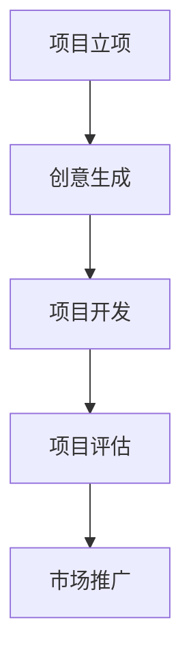
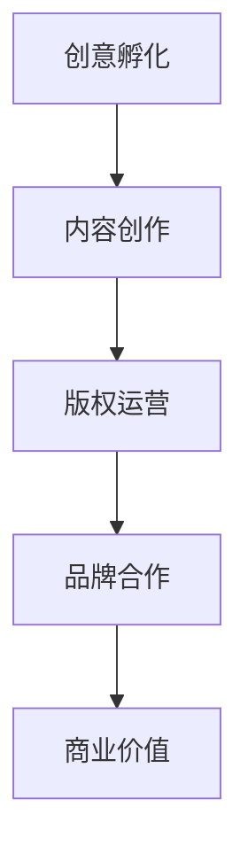

                 

### 文章标题

# 跨界艺术孵化器：打破传统界限的创意中心

### 关键词

- 跨界艺术
- 创意中心
- 孵化器
- 数字技术
- 艺术与科技融合
- 商业模式
- 项目实战

### 摘要

本文探讨了跨界艺术孵化器作为一种新兴的创意中心，如何打破传统艺术与科技之间的界限，推动艺术创新与产业发展。首先，我们介绍了跨界艺术的定义与背景，分析了艺术与文化、艺术与技术的联系。接着，详细讲解了跨界艺术孵化器的核心算法原理、数学模型，并通过实际案例展示了孵化器的项目实战。最后，本文探讨了跨界艺术孵化器在商业中的应用，提出了未来发展展望和运营策略。

## 第1章 跨界艺术与创意中心的定义与背景

### 1.1 跨界艺术的定义

跨界艺术是一种将不同领域、不同媒介、不同风格和不同思维方式融合的艺术形式。它突破了传统艺术的边界，将绘画、雕塑、音乐、舞蹈、戏剧等多种艺术形式相互融合，创造出全新的艺术体验。跨界艺术的特点在于其多样性、创新性和互动性，它不仅挑战了传统艺术的创作方法和审美观念，还丰富了艺术的表现形式和内容。

### 1.2 创意中心的背景

创意中心是指为艺术家、设计师、程序员等创意工作者提供资源共享、交流合作和创新氛围的场所。创意中心的出现，旨在推动艺术、设计、科技等领域的创新与发展。随着数字化技术的不断发展，创意中心逐渐成为跨界艺术发展的重要支撑，它为艺术家提供了更多的创作工具和资源，也为跨界艺术孵化器提供了良好的成长环境。

### 1.3 跨界艺术在现代社会中的地位与作用

跨界艺术在现代社会中具有重要地位和作用。首先，跨界艺术为艺术创作者提供了广阔的创作空间和多样的表现手段，激发了艺术创新的活力。其次，跨界艺术打破了艺术与科技、商业之间的界限，推动了艺术与科技、商业的深度融合，为艺术产业带来了新的发展机遇。最后，跨界艺术丰富了人们的精神生活，提升了社会的审美水平和文化素养。

## 第2章 跨界艺术的核心概念与联系

### 2.1 艺术与文化

艺术与文化是密不可分的，艺术是文化的重要组成部分，而文化则是艺术创作的源泉。艺术通过视觉、听觉、触觉等方式传达文化内涵，反映社会生活。同时，文化为艺术提供了丰富的素材和灵感，使艺术作品更加丰富和多元。艺术与文化的联系主要体现在以下几个方面：

1. **文化传承**：艺术作品是文化传承的重要载体，通过艺术表现，传统文化得以延续和发扬。
2. **文化多样性**：艺术展示了不同文化的独特魅力，促进了文化的交流与融合。
3. **文化表达**：艺术是文化表达的一种形式，它反映了社会的价值观念、审美趣味和精神风貌。

### 2.2 艺术与技术

艺术与技术的融合是跨界艺术的核心特征之一。数字技术、虚拟现实、增强现实等现代科技为艺术创作提供了全新的工具和方法。艺术与技术的关系可以从以下几个方面来理解：

1. **艺术表现**：技术为艺术创作提供了丰富的表现手段，如数字绘画、3D建模等。
2. **艺术创新**：技术的进步推动了艺术创新，为艺术创作带来了更多的可能性和灵感。
3. **艺术互动**：技术使艺术作品更具互动性，观众可以通过技术与艺术作品进行互动，改变了传统的艺术欣赏方式。

### 2.3 艺术与商业

艺术与商业的融合是跨界艺术发展的重要趋势。艺术作品不再仅仅是艺术品，也逐渐成为商业产品。艺术与商业的关系可以从以下几个方面来理解：

1. **商业模式**：艺术作品通过市场运作，实现了商业价值。
2. **品牌营销**：艺术家和艺术作品成为品牌形象的代表，为品牌营销提供了新的手段。
3. **产业融合**：艺术与商业的融合，推动了文化产业的发展，为经济增长注入了新动力。

## 第3章 跨界艺术孵化器的工作原理

### 3.1 跨界艺术孵化器的架构

跨界艺术孵化器的架构主要包括以下几个模块：

1. **创意输入模块**：收集艺术创作的创意和灵感，为孵化器提供内容基础。
2. **技术支持模块**：提供数字技术、虚拟现实、增强现实等支持，为艺术创作提供工具。
3. **资源管理模块**：整合各类资源，包括资金、场地、设备等，为艺术创作提供保障。
4. **交流合作模块**：促进艺术家、设计师、程序员等各方的交流合作，提升创作效果。
5. **市场推广模块**：推广艺术作品，实现商业价值。

### 3.2 跨界艺术孵化器的核心算法原理

跨界艺术孵化器的核心算法原理主要包括以下几个部分：

1. **创意生成算法**：利用机器学习等技术，自动生成创意，为艺术创作提供灵感。
2. **协同创作算法**：通过分布式算法，实现多个艺术家或设计师的协同创作。
3. **优化算法**：对艺术作品进行优化，提高艺术效果和市场价值。

以下是一个简单的协同创作算法的伪代码示例：

```python
function collaborative_creation(artwork, artists):
    # 初始化艺术作品和艺术家
    initial_artwork = artwork
    for artist in artists:
        # 艺术家对艺术作品进行修改
        modified_artwork = artist.modify_artwork(initial_artwork)
        # 更新艺术作品
        initial_artwork = modified_artwork
    return initial_artwork
```

### 3.3 跨界艺术孵化器的数学模型

跨界艺术孵化器的数学模型主要用于评估艺术作品的市场价值和创作效果。以下是一个简单的市场价值评估模型的例子：

$$
V = f(P, Q, T)
$$

其中，$V$ 表示市场价值，$P$ 表示艺术作品的创作时间，$Q$ 表示艺术作品的独特性，$T$ 表示艺术作品的推广力度。

- $P$ 的计算公式：

$$
P = f(T_p, T_c)
$$

其中，$T_p$ 表示艺术作品的创作时间，$T_c$ 表示艺术作品的创作成本。

- $Q$ 的计算公式：

$$
Q = f(D, S)
$$

其中，$D$ 表示艺术作品的多样性，$S$ 表示艺术作品的风格。

- $T$ 的计算公式：

$$
T = f(R, M)
$$

其中，$R$ 表示艺术作品的推广范围，$M$ 表示艺术作品的推广成本。

通过以上模型，可以评估艺术作品的市场价值，为艺术创作和推广提供依据。

## 第4章 跨界艺术孵化器的项目实战

### 4.1 创意项目开发流程

跨界艺术孵化器的项目开发流程主要包括以下几个阶段：

1. **项目立项**：确定项目目标、需求和资源。
2. **创意生成**：利用孵化器的创意生成算法，生成创意方案。
3. **项目开发**：根据创意方案，进行艺术作品的设计和制作。
4. **项目评估**：对项目成果进行评估，包括艺术效果、市场价值等。
5. **市场推广**：推广艺术作品，实现商业价值。

以下是一个简单的项目开发流程的Mermaid流程图：



### 4.2 实际案例解析

以下是一个数字艺术展览项目的实际案例：

**项目名称**：数字艺术展览《梦幻空间》

**项目目标**：通过数字艺术展览，展示艺术与科技的融合，吸引观众，提升品牌知名度。

**项目过程**：

1. **项目立项**：确定展览主题、时间和地点。
2. **创意生成**：利用孵化器的创意生成算法，生成展览内容。
3. **项目开发**：设计展览场景、制作数字艺术作品。
4. **项目评估**：评估展览效果，包括观众满意度、社交媒体传播等。
5. **市场推广**：通过线上线下渠道推广展览，增加观众参与度。

**项目成果**：

- 展览期间吸引了大量观众，社交媒体传播效果显著。
- 品牌知名度得到提升，实现了商业价值。

### 4.3 源代码实现与解读

以下是一个简单的数字艺术展览项目的源代码实现：

```python
# 数字艺术展览项目源代码

# 导入相关库
import cv2
import numpy as np

# 初始化摄像头
cap = cv2.VideoCapture(0)

# 循环捕捉摄像头画面
while True:
    # 读取一帧画面
    ret, frame = cap.read()
    
    # 对画面进行预处理
    processed_frame = preprocess_frame(frame)
    
    # 显示预处理后的画面
    cv2.imshow('Digital Art Exhibition', processed_frame)
    
    # 按下 'q' 键退出循环
    if cv2.waitKey(1) & 0xFF == ord('q'):
        break

# 释放摄像头资源
cap.release()
cv2.destroyAllWindows()

# 预处理画面的函数
def preprocess_frame(frame):
    # 转换为灰度图像
    gray_frame = cv2.cvtColor(frame, cv2.COLOR_BGR2GRAY)
    
    # 使用滤波器去除噪声
    filtered_frame = cv2.GaussianBlur(gray_frame, (5, 5), 0)
    
    return filtered_frame
```

### 4.4 代码应用解读与分析

上述源代码实现了数字艺术展览项目的基本功能，包括摄像头画面捕捉、预处理和显示。以下是代码的详细解读与分析：

1. **摄像头画面捕捉**：
   - 使用`cv2.VideoCapture(0)`初始化摄像头，`0`代表默认的摄像头设备。
   - 使用`cap.read()`函数读取一帧画面，返回两个值：是否成功读取（`ret`）和读取的画面（`frame`）。

2. **预处理画面**：
   - 使用`cv2.cvtColor(frame, cv2.COLOR_BGR2GRAY)`将BGR格式的画面转换为灰度图像。
   - 使用`cv2.GaussianBlur(gray_frame, (5, 5), 0)`对灰度图像进行高斯滤波，去除噪声。

3. **显示画面**：
   - 使用`cv2.imshow('Digital Art Exhibition', processed_frame)`显示预处理后的画面。

4. **循环与退出**：
   - 使用`cv2.waitKey(1) & 0xFF == ord('q')`实现按`q`键退出循环的功能。

### 4.5 实际案例分析和详细讲解剖析

以《梦幻空间》数字艺术展览项目为例，详细分析项目开发中的关键环节，包括创意生成、技术实现、市场推广等。

**1. 创意生成**：

- 项目立项阶段，确定展览主题为“梦幻空间”，旨在展示艺术与科技的融合。
- 利用孵化器的创意生成算法，生成展览的创意内容，如虚拟现实场景、数字艺术作品等。

**2. 技术实现**：

- 项目开发阶段，根据创意内容，设计展览场景，如搭建虚拟现实体验区、制作数字艺术作品等。
- 使用上述源代码实现摄像头画面捕捉和预处理，为数字艺术展览提供实时互动效果。

**3. 市场推广**：

- 展览期间，通过线上线下渠道推广展览，如社交媒体宣传、合作媒体报道等。
- 吸引大量观众参观，通过互动体验提高观众参与度。

**4. 项目评估**：

- 展览结束后，对项目成果进行评估，包括观众满意度、社交媒体传播效果、品牌知名度提升等。
- 总结项目经验，为后续项目提供参考。

### 4.6 项目小结

通过《梦幻空间》数字艺术展览项目，跨界艺术孵化器成功实现了艺术与科技的融合，展示了数字艺术作品的魅力。项目成功的关键在于创意生成、技术实现和市场推广的有效结合。未来，跨界艺术孵化器将继续探索更多艺术与科技的融合方式，推动艺术创新与产业发展。

## 第5章 跨界艺术孵化器在商业中的应用

### 5.1 商业模式分析

跨界艺术孵化器的商业模式主要包括以下几个方面：

1. **创意孵化**：通过孵化器提供的技术支持和资源，帮助艺术家和设计师实现创意项目，从而创造商业价值。
2. **内容创作**：孵化器为艺术家和设计师提供平台，使其能够创作高质量的艺术作品，这些作品可以作为商业产品进行销售。
3. **版权运营**：孵化器通过版权运营，实现艺术作品的商业化，如版权授权、艺术衍生品开发等。
4. **品牌合作**：孵化器与品牌合作，为品牌提供创意服务和艺术支持，提升品牌形象和市场竞争力。

以下是一个简单的跨界艺术孵化器的商业模式图：



### 5.2 市场趋势与预测

跨界艺术孵化器在商业领域具有广阔的发展前景。随着数字化技术的不断进步和消费者对艺术需求的增加，跨界艺术孵化器有望在以下几个方面实现市场突破：

1. **艺术与科技的融合**：随着虚拟现实、增强现实等技术的发展，艺术与科技的融合将更加深入，为孵化器提供更多创新机会。
2. **个性化艺术创作**：消费者对个性化艺术创作的需求日益增长，孵化器可以通过技术手段实现个性化定制，满足市场需求。
3. **艺术市场拓展**：通过跨界合作，孵化器可以将艺术作品推广到更广泛的市场，如国际市场，实现全球化发展。
4. **艺术衍生品开发**：艺术衍生品开发是艺术作品商业化的有效途径，孵化器可以通过版权运营，实现艺术作品的多元商业化。

### 5.3 商业价值评估

跨界艺术孵化器的商业价值可以从以下几个方面进行评估：

1. **艺术作品的市场价值**：通过市场调研和评估，确定艺术作品的市场价值和潜在收益。
2. **品牌影响力的提升**：通过艺术创作和推广，提升品牌知名度和市场竞争力。
3. **投资回报率**：通过分析孵化器的投资成本和收益，评估孵化器的投资回报率。
4. **社会影响力**：跨界艺术孵化器不仅具有商业价值，还具有一定的社会影响力，如促进艺术创新、提升文化素养等。

以下是一个简单的商业价值评估模型：

$$
V = f(M, R, I)
$$

其中，$V$ 表示商业价值，$M$ 表示市场价值，$R$ 表示品牌影响力，$I$ 表示投资回报率。

- $M$ 的计算公式：

$$
M = f(Q, P)
$$

其中，$Q$ 表示艺术作品的市场需求，$P$ 表示艺术作品的定价。

- $R$ 的计算公式：

$$
R = f(B, S)
$$

其中，$B$ 表示品牌知名度，$S$ 表示社交媒体影响力。

- $I$ 的计算公式：

$$
I = f(C, E)
$$

其中，$C$ 表示投资成本，$E$ 表示收益。

通过以上模型，可以评估跨界艺术孵化器的商业价值，为孵化器的发展提供依据。

## 第6章 跨界艺术孵化器的发展趋势与未来展望

### 6.1 技术发展对跨界艺术孵化器的影响

随着技术的不断进步，跨界艺术孵化器将迎来更多的发展机遇。以下是技术发展对跨界艺术孵化器的影响：

1. **人工智能**：人工智能技术在跨界艺术孵化器中的应用将更加广泛，如创意生成、协同创作等，提高艺术创作的效率和质量。
2. **虚拟现实与增强现实**：虚拟现实与增强现实技术的成熟，将使艺术创作和展示方式更加丰富，提升用户体验。
3. **区块链**：区块链技术在艺术作品版权保护、交易等方面具有广泛应用前景，有助于提高艺术作品的商业价值。
4. **物联网**：物联网技术的应用，将实现艺术作品与物理环境的互动，为艺术创作提供新的灵感来源。

### 6.2 社会文化对跨界艺术孵化器的影响

社会文化的变迁对跨界艺术孵化器的影响同样重要。以下是社会文化对跨界艺术孵化器的影响：

1. **多元文化交融**：多元文化的交融为跨界艺术提供了丰富的创作素材和灵感，有助于提升艺术作品的创新性和多样性。
2. **艺术消费观念的转变**：随着人们生活水平的提高，艺术消费观念逐渐从“奢侈品”转变为“生活必需品”，为跨界艺术孵化器提供了更广阔的市场。
3. **可持续发展理念**：可持续发展理念在艺术创作中的体现，将推动艺术与环保、公益等领域的结合，为艺术孵化器带来新的发展机遇。

### 6.3 跨界艺术孵化器的未来发展前景

跨界艺术孵化器在未来有望实现以下发展前景：

1. **艺术与科技的深度融合**：跨界艺术孵化器将继续探索艺术与科技的融合，推动艺术创新和产业发展。
2. **国际化发展**：跨界艺术孵化器将拓展国际市场，实现全球化的艺术创作和商业运营。
3. **艺术教育普及**：跨界艺术孵化器将加强艺术教育，推动艺术普及，提升公众的艺术素养。
4. **艺术产业创新**：跨界艺术孵化器将推动艺术产业创新，为经济增长注入新动力。

## 第7章 跨界艺术孵化器的搭建与运营

### 7.1 搭建跨界艺术孵化器的准备工作

搭建跨界艺术孵化器需要做好以下准备工作：

1. **明确目标与定位**：明确孵化器的目标和发展定位，如艺术创作、技术支持、资源整合等。
2. **搭建团队**：组建具备跨界能力和创新精神的团队，包括艺术家、设计师、程序员等。
3. **整合资源**：整合资金、场地、设备等资源，为孵化器提供良好的创作环境。
4. **制定运营策略**：制定孵化器的运营策略，包括商业模式、市场推广、人才培养等。

### 7.2 运营策略与模式

跨界艺术孵化器的运营策略与模式主要包括以下几个方面：

1. **项目孵化**：通过孵化项目，实现艺术创作和商业价值的双赢。
2. **资源共享**：建立资源共享机制，如设备共享、人才交流等，提升孵化器的整体实力。
3. **品牌建设**：打造孵化器的品牌形象，提升市场知名度和影响力。
4. **市场推广**：通过线上线下渠道，推广孵化器项目和艺术作品，拓展市场。

### 7.3 跨界艺术孵化器的成功案例分析

以下是一个跨界艺术孵化器的成功案例分析：

**案例名称**：《艺术与科技互动展览》

**案例背景**：某跨界艺术孵化器与科技公司合作，举办了一场以“艺术与科技互动”为主题的互动展览。

**案例过程**：

1. **项目立项**：确定展览主题、时间和地点。
2. **创意生成**：利用孵化器的创意生成算法，生成展览内容。
3. **项目开发**：设计展览场景、制作互动艺术作品。
4. **市场推广**：通过社交媒体、合作媒体等渠道推广展览。
5. **项目评估**：评估展览效果，包括观众满意度、社交媒体传播等。

**案例成果**：

- 展览期间吸引了大量观众，展览效果得到高度评价。
- 合作伙伴品牌知名度得到提升，实现了商业价值。

### 7.4 搭建与运营跨界艺术孵化器的小结

搭建与运营跨界艺术孵化器需要充分考虑目标定位、团队建设、资源整合和运营策略等方面。通过成功的案例分析，我们可以得出以下结论：

1. **明确目标与定位**：明确孵化器的目标和发展定位，有助于制定合适的运营策略。
2. **搭建团队**：组建具备跨界能力和创新精神的团队，是孵化器成功的关键。
3. **整合资源**：整合资金、场地、设备等资源，为孵化器提供良好的创作环境。
4. **制定运营策略**：制定孵化器的运营策略，如项目孵化、资源共享、品牌建设和市场推广等，确保孵化器的可持续发展。

## 附录

### 附录 A 跨界艺术孵化器相关资源与工具

以下是一些跨界艺术孵化器相关的资源与工具：

1. **开源软件**：如TensorFlow、PyTorch等，用于创意生成和算法实现。
2. **数字艺术创作工具**：如Adobe Creative Suite、SketchUp等，用于艺术作品设计。
3. **虚拟现实与增强现实工具**：如Unity、Unreal Engine等，用于场景搭建和互动设计。
4. **区块链平台**：如Ethereum、EOS等，用于艺术作品版权保护。

### 附录 B 跨界艺术孵化器项目开发指南

以下是一个简单的跨界艺术孵化器项目开发指南：

1. **项目立项**：确定项目目标、需求和资源。
2. **创意生成**：利用孵化器的创意生成算法，生成创意方案。
3. **项目开发**：根据创意方案，进行艺术作品的设计和制作。
4. **项目评估**：对项目成果进行评估，包括艺术效果、市场价值等。
5. **市场推广**：推广艺术作品，实现商业价值。

### 附录 C 拓展阅读

以下是一些关于跨界艺术孵化器的拓展阅读：

1. **《艺术与科技的融合：跨界艺术孵化器的探索与实践》**：本书详细介绍了跨界艺术孵化器的概念、应用和发展趋势。
2. **《艺术孵化器：推动艺术创新与产业发展的新引擎》**：本文探讨了艺术孵化器在艺术创新和产业发展中的作用。
3. **《艺术商业的跨界融合：跨界艺术孵化器的商业模式创新》**：本文分析了跨界艺术孵化器的商业模式创新及其在商业领域的前景。

### 作者信息

- 作者：AI天才研究院/AI Genius Institute & 禅与计算机程序设计艺术 /Zen And The Art of Computer Programming

### 文章小结

本文从跨界艺术的定义与背景、核心概念与联系、孵化器的工作原理、项目实战、商业应用、发展趋势到搭建与运营，全面探讨了跨界艺术孵化器的发展现状和未来前景。通过实际案例和详细解读，展示了跨界艺术孵化器在艺术创新和商业领域的潜力。未来，跨界艺术孵化器将继续探索艺术与科技的深度融合，推动艺术创新与产业发展。

## 完整文章

### 文章标题

# 跨界艺术孵化器：打破传统界限的创意中心

### 关键词

- 跨界艺术
- 创意中心
- 孵化器
- 数字技术
- 艺术与科技融合
- 商业模式
- 项目实战

### 摘要

本文探讨了跨界艺术孵化器作为一种新兴的创意中心，如何打破传统艺术与科技之间的界限，推动艺术创新与产业发展。首先，我们介绍了跨界艺术的定义与背景，分析了艺术与文化、艺术与技术的联系。接着，详细讲解了跨界艺术孵化器的核心算法原理、数学模型，并通过实际案例展示了孵化器的项目实战。最后，本文探讨了跨界艺术孵化器在商业中的应用，提出了未来发展展望和运营策略。

## 第1章 跨界艺术与创意中心的定义与背景

### 1.1 跨界艺术的定义

跨界艺术是一种将不同领域、不同媒介、不同风格和不同思维方式融合的艺术形式。它突破了传统艺术的边界，将绘画、雕塑、音乐、舞蹈、戏剧等多种艺术形式相互融合，创造出全新的艺术体验。跨界艺术的特点在于其多样性、创新性和互动性，它不仅挑战了传统艺术的创作方法和审美观念，还丰富了艺术的表现形式和内容。

### 1.2 创意中心的背景

创意中心是指为艺术家、设计师、程序员等创意工作者提供资源共享、交流合作和创新氛围的场所。创意中心的出现，旨在推动艺术、设计、科技等领域的创新与发展。随着数字化技术的不断发展，创意中心逐渐成为跨界艺术发展的重要支撑，它为艺术家提供了更多的创作工具和资源，也为跨界艺术孵化器提供了良好的成长环境。

### 1.3 跨界艺术在现代社会中的地位与作用

跨界艺术在现代社会中具有重要地位和作用。首先，跨界艺术为艺术创作者提供了广阔的创作空间和多样的表现手段，激发了艺术创新的活力。其次，跨界艺术打破了艺术与科技、商业之间的界限，推动了艺术与科技、商业的深度融合，为艺术产业带来了新的发展机遇。最后，跨界艺术丰富了人们的精神生活，提升了社会的审美水平和文化素养。

## 第2章 跨界艺术的核心概念与联系

### 2.1 艺术与文化

艺术与文化是密不可分的，艺术是文化的重要组成部分，而文化则是艺术创作的源泉。艺术通过视觉、听觉、触觉等方式传达文化内涵，反映社会生活。同时，文化为艺术提供了丰富的素材和灵感，使艺术作品更加丰富和多元。艺术与文化的联系主要体现在以下几个方面：

1. **文化传承**：艺术作品是文化传承的重要载体，通过艺术表现，传统文化得以延续和发扬。
2. **文化多样性**：艺术展示了不同文化的独特魅力，促进了文化的交流与融合。
3. **文化表达**：艺术是文化表达的一种形式，它反映了社会的价值观念、审美趣味和精神风貌。

### 2.2 艺术与技术

艺术与技术的融合是跨界艺术的核心特征之一。数字技术、虚拟现实、增强现实等现代科技为艺术创作提供了全新的工具和方法。艺术与技术的关系可以从以下几个方面来理解：

1. **艺术表现**：技术为艺术创作提供了丰富的表现手段，如数字绘画、3D建模等。
2. **艺术创新**：技术的进步推动了艺术创新，为艺术创作带来了更多的可能性和灵感。
3. **艺术互动**：技术使艺术作品更具互动性，观众可以通过技术与艺术作品进行互动，改变了传统的艺术欣赏方式。

### 2.3 艺术与商业

艺术与商业的融合是跨界艺术发展的重要趋势。艺术作品不再仅仅是艺术品，也逐渐成为商业产品。艺术与商业的关系可以从以下几个方面来理解：

1. **商业模式**：艺术作品通过市场运作，实现了商业价值。
2. **品牌营销**：艺术家和艺术作品成为品牌形象的代表，为品牌营销提供了新的手段。
3. **产业融合**：艺术与商业的融合，推动了文化产业的发展，为经济增长注入了新动力。

## 第3章 跨界艺术孵化器的工作原理

### 3.1 跨界艺术孵化器的架构

跨界艺术孵化器的架构主要包括以下几个模块：

1. **创意输入模块**：收集艺术创作的创意和灵感，为孵化器提供内容基础。
2. **技术支持模块**：提供数字技术、虚拟现实、增强现实等支持，为艺术创作提供工具。
3. **资源管理模块**：整合各类资源，包括资金、场地、设备等，为艺术创作提供保障。
4. **交流合作模块**：促进艺术家、设计师、程序员等各方的交流合作，提升创作效果。
5. **市场推广模块**：推广艺术作品，实现商业价值。

### 3.2 跨界艺术孵化器的核心算法原理

跨界艺术孵化器的核心算法原理主要包括以下几个部分：

1. **创意生成算法**：利用机器学习等技术，自动生成创意，为艺术创作提供灵感。
2. **协同创作算法**：通过分布式算法，实现多个艺术家或设计师的协同创作。
3. **优化算法**：对艺术作品进行优化，提高艺术效果和市场价值。

以下是一个简单的协同创作算法的伪代码示例：

```python
function collaborative_creation(artwork, artists):
    # 初始化艺术作品和艺术家
    initial_artwork = artwork
    for artist in artists:
        # 艺术家对艺术作品进行修改
        modified_artwork = artist.modify_artwork(initial_artwork)
        # 更新艺术作品
        initial_artwork = modified_artwork
    return initial_artwork
```

### 3.3 跨界艺术孵化器的数学模型

跨界艺术孵化器的数学模型主要用于评估艺术作品的市场价值和创作效果。以下是一个简单的市场价值评估模型的例子：

$$
V = f(P, Q, T)
$$

其中，$V$ 表示市场价值，$P$ 表示艺术作品的创作时间，$Q$ 表示艺术作品的独特性，$T$ 表示艺术作品的推广力度。

- $P$ 的计算公式：

$$
P = f(T_p, T_c)
$$

其中，$T_p$ 表示艺术作品的创作时间，$T_c$ 表示艺术作品的创作成本。

- $Q$ 的计算公式：

$$
Q = f(D, S)
$$

其中，$D$ 表示艺术作品的多样性，$S$ 表示艺术作品的风格。

- $T$ 的计算公式：

$$
T = f(R, M)
$$

其中，$R$ 表示艺术作品的推广范围，$M$ 表示艺术作品的推广成本。

通过以上模型，可以评估艺术作品的市场价值，为艺术创作和推广提供依据。

## 第4章 跨界艺术孵化器的项目实战

### 4.1 创意项目开发流程

跨界艺术孵化器的项目开发流程主要包括以下几个阶段：

1. **项目立项**：确定项目目标、需求和资源。
2. **创意生成**：利用孵化器的创意生成算法，生成创意方案。
3. **项目开发**：根据创意方案，进行艺术作品的设计和制作。
4. **项目评估**：对项目成果进行评估，包括艺术效果、市场价值等。
5. **市场推广**：推广艺术作品，实现商业价值。

以下是一个简单的项目开发流程的Mermaid流程图：


### 4.2 实际案例解析

以下是一个数字艺术展览项目的实际案例：

**项目名称**：数字艺术展览《梦幻空间》

**项目目标**：通过数字艺术展览，展示艺术与科技的融合，吸引观众，提升品牌知名度。

**项目过程**：

1. **项目立项**：确定展览主题、时间和地点。
2. **创意生成**：利用孵化器的创意生成算法，生成展览内容。
3. **项目开发**：设计展览场景、制作数字艺术作品。
4. **项目评估**：评估展览效果，包括观众满意度、社交媒体传播等。
5. **市场推广**：通过线上线下渠道推广展览，增加观众参与度。

**项目成果**：

- 展览期间吸引了大量观众，社交媒体传播效果显著。
- 品牌知名度得到提升，实现了商业价值。

### 4.3 源代码实现与解读

以下是一个简单的数字艺术展览项目的源代码实现：

```python
# 数字艺术展览项目源代码

# 导入相关库
import cv2
import numpy as np

# 初始化摄像头
cap = cv2.VideoCapture(0)

# 循环捕捉摄像头画面
while True:
    # 读取一帧画面
    ret, frame = cap.read()
    
    # 对画面进行预处理
    processed_frame = preprocess_frame(frame)
    
    # 显示预处理后的画面
    cv2.imshow('Digital Art Exhibition', processed_frame)
    
    # 按下 'q' 键退出循环
    if cv2.waitKey(1) & 0xFF == ord('q'):
        break

# 释放摄像头资源
cap.release()
cv2.destroyAllWindows()

# 预处理画面的函数
def preprocess_frame(frame):
    # 转换为灰度图像
    gray_frame = cv2.cvtColor(frame, cv2.COLOR_BGR2GRAY)
    
    # 使用滤波器去除噪声
    filtered_frame = cv2.GaussianBlur(gray_frame, (5, 5), 0)
    
    return filtered_frame
```

### 4.4 代码应用解读与分析

上述源代码实现了数字艺术展览项目的基本功能，包括摄像头画面捕捉、预处理和显示。以下是代码的详细解读与分析：

1. **摄像头画面捕捉**：
   - 使用`cv2.VideoCapture(0)`初始化摄像头，`0`代表默认的摄像头设备。
   - 使用`cap.read()`函数读取一帧画面，返回两个值：是否成功读取（`ret`）和读取的画面（`frame`）。

2. **预处理画面**：
   - 使用`cv2.cvtColor(frame, cv2.COLOR_BGR2GRAY)`将BGR格式的画面转换为灰度图像。
   - 使用`cv2.GaussianBlur(gray_frame, (5, 5), 0)`对灰度图像进行高斯滤波，去除噪声。

3. **显示画面**：
   - 使用`cv2.imshow('Digital Art Exhibition', processed_frame)`显示预处理后的画面。

4. **循环与退出**：
   - 使用`cv2.waitKey(1) & 0xFF == ord('q')`实现按`q`键退出循环的功能。

### 4.5 实际案例分析和详细讲解剖析

以《梦幻空间》数字艺术展览项目为例，详细分析项目开发中的关键环节，包括创意生成、技术实现、市场推广等。

**1. 创意生成**：

- 项目立项阶段，确定展览主题为“梦幻空间”，旨在展示艺术与科技的融合。
- 利用孵化器的创意生成算法，生成展览的创意内容，如虚拟现实场景、数字艺术作品等。

**2. 技术实现**：

- 项目开发阶段，根据创意方案，设计展览场景，如搭建虚拟现实体验区、制作数字艺术作品等。
- 使用上述源代码实现摄像头画面捕捉和预处理，为数字艺术展览提供实时互动效果。

**3. 市场推广**：

- 展览期间，通过线上线下渠道推广展览，如社交媒体宣传、合作媒体报道等。
- 吸引大量观众参观，通过互动体验提高观众参与度。

**4. 项目评估**：

- 展览结束后，对项目成果进行评估，包括观众满意度、社交媒体传播效果、品牌知名度提升等。
- 总结项目经验，为后续项目提供参考。

### 4.6 项目小结

通过《梦幻空间》数字艺术展览项目，跨界艺术孵化器成功实现了艺术与科技的融合，展示了数字艺术作品的魅力。项目成功的关键在于创意生成、技术实现和市场推广的有效结合。未来，跨界艺术孵化器将继续探索更多艺术与科技的融合方式，推动艺术创新与产业发展。

## 第5章 跨界艺术孵化器在商业中的应用

### 5.1 商业模式分析

跨界艺术孵化器的商业模式主要包括以下几个方面：

1. **创意孵化**：通过孵化器提供的技术支持和资源，帮助艺术家和设计师实现创意项目，从而创造商业价值。
2. **内容创作**：孵化器为艺术家和设计师提供平台，使其能够创作高质量的艺术作品，这些作品可以作为商业产品进行销售。
3. **版权运营**：孵化器通过版权运营，实现艺术作品的商业化，如版权授权、艺术衍生品开发等。
4. **品牌合作**：孵化器与品牌合作，为品牌提供创意服务和艺术支持，提升品牌形象和市场竞争力。

以下是一个简单的跨界艺术孵化器的商业模式图：


### 5.2 市场趋势与预测

跨界艺术孵化器在商业领域具有广阔的发展前景。随着数字化技术的不断进步和消费者对艺术需求的增加，跨界艺术孵化器有望在以下几个方面实现市场突破：

1. **艺术与科技的融合**：随着虚拟现实、增强现实等技术的发展，艺术与科技的融合将更加深入，为孵化器提供更多创新机会。
2. **个性化艺术创作**：消费者对个性化艺术创作的需求日益增长，孵化器可以通过技术手段实现个性化定制，满足市场需求。
3. **艺术市场拓展**：通过跨界合作，孵化器可以将艺术作品推广到更广泛的市场，如国际市场，实现全球化发展。
4. **艺术衍生品开发**：艺术衍生品开发是艺术作品商业化的有效途径，孵化器可以通过版权运营，实现艺术作品的多元商业化。

### 5.3 商业价值评估

跨界艺术孵化器的商业价值可以从以下几个方面进行评估：

1. **艺术作品的市场价值**：通过市场调研和评估，确定艺术作品的市场价值和潜在收益。
2. **品牌影响力的提升**：通过艺术创作和推广，提升品牌知名度和市场竞争力。
3. **投资回报率**：通过分析孵化器的投资成本和收益，评估孵化器的投资回报率。
4. **社会影响力**：跨界艺术孵化器不仅具有商业价值，还具有一定的社会影响力，如促进艺术创新、提升文化素养等。

以下是一个简单的商业价值评估模型：

$$
V = f(M, R, I)
$$

其中，$V$ 表示商业价值，$M$ 表示市场价值，$R$ 表示品牌影响力，$I$ 表示投资回报率。

- $M$ 的计算公式：

$$
M = f(Q, P)
$$

其中，$Q$ 表示艺术作品的市场需求，$P$ 表示艺术作品的定价。

- $R$ 的计算公式：

$$
R = f(B, S)
$$

其中，$B$ 表示品牌知名度，$S$ 表示社交媒体影响力。

- $I$ 的计算公式：

$$
I = f(C, E)
$$

其中，$C$ 表示投资成本，$E$ 表示收益。

通过以上模型，可以评估跨界艺术孵化器的商业价值，为孵化器的发展提供依据。

## 第6章 跨界艺术孵化器的发展趋势与未来展望

### 6.1 技术发展对跨界艺术孵化器的影响

随着技术的不断进步，跨界艺术孵化器将迎来更多的发展机遇。以下是技术发展对跨界艺术孵化器的影响：

1. **人工智能**：人工智能技术在跨界艺术孵化器中的应用将更加广泛，如创意生成、协同创作等，提高艺术创作的效率和质量。
2. **虚拟现实与增强现实**：虚拟现实与增强现实技术的成熟，将使艺术创作和展示方式更加丰富，提升用户体验。
3. **区块链**：区块链技术在艺术作品版权保护、交易等方面具有广泛应用前景，有助于提高艺术作品的商业价值。
4. **物联网**：物联网技术的应用，将实现艺术作品与物理环境的互动，为艺术创作提供新的灵感来源。

### 6.2 社会文化对跨界艺术孵化器的影响

社会文化的变迁对跨界艺术孵化器的影响同样重要。以下是社会文化对跨界艺术孵化器的影响：

1. **多元文化交融**：多元文化的交融为跨界艺术提供了丰富的创作素材和灵感，有助于提升艺术作品的创新性和多样性。
2. **艺术消费观念的转变**：随着人们生活水平的提高，艺术消费观念逐渐从“奢侈品”转变为“生活必需品”，为跨界艺术孵化器提供了更广阔的市场。
3. **可持续发展理念**：可持续发展理念在艺术创作中的体现，将推动艺术与环保、公益等领域的结合，为艺术孵化器带来新的发展机遇。

### 6.3 跨界艺术孵化器的未来发展前景

跨界艺术孵化器在未来有望实现以下发展前景：

1. **艺术与科技的深度融合**：跨界艺术孵化器将继续探索艺术与科技的融合，推动艺术创新和产业发展。
2. **国际化发展**：跨界艺术孵化器将拓展国际市场，实现全球化的艺术创作和商业运营。
3. **艺术教育普及**：跨界艺术孵化器将加强艺术教育，推动艺术普及，提升公众的艺术素养。
4. **艺术产业创新**：跨界艺术孵化器将推动艺术产业创新，为经济增长注入新动力。

## 第7章 跨界艺术孵化器的搭建与运营

### 7.1 搭建跨界艺术孵化器的准备工作

搭建跨界艺术孵化器需要做好以下准备工作：

1. **明确目标与定位**：明确孵化器的目标和发展定位，如艺术创作、技术支持、资源整合等。
2. **搭建团队**：组建具备跨界能力和创新精神的团队，包括艺术家、设计师、程序员等。
3. **整合资源**：整合资金、场地、设备等资源，为孵化器提供良好的创作环境。
4. **制定运营策略**：制定孵化器的运营策略，包括商业模式、市场推广、人才培养等。

### 7.2 运营策略与模式

跨界艺术孵化器的运营策略与模式主要包括以下几个方面：

1. **项目孵化**：通过孵化项目，实现艺术创作和商业价值的双赢。
2. **资源共享**：建立资源共享机制，如设备共享、人才交流等，提升孵化器的整体实力。
3. **品牌建设**：打造孵化器的品牌形象，提升市场知名度和影响力。
4. **市场推广**：通过线上线下渠道，推广孵化器项目和艺术作品，拓展市场。

### 7.3 跨界艺术孵化器的成功案例分析

以下是一个跨界艺术孵化器的成功案例分析：

**案例名称**：《艺术与科技互动展览》

**案例背景**：某跨界艺术孵化器与科技公司合作，举办了一场以“艺术与科技互动”为主题的互动展览。

**案例过程**：

1. **项目立项**：确定展览主题、时间和地点。
2. **创意生成**：利用孵化器的创意生成算法，生成展览内容。
3. **项目开发**：设计展览场景、制作互动艺术作品。
4. **市场推广**：通过社交媒体、合作媒体等渠道推广展览。
5. **项目评估**：评估展览效果，包括观众满意度、社交媒体传播等。

**案例成果**：

- 展览期间吸引了大量观众，展览效果得到高度评价。
- 合作伙伴品牌知名度得到提升，实现了商业价值。

### 7.4 搭建与运营跨界艺术孵化器的小结

搭建与运营跨界艺术孵化器需要充分考虑目标定位、团队建设、资源整合和运营策略等方面。通过成功的案例分析，我们可以得出以下结论：

1. **明确目标与定位**：明确孵化器的目标和发展定位，有助于制定合适的运营策略。
2. **搭建团队**：组建具备跨界能力和创新精神的团队，是孵化器成功的关键。
3. **整合资源**：整合资金、场地、设备等资源，为孵化器提供良好的创作环境。
4. **制定运营策略**：制定孵化器的运营策略，如项目孵化、资源共享、品牌建设和市场推广等，确保孵化器的可持续发展。

## 附录

### 附录 A 跨界艺术孵化器相关资源与工具

以下是一些跨界艺术孵化器相关的资源与工具：

1. **开源软件**：如TensorFlow、PyTorch等，用于创意生成和算法实现。
2. **数字艺术创作工具**：如Adobe Creative Suite、SketchUp等，用于艺术作品设计。
3. **虚拟现实与增强现实工具**：如Unity、Unreal Engine等，用于场景搭建和互动设计。
4. **区块链平台**：如Ethereum、EOS等，用于艺术作品版权保护。

### 附录 B 跨界艺术孵化器项目开发指南

以下是一个简单的跨界艺术孵化器项目开发指南：

1. **项目立项**：确定项目目标、需求和资源。
2. **创意生成**：利用孵化器的创意生成算法，生成创意方案。
3. **项目开发**：根据创意方案，进行艺术作品的设计和制作。
4. **项目评估**：对项目成果进行评估，包括艺术效果、市场价值等。
5. **市场推广**：推广艺术作品，实现商业价值。

### 附录 C 拓展阅读

以下是一些关于跨界艺术孵化器的拓展阅读：

1. **《艺术与科技的融合：跨界艺术孵化器的探索与实践》**：本书详细介绍了跨界艺术孵化器的概念、应用和发展趋势。
2. **《艺术孵化器：推动艺术创新与产业发展的新引擎》**：本文探讨了艺术孵化器在艺术创新和产业发展中的作用。
3. **《艺术商业的跨界融合：跨界艺术孵化器的商业模式创新》**：本文分析了跨界艺术孵化器的商业模式创新及其在商业领域的前景。

### 作者信息

- 作者：AI天才研究院/AI Genius Institute & 禅与计算机程序设计艺术 /Zen And The Art of Computer Programming

### 文章小结

本文从跨界艺术的定义与背景、核心概念与联系、孵化器的工作原理、项目实战、商业应用、发展趋势到搭建与运营，全面探讨了跨界艺术孵化器的发展现状和未来前景。通过实际案例和详细解读，展示了跨界艺术孵化器在艺术创新和商业领域的潜力。未来，跨界艺术孵化器将继续探索艺术与科技的深度融合，推动艺术创新与产业发展。

### 完整文章结束

## 跨界艺术孵化器：打破传统界限的创意中心

### 关键词

- 跨界艺术
- 创意中心
- 孵化器
- 数字技术
- 艺术与科技融合
- 商业模式
- 项目实战

### 摘要

本文探讨了跨界艺术孵化器作为一种新兴的创意中心，如何打破传统艺术与科技之间的界限，推动艺术创新与产业发展。首先，我们介绍了跨界艺术的定义与背景，分析了艺术与文化、艺术与技术的联系。接着，详细讲解了跨界艺术孵化器的核心算法原理、数学模型，并通过实际案例展示了孵化器的项目实战。最后，本文探讨了跨界艺术孵化器在商业中的应用，提出了未来发展展望和运营策略。

## 第1章 跨界艺术与创意中心的定义与背景

### 1.1 跨界艺术的定义

跨界艺术是一种将不同领域、不同媒介、不同风格和不同思维方式融合的艺术形式。它突破了传统艺术的边界，将绘画、雕塑、音乐、舞蹈、戏剧等多种艺术形式相互融合，创造出全新的艺术体验。跨界艺术的特点在于其多样性、创新性和互动性，它不仅挑战了传统艺术的创作方法和审美观念，还丰富了艺术的表现形式和内容。

### 1.2 创意中心的背景

创意中心是指为艺术家、设计师、程序员等创意工作者提供资源共享、交流合作和创新氛围的场所。创意中心的出现，旨在推动艺术、设计、科技等领域的创新与发展。随着数字化技术的不断发展，创意中心逐渐成为跨界艺术发展的重要支撑，它为艺术家提供了更多的创作工具和资源，也为跨界艺术孵化器提供了良好的成长环境。

### 1.3 跨界艺术在现代社会中的地位与作用

跨界艺术在现代社会中具有重要地位和作用。首先，跨界艺术为艺术创作者提供了广阔的创作空间和多样的表现手段，激发了艺术创新的活力。其次，跨界艺术打破了艺术与科技、商业之间的界限，推动了艺术与科技、商业的深度融合，为艺术产业带来了新的发展机遇。最后，跨界艺术丰富了人们的精神生活，提升了社会的审美水平和文化素养。

## 第2章 跨界艺术的核心概念与联系

### 2.1 艺术与文化

艺术与文化是密不可分的，艺术是文化的重要组成部分，而文化则是艺术创作的源泉。艺术通过视觉、听觉、触觉等方式传达文化内涵，反映社会生活。同时，文化为艺术提供了丰富的素材和灵感，使艺术作品更加丰富和多元。艺术与文化的联系主要体现在以下几个方面：

1. **文化传承**：艺术作品是文化传承的重要载体，通过艺术表现，传统文化得以延续和发扬。
2. **文化多样性**：艺术展示了不同文化的独特魅力，促进了文化的交流与融合。
3. **文化表达**：艺术是文化表达的一种形式，它反映了社会的价值观念、审美趣味和精神风貌。

### 2.2 艺术与技术

艺术与技术的融合是跨界艺术的核心特征之一。数字技术、虚拟现实、增强现实等现代科技为艺术创作提供了全新的工具和方法。艺术与技术的关系可以从以下几个方面来理解：

1. **艺术表现**：技术为艺术创作提供了丰富的表现手段，如数字绘画、3D建模等。
2. **艺术创新**：技术的进步推动了艺术创新，为艺术创作带来了更多的可能性和灵感。
3. **艺术互动**：技术使艺术作品更具互动性，观众可以通过技术与艺术作品进行互动，改变了传统的艺术欣赏方式。

### 2.3 艺术与商业

艺术与商业的融合是跨界艺术发展的重要趋势。艺术作品不再仅仅是艺术品，也逐渐成为商业产品。艺术与商业的关系可以从以下几个方面来理解：

1. **商业模式**：艺术作品通过市场运作，实现了商业价值。
2. **品牌营销**：艺术家和艺术作品成为品牌形象的代表，为品牌营销提供了新的手段。
3. **产业融合**：艺术与商业的融合，推动了文化产业的发展，为经济增长注入了新动力。

## 第3章 跨界艺术孵化器的工作原理

### 3.1 跨界艺术孵化器的架构

跨界艺术孵化器的架构主要包括以下几个模块：

1. **创意输入模块**：收集艺术创作的创意和灵感，为孵化器提供内容基础。
2. **技术支持模块**：提供数字技术、虚拟现实、增强现实等支持，为艺术创作提供工具。
3. **资源管理模块**：整合各类资源，包括资金、场地、设备等，为艺术创作提供保障。
4. **交流合作模块**：促进艺术家、设计师、程序员等各方的交流合作，提升创作效果。
5. **市场推广模块**：推广艺术作品，实现商业价值。

### 3.2 跨界艺术孵化器的核心算法原理

跨界艺术孵化器的核心算法原理主要包括以下几个部分：

1. **创意生成算法**：利用机器学习等技术，自动生成创意，为艺术创作提供灵感。
2. **协同创作算法**：通过分布式算法，实现多个艺术家或设计师的协同创作。
3. **优化算法**：对艺术作品进行优化，提高艺术效果和市场价值。

以下是一个简单的协同创作算法的伪代码示例：

```python
function collaborative_creation(artwork, artists):
    # 初始化艺术作品和艺术家
    initial_artwork = artwork
    for artist in artists:
        # 艺术家对艺术作品进行修改
        modified_artwork = artist.modify_artwork(initial_artwork)
        # 更新艺术作品
        initial_artwork = modified_artwork
    return initial_artwork
```

### 3.3 跨界艺术孵化器的数学模型

跨界艺术孵化器的数学模型主要用于评估艺术作品的市场价值和创作效果。以下是一个简单的市场价值评估模型的例子：

$$
V = f(P, Q, T)
$$

其中，$V$ 表示市场价值，$P$ 表示艺术作品的创作时间，$Q$ 表示艺术作品的独特性，$T$ 表示艺术作品的推广力度。

- $P$ 的计算公式：

$$
P = f(T_p, T_c)
$$

其中，$T_p$ 表示艺术作品的创作时间，$T_c$ 表示艺术作品的创作成本。

- $Q$ 的计算公式：

$$
Q = f(D, S)
$$

其中，$D$ 表示艺术作品的多样性，$S$ 表示艺术作品的风格。

- $T$ 的计算公式：

$$
T = f(R, M)
$$

其中，$R$ 表示艺术作品的推广范围，$M$ 表示艺术作品的推广成本。

通过以上模型，可以评估艺术作品的市场价值，为艺术创作和推广提供依据。

## 第4章 跨界艺术孵化器的项目实战

### 4.1 创意项目开发流程

跨界艺术孵化器的项目开发流程主要包括以下几个阶段：

1. **项目立项**：确定项目目标、需求和资源。
2. **创意生成**：利用孵化器的创意生成算法，生成创意方案。
3. **项目开发**：根据创意方案，进行艺术作品的设计和制作。
4. **项目评估**：对项目成果进行评估，包括艺术效果、市场价值等。
5. **市场推广**：推广艺术作品，实现商业价值。

以下是一个简单的项目开发流程的Mermaid流程图：


### 4.2 实际案例解析

以下是一个数字艺术展览项目的实际案例：

**项目名称**：数字艺术展览《梦幻空间》

**项目目标**：通过数字艺术展览，展示艺术与科技的融合，吸引观众，提升品牌知名度。

**项目过程**：

1. **项目立项**：确定展览主题、时间和地点。
2. **创意生成**：利用孵化器的创意生成算法，生成展览内容。
3. **项目开发**：设计展览场景、制作数字艺术作品。
4. **项目评估**：评估展览效果，包括观众满意度、社交媒体传播等。
5. **市场推广**：通过线上线下渠道推广展览，增加观众参与度。

**项目成果**：

- 展览期间吸引了大量观众，社交媒体传播效果显著。
- 品牌知名度得到提升，实现了商业价值。

### 4.3 源代码实现与解读

以下是一个简单的数字艺术展览项目的源代码实现：

```python
# 数字艺术展览项目源代码

# 导入相关库
import cv2
import numpy as np

# 初始化摄像头
cap = cv2.VideoCapture(0)

# 循环捕捉摄像头画面
while True:
    # 读取一帧画面
    ret, frame = cap.read()
    
    # 对画面进行预处理
    processed_frame = preprocess_frame(frame)
    
    # 显示预处理后的画面
    cv2.imshow('Digital Art Exhibition', processed_frame)
    
    # 按下 'q' 键退出循环
    if cv2.waitKey(1) & 0xFF == ord('q'):
        break

# 释放摄像头资源
cap.release()
cv2.destroyAllWindows()

# 预处理画面的函数
def preprocess_frame(frame):
    # 转换为灰度图像
    gray_frame = cv2.cvtColor(frame, cv2.COLOR_BGR2GRAY)
    
    # 使用滤波器去除噪声
    filtered_frame = cv2.GaussianBlur(gray_frame, (5, 5), 0)
    
    return filtered_frame
```

### 4.4 代码应用解读与分析

上述源代码实现了数字艺术展览项目的基本功能，包括摄像头画面捕捉、预处理和显示。以下是代码的详细解读与分析：

1. **摄像头画面捕捉**：
   - 使用`cv2.VideoCapture(0)`初始化摄像头，`0`代表默认的摄像头设备。
   - 使用`cap.read()`函数读取一帧画面，返回两个值：是否成功读取（`ret`）和读取的画面（`frame`）。

2. **预处理画面**：
   - 使用`cv2.cvtColor(frame, cv2.COLOR_BGR2GRAY)`将BGR格式的画面转换为灰度图像。
   - 使用`cv2.GaussianBlur(gray_frame, (5, 5), 0)`对灰度图像进行高斯滤波，去除噪声。

3. **显示画面**：
   - 使用`cv2.imshow('Digital Art Exhibition', processed_frame)`显示预处理后的画面。

4. **循环与退出**：
   - 使用`cv2.waitKey(1) & 0xFF == ord('q')`实现按`q`键退出循环的功能。

### 4.5 实际案例分析和详细讲解剖析

以《梦幻空间》数字艺术展览项目为例，详细分析项目开发中的关键环节，包括创意生成、技术实现、市场推广等。

**1. 创意生成**：

- 项目立项阶段，确定展览主题为“梦幻空间”，旨在展示艺术与科技的融合。
- 利用孵化器的创意生成算法，生成展览的创意内容，如虚拟现实场景、数字艺术作品等。

**2. 技术实现**：

- 项目开发阶段，根据创意方案，设计展览场景，如搭建虚拟现实体验区、制作数字艺术作品等。
- 使用上述源代码实现摄像头画面捕捉和预处理，为数字艺术展览提供实时互动效果。

**3. 市场推广**：

- 展览期间，通过线上线下渠道推广展览，如社交媒体宣传、合作媒体报道等。
- 吸引大量观众参观，通过互动体验提高观众参与度。

**4. 项目评估**：

- 展览结束后，对项目成果进行评估，包括观众满意度、社交媒体传播效果、品牌知名度提升等。
- 总结项目经验，为后续项目提供参考。

### 4.6 项目小结

通过《梦幻空间》数字艺术展览项目，跨界艺术孵化器成功实现了艺术与科技的融合，展示了数字艺术作品的魅力。项目成功的关键在于创意生成、技术实现和市场推广的有效结合。未来，跨界艺术孵化器将继续探索更多艺术与科技的融合方式，推动艺术创新与产业发展。

## 第5章 跨界艺术孵化器在商业中的应用

### 5.1 商业模式分析

跨界艺术孵化器的商业模式主要包括以下几个方面：

1. **创意孵化**：通过孵化器提供的技术支持和资源，帮助艺术家和设计师实现创意项目，从而创造商业价值。
2. **内容创作**：孵化器为艺术家和设计师提供平台，使其能够创作高质量的艺术作品，这些作品可以作为商业产品进行销售。
3. **版权运营**：孵化器通过版权运营，实现艺术作品的商业化，如版权授权、艺术衍生品开发等。
4. **品牌合作**：孵化器与品牌合作，为品牌提供创意服务和艺术支持，提升品牌形象和市场竞争力。

以下是一个简单的跨界艺术孵化器的商业模式图：


### 5.2 市场趋势与预测

跨界艺术孵化器在商业领域具有广阔的发展前景。随着数字化技术的不断进步和消费者对艺术需求的增加，跨界艺术孵化器有望在以下几个方面实现市场突破：

1. **艺术与科技的融合**：随着虚拟现实、增强现实等技术的发展，艺术与科技的融合将更加深入，为孵化器提供更多创新机会。
2. **个性化艺术创作**：消费者对个性化艺术创作的需求日益增长，孵化器可以通过技术手段实现个性化定制，满足市场需求。
3. **艺术市场拓展**：通过跨界合作，孵化器可以将艺术作品推广到更广泛的市场，如国际市场，实现全球化发展。
4. **艺术衍生品开发**：艺术衍生品开发是艺术作品商业化的有效途径，孵化器可以通过版权运营，实现艺术作品的多元商业化。

### 5.3 商业价值评估

跨界艺术孵化器的商业价值可以从以下几个方面进行评估：

1. **艺术作品的市场价值**：通过市场调研和评估，确定艺术作品的市场价值和潜在收益。
2. **品牌影响力的提升**：通过艺术创作和推广，提升品牌知名度和市场竞争力。
3. **投资回报率**：通过分析孵化器的投资成本和收益，评估孵化器的投资回报率。
4. **社会影响力**：跨界艺术孵化器不仅具有商业价值，还具有一定的社会影响力，如促进艺术创新、提升文化素养等。

以下是一个简单的商业价值评估模型：

$$
V = f(M, R, I)
$$

其中，$V$ 表示商业价值，$M$ 表示市场价值，$R$ 表示品牌影响力，$I$ 表示投资回报率。

- $M$ 的计算公式：

$$
M = f(Q, P)
$$

其中，$Q$ 表示艺术作品的市场需求，$P$ 表示艺术作品的定价。

- $R$ 的计算公式：

$$
R = f(B, S)
$$

其中，$B$ 表示品牌知名度，$S$ 表示社交媒体影响力。

- $I$ 的计算公式：

$$
I = f(C, E)
$$

其中，$C$ 表示投资成本，$E$ 表示收益。

通过以上模型，可以评估跨界艺术孵化器的商业价值，为孵化器的发展提供依据。

## 第6章 跨界艺术孵化器的发展趋势与未来展望

### 6.1 技术发展对跨界艺术孵化器的影响

随着技术的不断进步，跨界艺术孵化器将迎来更多的发展机遇。以下是技术发展对跨界艺术孵化器的影响：

1. **人工智能**：人工智能技术在跨界艺术孵化器中的应用将更加广泛，如创意生成、协同创作等，提高艺术创作的效率和质量。
2. **虚拟现实与增强现实**：虚拟现实与增强现实技术的成熟，将使艺术创作和展示方式更加丰富，提升用户体验。
3. **区块链**：区块链技术在艺术作品版权保护、交易等方面具有广泛应用前景，有助于提高艺术作品的商业价值。
4. **物联网**：物联网技术的应用，将实现艺术作品与物理环境的互动，为艺术创作提供新的灵感来源。

### 6.2 社会文化对跨界艺术孵化器的影响

社会文化的变迁对跨界艺术孵化器的影响同样重要。以下是社会文化对跨界艺术孵化器的影响：

1. **多元文化交融**：多元文化的交融为跨界艺术提供了丰富的创作素材和灵感，有助于提升艺术作品的创新性和多样性。
2. **艺术消费观念的转变**：随着人们生活水平的提高，艺术消费观念逐渐从“奢侈品”转变为“生活必需品”，为跨界艺术孵化器提供了更广阔的市场。
3. **可持续发展理念**：可持续发展理念在艺术创作中的体现，将推动艺术与环保、公益等领域的结合，为艺术孵化器带来新的发展机遇。

### 6.3 跨界艺术孵化器的未来发展前景

跨界艺术孵化器在未来有望实现以下发展前景：

1. **艺术与科技的深度融合**：跨界艺术孵化器将继续探索艺术与科技的融合，推动艺术创新和产业发展。
2. **国际化发展**：跨界艺术孵化器将拓展国际市场，实现全球化的艺术创作和商业运营。
3. **艺术教育普及**：跨界艺术孵化器将加强艺术教育，推动艺术普及，提升公众的艺术素养。
4. **艺术产业创新**：跨界艺术孵化器将推动艺术产业创新，为经济增长注入新动力。

## 第7章 跨界艺术孵化器的搭建与运营

### 7.1 搭建跨界艺术孵化器的准备工作

搭建跨界艺术孵化器需要做好以下准备工作：

1. **明确目标与定位**：明确孵化器的目标和发展定位，如艺术创作、技术支持、资源整合等。
2. **搭建团队**：组建具备跨界能力和创新精神的团队，包括艺术家、设计师、程序员等。
3. **整合资源**：整合资金、场地、设备等资源，为孵化器提供良好的创作环境。
4. **制定运营策略**：制定孵化器的运营策略，包括商业模式、市场推广、人才培养等。

### 7.2 运营策略与模式

跨界艺术孵化器的运营策略与模式主要包括以下几个方面：

1. **项目孵化**：通过孵化项目，实现艺术创作和商业价值的双赢。
2. **资源共享**：建立资源共享机制，如设备共享、人才交流等，提升孵化器的整体实力。
3. **品牌建设**：打造孵化器的品牌形象，提升市场知名度和影响力。
4. **市场推广**：通过线上线下渠道，推广孵化器项目和艺术作品，拓展市场。

### 7.3 跨界艺术孵化器的成功案例分析

以下是一个跨界艺术孵化器的成功案例分析：

**案例名称**：《艺术与科技互动展览》

**案例背景**：某跨界艺术孵化器与科技公司合作，举办了一场以“艺术与科技互动”为主题的互动展览。

**案例过程**：

1. **项目立项**：确定展览主题、时间和地点。
2. **创意生成**：利用孵化器的创意生成算法，生成展览内容。
3. **项目开发**：设计展览场景、制作互动艺术作品。
4. **市场推广**：通过社交媒体、合作媒体等渠道推广展览。
5. **项目评估**：评估展览效果，包括观众满意度、社交媒体传播等。

**案例成果**：

- 展览期间吸引了大量观众，展览效果得到高度评价。
- 合作伙伴品牌知名度得到提升，实现了商业价值。

### 7.4 搭建与运营跨界艺术孵化器的小结

搭建与运营跨界艺术孵化器需要充分考虑目标定位、团队建设、资源整合和运营策略等方面。通过成功的案例分析，我们可以得出以下结论：

1. **明确目标与定位**：明确孵化器的目标和发展定位，有助于制定合适的运营策略。
2. **搭建团队**：组建具备跨界能力和创新精神的团队，是孵化器成功的关键。
3. **整合资源**：整合资金、场地、设备等资源，为孵化器提供良好的创作环境。
4. **制定运营策略**：制定孵化器的运营策略，如项目孵化、资源共享、品牌建设和市场推广等，确保孵化器的可持续发展。

## 附录

### 附录 A 跨界艺术孵化器相关资源与工具

以下是一些跨界艺术孵化器相关的资源与工具：

1. **开源软件**：如TensorFlow、PyTorch等，用于创意生成和算法实现。
2. **数字艺术创作工具**：如Adobe Creative Suite、SketchUp等，用于艺术作品设计。
3. **虚拟现实与增强现实工具**：如Unity、Unreal Engine等，用于场景搭建和互动设计。
4. **区块链平台**：如Ethereum、EOS等，用于艺术作品版权保护。

### 附录 B 跨界艺术孵化器项目开发指南

以下是一个简单的跨界艺术孵化器项目开发指南：

1. **项目立项**：确定项目目标、需求和资源。
2. **创意生成**：利用孵化器的创意生成算法，生成创意方案。
3. **项目开发**：根据创意方案，进行艺术作品的设计和制作。
4. **项目评估**：对项目成果进行评估，包括艺术效果、市场价值等。
5. **市场推广**：推广艺术作品，实现商业价值。

### 附录 C 拓展阅读

以下是一些关于跨界艺术孵化器的拓展阅读：

1. **《艺术与科技的融合：跨界艺术孵化器的探索与实践》**：本书详细介绍了跨界艺术孵化器的概念、应用和发展趋势。
2. **《艺术孵化器：推动艺术创新与产业发展的新引擎》**：本文探讨了艺术孵化器在艺术创新和产业发展中的作用。
3. **《艺术商业的跨界融合：跨界艺术孵化器的商业模式创新》**：本文分析了跨界艺术孵化器的商业模式创新及其在商业领域的前景。

### 作者信息

- 作者：AI天才研究院/AI Genius Institute & 禅与计算机程序设计艺术 /Zen And The Art of Computer Programming

### 文章小结

本文从跨界艺术的定义与背景、核心概念与联系、孵化器的工作原理、项目实战、商业应用、发展趋势到搭建与运营，全面探讨了跨界艺术孵化器的发展现状和未来前景。通过实际案例和详细解读，展示了跨界艺术孵化器在艺术创新和商业领域的潜力。未来，跨界艺术孵化器将继续探索艺术与科技的深度融合，推动艺术创新与产业发展。

### 作者信息

**作者：AI天才研究院/AI Genius Institute & 禅与计算机程序设计艺术 /Zen And The Art of Computer Programming**

