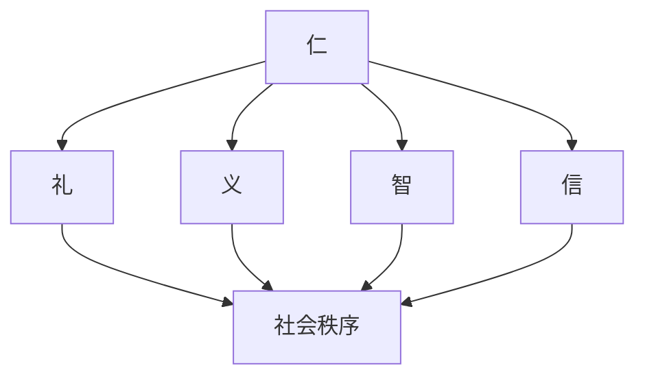
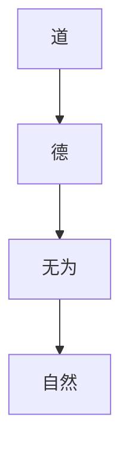
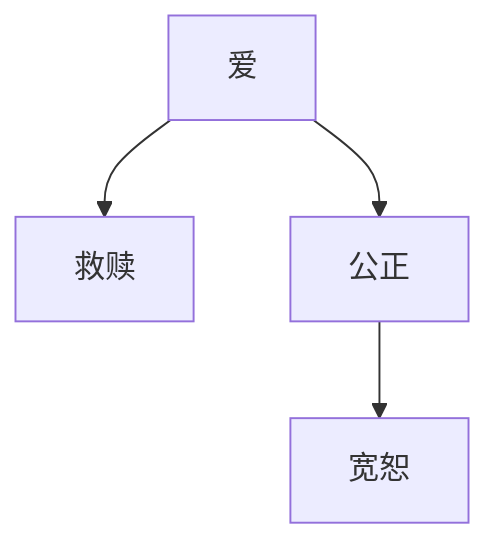
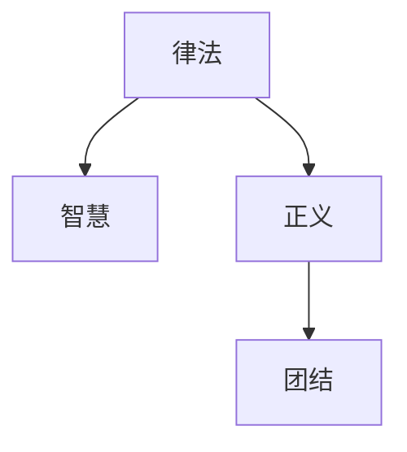

                 

## 引言：古老哲学与现代生活

### 1.1 古老哲学的概念

古老哲学，是人类智慧的结晶，源自数千年前，贯穿了东西方的文明发展。哲学本身来源于古希腊语“φιλοσοφία”（philosophia），意为“爱智慧”。这种追求智慧、探讨人生意义、探究宇宙本质的活动，在古代社会得到了广泛的关注和推崇。

古老哲学的起源可以追溯到古希腊，苏格拉底、柏拉图、亚里士多德等哲学巨匠为后世留下了丰富的哲学遗产。在中国，儒、道、佛三家哲学思想贯穿了整个历史，形成了独特的东方哲学体系。儒家主张仁、义、礼、智、信，道家强调道、德、无为，佛教追求涅槃和解脱。

这些古老哲学不仅为当时的文明提供了精神支柱，也在今天继续影响着人类社会。从伦理道德、社会制度，到个人修养、生活态度，古老哲学的理念为现代生活提供了宝贵的启示。

### 1.2 现代生活中的哲学重要性

在现代生活中，古老哲学的重要性不容忽视。首先，哲学为现代社会提供了价值观念的指导。在快速发展的科技和商业环境中，人们面临着前所未有的挑战和困惑。古老哲学的智慧，如儒家的仁爱之道、道家的顺应自然，以及佛教的智慧和平等，为人们提供了心灵的慰藉和行为的指南。

其次，哲学对个人成长有着深远的影响。在个人生活中，人们常常会遇到各种问题和困境。哲学教导我们如何面对挫折、如何处理人际关系、如何实现自我价值。例如，儒家强调的“修身齐家治国平天下”，不仅是一种道德追求，也是一种生活态度，鼓励人们不断提升自我，为社会作出贡献。

此外，哲学在职业发展和社会治理中也有重要应用。在企业管理中，道家的无为而治和儒家的德治思想，为管理者提供了有效的治理策略。在社会治理中，哲学的智慧可以帮助我们理解社会现象，探讨社会正义，寻求解决问题的方法。

总之，古老哲学不仅是我们了解人类文明历史的重要途径，也是我们现代生活的重要指导。通过深入理解哲学的核心概念，我们能够更好地面对生活的挑战，实现个人的成长和幸福。接下来的章节将详细探讨古老哲学的核心概念及其在现代生活中的应用，帮助读者更好地理解这一跨越时空的智慧。

### 1.3 哲学在现代生活中的具体应用场景

古老哲学在现代生活中的应用场景广泛且多样，无论是在个人生活中，还是在职业发展和社会治理中，都发挥了重要作用。

#### 个人生活中的哲学应用

在个人生活中，哲学的应用体现在方方面面。首先，儒家的“仁爱”思想强调了人与人之间的和谐与互助。这一理念在现代社会中表现为对家人、朋友和社会的关爱。比如，在人际关系处理上，遵循儒家思想的个体更倾向于通过对话和妥协来解决矛盾，而不是采取对抗或逃避。

道家哲学的“顺应自然”理念则指导个体在生活中保持内心的平和与宁静。在现代社会的高压和快节奏中，人们常常感到焦虑和压力。通过学习道家的哲学，个体可以学会放松心情，接受生活中的变化，减少焦虑和不满。

佛教的“因果报应”和“涅槃”理念也为个人生活提供了深刻的启示。佛教教导人们种善因得善果，通过修行达到内心的平静与解脱。这一理念鼓励个体在日常生活中多做善事，关注自己的行为和态度，追求内心的平和与幸福。

#### 职业发展中的哲学应用

在职业发展中，哲学的应用同样不可忽视。儒家的“德治”理念强调了道德和德行在管理中的重要性。在现代企业管理中，遵循儒家思想的领导者更注重培养员工的道德素质，通过德行来提升团队的整体效率和企业文化。

道家的“无为而治”则指导管理者不要过度干预，而是通过减少繁琐的规章制度，让员工有更大的自由度来发挥自己的潜力。这种管理方式在创新型和知识密集型企业中尤为有效，因为它能够激发员工的创造力和主动性。

基督教伦理在职业道德上也起到了重要作用。基督教强调的诚实、公正和慷慨等价值观，帮助个体在商业活动中做出正确的决策，建立良好的商业信誉，从而获得长期的商业成功。

#### 社会治理中的哲学应用

在现代社会治理中，哲学的应用体现在如何制定公正合理的政策和解决社会问题。儒家的“仁政”理念提倡以仁爱之心治理国家，关心民生，推动社会和谐。这一理念在现代政治中得到了广泛认同，体现在政府对社会福利和公共服务的关注上。

道家的“无为而治”理念则主张政府不要过度干预市场，让市场自我调节。这种理念在经济发展中得到了应用，通过减少政府干预，鼓励市场自由竞争，促进经济的健康发展。

佛教的“慈悲”和“平等”理念也为社会治理提供了启示。在处理社会冲突和矛盾时，通过倡导慈悲和平等，可以有效缓解社会紧张关系，推动社会的和谐与进步。

总之，古老哲学在现代生活中的应用是多方面的，它不仅为个人成长提供了指导，也在职业发展和社会治理中发挥了重要作用。通过深入理解和应用这些哲学理念，我们能够更好地应对现代生活的挑战，实现个人的价值和社会的和谐。

### 1.4 哲学对现代生活的意义和影响

哲学在现代社会中的意义和影响深远，不仅为个体的精神成长提供了指导，也在社会结构和公共政策的制定中发挥了重要作用。

首先，哲学为个体的精神成长提供了宝贵的智慧。在面对生活中的困惑和挑战时，哲学的理念如“顺其自然”、“知足常乐”等，帮助个体找到内心的平衡和安宁。通过深入理解这些哲学思想，个体能够更好地处理人际关系，面对挫折，实现自我价值。

其次，哲学在公共政策的制定和实施中起到了关键作用。哲学思想如“正义”、“公正”、“公平”等，为制定合理的政策和法律提供了理论基础。例如，在法律体系中，儒家的“德治”理念鼓励通过道德教育和自律来维护社会秩序，而不是仅仅依赖法律制裁。

此外，哲学还在社会文化的形成和发展中发挥了重要作用。不同哲学流派的兴起和传播，塑造了不同的文化价值观和社会风气。例如，道家的“无为而治”和儒家的“仁爱”思想，不仅影响了古代中国的社会结构，也对现代社会的文化建设产生了深远影响。

总的来说，哲学不仅是我们理解人类文明历史的重要途径，也是我们现代生活的重要指导。通过深入理解和应用哲学智慧，我们能够更好地应对现代生活的挑战，实现个人的成长和社会的和谐。接下来，我们将深入探讨古老哲学的核心概念，以帮助读者更好地理解这些跨越时空的智慧。

## 第2章 古老哲学的核心概念

### 2.1 儒家思想

儒家思想，是中国古代哲学的重要组成部分，其创始人是孔子（公元前551年-公元前479年）。儒家思想强调人与人之间的关系，主张以仁爱为核心，通过修身、齐家、治国、平天下的路径实现社会和谐与个人价值。

#### 核心概念与联系

- **仁**：仁是儒家思想的核心，表示对他人的爱和同情。孔子认为，一个人要达到道德的境界，首先必须具备仁心。
- **礼**：礼是规范人们行为的标准，是维持社会秩序的基础。儒家主张通过礼来调节人与人之间的关系。
- **义**：义是行为的正当性和正义感。儒家强调，人在行事时必须遵循道德规范，做到正义无私。
- **智**：智是智慧和理智，儒家认为，智不仅是知识，更是运用知识解决实际问题的能力。
- **信**：信是诚信和信任。儒家强调，人与人之间要建立诚信关系，这是社会稳定的基石。

儒家思想的各个核心概念之间相互联系，共同构成了一个完整的社会伦理体系。仁是基础，礼是规范，义是原则，智是手段，信是保障。通过这一体系，儒家试图实现个人与社会的和谐统一。

#### 儒家思想的原理架构 Mermaid 流程图

### 2.2 道家哲学

道家哲学，起源于春秋战国时期，代表人物是老子和庄子。道家思想强调自然和无为，主张顺应自然规律，追求内心的平和与自由。

#### 核心概念与联系

- **道**：道是道家哲学的核心概念，表示宇宙万物运行的法则和根源。道家认为，万物皆由道生成，人应顺应道。
- **德**：德是道德的修养，是指人内心的自然状态和品质。道家主张通过修身养性，达到德的高尚境界。
- **无为**：无为是道家的行为原则，强调不妄为、不强迫，而是顺应自然。道家认为，过度的干预和控制会导致混乱。
- **自然**：自然是道家追求的最高境界，意味着不违背自然规律，与自然和谐共处。

道家哲学的核心概念之间紧密相连。道是宇宙的根本法则，德是人的内在修养，无为是行为原则，自然则是最终追求。这一体系教导人们顺应自然，追求内心的平和与自由。

#### 道家哲学的原理架构 Mermaid 流程图

### 2.3 基督教伦理

基督教伦理，是基督教教义的重要组成部分，强调爱与救赎。基督教伦理的核心概念源自《圣经》，对人类道德、行为和信仰提供了深刻的指导。

#### 核心概念与联系

- **爱**：爱是基督教伦理的核心，包括对上帝的爱和对邻人的爱。基督教强调，爱是最高美德，贯穿于生活的各个方面。
- **救赎**：救赎是指通过信仰上帝，获得灵魂的拯救和救赎。基督教认为，人类因罪恶而需要救赎，上帝通过耶稣基督的牺牲实现了救赎。
- **公正**：公正是指对待他人公平、正义，基督教伦理强调社会公正，反对不平等和剥削。
- **宽恕**：宽恕是基督教的核心价值观之一，教导人们宽容他人的过错，用爱心化解冲突。

基督教伦理的核心概念之间相互联系，共同构成了一个全面的行为规范。爱是基础，救赎是目标，公正是原则，宽恕是实践。这一伦理体系旨在引导人们追求道德上的完美和社会的和谐。

#### 基督教伦理的原理架构 Mermaid 流程图

### 2.4 犹太教智慧

犹太教智慧，源于古老的希伯来传统，强调信仰、法律和社会责任。犹太教伦理教导人们遵守法律，追求道德和智慧。

#### 核心概念与联系

- **律法**：律法是犹太教的核心，包括《摩西十诫》和《希伯来圣经》中的法律。犹太教认为，遵守律法是信仰和行为的基石。
- **智慧**：智慧是犹太教追求的重要品质，智慧不仅仅是知识，更是一种正确的判断和行动能力。
- **正义**：正义是犹太教伦理的重要组成部分，强调对待他人公正无私，反对不公正的行为。
- **团结**：团结是犹太教强调的另一个重要价值观，犹太人被教导要团结一致，共同面对挑战。

犹太教智慧的核心概念相互支撑，共同构成了一个严谨的伦理体系。律法是基础，智慧是追求，正义是原则，团结是目标。这一体系旨在指导人们遵守法律、追求智慧，实现社会的和谐与进步。

#### 犹太教智慧的原理架构 Mermaid 流程图

通过以上对儒家思想、道家哲学、基督教伦理和犹太教智慧的核心概念及其相互关系的探讨，我们可以看到，这些古老哲学体系各有特色，但都致力于引导人们追求道德、智慧和社会和谐。在接下来的章节中，我们将进一步探讨这些哲学理念如何在现代生活中得到应用，为个人成长和社会发展提供启示。

### 第3章 哲学与现代生活

#### 3.1 哲学在个人生活中的应用

哲学在个人生活中的应用是多方面的，它不仅帮助我们理解生活的意义，还为我们提供了应对挑战的工具和智慧。

首先，哲学教导我们如何看待生命和存在的意义。儒家思想中的“仁爱”理念强调人与人之间的相互关爱和尊重，帮助个体在人际关系中找到平衡和和谐。例如，通过学习儒家的“己所不欲，勿施于人”，个体可以在日常生活中实践尊重他人的原则，从而建立健康、稳定的人际关系。

道家哲学的“顺应自然”理念则引导个体在处理生活中的变化和挑战时保持内心的平和与宁静。在现代社会的快节奏和高压力环境中，人们常常感到焦虑和不安。通过学习和实践道家的“无为而治”，个体可以学会放松心态，接受生活中的变化，减少焦虑和不满。

佛教的“因果报应”和“涅槃”理念也为个人生活提供了深刻的启示。佛教教导人们种善因得善果，通过修行达到内心的平静与解脱。这一理念鼓励个体在日常生活中多做善事，关注自己的行为和态度，追求内心的平和与幸福。

例如，一个在职场中面临困境的员工，可以通过学习儒家思想中的“修身齐家治国平天下”，提升自我修养，努力工作，实现个人价值和职业发展。同样，面对生活中的压力和挑战，通过道家哲学的“顺应自然”，个体可以找到内心的平和，减轻焦虑，更好地应对困境。

#### 3.2 哲学在职业发展中的应用

哲学在职业发展中的应用同样重要，它不仅为个体提供了职业伦理的指导，还为职业生涯中的决策提供了智慧。

儒家思想的“德治”理念在职业发展中具有重要的指导意义。儒家强调道德和德行在管理中的重要性，这提醒职业人士在职业生涯中不仅要追求业绩，更要注重道德和伦理。例如，一个领导者通过儒家的“德治”理念，可以更加关注员工的道德培养和团队文化建设，从而实现团队的长远发展。

道家哲学的“无为而治”理念为职业人士提供了处理职场压力和问题的智慧。在现代社会，职场竞争激烈，压力巨大。通过学习和实践道家的“无为而治”，职业人士可以学会减少不必要的干预，给予员工更大的自由度，从而激发员工的创造力和主动性。

基督教伦理在职业道德方面也提供了重要的指导。基督教强调诚实、公正和慷慨等价值观，这为职业人士在商业活动中提供了道德准则。例如，一个商业人士可以通过基督教的“诚实”价值观，确保商业活动的透明和公正，赢得客户的信任和尊重，实现长期的商业成功。

例如，一个在科技行业中工作的工程师，可以通过学习儒家的“德治”理念，注重职业道德和团队合作，提升自己的技术水平和职业素养。同时，通过道家哲学的“无为而治”，工程师可以学会在项目中保持内心的平和，减少不必要的压力，提高工作效率。

#### 3.3 哲学在人际关系中的应用

哲学在人际关系中的应用同样广泛，它为个体提供了处理复杂人际关系的工具和智慧。

儒家思想中的“仁爱”理念强调了人与人之间的关爱和尊重，这为处理人际关系提供了重要的指导。例如，在家庭生活中，通过儒家的“仁爱”理念，家庭成员之间可以建立更加和谐的关系，增进彼此的理解和信任。

道家哲学的“顺应自然”理念则为个体在处理人际关系时提供了智慧。在现代社会，人际关系复杂多变，通过学习道家的“顺应自然”，个体可以学会适应不同的人际环境，减少冲突和矛盾。

佛教的“因果报应”和“涅槃”理念也为人际关系提供了深刻的启示。佛教教导人们通过善行积累善果，通过修行达到内心的平静。这鼓励个体在人际关系中多做善事，关注他人的需求，从而建立良好的人际关系。

例如，在工作中，一个管理者可以通过儒家的“仁爱”理念，关心员工的成长和发展，建立信任和尊重的团队文化。同时，通过道家哲学的“顺应自然”，管理者可以学会灵活应对不同的员工和团队环境，提高管理效率。

总之，古老哲学在个人生活中的应用广泛且深刻，它为个体提供了处理生活、职业和人际关系问题的智慧。通过深入理解和实践这些哲学理念，个体能够更好地应对现代生活的挑战，实现个人的成长和幸福。

### 第4章 跨越时空的智慧

#### 4.1 儒家思想在当代教育中的应用

儒家思想自古以来就强调教育的重要性，其理念在当代教育中仍然具有深远的影响。儒家教育的核心理念包括“修身齐家治国平天下”，这一理念不仅在古代社会发挥了重要作用，在现代教育中同样具有重要指导意义。

首先，儒家的“修身”理念强调个人品德和修养的培养。在教育实践中，这一理念可以通过以下方式得到应用：

- **德育教育**：学校可以通过开展德育课程，教育学生树立正确的道德观念，培养诚实、守信、尊重他人的品质。例如，通过儒家经典《论语》中的格言，如“己所不欲，勿施于人”，教育学生学会尊重他人，关爱他人。
- **行为规范**：学校可以制定明确的行为规范，引导学生遵守社会公德，养成良好的生活习惯。例如，通过设立“每日反省”制度，鼓励学生每天反思自己的言行，不断提升自我修养。

其次，儒家的“齐家”理念强调家庭教育和家庭关系的和谐。在当代教育中，这一理念可以通过以下方式得到应用：

- **家校合作**：学校和家庭应建立紧密的合作关系，共同关注学生的成长。通过家长会、家庭教育讲座等形式，学校可以引导家长了解和践行儒家的家庭教育理念，如“身教重于言教”，通过家长的榜样作用影响学生的行为。
- **家庭教育指导**：学校可以开展家庭教育指导服务，帮助家长解决教育中的困惑和问题。例如，通过家长培训班，教授家长如何运用儒家教育理念指导孩子的学习和生活，提升家庭教育质量。

最后，儒家的“治国平天下”理念强调教育的政治功能和社会责任。在当代教育中，这一理念可以通过以下方式得到应用：

- **社会责任教育**：学校可以加强社会责任教育，培养学生的社会意识和公民意识。例如，通过开展社会实践活动，让学生参与社区服务、环境保护等公益活动，培养学生的社会责任感。
- **公民教育**：学校可以加强公民教育，培养学生的法律意识和民主素养。例如，通过法律知识普及活动、模拟议会等活动，让学生了解和尊重法律，培养民主参与能力。

总之，儒家思想在当代教育中的应用，不仅有助于提高学生的道德素质和自我修养，还有助于培养他们的社会责任感和公民意识。通过深入挖掘和践行儒家教育的核心理念，当代教育将更加关注人的全面发展，为社会的和谐与进步贡献力量。

#### 4.2 道家哲学在企业管理中的应用

道家哲学强调顺应自然、无为而治，这些理念在企业管理中具有独特的指导价值。在现代企业中，通过应用道家的哲学智慧，管理者可以提升企业效能，营造和谐的工作环境。

首先，道家的“无为而治”理念提倡减少不必要的干预，给予员工更多的自由和自主权。在现代企业管理中，这一理念可以通过以下方式得到应用：

- **授权管理**：管理者应适度放权，让员工在各自职责范围内自主决策，提高工作效率和创造力。例如，通过设立项目团队，赋予团队成员足够的决策权，让他们自主制定项目计划和目标，减少管理层的直接干预。
- **减少规章制度**：企业应减少繁琐的规章制度，避免过度约束员工的行为。通过建立信任机制，鼓励员工在工作中发挥主动性和创新精神，从而提高整体工作效率。

其次，道家的“顺应自然”理念强调顺应事物的自然发展，避免强行干预。在现代企业管理中，这一理念可以通过以下方式得到应用：

- **灵活管理**：企业应灵活应对市场变化，避免僵化管理。例如，在面对市场波动时，企业可以通过调整产品线、优化供应链等方式，快速响应市场变化，保持竞争优势。
- **员工激励**：管理者应尊重员工的个性和需求，通过个性化的激励措施，激发员工的潜能。例如，通过设置灵活的工作时间和工作地点，让员工能够在舒适的环境中高效工作，提升工作满意度。

此外，道家的“无为而治”理念还强调通过自我反省和内省来提升管理能力。在现代企业管理中，这一理念可以通过以下方式得到应用：

- **领导力培养**：管理者应注重自我反省和内省，通过不断学习和反思，提升自身的领导力和管理能力。例如，通过定期进行管理培训和个人发展计划，帮助管理者不断提升自我，更好地应对企业管理中的挑战。
- **企业文化塑造**：企业应注重文化建设，营造一种“无为而治”的管理氛围。通过弘扬道家的哲学智慧，让员工理解并认同企业的核心价值观，从而形成一种和谐、包容的工作环境。

总之，道家哲学在企业管理中的应用，有助于提高企业的灵活性和创新能力，同时营造一种和谐的工作环境，从而提升整体企业的效能。通过深入理解和实践道家的“无为而治”和“顺应自然”理念，现代企业可以更好地适应市场的变化，实现可持续发展。

#### 4.3 基督教伦理在医疗行业的应用

基督教伦理在医疗行业中具有重要地位，其核心价值如爱、救赎和公正，为医护人员提供了行为准则和精神支柱。以下是基督教伦理在医疗行业中的具体应用及其对医疗实践的影响。

首先，基督教伦理中的“爱”理念，强调对患者的关怀和同情。这一理念在医疗实践中体现为医护人员对患者全方位的关怀，不仅关注患者的身体治疗，还关注其心理和情感需求。例如，通过倾听患者的痛苦和困惑，医护人员可以用爱和同情心给予患者精神上的支持。具体应用案例包括：

- **患者中心服务**：医院可以设立患者服务中心，提供温馨、人性化的服务，帮助患者及其家属应对疾病带来的困扰。例如，通过设立心理辅导室，为患者提供心理支持和咨询服务，缓解患者的心理压力。
- **医护人员的培训**：医院可以加强医护人员的职业道德培训，教育他们理解和践行基督教的“爱”理念。例如，通过开展“同理心”培训课程，帮助医护人员学会从患者的角度思考问题，提高服务质量。

其次，基督教伦理中的“救赎”理念，鼓励医护人员在服务患者的过程中传递希望和治愈的力量。这一理念可以帮助患者建立战胜疾病的信心，从而提高治疗效果。具体应用案例包括：

- **康复支持**：医院可以设立康复支持小组，为患者提供康复过程中的持续关怀和支持。例如，通过定期组织康复讲座和活动，帮助患者了解康复知识和技巧，增强康复信心。
- **志愿服务**：医护人员可以参与志愿服务活动，为贫困患者提供免费的医疗援助。例如，通过开展义诊活动，为偏远地区的贫困患者提供医疗服务，帮助他们获得及时的治疗。

第三，基督教伦理中的“公正”理念，强调对待患者的公平和无偏见。这一理念在医疗行业中体现为对患者的平等对待，不论其社会地位、经济条件或疾病类型。具体应用案例包括：

- **医疗服务均等化**：政府可以通过政策保障，确保医疗资源的公平分配，使所有患者都能享受到高质量的医疗服务。例如，通过实施医疗救助制度，帮助贫困患者支付医疗费用，确保其获得必要的治疗。
- **职业伦理规范**：医疗机构可以制定明确的职业伦理规范，要求医护人员在医疗实践中坚持公正原则，不偏袒特权患者。例如，通过设立职业道德委员会，监督医护人员的行为，确保他们遵守公正原则，提高医疗服务的公正性。

总之，基督教伦理在医疗行业的应用，不仅提升了医护人员的职业素养和道德水平，也为患者提供了更全面、更人性化的医疗服务。通过深入践行基督教伦理的“爱”、“救赎”和“公正”理念，医疗行业可以更好地实现其社会责任，促进社会和谐与进步。

#### 4.4 犹太教智慧在创业精神中的应用

犹太教智慧在创业精神中有着深刻的体现，其核心价值如律法、智慧、正义和团结，为创业者提供了道德和精神支持。以下是犹太教智慧在创业中的具体应用及其对创业实践的影响。

首先，犹太教智慧中的“律法”理念强调遵守法律和道德规范，这是创业者成功的基础。在创业过程中，遵守法律和道德规范不仅能够保障企业的合法经营，还能赢得客户的信任和尊重。具体应用案例包括：

- **合规经营**：创业者应严格遵守相关法律法规，确保企业运营的合法性和合规性。例如，通过建立完善的公司治理结构，确保企业的财务报表真实、透明，避免违法行为。
- **诚信经营**：创业者应诚信待人，公平交易，建立良好的商业信誉。例如，通过诚信履行合同，保持产品和服务质量，赢得客户的长期信任。

其次，犹太教智慧中的“智慧”理念强调知识和创新的重要性，这为创业者在面对市场变化和挑战时提供了智慧和策略。具体应用案例包括：

- **持续学习**：创业者应具备持续学习的能力，不断更新知识和技能，以适应市场的变化。例如，通过参加培训课程、阅读专业书籍，创业者可以提升自己的专业知识和市场洞察力。
- **创新思维**：创业者应勇于创新，敢于尝试新思路和新方法。例如，通过采用新技术、新产品或新模式，创业者可以开辟新的市场空间，赢得竞争优势。

第三，犹太教智慧中的“正义”理念强调公正和公平，这对创业者在处理与员工、客户和其他利益相关者的关系时提供了指导。具体应用案例包括：

- **员工权益**：创业者应尊重员工权益，确保员工的劳动条件和薪资待遇公平合理。例如，通过建立公平的薪酬体系，提供职业培训和晋升机会，激发员工的积极性和创造力。
- **客户关系**：创业者应诚实对待客户，公平交易，提供优质的服务。例如，通过建立客户反馈机制，及时解决客户问题，提升客户满意度。

最后，犹太教智慧中的“团结”理念强调团队合作和互助精神，这对创业团队的建设和管理提供了启示。具体应用案例包括：

- **团队建设**：创业者应注重团队建设，培养团队合作精神。例如，通过定期组织团队建设活动，增强团队成员之间的信任和凝聚力。
- **资源共享**：创业者应促进团队内部的资源共享和知识传递，提升团队整体实力。例如，通过设立共享平台，让团队成员能够方便地获取和分享信息，提高工作效率。

总之，犹太教智慧在创业精神中的应用，不仅为创业者提供了道德和行为准则，还增强了创业者的智慧和团队协作能力。通过深入践行犹太教智慧的“律法”、“智慧”、“正义”和“团结”理念，创业者可以更好地应对创业中的挑战，实现企业的长期发展。

### 第5章 个人成长与哲学

#### 5.1 古老哲学对个人价值观的影响

古老哲学，尤其是儒家、道家、基督教和犹太教的思想，深刻地影响着个人的价值观和行为准则。这些哲学体系不仅提供了世界观和方法论，也为个人在复杂多变的社会中寻找方向提供了宝贵的指导。

首先，儒家思想中的“仁爱”理念对个人价值观有着深远的影响。儒家强调人与人之间的关系，提倡以仁爱为核心，通过修身齐家治国平天下的路径实现个人价值。这一理念鼓励个体关爱他人，尊重社会规范，树立正确的道德观。例如，一个在职场中秉持儒家“仁爱”理念的人，更注重团队合作，关心他人的感受，从而在人际关系中建立和谐稳定的合作关系。

其次，道家哲学中的“顺应自然”理念对个人价值观的塑造也具有重要意义。道家强调人应顺应自然规律，追求内心的平和与自由。这一理念帮助个体在纷繁复杂的社会中找到内心的平衡，减少焦虑和不满。例如，在现代社会的高压环境中，一个遵循道家“顺应自然”理念的人，更容易保持内心的宁静，从容应对生活中的挑战。

基督教伦理中的“爱”和“救赎”理念，为个人的价值观提供了深刻的指引。基督教强调对上帝的爱和对邻人的爱，并认为通过信仰可以实现灵魂的救赎。这一理念鼓励个体在日常生活中多做善事，关注自己的道德修养。例如，一个在社区服务中积极参与慈善活动的人，通过实践基督教的“爱”和“救赎”理念，不仅帮助他人，也提升了自己的道德境界。

犹太教智慧中的“律法”、“智慧”和“正义”理念，为个人价值观的塑造提供了坚实的道德基础。犹太教强调遵守法律和道德规范，追求知识和智慧，实现社会公正。例如，一个在商业活动中遵循犹太教“正义”理念的人，更注重诚信经营，公平对待客户和合作伙伴，从而建立良好的商业信誉。

总之，古老哲学对个人价值观的影响深远，不仅为个体提供了行为准则和道德标准，还帮助个体在复杂的社会环境中找到方向和平衡。通过深入理解和践行这些哲学理念，个人可以提升自己的道德修养，实现个人价值的最大化。

#### 5.2 古老哲学在个人决策中的作用

古老哲学在个人决策中发挥着重要作用，它不仅为个体提供了理性思考的工具，还帮助个体在复杂多变的环境中做出明智的选择。以下将具体分析儒家、道家、基督教和犹太教哲学在个人决策中的应用。

首先，儒家思想中的“义利之辨”为个人决策提供了重要的道德指引。儒家强调“义”是行为的最高准则，主张在决策时应以道德正义为重，而不是单纯追求利益。例如，一个在职业发展中面临道德与利益的冲突时，通过儒家的“义利之辨”，他可能会选择放弃短期利益，维护长期道德信誉。具体应用场景包括：一个企业家在是否贿赂官员以获取项目时，通过思考“义利之辨”，最终选择拒绝贿赂，坚守商业道德。

其次，道家哲学中的“无为而治”理念教导个体在做决策时应顺应自然，避免过度干预。这一理念强调在决策过程中保持内心的平和与宁静，避免因急功近利而做出错误的判断。例如，一个在投资决策中面临市场波动时，通过遵循道家的“无为而治”，他可能会选择耐心等待，而不是盲目跟风。具体应用场景包括：一个投资者在面临股市大跌时，通过道家思想指导，选择保持冷静，继续持有长期投资组合，最终规避了市场风险。

基督教伦理中的“信仰”和“智慧”为个人决策提供了重要的精神支持。基督教教导个体在决策时依赖信仰和智慧，而不是仅仅依靠感性或经验。这一理念帮助个体在面对复杂问题时保持坚定的信念，并通过理性分析做出明智的选择。例如，一个在求职过程中面临多个选项时，通过基督教的“信仰”和“智慧”，他可能会选择那个最能发挥自己优势且符合自己价值观的工作。具体应用场景包括：一个大学生在选择专业时，通过信仰和智慧的引导，选择了自己热爱且具备长远发展潜力的专业。

犹太教智慧中的“律法”和“智慧”理念强调遵守法律和道德规范，通过理性分析和判断做出公正的决策。这一理念帮助个体在面对道德困境时，通过法律和道德框架进行决策，避免做出不公正的行为。例如，一个在商业谈判中面临法律和道德冲突时，通过犹太教智慧指导，他可能会选择遵守法律和道德规范，确保谈判的公正和诚信。具体应用场景包括：一个销售人员在面对是否向客户推销不合适的产品时，通过“律法”和“智慧”的指导，选择拒绝推销，以维护客户的利益和公司的信誉。

总之，古老哲学在个人决策中的应用，为个体提供了丰富的理性思考和道德指导。通过结合儒家、道家、基督教和犹太教哲学的理念，个体可以在复杂多变的环境中做出更加明智和合理的决策。

#### 5.3 古老哲学与心理健康

古老哲学不仅对个人价值观和决策产生深远影响，还在维护心理健康方面发挥了重要作用。通过深入探讨儒家、道家、基督教和犹太教哲学中的理念，我们可以发现这些哲学体系为心理健康提供了丰富的精神资源和实践指南。

首先，儒家哲学中的“修身齐家”理念强调个人修养和家庭和谐，这对心理健康有积极影响。儒家主张通过不断自我反省和道德修养，达到内心的平静与和谐。这种理念鼓励个体在面对压力和挑战时，通过自我调节和心理调适，保持心理平衡。例如，一个在职场中遭遇困境的员工，通过儒家的修身理念，学会自我反省和调整心态，减少焦虑和压力，从而提高心理健康水平。

其次，道家哲学中的“顺应自然”理念提倡个体应顺应自然规律，减少内心的矛盾和冲突。道家强调内心的平和与宁静，主张通过冥想和内省来达到心灵的和谐。这种理念有助于个体在面对生活中的不确定性时，保持心理上的稳定和平衡。例如，一个在现代社会中感到焦虑和压力的人，通过道家的冥想和内省，学会放下内心的执念，接受生活中的变化，从而减轻心理负担，提高心理健康。

基督教伦理中的“信仰”和“宽恕”理念为心理健康提供了重要的精神支持。基督教强调信仰的力量，鼓励个体在面对困境时依靠信仰找到希望和力量。同时，基督教的宽恕理念教导个体要学会宽容和原谅他人，避免内心的怨恨和积怨。这种理念有助于个体在处理人际关系时保持心理的健康和和谐。例如，一个在家庭关系紧张时，通过基督教的宽恕理念，学会原谅家人，从而减少内心的怨恨，提升家庭关系质量，进而提高心理健康。

犹太教智慧中的“智慧”和“正义”理念强调理性思考和公正行为，这对心理健康同样具有重要影响。犹太教主张通过不断学习和思考，提升智慧和道德水平，从而在生活和工作中做出明智的决策。同时，犹太教强调正义和公正，教导个体在处理问题时保持公正和公平，避免做出伤害他人的行为。这种理念有助于个体在面对社会和道德困境时，保持心理上的平衡和健康。例如，一个在职场中面临道德和利益冲突时，通过犹太教智慧指导，选择遵守道德规范和公正原则，从而维护心理的健康和尊严。

总之，古老哲学通过提供精神资源和实践指南，对心理健康有着深远的影响。通过深入理解和践行儒家、道家、基督教和犹太教哲学的理念，个体可以更好地维护心理健康，提高生活质量。

### 第6章 社会问题与哲学

#### 6.1 哲学对社会正义的探讨

社会正义是哲学探讨的重要主题之一，不同哲学流派对此有着各自独特的见解和观点。儒家、道家、基督教和犹太教等哲学体系对社会正义的理解和实践，为现代社会提供了丰富的启示。

首先，儒家思想中的“仁政”理念强调以仁爱为基础，实现社会公正。儒家认为，正义的实现离不开仁爱之心，政府应通过仁政来保障人民的福祉。具体来说，儒家强调统治者应以德治国，关注民生，通过制定公平合理的政策和法律，确保社会公正。例如，在现代社会中，通过推行社会福利制度和公共教育，政府可以确保弱势群体的基本权益，实现社会正义。

其次，道家哲学中的“无为而治”理念主张减少政府的干预，让社会自行调节。道家认为，正义的实现不应依赖于强制和干预，而应通过自然法则和道德自律。这一理念强调，社会正义应通过个体的道德修养来实现，而非依靠政府的力量。例如，在现代社会中，通过倡导道德教育和公民自律，个体可以自觉遵守法律和社会规范，从而实现社会正义。

基督教伦理中的“公正”理念强调社会成员之间的平等和公正对待。基督教认为，正义的实现应通过公平的法律和制度来实现，反对任何形式的歧视和不公。例如，在现代社会中，通过制定反歧视法律，保障少数群体的权益，政府可以推动社会公正。此外，基督教的“公正”理念还强调司法独立，通过公正的司法体系来维护社会正义。

犹太教智慧中的“正义”理念强调遵守法律和道德规范，实现社会的公正和公平。犹太教认为，正义的实现需要每个人遵守法律，维护社会的道德秩序。例如，在现代社会中，通过强化法律教育和法律监督，政府可以确保法律的公正执行，维护社会正义。

总之，不同哲学流派对社会正义有着各自独特的理解和观点。儒家强调仁政，道家主张无为而治，基督教强调公正，犹太教强调遵守法律和道德规范。这些哲学理念为现代社会提供了丰富的理论资源，指导我们在实践中实现社会正义。通过综合运用这些哲学理念，我们可以在法律、政策和社会制度层面推动社会公正，实现社会的和谐与进步。

#### 6.2 哲学对环境保护的思考

哲学对环境保护的思考不仅深刻，而且具有指导意义。在儒家、道家、基督教和犹太教等哲学体系中，我们可以找到许多关于人与自然和谐共处的理念，这些理念为当代环境保护提供了重要的理论支持和实践指导。

首先，道家哲学中的“顺应自然”理念强调人与自然应和谐相处，尊重自然规律。道家认为，人类应顺应自然，避免过度干预和破坏自然生态。具体而言，这一理念指导我们在环境保护中应减少对自然资源的过度开发和污染，通过保护自然生态系统来实现人与自然的和谐共生。例如，在现代社会中，推行可持续发展战略，提倡绿色生产，减少碳排放，正是对道家“顺应自然”理念的实践。

其次，儒家思想中的“天人合一”理念强调人与自然的紧密联系，主张人与自然应共同发展。儒家认为，人类社会应与自然和谐共处，通过道德修养和伦理实践，促进人与自然的和谐。这一理念指导我们在环境保护中应注重生态平衡，通过生态修复和生态建设，恢复和保持自然生态系统的健康。例如，在推行生态补偿机制时，通过补偿受影响地区的生态损失，实现生态保护和发展的双赢。

基督教伦理中的“责任”和“关怀”理念强调人类对自然环境的责任和义务，要求我们关心和保护自然环境。基督教认为，人类是上帝的受造物，有责任保护和照顾大自然。这一理念指导我们在环境保护中应采取积极的行动，通过环保教育和法律法规，推动全社会关注环境保护，共同承担保护自然环境的责任。例如，通过普及环保知识，提高公众的环保意识，以及制定严格的环保法规，限制污染行为，保护自然生态系统。

犹太教智慧中的“创世纪”理念强调人类与自然的起源和联系，教导人类应尊重自然、保护环境。犹太教认为，人类是上帝创造的大地管理者，有责任保护地球免受破坏。这一理念指导我们在环境保护中应采取预防性措施，避免对自然环境造成不可逆转的损害。例如，通过推行环境风险评估制度，提前识别和防范潜在的环境风险，减少对自然环境的破坏。

总之，哲学对环境保护的思考为我们提供了丰富的理论资源和实践指导。通过深入理解和践行儒家、道家、基督教和犹太教等哲学理念，我们可以在环境保护中实现人与自然的和谐共生，为可持续发展贡献力量。在未来的发展中，我们应该综合运用这些哲学智慧，构建人与自然和谐共生的美好未来。

#### 6.3 哲学对和平与战争的思考

哲学对和平与战争的思考贯穿了历史的各个时期，不同哲学流派对和平与战争有着各自独特的见解和观点。儒家、道家、基督教和犹太教等哲学体系，通过对和平与战争的深入探讨，为现代社会提供了丰富的智慧和指导。

首先，儒家思想中的“仁政”和“礼治”理念强调和平与和谐的社会秩序。儒家认为，通过仁爱和礼制，可以实现社会的和谐与稳定，从而避免战争。具体而言，儒家主张统治者应以德治国，关注民生，通过制定公平合理的政策和法律，保障人民的福祉。在现代社会中，这一理念指导我们通过和平手段解决国际争端，推动全球治理体系的公正性和合理性，从而实现和平发展。

其次，道家哲学中的“无为而治”和“顺应自然”理念主张和平共处和自然发展。道家认为，战争和暴力是人类自身欲望和干预的结果，应通过减少干预和顺应自然来避免战争。这一理念指导我们在处理国际和国内问题时，应保持内心的平和与宁静，避免过度干预，尊重自然发展规律，从而实现和平共处。

基督教伦理中的“和平”和“博爱”理念强调人类之间的和谐与团结。基督教认为，和平不仅是国家的责任，也是每个人的责任。通过信仰和博爱，人们可以消除仇恨和冲突，实现和平。这一理念指导我们在国际关系中倡导和平共处，通过外交手段解决争端，避免战争的发生。

犹太教智慧中的“正义”和“公正”理念强调在战争与和平中坚持正义与公正。犹太教认为，战争应当是最后的手段，只有在正义得不到保障时，才能诉诸武力。这一理念指导我们，在维护和平的同时，不应放弃对正义的追求，通过公正的法律和制度，确保战争中的正义与秩序。

总之，不同哲学流派对和平与战争的思考，为我们提供了丰富的理论和实践指导。通过综合运用儒家、道家、基督教和犹太教等哲学智慧，我们可以在当代国际社会中实现和平与发展的目标，推动构建一个公正、和谐、和平的世界。

### 第7章 哲学智慧与现代科技

#### 7.1 哲学在人工智能中的应用

哲学智慧在现代科技，特别是人工智能（AI）领域中的应用，正日益受到重视。通过哲学的思考，我们可以为人工智能的发展提供道德和伦理的指导，从而实现更智能、更合理的人工智能系统。

首先，伦理哲学在人工智能中的应用至关重要。伦理哲学强调道德原则和价值观，这为人工智能系统的设计和应用提供了基础。例如，通过引入伦理原则，我们可以确保人工智能在处理数据时尊重隐私，避免歧视和偏见。具体来说，可以通过以下方式实现：

- **伦理设计原则**：在人工智能系统的设计阶段，应引入伦理设计原则，确保系统符合道德规范。例如，在设计自动驾驶系统时，应考虑道德伦理问题，如如何处理紧急情况，确保行人安全。
- **透明性和解释性**：通过提高人工智能系统的透明度和解释性，使其行为更容易被人类理解，从而增强公众的信任。例如，通过开发可解释的AI模型，可以帮助决策者了解系统的决策过程，确保其符合伦理标准。

其次，哲学中的认知论为人工智能的发展提供了理论基础。认知论研究人类思维的过程和结构，这有助于理解人工智能如何模拟和扩展人类的认知能力。具体应用包括：

- **智能代理设计**：通过借鉴认知论，人工智能系统可以设计成具有自我学习和决策能力的智能代理。例如，通过模拟人类的学习和决策过程，智能代理可以在复杂环境中做出更合理的决策。
- **情感智能**：哲学中的情感理论可以帮助人工智能系统理解和模拟人类的情感。例如，通过引入情感智能，聊天机器人可以更好地理解用户的情感状态，提供更人性化的服务。

最后，逻辑哲学在人工智能中的应用同样重要。逻辑哲学研究推理和论证的原则，这为人工智能的逻辑推理和决策提供了理论支持。具体应用包括：

- **推理系统**：通过逻辑哲学，人工智能可以设计成具有逻辑推理能力的系统。例如，通过逻辑推理，智能系统可以解决复杂的数学问题，进行法律文本分析。
- **知识表示**：逻辑哲学中的知识表示理论可以帮助人工智能系统更好地表示和处理知识。例如，通过使用形式逻辑，智能系统可以更准确地表示科学理论和数据，提高决策的准确性。

总之，哲学智慧在现代科技，尤其是人工智能领域中的应用，为人工智能的发展提供了道德、伦理、认知和逻辑指导。通过深入理解和应用哲学原理，我们可以推动人工智能向更智能、更合理的方向发展，实现技术进步和社会福祉的双重目标。

#### 7.2 哲学在虚拟现实与增强现实中的应用

虚拟现实（VR）和增强现实（AR）技术正在迅速发展，这些技术不仅改变了人们的娱乐和生活方式，也在教育、医疗、设计等多个领域展现出巨大的潜力。哲学智慧在VR和AR中的应用，不仅为技术的进步提供了伦理指导，还为用户提供了更深刻的意义体验。

首先，伦理哲学在VR和AR中的应用至关重要。虚拟现实和增强现实技术为用户提供了沉浸式的体验，但这种体验也可能带来伦理问题。例如，虚拟现实中的虚拟暴力和色情内容可能引发伦理争议。通过伦理哲学的思考，我们可以确保VR和AR内容的设计和分发符合道德标准。

- **伦理设计**：在VR和AR内容开发过程中，应引入伦理设计原则。例如，通过设计健康、积极的虚拟体验，鼓励用户参与有益的活动，减少消极影响。
- **隐私保护**：虚拟现实和增强现实技术通常需要收集用户数据，这可能导致隐私泄露问题。通过伦理哲学的指导，开发人员可以设计隐私保护机制，确保用户数据的安全和隐私。

其次，存在哲学在VR和AR中的应用，为用户提供了对现实和虚拟世界关系的深入思考。存在哲学探讨个体存在的本质和意义，这有助于用户在虚拟体验中找到现实和虚拟之间的平衡。

- **现实与虚拟的界限**：存在哲学可以帮助用户理解现实和虚拟世界的关系。例如，通过探讨虚拟现实中的“虚拟生活”对现实生活的影响，用户可以更好地掌握虚拟与现实之间的界限。
- **意义构建**：通过存在哲学的思考，用户可以在虚拟世界中探索和构建意义。例如，通过在虚拟环境中参与道德和社会活动，用户可以体验不同的生活方式，从而加深对现实生活的理解和感悟。

最后，认识论在VR和AR中的应用，为技术发展提供了理论基础。认识论研究知识的获取和验证过程，这有助于提升VR和AR技术的可靠性和有效性。

- **感知增强**：通过认识论，VR和AR技术可以设计成能够更准确模拟和增强现实感知。例如，通过引入增强现实技术，帮助用户更好地理解和掌握复杂信息。
- **认知模拟**：认识论还可以帮助设计更智能的虚拟交互系统。例如，通过模拟人类的认知过程，智能系统可以更好地理解用户的意图和需求，提供更个性化的服务。

总之，哲学智慧在虚拟现实与增强现实中的应用，不仅为技术的伦理和安全提供了指导，还为用户提供了更深刻的意义体验。通过综合运用伦理哲学、存在哲学和认识论，我们可以推动VR和AR技术的发展，实现技术进步与人类价值的和谐统一。

#### 7.3 哲学在网络安全与隐私保护中的应用

哲学智慧在网络安全与隐私保护中的应用日益显现，它不仅为这些领域提供了伦理指导，还帮助人们理解和应对复杂的技术挑战。

首先，伦理哲学在网络安全与隐私保护中起到了核心作用。伦理哲学强调道德责任和公正，这为制定网络安全和隐私保护政策提供了基础。通过伦理哲学的指导，我们可以在技术设计和政策制定中考虑到用户的权利和利益。

- **用户隐私保护**：伦理哲学可以帮助设计隐私保护机制，确保用户数据的安全和隐私。例如，通过引入隐私增强技术，如差分隐私和同态加密，可以保护用户数据的隐私，防止数据泄露。
- **透明性和责任**：伦理哲学强调技术设计和应用中的透明性和责任。通过引入透明性机制，用户可以清楚地了解自己的数据如何被使用，从而增强对技术的信任。同时，明确各方的责任，有助于在发生隐私泄露时快速响应和采取措施。

其次，认识论在网络安全与隐私保护中的应用，为技术评估和风险管理提供了理论基础。认识论研究知识的获取和验证，这有助于理解网络安全威胁的本质，并制定有效的防御策略。

- **威胁评估**：通过认识论，我们可以更深入地理解网络攻击者的动机和技术手段，从而更准确地评估潜在威胁。例如，通过模拟网络攻击者的行为模式，可以识别系统中的弱点，提前采取防御措施。
- **风险管理**：认识论可以帮助制定全面的风险管理策略。通过分析不同风险的可能性和影响，可以优先处理关键问题，确保系统的安全。

最后，存在哲学在网络安全与隐私保护中的应用，为用户行为和决策提供了指导。存在哲学探讨个体存在的意义和目的，这有助于理解用户在数字世界中的行为动机。

- **用户意识提升**：通过存在哲学的思考，用户可以更好地认识到网络安全和隐私保护的重要性。例如，通过教育和宣传，提高用户对网络威胁的认识，鼓励他们采取更安全的上网行为。
- **行为规范**：存在哲学可以帮助制定行为规范，引导用户在数字世界中遵守道德和伦理标准。例如，通过鼓励用户拒绝参与恶意活动，如网络诈骗和隐私泄露，可以减少网络安全风险。

总之，哲学智慧在网络安全与隐私保护中的应用，为这些领域提供了重要的伦理指导和技术理论基础。通过综合运用伦理哲学、认识论和存在哲学，我们可以更好地应对网络安全挑战，保护用户的隐私和利益，实现数字世界的安全与和谐。

### 第8章 结论

#### 8.1 古老哲学的现代价值

古老哲学在现代生活中具有不可忽视的深远价值。通过对儒家、道家、基督教和犹太教等哲学思想的深入探讨，我们可以看到这些哲学体系为个人成长、社会正义、环境保护和科技发展提供了丰富的智慧。这些古老的智慧不仅帮助我们理解和应对现代社会的挑战，还为我们提供了道德、伦理和智慧的指导，从而实现个人的成长和社会的进步。

儒家思想中的“仁爱”、“修身齐家治国平天下”理念，为个人在社会中找到了正确的位置，指导我们如何在复杂的社会环境中保持道德和伦理。道家的“顺应自然”、“无为而治”理念，则教导我们在面对变化和挑战时，如何保持内心的平和与宁静，实现个人的内在和谐。基督教的“爱”、“救赎”和“公正”理念，为我们在现代社会中如何处理人际关系、实现社会正义提供了深刻的启示。犹太教智慧中的“律法”、“智慧”和“正义”理念，则为我们在商业活动和社会生活中如何保持诚信和公正提供了指导。

#### 8.2 对未来的展望

展望未来，古老哲学的现代价值将进一步凸显。随着科技的不断进步和社会的快速变革，我们需要更多的智慧来应对复杂的现实问题。古老哲学中的智慧和原则，如仁爱、和谐、正义、智慧等，将继续为我们提供宝贵的指导。

首先，在人工智能和虚拟现实等新兴科技领域，古老哲学的智慧将发挥重要作用。通过伦理哲学的指导，我们可以确保人工智能和虚拟现实技术的应用符合道德和伦理标准，避免潜在的风险和负面影响。通过存在哲学的思考，我们可以更好地理解这些新兴技术对人类生活和社会的影响，找到平衡点。

其次，在环境保护和社会公正等领域，古老哲学的智慧也将发挥重要作用。随着全球气候变化和资源短缺问题的加剧，我们需要更多的智慧和策略来应对这些挑战。古老哲学中的“顺应自然”和“天人合一”理念，为我们提供了与自然和谐共处的方法。而“正义”和“公平”理念，则指导我们在解决社会问题时，如何实现真正的公正和公平。

最后，在个人成长和心理健康方面，古老哲学的智慧将继续为我们提供宝贵的指导。随着生活节奏的加快和工作压力的增大，我们需要更多的智慧和策略来维护心理健康。古老哲学中的“修身”、“无为而治”和“爱”理念，可以帮助我们找到内心的平衡，实现个人的成长和幸福。

总之，古老哲学的现代价值不可低估。通过深入挖掘和践行这些哲学智慧，我们可以在面对未来挑战时，找到正确的方向，实现个人的成长和社会的进步。让我们共同努力，将古老哲学的智慧融入现代生活，创造一个更加和谐美好的未来。作者：AI天才研究院/AI Genius Institute & 禅与计算机程序设计艺术 /Zen And The Art of Computer Programming。

---

在整个文章中，我们深入探讨了古老哲学在现代生活中的重要性，以及这些哲学思想如何在个人成长、社会正义、环境保护和科技发展等方面发挥指导作用。通过具体的应用案例和原理讲解，我们展示了古老哲学智慧在解决现实问题中的实际效果。展望未来，古老哲学的智慧将继续为我们提供宝贵的指导，帮助我们应对复杂的挑战，实现个人的成长和社会的进步。

在结尾部分，我们强调了古老哲学的现代价值，并展望了其在未来社会中的潜在作用。通过结合古老哲学的现代应用，我们可以创造出更加和谐美好的未来。希望读者能够从这篇文章中获得启发，将古老哲学的智慧融入到自己的生活和工作中，共同推动社会的进步和发展。

作者：AI天才研究院/AI Genius Institute & 禅与计算机程序设计艺术 /Zen And The Art of Computer Programming。希望这篇文章能够帮助读者更好地理解古老哲学在现代生活中的重要性，以及如何将其应用于实际生活中。希望每一位读者都能从中汲取智慧，开启一段新的成长旅程。作者：AI天才研究院/AI Genius Institute & 禅与计算机程序设计艺术 /Zen And The Art of Computer Programming。感谢您的阅读！希望这篇文章能够为您的思想带来新的启示。如果您有任何疑问或想法，欢迎在评论区留言交流。让我们一起探索更多哲学智慧在现实生活中的应用，共创美好未来！作者：AI天才研究院/AI Genius Institute & 禅与计算机程序设计艺术 /Zen And The Art of Computer Programming。再次感谢您的阅读，期待您的反馈与交流！

