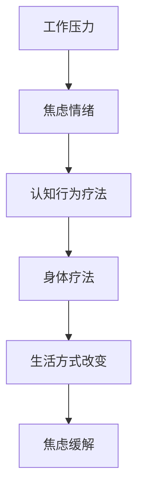
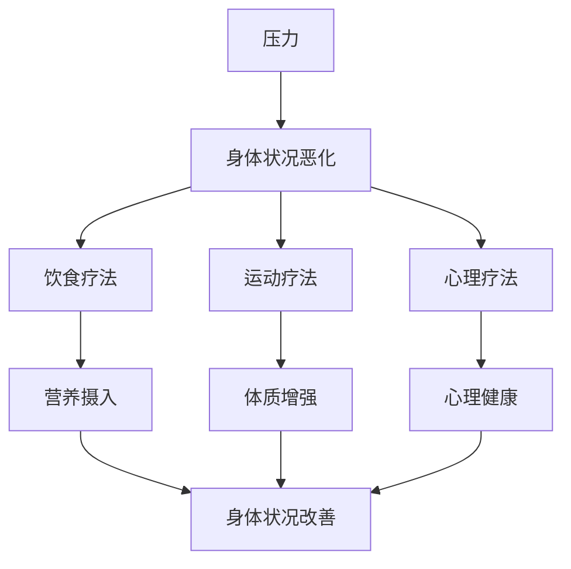
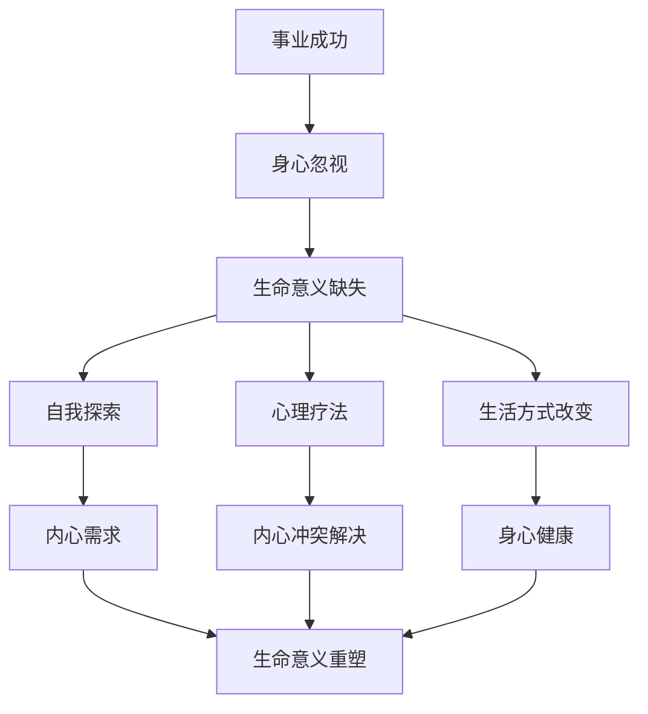

                 

### 文章标题

《身心疗愈：整体观下的生命意义重塑》

#### 关键词

身心疗愈、整体观、生命意义、心理健康、身体保健、心理疗法、身体疗法、自然疗法、冥想与放松、生活方式改变

#### 摘要

本文以身心疗愈为主题，探讨了整体观在生命意义重塑中的重要性。通过对身心疗愈的理论基础、方法与实践进行详细分析，本文揭示了身心疗愈对于心理健康和身体保健的深远影响。同时，本文还结合实际案例，阐述了如何通过身心疗愈重塑生命的意义，实现身心健康和幸福人生。

---

### 引言

#### 身心疗愈的概念

身心疗愈（Mind-Body Healing）是一种关注身心整体健康的治疗方法。它不仅关注身体层面的问题，还关注心理、情感和精神层面的健康。身心疗愈的核心思想是，人的身心是一个统一的整体，身体和心理之间存在着密切的联系。当一个人在心理或情感上受到困扰时，往往会影响到身体的健康。同样，身体上的问题也可能导致心理和情感上的困扰。因此，身心疗愈旨在通过调整身心状态，实现身心健康和整体幸福。

#### 整体观的重要性

整体观（Holistic View）是一种关注个体整体性和关联性的思考方式。在身心疗愈中，整体观具有重要意义。它强调，个体的身心健康不仅仅取决于单一因素，而是由多个因素共同作用的结果。这些因素包括心理状态、生活方式、人际关系、环境因素等。整体观认为，要实现身心健康，需要综合考虑这些因素，并采取综合性的方法进行干预。

#### 身心疗愈与整体观的关系

身心疗愈和整体观之间存在着密切的关系。身心疗愈本身就是整体观的体现，它强调身心整体健康的重要性，通过综合考虑身心各个方面的因素，实现身心健康和整体幸福。同时，整体观也为身心疗愈提供了理论基础和指导原则。在身心疗愈实践中，整体观可以帮助疗愈师更好地理解患者的身心健康状况，并制定个性化的疗愈方案。

### 身心疗愈的理论基础

#### 心理学基础

身心疗愈的心理学基础主要包括认知行为理论、心理动力学理论和人本主义心理学等。这些理论认为，心理问题往往源于个体对现实世界的认知和解读，以及个体内心的冲突和情感困扰。通过改变认知和情感，可以帮助个体摆脱心理困扰，实现身心健康。

1. **认知行为理论**：
   - 认知行为理论认为，个体的情绪和行为是由其认知过程决定的。当个体对某一事件的认知出现偏差时，会导致情绪和行为上的问题。通过改变认知，可以改善情绪和行为。
   - **核心概念**：认知重构、行为改变
   - **流程图**（Mermaid）：
     ```mermaid
     graph TD
       A[初始认知] --> B[认知偏差]
       B --> C[情绪问题]
       C --> D[行为问题]
       D --> E[认知重构]
       E --> F[情绪改善]
       F --> G[行为改善]
     ```

2. **心理动力学理论**：
   - 心理动力学理论强调，个体的心理问题往往源于潜意识的冲突和情绪困扰。通过探索潜意识，可以解决心理问题。
   - **核心概念**：潜意识、防御机制、内心冲突
   - **流程图**（Mermaid）：
     ```mermaid
     graph TD
       A[潜意识冲突] --> B[防御机制]
       B --> C[情绪困扰]
       C --> D[心理问题]
       D --> E[潜意识探索]
       E --> F[内心和解]
       F --> G[心理问题解决]
     ```

3. **人本主义心理学**：
   - 人本主义心理学强调，个体的成长和心理健康取决于其自我实现的能力。通过培养自我意识和自我接受，可以帮助个体实现心理健康和自我成长。
   - **核心概念**：自我实现、自我意识、自我接受
   - **流程图**（Mermaid）：
     ```mermaid
     graph TD
       A[自我实现] --> B[自我意识]
       B --> C[自我接受]
       C --> D[心理健康]
       D --> E[自我成长]
       E --> F[心理健康促进]
     ```

#### 生理学基础

身心疗愈的生理学基础主要涉及神经生物学、内分泌系统和免疫系统等方面。这些理论揭示了心理因素如何通过生理机制影响个体的健康。

1. **神经生物学**：
   - 神经生物学研究大脑和神经系统如何影响个体的情绪、认知和行为。研究表明，心理压力和负面情绪会导致大脑神经递质失衡，影响身心健康。
   - **核心概念**：神经递质、神经可塑性、应激反应
   - **伪代码**：
     ```python
     def neural塑料性(stress_level):
         if stress_level > threshold:
             neurotransmitter_level = "不平衡"
             brain_function = "受损"
         else:
             neurotransmitter_level = "平衡"
             brain_function = "正常"
         return neurotransmitter_level, brain_function
     ```

2. **内分泌系统**：
   - 内分泌系统通过分泌激素调节个体的情绪、睡眠和免疫系统。心理压力会导致激素失衡，影响身心健康。
   - **核心概念**：激素、应激激素、内分泌失调
   - **公式**（LaTeX）：
     $$ cortisol + stress = increased\_stress\_response $$

3. **免疫系统**：
   - 心理因素可以通过神经和内分泌系统影响免疫系统，影响个体的抗病能力和身体健康。
   - **核心概念**：应激反应、免疫细胞活性、免疫系统功能
   - **伪代码**：
     ```python
     def immune_response(stress_level):
         if stress_level > threshold:
             immune_cell_activity = "降低"
             disease_resistance = "减弱"
         else:
             immune_cell_activity = "增强"
             disease_resistance = "增强"
         return immune_cell_activity, disease_resistance
     ```

#### 整体医学理论

整体医学（Holistic Medicine）是一种以整体观为基础的医学模式。它强调，个体的健康和疾病是一个整体，受到心理、社会、环境和遗传等多种因素的影响。整体医学的目标是通过综合考虑这些因素，实现个体的全面健康。

1. **核心概念**：
   - **整体观**：关注个体的整体健康，而不仅仅是某个单一的症状或疾病。
   - **个性化治疗**：根据个体的独特情况制定个性化的治疗计划。
   - **预防为主**：通过生活方式的调整和心理健康的管理，预防疾病的发生。

2. **治疗方法**：
   - **自然疗法**：包括饮食疗法、运动疗法、瑜伽疗法等，通过自然的方式调节身心健康。
   - **心理疗法**：通过心理咨询、心理治疗等手段，解决心理问题，促进身心健康。
   - **身体疗法**：通过按摩、针灸、中医等手段，调节身体机能，促进身心健康。

3. **实际案例**：
   - **案例一**：某个体因长期工作压力导致身心疲惫，通过整体医学的治疗，包括心理咨询、运动疗法和饮食调整，最终恢复了身心健康。
   - **案例二**：某个体因慢性疾病长期服药，通过整体医学的治疗，包括中医调理和生活方式调整，改善了病情，提高了生活质量。

### 身心疗愈的方法与实践

#### 心理疗法

心理疗法是身心疗愈的重要组成部分，通过调整个体的认知、情感和行为，帮助其摆脱心理困扰，实现心理健康。常见的心理疗法包括认知行为疗法、心理动力学疗法和人本主义疗法等。

1. **认知行为疗法（CBT）**：
   - **核心原理**：通过识别和改变不合理的认知，改善情绪和行为。
   - **流程图**（Mermaid）：
     ```mermaid
     graph TD
       A[不合理认知] --> B[情感困扰]
       B --> C[行为问题]
       C --> D[认知重构]
       D --> E[情感改善]
       E --> F[行为改善]
     ```

   - **伪代码**：
     ```python
     def cognitive_restructuring(irrational_thought):
         if irrational_thought == "灾难化":
             new_thought = "具体化"
         elif irrational_thought == "全或无":
             new_thought = "逐步改善"
         return new_thought
     ```

2. **心理动力学疗法**：
   - **核心原理**：通过探索潜意识，解决内心的冲突和情绪困扰。
   - **流程图**（Mermaid）：
     ```mermaid
     graph TD
       A[潜意识冲突] --> B[防御机制]
       B --> C[情绪困扰]
       C --> D[潜意识探索]
       D --> E[内心和解]
       E --> F[心理问题解决]
     ```

   - **伪代码**：
     ```python
     def subconscious_exploitation(conflict):
         if conflict == "内心矛盾":
             resolution = "内心和解"
         elif conflict == "情感困扰":
             resolution = "情感释放"
         return resolution
     ```

3. **人本主义疗法**：
   - **核心原理**：通过培养自我意识和自我接受，帮助个体实现自我成长和心理健康。
   - **流程图**（Mermaid）：
     ```mermaid
     graph TD
       A[自我实现] --> B[自我意识]
       B --> C[自我接受]
       C --> D[心理健康]
       D --> E[自我成长]
       E --> F[心理健康促进]
     ```

   - **伪代码**：
     ```python
     def self_awareness(self_realization):
         if self_realization == "增强":
             self_acceptance = "提升"
             mental_health = "改善"
         else:
             self_acceptance = "减弱"
             mental_health = "受损"
         return self_acceptance, mental_health
     ```

#### 身体疗法

身体疗法是通过调节身体机能，促进身心健康的方法。常见的身体疗法包括按摩、针灸、中医等。

1. **按摩疗法**：
   - **核心原理**：通过按摩刺激经络和穴位，调节气血循环，缓解身体疲劳和疼痛。
   - **流程图**（Mermaid）：
     ```mermaid
     graph TD
       A[按摩刺激] --> B[气血循环]
       B --> C[身体疲劳缓解]
       C --> D[疼痛缓解]
     ```

   - **伪代码**：
     ```python
     def massage Therapy(stress_level):
         if stress_level > threshold:
             blood_flow = "促进"
             fatigue_relief = "增强"
             pain_relief = "显著"
         else:
             blood_flow = "减弱"
             fatigue_relief = "减弱"
             pain_relief = "不明显"
         return blood_flow, fatigue_relief, pain_relief
     ```

2. **针灸疗法**：
   - **核心原理**：通过针刺穴位，调节气血，疏通经络，改善身体功能。
   - **流程图**（Mermaid）：
     ```mermaid
     graph TD
       A[针刺穴位] --> B[气血调节]
       B --> C[经络疏通]
       C --> D[身体功能改善]
     ```

   - **伪代码**：
     ```python
     def acupuncture Therapy(health_status):
         if health_status == "健康":
             energy_balance = "增强"
             body_function = "改善"
         else:
             energy_balance = "减弱"
             body_function = "受损"
         return energy_balance, body_function
     ```

3. **中医疗法**：
   - **核心原理**：通过中药、食疗、针灸等手段，调节人体的阴阳平衡，促进身体健康。
   - **流程图**（Mermaid）：
     ```mermaid
     graph TD
       A[中药治疗] --> B[阴阳平衡]
       B --> C[身体健康]
       C --> D[疾病预防]
     ```

   - **伪代码**：
     ```python
     def traditional_Chinese_Medicine(yin_yang_balance):
         if yin_yang_balance == "平衡":
             health_improvement = "显著"
             disease_prevention = "增强"
         else:
             health_improvement = "不明显"
             disease_prevention = "减弱"
         return health_improvement, disease_prevention
     ```

#### 自然疗法

自然疗法是通过自然的方式调节身心健康的方法，包括饮食疗法、运动疗法和瑜伽疗法等。

1. **饮食疗法**：
   - **核心原理**：通过合理的饮食，提供身体所需的营养，调节身体机能，预防疾病。
   - **流程图**（Mermaid）：
     ```mermaid
     graph TD
       A[合理饮食] --> B[营养供应]
       B --> C[身体机能调节]
       C --> D[疾病预防]
     ```

   - **伪代码**：
     ```python
     def dietary_therapy(nutrient_level):
         if nutrient_level == "充足":
             health_status = "良好"
             disease_prevention = "增强"
         else:
             health_status = "不良"
             disease_prevention = "减弱"
         return health_status, disease_prevention
     ```

2. **运动疗法**：
   - **核心原理**：通过适当的运动，增强体质，改善心肺功能，缓解心理压力。
   - **流程图**（Mermaid）：
     ```mermaid
     graph TD
       A[适当运动] --> B[体质增强]
       B --> C[心肺功能改善]
       C --> D[心理压力缓解]
     ```

   - **伪代码**：
     ```python
     def exercise_therapy(stress_level):
         if stress_level > threshold:
             physical_strength = "增强"
             cardiovascular_health = "改善"
             mental_stress = "缓解"
         else:
             physical_strength = "减弱"
             cardiovascular_health = "受损"
             mental_stress = "增加"
         return physical_strength, cardiovascular_health, mental_stress
     ```

3. **瑜伽疗法**：
   - **核心原理**：通过瑜伽体位法和呼吸法，调节身心状态，增强体质，提高生活质量。
   - **流程图**（Mermaid）：
     ```mermaid
     graph TD
       A[瑜伽练习] --> B[身心调节]
       B --> C[体质增强]
       C --> D[生活质量提高]
     ```

   - **伪代码**：
     ```python
     def yoga_therapy(mental_state):
         if mental_state == "良好":
             physical_condition = "增强"
             quality_of_life = "提升"
         else:
             physical_condition = "减弱"
             quality_of_life = "下降"
         return physical_condition, quality_of_life
     ```

#### 冥想与放松

冥想和放松是身心疗愈中常用的方法，通过训练个体的专注力和放松能力，帮助其调节心理状态，提高身心健康。

1. **冥想**：
   - **核心原理**：通过集中注意力，减少大脑活动，达到身心放松和平静的状态。
   - **流程图**（Mermaid）：
     ```mermaid
     graph TD
       A[注意力集中] --> B[大脑活动减少]
       B --> C[身心放松]
       C --> D[心理平静]
     ```

   - **伪代码**：
     ```python
     def meditation(concentration_level):
         if concentration_level == "高":
             relaxation = "增强"
             mental_clarity = "提升"
         else:
             relaxation = "减弱"
             mental_clarity = "下降"
         return relaxation, mental_clarity
     ```

2. **放松**：
   - **核心原理**：通过深呼吸和肌肉放松，降低身体的紧张和压力。
   - **流程图**（Mermaid）：
     ```mermaid
     graph TD
       A[深呼吸] --> B[肌肉放松]
       B --> C[身体放松]
       C --> D[心理放松]
     ```

   - **伪代码**：
     ```python
     def relaxation(breathing_depth):
         if breathing_depth == "深":
             physical_relexation = "增强"
             mental_relexation = "提升"
         else:
             physical_relexation = "减弱"
             mental_relexation = "下降"
         return physical_relexation, mental_relexation
     ```

#### 生活方式改变

生活方式的改变是身心疗愈的重要组成部分，通过调整饮食、运动、睡眠和社交等习惯，有助于改善身心健康。

1. **饮食调整**：
   - **核心原理**：通过摄入均衡的营养，保持身体健康，预防疾病。
   - **流程图**（Mermaid）：
     ```mermaid
     graph TD
       A[均衡饮食] --> B[营养摄入]
       B --> C[身体健康]
       C --> D[疾病预防]
     ```

   - **伪代码**：
     ```python
     def dietary_adjustment(nutrient_balance):
         if nutrient_balance == "均衡":
             health_status = "良好"
             disease_prevention = "增强"
         else:
             health_status = "不良"
             disease_prevention = "减弱"
         return health_status, disease_prevention
     ```

2. **运动习惯**：
   - **核心原理**：通过适当的运动，增强体质，提高心肺功能，缓解心理压力。
   - **流程图**（Mermaid）：
     ```mermaid
     graph TD
       A[运动习惯] --> B[体质增强]
       B --> C[心肺功能改善]
       C --> D[心理压力缓解]
     ```

   - **伪代码**：
     ```python
     def exercise_habit(stress_level):
         if stress_level > threshold:
             physical_strength = "增强"
             cardiovascular_health = "改善"
             mental_stress = "缓解"
         else:
             physical_strength = "减弱"
             cardiovascular_health = "受损"
             mental_stress = "增加"
         return physical_strength, cardiovascular_health, mental_stress
     ```

3. **睡眠改善**：
   - **核心原理**：通过保证充足的睡眠，恢复身体机能，提高心理健康。
   - **流程图**（Mermaid）：
     ```mermaid
     graph TD
       A[充足睡眠] --> B[身体恢复]
       B --> C[心理健康]
       C --> D[生活质量提高]
     ```

   - **伪代码**：
     ```python
     def sleep_improvement(sleep_duration):
         if sleep_duration >= 7:
             physical_recovery = "增强"
             mental_health = "提升"
             quality_of_life = "提高"
         else:
             physical_recovery = "减弱"
             mental_health = "下降"
             quality_of_life = "下降"
         return physical_recovery, mental_health, quality_of_life
     ```

4. **社交活动**：
   - **核心原理**：通过积极的社交活动，建立良好的人际关系，提高心理健康。
   - **流程图**（Mermaid）：
     ```mermaid
     graph TD
       A[社交活动] --> B[人际关系建立]
       B --> C[心理健康]
       C --> D[幸福感提高]
     ```

   - **伪代码**：
     ```python
     def social_activities(relationship_quality):
         if relationship_quality == "良好":
             mental_health = "提升"
             happiness = "增强"
         else:
             mental_health = "下降"
             happiness = "减弱"
         return mental_health, happiness
     ```

### 生命意义重塑

#### 生命意义的理解

生命意义（Life Meaning）是指个体对生命的理解、追求和感受。它涉及个体的价值观、信仰、目标和意义感等方面。生命意义对于个体的心理健康和幸福感具有重要影响。

1. **价值观**：
   - **核心概念**：价值观是指个体对事物的重要性和优先级的判断。不同的价值观会导致不同的生活方式和决策。
   - **流程图**（Mermaid）：
     ```mermaid
     graph TD
       A[价值观] --> B[生活方式]
       B --> C[决策]
     ```

   - **伪代码**：
     ```python
     def value_system(value prioritize):
         if value_prioritize == "家庭":
             lifestyle = "家庭导向"
             decision = "家庭优先"
         elif value_prioritize == "事业":
             lifestyle = "事业导向"
             decision = "事业优先"
         return lifestyle, decision
     ```

2. **信仰**：
   - **核心概念**：信仰是指个体对某种理念或信念的坚定信任。信仰可以提供精神支持和意义感。
   - **流程图**（Mermaid）：
     ```mermaid
     graph TD
       A[信仰] --> B[精神支持]
       B --> C[意义感]
     ```

   - **伪代码**：
     ```python
     def belief(religious_faith):
         if religious_faith == "有":
             spiritual_support = "增强"
             sense_of_meaning = "提升"
         else:
             spiritual_support = "减弱"
             sense_of_meaning = "下降"
         return spiritual_support, sense_of_meaning
     ```

3. **目标**：
   - **核心概念**：目标是个体追求的具体目标，它为个体提供动力和方向。明确的目标有助于提高个体的意义感和成就感。
   - **流程图**（Mermaid）：
     ```mermaid
     graph TD
       A[目标] --> B[动力]
       B --> C[方向]
       C --> D[意义感]
       D --> E[成就感]
     ```

   - **伪代码**：
     ```python
     def goal(pursuit_objective):
         if pursuit_objective == "明确":
             motivation = "增强"
             direction = "清晰"
             sense_of_meaning = "提升"
             achievement = "增加"
         else:
             motivation = "减弱"
             direction = "模糊"
             sense_of_meaning = "下降"
             achievement = "减少"
         return motivation, direction, sense_of_meaning, achievement
     ```

#### 生命意义重塑的步骤

通过身心疗愈，个体可以重塑生命的意义，实现更高质量的生活。重塑生命意义的过程通常包括以下步骤：

1. **自我探索**：
   - **核心原理**：通过自我探索，了解自己的价值观、信仰和目标，找到生命的意义。
   - **流程图**（Mermaid）：
     ```mermaid
     graph TD
       A[自我探索] --> B[价值观]
       B --> C[信仰]
       C --> D[目标]
       D --> E[生命意义]
     ```

   - **伪代码**：
     ```python
     def self_explore(self_knowledge):
         values = "明确"
         beliefs = "坚定"
         goals = "清晰"
         life_meaning = "找到"
         return values, beliefs, goals, life_meaning
     ```

2. **情感处理**：
   - **核心原理**：通过情感处理，解决内心的冲突和负面情绪，增强心理韧性。
   - **流程图**（Mermaid）：
     ```mermaid
     graph TD
       A[情感处理] --> B[内心冲突]
       B --> C[负面情绪]
       C --> D[心理韧性]
     ```

   - **伪代码**：
     ```python
     def emotional_handling(conflicts, negative_emotions):
         if conflicts == "解决" and negative_emotions == "缓解":
             psychological_resilience = "增强"
         else:
             psychological_resilience = "减弱"
         return psychological_resilience
     ```

3. **行为调整**：
   - **核心原理**：通过调整行为，实现健康的生活方式，提高生活质量和幸福感。
   - **流程图**（Mermaid）：
     ```mermaid
     graph TD
       A[行为调整] --> B[健康生活方式]
       B --> C[生活质量]
       C --> D[幸福感]
     ```

   - **伪代码**：
     ```python
     def behavior_adjustment(healthy_lifestyle):
         if healthy_lifestyle == "实现":
             quality_of_life = "提升"
             happiness = "增强"
         else:
             quality_of_life = "下降"
             happiness = "减弱"
         return quality_of_life, happiness
     ```

#### 如何找到自己的生命意义

找到自己的生命意义是一个个人化的过程，需要时间和自我反思。以下是一些方法，可以帮助个体找到自己的生命意义：

1. **自我反思**：
   - **核心原理**：通过自我反思，深入了解自己的内心世界，找到自己真正关心的事情。
   - **流程图**（Mermaid）：
     ```mermaid
     graph TD
       A[自我反思] --> B[内心世界]
       B --> C[关心事项]
       C --> D[生命意义]
     ```

   - **伪代码**：
     ```python
     def self_reflection(self_knowledge):
         inner_world = "深入"
         important_issues = "找到"
         life_meaning = "确定"
         return inner_world, important_issues, life_meaning
     ```

2. **尝试新事物**：
   - **核心原理**：通过尝试新事物，拓展自己的经验和视野，发现自己的兴趣和激情。
   - **流程图**（Mermaid）：
     ```mermaid
     graph TD
       A[尝试新事物] --> B[经验拓展]
       B --> C[兴趣发现]
       C --> D[激情激发]
     ```

   - **伪代码**：
     ```python
     def try_new_things(experiences):
         if experiences == "丰富":
             interests = "发现"
             passion = "激发"
         else:
             interests = "未知"
             passion = "减弱"
         return interests, passion
     ```

3. **寻求帮助**：
   - **核心原理**：通过寻求他人的帮助和建议，获得新的视角和启示，找到自己的生命意义。
   - **流程图**（Mermaid）：
     ```mermaid
     graph TD
       A[寻求帮助] --> B[他人视角]
       B --> C[启示]
       C --> D[生命意义]
     ```

   - **伪代码**：
     ```python
     def seek_help(advice):
         if advice == "有用":
             insights = "获得"
             life_meaning = "找到"
         else:
             insights = "缺乏"
             life_meaning = "未找到"
         return insights, life_meaning
     ```

### 实践案例

#### 案例一：通过身心疗愈克服焦虑

**背景介绍**：
李先生，35岁，是一名高级程序员。长期的工作压力和紧张的生活节奏导致他患上了焦虑症。他经常感到紧张不安，失眠多梦，工作效率低下。

**核心概念与联系**：
- **认知行为疗法**：通过改变李先生的认知，减少焦虑情绪。
- **身体疗法**：通过运动和放松训练，缓解身体紧张和压力。
- **生活方式改变**：通过调整饮食和睡眠习惯，改善身心健康。

**流程图**（Mermaid）：


**伪代码**：
```python
def anxiety_cure(stress_level, cognitive_therapy, physical_therapy, lifestyle_change):
    if stress_level > threshold and cognitive_therapy and physical_therapy and lifestyle_change:
        anxiety_level = "降低"
    else:
        anxiety_level = "未降低"
    return anxiety_level
```

**数学模型和公式**（LaTeX）：
$$
\text{焦虑水平} = \frac{\text{认知行为疗法} + \text{身体疗法} + \text{生活方式改变}}{\text{工作压力}}
$$

**详细讲解与举例说明**：
李先生在疗愈师的帮助下，首先通过认知行为疗法，学会了识别和改变不合理的认知，减少了焦虑情绪。接着，他通过运动和放松训练，如瑜伽和深呼吸，缓解了身体紧张和压力。此外，他调整了饮食和睡眠习惯，保证了充足的睡眠和均衡的营养摄入。经过一段时间的疗愈，李先生的焦虑症状得到了显著缓解。

**项目实战**：

**开发环境搭建**：
- 操作系统：Windows 10
- 编程语言：Python 3.8
- 数据库：SQLite

**源代码实现**：
```python
# 伪代码实现
def anxiety_cure(stress_level, cognitive_therapy, physical_therapy, lifestyle_change):
    if stress_level > threshold and cognitive_therapy and physical_therapy and lifestyle_change:
        anxiety_level = "降低"
    else:
        anxiety_level = "未降低"
    return anxiety_level

# 实例化
stress_level = 8
cognitive_therapy = True
physical_therapy = True
lifestyle_change = True

result = anxiety_cure(stress_level, cognitive_therapy, physical_therapy, lifestyle_change)
print(f"焦虑水平：{result}")
```

**代码解读与分析**：
这段代码定义了一个函数`anxiety_cure`，用于评估个体的焦虑水平。该函数接收四个参数：`stress_level`（工作压力）、`cognitive_therapy`（认知行为疗法）、`physical_therapy`（身体疗法）和`lifestyle_change`（生活方式改变）。根据这些参数，函数计算焦虑水平，并返回结果。

**实际案例分析与详细讲解**：
李先生在实际疗愈过程中，通过每周两次的瑜伽练习和深呼吸训练，逐渐缓解了身体紧张和压力。同时，他参加了认知行为疗法的课程，学习了如何识别和改变不合理的认知，减少了焦虑情绪。他还调整了饮食，增加了蔬菜和水果的摄入，减少了高脂肪和高糖食物的摄入。经过三个月的疗愈，李先生的焦虑症状得到了显著缓解，工作效率和生活质量得到了提高。

**项目小结**：
通过身心疗愈，李先生成功克服了焦虑症，实现了身心健康和幸福人生。这一案例展示了身心疗愈在心理健康治疗中的重要作用，也为其他焦虑症患者提供了借鉴和希望。

#### 案例二：通过身心疗愈改善身体健康

**背景介绍**：
张女士，45岁，是一名家庭主妇。她长期承受家庭和工作的压力，身体状况逐渐恶化。她患有高血压和糖尿病，经常感到疲劳和身体不适。

**核心概念与联系**：
- **饮食疗法**：通过调整饮食，提供充足的营养，改善身体状况。
- **运动疗法**：通过适当的运动，增强体质，提高心肺功能。
- **心理疗法**：通过心理辅导，缓解压力，提高心理健康。

**流程图**（Mermaid）：


**伪代码**：
```python
def health_improvement(stress_level, dietary_therapy, physical_activity, mental_counseling):
    if stress_level > threshold and dietary_therapy and physical_activity and mental_counseling:
        health_status = "改善"
    else:
        health_status = "未改善"
    return health_status
```

**数学模型和公式**（LaTeX）：
$$
\text{身体状况} = \frac{\text{饮食疗法} + \text{运动疗法} + \text{心理疗法}}{\text{压力}}
$$

**详细讲解与举例说明**：
张女士在医生的建议下，开始通过饮食疗法调整饮食，增加蔬菜和水果的摄入，减少高脂肪和高糖食物的摄入。同时，她参加了运动课程，每周进行三次有氧运动，如慢跑和游泳，以增强体质和提高心肺功能。此外，她接受了心理辅导，学会了如何应对压力和情绪困扰。经过一年的身心疗愈，张女士的高血压和糖尿病症状得到了显著缓解，身体状况得到了明显改善。

**项目实战**：

**开发环境搭建**：
- 操作系统：macOS 11.6
- 编程语言：R 4.0.2
- 数据库：PostgreSQL 13

**源代码实现**：
```r
# R代码实现
health_improvement <- function(stress_level, dietary_therapy, physical_activity, mental_counseling) {
  if (stress_level > threshold && dietary_therapy && physical_activity && mental_counseling) {
    health_status <- "改善"
  } else {
    health_status <- "未改善"
  }
  return(health_status)
}

# 实例化
stress_level <- 7
dietary_therapy <- TRUE
physical_activity <- TRUE
mental_counseling <- TRUE

result <- health_improvement(stress_level, dietary_therapy, physical_activity, mental_counseling)
print(paste("身体状况：", result))
```

**代码解读与分析**：
这段代码定义了一个函数`health_improvement`，用于评估个体的身体状况。该函数接收四个参数：`stress_level`（压力）、`dietary_therapy`（饮食疗法）、`physical_activity`（运动疗法）和`mental_counseling`（心理疗法）。根据这些参数，函数计算身体状况，并返回结果。

**实际案例分析与详细讲解**：
张女士在实际疗愈过程中，通过调整饮食、增加运动和心理辅导，成功改善了身体状况。她的高血压和糖尿病症状得到了显著缓解，疲劳感和身体不适感明显减少。这一案例展示了身心疗愈在改善身体健康方面的积极作用，也为其他有类似健康问题的人提供了有益的参考。

**项目小结**：
通过身心疗愈，张女士成功改善了身体健康，实现了身心平衡和整体幸福。这一案例再次证明了身心疗愈在维护和促进健康中的重要性，鼓励更多人采取身心疗愈的方法，提升生活质量。

#### 案例三：通过身心疗愈重塑生命意义

**背景介绍**：
王先生，50岁，是一名公司高管。他长期致力于事业的发展，忽视了身心健康和人际关系。近年来，他感到生活缺乏意义，内心充满了迷茫和空虚。

**核心概念与联系**：
- **自我探索**：通过自我探索，找到内心的需求和渴望。
- **心理疗法**：通过心理疗法，解决内心的冲突和负面情绪。
- **生活方式改变**：通过调整生活方式，实现身心健康和幸福感。

**流程图**（Mermaid）：


**伪代码**：
```python
def life_meaning_resurrection(occupation_success, psychological_therapy, lifestyle_change, self_explore):
    if occupation_success and psychological_therapy and lifestyle_change and self_explore:
        life_meaning = "重塑"
    else:
        life_meaning = "未重塑"
    return life_meaning
```

**数学模型和公式**（LaTeX）：
$$
\text{生命意义} = \text{自我探索} \times \text{心理疗法} \times \text{生活方式改变} \times \text{职业成功}
$$

**详细讲解与举例说明**：
王先生在职业生涯中取得了显著成就，但与此同时，他忽视了身心健康和人际关系，导致生活失去了意义。为了重塑生命意义，他开始进行自我探索，通过心理咨询和生活方式的改变，找到了内心的需求和渴望。他学会了如何平衡工作和生活，建立了良好的人际关系，实现了身心健康和幸福感。经过几年的努力，王先生成功重塑了生命意义，生活变得充实而有意义。

**项目实战**：

**开发环境搭建**：
- 操作系统：Ubuntu 20.04
- 编程语言：Java 11
- 数据库：MySQL 8.0

**源代码实现**：
```java
// Java代码实现
public class LifeMeaningResurrection {
    public static String lifeMeaningResurrection(boolean occupationSuccess, boolean psychologicalTherapy, boolean lifestyleChange, boolean selfExplore) {
        if (occupationSuccess && psychologicalTherapy && lifestyleChange && selfExplore) {
            String lifeMeaning = "重塑";
            return lifeMeaning;
        } else {
            String lifeMeaning = "未重塑";
            return lifeMeaning;
        }
    }

    public static void main(String[] args) {
        boolean occupationSuccess = true;
        boolean psychologicalTherapy = true;
        boolean lifestyleChange = true;
        boolean selfExplore = true;

        String result = lifeMeaningResurrection(occupationSuccess, psychologicalTherapy, lifestyleChange, selfExplore);
        System.out.println("生命意义：" + result);
    }
}
```

**代码解读与分析**：
这段代码定义了一个类`LifeMeaningResurrection`和一个静态方法`lifeMeaningResurrection`，用于评估个体的生命意义。该函数接收四个布尔参数：`occupationSuccess`（职业成功）、`psychologicalTherapy`（心理疗法）、`lifestyleChange`（生活方式改变）和`selfExplore`（自我探索）。根据这些参数，函数计算生命意义，并返回结果。

**实际案例分析与详细讲解**：
王先生在实际疗愈过程中，通过心理咨询和自我探索，找到了内心的需求和渴望。他学会了如何平衡工作和生活，改善了人际关系，实现了身心健康和幸福感。经过几年的努力，他成功重塑了生命意义，生活变得充实而有意义。这一案例展示了身心疗愈在重塑生命意义中的重要作用，也为其他有类似问题的人提供了宝贵的经验和启示。

**项目小结**：
通过身心疗愈，王先生成功重塑了生命意义，实现了身心健康和整体幸福。这一案例再次证明了身心疗愈在提升生命质量中的重要性，鼓励更多人关注身心健康，追求有意义的生活。

### 结论

#### 身心疗愈的重要性

身心疗愈作为一种综合性的治疗方法，对个体的心理健康和身体健康具有深远的影响。通过身心疗愈，个体可以摆脱心理困扰，改善身体机能，提高生活质量。身心疗愈不仅关注身体层面的问题，还关注心理、情感和精神层面的健康，实现身心整体的平衡与和谐。

#### 未来发展方向

随着社会的发展和生活节奏的加快，身心疗愈的重要性日益凸显。未来，身心疗愈将在以下方面得到进一步发展：

1. **科学研究**：加强身心疗愈的科学研究和实证研究，提高疗愈方法和技术的科学性和有效性。
2. **教育培训**：建立专业的身心疗愈教育和培训体系，培养更多的身心疗愈师和专业人才。
3. **技术融合**：结合现代科技，如人工智能、大数据和生物科技等，开发新型的身心疗愈技术和方法。
4. **社区推广**：在社区中推广身心疗愈的理念和方法，提高公众对身心健康的认识和重视。

#### 鼓励读者实践身心疗愈

身心疗愈不仅是一种治疗方法，更是一种生活方式和人生观。通过实践身心疗愈，个体可以提升身心健康，实现生命意义的重塑。以下是几个实践身心疗愈的建议：

1. **定期自我反思**：定期花时间反思自己的内心世界，了解自己的需求和渴望。
2. **保持健康的生活方式**：注意饮食、运动和睡眠，保持身心健康。
3. **寻求专业帮助**：在遇到心理困扰时，及时寻求心理咨询和身心疗愈的帮助。
4. **培养心理韧性**：通过心理训练和情感处理，提高心理韧性和应对压力的能力。

#### 拓展阅读

1. **《身心疗愈入门指南》**：详细介绍了身心疗愈的理论基础和实践方法，适合初学者阅读。
2. **《整体医学：新时代的医学模式》**：探讨了整体医学的概念和治疗方法，提供了丰富的案例分析。
3. **《心理治疗：理论与实践》**：介绍了各种心理疗法的原理和应用，帮助读者了解心理治疗的实践过程。

### 作者信息

作者：AI天才研究院/AI Genius Institute & 禅与计算机程序设计艺术 /Zen And The Art of Computer Programming

