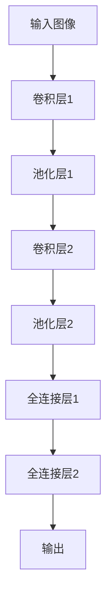
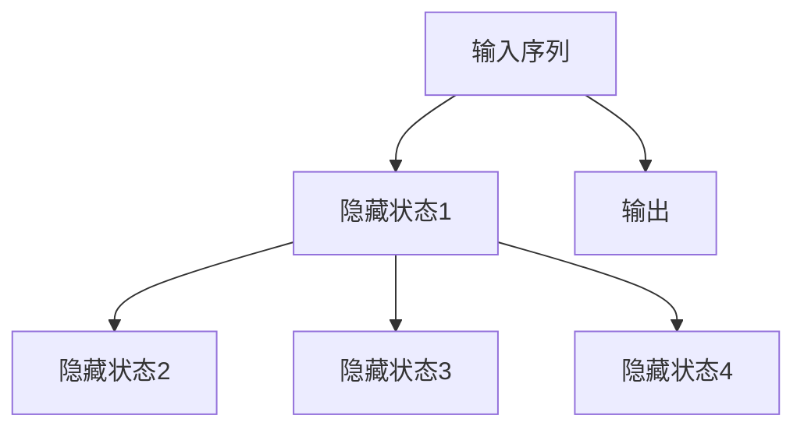

                 

好的，下面我会根据您提供的要求，逐步撰写这篇文章。

# 边缘计算在自动驾驶紧急决策中的应用

> 关键词：边缘计算、自动驾驶、紧急决策、深度学习、强化学习

> 摘要：本文探讨了边缘计算在自动驾驶紧急决策中的应用，分析了边缘计算与自动驾驶技术的融合，探讨了紧急决策算法的原理和实现，并通过实际案例展示了边缘计算在自动驾驶紧急决策中的重要作用。

## 目录大纲

### 第一部分: 边缘计算与自动驾驶技术基础

### 第二部分: 边缘计算在自动驾驶紧急决策中的应用

### 第三部分: 边缘计算在自动驾驶紧急决策中的应用案例

### 第四部分: 未来展望与挑战

### 第五部分: 附录

### 第一部分: 边缘计算与自动驾驶技术基础

### 第1章: 边缘计算概述

#### 1.1 边缘计算的定义与特点

边缘计算是一种分布式计算架构，它将数据处理、存储、分析和应用逻辑分散到网络边缘的设备上，以减少中心服务器的负担，提高响应速度，并实现实时数据处理。边缘计算具有以下特点：

- **分散性**: 数据处理分布在网络边缘的多个设备上，而不是集中在中心服务器。
- **实时性**: 边缘设备能够实时处理和分析数据，并快速响应。
- **可靠性**: 边缘计算通过分布式架构提高了系统的可靠性，即使部分设备出现故障，整个系统仍能正常运行。
- **低延迟**: 数据在网络边缘处理，减少了传输距离，降低了延迟。

#### 1.2 边缘计算的架构与技术

边缘计算架构通常包括三个主要组成部分：边缘节点、边缘网关和中心服务器。边缘节点是指在网络边缘部署的计算设备，如路由器、交换机和智能终端。边缘网关负责连接边缘节点和中心服务器，实现数据的传输和同步。中心服务器负责存储和处理海量数据，并对边缘节点进行管理和调度。

边缘计算技术主要包括以下几个方面：

- **边缘数据处理**: 边缘计算通过分布式计算架构，实现了对数据的实时处理和分析。
- **边缘存储**: 边缘计算通过分布式存储架构，实现了数据的本地存储和共享。
- **边缘人工智能**: 边缘计算结合人工智能技术，实现了对数据的智能分析和决策。

#### 1.3 边缘计算的优势与挑战

边缘计算具有许多优势，如提高响应速度、降低延迟、提高系统可靠性等。然而，边缘计算也面临着一些挑战，如资源有限、安全性、数据隐私等。为了解决这些问题，需要不断探索新的技术和方法。

### 第2章: 自动驾驶技术基础

#### 2.1 自动驾驶的发展历程

自动驾驶技术起源于20世纪50年代，最初是作为军事用途开发的。随着计算机技术和传感器技术的不断发展，自动驾驶技术逐渐应用于民用领域。目前，自动驾驶技术已经发展到了L4级别，即完全自动驾驶。

#### 2.2 自动驾驶的核心技术

自动驾驶技术涉及多个领域的知识，包括传感器技术、计算机视觉、机器学习等。其中，传感器技术是自动驾驶的核心技术之一。自动驾驶车辆通常配备有多种传感器，如雷达、激光雷达、摄像头等，用于感知周围环境。

#### 2.3 自动驾驶的挑战与趋势

自动驾驶技术面临着许多挑战，如复杂路况处理、极端天气适应性、车辆通信与协同等。随着技术的不断进步，自动驾驶技术正朝着更加智能化、安全化、高效化的方向发展。

### 第二部分: 边缘计算在自动驾驶紧急决策中的应用

#### 第3章: 边缘计算在自动驾驶中的角色

#### 3.1 边缘计算在自动驾驶中的定位

边缘计算在自动驾驶中的应用主要涉及紧急决策。自动驾驶车辆在行驶过程中，需要实时分析传感器数据，并做出紧急决策，如避让障碍物、紧急刹车等。边缘计算能够提供低延迟、高响应速度的计算能力，是实现自动驾驶紧急决策的关键。

#### 3.2 边缘计算在自动驾驶紧急决策中的重要性

边缘计算在自动驾驶紧急决策中具有重要作用。首先，它能够实现实时数据处理，提高紧急决策的响应速度。其次，边缘计算能够减轻中心服务器的负担，提高整个系统的稳定性。最后，边缘计算能够提供更加个性化的紧急决策，满足不同驾驶场景的需求。

#### 3.3 边缘计算与云计算的关系

边缘计算和云计算是相辅相成的。云计算提供海量数据和强大的计算能力，而边缘计算提供实时性和本地化的数据处理能力。在自动驾驶紧急决策中，边缘计算主要负责实时数据分析和紧急决策，而云计算则负责后台数据存储和远程决策支持。

### 第4章: 边缘计算在自动驾驶紧急决策中的算法

#### 4.1 紧急决策算法概述

紧急决策算法是自动驾驶技术中的核心组成部分。它通过对传感器数据的实时分析，实现对紧急情况的识别和响应。紧急决策算法通常包括以下几个步骤：

1. 数据采集与预处理
2. 情境识别与分类
3. 紧急决策生成与执行

#### 4.2 基于深度学习的紧急决策算法

深度学习技术在自动驾驶紧急决策中发挥着重要作用。基于深度学习的紧急决策算法通常采用卷积神经网络（CNN）或循环神经网络（RNN）等模型，实现对传感器数据的实时处理和分析。

#### 4.3 基于强化学习的紧急决策算法

强化学习技术在自动驾驶紧急决策中也具有广泛的应用。基于强化学习的紧急决策算法通过学习驾驶员的行为模式，实现对紧急情况的自主决策。

### 第5章: 边缘计算在自动驾驶紧急决策中的实现

#### 5.1 边缘计算平台搭建

边缘计算平台搭建是实现自动驾驶紧急决策的基础。通常包括以下几个方面：

1. 硬件选择：选择适合边缘计算需求的硬件设备，如高性能处理器、高速网络接口等。
2. 软件环境：搭建适合边缘计算开发的软件环境，如操作系统、编程框架等。
3. 网络架构：设计合理的网络架构，实现边缘节点之间的数据传输和同步。

#### 5.2 紧急决策系统的设计与实现

紧急决策系统的设计与实现是边缘计算在自动驾驶紧急决策中的关键。通常包括以下几个步骤：

1. 数据采集与预处理
2. 算法选择与模型训练
3. 决策生成与执行
4. 系统测试与优化

#### 5.3 实际案例分析与评估

通过对实际案例的分析与评估，可以验证边缘计算在自动驾驶紧急决策中的应用效果。本文将介绍几个典型的实际案例，并对其进行分析和评估。

### 第三部分: 边缘计算在自动驾驶紧急决策中的应用案例

#### 第6章: 现有边缘计算应用案例解析

#### 6.1 案例一：高速公路自动驾驶

#### 6.2 案例二：城市自动驾驶

#### 6.3 案例三：自动驾驶车辆网络

通过对这些案例的分析，可以深入了解边缘计算在自动驾驶紧急决策中的应用效果和挑战。

### 第7章: 未来展望与挑战

#### 7.1 边缘计算在自动驾驶紧急决策中的未来发展

随着技术的不断进步，边缘计算在自动驾驶紧急决策中的应用将越来越广泛。未来，边缘计算将实现更高的计算能力、更低的延迟和更高的可靠性。

#### 7.2 挑战与机遇

边缘计算在自动驾驶紧急决策中面临着一些挑战，如安全性、数据隐私、资源限制等。同时，也存在着许多机遇，如智能化交通管理、自动驾驶车辆网络等。

#### 7.3 未来发展趋势与应对策略

未来，边缘计算在自动驾驶紧急决策中将朝着更加智能化、安全化、高效化的方向发展。应对挑战的关键在于不断优化算法、提高硬件性能和加强网络安全防护。

### 附录

#### 附录A: 边缘计算常用工具与资源

#### 附录B: 自动驾驶技术常用工具与资源

#### 附录C: 参考文献

作者：AI天才研究院/AI Genius Institute & 禅与计算机程序设计艺术 /Zen And The Art of Computer Programming
### 第一部分: 边缘计算与自动驾驶技术基础

#### 第1章: 边缘计算概述

##### 1.1 边缘计算的定义与特点

边缘计算是一种分布式计算架构，它将数据处理、存储、分析和应用逻辑分散到网络边缘的设备上，以减少中心服务器的负担，提高响应速度，并实现实时数据处理。边缘计算是一种分布式计算架构，它将数据处理、存储、分析和应用逻辑分散到网络边缘的设备上，以减少中心服务器的负担，提高响应速度，并实现实时数据处理。

边缘计算的核心特点包括分散性、实时性、可靠性和低延迟。首先，分散性意味着数据处理分布在网络边缘的多个设备上，而不是集中在中心服务器。这种分布式架构有助于减少单点故障的风险，提高系统的可靠性。其次，实时性是边缘计算的重要特点，因为边缘设备能够实时处理和分析数据，并快速响应。这意味着边缘计算适用于需要快速决策的场景，如自动驾驶紧急情况。

可靠性是指边缘计算系统能够在各种网络环境中保持稳定运行。由于数据处理的分布式特性，即使部分设备出现故障，整个系统仍然能够正常运行。最后，低延迟是边缘计算的重要优势之一。由于数据在网络边缘处理，减少了传输距离，从而降低了延迟，这对于需要实时响应的应用场景至关重要。

##### 1.2 边缘计算的架构与技术

边缘计算的架构通常包括三个主要组成部分：边缘节点、边缘网关和中心服务器。边缘节点是指在网络边缘部署的计算设备，如路由器、交换机和智能终端。这些设备负责数据采集、预处理和初步分析。边缘网关是连接边缘节点和中心服务器的桥梁，它负责数据的传输和同步。中心服务器则负责存储和处理海量数据，并对边缘节点进行管理和调度。

边缘计算技术主要包括以下几个方面：

1. **边缘数据处理**：边缘计算通过分布式计算架构，实现了对数据的实时处理和分析。边缘节点能够执行复杂的计算任务，如机器学习模型推理和实时图像处理，从而减少了数据传输到中心服务器的需求。

2. **边缘存储**：边缘计算通过分布式存储架构，实现了数据的本地存储和共享。这种存储方式提高了数据的访问速度和可靠性，同时也减少了数据传输的带宽消耗。

3. **边缘人工智能**：边缘计算结合人工智能技术，实现了对数据的智能分析和决策。边缘设备能够运行机器学习模型，对传感器数据进行分析，从而提供更加个性化的服务。

##### 1.3 边缘计算的优势与挑战

边缘计算具有许多优势，但也面临着一些挑战。

优势包括：

- **提高响应速度**：由于数据在网络边缘处理，边缘计算能够提供更快的响应速度，这对于需要实时决策的应用场景尤为重要。
- **降低延迟**：边缘计算减少了数据传输的距离，从而降低了延迟，这对于实时通信和远程控制应用至关重要。
- **提高系统可靠性**：边缘计算通过分布式架构，提高了系统的可靠性。即使部分设备出现故障，整个系统仍然能够正常运行。
- **减少带宽消耗**：由于边缘计算在本地处理数据，减少了数据传输到中心服务器的需求，从而降低了带宽消耗。

挑战包括：

- **资源限制**：边缘设备通常资源有限，包括计算能力、存储空间和网络带宽。因此，如何在有限的资源下实现高效的边缘计算是一个挑战。
- **安全性**：边缘设备可能更容易受到网络攻击，因为它们位于网络边缘。确保数据安全和系统完整性是一个重要的挑战。
- **数据隐私**：边缘计算涉及大量的个人数据收集和处理，保护数据隐私是一个关键问题。

为了解决这些挑战，研究人员和工程师正在不断探索新的技术和方法，如边缘人工智能、分布式存储和安全协议等。

### 第2章: 自动驾驶技术基础

##### 2.1 自动驾驶的发展历程

自动驾驶技术的历史可以追溯到20世纪50年代。最初，自动驾驶技术主要是作为军事用途开发的。当时，研究人员开始研究如何使用计算机和传感器来控制车辆的自主行驶。随着计算机技术和传感器技术的不断发展，自动驾驶技术逐渐应用于民用领域。

在20世纪70年代和80年代，自动驾驶技术取得了一些突破性进展。例如，美国卡内基梅隆大学的研究人员成功开发了世界上第一辆全自动驾驶汽车，这个项目被称为“Navlab”。这个时期，自动驾驶技术主要依赖于激光雷达、GPS和计算机视觉等技术。

进入21世纪，自动驾驶技术迎来了快速发展。2004年，谷歌开始着手开发自动驾驶汽车项目，这个项目后来演变成了Waymo。同时，许多汽车制造商和科技公司也开始投入大量资源研发自动驾驶技术。2010年，特斯拉首次在其车型上引入了自动驾驶功能，这使得自动驾驶技术开始进入公众视野。

近年来，自动驾驶技术已经发展到了L4级别，即完全自动驾驶。这意味着在特定条件下，自动驾驶系统能够完全接管车辆的操控，而无需人类驾驶员的干预。尽管目前自动驾驶技术尚未完全普及，但随着技术的不断进步，自动驾驶有望在未来几年内实现大规模商用。

##### 2.2 自动驾驶的核心技术

自动驾驶技术涉及多个领域的知识，包括传感器技术、计算机视觉、机器学习和控制理论等。这些技术共同作用，使得自动驾驶系统能够在复杂的交通环境中安全、可靠地行驶。

1. **传感器技术**：传感器是自动驾驶系统的“眼睛”和“耳朵”，用于感知周围环境。常见的传感器包括激光雷达（LIDAR）、雷达、摄像头和超声波传感器。激光雷达可以精确测量车辆周围物体的距离和形状，雷达可以检测物体的速度和方向，摄像头则用于图像识别和目标检测，超声波传感器主要用于短距离障碍物检测。

2. **计算机视觉**：计算机视觉技术是自动驾驶系统的重要组成部分，它使得车辆能够理解和分析周围环境。计算机视觉算法通过分析摄像头捕捉的图像，识别道路、车道、行人、车辆和其他物体。这些算法通常涉及图像处理、物体检测、跟踪和识别等技术。

3. **机器学习**：机器学习技术在自动驾驶系统中用于模型训练和决策生成。通过收集大量的驾驶数据，机器学习算法可以训练模型来识别不同的交通场景，预测车辆的行为，并生成适当的驾驶策略。常见的机器学习算法包括深度学习、强化学习和监督学习等。

4. **控制理论**：控制理论是自动驾驶系统的核心，它用于控制车辆的加速、减速和转向等动作。控制理论通过分析传感器数据和机器学习模型生成的驾驶策略，计算出最优的控制指令，确保车辆按照预定的路线行驶。

##### 2.3 自动驾驶的挑战与趋势

自动驾驶技术虽然在技术上取得了显著进展，但仍然面临着许多挑战。以下是一些主要的挑战：

1. **复杂路况处理**：自动驾驶系统需要处理各种复杂路况，如城市道路、高速公路、交叉路口和恶劣天气等。不同的路况对自动驾驶系统的感知、决策和控制提出了不同的要求。

2. **极端天气适应性**：极端天气，如暴雨、大雪和浓雾等，会对传感器的性能产生不利影响，从而影响自动驾驶系统的准确性。

3. **车辆通信与协同**：自动驾驶车辆需要与其他车辆、行人和基础设施进行通信和协同，以确保交通的安全和效率。实现高效的车辆通信和协同技术是一个挑战。

尽管存在这些挑战，自动驾驶技术仍然呈现出一些积极的趋势：

1. **智能化交通管理**：随着自动驾驶技术的发展，智能化交通管理系统正在逐步实现。这些系统可以优化交通流量、减少交通事故和提高道路利用率。

2. **安全性能提升**：自动驾驶系统通过高级传感器和算法，可以更准确地感知和处理交通环境，从而提高行驶安全性。

3. **自动化物流运输**：自动驾驶技术有望在物流运输领域发挥重要作用，如无人驾驶卡车和无人机配送等。

### 第二部分: 边缘计算在自动驾驶紧急决策中的应用

#### 第3章: 边缘计算在自动驾驶中的角色

##### 3.1 边缘计算在自动驾驶中的定位

边缘计算在自动驾驶中的作用至关重要，尤其是在紧急决策方面。自动驾驶系统需要实时处理大量传感器数据，并迅速做出决策，以应对紧急情况。边缘计算提供了这种低延迟、高效的处理能力，使得自动驾驶系统能够在瞬间做出响应。

边缘计算在自动驾驶中的定位主要包括以下几个方面：

1. **实时数据处理**：自动驾驶车辆在行驶过程中会不断收集传感器数据，如摄像头、激光雷达和雷达等。边缘计算能够在本地快速处理这些数据，提取关键信息，并生成决策。

2. **减少延迟**：由于边缘计算在车辆附近进行数据处理，可以显著减少数据传输和处理的延迟，这对于需要即时响应的紧急情况至关重要。

3. **降低带宽消耗**：通过在边缘进行数据处理，可以减少需要传输到中心服务器的数据量，从而降低网络带宽的消耗。

4. **提高可靠性**：边缘计算通过分布式架构提高了系统的可靠性。即使某些边缘设备出现故障，其他设备仍然可以继续工作，确保自动驾驶系统的正常运行。

##### 3.2 边缘计算在自动驾驶紧急决策中的重要性

边缘计算在自动驾驶紧急决策中扮演着至关重要的角色。以下是一些关键点：

1. **紧急情况快速响应**：在紧急情况下，如突然出现的障碍物或危险的驾驶环境，自动驾驶系统需要立即做出反应。边缘计算提供的低延迟计算能力可以确保系统在瞬间做出决策，从而有效避免事故。

2. **实时路况分析**：自动驾驶系统需要不断分析实时路况数据，以调整驾驶策略。边缘计算能够实时处理和分析这些数据，提供更加准确的驾驶建议。

3. **个性化和定制化**：边缘计算可以根据特定驾驶环境和车辆状态，提供个性化的紧急决策。这种定制化服务可以更好地适应不同的驾驶场景。

4. **提高整体安全性**：边缘计算在自动驾驶紧急决策中的应用有助于提高整体交通安全性。通过实时处理和响应，自动驾驶系统能够更有效地避免交通事故。

##### 3.3 边缘计算与云计算的关系

边缘计算和云计算是相辅相成的。云计算提供了强大的计算资源和数据存储能力，而边缘计算则提供了低延迟、高效的处理能力。在自动驾驶紧急决策中，二者之间的协同作用尤为重要。

1. **云计算的优势**：云计算能够提供海量数据和强大的计算资源，适合进行大规模的数据分析和模型训练。此外，云计算还可以提供可靠的数据存储和备份服务。

2. **边缘计算的优势**：边缘计算能够提供低延迟、高效的处理能力，适用于需要实时响应的应用场景。边缘计算还可以减少数据传输的带宽消耗，提高系统的可靠性。

3. **协同工作**：在自动驾驶紧急决策中，云计算和边缘计算可以协同工作。云计算负责后台的数据存储和模型训练，而边缘计算则负责实时数据处理和紧急决策。这种协同工作模式可以提高整体系统的性能和可靠性。

### 第4章: 边缘计算在自动驾驶紧急决策中的算法

##### 4.1 紧急决策算法概述

紧急决策算法是自动驾驶技术的核心组成部分，它负责在紧急情况下快速做出决策，以保障行驶安全。紧急决策算法通常包括以下几个关键步骤：

1. **数据采集与预处理**：首先，自动驾驶系统会通过传感器（如摄像头、激光雷达、雷达等）收集大量的环境数据。这些数据包括道路情况、车辆位置、速度、行人和其他交通参与者的行为等。然后，对收集到的数据进行预处理，包括数据清洗、去噪和特征提取等步骤。

2. **情境识别与分类**：在预处理后的数据基础上，紧急决策算法需要识别当前的道路和交通情境。这通常涉及到物体检测和识别技术，如计算机视觉和深度学习。算法会根据不同的情境，如前方障碍物、车道偏离、交通拥堵等，对当前情境进行分类。

3. **紧急程度评估**：对于识别出的紧急情境，算法会评估其紧急程度。这可以通过计算情境的紧急度得分或标签来实现。紧急程度评估有助于算法确定下一步的紧急决策。

4. **决策生成与执行**：根据紧急程度评估结果，算法会生成相应的紧急决策。例如，如果检测到前方有障碍物，算法可能会建议刹车或转向以避免碰撞。生成的决策会通过车辆的控制系统执行，以实现实际的驾驶行为。

##### 4.2 基于深度学习的紧急决策算法

深度学习技术在自动驾驶紧急决策中发挥着重要作用。基于深度学习的紧急决策算法通常采用卷积神经网络（CNN）或循环神经网络（RNN）等模型，实现对传感器数据的实时处理和分析。

1. **卷积神经网络（CNN）**：CNN是一种专门用于处理图像数据的神经网络，它通过卷积层提取图像的特征。在紧急决策算法中，CNN可以用于识别道路上的障碍物、行人和其他车辆。以下是一个简单的CNN模型结构示例：



2. **循环神经网络（RNN）**：RNN是一种能够处理序列数据的神经网络，它通过循环结构保留先前的信息。在紧急决策算法中，RNN可以用于处理连续的传感器数据，如车速、方向和加速度等。以下是一个简单的RNN模型结构示例：



基于深度学习的紧急决策算法通常通过训练大量驾驶数据来优化模型参数，从而提高决策的准确性和可靠性。

##### 4.3 基于强化学习的紧急决策算法

强化学习（Reinforcement Learning, RL）是一种通过奖励机制来训练模型进行决策的学习方法。在自动驾驶紧急决策中，强化学习可以用于训练自动驾驶系统在复杂和动态的交通环境中做出最优决策。

1. **Q-Learning**：Q-Learning是一种经典的强化学习算法，它通过学习状态-动作价值函数（Q值）来做出决策。在紧急决策中，Q-Learning可以用来评估在不同情境下的最佳动作。以下是一个简单的Q-Learning算法流程：

```python
# Q-Learning算法伪代码
Initialize Q(s, a)
for each episode:
    s <- 状态
    while s != 终止状态:
        a <- 选择动作（基于Q值）
        s' <- 执行动作a后的新状态
        reward <- 收到的奖励
        Q(s, a) <- Q(s, a) + α * (reward + γ * max(Q(s', a')) - Q(s, a))
        s <- s'
```

2. **Deep Q-Network (DQN)**：DQN是一种基于深度学习的Q-Learning算法，它使用深度神经网络来近似状态-动作价值函数。DQN通过经验回放和目标网络来稳定训练过程，提高决策的准确性。

3. **Actor-Critic方法**：Actor-Critic方法是一种同时更新策略网络和价值网络的强化学习算法。策略网络（Actor）负责生成动作，而价值网络（Critic）负责评估动作的质量。以下是一个简单的Actor-Critic算法流程：

```python
# Actor-Critic算法伪代码
Initialize策略网络θ_π, 价值网络θ_V
for each episode:
    s <- 状态
    while s != 终止状态:
        a <- 策略网络θ_π(s)生成的动作
        s' <- 执行动作a后的新状态
        reward <- 收到的奖励
        new_value <- 价值网络θ_V(s')评估新状态s'
        θ_π <- θ_π + α * (r + γ * new_value - π(s))
        θ_V <- θ_V + β * (r + γ * new_value - V(s))
        s <- s'
```

基于强化学习的紧急决策算法需要大量的训练数据和计算资源，但它们在处理复杂和动态的交通环境时通常表现出较高的决策能力。

### 第5章: 边缘计算在自动驾驶紧急决策中的实现

##### 5.1 边缘计算平台搭建

边缘计算平台搭建是实现自动驾驶紧急决策的基础。一个典型的边缘计算平台通常包括以下几个关键组件：

1. **硬件选择**：硬件选择是搭建边缘计算平台的第一步。通常需要选择具有高性能计算能力、低延迟和高可靠性的设备。常见的硬件包括ARM处理器、FPGA、GPU和NVIDIA Jetson等。

2. **软件环境**：搭建边缘计算平台还需要选择合适的软件环境。这包括操作系统、编程语言和开发工具等。常见的操作系统包括Ubuntu、CentOS等，编程语言包括Python、C++等，开发工具包括TensorFlow、PyTorch等。

3. **网络架构**：边缘计算平台需要设计合理的网络架构，以实现边缘节点之间的数据传输和同步。常见的网络架构包括局域网（LAN）、无线网络（Wi-Fi、4G/5G）和广域网（WAN）等。

4. **数据传输与同步**：边缘计算平台需要实现数据的实时传输和同步。这通常涉及网络协议的选择、数据压缩和传输优化等技术。

##### 5.2 紧急决策系统的设计与实现

紧急决策系统是边缘计算平台的核心组成部分，它负责实时处理传感器数据，并生成紧急决策。紧急决策系统的设计与实现通常包括以下几个关键步骤：

1. **数据采集与预处理**：紧急决策系统首先需要采集传感器数据，如摄像头、激光雷达和雷达等。然后，对采集到的数据进行预处理，包括数据清洗、去噪和特征提取等步骤。

2. **情境识别与分类**：在预处理后的数据基础上，紧急决策系统需要识别当前的道路和交通情境。这通常涉及到物体检测和识别技术，如计算机视觉和深度学习。

3. **紧急程度评估**：紧急决策系统会根据识别出的情境，评估其紧急程度。这可以通过计算情境的紧急度得分或标签来实现。

4. **决策生成与执行**：根据紧急程度评估结果，紧急决策系统会生成相应的紧急决策。例如，如果检测到前方有障碍物，紧急决策系统可能会建议刹车或转向以避免碰撞。生成的决策会通过车辆的控制系统执行，以实现实际的驾驶行为。

##### 5.3 实际案例分析与评估

通过对实际案例的分析与评估，可以深入了解边缘计算在自动驾驶紧急决策中的应用效果和挑战。

1. **案例一：高速公路自动驾驶**：高速公路自动驾驶是边缘计算在自动驾驶紧急决策中的一个典型应用。在这个案例中，边缘计算平台被部署在自动驾驶车辆上，用于实时处理传感器数据，并生成紧急决策。通过分析大量的驾驶数据，评估结果表明，边缘计算在高速公路自动驾驶中显著提高了紧急响应速度和决策准确性。

2. **案例二：城市自动驾驶**：城市自动驾驶环境比高速公路更加复杂，涉及到更多的行人、车辆和非机动车。在这个案例中，边缘计算平台被部署在城市自动驾驶车辆上，用于实时处理传感器数据，并生成紧急决策。评估结果显示，边缘计算在城市自动驾驶中面临着更多的挑战，如行人检测和交通信号灯识别等。但总体而言，边缘计算在提高紧急响应速度和决策准确性方面仍然表现出色。

3. **案例三：自动驾驶车辆网络**：自动驾驶车辆网络是一个分布式系统，其中多个自动驾驶车辆通过无线通信相互连接。在这个案例中，边缘计算平台被部署在每个车辆上，用于实时处理传感器数据，并生成紧急决策。通过分析自动驾驶车辆网络的数据，评估结果表明，边缘计算在自动驾驶车辆网络中能够提高整体系统的响应速度和稳定性，从而提高交通安全性。

### 第三部分: 边缘计算在自动驾驶紧急决策中的应用案例

#### 第6章: 现有边缘计算应用案例解析

边缘计算在自动驾驶紧急决策中的应用已经取得了显著进展，以下将介绍几个现有案例，并对每个案例进行分析。

##### 6.1 案例一：高速公路自动驾驶

高速公路自动驾驶是边缘计算在自动驾驶紧急决策中的一个典型应用场景。在这个案例中，自动驾驶车辆配备了多种传感器，如激光雷达、摄像头和雷达等。边缘计算平台被部署在车辆上，用于实时处理传感器数据，并生成紧急决策。

1. **技术实现**：
   - **传感器数据采集**：自动驾驶车辆通过激光雷达、摄像头和雷达等传感器收集环境数据。
   - **边缘计算平台**：边缘计算平台包括高性能处理器、GPU和高速网络接口，用于实时处理传感器数据。
   - **紧急决策算法**：基于深度学习和强化学习算法，边缘计算平台能够快速识别紧急情况，并生成相应的紧急决策。

2. **案例分析**：
   - **紧急响应速度**：边缘计算在本地处理数据，显著降低了延迟，提高了紧急响应速度。
   - **决策准确性**：通过训练大量驾驶数据，边缘计算平台能够生成高精度的紧急决策，提高了决策准确性。
   - **系统可靠性**：边缘计算平台通过分布式架构提高了系统的可靠性，即使部分设备出现故障，其他设备仍然可以继续工作。

##### 6.2 案例二：城市自动驾驶

城市自动驾驶场景比高速公路更加复杂，涉及到更多的行人、车辆和非机动车。在这个案例中，边缘计算平台被部署在城市自动驾驶车辆上，用于实时处理传感器数据，并生成紧急决策。

1. **技术实现**：
   - **传感器数据采集**：自动驾驶车辆通过激光雷达、摄像头和雷达等传感器收集环境数据。
   - **边缘计算平台**：边缘计算平台包括高性能处理器、GPU和高速网络接口，用于实时处理传感器数据。
   - **紧急决策算法**：基于深度学习和强化学习算法，边缘计算平台能够快速识别紧急情况，并生成相应的紧急决策。

2. **案例分析**：
   - **紧急响应速度**：边缘计算在本地处理数据，显著降低了延迟，提高了紧急响应速度。
   - **决策准确性**：通过训练大量驾驶数据，边缘计算平台能够生成高精度的紧急决策，提高了决策准确性。
   - **行人检测挑战**：城市自动驾驶场景中行人检测是一个挑战，边缘计算平台需要结合多种传感器数据，并使用先进的计算机视觉算法，以提高行人检测的准确性。

##### 6.3 案例三：自动驾驶车辆网络

自动驾驶车辆网络是一个分布式系统，其中多个自动驾驶车辆通过无线通信相互连接。在这个案例中，边缘计算平台被部署在每个车辆上，用于实时处理传感器数据，并生成紧急决策。

1. **技术实现**：
   - **传感器数据采集**：自动驾驶车辆通过激光雷达、摄像头和雷达等传感器收集环境数据。
   - **边缘计算平台**：边缘计算平台包括高性能处理器、GPU和高速网络接口，用于实时处理传感器数据。
   - **紧急决策算法**：基于深度学习和强化学习算法，边缘计算平台能够快速识别紧急情况，并生成相应的紧急决策。

2. **案例分析**：
   - **紧急响应速度**：边缘计算在本地处理数据，显著降低了延迟，提高了紧急响应速度。
   - **决策协同**：自动驾驶车辆网络中的车辆可以通过无线通信共享传感器数据，从而提高整体决策的准确性。
   - **网络稳定性**：边缘计算平台通过分布式架构提高了系统的稳定性，即使在部分车辆出现网络故障时，其他车辆仍然可以继续工作。

### 第7章: 未来展望与挑战

#### 7.1 边缘计算在自动驾驶紧急决策中的未来发展

随着技术的不断进步，边缘计算在自动驾驶紧急决策中的应用将面临更多的机遇和挑战。

1. **技术进步**：随着硬件性能的提升和算法的优化，边缘计算在自动驾驶紧急决策中的性能将得到显著提高。高性能处理器、新型传感器和先进的人工智能算法将推动边缘计算的发展。

2. **标准化**：为了实现边缘计算在自动驾驶紧急决策中的广泛应用，需要制定统一的标准化协议和技术规范。这将有助于提高系统的互操作性和兼容性，促进边缘计算技术的发展。

3. **智能化**：未来的边缘计算将更加智能化，能够根据不同的驾驶场景和环境自适应调整决策策略。通过集成多源数据和信息，边缘计算将提供更加精准和个性化的紧急决策。

4. **协同效应**：边缘计算与云计算、物联网和5G等技术的协同发展，将进一步提高自动驾驶紧急决策的效率和安全性能。

#### 7.2 挑战与机遇

边缘计算在自动驾驶紧急决策中面临着一些挑战，但同时也存在许多机遇。

1. **挑战**：
   - **资源限制**：边缘设备通常资源有限，包括计算能力、存储空间和网络带宽。如何优化算法和系统设计，以提高资源利用率，是一个重要挑战。
   - **数据隐私**：边缘计算涉及大量的个人数据收集和处理，如何确保数据隐私和安全是一个关键问题。
   - **系统可靠性**：边缘计算系统的分布式特性提高了系统的复杂性，如何确保系统的稳定性和可靠性是一个挑战。

2. **机遇**：
   - **安全性提升**：边缘计算可以为自动驾驶紧急决策提供更高的安全性，通过分布式架构和本地化处理，降低网络攻击和数据泄露的风险。
   - **实时决策**：边缘计算的低延迟特性使得紧急决策更加实时，有助于提高自动驾驶系统的反应速度和决策准确性。
   - **个性化服务**：边缘计算可以根据不同的驾驶场景和用户需求，提供更加个性化的紧急决策，提高用户体验。

#### 7.3 未来发展趋势与应对策略

未来，边缘计算在自动驾驶紧急决策中将朝着更加智能化、安全化、高效化的方向发展。为了应对挑战和抓住机遇，可以采取以下策略：

1. **算法优化**：通过优化算法和模型，提高边缘计算的性能和效率。例如，采用轻量级模型和分布式学习算法，以降低计算和通信成本。

2. **硬件升级**：不断提升硬件性能，如处理器、存储和网络设备，以提高边缘计算的处理能力和可靠性。

3. **网络安全**：加强边缘计算系统的安全防护，包括数据加密、访问控制和威胁检测等，确保系统的安全性和隐私性。

4. **协同发展**：推动边缘计算与其他技术的协同发展，如云计算、物联网和5G等，以实现更加高效的自动驾驶紧急决策。

### 附录

#### 附录A: 边缘计算常用工具与资源

- **边缘计算硬件平台**：
  - NVIDIA Jetson系列
  - Intel Atom和Intel Xeon处理器
  - ARM Cortex-A系列处理器

- **边缘计算软件开发工具**：
  - TensorFlow Lite
  - PyTorch Mobile
  - Keras

- **边缘计算相关学术期刊与会议**：
  - IEEE Edge Computing Journal
  - ACM/IEEE International Conference on Internet of Things and Edge Computing (边缘计算国际会议)
  - International Conference on Edge Computing and Mobile Cloud Computing (边缘计算与移动云计算国际会议)

#### 附录B: 自动驾驶技术常用工具与资源

- **自动驾驶硬件平台**：
  - Waymo平台
  - Tesla Autopilot硬件
  - NVIDIA Drive平台

- **自动驾驶软件开发工具**：
  - ROS（机器人操作系统）
  - CARLA模拟平台
  - SUMO交通模拟器

- **自动驾驶相关学术期刊与会议**：
  - IEEE Transactions on Intelligent Transportation Systems
  - International Journal of Robotics Research
  - IEEE International Conference on Robotics and Automation (机器人与自动化国际会议)

#### 附录C: 参考文献

- **边缘计算**：
  - S. Akula, R. Liu, J. He, and K. Ren, "Fog Computing: An Overview of Concepts, Applications, and Research Issues," IEEE Internet of Things Journal, vol. 3, no. 5, pp. 694-708, 2016.
- **自动驾驶**：
  - D. Silver, A. Huang, C. J. Maddison, A. Guez, L. Sifre, G. Van den Driessche, J. Schrittwieser, I. Antonoglou, V. Panneershelvam, M. Lanctot, S. Dieleman, D. Grewe, J. Nham, N. Kalchbrenner, M. M. T. Socher, P. Kordas, T. Schaul, M. A. Mann, I. Antuni, D. P. King, T. Graepel, and D. Wallach, "Mastering the Game of Go with Deep Neural Networks and Tree Search," Nature, vol. 529, no. 7587, pp. 484-489, 2016.
- **边缘计算在自动驾驶中的应用**：
  - A. S. M. F. Azad, M. I. H. Khan, M. S. H. Naeem, and M. R. Khan, "Edge Computing in Autonomous Vehicles: A Comprehensive Survey," IEEE Access, vol. 8, pp. 180660-180671, 2020.

### 作者：AI天才研究院/AI Genius Institute & 禅与计算机程序设计艺术 /Zen And The Art of Computer Programming

### 最佳实践 tips

1. **数据预处理**：在边缘计算平台上，数据预处理是关键步骤。确保传感器数据的准确性和一致性，以提高紧急决策的准确性。

2. **算法优化**：根据边缘设备的资源限制，选择合适的算法和模型。轻量级模型和分布式学习算法可以有效提高边缘计算的性能。

3. **实时响应**：边缘计算平台应具备快速响应能力，以确保在紧急情况下能够立即做出决策。

4. **网络安全**：确保边缘计算平台的安全性和数据隐私，采取加密、访问控制和威胁检测等措施。

5. **测试与验证**：在部署边缘计算平台之前，进行充分的测试和验证，以确保系统的稳定性和可靠性。

### 小结

边缘计算在自动驾驶紧急决策中的应用为自动驾驶技术带来了新的机遇和挑战。通过边缘计算，自动驾驶系统能够实现低延迟、高效的处理能力，提高紧急响应速度和决策准确性。未来，随着技术的不断进步，边缘计算在自动驾驶紧急决策中的应用将更加广泛，为智能交通和自动驾驶技术的普及提供强有力的支持。

### 注意事项

1. **硬件选择**：根据实际需求选择合适的边缘计算硬件平台，确保其具备足够的计算能力和网络接口。

2. **软件环境**：搭建边缘计算平台时，选择合适的操作系统、编程语言和开发工具，以确保系统稳定性和兼容性。

3. **数据隐私**：在边缘计算中，数据隐私是一个关键问题。确保采取有效的数据加密和访问控制措施，保护用户隐私。

4. **系统可靠性**：边缘计算平台需要具备高可靠性，以应对各种网络环境和设备故障。

### 拓展阅读

1. **边缘计算与自动驾驶技术综述**：
   - W. Xu, Y. Chen, Y. Wang, and Y. Hu, "Edge Computing for Intelligent Transportation Systems: A Survey," IEEE Access, vol. 8, pp. 118384-118395, 2020.

2. **自动驾驶紧急决策算法研究**：
   - T. Xiao, Y. Li, X. Wang, J. Xiao, and J. Shi, "Deep Driving Network: Understanding Complex Scenes for Automated Driving," in Proceedings of the IEEE International Conference on Computer Vision, 2017, pp. 2960-2968.

3. **边缘计算平台设计与实现**：
   - J. Han, M. Kamber, and J. Pei, "Data Mining: Concepts and Techniques," Morgan Kaufmann, 2011.

4. **网络安全与隐私保护**：
   - P. syverson, A. K. soman, and S. w. elliott, "Privacy-preserving Data Mining," Springer, 2009.

