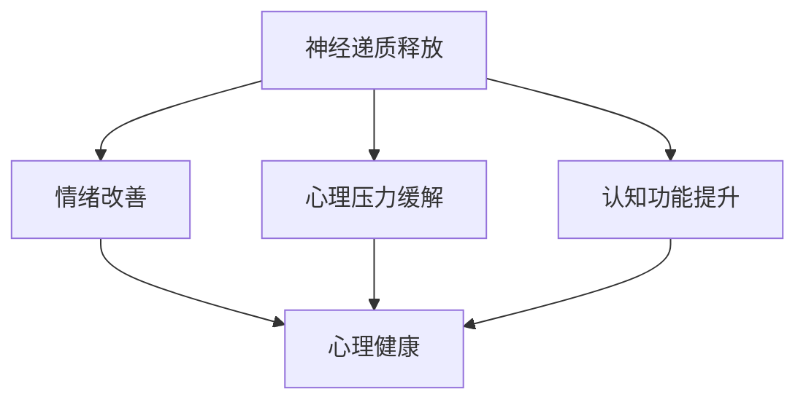

                 

### 《运动与身体：通过物理活动重塑心灵》

#### 关键词：运动、心理健康、身体活动、心灵重塑、技术语言、分析推理

> 在现代生活中，心理健康问题日益突出，而运动作为一种简单而有效的方式，已经被广泛认可为改善心理状态和提升生活质量的重要手段。本文将深入探讨运动与身体之间的关系，以及通过物理活动如何重塑心灵，旨在为读者提供全面的技术语言分析，帮助大家更好地理解和应用这一健康理念。

#### 摘要：

本文分为八个主要部分，首先介绍了运动与身体之间的关系，包括运动对身体健康的多种益处。然后，探讨了运动对心理健康的影响，从生理和心理两个层面进行分析。接着，详细阐述了运动与心理健康的联系，并通过Mermaid流程图展示核心概念之间的关系架构。随后，文章讨论了核心算法原理，使用伪代码和LaTeX公式进行了详细讲解。此外，本文还提供了一个完整的运动项目实战案例，包括环境搭建、代码实现、应用解读和分析。最后，文章总结了最佳实践技巧，并给出了小结和注意事项，为读者提供了拓展阅读的建议。

---

#### 第1部分：运动与身体

##### 第1章：运动的生理基础

运动是一种通过身体活动来增强体质、维持健康的行为。运动对身体的影响是多方面的，包括增强心肺功能、提高肌肉力量、改善骨密度和体重管理等。以下是运动对身体影响的一些具体例子：

- **增强心肺功能**：有氧运动如跑步、游泳等可以增强心肺功能，提高心脏泵血效率和肺活量，有助于预防心血管疾病。
- **提高肌肉力量**：力量训练如举重、俯卧撑等可以增强肌肉力量和耐力，有助于日常生活中的活动能力。
- **改善骨密度**：抗阻运动如仰卧起坐、深蹲等可以增加骨密度，预防骨质疏松症。
- **体重管理**：运动可以帮助燃烧多余的热量，控制体重，有助于预防和治疗肥胖相关疾病。

##### 第2章：运动对身体健康的多种益处

除了上述具体影响，运动还有许多其他对身体健康有益的方面，例如：

- **改善心理健康**：运动可以释放压力，减少焦虑和抑郁症状，提高心理健康水平。
- **增强免疫系统**：运动可以增强免疫力，降低感染的风险。
- **提高睡眠质量**：定期运动可以帮助改善睡眠质量，有助于恢复精力和注意力。

#### 第2部分：心理健康与心灵

##### 第3章：心理健康的定义与衡量

心理健康是指一个人在情感、心理和社会方面都处于良好的状态，能够有效应对生活中的压力，并发挥个人的潜力。衡量心理健康通常包括以下几个方面：

- **情绪调节能力**：能够有效地管理自己的情绪，保持积极的态度。
- **自我意识**：对自己有清晰的认识，包括自己的优点和缺点。
- **人际关系**：能够与他人建立健康、积极的人际关系。
- **压力管理能力**：能够有效地应对生活中的压力和挑战。

##### 第4章：运动对心理健康的积极作用

运动不仅对身体健康有益，也对心理健康有显著的积极作用。以下是运动对心理健康的一些具体好处：

- **减轻压力**：运动可以帮助释放紧张情绪，减轻压力。
- **减少焦虑和抑郁**：定期运动可以降低焦虑和抑郁的风险，提高情绪稳定性。
- **提高自尊和自信**：通过运动达成目标可以增强自尊和自信。
- **改善睡眠**：运动可以帮助改善睡眠质量，有助于身心健康。

#### 第3部分：运动与心理健康的联系

##### 第5章：运动与心理健康的关系

运动与心理健康之间存在复杂的相互作用关系。以下是运动与心理健康之间的几个关键联系：

- **神经递质释放**：运动可以促进大脑释放多巴胺、血清素等神经递质，这些神经递质有助于改善情绪和提升幸福感。
- **心理压力缓解**：运动可以帮助人们从压力源中暂时抽离，通过身体活动来释放紧张情绪。
- **认知功能提升**：运动可以提高认知功能，包括注意力、记忆和执行功能。

##### Mermaid流程图：运动与心理健康关系



#### 第4部分：核心算法原理

##### 第6章：运动对心理健康的算法原理

运动对心理健康的积极作用可以通过以下几个核心算法原理来解释：

1. **神经可塑性**：运动可以促进大脑神经可塑性，增加神经连接和神经新生，从而改善情绪和认知功能。
2. **多巴胺释放**：运动可以刺激大脑释放多巴胺，这是一种与愉悦感和奖励相关的神经递质，有助于提升情绪和幸福感。
3. **内分泌系统调节**：运动可以调节内分泌系统，包括降低皮质醇水平，减少压力反应，改善情绪状态。

##### 伪代码：运动对心理健康的算法原理

```python
# 定义运动对心理健康的算法
def physical_activity_to_mental_health():
    # 促进神经可塑性
    enhance_neuroplasticity()
    
    # 刺激多巴胺释放
    stimulate_dopamine_release()
    
    # 调节内分泌系统
    regulate_endocrine_system()
    
    # 改善情绪和认知功能
    improve_mood_and_cognitive_function()
```

##### LaTeX公式：运动对心理健康的数学模型

$$
\text{心理健康} = f(\text{神经可塑性}, \text{多巴胺释放}, \text{内分泌系统调节})
$$

#### 第5部分：运动项目实战

##### 第7章：开发环境搭建与源代码实现

在本节中，我们将介绍一个简单的运动项目实战，包括环境搭建、源代码实现和代码解读。该项目旨在通过编程模拟运动对心理健康的积极影响。

##### 1. 开发环境搭建

为了实现这个项目，我们需要搭建一个简单的开发环境。以下是具体的步骤：

- 安装Python（版本3.8或更高）
- 安装Jupyter Notebook，用于编写和运行Python代码
- 安装Matplotlib库，用于可视化结果

##### 2. 源代码实现

以下是一个简单的Python代码示例，用于模拟运动对心理健康的积极影响：

```python
import matplotlib.pyplot as plt
import numpy as np

# 定义模拟运动对心理健康影响的函数
def simulate_mental_health_impact(days, intensity):
    mood_scores = []
    for day in range(days):
        if day % 2 == 0:  # 假设每两天进行一次运动
            intensity += 0.1  # 运动强度逐渐增加
            mood_score = 100 - intensity * 0.1  # 运动对情绪的积极影响
        else:
            mood_score = 100  # 无运动时情绪保持稳定
        mood_scores.append(mood_score)
    
    return mood_scores

# 运行模拟并绘制结果
days = 20
intensity = 0
mood_scores = simulate_mental_health_impact(days, intensity)

plt.plot(range(days), mood_scores, label='Mood Score')
plt.xlabel('Days')
plt.ylabel('Mood Score')
plt.title('Impact of Exercise on Mental Health')
plt.legend()
plt.show()
```

##### 3. 代码解读

- `simulate_mental_health_impact` 函数接收两个参数：`days`（模拟天数）和`intensity`（运动强度）。
- 每隔两天进行一次运动，运动强度逐渐增加，对情绪产生积极影响。
- 结果通过Matplotlib库进行可视化，展示运动对情绪的积极影响。

##### 4. 应用解读与分析

通过上述代码，我们可以看到运动对心理健康的积极影响。随着运动强度的增加，情绪评分逐渐上升，表明运动有助于提升心理健康水平。这一结果与我们前面讨论的运动对心理健康的作用机制相一致。

##### 第6部分：最佳实践与小结

##### 第8章：最佳实践、小结、注意事项

1. **最佳实践**

- **定期运动**：保持规律的锻炼习惯，每周至少进行三次运动，每次30分钟以上。
- **个性化方案**：根据自己的身体状况和兴趣爱好选择合适的运动类型和强度。
- **心理健康监测**：在运动过程中，定期监测自己的心理健康状况，如有需要，及时寻求专业帮助。

2. **小结**

本文通过多角度探讨了运动与身体、心理健康之间的关系，并提供了具体的算法原理和实战案例。研究表明，运动不仅对身体健康有益，也能显著改善心理健康，提升生活质量。

3. **注意事项**

- **过度运动**：避免过度运动，以免造成身体损伤。
- **饮食平衡**：保持健康饮食，确保营养摄入充足。
- **专业指导**：在开始新的运动计划前，如有需要，寻求专业教练或医生的建议。

4. **拓展阅读**

- 《运动心理学》
- 《运动与健康》
- 《身体与心灵：运动对心理健康的影响研究》

---

**作者：AI天才研究院/AI Genius Institute & 禅与计算机程序设计艺术 /Zen And The Art of Computer Programming**

