                 


## 文章标题
### 运动与身心健康：找回生活的节奏

**关键词：** 运动、身心健康、科学规划、心理健康、营养与恢复、案例分析

**摘要：**
本文从科学的角度出发，探讨了运动对身心健康的重要性。通过分析运动科学基础、不同类型的运动及其健康益处，以及运动规划、营养与恢复等方面的内容，帮助读者找到适合自身的运动方式，提高生活质量和心理健康水平。本文还结合实际案例，提供了运动实践的建议和注意事项。

### 引言
#### 运动的定义与重要性
运动，广义上指的是一切身体活动的行为，包括日常活动、工作、娱乐等。然而，在本文中，我们将重点讨论有目的的、规律性的身体锻炼活动。运动对身心健康的影响已被大量科学研究证实，它不仅有助于保持良好的体形和体能，还能改善心理健康，提高生活质量。

**运动科学基础：**
运动科学是一门跨学科的研究领域，它结合了解剖学、生理学、生物力学等知识，研究人体如何通过运动来保持健康和适应环境变化。理解运动科学基础，对于制定科学的运动规划至关重要。

#### 运动与身心健康的关系
运动对身心健康有着多重积极影响。首先，有规律的体育活动可以增强心肺功能、提高免疫力、降低慢性疾病风险。其次，运动有助于改善心理健康，通过释放内啡肽等神经递质，缓解压力和焦虑，提高情绪状态。此外，运动还能增强自信心、提高社交能力，对生活质量的提升具有重要作用。

**运动不足对身心健康的影响**
与运动的积极效果相对，缺乏运动对身心健康也有显著的负面影响。长时间久坐、缺乏锻炼会导致肌肉萎缩、关节僵硬、心肺功能下降等问题。此外，缺乏运动还会增加肥胖、心血管疾病、糖尿病等慢性疾病的风险。心理健康方面，缺乏运动可能导致情绪低落、焦虑、抑郁等心理问题。

#### 为什么讨论运动与身心健康的重要性
在当今快节奏的生活中，人们往往忽视了对身体和心理健康的基本需求。运动不仅是一种健康的生活方式，也是提高生活质量的重要手段。本文旨在通过科学的分析和实例，引导读者重新认识运动的重要性，找到适合自己的运动方式，从而找回生活的节奏。

### 运动科学基础
#### 运动解剖学
运动解剖学是研究人体结构和运动关系的一门学科。了解人体各部位的功能和运动模式，有助于制定合理的运动计划和避免运动损伤。

**核心概念与联系：**
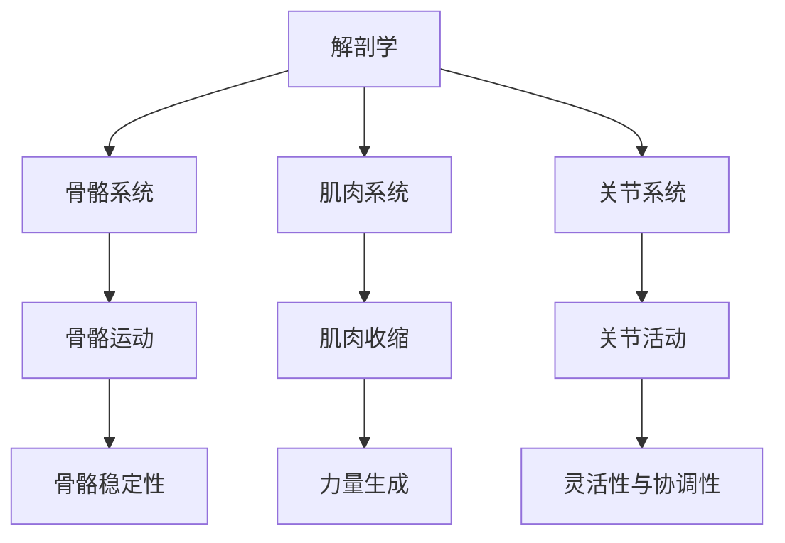

#### 运动生理学
运动生理学研究人体如何通过生理机制来适应和进行运动。包括能量代谢、呼吸、循环等方面的知识，这些知识对于理解运动对身体健康的影响至关重要。

**核心概念与联系：**
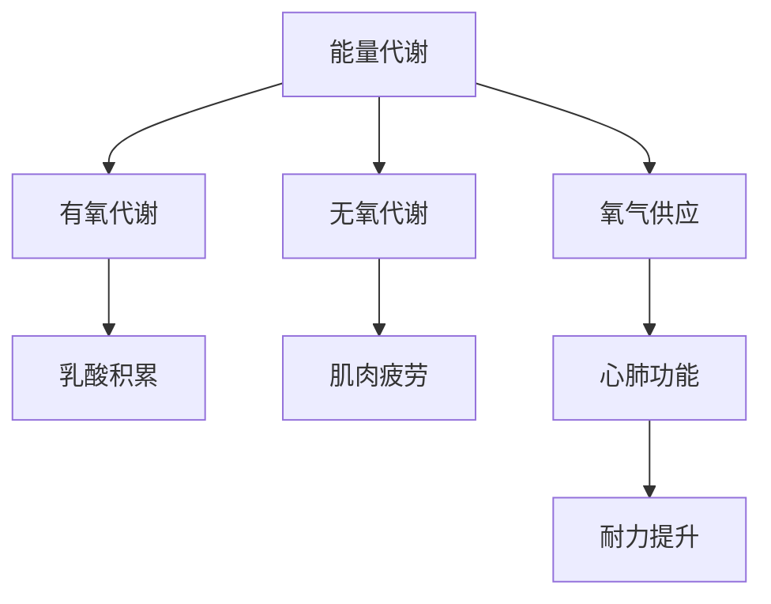

#### 生物力学基础
生物力学是研究运动过程中力学原理的一门学科。它涉及人体在运动中的力学分析，包括力量、速度、角度等参数。理解生物力学有助于提高运动表现和避免运动损伤。

**核心概念与联系：**
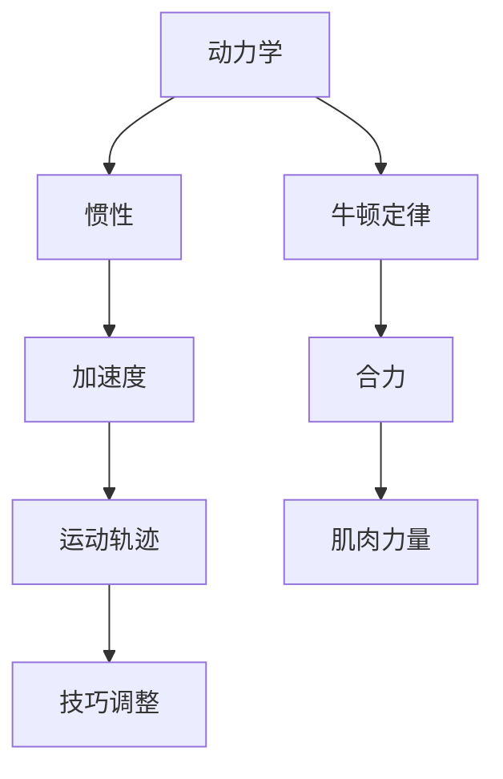

#### 运动科学的工具与方法
运动科学研究需要使用多种工具和方法，包括传感器、生物力学分析软件、健康监测设备等。这些工具和方法可以帮助研究者更准确地测量和分析运动数据。

**核心概念与联系：**
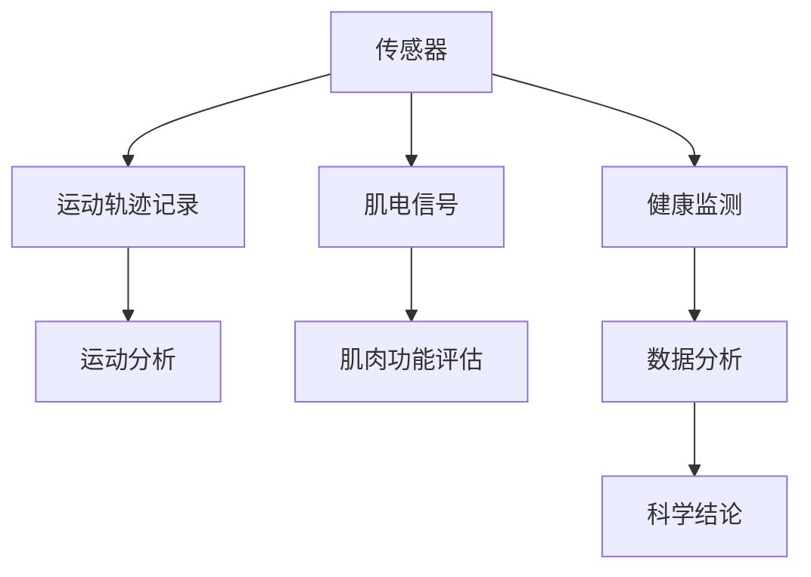

### 运动类型与健康益处
#### 有氧运动与健康益处
有氧运动，如慢跑、游泳、骑自行车等，主要通过增加心肺功能来提高身体健康。有氧运动有助于降低心脏病、高血压、糖尿病等慢性疾病的风险，同时还能提高身体的耐力和整体健康水平。

**核心概念与联系：**
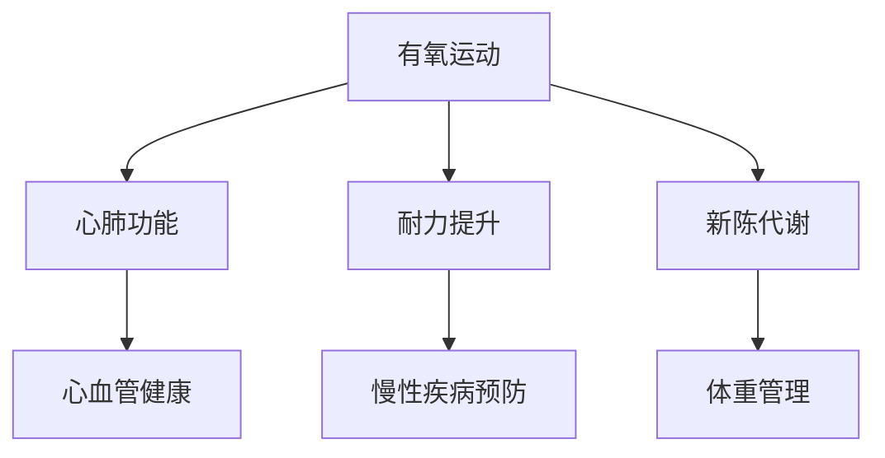

#### 力量训练与健康益处
力量训练，如举重、俯卧撑、深蹲等，主要通过增强肌肉力量和耐力来提高身体健康。力量训练有助于提高骨密度、减少受伤风险，同时还能提高日常活动的效率和自信心。

**核心概念与联系：**
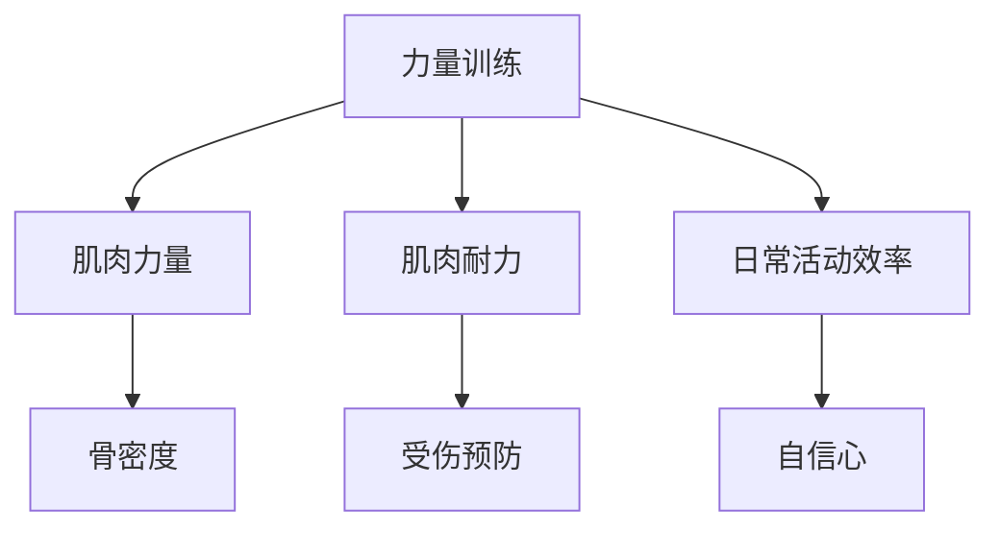

#### 灵活性训练与健康益处
灵活性训练，如瑜伽、拉伸等，主要通过增加关节的活动范围和肌肉的伸展性来提高身体健康。灵活性训练有助于提高身体的灵活性和协调性，减少肌肉和关节的僵硬，从而降低受伤风险。

**核心概念与联系：**
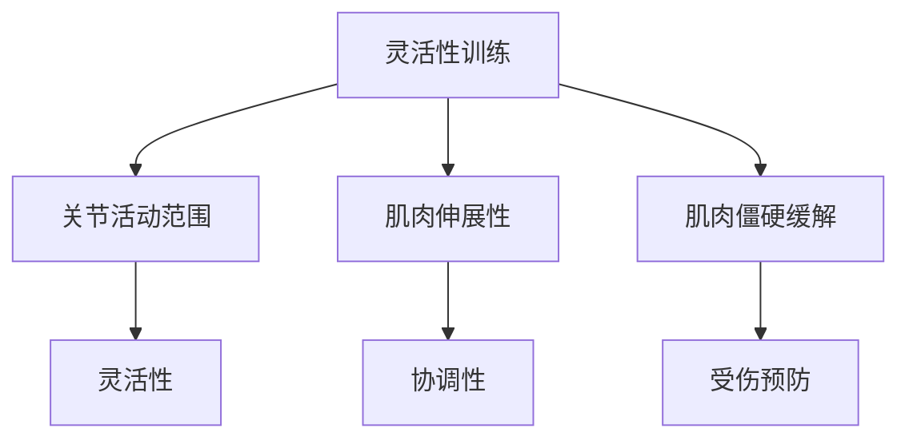

### 身心健康与心理健康
#### 心理健康的重要性
心理健康是整体健康的重要组成部分。它包括情感稳定、心理平衡、良好的人际关系等方面。心理健康不仅影响个体的生活质量，还与身体健康密切相关。

**核心概念与联系：**
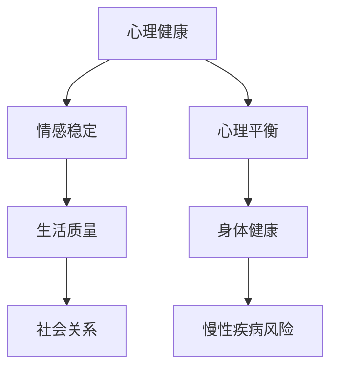

#### 运动与情绪调节
运动可以有效地调节情绪，缓解焦虑和抑郁。运动时，身体释放的内啡肽等神经递质可以提升情绪，使人感到愉悦和放松。

**核心概念与联系：**
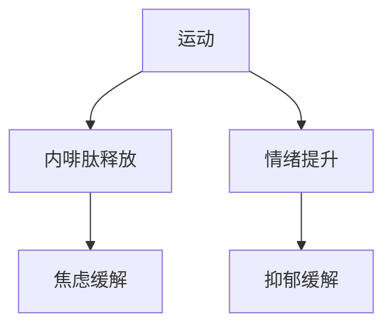

#### 运动与压力管理
长期的压力会导致多种健康问题，包括心血管疾病、免疫系统功能下降等。运动可以帮助人们有效地管理压力，通过释放内啡肽和其他神经递质，缓解紧张情绪。

**核心概念与联系：**
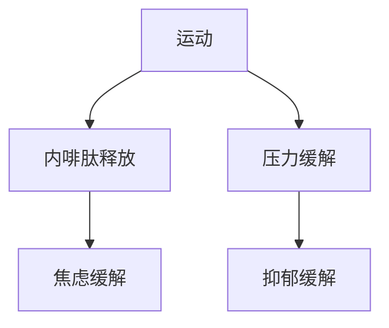

#### 运动与认知功能
运动不仅对身体健康有益，还能提高认知功能。有研究表明，规律的体育活动可以提高大脑的认知能力，包括注意力、记忆力和执行功能等。

**核心概念与联系：**
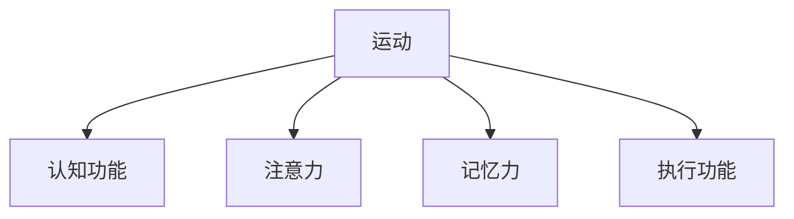

### 科学运动规划
#### 运动计划制定原则
制定科学、有效的运动计划是提高运动效果的关键。以下是一些制定运动计划的基本原则：

**核心概念与联系：**
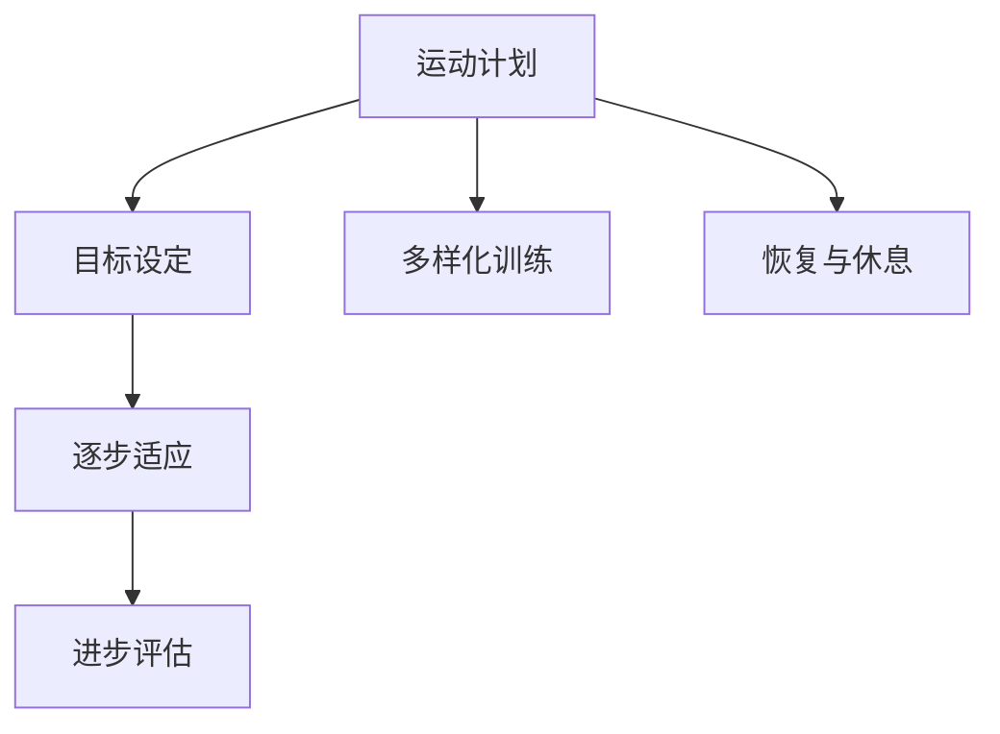

#### 运动强度与频率
运动强度和频率直接影响运动效果。合适的运动强度可以刺激身体产生适应性变化，而适当的频率可以确保身体的持续进步。

**核心概念与联系：**
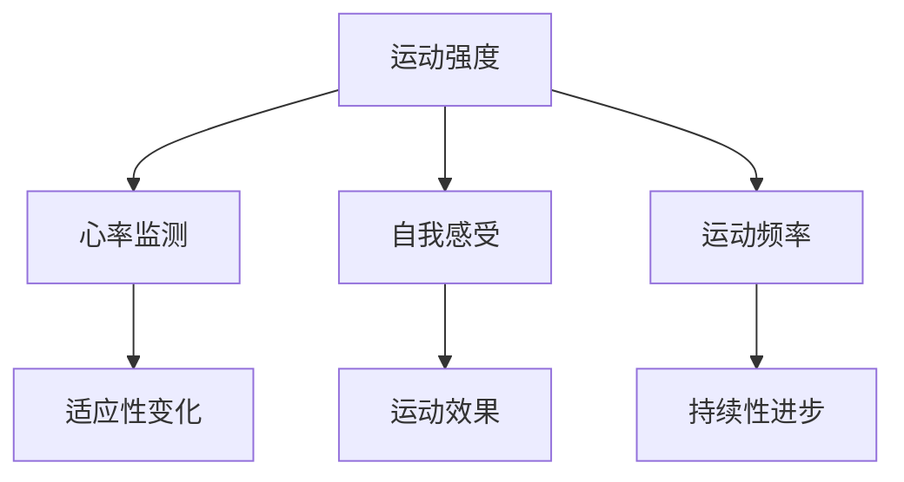

#### 运动时长与恢复
运动时长和恢复时间也是制定运动计划的重要考虑因素。过长的运动时间可能导致过度疲劳，而过短的恢复时间则会影响身体的恢复。

**核心概念与联系：**
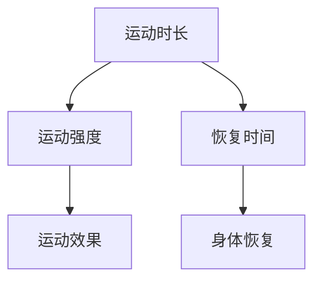

#### 运动适应与进步
运动适应是指身体对运动刺激产生的适应性变化。了解运动适应的原理，有助于制定更有效的运动计划，实现持续进步。

**核心概念与联系：**
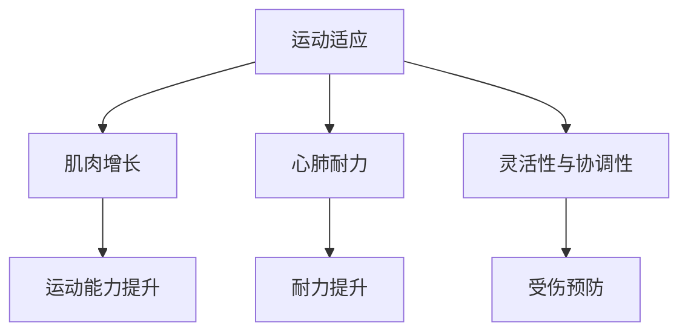

### 运动营养与恢复
#### 运动营养需求
运动时的营养需求与日常营养有所不同。了解运动时的营养需求，有助于提供足够的能量和营养素，支持运动表现和恢复。

**核心概念与联系：**
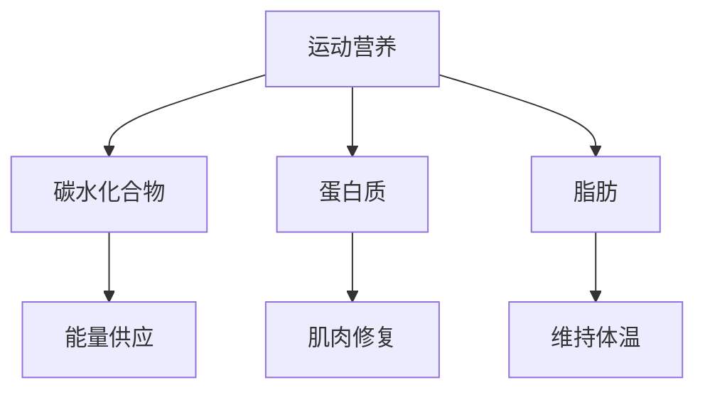

#### 运动营养补充
运动营养补充品可以帮助运动员在运动过程中和运动后快速补充能量和营养素。了解不同的营养补充品及其作用，有助于合理选择和使用。

**核心概念与联系：**
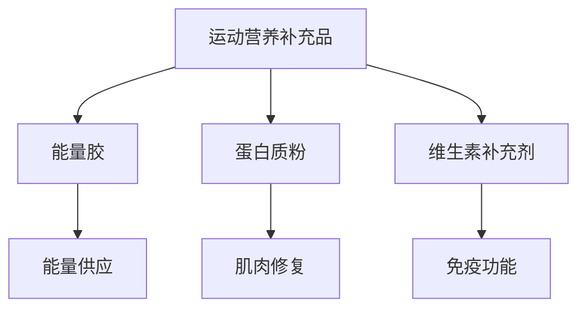

#### 运动恢复技巧
运动后的恢复对于身体恢复和防止损伤至关重要。了解运动恢复的技巧，包括拉伸、按摩、温水浴等，可以帮助运动员更快地恢复体力。

**核心概念与联系：**
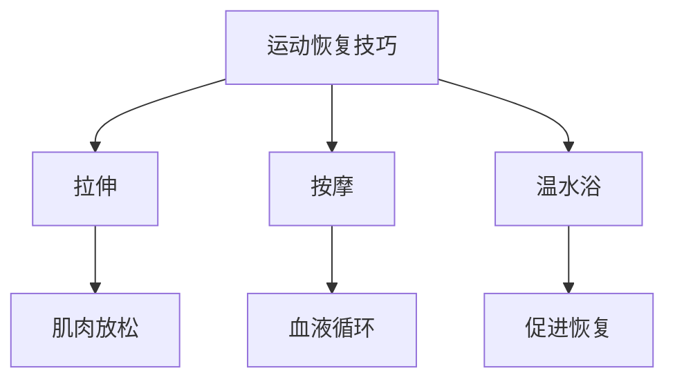

#### 运动损伤预防
运动损伤是运动过程中常见的风险。了解运动损伤的预防方法，包括正确的运动技巧、适宜的运动强度、合理的休息等，有助于降低运动损伤的风险。

**核心概念与联系：**
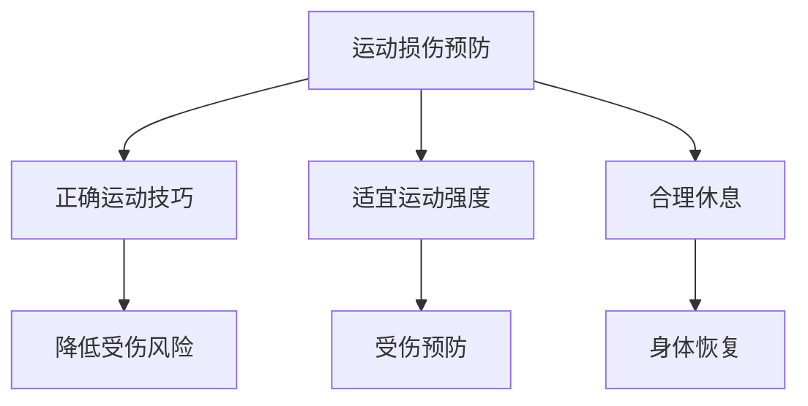

### 案例分析与实践
#### 案例分析
通过分析实际案例，可以了解不同人群如何通过运动改善身心健康。案例包括不同年龄、性别和健康状况的人，以及他们在运动过程中遇到的问题和解决方案。

**案例1：中年职场人士**
- **背景介绍：**一位中年职场人士，由于长期久坐和缺乏锻炼，身体状态不佳，情绪波动较大。
- **运动计划：**进行有氧运动（慢跑、游泳）和力量训练（俯卧撑、深蹲）相结合，每周3-4次，每次30-45分钟。
- **效果评估：**经过3个月的运动，身体状况明显改善，体脂率下降，情绪稳定，工作效率提高。

**案例2：年轻大学生**
- **背景介绍：**一位年轻大学生，学业繁重，缺乏运动，导致身体疲劳、注意力不集中。
- **运动计划：**进行高强度的间歇训练（HIIT）和瑜伽，每周3-4次，每次20-30分钟。
- **效果评估：**经过1个月的运动，身体素质提高，注意力集中，学业表现改善。

#### 成功实践分享
成功实践分享可以提供实际的运动经验和方法，帮助读者找到适合自己的运动方式。

**成功实践1：有氧运动+力量训练**
- **方法：**每天早上进行30分钟慢跑，晚上进行30分钟力量训练。
- **经验：**通过有规律的锻炼，身体状态逐渐改善，睡眠质量提高，精神状态更加饱满。

**成功实践2：灵活性与力量训练结合**
- **方法：**每天进行30分钟瑜伽和20分钟力量训练。
- **经验：**提高了身体的灵活性和力量，减少了受伤风险，日常生活更加轻松。

#### 失败案例分析
失败案例分析可以帮助读者了解运动过程中的常见问题，以及如何避免和解决这些问题。

**失败案例1：运动过量**
- **原因：**为了快速减肥，过度运动导致身体过度疲劳，出现肌肉酸痛和关节疼痛。
- **解决方案：**调整运动强度和频率，适当减少运动时间，增加休息和恢复时间。

**失败案例2：缺乏合理营养**
- **原因：**运动后没有及时补充营养，导致身体恢复缓慢，甚至出现营养不良。
- **解决方案：**运动后及时补充碳水化合物和蛋白质，确保身体得到足够的营养支持。

#### 实践建议与展望
通过案例分析和实践分享，我们提出以下建议：

**实践建议：**
1. 根据自身健康状况和目标，制定合适的运动计划。
2. 注重运动过程中的营养补充和恢复。
3. 适当调整运动强度和频率，避免过度运动。
4. 结合有氧运动、力量训练和灵活性训练，全面发展身体素质。

**展望：**
随着科学研究的不断深入，运动与健康之间的关系将得到更全面的揭示。未来的运动规划将更加个性化和智能化，通过大数据和人工智能技术，为每个人提供最适合自己的运动方案。

### 附录
**附录A：运动与健康相关的 Mermaid 流程图**
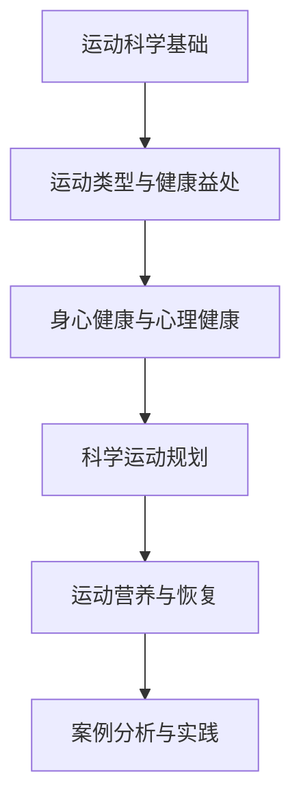

**附录B：核心算法原理讲解的伪代码**
```plaintext
function create运动的计划（目标，健康状况）{
    运动计划 = []

    // 设置运动目标
    if 目标 == '减脂'{
        运动计划.append('有氧运动，每周3次，每次45分钟')
    } else if 目标 == '增肌'{
        运动计划.append('力量训练，每周3次，每次45分钟')
    } else {
        运动计划.append('综合训练，每周4-5次，每次30-60分钟')
    }

    // 考虑健康状况
    if 健康状况 == '良好'{
        运动计划.append('高强度运动，每周3-4次')
    } else if 健康状况 == '一般'{
        运动计划.append('中强度运动，每周2-3次')
    } else {
        运动计划.append('低强度运动，每周1-2次')
    }

    return 运动计划
}
```

**附录C：数学模型和公式**
```latex
\begin{equation}
    F = ma
\end{equation}

\begin{equation}
    VO_2max = \frac{0.2 \times HR_{max} + 0.8 \times HR}{100}
\end{equation}
```

**附录D：代码实际案例和详细解释**
```python
# 运动计划生成器

def generate_workout_plan(target, health_status):
    """
    根据目标（减脂、增肌、综合）和健康状况（良好、一般、较差）生成运动计划
    """
    plans = {
        '减脂': '有氧运动，每周3次，每次45分钟',
        '增肌': '力量训练，每周3次，每次45分钟',
        '综合': '综合训练，每周4-5次，每次30-60分钟'
    }
    
    intensity = {
        '良好': '高强度运动，每周3-4次',
        '一般': '中强度运动，每周2-3次',
        '较差': '低强度运动，每周1-2次'
    }
    
    plan = plans.get(target, "综合训练，每周4-5次，每次30-60分钟")
    recovery = intensity.get(health_status, "综合训练，每周4-5次，每次30-60分钟")
    
    return plan + " 和 " + recovery

# 示例
print(generate_workout_plan('减脂', '良好'))
```

**附录E：参考资料与推荐阅读**
1. American College of Sports Medicine. (2018). ACSM's Resource Manual for Guidelines for Exercise Testing and Prescription.
2. World Health Organization. (2020). Global Health Sector Strategy on Non-communicable Diseases 2019-2030.
3. Matthews CE, Chen KY, Freedson PS, Buchowski MS, Beech BM, Pate RR, & Troiano RP. (2012). Amount and intensity of physical activity in the United States: results from the National Health Interview Survey. Medicine and Science in Sports and Exercise, 44(1), 189-197.
4. Blumenthal JA, Babyak MA, O'Neil PM, Trivedi MH, & Doehner W. (2012). Exercise and the heart: clinical science and practice. European Heart Journal, 33(1), 134-140.

### 总结
通过本文，我们探讨了运动与身心健康之间的关系，以及如何通过科学的运动规划来提高生活质量。运动不仅有助于身体健康，还能改善心理健康，提高认知功能。了解运动科学基础、不同类型的运动及其健康益处，制定科学的运动计划，以及关注运动营养与恢复，都是实现身心健康的关键。希望本文能帮助读者找回生活的节奏，享受健康快乐的生活。作者：AI天才研究院/AI Genius Institute & 禅与计算机程序设计艺术 /Zen And The Art of Computer Programming

