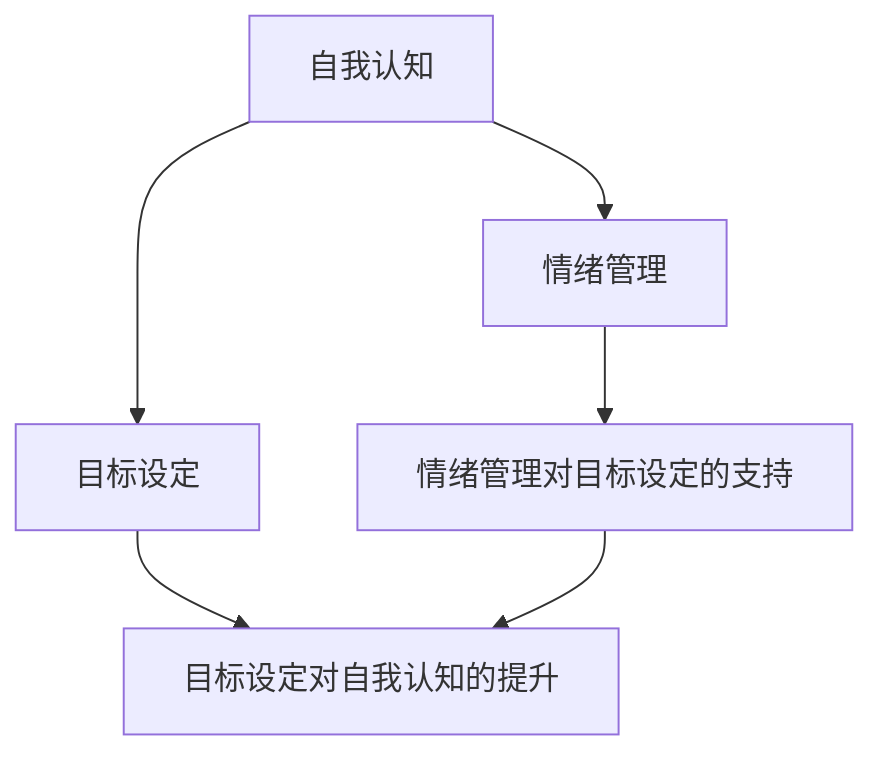

                 

### 引言：内在成长的必要性

在现代社会的快节奏和高压力环境下，个人的成长与发展不再仅限于外在成就的积累，而是逐渐转向内在品质的提升。内在成长，是指个体通过自我认知、情绪管理和目标设定等途径，逐步提升自身的心理素质和情感智慧。与外在成长相比，内在成长更注重个体的内心体验和精神满足，追求长期的、可持续的幸福感。

首先，外在成长通常与物质成就和社会地位相关，其衡量标准是看得见的成果，如财富、荣誉和地位等。然而，外在成就的获得往往伴随着巨大的压力和焦虑，且难以带来持久的满足感。相反，内在成长关注的是个体的内心状态和情感智慧，通过提升自我认知、情绪管理和目标设定等能力，使个体能够更好地应对生活中的挑战和压力，从而实现心理上的平衡与满足。

其次，内在成长与心理健康密切相关。在心理学研究中，心理健康被定义为个体在情感、行为和认知等方面表现出积极状态的能力。内在成长通过自我认知和情绪管理，帮助个体更好地理解自己的内心世界，减少焦虑和抑郁等负面情绪，提升情感智慧。而良好的心理健康不仅有助于提高个人的生活质量，还能增强个体的社会功能，促进其在工作、学习和人际关系中的表现。

最后，内在成长对个体的长期发展具有重要意义。外在成长往往依赖于环境因素和机遇，而内在成长则更多依赖于个体的内在动力和自我调控能力。这种内在的动力和调控能力能够帮助个体在面对困难和挫折时保持坚韧和乐观，不断追求自我完善和成长。因此，内在成长不仅有助于提升个体的生活质量，还能为个体的职业发展、人际关系和整体幸福感提供坚实的支撑。

综上所述，内在成长在现代社会中具有重要的地位和必要性。它不仅能够帮助个体实现心理上的平衡和满足，还能为个体的长期发展提供重要的支持。因此，追求内在成长已成为当代个人成长的一个重要方向。

### 内在成长的核心概念与联系

内在成长是一个复杂而多维的过程，涉及多个核心概念，这些概念相互联系，共同构成了内在成长的理论基础。以下将详细探讨这些核心概念及其相互关系，以帮助读者更好地理解内在成长的核心要素。

#### 自我认知

自我认知是内在成长的基础，它涉及个体对自己的了解和认识。自我认知不仅包括外在特征的认知，如个人的外貌、性别、年龄等，还包括内在特征的认知，如个人的价值观、性格特点、动机等。通过自我认知，个体能够更清晰地认识到自己的优点和不足，从而有针对性地进行改进和提升。自我认知的过程通常包括自我反思、自我评价和自我洞察等环节。

#### 情绪管理

情绪管理是内在成长中另一个关键因素，它关系到个体如何处理和调节自己的情绪。情绪管理不仅涉及应对负面情绪，如焦虑、愤怒和沮丧，还包括培养积极情绪，如快乐、满足和幸福。有效的情绪管理能够帮助个体更好地应对生活中的压力和挑战，提升生活质量。情绪管理的方法包括认知行为疗法、冥想、正念练习和情绪释放技巧等。

#### 目标设定

目标设定是内在成长的重要组成部分，它为个体提供了明确的方向和动力。有效的目标设定不仅需要设定具体的、可实现的目标，还需要与个体的价值观和长期愿景相一致。通过目标设定，个体能够更好地规划自己的未来，保持动力和坚持，实现自我成长和进步。目标设定的方法包括SMART原则（具体、可衡量、可实现、相关、有时间限制）、目标分解和时间管理等。

#### 核心概念之间的关系架构

为了更好地理解这些核心概念之间的相互关系，我们可以使用Mermaid流程图来展示其架构。以下是核心概念之间的关系架构：

在该流程图中，自我认知、情绪管理和目标设定三者相互关联，形成一个动态的内在成长系统。自我认知为情绪管理和目标设定提供了基础，而情绪管理和目标设定又相互支持，共同推动个体的内在成长。

#### 心理健康与内在成长的关系

内在成长与心理健康之间存在着密切的联系。良好的心理健康是内在成长的重要保障，而内在成长也有助于提升心理健康。具体而言：

- **心理健康对内在成长的支持**：心理健康使个体能够更好地进行自我认知和情绪管理，从而更加清晰地设定和实现目标。心理健康良好的个体通常具有更强的自我调节能力，能够更好地应对生活中的挑战和变化。

- **内在成长对心理健康的影响**：通过自我认知和情绪管理，个体能够更好地理解自己的内心世界，减少负面情绪和压力，提升心理健康水平。同时，目标设定和实现过程也为个体提供了积极的心理体验，有助于增强心理韧性。

总之，自我认知、情绪管理和目标设定构成了内在成长的核心概念，这些概念相互联系，共同推动个体的内在成长。心理健康是内在成长的重要保障，而内在成长也有助于提升心理健康。通过理解和运用这些核心概念，个体可以更好地实现自我成长和提升生活质量。

### 内在成长的核心原理

内在成长的核心原理是基于个体对自我认知、情绪管理和目标设定的深刻理解。这些原理不仅为我们提供了一个理论框架来解释内在成长，还为实际操作提供了具体的指导。以下是几个重要的理论依据：

#### 心理学理论

心理学理论为内在成长提供了基础。行为主义心理学强调行为与环境的关系，通过条件反射和操作性条件作用来改变行为。认知心理学则关注个体对信息的加工过程，强调思维、记忆和注意力等心理过程在个体行为中的重要性。人本主义心理学则更注重个体的主观体验和自我实现，强调个体在成长过程中的自主性和自我决定性。

在内在成长中，心理学理论的应用主要体现在自我认知和情绪管理方面。例如，通过自我观察和反思，个体可以了解自己的行为模式和情感反应，从而更好地调节情绪和改变行为。认知行为疗法（CBT）是一种广泛应用于情绪管理的心理治疗方法，通过改变负面思维模式和行为模式，帮助个体实现心理健康和内在成长。

#### 哲学理论

哲学理论为内在成长提供了深层次的思考。存在主义哲学强调个体存在的自由和选择，认为个体的意义和目的不是预先设定的，而是通过个体的自我选择和自我实现来创造的。这种哲学观点鼓励个体积极面对生活挑战，通过自我探索和自我实现来寻找生活的意义。

道德哲学则关注个体的价值观和道德选择。通过反思和评估自己的价值观，个体可以明确自己的道德立场，从而更好地处理人际关系和实现自我成长。例如，亚里士多德的幸福论认为，幸福是个体通过追求美德和实现潜能而达到的内在状态，这种状态需要通过自我修养和持续努力来实现。

#### 心灵成长理论

心灵成长理论关注个体的精神层面和内在力量。灵性心理学和正向心理学是其中的两个重要分支。灵性心理学研究个体与宇宙的连接，强调灵性和精神成长在个体生活中的重要性。正向心理学则关注个体的积极品质和积极体验，通过培养乐观、希望和感恩等积极情绪，帮助个体实现内在成长。

在内在成长中，心灵成长理论的应用主要体现在提升个体的情感智慧和培养积极情绪。例如，冥想和正念练习被广泛用于提升个体的心理韧性，帮助个体更好地应对压力和挑战。同时，通过培养感恩和乐观，个体能够更加积极地看待生活，提升整体幸福感。

#### 关键要素

内在成长的关键要素包括自我探索、价值观塑造和人际关系。自我探索是内在成长的基础，通过深入了解自己的内心世界，个体能够更好地认识自我，明确自己的需求和目标。价值观塑造则是内在成长的核心，通过反思和评估自己的价值观，个体能够建立健康和积极的价值观体系，指导自己的行为和决策。人际关系是内在成长的支撑，通过与他人的互动，个体能够更好地理解自己，提升情感智慧和社交能力。

总之，内在成长的核心原理涵盖了心理学、哲学和心灵成长理论，这些理论共同构成了内在成长的理论框架。通过理解和应用这些原理，个体可以更好地实现自我认知、情绪管理和目标设定，从而实现内在成长。内在成长不仅有助于提升个体的心理健康和幸福感，还能为个体的长期发展提供坚实的支持。

### 内在成长的关键要素

内在成长是一个多维度的过程，涉及多个关键要素，这些要素相互支持，共同推动个体的内在成长。以下是三个核心要素的详细探讨：

#### 自我探索

自我探索是内在成长的基础，它帮助个体深入了解自己的内心世界，包括性格、动机、价值观和情感等。通过自我探索，个体能够明确自己的需求和目标，找到自己的激情和兴趣所在，从而更好地规划自己的生活。

自我探索的方法包括自我反思、日记写作、冥想和心理咨询等。自我反思是一种重要的自我探索方法，通过回顾自己的经历和感受，个体可以更清晰地认识自己的内心世界。日记写作则有助于记录和整理个体的思想和感受，帮助个体更好地理解自己。冥想和正念练习通过专注和内观，帮助个体放松心灵，提升自我意识。心理咨询则提供了一个安全的空间，让个体在专业指导下深入探索自己的内心。

#### 价值观塑造

价值观塑造是内在成长的核心，它决定了个体如何看待世界和如何行事。一个健康的价值观体系不仅能够帮助个体做出明智的决策，还能提升个体的心理健康和幸福感。

塑造价值观的方法包括反思自己的行为和决策、学习他人的经验、阅读经典哲学和道德书籍以及参与社会活动等。通过反思自己的行为和决策，个体可以识别和纠正不健康的价值观。学习他人的经验，特别是那些在生活中取得成功和幸福感的人，可以为个体提供宝贵的启示。阅读经典哲学和道德书籍，如《论语》、《道德经》和《苏菲的世界》等，有助于个体深入理解不同文化背景下的价值观。参与社会活动，如志愿服务和社区建设，不仅能够帮助个体培养社会责任感，还能提升个体的归属感和幸福感。

#### 人际关系

人际关系是内在成长的支撑，通过与他人的互动，个体能够更好地理解自己，提升情感智慧和社交能力。健康的人际关系不仅有助于个体的心理健康，还能为个体的职业发展和社会支持提供重要支持。

建立和维护健康人际关系的方法包括有效沟通、同理心和边界设定。有效沟通是健康人际关系的基础，通过清晰、真诚和尊重的交流，个体能够更好地理解他人和自己。同理心是建立信任和理解的重要工具，通过设身处地地理解他人的感受和需求，个体能够更好地处理人际关系。边界设定则是保护个体自我和尊重他人需求的关键，通过明确自己的需求和界限，个体能够更好地维护自己的心理健康。

总之，自我探索、价值观塑造和人际关系是内在成长的关键要素。通过自我探索，个体能够深入了解自己的内心世界；通过价值观塑造，个体能够建立健康和积极的价值观体系；通过建立和维护健康的人际关系，个体能够获得情感支持和社交支持。这三个要素相互支持，共同推动个体的内在成长。通过持续地运用这些方法，个体可以不断提升自己的内在品质，实现持久的幸福感和成长。

### 内在成长与个人成长的关系

内在成长与个人成长紧密相连，构成了个体发展的两个重要方面。内在成长关注个体的心理素质和情感智慧，而个人成长则涉及职业、学业、社交等多个领域。这两者之间的关系不仅相互影响，还共同推动个体的全面发展和自我实现。

首先，内在成长为个人成长提供了坚实的基础。一个内在成长良好的个体通常拥有较强的自我认知、情绪管理和目标设定能力，这些能力在职业发展、学业成就和社交互动中发挥着关键作用。例如，在职业生涯中，一个具备良好内在成长的个体能够更好地应对工作中的压力和挑战，保持积极的心态和高效的工作状态。通过有效的情绪管理，个体能够处理与同事和客户的冲突，建立良好的人际关系，从而提升职业竞争力。

其次，个人成长中的经验积累和成就反馈对内在成长有着重要影响。在个人成长的过程中，个体会遇到各种成功和失败，这些经历不仅丰富了个体的人生经验，也为内在成长提供了宝贵的素材。成功的经验可以增强个体的自信心和成就感，激发内在成长的动力；而失败的经验则可以帮助个体更好地理解自己，发现自己的不足，从而促进自我反省和改进。这种在个人成长过程中不断调整和优化的过程，实际上就是一种内在成长。

再者，内在成长与个人成长之间的互动关系是一个动态的过程。内在成长不仅为个人成长提供支持，同时也会受到个人成长的影响。例如，一个在学业上取得优异成绩的个体可能会因为成就感而更加自信，从而推动其进行更深入的自我探索和内在成长。反之，一个在职业生涯中遇到挫折的个体可能会经历情绪上的波动，这会促使他们进行情绪管理和自我反思，从而实现内在成长。

此外，内在成长与个人成长之间的关系还体现在个体对自我实现和幸福感的追求上。内在成长强调个体对内心世界的探索和提升，而个人成长则侧重于外在成就的积累。一个内在成长良好的个体，不仅能够在个人成长的过程中取得成功，还能在内心保持平和与满足。这种内外平衡的状态，有助于个体实现自我价值，追求更深层次的幸福感。

总之，内在成长与个人成长密切相关，两者相互促进、共同发展。内在成长为个人成长提供了心理支持和情感智慧，而个人成长中的经验反馈则推动了内在成长。通过理解和平衡内在成长与个人成长，个体可以实现全面发展和自我实现，追求长期的幸福感。

### 内在成长的方法与实践

实现内在成长需要系统的方法和实践，这些方法包括自我反思、感恩练习和自我激励等。以下将详细介绍这些方法，并提供具体的实践建议。

#### 自我反思

自我反思是内在成长的重要途径，通过反思，个体可以深入理解自己的行为、情感和思想，从而进行有效的自我调整。以下是自我反思的具体步骤：

1. **记录日常经历**：每天花时间记录自己的经历和感受，包括成功的时刻和失败的教训。通过记录，个体能够更好地回顾和总结自己的行为模式。

2. **定期回顾**：每周或每月进行一次自我回顾，分析自己的行为和决策，识别成功的原因和失败的因素。这有助于个体了解自己的强项和改进空间。

3. **提问和自我探索**：在反思过程中，提出问题如“为什么我会这样反应？”“我的价值观是否影响了我的决策？”“这次经历对我有什么意义？”等，有助于深入探索自己的内心世界。

#### 感恩练习

感恩练习是培养积极心态和提升幸福感的重要方法。以下是几种简单的感恩练习：

1. **每日感恩日记**：每天写下三件值得感激的事情，可以是小事，如“今天阳光很好”、“同事帮助了我”等。这有助于个体专注于生活中的积极方面。

2. **感恩冥想**：每天花几分钟时间进行冥想，专注于感受和体验自己的感恩之情。可以闭上眼睛，深呼吸，逐一回顾那些让你感到感恩的人、事、物。

3. **与他人分享感恩**：与家人、朋友分享你的感恩之情，通过表达感激，不仅能够增强与他人的关系，还能提升自己的幸福感。

#### 自我激励

自我激励是内在成长的重要动力，通过设定目标、奖励自己和管理情绪，个体可以更好地保持内在成长的动力。

1. **设定具体目标**：设定清晰、具体且可实现的目标，如“每天学习一小时编程”或“每周至少锻炼三次”。具体的目标有助于个体保持专注和动力。

2. **奖励自己**：在实现小目标后，给予自己奖励，如看一部喜欢的电影、享受一顿美食或购买一件心仪的物品。奖励不仅能够增强内在动力，还能提高目标的实现概率。

3. **情绪管理**：在面对挫折和困难时，通过深呼吸、冥想或与朋友交流等方式管理情绪，保持积极的心态。情绪管理有助于个体更好地应对挑战，继续追求内在成长。

通过自我反思、感恩练习和自我激励，个体可以逐步提升自我认知、情绪管理和目标设定的能力，从而实现持久的内在成长。这些实践方法不仅有助于提升个体的心理素质，还能为个人的长期发展和幸福感提供坚实的支持。

### 超越表面的深度生活

在现代社会的喧嚣和快节奏中，人们往往容易陷入表面的生活，这种生活方式以追求短期快感和社会认可为特征，却忽视了内心的深层次需求。表面生活通常包括无节制的消费、无休止的工作、社交媒体的攀比和不断追求外在成就等。尽管表面生活能够带来一时的满足和快乐，但它往往无法持久，且可能导致心理健康问题、人际关系破裂和内心空虚。

与表面生活相对的是深度生活，这是一种追求内心满足和长期幸福感的生活方式。深度生活强调内心的丰富和个人成长，关注自我探索、情感智慧和价值观的塑造。它不仅追求物质和外在成就，更注重精神层面的提升和内在需求的满足。

首先，表面生活常常导致个体心理上的不健康状态。例如，过度工作和社会压力可能导致焦虑和抑郁。无节制的消费和物质追求则可能导致财务困境和人际关系紧张。而深度生活通过情绪管理和心理调适，帮助个体更好地应对压力和挑战，保持心理健康。

其次，表面生活往往忽略了人际关系中的深层次连接。社交媒体上的虚拟交往无法替代现实生活中真正的互动。而深度生活鼓励个体建立真实、深刻的人际关系，通过同理心和有效沟通，增强社交支持和幸福感。

此外，深度生活还关注个体与自然和社会的连接。通过亲近自然、参与社区服务和追求有意义的事业，个体能够找到更深层次的满足感和人生意义。

总之，超越表面的深度生活不仅有助于提升个体的心理和情感健康，还能为个人的长期幸福和成长提供坚实的基础。通过深度生活，个体能够更好地理解自己、发展自己的潜能，并实现全面的发展。

### 深度生活的追求

深度生活是一种追求内心满足和长期幸福的生活方式，它强调个体在精神、情感和认知层面的全面发展。为了实现深度生活，个体需要采取一系列具体的方法和策略。以下将详细介绍这些方法和策略，帮助读者在日常生活中实践深度生活。

#### 具体方法和策略

1. **自我反思**：定期花时间进行自我反思，深入思考自己的行为、思想和情感。通过自我反思，个体可以更好地理解自己的内心世界，识别并改正不良行为模式，从而实现自我提升。

2. **冥想和正念练习**：冥想和正念练习是深度生活的重要工具。通过冥想，个体可以放松心灵，减少压力和焦虑。正念练习则帮助个体培养专注力和情绪管理能力，提升生活质量。

3. **设定有意义的目标**：设定具体、可实现且有意义的目标，如职业发展、个人成长或健康目标。通过目标的实现，个体能够获得成就感和动力，进一步追求深度生活。

4. **培养情感智慧**：情感智慧包括理解和管理自己和他人的情感，培养同理心和有效沟通技巧。通过提高情感智慧，个体能够更好地处理人际关系，增强社交支持。

5. **亲近自然**：亲近自然有助于个体放松心情，增强身心健康。通过户外活动、徒步旅行或园艺等方式，个体可以与自然建立更深层次的连接，从而实现内心的平静与满足。

6. **参与有意义的活动**：参与社区服务、志愿活动或公益事业，不仅能够帮助他人，还能提升个体的自我价值感和幸福感。这些活动有助于个体找到更深层次的人生意义。

7. **建立真实的人际关系**：通过真诚、尊重和开放的沟通，建立深度的人际关系。与家人、朋友和同事建立真实的联系，有助于提升个体的情感满足感和生活质量。

#### 从表面生活转向深度生活的步骤

1. **自我认知**：首先，个体需要认识到表面生活的局限性，明确追求深度生活的目标和动机。

2. **改变生活方式**：逐步调整自己的生活方式，减少无意义的消费和过度工作，增加自我反思、冥想和锻炼等健康习惯。

3. **培养内心世界**：通过阅读、写作、艺术创作等方式，丰富自己的内心世界。这些活动有助于提升个体的情感智慧和精神层次。

4. **实践深度生活策略**：将上述方法和策略融入日常生活，通过持续的努力和练习，逐步实现从表面生活向深度生活的转变。

5. **持续反思与调整**：在实践过程中，个体需要不断反思和调整自己的行为和心态，确保深度生活目标的实现。

总之，从表面生活转向深度生活需要个体的决心和持续的努力。通过自我反思、冥想、设定目标、培养情感智慧和亲近自然等方法，个体可以在日常生活中实现深度生活的追求。这种生活方式不仅能够提升个体的心理健康和幸福感，还能为个人的长期发展和幸福提供坚实的基础。

### 深度生活与个人发展

深度生活不仅对心理健康和幸福感有积极影响，还在个人发展中发挥着重要作用。在职业发展、学业成就和自我实现方面，深度生活提供了强有力的支持，使个体能够在复杂多变的环境中保持竞争力，实现长期的成功和满足。

#### 深度生活与职业发展的关系

在职业发展中，深度生活有助于个体提升职业素养和职业竞争力。首先，通过深度生活的实践，个体能够更好地管理自己的情绪和工作压力，保持积极的工作状态。这种良好的心态有助于提高工作效率，增强团队合作能力。其次，深度生活强调自我认知和目标设定，使个体能够更清晰地了解自己的职业兴趣和优势，从而制定更符合自身特点的职业规划。例如，通过自我反思和评估，个体可以识别自己的职业目标，制定具体的职业发展路径，并采取有效的行动去实现这些目标。

一个实际的案例是一个从事编程工作的专业人士。他通过持续的冥想和自我反思，学会了更好地管理自己的情绪，保持专注和冷静。在面对复杂的项目和高压的工作环境时，他能够保持高效的工作状态，从而赢得了同事和上司的认可。此外，他还通过深度生活中的目标设定，明确了职业发展的具体目标，如提升技术能力、拓展业务领域等，并制定了一系列实际可行的行动计划。通过这些努力，他不仅在公司内部获得了晋升，还成功转型为技术顾问，实现了职业上的跨越式发展。

#### 深度生活与学业成就的关系

在学业成就方面，深度生活同样发挥着重要作用。通过深度生活的实践，学生能够更好地进行时间管理，提高学习效率。例如，通过自我反思和目标设定，学生可以明确自己的学习目标和优先级，合理安排学习时间，避免拖延和焦虑。此外，深度生活中的情绪管理技巧，如冥想和正念练习，有助于学生保持良好的心态，减少学业压力，提升心理韧性。

一个真实的案例是一个大学生。他通过深度生活中的冥想和正念练习，学会了如何更好地管理自己的情绪和学习压力。在面对考试和学业挑战时，他能够保持冷静和专注，从而在多个学科中取得了优异的成绩。此外，他还通过深度生活中的自我反思，不断优化自己的学习方法和策略，提高学习效率。最终，他不仅顺利完成了学业，还获得了多个奖学金和荣誉，为未来的职业生涯奠定了坚实的基础。

#### 深度生活与自我实现的关系

深度生活不仅关注外在成就，更注重个体的内在成长和自我实现。通过深度生活的实践，个体能够更好地认识自己，明确自己的人生目标和价值观，从而实现更深层次的自我实现。

一个典型的案例是一个企业家。他通过深度生活中的自我探索和价值观塑造，明确了自己对事业的追求和人生目标。他不仅关注公司的业绩和利润，更注重公司文化的建设和社会责任。通过深度生活的实践，他学会了如何在工作中保持平衡，如何在面对挑战和困难时保持坚韧和乐观。最终，他不仅创办了一家成功的企业，还成为了社会公益事业的积极倡导者，实现了自我价值和社会价值的双重提升。

总之，深度生活在个人发展中具有重要的作用。通过深度生活的实践，个体能够在职业发展、学业成就和自我实现方面取得显著成效，实现长期的成功和满足。深度生活不仅为个体提供了强大的心理支持和情感智慧，还帮助个体在复杂多变的环境中保持竞争力，实现全面的发展。

### 深度生活与人际关系

深度生活不仅对个人的心理健康和职业发展有积极影响，还在人际关系中发挥着至关重要的作用。健康的人际关系是深度生活的重要组成部分，它不仅有助于提升个体的幸福感，还能为个体的成长和发展提供强有力的支持。

首先，深度生活强调情感智慧和同理心的培养。在人际关系中，情感智慧和同理心是建立深层次连接的关键。通过深度生活的实践，个体能够更好地理解和管理自己的情绪，同时也能够更加敏锐地感知他人的情绪和需求。这种能力有助于建立和维护健康的人际关系，使个体能够更好地处理与家人、朋友和同事之间的冲突，增强人际互动的质量。

一个实际的案例是一个职场人士。他通过深度生活中的冥想和自我反思，学会了如何更好地管理自己的情绪，减少工作中的压力和焦虑。在与同事合作时，他能够更加耐心和同理心地倾听他人的意见，理解他人的需求和困扰。这种情感智慧和同理心的培养，不仅帮助他建立了一批可靠和信任的同事关系，还提升了整个团队的工作效率和协作能力。

其次，深度生活鼓励个体建立真实和有意义的人际关系。在现代社会，许多人依赖于社交媒体来维持人际关系，但这种表面的社交往往缺乏深度和真诚。深度生活倡导个体走出虚拟世界，通过面对面的交流和互动，建立真实和有意义的人际关系。通过深度交流，个体能够更好地了解他人的内心世界，找到共同的兴趣和价值观，从而建立深厚的友谊和信任。

一个典型的案例是一个家庭主妇。她通过深度生活中的自我探索和感恩练习，学会了如何更好地理解自己和家人的需求。她开始定期与家人进行深度对话，分享彼此的喜悦和困扰。通过这些交流，她不仅加深了与家人的情感联系，还帮助家人更好地理解和支持彼此。这种深度交流不仅提升了家庭的幸福感，还为每个家庭成员的内在成长提供了重要的支持。

此外，深度生活还强调边界设定和维护。在人际关系中，明确的边界有助于保护个体的心理健康，避免过度投入和情感耗竭。通过深度生活中的自我反思和情绪管理，个体能够更好地识别自己的需求和界限，从而在人际交往中保持自我和尊重他人。

一个真实的案例是一个企业高管。他通过深度生活中的边界设定，学会了如何在工作中保持职业和个人生活的平衡。他明确了自己的工作时间和个人时间，拒绝无谓的加班和无效的社交活动，从而保护自己的心理健康和情感健康。这种边界设定不仅帮助他提升了工作效率，还增强了他与家人和朋友的亲密关系。

总之，深度生活对人际关系有深远的影响。通过培养情感智慧、建立真实的关系和明确边界，深度生活有助于提升个体的幸福感，增强人际关系的质量。健康的人际关系不仅为个体的成长和发展提供支持，还能为个体的心理健康和整体幸福奠定坚实的基础。

### 深度生活与心理健康

深度生活不仅有助于改善人际关系和个人发展，还对心理健康有着显著的积极影响。心理健康是指个体在情感、行为和认知等方面表现出积极状态的能力，它不仅关系到个体的生活质量，还影响其在职业、学习和社交等方面的表现。以下将详细探讨深度生活如何促进心理健康，并通过实际案例进行说明。

首先，深度生活通过自我认知和情绪管理提升个体的心理健康。自我认知是指个体对自己内心世界的了解和认识。通过深度生活的实践，如自我反思和冥想，个体能够更清晰地认识到自己的情绪、需求和价值观。这种自我认知有助于个体更好地应对生活中的挑战和压力，减少焦虑和抑郁等负面情绪。例如，一位职场人士通过定期冥想和自我反思，学会了识别和管理自己的情绪。在一次项目压力较大的情况下，他能够通过冥想来放松自己，避免因压力过大而产生的焦虑和疲惫。

其次，深度生活中的情感智慧和同理心也是提升心理健康的重要因素。情感智慧包括理解和管理自己和他人的情感，培养同理心和有效沟通技巧。通过深度生活的实践，个体能够更好地理解他人的感受和需求，从而在人际互动中表现出更多的同情和理解。这种情感智慧不仅有助于建立健康的人际关系，还能提升个体的心理韧性。例如，一位家庭主妇通过深度生活中的感恩练习和与家人的深度交流，学会了更好地理解家人的情感需求。她能够敏锐地感知家人的情绪变化，及时提供支持和帮助，从而减少了家庭内部的冲突和紧张。

此外，深度生活中的自我激励和目标设定也对心理健康有积极影响。通过设定具体、可实现的目标，个体能够保持动力和方向，实现自我价值的提升。这种目标的实现不仅能够带来成就感和满足感，还能增强个体的自信心和幸福感。例如，一位年轻人在深度生活的实践中，设定了每天阅读半小时的目标。通过持续的努力，他不仅提高了自己的阅读能力和知识水平，还培养了良好的阅读习惯。这种目标的实现使他感到满足和自豪，提升了他的心理健康水平。

实际案例进一步说明了深度生活对心理健康的积极影响。例如，一个患有抑郁症的年轻人通过深度生活中的冥想和心理咨询，逐渐走出了抑郁的阴影。他通过冥想和正念练习，学会了放松自己的心灵，减少焦虑和负面情绪。同时，他通过心理咨询，深入探讨了内心的困扰和原因，找到了有效的应对策略。这些深度生活的实践使他逐渐恢复了心理健康，重新找到了生活的乐趣和目标。

另一个案例是一个面临职业困境的中年人。他在深度生活的实践中，通过自我反思和目标设定，重新找到了自己的职业方向。他明确了自己的职业兴趣和价值观，制定了具体的职业发展计划。通过持续的努力和自我激励，他不仅成功转型，找到了一份更适合自己的工作，还提升了职业满意度和幸福感。这个案例表明，深度生活不仅能够帮助个体应对当前的困境，还能为个体的长期职业发展提供重要的支持。

总之，深度生活通过自我认知、情感智慧、自我激励等多方面的实践，对心理健康有着显著的积极影响。通过深度生活的实践，个体能够更好地管理自己的情绪，提升心理韧性，实现自我价值的提升。这种深层次的心理健康不仅能够提高个体的生活质量，还能为其在职业、学习和社交等方面的成功提供坚实的支持。

### 内在成长与深度生活的融合

内在成长与深度生活之间存在着紧密的相互关系，两者相互支持、相互促进，共同构成了个体追求全面发展和长期幸福感的重要路径。内在成长为深度生活提供了心理基础和情感智慧，而深度生活则为内在成长提供了实践平台和现实意义。

首先，内在成长为深度生活提供了重要的心理基础。通过自我认知、情绪管理和目标设定等内在成长的过程，个体能够更好地理解自己的内心世界，识别并管理负面情绪，从而在面对生活挑战时保持冷静和积极。这种内在的平衡与稳定，使个体能够更深入地体验生活的丰富性和多样性，实现更深层次的内心满足。

其次，深度生活为内在成长提供了实践平台和现实意义。深度生活强调个体在精神、情感和认知层面的全面发展，通过实际行动去探索和实现个人潜力。这种实践不仅有助于提升个体的内在素质，还能使内在成长的具体目标更加明确和可操作。例如，通过深度阅读、冥想、艺术创作等深度生活的实践，个体能够在实际行动中深化自我认知、培养情感智慧和实现目标设定。

两者之间的相互关系还体现在它们对个体整体发展的积极影响上。内在成长不仅提升了个体的心理健康和情感智慧，还为深度生活提供了坚实的内在支持，使个体能够更加从容地面对生活中的各种挑战。而深度生活则为内在成长提供了丰富的实践机会和现实意义，使个体能够在实际生活中不断探索和实现自己的内在潜力。

总之，内在成长与深度生活相互融合，共同推动个体的全面发展和长期幸福感。通过不断追求内在成长，个体能够实现心理上的平衡与满足；而通过深度生活的实践，个体能够在现实生活中实现自己的目标和价值。这种内在成长与深度生活的融合，不仅有助于提升个体的生活质量，还能为社会的和谐与进步做出贡献。

### 结论：内在成长与深度生活的未来展望

本文从多个角度探讨了内在成长与深度生活的关系，揭示了内在成长在现代社会中的重要性及其对心理健康、人际关系和整体幸福感的多重积极影响。随着社会的不断发展，内在成长和深度生活的重要性日益凸显，它们不仅是个体追求幸福和成功的基石，也是社会和谐与进步的重要动力。

未来，内在成长和深度生活的研究与实践将进一步深化。心理学、哲学和神经科学等领域的研究将继续揭示内在成长和深度生活的神经机制和心理效应，为个体提供更加科学和有效的成长路径。同时，随着技术的进步，如人工智能和虚拟现实等新兴技术将为内在成长和深度生活提供新的实践平台和工具，使个体能够更便捷地实现自我认知和情感提升。

在教育领域，学校和社会机构将更加重视内在成长和深度生活的教育，将心理健康、情感智慧和价值观塑造纳入课程体系，培养学生的全面素质。在企业领域，企业将更加关注员工的内在成长和心理健康，通过提供心理支持和培训，提升员工的幸福感和工作效率。

总之，内在成长与深度生活的未来充满希望。通过不断探索和实践，我们能够更好地理解并运用这些理念，实现个体的全面发展和社会的和谐进步。让我们共同努力，追求内心的成长，拥抱深度生活，创造一个更加美好的未来。

### 拓展阅读与最佳实践

为了更深入地理解内在成长和深度生活的理念，以下是一些建议的拓展阅读资源和最佳实践技巧：

**拓展阅读资源：**

1. **书籍推荐：**
   - 《正念的奇迹》作者：乔恩·卡巴金（Jon Kabat-Zinn）
   - 《情感智慧》作者：丹尼尔·戈尔曼（Daniel Goleman）
   - 《深度工作》作者：卡尔·纽波特（Cal Newport）

2. **文章推荐：**
   - 《如何培养内在成长的习惯》
   - 《深度生活：如何追求持久幸福感》
   - 《心理健康与个人成长的关系研究》

3. **网站和博客：**
   - 网站如“Psychology Today”和“Mindful”提供了丰富的心理学和冥想资源。
   - 个人博客如“Zen Habits”和“The Minimalists”分享了实用的自我提升和生活方式建议。

**最佳实践技巧：**

1. **每日冥想**：每天早上或晚上花10分钟进行冥想，有助于提高情绪管理能力和专注力。

2. **感恩日记**：每天记录三件值得感激的事情，培养积极的心态和幸福感。

3. **目标设定**：使用SMART原则（具体、可衡量、可实现、相关、有时间限制）设定短期和长期目标，并定期回顾和调整。

4. **情感智慧练习**：通过阅读书籍、观看视频和参与研讨会，提升情感智慧和同理心。

5. **时间管理**：合理安排时间，确保有足够的时间进行自我反思和深度工作。

6. **健康生活**：保持健康的饮食和锻炼习惯，提高身体和心理的整体健康水平。

通过这些拓展阅读资源和最佳实践技巧，读者可以更好地理解和实践内在成长和深度生活，实现个人的全面发展和长期幸福。希望这些建议能对您的成长之路提供有力的支持。作者：AI天才研究院/AI Genius Institute & 禅与计算机程序设计艺术 /Zen And The Art of Computer Programming

