                 

### 追求内在深度：超越表面的生活智慧

#### 关键词
- 内在深度
- 精神智慧
- 正念
- 个人成长
- 幸福生活

#### 摘要
在快节奏的现代社会中，人们常常被表面的光鲜和物质的追求所迷惑，而忽略了内心深处的宁静与智慧。本文旨在探讨如何追求内在深度，超越表面的生活，实现精神层面的成长与幸福。通过自我探索、精神智慧的培养和实践，我们可以找到真正的人生意义，过上更加充实和满足的生活。

---

# 第一部分：理解内在深度

## 第1章：内在深度的概念与意义

### 1.1 内在深度与表面生活的区别

在现代社会，表面生活往往被看作是成功和幸福的标志。人们追求名利、物质和社会地位，却忽略了内心的需求和情感。表面生活更多关注的是外在的表现和评价，而内在深度则强调个体内在的成长、自我认知和情感体验。

表面生活通常是短暂的、外在的，而内在深度则是持久、深刻的。表面生活容易受到外界环境的影响，而内在深度具有更强的稳定性和独立性。

**Mermaid 流程图**：

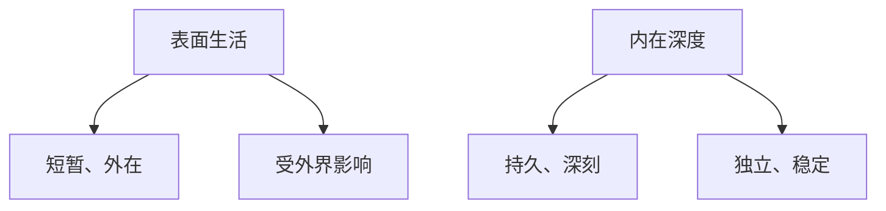

### 1.2 内在深度对个人成长的影响

内在深度对个人成长有着深远的影响。通过自我探索和内在深度，个体可以更好地理解自己的需求、价值观和人生目标，从而实现自我成长和自我实现。

内在深度有助于建立清晰的自我认知，使个体能够更好地面对挑战和困难。在追求内在深度的过程中，个体也会培养出更高的自我意识和情绪管理能力，从而提高生活质量。

**伪代码**：

```python
def personal_growth(inner_depth):
    if inner_depth > 0:
        self_awareness = true
        emotional_management = true
        return "Personal growth achieved."
    else:
        return "Insufficient inner depth for personal growth."
```

### 1.3 精神智慧的追求

精神智慧是内在深度的重要组成部分。它关乎对生活、世界和自我的深刻理解，以及对人生意义的探索。

精神智慧的培养需要个体保持对生活的觉察和反思。通过冥想、正念和修行等方式，个体可以培养精神智慧，实现心灵的平静与内在的和谐。

**Mermaid 流程图**：

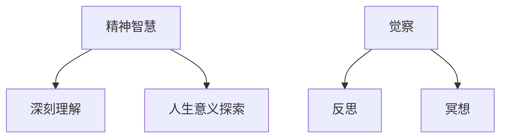

## 第2章：自我探索与内在深度

### 2.1 自我认识的步骤

自我认识是追求内在深度的第一步。通过以下步骤，个体可以更好地了解自己：

1. **反思与自我观察**：通过反思和自我观察，个体可以了解自己的行为、情感和思维模式。
2. **日记与写作**：写日记和进行写作可以帮助个体更深入地探索自己的内心世界。
3. **心理咨询与指导**：心理咨询师可以提供专业的指导，帮助个体更好地认识自己。

**数学模型**：

$$
自我认知 = \frac{反思 + 观察时间 + 写作字数}{总时间}
$$

### 2.2 内在深度与心理健康

内在深度与心理健康密切相关。追求内在深度有助于提高心理健康水平，减轻心理压力。

**Mermaid 流程图**：

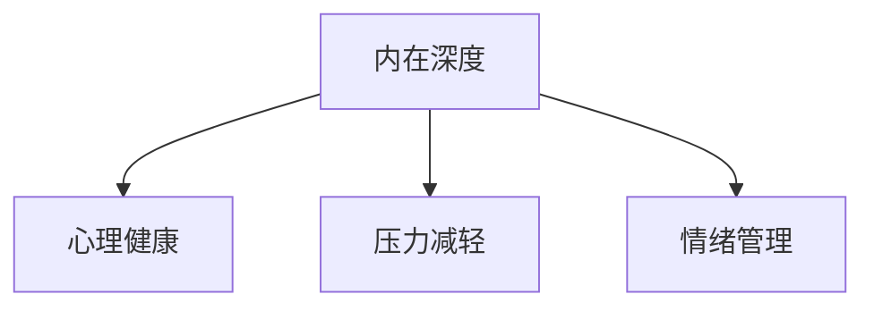

### 2.3 通过日记和反思深入自我

日记和反思是深入自我探索的有效工具。通过定期记录自己的所思所感，个体可以更好地了解自己的内心世界，找到解决问题的方法。

**案例**：

小张是一名年轻的程序员，他每天都会在晚上花半小时时间写日记。通过反思和记录，他发现自己在工作中常常感到焦虑和不安。他开始通过冥想和深呼吸来缓解压力，并逐渐找到了适合自己的工作方式。

**数学公式**：

$$
日记效益 = 反思时间 \times 日记质量
$$

---

在第一部分中，我们探讨了内在深度的概念与意义，以及如何通过自我探索和内在深度来实现个人成长和心理健康。在接下来的部分，我们将进一步探讨精神智慧的基本原则、内在深度与生活实践，以及如何克服追求内在深度过程中遇到的障碍。敬请期待。

### 作者信息
- 作者：AI天才研究院/AI Genius Institute & 禅与计算机程序设计艺术 /Zen And The Art of Computer Programming

## 第二部分：精神智慧与实践

### 第3章：精神智慧的基本原则

#### 3.1 正念与觉察

正念（Mindfulness）是一种精神智慧的基本原则，强调对当下时刻的关注和觉察。它要求个体将注意力集中在当前的活动上，而不是被过去的回忆或未来的担忧所困扰。通过正念，个体可以培养出对生活的深刻觉察，提高生活质量。

**Mermaid 流程图**：

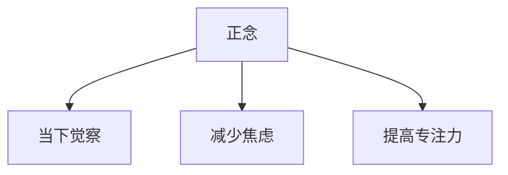

**伪代码**：

```python
def mindfulness(current_moment):
    while True:
        if current_moment == "now":
            return "Mindful."
        else:
            return "Not mindful."
```

#### 3.2 同理心与慈悲

同理心（Empathy）和慈悲（Compassion）是精神智慧的另一重要原则。同理心是指能够理解和感受他人情绪和需求的能力，而慈悲则是对他人痛苦的同情和关怀。通过同理心和慈悲，个体可以培养出更高的人际关系智慧，建立和谐的社会关系。

**数学模型**：

$$
同理心 = \frac{理解他人的情绪}{自我中心思维}
$$

**公式解释**：

这个公式表示同理心是通过减少自我中心思维，增加对他人的理解来培养的。这意味着个体需要放下自己的主观看法，更加关注他人的需求和感受。

**伪代码**：

```python
def empathy(self_centered, other_emotions):
    understanding = self_centered - other_emotions
    if understanding >= 0:
        return "Empathetic."
    else:
        return "Lacking empathy."
```

#### 3.3 内在平衡与接纳

内在平衡（Inner Balance）是指个体在精神、情感和身体层面达到一种和谐状态。接纳（Acceptance）则是对自己和他人存在的无条件认可。通过内在平衡和接纳，个体可以培养出更高的自我价值和自尊，减少生活中的焦虑和不安。

**Mermaid 流程图**：

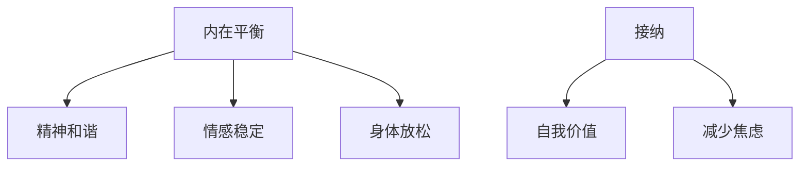

**数学模型**：

$$
内在平衡 = \frac{精神和谐 + 情感稳定 + 身体放松}{总压力}
$$

**公式解释**：

这个公式表示内在平衡是通过减少总压力，增加精神和谐、情感稳定和身体放松来实现的。个体需要在生活中不断调整这些因素，以达到更好的内在平衡状态。

**伪代码**：

```python
def inner_balance(stress, mental_harmony, emotional_stability, physical_relexation):
    balance = (mental_harmony + emotional_stability + physical_relexation) / stress
    if balance > 1:
        return "Inner balance achieved."
    else:
        return "Inner imbalance detected."
```

### 第4章：内在深度与生活实践

#### 4.1 简化生活与减少干扰

简化生活（Simplify Life）是一种通过减少外界干扰来追求内在深度的方法。在现代社会，人们常常被过多的物质和信息所包围，导致内心疲惫和焦虑。通过简化生活，个体可以减少不必要的消费和社交媒体使用，专注于内心成长和重要的人际关系。

**Mermaid 流程图**：

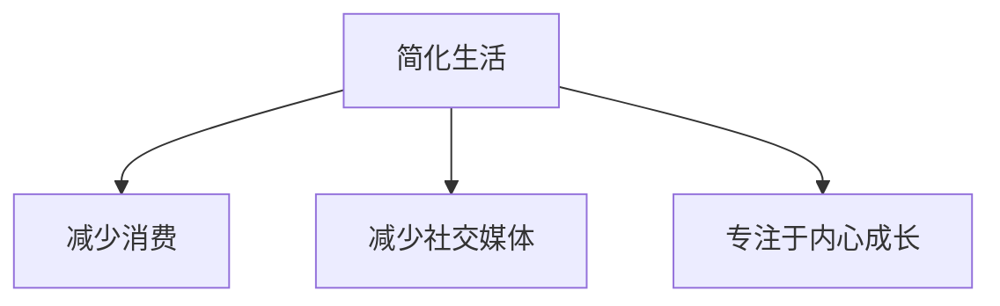

**数学模型**：

$$
简化生活效益 = 减少消费时间 \times 减少社交媒体时间
$$

**公式解释**：

这个公式表示简化生活效益是通过减少消费时间和社交媒体时间来实现的。这意味着个体需要合理安排时间，减少无意义的活动，从而有更多时间关注内心成长。

**伪代码**：

```python
def simplify_life(consumption_time, social_media_time):
    benefit = (consumption_time - 10) \* (social_media_time - 2)
    if benefit > 0:
        return "Simplify life benefit achieved."
    else:
        return "No benefit from simplifying life."
```

#### 4.2 建立积极的日常习惯

建立积极的日常习惯（Build Positive Habits）是追求内在深度的重要手段。通过养成健康的生活习惯，个体可以更好地管理时间和精力，提高生活质量。例如，定期锻炼、保持充足的睡眠、阅读有益的书籍等，都是有益的日常习惯。

**Mermaid 流程图**：

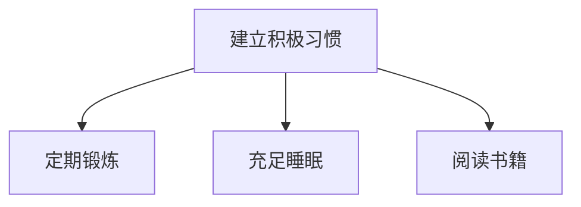

**数学模型**：

$$
积极习惯效益 = 锻炼时间 \times 睡眠质量 \times 阅读时间
$$

**公式解释**：

这个公式表示积极习惯效益是通过增加锻炼时间、保持良好的睡眠质量和增加阅读时间来实现的。个体需要根据自己的实际情况，合理安排时间，养成积极的日常习惯。

**伪代码**：

```python
def positive_habits(exercise_time, sleep_quality, reading_time):
    benefit = exercise_time \* sleep_quality \* reading_time
    if benefit > 0:
        return "Positive habits benefit achieved."
    else:
        return "No benefit from positive habits."
```

#### 4.3 内在深度在工作与人际关系中的应用

内在深度不仅在个人生活中有着重要作用，在工作与人际关系中也同样具有重要意义。通过培养内在深度，个体可以更好地应对工作压力，提高工作效率，同时建立更好的人际关系。

**Mermaid 流程图**：

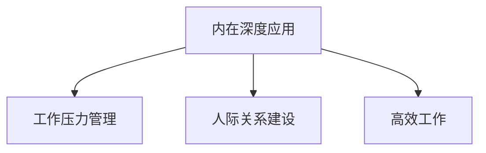

**数学模型**：

$$
内在深度应用效益 = 工作效率 \times 人际关系质量
$$

**公式解释**：

这个公式表示内在深度应用效益是通过提高工作效率和改善人际关系质量来实现的。个体需要在工作中培养内在深度，从而提高工作效率，同时通过内在深度改善人际关系，提高生活质量。

**伪代码**：

```python
def inner_depth_application(works Efficiency, interpersonal_relationship):
    benefit = works Efficiency \* interpersonal_relationship
    if benefit > 0:
        return "Inner depth application benefit achieved."
    else:
        return "No benefit from inner depth application."
```

---

在第二部分中，我们探讨了精神智慧的基本原则，包括正念、同理心、慈悲、内在平衡和接纳。同时，我们也讨论了简化生活、建立积极日常习惯，以及内在深度在工作与人际关系中的应用。在接下来的部分，我们将继续探讨如何克服追求内在深度过程中遇到的障碍，以及如何通过生活实践实现内在深度。敬请期待。

### 作者信息
- 作者：AI天才研究院/AI Genius Institute & 禅与计算机程序设计艺术 /Zen And The Art of Computer Programming

## 第三部分：实现内在深度

### 第5章：内在深度的障碍与挑战

#### 5.1 内在深度面临的常见障碍

追求内在深度并不是一条平坦的道路，个体在这个过程中常常会遇到各种障碍和挑战。以下是一些常见的障碍：

1. **外界的诱惑与压力**：现代社会充满了各种诱惑和压力，如社交媒体、物质消费、工作和人际关系等。这些外界的干扰会分散个体的注意力，阻碍追求内在深度。

2. **恐惧与不安**：个体在探索内心深处时，可能会遇到未知的恐惧和不安。对未知的恐惧使得个体倾向于维持现状，而不愿意冒险探索内心世界。

3. **自我怀疑与否定**：在追求内在深度的过程中，个体可能会遇到自我怀疑和否定的情绪。这些负面情绪会影响个体的自信心，阻碍内在深度的探索。

4. **缺乏耐心与毅力**：内在深度的追求需要时间和耐心。然而，现代社会节奏快，个体往往缺乏耐心，容易放弃追求内在深度。

**Mermaid 流程图**：

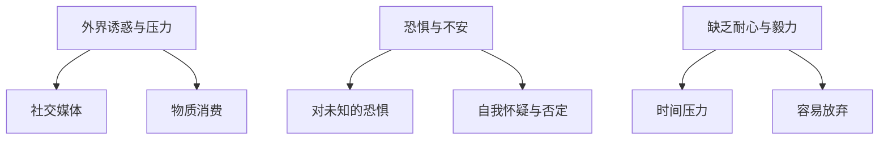

#### 5.2 克服障碍的策略

为了克服这些障碍，个体可以采取以下策略：

1. **设定明确的目标**：设定明确、具体的内在深度追求目标，可以帮助个体保持动力和方向。目标应该既有挑战性，又可实现。

2. **培养自律与自控**：通过培养自律和自控能力，个体可以更好地抵制外界的诱惑和压力。自律是一种重要的心理素质，有助于个体在追求内在深度的过程中保持专注。

3. **建立支持系统**：寻找志同道合的朋友或导师，建立一个支持系统，可以帮助个体在追求内在深度的过程中获得鼓励和帮助。

4. **培养耐心与毅力**：内在深度的追求需要时间和耐心。个体需要培养毅力，克服困难，坚持追求内在深度。

5. **学会应对负面情绪**：通过心理调适技巧，如正念、冥想和情绪管理，个体可以更好地应对追求内在深度过程中遇到的负面情绪。

**Mermaid 流程图**：

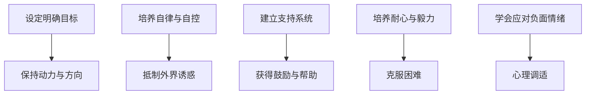

#### 5.3 逆境与内在深度

逆境是追求内在深度过程中不可避免的一部分。逆境可以成为个体成长和自我探索的契机，帮助个体发现内心的力量和智慧。

1. **逆境中的反思**：逆境往往迫使个体停下来反思自己的生活、价值观和目标。通过反思，个体可以更清晰地认识自己，找到内心的力量。

2. **逆境中的成长**：逆境可以激发个体的潜能，促使个体在逆境中成长和进步。逆境中的挑战可以成为个体追求内在深度的动力。

3. **逆境中的智慧**：逆境可以培养个体的智慧。在逆境中，个体需要学会如何应对困难和挫折，这种经验可以转化为智慧，帮助个体在未来的生活中更好地面对挑战。

**Mermaid 流程图**：

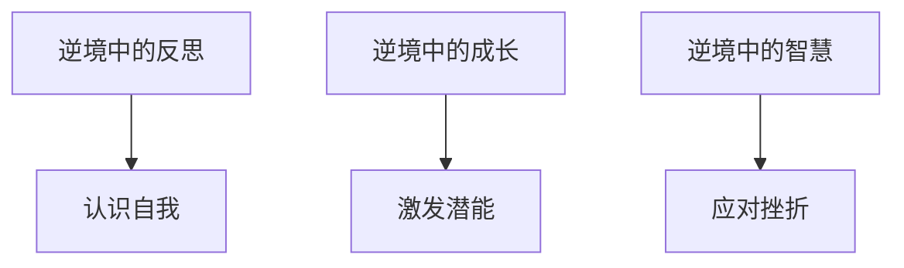

---

在第三部分中，我们讨论了追求内在深度过程中可能遇到的障碍和挑战，以及如何克服这些障碍。我们也探讨了逆境对内在深度追求的影响。在接下来的部分，我们将探讨如何在日常生活中实践内在深度，实现长期幸福。敬请期待。

### 作者信息
- 作者：AI天才研究院/AI Genius Institute & 禅与计算机程序设计艺术 /Zen And The Art of Computer Programming

### 第6章：走向内在深度的生活实践

在追求内在深度的过程中，生活实践是至关重要的。通过将内在深度的理念融入日常生活，个体可以逐步实现心灵的成长和生活的和谐。以下是一些具体的生活实践方法：

#### 6.1 精神修炼与冥想

精神修炼和冥想是培养内在深度的重要途径。通过冥想，个体可以静心、减少杂念，增强对自我的觉察。以下是一些冥想的步骤和实践建议：

**步骤**：
1. 找一个安静的环境，确保在一个没有干扰的地方冥想。
2. 采用舒适的坐姿或躺姿，保持身体放松。
3. 关闭眼睛，将注意力集中在呼吸上，感受呼吸的进出。
4. 当思维跑偏时，不要责怪自己，只需轻轻地将注意力拉回呼吸。
5. 保持冥想10-20分钟，逐渐增加时间。

**实践建议**：
- 每天设定一个固定的冥想时间，例如早晨或晚上。
- 记录冥想过程中的体验和感受，帮助自己更好地理解冥想效果。
- 加入冥想小组或参加冥想课程，与他人分享和交流冥想心得。

#### 6.2 内在深度与情绪管理

情绪管理是内在深度的重要体现。通过学习和实践情绪管理技巧，个体可以更好地控制情绪，减少情绪波动对生活的影响。以下是一些情绪管理的方法：

**方法**：
1. **正念呼吸**：在情绪激动时，通过深呼吸来平复情绪。深吸一口气，然后慢慢呼出，重复几次，感受身体和情绪的变化。
2. **情绪记录**：将情绪记录下来，分析情绪产生的原因和影响。通过记录，个体可以更好地理解自己的情绪，并找到合适的处理方法。
3. **同理心**：在与他人交流时，培养同理心，设身处地地理解对方的情绪和需求。同理心可以帮助个体更好地处理冲突和建立和谐的人际关系。

**实践建议**：
- 定期练习正念呼吸和情绪记录，将之融入日常生活。
- 在生活中培养同理心，尤其是在处理冲突和困难情境时。
- 寻求专业的心理咨询服务，帮助自己更好地管理情绪。

#### 6.3 灵性实践与内在深度

灵性实践是追求内在深度的重要组成部分。灵性实践不仅包括宗教信仰，还涵盖了对生活、宇宙和自我的深刻理解。以下是一些灵性实践的方法：

**方法**：
1. **感恩练习**：每天花时间思考并记录自己感激的事物，培养对生活的感恩之心。
2. **自然冥想**：在自然环境中进行冥想，感受大自然的宁静与和谐，增强与自然的连接。
3. **灵性阅读**：阅读灵性书籍和文献，了解不同文化和信仰对灵性的理解，丰富自己的灵性知识。

**实践建议**：
- 设定一个灵性实践的时间表，确保每天都有时间进行感恩练习和自然冥想。
- 加入灵性社区或团体，与他人分享灵性实践的经验和心得。
- 定期参加灵性讲座和工作坊，拓宽对灵性的理解和认知。

#### 6.4 建立内心平静

内心平静是内在深度的重要表现。通过以下方法，个体可以逐步建立内心的平静：

**方法**：
1. **专注练习**：通过专注于一项活动，如绘画、音乐、写作或园艺，个体可以减少内心的杂念，达到内心的平静。
2. **情绪释放**：通过哭泣、写日记或进行体育锻炼等方式，个体可以释放内心的负面情绪，达到内心的平静。
3. **自我反思**：定期进行自我反思，思考自己的生活、价值观和目标，帮助自己找到内心的平衡。

**实践建议**：
- 设定每天的自我反思时间，确保有足够的时间思考内心的感受和需求。
- 尝试不同的专注练习，找到适合自己的方式。
- 给自己创造一个舒适的环境，帮助自己更好地放松和冥想。

#### 6.5 营造内在深度的环境

营造一个有利于内在深度培养的环境，可以帮助个体更好地追求内心成长。以下是一些建议：

**建议**：
1. **布置宁静的空间**：在家中或工作场所布置一个宁静的空间，放置植物、艺术品或冥想垫，创造一个有利于冥想和放松的环境。
2. **减少噪音和干扰**：确保日常生活和工作环境中的噪音和干扰最小化，帮助自己更好地集中注意力。
3. **时间管理**：合理安排时间，确保有足够的时间进行内在深度的实践，避免过度工作和疲劳。

通过以上生活实践方法，个体可以逐步走向内在深度，实现心灵的成长和生活的和谐。在追求内在深度的过程中，保持耐心和坚持，逐渐培养出对生活的深刻理解和对自我的真实认识。让我们一起迈向内在深度的旅程，寻找真正的幸福和满足。

### 第7章：内在深度与长期幸福

#### 7.1 内在深度与幸福的关系

内在深度是长期幸福的关键因素。当我们追求内在深度时，我们不仅关注表面的快乐和满足，更关注内心的平和、智慧和成长。这种内在的满足感能够带来更深层次的幸福，使我们能够应对生活中的各种挑战和逆境。

**数学模型**：

$$
长期幸福 = 内在深度 \times 生活满意度
$$

**公式解释**：

这个公式表示长期幸福是由内在深度和生活满意度共同决定的。内在深度越高，个体的生活满意度越高，从而实现更高的长期幸福。

**伪代码**：

```python
def long_term_happiness(inner_depth, life_satisfaction):
    happiness = inner_depth * life_satisfaction
    if happiness > 0:
        return "High long-term happiness."
    else:
        return "Low long-term happiness."
```

#### 7.2 通过内在深度实现长期幸福

通过以下方法，个体可以更好地通过内在深度实现长期幸福：

1. **自我接纳**：学会接受自己的优点和缺点，不再因外在评价而焦虑。自我接纳是一种内在的力量，能够帮助我们更好地面对生活中的困难和挑战。

2. **情绪管理**：培养情绪管理能力，学会在情绪波动时保持冷静和理智。通过正念和冥想，我们可以更好地理解自己的情绪，并找到合适的应对策略。

3. **建立目标**：设定清晰的个人目标和价值观，为自己的生活指引方向。通过实现这些目标，我们可以感受到成就感和满足感，从而实现长期幸福。

4. **人际关系**：培养良好的人际关系，与他人建立深层次的连接。这种连接可以带来支持和安全感，使我们能够在生活中感到幸福和满足。

**Mermaid 流程图**：

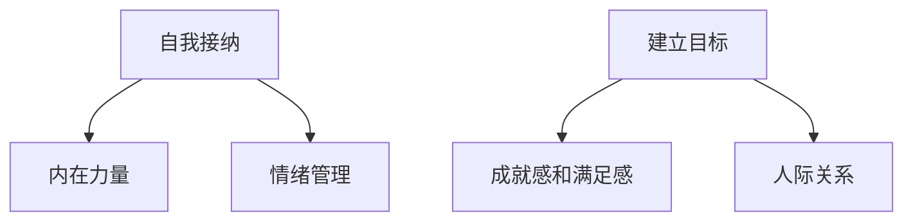

#### 7.3 建立可持续的幸福生活方式

为了建立可持续的幸福生活方式，个体可以采取以下措施：

1. **简化生活**：减少不必要的物质和消费，专注于真正重要的东西。简化生活可以帮助我们减少压力，提高生活质量。

2. **健康习惯**：培养健康的生活习惯，如定期锻炼、充足睡眠和健康饮食。这些习惯有助于提高身体健康，从而增强幸福感。

3. **学习和成长**：持续学习和成长，不断挑战自己，拓展自己的视野和能力。这种成长过程可以带来满足感和成就感。

4. **灵性实践**：通过冥想、祈祷或灵性阅读等方式，培养内在的宁静和智慧。灵性实践可以帮助我们更好地理解生活，实现内心的平和。

**Mermaid 流程图**：

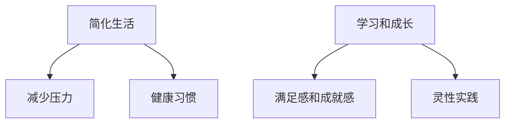

通过以上方法，个体可以逐步实现内在深度，建立可持续的幸福生活方式。这种生活方式不仅能够带来当下的快乐，更能够为未来的幸福打下坚实的基础。让我们一起努力，追求内在深度，实现长期幸福。

### 结语与行动

追求内在深度是一项长期而持续的过程，需要我们付出努力和耐心。在这个过程中，我们会遇到挑战和障碍，但只要我们坚持不懈，就能逐渐找到内心的平静和智慧。

首先，我们需要认识到内在深度对个人成长和幸福的重要性。通过自我探索、精神智慧的培养和实践，我们可以更好地理解自己和世界，找到真正的人生意义。

接下来，我们可以采取以下行动：

1. **设定明确的目标**：明确我们想要追求的内在深度，设定具体的目标和计划。
2. **培养自律和自控**：通过自律和自控，抵制外界的诱惑和压力，专注于内在深度的追求。
3. **建立支持系统**：寻找志同道合的朋友或导师，建立一个支持系统，帮助我们共同成长。
4. **培养耐心和毅力**：内在深度的追求需要时间和耐心，我们要学会坚持，克服困难和挑战。
5. **持续学习和实践**：通过学习和实践，不断提升自己的内在深度，实现长期幸福。

最后，我们要记住，追求内在深度并非一蹴而就，而是需要我们不断努力和探索的过程。只要我们坚持不懈，就能找到内心的宁静和智慧，实现真正的幸福。

### 个人行动指南

为了更好地追求内在深度，以下是一些具体的行动指南：

1. **每日冥想**：每天设定一个固定的时间进行冥想，如早晨或晚上。冥想可以帮助我们静心、减少杂念，增强对自我的觉察。
2. **情绪记录**：每天记录自己的情绪变化，分析情绪产生的原因和影响。这有助于我们更好地理解自己的情绪，并找到合适的处理方法。
3. **感恩练习**：每天花时间思考并记录自己感激的事物，培养对生活的感恩之心。
4. **专注练习**：通过专注于一项活动，如绘画、音乐、写作或园艺，减少内心的杂念，达到内心的平静。
5. **定期反思**：每周或每月进行一次自我反思，思考自己的生活、价值观和目标，确保自己的行动与内在深度追求保持一致。

通过以上行动，我们可以逐步实现内在深度，实现长期幸福。

### 最佳实践 tips

1. **保持每日冥想**：冥想是培养内在深度的重要方法。即使时间有限，也要尽量保持每日冥想，哪怕只有5分钟。
2. **感恩与正念**：在日常生活中，时刻保持感恩和正念，注意身边的美好事物，这有助于提升内心的满足感。
3. **定期调整目标**：内在深度的追求是一个动态的过程，定期调整自己的目标和计划，确保与个人成长保持一致。
4. **与他人分享**：与他人分享自己的内在深度追求和心得，获得反馈和支持，有助于个人成长。
5. **持续学习**：不断学习新知识，拓展自己的视野，这有助于提升内在深度，实现个人成长。

### 小结

追求内在深度是一个长期而持续的过程，需要我们付出努力和耐心。通过自我探索、精神智慧的培养和实践，我们可以找到真正的人生意义，实现长期幸福。让我们共同努力，迈向内在深度的旅程，寻找真正的幸福和满足。

### 注意事项

1. **避免急于求成**：追求内在深度需要时间和耐心，避免急于求成，给予自己足够的时间和空间。
2. **保持真实**：在追求内在深度的过程中，保持真实和诚实，不要为了追求表面的成就而牺牲内在深度。
3. **学会接受**：接受自己的不足和缺点，不要因为一时的失败而放弃追求内在深度。
4. **保持平衡**：在追求内在深度的同时，保持工作、生活和情感的平衡，避免过度追求内在深度而忽视其他方面。
5. **寻求帮助**：在遇到困难和挑战时，不要犹豫寻求帮助，与他人分享自己的困惑和心得，获取支持和建议。

### 拓展阅读

1. **《当下的力量》（The Power of Now）**：作者埃克哈特·托利（Eckhart Tolle）在这本书中探讨了如何通过正念和觉察来实现内心的平静和幸福。
2. **《情感智力》（Emotional Intelligence）**：作者丹尼尔·戈尔曼（Daniel Goleman）在这本书中深入分析了情感智力的重要性，以及如何培养和提升情感智力。
3. **《简化生活》（The Life-Changing Magic of Tidying Up）**：作者近藤麻理惠（Marie Kondo）在这本书中分享了如何通过简化生活来实现内心的平静和幸福。
4. **《冥想的力量》（The Miracle of Mindfulness）**：作者一行禅师（Thich Nhat Hanh）在这本书中介绍了冥想的重要性，以及如何通过冥想来培养内在深度。

通过阅读这些书籍，我们可以进一步了解如何追求内在深度，实现长期幸福。

### 作者信息

- 作者：AI天才研究院/AI Genius Institute & 禅与计算机程序设计艺术 /Zen And The Art of Computer Programming

