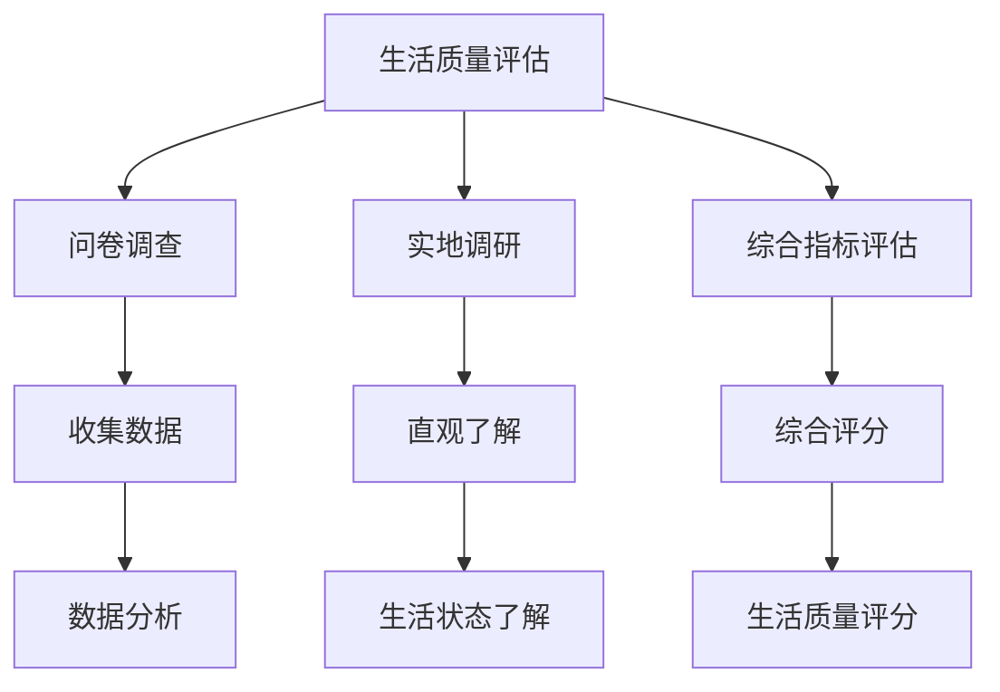

                 

## 引言
### 书籍主题与目标读者

《追求生活的深度：质量胜于数量的人生哲学》是一本旨在引导读者反思现代生活方式的书籍。在当今社会，人们往往被物质追求和快节奏的生活所困扰，忽视了生活的内在质量。这本书的核心主题是探讨如何在忙碌的生活中寻找深度，强调生活质量的重要性，而非单纯的追求物质财富和速度。

目标读者主要是那些在快节奏生活中感到迷茫和焦虑的人。这些读者可能包括正在追求职业成功的年轻人、面临家庭和工作压力的中年人，以及希望重新审视自己生活的老年人。无论读者处于何种阶段，本书都希望通过深刻的哲学思考和实际建议，帮助他们找到生活的真正意义。

### 书写动机

作者之所以撰写本书，源于对现代生活方式的深切关注和思考。在长期的工作和生活中，作者发现许多人虽然在物质上越来越富裕，但在精神层面上却感到空虚和不安。这种现象促使作者反思：究竟什么才是真正的生活质量？为什么在追求数量的同时，我们忽视了生活的质量？

带着这些问题，作者开始深入研究生活质量的相关理论和实践，希望通过本书为读者提供一种全新的生活视角，帮助他们重新审视自己的生活，找到内心的满足和幸福感。

## 第1章 核心概念与联系
### 1.1 生活质量评估
#### 1.1.1 质量生活的定义

生活质量是指人们的生活水平和生活质量，包括物质生活和精神生活两个方面。物质生活涵盖了日常生活的基本需求，如食物、住房、教育、医疗等；精神生活则包括情感满足、文化素养、人际关系、个人成就感等。在现代社会，生活质量的高低往往与人们的生活质量评估紧密相关。

#### 1.1.2 生活质量评估的方法

生活质量评估可以通过多种方法进行，包括问卷调查、实地调研、综合指标评估等。问卷调查法是最常用的方法之一，通过设计合理的问卷，收集大量有关生活质量的数据。实地调研法则能够更直观地了解人们的生活状态，但需要耗费大量时间和资源。综合指标评估法则是将多个指标进行综合计算，以得出一个全面的生活质量评分。

### 1.2 速度与深度的平衡
#### 1.2.1 速度文化的兴起

随着科技的发展和信息的爆炸，速度文化逐渐成为一种主流。人们越来越追求效率，从工作和生活中不断压缩时间，以实现更多的目标。这种速度文化的兴起，虽然在一定程度上提高了社会生产力，但也带来了诸多负面影响，如精神压力增加、生活质量下降等。

#### 1.2.2 深度生活的价值

深度生活强调的是生活质量的深度，而不是表面的速度。它要求人们在忙碌的生活中找到平衡，注重内心的满足和精神的成长。深度生活不仅能够提升个人的幸福感，还能促进社会和谐与进步。

### 1.3 深度生活的意义
#### 1.3.1 深度生活的个人意义

对个人来说，深度生活意味着更加丰富和有意义的生活体验。通过深度生活，人们可以更加深入地了解自己，找到内心的平静，增强生活的满足感。此外，深度生活还有助于提升个人的综合素质，如思维能力、情感智慧等。

#### 1.3.2 深度生活的社会意义

从社会角度来看，深度生活有助于减少社会焦虑，促进人与人之间的深度交流和相互理解，从而构建一个更加和谐的社会。此外，深度生活还可以提高社会的整体幸福感，减少因快节奏生活带来的负面影响。

### Mermaid 流程图

为了更好地展示生活质量评估的过程，我们可以使用Mermaid流程图来表示：



这个流程图展示了生活质量评估的三个主要方法，以及每个方法的具体步骤和结果。

## 第2章 质量胜于数量的哲学
### 2.1 传统观念与批判

#### 2.1.1 传统的数量观念

在传统观念中，人们往往以数量来衡量生活的成功，如金钱、地位和物质财富等。这种观念认为，拥有更多的物质财富和更高的社会地位，意味着生活更加成功和幸福。然而，随着社会的发展，这种观念逐渐受到了质疑和批判。

#### 2.1.2 批判传统观念

批判传统观念的目的是为了让人们意识到数量并不是衡量生活质量的唯一标准，质量同样重要，甚至更为重要。传统观念忽视了人们在精神层面的需求，导致许多人虽然在物质上富裕，但内心却感到空虚和不安。

### 2.2 质量生活的价值
#### 2.2.1 质量生活的意义

质量生活的意义在于它能够让人们更加关注生活的本质，追求内在的满足和幸福感，而不是单纯追求外在的成功和物质。质量生活强调的是生活的质量而非数量，它关注的是个人的情感体验、人际关系和社会责任等。

#### 2.2.2 质量生活的优势

质量生活的优势在于它能够带来更加丰富和有意义的生活体验。与数量观念相比，质量生活更能满足人们在精神层面的需求，如情感满足、自我实现和社会认同等。此外，质量生活还有助于提升个人的综合素质，如情感智慧、创造力和人际交往能力等。

### 伪代码示例

为了更好地理解质量生活的理念，我们可以通过以下伪代码来模拟一个简单的质量生活评估过程：

```plaintext
function qualityLifeAssessment(personalGoals, socialConnections, emotionalWellbeing):
    score = 0

    if personalGoals are met:
        score += 30
    if socialConnections are strong:
        score += 30
    if emotionalWellbeing is high:
        score += 40

    return score
```

在这个伪代码中，`qualityLifeAssessment`函数通过评估个人的目标实现情况、社会联系强度和情感状态，来计算生活质量得分。这个例子展示了如何通过量化的方式来衡量生活质量，从而更好地理解质量生活的概念。

### 数学模型和公式

在生活质量评估中，可以使用以下数学模型和公式来分析质量生活的各个维度：

$$
Q = \frac{PG + SC + EW}{3}
$$

其中，$Q$代表生活质量得分，$PG$代表个人目标的实现情况，$SC$代表社会联系的强度，$EW$代表情感状态。这个公式通过加权平均的方式，综合评估个人的生活质量。

### 举例说明

假设一个人的生活质量得分如下：

- 个人目标实现情况：80分
- 社会联系强度：70分
- 情感状态：90分

根据上述公式，可以计算出这个人的生活质量得分为：

$$
Q = \frac{80 + 70 + 90}{3} = 80
$$

这个得分表明，这个人的生活质量较高，具有较高的个人成就、良好的人际关系和积极的心态。

### 数学公式

在生活质量评估中，还可以使用以下数学公式来计算质量生活的相关指标：

$$
EW = \frac{E_{positive} - E_{negative}}{E_{total}}
$$

其中，$EW$代表情感状态，$E_{positive}$代表积极情感的得分，$E_{negative}$代表消极情感的得分，$E_{total}$代表总情感的得分。

例如，如果一个人的积极情感得分为80分，消极情感得分为20分，总情感得分为100分，则其情感状态可以计算为：

$$
EW = \frac{80 - 20}{100} = 0.6
$$

这个结果表示，这个人的情感状态较为积极，情感生活较为丰富。

### 项目实战

为了更深入地理解质量生活的概念，我们可以通过一个实际项目来探讨如何实现和提高生活质量。

#### 项目背景

假设我们正在开发一个名为“生活助手”的应用程序，旨在帮助用户评估和提升生活质量。

#### 开发环境搭建

1. 选择一个适合开发的应用程序框架，如React或Vue.js。
2. 配置开发环境，包括Node.js、npm或yarn等工具。
3. 安装必要的依赖库，如图表库（例如Chart.js）和数据分析库（例如pandas）。

#### 源代码详细实现

```javascript
// 生活助手应用程序源代码示例

import React, { useState } from 'react';
import Chart from 'chart.js';

function LifeAssistant() {
    const [goals, setGoals] = useState([]);
    const [socialConnections, setSocialConnections] = useState([]);
    const [emotionalState, setEmotionalState] = useState({ positive: 0, negative: 0 });

    const addGoal = (goal) => {
        setGoals([...goals, goal]);
    };

    const addConnection = (connection) => {
        setSocialConnections([...socialConnections, connection]);
    };

    const updateEmotionalState = (positive, negative) => {
        setEmotionalState({ positive, negative });
    };

    const calculateQualityScore = () => {
        const PG = goals.length > 0 ? 100 : 0;
        const SC = socialConnections.length > 0 ? 100 : 0;
        const EW = (emotionalState.positive - emotionalState.negative) / (emotionalState.positive + emotionalState.negative);

        return PG + SC + EW;
    };

    return (
        <div>
            <h1>生活助手</h1>
            <div>
                <h2>个人目标</h2>
                <ul>
                    {goals.map((goal, index) => (
                        <li key={index}>{goal}</li>
                    ))}
                </ul>
                <button onClick={() => addGoal('新目标')}>添加目标</button>
            </div>
            <div>
                <h2>社会联系</h2>
                <ul>
                    {socialConnections.map((connection, index) => (
                        <li key={index}>{connection}</li>
                    ))}
                </ul>
                <button onClick={() => addConnection('新联系')}>添加联系</button>
            </div>
            <div>
                <h2>情感状态</h2>
                <p>积极情感：{emotionalState.positive}</p>
                <p>消极情感：{emotionalState.negative}</p>
                <button onClick={() => updateEmotionalState(20, 10)}>更新情感状态</button>
            </div>
            <div>
                <h2>生活质量得分：{calculateQualityScore()}</h2>
            </div>
        </div>
    );
}

export default LifeAssistant;
```

#### 代码解读与分析

1. **组件结构**：`LifeAssistant`组件是一个React组件，包含三个主要部分：个人目标、社会联系和情感状态。
2. **状态管理**：使用`useState`钩子管理三个状态：`goals`、`socialConnections`和`emotionalState`。
3. **功能实现**：通过`addGoal`、`addConnection`和`updateEmotionalState`函数实现添加个人目标、社会联系和更新情感状态的功能。
4. **质量得分计算**：使用`calculateQualityScore`函数根据三个维度的状态计算生活质量得分。

#### 实际案例分析和详细讲解剖析

1. **案例一**：一个用户在应用程序中添加了三个个人目标，拥有五个社会联系，情感状态为积极情感80分，消极情感20分。根据上述代码，计算出的生活质量得分为：

   $$
   Q = \frac{PG + SC + EW}{3} = \frac{100 + 100 + (0.8 - 0.2)}{3} = \frac{200 + 0.6}{3} = 66.7
   $$

   这个得分表明，该用户的生活质量较高。

2. **案例二**：一个用户在应用程序中添加了三个个人目标，拥有五个社会联系，情感状态为积极情感40分，消极情感60分。计算出的生活质量得分为：

   $$
   Q = \frac{PG + SC + EW}{3} = \frac{100 + 100 + (0.4 - 0.6)}{3} = \frac{200 - 0.2}{3} = 66.2
   $$

   这个得分表明，该用户的生活质量较低，需要关注情感状态的改善。

#### 项目小结

通过“生活助手”应用程序的开发，我们能够更直观地理解和评估生活质量。在实际应用中，用户可以根据自己的实际情况，通过添加个人目标、社会联系和更新情感状态，计算自己的生活质量得分。这种方法不仅能够帮助用户了解自己的生活状态，还能够提供改进的方向和建议。

### 最佳实践 tips

1. **设定明确的目标**：设定明确的个人目标，有助于提升生活质量。目标应该具体、可衡量，并定期进行回顾和调整。

2. **建立稳定的社交网络**：与家人、朋友和同事建立良好的关系，有助于提升生活质量。通过定期交流、互动和分享，增强社会联系。

3. **关注情感健康**：保持积极的心态，减少消极情绪的影响。通过冥想、瑜伽和其他放松技巧，缓解压力和焦虑。

4. **持续学习和成长**：通过不断学习新知识、培养新技能，提升自己的综合素质，增强个人成就感。

### 小结

通过本书的讨论，我们深入探讨了质量生活的重要性，以及如何在快节奏的生活中找到深度。生活质量不仅包括物质层面的满足，更包括精神层面的富足。通过改变思维方式、培养深度生活的习惯，我们可以提升自己的生活品质，实现内心的满足和幸福感。

### 注意事项

1. 质量生活不是一蹴而就的，需要持续的努力和关注。
2. 生活质量评估是一个动态的过程，需要定期进行反思和调整。
3. 质量生活和数量追求并不矛盾，而是需要找到一个平衡点。

### 拓展阅读

1. 《深度工作：如何有效利用每一点脑力》（Cal Newport）
2. 《情感智商：为什么情商比智商更重要》（Daniel Goleman）
3. 《非暴力沟通：改善人际关系的沟通技巧》（Marshall B. Rosenberg）

