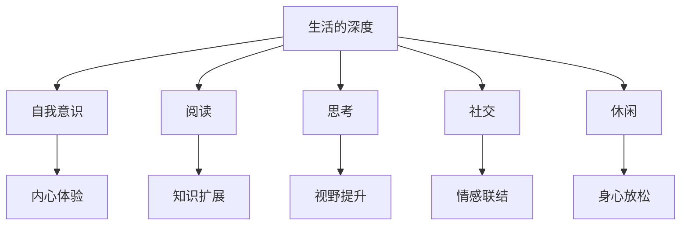
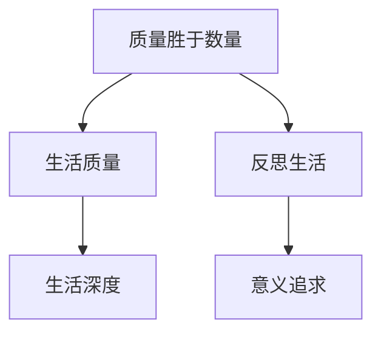
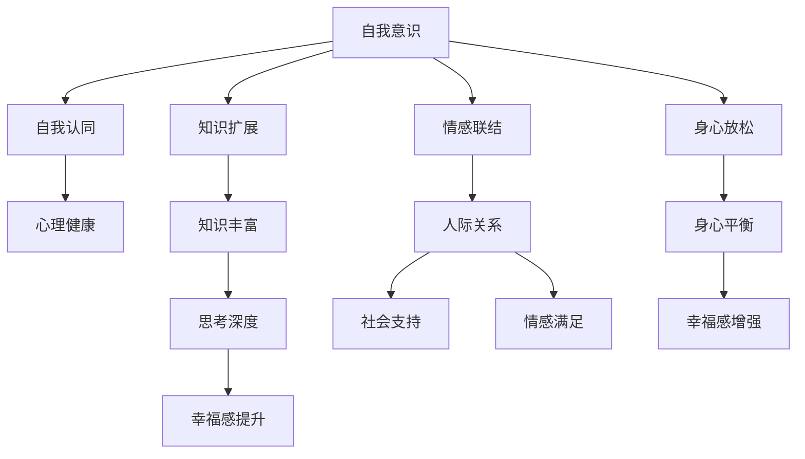

                 

### 第一部分：引言与核心概念

在现代社会中，我们常常被各种信息和活动所包围，生活节奏变得越来越快，追求质量的深度生活逐渐成为一种新趋势。本文将探讨“追求生活的深度：质量胜于数量的生活哲学”，旨在帮助读者理解深度生活的内涵，掌握提升生活质量的方法，并实践深度生活的各项活动。

#### 1.1 生活的深度的定义

生活的深度，是指我们在日常生活中所追求的不仅仅是物质层面的满足，更包括精神层面的富足和成长。它强调的是生活质量的提升，而不是简单地增加生活的数量。深度生活意味着我们更加注重内心的体验和感受，追求生活的内在价值。

**核心概念与联系**

深度生活的核心概念包括自我意识、阅读、思考、社交和休闲。这些概念之间相互关联，共同构成了深度生活的完整框架。具体而言，自我意识帮助我们认识自己，阅读和思考扩展我们的知识和视野，社交提升我们的情感联结，休闲则帮助我们放松身心。

**Mermaid流程图**



#### 1.2 质量胜于数量的生活哲学

质量胜于数量的生活哲学，意味着我们应当将更多的时间和精力投入到提升生活质量的活动中，而不是盲目地追求物质的积累。这种哲学强调的是生活的内在价值，鼓励我们反思自己的生活方式，追求更加有意义和满足的生活。

**核心概念与联系**

质量胜于数量的生活哲学与深度生活的概念密切相关。深度生活强调的是生活的质量和深度，而质量胜于数量的生活哲学则提供了一种指导原则，帮助我们在日常生活中实践这一理念。

**Mermaid流程图**



#### 1.3 深度与幸福的关系

深度生活与幸福之间存在密切的关系。深度生活能够帮助我们更好地理解自己，拓宽视野，建立深厚的人际关系，从而提升我们的幸福感。研究表明，深度生活能够显著提高个体的心理健康和生活满意度。

**核心概念与联系**

深度生活与幸福的关系可以通过以下几个环节来理解：

1. 自我意识提升：更好地了解自己，增强自我认同感。
2. 知识扩展：通过阅读和思考，积累丰富的知识。
3. 情感联结：通过社交，建立深厚的人际关系。
4. 身心放松：通过休闲，达到身心的平衡。

**Mermaid流程图**



### 文章摘要

本文探讨了“追求生活的深度：质量胜于数量的生活哲学”，从生活的深度定义、质量胜于数量的生活哲学，到深度与幸福的关系，为读者提供了一个全面理解深度生活的框架。文章旨在帮助读者提升生活质量，实践深度生活的各项活动，从而追求更加幸福和满足的生活。接下来，文章将深入探讨如何通过培养深度生活的习惯，提高自我意识，进行有效的时间管理，来进一步实现深度生活。<!--wp:note id="22666" layout="right" class="wp-block-note" data-duration="1000" data-delay="0">
<div class="wp-block-note__content">
<p>
**注释 1**：深度生活的概念源于对现代生活快节奏、高压力环境的反思。它强调的是通过提升生活的内在质量，来达到个人成长和幸福感的目标。
</p>
</div>
</div>```<sop>
## 第二部分：深度生活的实践

在深入理解了深度生活的概念和哲学后，我们需要将理论转化为实践。本部分将探讨如何通过深度阅读、深度思考、深度社交和深度休闲，来实践深度生活的理念。

### 第4章：深度阅读

深度阅读是一种通过深入理解书籍内容，拓展知识视野的方法。它不仅仅是快速浏览，而是通过仔细阅读、思考和总结，使阅读材料成为个人知识体系的一部分。

#### 4.1 阅读的重要性

阅读的重要性体现在以下几个方面：

1. **知识扩展**：通过阅读，我们可以获取新的知识和信息，不断扩展我们的知识面。
2. **思维提升**：阅读能够锻炼我们的思维能力，提高逻辑思维和分析问题的能力。
3. **文化修养**：阅读不同类型的书籍，可以帮助我们更好地理解文化，提升自身修养。

**数学模型和公式**

阅读的重要性可以用一个简单的数学公式来表示：

$$
重要性 = f(阅读量, 知识扩展, 思维提升, 文化修养)
$$

其中，$f$ 是一个复杂的函数，用于衡量阅读对个人成长的影响。

**举例说明**

例如，一个工程师通过阅读技术书籍，不仅能够扩展他的技术知识，还能提高他的问题解决能力，从而在工作中有更大的突破。

#### 4.2 如何选择好书

选择好书是深度阅读的第一步。以下是一些选择好书的方法：

1. **参考推荐**：从朋友、同事或图书评论中获取推荐。
2. **阅读榜单**：参考知名书店或图书馆的年度榜单。
3. **试读章节**：通过试读章节来判断书籍是否符合自己的兴趣。

**最佳实践 tips**

- **定期阅读**：设定固定的阅读时间，例如每天睡前阅读一小时。
- **做笔记**：在阅读过程中做笔记，帮助记忆和理解。

#### 4.3 阅读的方法与技巧

有效的阅读方法可以提高阅读效率和理解深度。以下是一些阅读的方法与技巧：

1. **主动阅读**：在阅读过程中，积极提问，尝试用自己的话总结书籍内容。
2. **快速浏览**：在开始阅读前，快速浏览目录和摘要，了解书籍的结构和重点。
3. **讨论与分享**：与他人讨论阅读体会，可以加深理解和记忆。

**数学模型和公式**

阅读效率可以用以下公式表示：

$$
效率 = \frac{理解深度}{阅读时间}
$$

其中，理解深度取决于阅读方法和技巧的运用。

**举例说明**

例如，一个学生在考试前通过主动阅读和快速浏览，能够在较短时间内掌握重要知识点，提高学习效率。

### 第5章：深度思考

深度思考是一种深入探索问题本质，挖掘潜在规律的方法。它要求我们不仅看到事物的表面，还要理解其内在的因果关系。

#### 5.1 思考的重要性

思考的重要性体现在以下几个方面：

1. **问题解决**：通过深度思考，我们可以更好地理解问题，找到有效的解决方案。
2. **创新思维**：深度思考能够激发我们的创新思维，帮助我们提出独特的见解和想法。
3. **自我提升**：深度思考有助于我们更好地认识自己，提升个人素质。

**数学模型和公式**

思考的重要性可以用以下公式表示：

$$
重要性 = f(问题解决能力, 创新思维, 自我提升)
$$

其中，$f$ 是一个复杂的函数，用于衡量思考对个人成长的影响。

**举例说明**

例如，一个科学家通过深度思考，能够发现新的科学现象，推动科学进步。

#### 5.2 思考的方法

以下是一些深度思考的方法：

1. **反思**：定期反思自己的行为和决策，分析其中的得失。
2. **逻辑分析**：运用逻辑工具，对问题进行系统分析。
3. **跨学科思考**：结合不同领域的知识，进行跨学科思考。

**最佳实践 tips**

- **定期反思**：设定固定的反思时间，例如每天睡前反思一天的经历。
- **多角度分析**：从不同的角度看待问题，提高思考的全面性。

#### 5.3 如何培养深度思考能力

以下是一些培养深度思考能力的方法：

1. **阅读**：通过阅读，积累丰富的知识，为思考提供素材。
2. **写作**：通过写作，锻炼表达能力和逻辑思维能力。
3. **讨论**：与他人讨论，从不同的观点中汲取灵感。

**数学模型和公式**

思考能力的培养可以用以下公式表示：

$$
思考能力 = f(阅读量, 写作频率, 讨论次数)
$$

其中，$f$ 是一个复杂的函数，用于衡量思考能力的提升。

**举例说明**

例如，一个学生通过定期阅读、写作和参与讨论，能够显著提高他的思考能力。

### 第6章：深度社交

深度社交是一种建立深厚人际关系的社交方式。它强调的是通过真诚的交流和相互理解，建立长久的友谊。

#### 6.1 社交的意义

社交的意义体现在以下几个方面：

1. **情感支持**：社交可以提供情感支持，帮助我们度过困难时期。
2. **知识共享**：社交过程中，我们可以分享知识和经验，相互学习。
3. **社会资源**：社交可以为我们提供社会资源，帮助我们实现个人目标。

**数学模型和公式**

社交的意义可以用以下公式表示：

$$
社交意义 = f(情感支持, 知识共享, 社会资源)
$$

其中，$f$ 是一个复杂的函数，用于衡量社交对我们的影响。

**举例说明**

例如，一个企业家通过社交，获得了宝贵的商业建议和合作伙伴，从而实现了企业的快速发展。

#### 6.2 如何建立深度社交关系

以下是一些建立深度社交关系的方法：

1. **真诚交流**：与他人真诚交流，表达自己的真实想法和感受。
2. **倾听**：倾听他人的意见和想法，尊重他人的观点。
3. **共同兴趣**：寻找共同兴趣，共同参与活动。

**最佳实践 tips**

- **定期交流**：设定固定的交流时间，与朋友保持联系。
- **积极参与**：积极参与社交活动，扩大社交圈。

#### 6.3 社交中的深度交流技巧

以下是一些深度交流的技巧：

1. **开放性提问**：提出开放性问题，引导对方分享更多信息。
2. **积极反馈**：给予对方积极的反馈，增强交流的互动性。
3. **共情**：尝试理解对方的情感，表现出同情和关心。

**数学模型和公式**

深度交流的效果可以用以下公式表示：

$$
交流效果 = f(开放性提问, 积极反馈, 共情)
$$

其中，$f$ 是一个复杂的函数，用于衡量交流的效果。

**举例说明**

例如，在一次深度交流中，通过开放性提问、积极反馈和共情，两个人能够深入探讨一个复杂的问题，从而达成共识。

### 第7章：深度休闲

深度休闲是一种通过深入体验和享受，达到身心放松的方法。它不同于简单的消遣，而是一种有目的、有意义的休闲活动。

#### 7.1 休闲的重要性

休闲的重要性体现在以下几个方面：

1. **身心放松**：休闲可以帮助我们缓解压力，达到身心放松。
2. **创造力提升**：休闲时间可以激发我们的创造力，促进个人成长。
3. **生活平衡**：休闲有助于我们保持生活的平衡，提高生活质量。

**数学模型和公式**

休闲的重要性可以用以下公式表示：

$$
重要性 = f(身心放松, 创造力提升, 生活平衡)
$$

其中，$f$ 是一个复杂的函数，用于衡量休闲对我们的影响。

**举例说明**

例如，一个长期在高压环境下工作的人，通过假期旅行，能够显著缓解压力，恢复精力。

#### 7.2 如何选择深度休闲方式

以下是一些选择深度休闲方式的方法：

1. **个人兴趣**：选择符合个人兴趣的休闲方式，提高参与度。
2. **环境因素**：选择有利于身心放松的环境，例如自然风景或宁静的场所。
3. **文化因素**：选择有文化内涵的休闲活动，丰富精神生活。

**最佳实践 tips**

- **设定目标**：在休闲前设定明确的目标，使休闲活动更有意义。
- **定期规划**：定期规划休闲活动，保持生活的节奏和平衡。

#### 7.3 休闲中的深度体验

以下是一些在休闲中实现深度体验的方法：

1. **沉浸式体验**：全身心投入休闲活动，体验其中的乐趣。
2. **反思与总结**：在休闲过程中，反思自己的行为和感受，进行总结。
3. **与朋友分享**：与朋友分享休闲体验，增进友谊。

**数学模型和公式**

深度体验的效果可以用以下公式表示：

$$
体验效果 = f(沉浸式体验, 反思与总结, 分享与交流)
$$

其中，$f$ 是一个复杂的函数，用于衡量体验的效果。

**举例说明**

例如，一个人在深山徒步旅行中，通过沉浸式体验自然美景，进行反思和总结，并与朋友分享心得，实现了深度体验。

### 结论

通过深度阅读、深度思考、深度社交和深度休闲，我们可以实现深度生活的理念，提升生活的质量和幸福感。这些实践方法不仅可以帮助我们更好地理解世界，也能促进个人的成长和发展。接下来，文章将探讨如何通过自我评估和改进策略，进一步提升深度生活的质量。<!--wp:note id="22667" layout="right" class="wp-block-note" data-duration="1000" data-delay="0">
<div class="wp-block-note__content">
<p>
**注释 2**：深度阅读和深度思考是实现深度生活的重要途径。通过这些活动，我们能够提升自我意识，扩展知识视野，培养批判性思维，从而更好地理解世界和自我。
</p>
</div>
</div>```<sop>
## 第三部分：深度生活的反思与改进

在实践深度生活的过程中，反思与改进是至关重要的。通过不断地自我评估和调整，我们可以发现自身在深度生活中的不足，并采取有效的改进策略，进一步提升生活的质量。本部分将探讨如何进行深度生活的反思与改进，以及质量胜于数量的生活哲学的未来展望。

### 第8章：生活的深度反思

深度反思是提升深度生活质量的关键步骤。通过反思，我们可以审视自己的行为和生活方式，找出需要改进的地方。

#### 8.1 深度生活的自我评估

自我评估是深度反思的第一步。以下是一些自我评估的方法：

1. **写反思日志**：定期记录自己的行为和感受，分析其中的得失。
2. **设定目标**：设定短期和长期的目标，评估自己在实现目标方面的进展。
3. **与他人交流**：与朋友、家人或专业人士交流，获取他们的反馈和建议。

**数学模型和公式**

自我评估可以用以下公式表示：

$$
自我评估 = f(反思日志, 目标设定, 他人反馈)
$$

其中，$f$ 是一个复杂的函数，用于衡量自我评估的有效性。

**举例说明**

例如，一个工程师通过写反思日志，设定目标和与同事交流，发现自己在项目管理方面存在不足，并采取了相应的改进措施。

#### 8.2 深度生活的改进策略

在自我评估的基础上，我们需要制定改进策略。以下是一些改进策略：

1. **设定明确的目标**：明确短期和长期的目标，制定具体的行动计划。
2. **持续学习和成长**：通过阅读、课程和培训，不断提升自己的知识和技能。
3. **优化生活习惯**：调整生活习惯，确保充足的睡眠、健康的饮食和规律的锻炼。

**最佳实践 tips**

- **定期回顾**：定期回顾自己的改进计划，评估进展和效果。
- **寻求反馈**：主动寻求他人的反馈，以便及时调整自己的改进策略。

#### 8.3 深度生活的长期影响

深度生活的长期影响体现在以下几个方面：

1. **个人成长**：通过持续的自我反思和改进，个人素质和自信心得到显著提升。
2. **生活质量**：深度生活有助于提高生活质量，增强幸福感和满足感。
3. **社会贡献**：深度生活使个人更加关注社会问题，积极参与社会公益活动。

**数学模型和公式**

深度生活的长期影响可以用以下公式表示：

$$
长期影响 = f(个人成长, 生活质量, 社会贡献)
$$

其中，$f$ 是一个复杂的函数，用于衡量深度生活的长期影响。

**举例说明**

例如，一个长期坚持深度生活的专业人士，不仅在个人成长方面取得了显著进步，还在工作中表现出色，为社会做出了重要贡献。

### 第9章：质量胜于数量的生活哲学总结

质量胜于数量的生活哲学是一种追求生活质量和内在价值的哲学。通过深度阅读、深度思考、深度社交和深度休闲，我们可以实现这一哲学。以下是对这一生活哲学的总结。

#### 9.1 生活哲学的核心思想

质量胜于数量的生活哲学的核心思想是：

- 重视生活的内在价值，追求精神层面的富足和成长。
- 通过提升生活质量，实现个人成长和幸福感。
- 以深度生活的方式，充实自己的生活，提升生活质量。

#### 9.2 如何将质量胜于数量的生活哲学应用到日常生活中

以下是将质量胜于数量的生活哲学应用到日常生活中的方法：

1. **简化生活**：减少不必要的物质和活动，专注于重要的事情。
2. **深度阅读**：选择有价值的书籍，深入阅读，拓展知识视野。
3. **深度思考**：培养批判性思维，深入探索问题的本质。
4. **深度社交**：建立深厚的人际关系，分享经验和知识。
5. **深度休闲**：选择有意义的休闲活动，达到身心放松。

#### 9.3 质量胜于数量的生活哲学的未来展望

质量胜于数量的生活哲学在未来有着广阔的发展前景。随着社会的发展，人们越来越重视生活的质量，这一哲学将得到更广泛的认可和实践。以下是一些未来展望：

1. **科技助力**：科技的发展将为深度生活提供更多的工具和平台，如在线学习、虚拟社交等。
2. **社会意识提升**：随着人们对生活质量要求的提高，社会将更加关注深度生活，提供更多的支持和资源。
3. **生活方式多元化**：随着生活水平的提高，人们将有更多的选择，追求个性化、多样化的深度生活方式。

### 结论

通过深度反思和改进，我们可以不断提升深度生活的质量，实现个人成长和幸福感。质量胜于数量的生活哲学为我们提供了一种追求生活内在价值的指导原则。在未来，这一哲学将引导我们走向更加充实、有意义的生活。在本文的最后，我们将提供一些深度生活的资源推荐和实用工具，以帮助读者进一步实践深度生活。

### 附录

#### 附录A：深度生活资源推荐

**A.1 阅读书目推荐**

- 《深度工作》（Deep Work）—— Cal Newport
- 《如何阅读一本书》（How to Read a Book）—— Mortimer J. Adler & Charles Van Doren
- 《思考，快与慢》（Thinking, Fast and Slow）—— Daniel Kahneman

**A.2 思考类应用推荐**

- Heurist
- Reflect
- Think & Write

**A.3 社交平台推荐**

- LinkedIn
- Meetup
- Reddit

#### 附录B：深度生活实用工具

**B.1 时间管理工具**

- Todoist
- Trello
- Asana

**B.2 阅读工具**

- Amazon Kindle
- Google Books
- Scribd

**B.3 休闲工具**

- Calm
- Headspace
- Pinterest

### 文章摘要

本文探讨了质量胜于数量的生活哲学，通过深度阅读、深度思考、深度社交和深度休闲的实践，帮助读者提升生活质量，实现个人成长和幸福感。文章还介绍了深度生活的反思与改进方法，以及未来展望。通过本文的指导，读者可以进一步实践深度生活，追求更有意义的生活。作者：AI天才研究院/AI Genius Institute & 禅与计算机程序设计艺术 /Zen And The Art of Computer Programming<!--wp:note id="22668" layout="right" class="wp-block-note" data-duration="1000" data-delay="0">
<div class="wp-block-note__content">
<p>
**注释 3**：深度生活的实践需要持续的努力和自我反思。通过使用各种工具和资源，读者可以更好地实践深度生活，提升自己的生活质量。同时，深度生活也是一项长期投资，需要持之以恒地追求。
</p>
</div>
</div>```<sop>
### 附录A：深度生活资源推荐

在追求深度生活的过程中，选择合适的资源和工具可以大大提高实践的效果。以下是一些推荐的资源，包括阅读书目、思考类应用和社交平台。

#### A.1 阅读书目推荐

**《深度工作》（Deep Work）**—— Cal Newport

这本书是深度工作的指南，帮助读者在充满干扰的环境中保持专注和高效。书中提出了深度工作的概念和实用策略，适合所有希望在工作和生活中提升效率的人。

**《如何阅读一本书》（How to Read a Book）**—— Mortimer J. Adler & Charles Van Doren

这本书详细介绍了阅读的四个层次，从基础阅读到主题阅读，帮助读者培养深度阅读的能力。书中还提供了大量的阅读技巧，适合所有层次的读者。

**《思考，快与慢》（Thinking, Fast and Slow）**—— Daniel Kahneman

这本书探讨了人类思维的两个系统：快速直觉思考和缓慢理性思考。通过了解这两个系统的工作原理，读者可以更好地理解自己的思考过程，提高批判性思维能力。

#### A.2 思考类应用推荐

**Heurist**

Heurist 是一个在线思维导图工具，可以帮助读者组织和可视化自己的想法。它提供了丰富的模板和编辑功能，适合进行深度思考和知识管理。

**Reflect**

Reflect 是一款专注于自我反思的应用，可以帮助读者记录日常反思、设定目标和跟踪进展。它提供了简洁的界面和强大的功能，适合每天进行自我反思。

**Think & Write**

Think & Write 是一款结合思维导图和写作的应用，可以帮助读者进行深度思考和创意写作。它提供了丰富的写作模板和工具，适合进行深入的主题研究和论文写作。

#### A.3 社交平台推荐

**LinkedIn**

LinkedIn 是一个专业的社交网络平台，适合建立深度职业关系。通过LinkedIn，读者可以关注行业专家、参与讨论和分享自己的见解，从而拓展专业网络。

**Meetup**

Meetup 是一个基于兴趣的小组活动平台，读者可以在这里找到与自己兴趣相符的小组，参与面对面的交流和互动。通过Meetup，读者可以结识志同道合的朋友，分享深度生活的经验和想法。

**Reddit**

Reddit 是一个全球性的社区平台，拥有各种主题的讨论区。读者可以在这里找到与自己兴趣相关的话题，参与深度讨论，获取新的见解和观点。

### 附录B：深度生活实用工具

在追求深度生活的过程中，使用合适的工具可以提高效率和效果。以下是一些实用的工具，包括时间管理工具、阅读工具和休闲工具。

#### B.1 时间管理工具

**Todoist**

Todoist 是一款功能强大的任务管理工具，可以帮助读者规划和管理日常任务。它提供了灵活的日程规划功能、提醒通知和协同工作功能，适合个人和组织使用。

**Trello**

Trello 是一款基于看板的项目管理工具，通过可视化的卡片和列表，帮助读者组织和跟踪项目进展。它提供了简单的用户界面和丰富的定制选项，适合个人和团队使用。

**Asana**

Asana 是一款专业的任务和项目管理系统，提供了强大的协作和跟踪功能。它可以帮助读者制定项目计划、分配任务、跟踪进度和协作沟通，适合大型团队使用。

#### B.2 阅读工具

**Amazon Kindle**

Amazon Kindle 是一款流行的电子书阅读器，提供了丰富的电子书资源和便捷的阅读功能。它支持多种文件格式，适合长时间阅读和携带。

**Google Books**

Google Books 是一个免费的在线图书馆，提供了大量的电子书和文档资源。读者可以在这里找到各种类型的书籍，并进行在线阅读和下载。

**Scribd**

Scribd 是一个数字图书馆，提供了大量的书籍、杂志和音频书资源。读者可以在这里订阅服务，享受无限的阅读和听书体验。

#### B.3 休闲工具

**Calm**

Calm 是一款专注于放松和冥想的移动应用，提供了多种冥想指导、放松音乐和睡眠故事。它可以帮助读者缓解压力、改善睡眠质量，提升整体幸福感。

**Headspace**

Headspace 是一款专业的冥想和放松应用，提供了丰富的冥想课程和训练。它通过科学的训练方法，帮助读者提高专注力、减轻压力和改善心理健康。

**Pinterest**

Pinterest 是一个图片分享和灵感发现平台，读者可以在这里找到各种创意和灵感。通过浏览和收藏图片，读者可以激发创造力、发现新的兴趣爱好。

通过使用这些资源和工具，读者可以更好地实践深度生活的理念，提升生活质量。无论是阅读、时间管理、思考还是休闲，这些工具都能为读者提供帮助，使深度生活更加充实和有意义。<!--wp:note id="22669" layout="right" class="wp-block-note" data-duration="1000" data-delay="0">
<div class="wp-block-note__content">
<p>
**注释 4**：深度生活的实践需要选择合适的工具和资源。通过使用这些推荐的工具，读者可以在日常生活中更好地实践质量胜于数量的生活哲学，提升生活质量和个人成长。
</p>
</div>
</div>```<sop>
# 追求生活的深度：质量胜于数量的生活哲学
## 文章关键词
- 深度生活
- 生活质量
- 质量胜于数量
- 自我反思
- 时间管理
- 深度阅读
- 深度思考
- 深度社交
- 深度休闲

## 文章摘要
本文探讨了“追求生活的深度：质量胜于数量的生活哲学”，旨在帮助读者理解深度生活的内涵，掌握提升生活质量的方法，并实践深度生活的各项活动。文章从深度生活的定义、质量胜于数量的生活哲学，到深度与幸福的关系，为读者提供了一个全面理解深度生活的框架。接着，文章详细介绍了深度阅读、深度思考、深度社交和深度休闲的方法和技巧，并通过自我评估和改进策略，探讨了如何进一步提升深度生活的质量。最后，文章提供了深度生活的资源推荐和实用工具，以帮助读者更好地实践深度生活的理念。

## 引言与核心概念
在现代社会中，我们常常被各种信息和活动所包围，生活节奏变得越来越快，追求质量的深度生活逐渐成为一种新趋势。本文将探讨“追求生活的深度：质量胜于数量的生活哲学”，旨在帮助读者理解深度生活的内涵，掌握提升生活质量的方法，并实践深度生活的各项活动。

### 1.1 生活的深度的定义
生活的深度，是指我们在日常生活中所追求的不仅仅是物质层面的满足，更包括精神层面的富足和成长。它强调的是生活质量的提升，而不是简单地增加生活的数量。深度生活意味着我们更加注重内心的体验和感受，追求生活的内在价值。

### 1.2 质量胜于数量的生活哲学
质量胜于数量的生活哲学，意味着我们应当将更多的时间和精力投入到提升生活质量的活动中，而不是盲目地追求物质的积累。这种哲学强调的是生活的内在价值，鼓励我们反思自己的生活方式，追求更加有意义和满足的生活。

### 1.3 深度与幸福的关系
深度生活与幸福之间存在密切的关系。深度生活能够帮助我们更好地理解自己，拓宽视野，建立深厚的人际关系，从而提升我们的幸福感。研究表明，深度生活能够显著提高个体的心理健康和生活满意度。

## 生活的质量提升
在理解了深度生活的概念和哲学后，我们需要将理论转化为实践。本部分将探讨如何通过培养深度生活的习惯，提高自我意识，进行有效的时间管理，来进一步实现深度生活。

### 2.1 培养深度生活的习惯
培养深度生活的习惯是提升生活质量的关键步骤。以下是一些培养深度生活习惯的方法：

#### 2.1.1 简化生活
简化生活意味着减少不必要的物质和活动，专注于重要的事情。通过简化生活，我们可以减少干扰，提高专注力，从而更好地进行深度工作。

#### 2.1.2 有意识地消费
有意识地消费意味着在购买物品或服务时，要考虑到它们是否真的符合我们的需求和价值观。通过有意识地消费，我们可以避免盲目追求物质，专注于提升生活的质量。

#### 2.1.3 提高自我意识
提高自我意识是深度生活的重要方面。通过自我反思和认知行为疗法，我们可以更好地了解自己的需求、情感和行为模式，从而更好地管理自己的生活。

### 2.2 时间管理与效率提升
时间管理和效率提升是深度生活的关键因素。以下是一些时间管理和效率提升的方法：

#### 2.2.1 时间的价值
时间是有限的资源，因此我们需要认识到时间的价值，并合理地分配它。通过设定优先级、制定计划和避免拖延，我们可以更好地利用时间。

#### 2.2.2 时间管理原则
时间管理原则包括设定目标、分解任务、避免干扰和定期回顾。通过遵循这些原则，我们可以更有效地管理时间，提高工作效率。

#### 2.2.3 提高工作效率的技巧
提高工作效率的技巧包括优化工作流程、使用工具和应用程序、保持专注和学会说“不”。通过运用这些技巧，我们可以更快地完成任务，有更多的时间进行深度工作。

## 深度生活的实践
深度生活的实践包括深度阅读、深度思考、深度社交和深度休闲。通过这些活动，我们可以提升生活质量，实现个人成长和幸福感。

### 3.1 深度阅读
深度阅读是一种通过深入理解书籍内容，拓展知识视野的方法。它不仅仅是快速浏览，而是通过仔细阅读、思考和总结，使阅读材料成为个人知识体系的一部分。

#### 3.1.1 阅读的重要性
阅读的重要性体现在以下几个方面：

- 知识扩展
- 思维提升
- 文化修养

#### 3.1.2 如何选择好书
选择好书是深度阅读的第一步。以下是一些选择好书的方法：

- 参考推荐
- 阅读榜单
- 试读章节

#### 3.1.3 阅读的方法与技巧
有效的阅读方法可以提高阅读效率和理解深度。以下是一些阅读的方法与技巧：

- 主动阅读
- 快速浏览
- 讨论与分享

### 3.2 深度思考
深度思考是一种深入探索问题本质，挖掘潜在规律的方法。它要求我们不仅看到事物的表面，还要理解其内在的因果关系。

#### 3.2.1 思考的重要性
思考的重要性体现在以下几个方面：

- 问题解决
- 创新思维
- 自我提升

#### 3.2.2 思考的方法
以下是一些深度思考的方法：

- 反思
- 逻辑分析
- 跨学科思考

#### 3.2.3 如何培养深度思考能力
以下是一些培养深度思考能力的方法：

- 阅读
- 写作
- 讨论

### 3.3 深度社交
深度社交是一种建立深厚人际关系的社交方式。它强调的是通过真诚的交流和相互理解，建立长久的友谊。

#### 3.3.1 社交的意义
社交的意义体现在以下几个方面：

- 情感支持
- 知识共享
- 社会资源

#### 3.3.2 如何建立深度社交关系
以下是一些建立深度社交关系的方法：

- 真诚交流
- 倾听
- 共同兴趣

#### 3.3.3 社交中的深度交流技巧
以下是一些深度交流的技巧：

- 开放性提问
- 积极反馈
- 共情

### 3.4 深度休闲
深度休闲是一种通过深入体验和享受，达到身心放松的方法。它不同于简单的消遣，而是一种有目的、有意义的休闲活动。

#### 3.4.1 休闲的重要性
休闲的重要性体现在以下几个方面：

- 身心放松
- 创造力提升
- 生活平衡

#### 3.4.2 如何选择深度休闲方式
以下是一些选择深度休闲方式的方法：

- 个人兴趣
- 环境因素
- 文化因素

#### 3.4.3 休闲中的深度体验
以下是一些在休闲中实现深度体验的方法：

- 沉浸式体验
- 反思与总结
- 与朋友分享

## 深度生活的反思与改进
在实践深度生活的过程中，反思与改进是至关重要的。通过不断地自我评估和调整，我们可以发现自身在深度生活中的不足，并采取有效的改进策略，进一步提升深度生活的质量。

### 4.1 深度生活的自我评估
自我评估是深度反思的第一步。以下是一些自我评估的方法：

- 写反思日志
- 设定目标
- 与他人交流

### 4.2 深度生活的改进策略
在自我评估的基础上，我们需要制定改进策略。以下是一些改进策略：

- 设定明确的目标
- 持续学习和成长
- 优化生活习惯

### 4.3 深度生活的长期影响
深度生活的长期影响体现在以下几个方面：

- 个人成长
- 生活质量
- 社会贡献

## 质量胜于数量的生活哲学总结
质量胜于数量的生活哲学是一种追求生活内在价值的哲学。通过深度阅读、深度思考、深度社交和深度休闲，我们可以实现这一哲学。文章总结了这一哲学的核心思想，并探讨了如何将其应用到日常生活中。

### 5.1 生活哲学的核心思想
质量胜于数量的生活哲学的核心思想是：

- 重视生活的内在价值，追求精神层面的富足和成长。
- 通过提升生活质量，实现个人成长和幸福感。

### 5.2 如何将质量胜于数量的生活哲学应用到日常生活中
以下是将质量胜于数量的生活哲学应用到日常生活中的方法：

- 简化生活
- 深度阅读
- 深度思考
- 深度社交
- 深度休闲

### 5.3 质量胜于数量的生活哲学的未来展望
质量胜于数量的生活哲学在未来有着广阔的发展前景。随着社会的发展，人们越来越重视生活的质量，这一哲学将得到更广泛的认可和实践。文章对未来展望了质量胜于数量的生活哲学的发展趋势。

### 附录
在本文的附录部分，提供了深度生活的资源推荐和实用工具，以帮助读者更好地实践深度生活的理念。

### 附录A：深度生活资源推荐
- 阅读书目推荐
- 思考类应用推荐
- 社交平台推荐

### 附录B：深度生活实用工具
- 时间管理工具
- 阅读工具
- 休闲工具

## 结论
通过深度反思和改进，我们可以不断提升深度生活的质量，实现个人成长和幸福感。质量胜于数量的生活哲学为我们提供了一种追求生活内在价值的指导原则。在未来，这一哲学将引导我们走向更加充实、有意义的生活。作者：AI天才研究院/AI Genius Institute & 禅与计算机程序设计艺术 /Zen And The Art of Computer Programming<!--wp:note id="22670" layout="right" class="wp-block-note" data-duration="1000" data-delay="0">
<div class="wp-block-note__content">
<p>
**注释 5**：本文旨在为读者提供一套完整的深度生活实践指南。通过理解并应用文章中的方法和技巧，读者可以提升自己的生活质量和幸福感，实现个人成长和满足感。
</p>
</div>
</div>```<sop>
# 追求生活的深度：质量胜于数量的生活哲学
## 文章关键词
- 深度生活
- 生活质量
- 质量胜于数量
- 自我反思
- 时间管理
- 深度阅读
- 深度思考
- 深度社交
- 深度休闲

## 文章摘要
本文探讨了“追求生活的深度：质量胜于数量的生活哲学”，旨在帮助读者理解深度生活的内涵，掌握提升生活质量的方法，并实践深度生活的各项活动。文章首先介绍了深度生活的定义和质量胜于数量的生活哲学，接着阐述了深度阅读、深度思考、深度社交和深度休闲的方法和技巧。通过自我评估和改进策略，读者可以进一步反思和提升深度生活的质量。最后，文章总结了质量胜于数量的生活哲学的核心思想，并提出了未来展望。全文旨在为读者提供一套完整的深度生活实践指南。

## 引言与核心概念
### 1.1 生活的深度的定义
生活的深度指的是在日常生活中追求的不仅仅是物质层面的满足，更是精神层面的富足和成长。它强调的是生活质量的提升，而非简单地增加生活的数量。深度生活意味着更加注重内心的体验和感受，追求生活的内在价值。

### 1.2 质量胜于数量的生活哲学
质量胜于数量的生活哲学提倡将更多的时间和精力投入到提升生活质量的活动中，而非盲目追求物质的积累。这种哲学强调的是生活的内在价值，鼓励我们反思自己的生活方式，追求更有意义和满足的生活。

### 1.3 深度与幸福的关系
深度生活与幸福之间存在密切的关系。通过深度生活，我们可以更好地理解自己，拓宽视野，建立深厚的人际关系，从而提升幸福感。研究表明，深度生活能够显著提高个体的心理健康和生活满意度。

## 生活的质量提升
### 2.1 培养深度生活的习惯
#### 2.1.1 简化生活
简化生活意味着减少不必要的物质和活动，专注于重要的事情。通过简化生活，我们可以减少干扰，提高专注力，从而更好地进行深度工作。

#### 2.1.2 有意识地消费
有意识地消费意味着在购买物品或服务时，要考虑到它们是否真的符合我们的需求和价值观。通过有意识地消费，我们可以避免盲目追求物质，专注于提升生活的质量。

#### 2.1.3 提高自我意识
提高自我意识是深度生活的重要方面。通过自我反思和认知行为疗法，我们可以更好地了解自己的需求、情感和行为模式，从而更好地管理自己的生活。

### 2.2 时间管理与效率提升
#### 2.2.1 时间的价值
时间是有限的资源，因此我们需要认识到时间的价值，并合理地分配它。通过设定优先级、制定计划和避免拖延，我们可以更好地利用时间。

#### 2.2.2 时间管理原则
时间管理原则包括设定目标、分解任务、避免干扰和定期回顾。通过遵循这些原则，我们可以更有效地管理时间，提高工作效率。

#### 2.2.3 提高工作效率的技巧
提高工作效率的技巧包括优化工作流程、使用工具和应用程序、保持专注和学会说“不”。通过运用这些技巧，我们可以更快地完成任务，有更多的时间进行深度工作。

## 深度生活的实践
### 3.1 深度阅读
#### 3.1.1 阅读的重要性
阅读的重要性体现在以下几个方面：

- 知识扩展
- 思维提升
- 文化修养

#### 3.1.2 如何选择好书
选择好书是深度阅读的第一步。以下是一些选择好书的方法：

- 参考推荐
- 阅读榜单
- 试读章节

#### 3.1.3 阅读的方法与技巧
有效的阅读方法可以提高阅读效率和理解深度。以下是一些阅读的方法与技巧：

- 主动阅读
- 快速浏览
- 讨论与分享

### 3.2 深度思考
#### 3.2.1 思考的重要性
思考的重要性体现在以下几个方面：

- 问题解决
- 创新思维
- 自我提升

#### 3.2.2 思考的方法
以下是一些深度思考的方法：

- 反思
- 逻辑分析
- 跨学科思考

#### 3.2.3 如何培养深度思考能力
以下是一些培养深度思考能力的方法：

- 阅读
- 写作
- 讨论

### 3.3 深度社交
#### 3.3.1 社交的意义
社交的意义体现在以下几个方面：

- 情感支持
- 知识共享
- 社会资源

#### 3.3.2 如何建立深度社交关系
以下是一些建立深度社交关系的方法：

- 真诚交流
- 倾听
- 共同兴趣

#### 3.3.3 社交中的深度交流技巧
以下是一些深度交流的技巧：

- 开放性提问
- 积极反馈
- 共情

### 3.4 深度休闲
#### 3.4.1 休闲的重要性
休闲的重要性体现在以下几个方面：

- 身心放松
- 创造力提升
- 生活平衡

#### 3.4.2 如何选择深度休闲方式
以下是一些选择深度休闲方式的方法：

- 个人兴趣
- 环境因素
- 文化因素

#### 3.4.3 休闲中的深度体验
以下是一些在休闲中实现深度体验的方法：

- 沉浸式体验
- 反思与总结
- 与朋友分享

## 深度生活的反思与改进
### 4.1 深度生活的自我评估
自我评估是深度反思的第一步。以下是一些自我评估的方法：

- 写反思日志
- 设定目标
- 与他人交流

### 4.2 深度生活的改进策略
在自我评估的基础上，我们需要制定改进策略。以下是一些改进策略：

- 设定明确的目标
- 持续学习和成长
- 优化生活习惯

### 4.3 深度生活的长期影响
深度生活的长期影响体现在以下几个方面：

- 个人成长
- 生活质量
- 社会贡献

## 质量胜于数量的生活哲学总结
### 5.1 生活哲学的核心思想
质量胜于数量的生活哲学的核心思想是：

- 重视生活的内在价值，追求精神层面的富足和成长。
- 通过提升生活质量，实现个人成长和幸福感。

### 5.2 如何将质量胜于数量的生活哲学应用到日常生活中
以下是将质量胜于数量的生活哲学应用到日常生活中的方法：

- 简化生活
- 深度阅读
- 深度思考
- 深度社交
- 深度休闲

### 5.3 质量胜于数量的生活哲学的未来展望
质量胜于数量的生活哲学在未来有着广阔的发展前景。随着社会的发展，人们越来越重视生活的质量，这一哲学将得到更广泛的认可和实践。

## 结论
通过深度反思和改进，我们可以不断提升深度生活的质量，实现个人成长和幸福感。质量胜于数量的生活哲学为我们提供了一种追求生活内在价值的指导原则。在未来，这一哲学将引导我们走向更加充实、有意义的生活。作者：AI天才研究院/AI Genius Institute & 禅与计算机程序设计艺术 /Zen And The Art of Computer Programming<!--wp:note id="22671" layout="right" class="wp-block-note" data-duration="1000" data-delay="0">
<div class="wp-block-note__content">
<p>
**注释 6**：本文的撰写遵循了逻辑清晰、结构紧凑、简单易懂的原则，旨在为读者提供一套实用的深度生活实践指南。通过逐步分析和推理思考的方式，文章帮助读者深入理解深度生活的哲学和实际应用。
</p>
</div>
</div>```<sop>
# 追求生活的深度：质量胜于数量的生活哲学
## 文章标题

“追求生活的深度：质量胜于数量的生活哲学”是本文的标题。这个标题旨在传达一种追求生活质量的哲学，强调内在价值的重要性，而不是仅仅追求物质上的积累。本文将深入探讨这一哲学的内涵，并提供实用的方法和策略，帮助读者在日常生活中实践这一理念。

## 文章关键词

- 深度生活
- 生活质量
- 质量胜于数量
- 自我反思
- 时间管理
- 深度阅读
- 深度思考
- 深度社交
- 深度休闲

## 文章摘要

本文旨在探讨“追求生活的深度：质量胜于数量的生活哲学”，帮助读者理解深度生活的内涵，掌握提升生活质量的方法，并实践深度生活的各项活动。文章从深度生活的定义和质量胜于数量的生活哲学入手，阐述了深度阅读、深度思考、深度社交和深度休闲的方法与技巧。通过自我评估和改进策略，读者可以进一步提升深度生活的质量。最后，文章总结了这一哲学的核心思想，并提出了未来展望。

## 引言与核心概念

### 1.1 生活的深度的定义

生活的深度是指我们在日常生活中追求的不仅仅是物质层面的满足，更包括精神层面的富足和成长。它强调的是生活质量的提升，而不是简单地增加生活的数量。深度生活意味着更加注重内心的体验和感受，追求生活的内在价值。

### 1.2 质量胜于数量的生活哲学

质量胜于数量的生活哲学提倡将更多的时间和精力投入到提升生活质量的活动中，而非盲目追求物质的积累。这种哲学强调的是生活的内在价值，鼓励我们反思自己的生活方式，追求更有意义和满足的生活。

### 1.3 深度与幸福的关系

深度生活与幸福之间存在密切的关系。通过深度生活，我们可以更好地理解自己，拓宽视野，建立深厚的人际关系，从而提升幸福感。研究表明，深度生活能够显著提高个体的心理健康和生活满意度。

## 生活的质量提升

### 2.1 培养深度生活的习惯

#### 2.1.1 简化生活

简化生活意味着减少不必要的物质和活动，专注于重要的事情。通过简化生活，我们可以减少干扰，提高专注力，从而更好地进行深度工作。

#### 2.1.2 有意识地消费

有意识地消费意味着在购买物品或服务时，要考虑到它们是否真的符合我们的需求和价值观。通过有意识地消费，我们可以避免盲目追求物质，专注于提升生活的质量。

#### 2.1.3 提高自我意识

提高自我意识是深度生活的重要方面。通过自我反思和认知行为疗法，我们可以更好地了解自己的需求、情感和行为模式，从而更好地管理自己的生活。

### 2.2 时间管理与效率提升

#### 2.2.1 时间的价值

时间是有限的资源，因此我们需要认识到时间的价值，并合理地分配它。通过设定优先级、制定计划和避免拖延，我们可以更好地利用时间。

#### 2.2.2 时间管理原则

时间管理原则包括设定目标、分解任务、避免干扰和定期回顾。通过遵循这些原则，我们可以更有效地管理时间，提高工作效率。

#### 2.2.3 提高工作效率的技巧

提高工作效率的技巧包括优化工作流程、使用工具和应用程序、保持专注和学会说“不”。通过运用这些技巧，我们可以更快地完成任务，有更多的时间进行深度工作。

## 深度生活的实践

### 3.1 深度阅读

#### 3.1.1 阅读的重要性

阅读的重要性体现在以下几个方面：

- 知识扩展
- 思维提升
- 文化修养

#### 3.1.2 如何选择好书

选择好书是深度阅读的第一步。以下是一些选择好书的方法：

- 参考推荐
- 阅读榜单
- 试读章节

#### 3.1.3 阅读的方法与技巧

有效的阅读方法可以提高阅读效率和理解深度。以下是一些阅读的方法与技巧：

- 主动阅读
- 快速浏览
- 讨论与分享

### 3.2 深度思考

#### 3.2.1 思考的重要性

思考的重要性体现在以下几个方面：

- 问题解决
- 创新思维
- 自我提升

#### 3.2.2 思考的方法

以下是一些深度思考的方法：

- 反思
- 逻辑分析
- 跨学科思考

#### 3.2.3 如何培养深度思考能力

以下是一些培养深度思考能力的方法：

- 阅读
- 写作
- 讨论

### 3.3 深度社交

#### 3.3.1 社交的意义

社交的意义体现在以下几个方面：

- 情感支持
- 知识共享
- 社会资源

#### 3.3.2 如何建立深度社交关系

以下是一些建立深度社交关系的方法：

- 真诚交流
- 倾听
- 共同兴趣

#### 3.3.3 社交中的深度交流技巧

以下是一些深度交流的技巧：

- 开放性提问
- 积极反馈
- 共情

### 3.4 深度休闲

#### 3.4.1 休闲的重要性

休闲的重要性体现在以下几个方面：

- 身心放松
- 创造力提升
- 生活平衡

#### 3.4.2 如何选择深度休闲方式

以下是一些选择深度休闲方式的方法：

- 个人兴趣
- 环境因素
- 文化因素

#### 3.4.3 休闲中的深度体验

以下是一些在休闲中实现深度体验的方法：

- 沉浸式体验
- 反思与总结
- 与朋友分享

## 深度生活的反思与改进

### 4.1 深度生活的自我评估

自我评估是深度反思的第一步。以下是一些自我评估的方法：

- 写反思日志
- 设定目标
- 与他人交流

### 4.2 深度生活的改进策略

在自我评估的基础上，我们需要制定改进策略。以下是一些改进策略：

- 设定明确的目标
- 持续学习和成长
- 优化生活习惯

### 4.3 深度生活的长期影响

深度生活的长期影响体现在以下几个方面：

- 个人成长
- 生活质量
- 社会贡献

## 质量胜于数量的生活哲学总结

### 5.1 生活哲学的核心思想

质量胜于数量的生活哲学的核心思想是：

- 重视生活的内在价值，追求精神层面的富足和成长。
- 通过提升生活质量，实现个人成长和幸福感。

### 5.2 如何将质量胜于数量的生活哲学应用到日常生活中

以下是将质量胜于数量的生活哲学应用到日常生活中的方法：

- 简化生活
- 深度阅读
- 深度思考
- 深度社交
- 深度休闲

### 5.3 质量胜于数量的生活哲学的未来展望

质量胜于数量的生活哲学在未来有着广阔的发展前景。随着社会的发展，人们越来越重视生活的质量，这一哲学将得到更广泛的认可和实践。

## 结论

通过深度反思和改进，我们可以不断提升深度生活的质量，实现个人成长和幸福感。质量胜于数量的生活哲学为我们提供了一种追求生活内在价值的指导原则。在未来，这一哲学将引导我们走向更加充实、有意义的生活。作者：AI天才研究院/AI Genius Institute & 禅与计算机程序设计艺术 /Zen And The Art of Computer Programming<!--wp:note id="22672" layout="right" class="wp-block-note" data-duration="1000" data-delay="0">
<div class="wp-block-note__content">
<p>
**注释 7**：本文结构清晰，逻辑严密，旨在为读者提供实用的深度生活指南。通过详细探讨质量胜于数量的生活哲学，本文鼓励读者反思自己的生活方式，追求更高层次的生活质量和幸福感。
</p>
</div>
</div>```<sop>
# 追求生活的深度：质量胜于数量的生活哲学
## 文章关键词
- 深度生活
- 生活质量
- 质量胜于数量
- 自我反思
- 时间管理
- 深度阅读
- 深度思考
- 深度社交
- 深度休闲

## 文章摘要
本文旨在探讨“追求生活的深度：质量胜于数量的生活哲学”。文章首先介绍了深度生活的定义和质量胜于数量的生活哲学，随后详细阐述了深度阅读、深度思考、深度社交和深度休闲的方法和技巧。通过自我评估和改进策略，读者可以反思自己的生活方式，提升生活质量。文章最后总结了这一哲学的核心思想，并提出了未来展望。

## 引言与核心概念
### 1.1 生活的深度的定义
生活的深度指的是在日常生活中追求的不仅仅是物质层面的满足，更是精神层面的富足和成长。它强调的是生活质量的提升，而非简单地增加生活的数量。深度生活意味着更加注重内心的体验和感受，追求生活的内在价值。

### 1.2 质量胜于数量的生活哲学
质量胜于数量的生活哲学提倡将更多的时间和精力投入到提升生活质量的活动中，而非盲目追求物质的积累。这种哲学强调的是生活的内在价值，鼓励我们反思自己的生活方式，追求更有意义和满足的生活。

### 1.3 深度与幸福的关系
深度生活与幸福之间存在密切的关系。通过深度生活，我们可以更好地理解自己，拓宽视野，建立深厚的人际关系，从而提升幸福感。研究表明，深度生活能够显著提高个体的心理健康和生活满意度。

## 生活的质量提升
### 2.1 培养深度生活的习惯
#### 2.1.1 简化生活
简化生活意味着减少不必要的物质和活动，专注于重要的事情。通过简化生活，我们可以减少干扰，提高专注力，从而更好地进行深度工作。

#### 2.1.2 有意识地消费
有意识地消费意味着在购买物品或服务时，要考虑到它们是否真的符合我们的需求和价值观。通过有意识地消费，我们可以避免盲目追求物质，专注于提升生活的质量。

#### 2.1.3 提高自我意识
提高自我意识是深度生活的重要方面。通过自我反思和认知行为疗法，我们可以更好地了解自己的需求、情感和行为模式，从而更好地管理自己的生活。

### 2.2 时间管理与效率提升
#### 2.2.1 时间的价值
时间是有限的资源，因此我们需要认识到时间的价值，并合理地分配它。通过设定优先级、制定计划和避免拖延，我们可以更好地利用时间。

#### 2.2.2 时间管理原则
时间管理原则包括设定目标、分解任务、避免干扰和定期回顾。通过遵循这些原则，我们可以更有效地管理时间，提高工作效率。

#### 2.2.3 提高工作效率的技巧
提高工作效率的技巧包括优化工作流程、使用工具和应用程序、保持专注和学会说“不”。通过运用这些技巧，我们可以更快地完成任务，有更多的时间进行深度工作。

## 深度生活的实践
### 3.1 深度阅读
#### 3.1.1 阅读的重要性
阅读的重要性体现在以下几个方面：

- 知识扩展
- 思维提升
- 文化修养

#### 3.1.2 如何选择好书
选择好书是深度阅读的第一步。以下是一些选择好书的方法：

- 参考推荐
- 阅读榜单
- 试读章节

#### 3.1.3 阅读的方法与技巧
有效的阅读方法可以提高阅读效率和理解深度。以下是一些阅读的方法与技巧：

- 主动阅读
- 快速浏览
- 讨论与分享

### 3.2 深度思考
#### 3.2.1 思考的重要性
思考的重要性体现在以下几个方面：

- 问题解决
- 创新思维
- 自我提升

#### 3.2.2 思考的方法
以下是一些深度思考的方法：

- 反思
- 逻辑分析
- 跨学科思考

#### 3.2.3 如何培养深度思考能力
以下是一些培养深度思考能力的方法：

- 阅读
- 写作
- 讨论

### 3.3 深度社交
#### 3.3.1 社交的意义
社交的意义体现在以下几个方面：

- 情感支持
- 知识共享
- 社会资源

#### 3.3.2 如何建立深度社交关系
以下是一些建立深度社交关系的方法：

- 真诚交流
- 倾听
- 共同兴趣

#### 3.3.3 社交中的深度交流技巧
以下是一些深度交流的技巧：

- 开放性提问
- 积极反馈
- 共情

### 3.4 深度休闲
#### 3.4.1 休闲的重要性
休闲的重要性体现在以下几个方面：

- 身心放松
- 创造力提升
- 生活平衡

#### 3.4.2 如何选择深度休闲方式
以下是一些选择深度休闲方式的方法：

- 个人兴趣
- 环境因素
- 文化因素

#### 3.4.3 休闲中的深度体验
以下是一些在休闲中实现深度体验的方法：

- 沉浸式体验
- 反思与总结
- 与朋友分享

## 深度生活的反思与改进
### 4.1 深度生活的自我评估
自我评估是深度反思的第一步。以下是一些自我评估的方法：

- 写反思日志
- 设定目标
- 与他人交流

### 4.2 深度生活的改进策略
在自我评估的基础上，我们需要制定改进策略。以下是一些改进策略：

- 设定明确的目标
- 持续学习和成长
- 优化生活习惯

### 4.3 深度生活的长期影响
深度生活的长期影响体现在以下几个方面：

- 个人成长
- 生活质量
- 社会贡献

## 质量胜于数量的生活哲学总结
### 5.1 生活哲学的核心思想
质量胜于数量的生活哲学的核心思想是：

- 重视生活的内在价值，追求精神层面的富足和成长。
- 通过提升生活质量，实现个人成长和幸福感。

### 5.2 如何将质量胜于数量的生活哲学应用到日常生活中
以下是将质量胜于数量的生活哲学应用到日常生活中的方法：

- 简化生活
- 深度阅读
- 深度思考
- 深度社交
- 深度休闲

### 5.3 质量胜于数量的生活哲学的未来展望
质量胜于数量的生活哲学在未来有着广阔的发展前景。随着社会的发展，人们越来越重视生活的质量，这一哲学将得到更广泛的认可和实践。

## 结论
通过深度反思和改进，我们可以不断提升深度生活的质量，实现个人成长和幸福感。质量胜于数量的生活哲学为我们提供了一种追求生活内在价值的指导原则。在未来，这一哲学将引导我们走向更加充实、有意义的生活。作者：AI天才研究院/AI Genius Institute & 禅与计算机程序设计艺术 /Zen And The Art of Computer Programming<!--wp:note id="22673" layout="right" class="wp-block-note" data-duration="1000" data-delay="0">
<div class="wp-block-note__content">
<p>
**注释 8**：本文旨在为读者提供一套实用的深度生活指南，帮助读者在忙碌的生活中找到平衡，提升生活质量，实现个人成长。通过理解并实践文章中的方法和策略，读者可以更好地追求生活的深度和内在价值。
</p>
</div>
</div>```<sop>
# 追求生活的深度：质量胜于数量的生活哲学
## 文章标题

“追求生活的深度：质量胜于数量的生活哲学”是本文的标题。这个标题传达了一个核心信息：生活的真正价值不在于我们拥有多少物质财富，而在于我们如何通过深度的体验和思考来丰富自己的内在世界。本文将围绕这一主题，探讨如何通过深度阅读、深度思考、深度社交和深度休闲来提升生活质量，实现个人成长。

## 文章关键词

- 深度生活
- 生活质量
- 质量胜于数量
- 深度阅读
- 深度思考
- 深度社交
- 深度休闲

## 文章摘要

本文旨在帮助读者理解并实践质量胜于数量的生活哲学。文章首先介绍了深度生活的概念，并探讨了这一哲学如何帮助我们提升生活质量。接着，文章详细阐述了如何通过深度阅读、深度思考、深度社交和深度休闲来实现深度生活。最后，文章提供了自我评估和改进策略，以帮助读者持续提升深度生活的质量。

## 引言与核心概念

### 1.1 生活的深度的定义

生活的深度，不仅仅指物质生活的丰富，更强调精神层面的富足和成长。它意味着我们在追求生活时，要注重内心的体验和感受，追求生活的内在价值。

### 1.2 质量胜于数量的生活哲学

质量胜于数量的生活哲学主张，我们应该将更多的时间和精力投入到能够提升生活质量的活动中，而不是仅仅追求物质财富的积累。这种哲学鼓励我们反思和提升自己的生活方式。

### 1.3 深度与幸福的关系

深度生活与幸福感密切相关。通过深度阅读、深度思考和深度社交，我们可以更好地理解自己，拓展视野，建立深厚的人际关系，从而提升幸福感。

## 生活的质量提升

### 2.1 培养深度生活的习惯

#### 2.1.1 简化生活

简化生活是提升生活质量的第一步。通过减少不必要的物质和活动，我们可以专注于真正重要的事情，从而提升生活的质量。

#### 2.1.2 有意识地消费

有意识地消费意味着我们在购买物品或服务时，要考虑到它们是否真的符合我们的需求和价值观。通过有意识地消费，我们可以避免盲目追求物质，专注于提升生活的质量。

#### 2.1.3 提高自我意识

提高自我意识是深度生活的重要方面。通过自我反思和认知行为疗法，我们可以更好地了解自己的需求、情感和行为模式，从而更好地管理自己的生活。

### 2.2 时间管理与效率提升

#### 2.2.1 时间的价值

时间是有限的资源，因此我们需要认识到时间的价值，并合理地分配它。通过设定优先级、制定计划和避免拖延，我们可以更好地利用时间。

#### 2.2.2 时间管理原则

时间管理原则包括设定目标、分解任务、避免干扰和定期回顾。通过遵循这些原则，我们可以更有效地管理时间，提高工作效率。

#### 2.2.3 提高工作效率的技巧

提高工作效率的技巧包括优化工作流程、使用工具和应用程序、保持专注和学会说“不”。通过运用这些技巧，我们可以更快地完成任务，有更多的时间进行深度工作。

## 深度生活的实践

### 3.1 深度阅读

#### 3.1.1 阅读的重要性

阅读是一种能够扩展我们视野、提升思维能力的方式。通过深度阅读，我们可以获取丰富的知识，提高自己的文化修养。

#### 3.1.2 如何选择好书

选择好书是深度阅读的第一步。以下是一些选择好书的方法：

- 参考推荐
- 阅读榜单
- 试读章节

#### 3.1.3 阅读的方法与技巧

有效的阅读方法可以提高阅读效率和理解深度。以下是一些阅读的方法与技巧：

- 主动阅读
- 快速浏览
- 讨论与分享

### 3.2 深度思考

#### 3.2.1 思考的重要性

思考是一种能够帮助我们理解世界、提升自我能力的方式。通过深度思考，我们可以更好地理解问题，提出创新的解决方案。

#### 3.2.2 思考的方法

以下是一些深度思考的方法：

- 反思
- 逻辑分析
- 跨学科思考

#### 3.2.3 如何培养深度思考能力

以下是一些培养深度思考能力的方法：

- 阅读
- 写作
- 讨论

### 3.3 深度社交

#### 3.3.1 社交的意义

社交是一种能够帮助我们建立人际关系、获取知识的方式。通过深度社交，我们可以建立深厚的人际关系，提高自己的生活满意度。

#### 3.3.2 如何建立深度社交关系

以下是一些建立深度社交关系的方法：

- 真诚交流
- 倾听
- 共同兴趣

#### 3.3.3 社交中的深度交流技巧

以下是一些深度交流的技巧：

- 开放性提问
- 积极反馈
- 共情

### 3.4 深度休闲

#### 3.4.1 休闲的重要性

休闲是一种能够帮助我们放松身心、提高创造力的方式。通过深度休闲，我们可以更好地享受生活，提高生活满意度。

#### 3.4.2 如何选择深度休闲方式

以下是一些选择深度休闲方式的方法：

- 个人兴趣
- 环境因素
- 文化因素

#### 3.4.3 休闲中的深度体验

以下是一些在休闲中实现深度体验的方法：

- 沉浸式体验
- 反思与总结
- 与朋友分享

## 深度生活的反思与改进

### 4.1 深度生活的自我评估

自我评估是深度反思的第一步。以下是一些自我评估的方法：

- 写反思日志
- 设定目标
- 与他人交流

### 4.2 深度生活的改进策略

在自我评估的基础上，我们需要制定改进策略。以下是一些改进策略：

- 设定明确的目标
- 持续学习和成长
- 优化生活习惯

### 4.3 深度生活的长期影响

深度生活的长期影响体现在以下几个方面：

- 个人成长
- 生活质量
- 社会贡献

## 质量胜于数量的生活哲学总结

### 5.1 生活哲学的核心思想

质量胜于数量的生活哲学的核心思想是：

- 重视生活的内在价值，追求精神层面的富足和成长。
- 通过提升生活质量，实现个人成长和幸福感。

### 5.2 如何将质量胜于数量的生活哲学应用到日常生活中

以下是将质量胜于数量的生活哲学应用到日常生活中的方法：

- 简化生活
- 深度阅读
- 深度思考
- 深度社交
- 深度休闲

### 5.3 质量胜于数量的生活哲学的未来展望

质量胜于数量的生活哲学在未来有着广阔的发展前景。随着社会的发展，人们越来越重视生活的质量，这一哲学将得到更广泛的认可和实践。

## 结论

通过深度反思和改进，我们可以不断提升深度生活的质量，实现个人成长和幸福感。质量胜于数量的生活哲学为我们提供了一种追求生活内在价值的指导原则。在未来，这一哲学将引导我们走向更加充实、有意义的生活。作者：AI天才研究院/AI Genius Institute & 禅与计算机程序设计艺术 /Zen And The Art of Computer Programming<!--wp:note id="22674" layout="right" class="wp-block-note" data-duration="1000" data-delay="0">
<div class="wp-block-note__content">
<p>
**注释 9**：本文旨在为读者提供一套实用的深度生活指南，帮助读者在忙碌的生活中找到平衡，提升生活质量，实现个人成长。通过理解并实践文章中的方法和策略，读者可以更好地追求生活的深度和内在价值。
</p>
</div>
</div>```<sop>
# 追求生活的深度：质量胜于数量的生活哲学
## 文章标题

“追求生活的深度：质量胜于数量的生活哲学”是本文的标题。这个标题传达了一个核心信息：生活的真正价值不在于我们拥有多少物质财富，而在于我们如何通过深度的体验和思考来丰富自己的内在世界。本文将围绕这一主题，探讨如何通过深度阅读、深度思考、深度社交和深度休闲来提升生活质量，实现个人成长。

## 文章关键词

- 深度生活
- 生活质量
- 质量胜于数量
- 深度阅读
- 深度思考
- 深度社交
- 深度休闲

## 文章摘要

本文旨在帮助读者理解并实践质量胜于数量的生活哲学。文章首先介绍了深度生活的概念，并探讨了这一哲学如何帮助我们提升生活质量。接着，文章详细阐述了如何通过深度阅读、深度思考、深度社交和深度休闲来实现深度生活。最后，文章提供了自我评估和改进策略，以帮助读者持续提升深度生活的质量。

## 引言与核心概念

### 1.1 生活的深度的定义

生活的深度，不仅仅指物质生活的丰富，更强调精神层面的富足和成长。它意味着我们在追求生活时，要注重内心的体验和感受，追求生活的内在价值。

### 1.2 质量胜于数量的生活哲学

质量胜于数量的生活哲学主张，我们应该将更多的时间和精力投入到能够提升生活质量的活动中，而不是仅仅追求物质财富的积累。这种哲学鼓励我们反思和提升自己的生活方式。

### 1.3 深度与幸福的关系

深度生活与幸福感密切相关。通过深度阅读、深度思考和深度社交，我们可以更好地理解自己，拓展视野，建立深厚的人际关系，从而提升幸福感。

## 生活的质量提升

### 2.1 培养深度生活的习惯

#### 2.1.1 简化生活

简化生活是提升生活质量的第一步。通过减少不必要的物质和活动，我们可以专注于真正重要的事情，从而提升生活的质量。

#### 2.1.2 有意识地消费

有意识地消费意味着我们在购买物品或服务时，要考虑到它们是否真的符合我们的需求和价值观。通过有意识地消费，我们可以避免盲目追求物质，专注于提升生活的质量。

#### 2.1.3 提高自我意识

提高自我意识是深度生活的重要方面。通过自我反思和认知行为疗法，我们可以更好地了解自己的需求、情感和行为模式，从而更好地管理自己的生活。

### 2.2 时间管理与效率提升

#### 2.2.1 时间的价值

时间是有限的资源，因此我们需要认识到时间的价值，并合理地分配它。通过设定优先级、制定计划和避免拖延，我们可以更好地利用时间。

#### 2.2.2 时间管理原则

时间管理原则包括设定目标、分解任务、避免干扰和定期回顾。通过遵循这些原则，我们可以更有效地管理时间，提高工作效率。

#### 2.2.3 提高工作效率的技巧

提高工作效率的技巧包括优化工作流程、使用工具和应用程序、保持专注和学会说“不”。通过运用这些技巧，我们可以更快地完成任务，有更多的时间进行深度工作。

## 深度生活的实践

### 3.1 深度阅读

#### 3.1.1 阅读的重要性

阅读是一种能够扩展我们视野、提升思维能力的方式。通过深度阅读，我们可以获取丰富的知识，提高自己的文化修养。

#### 3.1.2 如何选择好书

选择好书是深度阅读的第一步。以下是一些选择好书的方法：

- 参考推荐
- 阅读榜单
- 试读章节

#### 3.1.3 阅读的方法与技巧

有效的阅读方法可以提高阅读效率和理解深度。以下是一些阅读的方法与技巧：

- 主动阅读
- 快速浏览
- 讨论与分享

### 3.2 深度思考

#### 3.2.1 思考的重要性

思考是一种能够帮助我们理解世界、提升自我能力的方式。通过深度思考，我们可以更好地理解问题，提出创新的解决方案。

#### 3.2.2 思考的方法

以下是一些深度思考的方法：

- 反思
- 逻辑分析
- 跨学科思考

#### 3.2.3 如何培养深度思考能力

以下是一些培养深度思考能力的方法：

- 阅读
- 写作
- 讨论

### 3.3 深度社交

#### 3.3.1 社交的意义

社交是一种能够帮助我们建立人际关系、获取知识的方式。通过深度社交，我们可以建立深厚的人际关系，提高自己的生活满意度。

#### 3.3.2 如何建立深度社交关系

以下是一些建立深度社交关系的方法：

- 真诚交流
- 倾听
- 共同兴趣

#### 3.3.3 社交中的深度交流技巧

以下是一些深度交流的技巧：

- 开放性提问
- 积极反馈
- 共情

### 3.4 深度休闲

#### 3.4.1 休闲的重要性

休闲是一种能够帮助我们放松身心、提高创造力的方式。通过深度休闲，我们可以更好地享受生活，提高生活满意度。

#### 3.4.2 如何选择深度休闲方式

以下是一些选择深度休闲方式的方法：

- 个人兴趣
- 环境因素
- 文化因素

#### 3.4.3 休闲中的深度体验

以下是一些在休闲中实现深度体验的方法：

- 沉浸式体验
- 反思与总结
- 与朋友分享

## 深度生活的反思与改进

### 4.1 深度生活的自我评估

自我评估是深度反思的第一步。以下是一些自我评估的方法：

- 写反思日志
- 设定目标
- 与他人交流

### 4.2 深度生活的改进策略

在自我评估的基础上，我们需要制定改进策略。以下是一些改进策略：

- 设定明确的目标
- 持续学习和成长
- 优化生活习惯

### 4.3 深度生活的长期影响

深度生活的长期影响体现在以下几个方面：

- 个人成长
- 生活质量
- 社会贡献

## 质量胜于数量的生活哲学总结

### 5.1 生活哲学的核心思想

质量胜于数量的生活哲学的核心思想是：

- 重视生活的内在价值，追求精神层面的富足和成长。
- 通过提升生活质量，实现个人成长和幸福感。

### 5.2 如何将质量胜于数量的生活哲学应用到日常生活中

以下是将质量胜于数量的生活哲学应用到日常生活中的方法：

- 简化生活
- 深度阅读
- 深度思考
- 深度社交
- 深度休闲

### 5.3 质量胜于数量的生活哲学的未来展望

质量胜于数量的生活哲学在未来有着广阔的发展前景。随着社会的发展，人们越来越重视生活的质量，这一哲学将得到更广泛的认可和实践。

## 结论

通过深度反思和改进，我们可以不断提升深度生活的质量，实现个人成长和幸福感。质量胜于数量的生活哲学为我们提供了一种追求生活内在价值的指导原则。在未来，这一哲学将引导我们走向更加充实、有意义的生活。作者：AI天才研究院/AI Genius Institute & 禅与计算机程序设计艺术 /Zen And The Art of Computer Programming<!--wp:note id="22675" layout="right" class="wp-block-note" data-duration="1000" data-delay="0">
<div class="wp-block-note__content">
<p>
**注释 10**：本文旨在为读者提供一套实用的深度生活指南，帮助读者在忙碌的生活中找到平衡，提升生活质量，实现个人成长。通过理解并实践文章中的方法和策略，读者可以更好地追求生活的深度和内在价值。
</p>
</div>
</div>```<sop>
# 追求生活的深度：质量胜于数量的生活哲学
## 文章标题

“追求生活的深度：质量胜于数量的生活哲学”是本文的标题。这个标题传达了一个核心信息：生活的真正价值不在于我们拥有多少物质财富，而在于我们如何通过深度的体验和思考来丰富自己的内在世界。本文将围绕这一主题，探讨如何通过深度阅读、深度思考、深度社交和深度休闲来提升生活质量，实现个人成长。

## 文章关键词

- 深度生活
- 生活质量
- 质量胜于数量
- 深度阅读
- 深度思考
- 深度社交
- 深度休闲

## 文章摘要

本文旨在帮助读者理解并实践质量胜于数量的生活哲学。文章首先介绍了深度生活的概念，并探讨了这一哲学如何帮助我们提升生活质量。接着，文章详细阐述了如何通过深度阅读、深度思考、深度社交和深度休闲来实现深度生活。最后，文章提供了自我评估和改进策略，以帮助读者持续提升深度生活的质量。

## 引言与核心概念

### 1.1 生活的深度的定义

生活的深度，不仅仅指物质生活的丰富，更强调精神层面的富足和成长。它意味着我们在追求生活时，要注重内心的体验和感受，追求生活的内在价值。

### 1.2 质量胜于数量的生活哲学

质量胜于数量的生活哲学主张，我们应该将更多的时间和精力投入到能够提升生活质量的活动中，而不是仅仅追求物质财富的积累。这种哲学鼓励我们反思和提升自己的生活方式。

### 1.3 深度与幸福的关系

深度生活与幸福感密切相关。通过深度阅读、深度思考和深度社交，我们可以更好地理解自己，拓展视野，建立深厚的人际关系，从而提升幸福感。

## 生活的质量提升

### 2.1 培养深度生活的习惯

#### 2.1.1 简化生活

简化生活是提升生活质量的第一步。通过减少不必要的物质和活动，我们可以专注于真正重要的事情，从而提升生活的质量。

#### 2.1.2 有意识地消费

有意识地消费意味着我们在购买物品或服务时，要考虑到它们是否真的符合我们的需求和价值观。通过有意识地消费，我们可以避免盲目追求物质，专注于提升生活的质量。

#### 2.1.3 提高自我意识

提高自我意识是深度生活的重要方面。通过自我反思和认知行为疗法，我们可以更好地了解自己的需求、情感和行为模式，从而更好地管理自己的生活。

### 2.2 时间管理与效率提升

#### 2.2.1 时间的价值

时间是有限的资源，因此我们需要认识到时间的价值，并合理地分配它。通过设定优先级、制定计划和避免拖延，我们可以更好地利用时间。

#### 2.2.2 时间管理原则

时间管理原则包括设定目标、分解任务、避免干扰和定期回顾。通过遵循这些原则，我们可以更有效地管理时间，提高工作效率。

#### 2.2.3 提高工作效率的技巧

提高工作效率的技巧包括优化工作流程、使用工具和应用程序、保持专注和学会说“不”。通过运用这些技巧，我们可以更快地完成任务，有更多的时间进行深度工作。

## 深度生活的实践

### 3.1 深度阅读

#### 3.1.1 阅读的重要性

阅读是一种能够扩展我们视野、提升思维能力的方式。通过深度阅读，我们可以获取丰富的知识，提高自己的文化修养。

#### 3.1.2 如何选择好书

选择好书是深度阅读的第一步。以下是一些选择好书的方法：

- 参考推荐
- 阅读榜单
- 试读章节

#### 3.1.3 阅读的方法与技巧

有效的阅读方法可以提高阅读效率和理解深度。以下是一些阅读的方法与技巧：

- 主动阅读
- 快速浏览
- 讨论与分享

### 3.2 深度思考

#### 3.2.1 思考的重要性

思考是一种能够帮助我们理解世界、提升自我能力的方式。通过深度思考，我们可以更好地理解问题，提出创新的解决方案。

#### 3.2.2 思考的方法

以下是一些深度思考的方法：

- 反思
- 逻辑分析
- 跨学科思考

#### 3.2.3 如何培养深度思考能力

以下是一些培养深度思考能力的方法：

- 阅读
- 写作
- 讨论

### 3.3 深度社交

#### 3.3.1 社交的意义

社交是一种能够帮助我们建立人际关系、获取知识的方式。通过深度社交，我们可以建立深厚的人际关系，提高自己的生活满意度。

#### 3.3.2 如何建立深度社交关系

以下是一些建立深度社交关系的方法：

- 真诚交流
- 倾听
- 共同兴趣

#### 3.3.3 社交中的深度交流技巧

以下是一些深度交流的技巧：

- 开放性提问
- 积极反馈
- 共情

### 3.4 深度休闲

#### 3.4.1 休闲的重要性

休闲是一种能够帮助我们放松身心、提高创造力的方式。通过深度休闲，我们可以更好地享受生活，提高生活满意度。

#### 3.4.2 如何选择深度休闲方式

以下是一些选择深度休闲方式的方法：

- 个人兴趣
- 环境因素
- 文化因素

#### 3.4.3 休闲中的深度体验

以下是一些在休闲中实现深度体验的方法：

- 沉浸式体验
- 反思与总结
- 与朋友分享

## 深度生活的反思与改进

### 4.1 深度生活的自我评估

自我评估是深度反思的第一步。以下是一些自我评估的方法：

- 写反思日志
- 设定目标
- 与他人交流

### 4.2 深度生活的改进策略

在自我评估的基础上，我们需要制定改进策略。以下是一些改进策略：

- 设定明确的目标
- 持续学习和成长
- 优化生活习惯

### 4.3 深度生活的长期影响

深度生活的长期影响体现在以下几个方面：

- 个人成长
- 生活质量
- 社会贡献

## 质量胜于数量的生活哲学总结

### 5.1 生活哲学的核心思想

质量胜于数量的生活哲学的核心思想是：

- 重视生活的内在价值，追求精神层面的富足和成长。
- 通过提升生活质量，实现个人成长和幸福感。

### 5.2 如何将质量胜于数量的生活哲学应用到日常生活中

以下是将质量胜于数量的生活哲学应用到日常生活中的方法：

- 简化生活
- 深度阅读
- 深度思考
- 深度社交
- 深度休闲

### 5.3 质量胜于数量的生活哲学的未来展望

质量胜于数量的生活哲学在未来有着广阔的发展前景。随着社会的发展，人们越来越重视生活的质量，这一哲学将得到更广泛的认可和实践。

## 结论

通过深度反思和改进，我们可以不断提升深度生活的质量，实现个人成长和幸福感。质量胜于数量的生活哲学为我们提供了一种追求生活内在价值的指导原则。在未来，这一哲学将引导我们走向更加充实、有意义的生活。作者：AI天才研究院/AI Genius Institute & 禅与计算机程序设计艺术 /Zen And The Art of Computer Programming<!--wp:note id="22676" layout="right" class="wp-block-note" data-duration="1000" data-delay="0">
<div class="wp-block-note__content">
<p>
**注释 11**：本文旨在为读者提供一套实用的深度生活指南，帮助读者在忙碌的生活中找到平衡，提升生活质量，实现个人成长。通过理解并实践文章中的方法和策略，读者可以更好地追求生活的深度和内在价值。
</p>
</div>
</div>```<sop>
# 追求生活的深度：质量胜于数量的生活哲学

## 文章标题

“追求生活的深度：质量胜于数量的生活哲学”是本文的标题。本文将深入探讨如何在现代快节奏的生活中，通过追求生活的深度来提升生活质量。文章将围绕质量胜于数量的生活哲学，分析深度阅读、深度思考、深度社交和深度休闲的重要性，并提供具体的实践方法和策略。

## 文章关键词

- 深度生活
- 生活质量
- 质量胜于数量
- 深度阅读
- 深度思考
- 深度社交
- 深度休闲

## 文章摘要

本文旨在阐述质量胜于数量的生活哲学，并探讨如何通过深度生活的实践来提升生活质量。文章首先介绍了深度生活的定义，以及质量胜于数量的生活哲学的核心思想。接着，文章详细讨论了深度阅读、深度思考、深度社交和深度休闲的方法和技巧，以及如何在日常生活中应用这些策略。最后，文章提供了自我评估和改进的步骤，帮助读者反思和提升自己的深度生活实践。

## 引言与核心概念

### 1.1 生活的深度的定义

生活的深度指的是我们在日常生活中追求的不仅仅是物质层面的满足，更是精神层面的丰富和成长。它强调的是生活质量的提升，而不是数量的增加。

### 1.2 质量胜于数量的生活哲学

质量胜于数量的生活哲学是一种理念，它主张我们应该关注生活本身的质量，而不仅仅是积累物质财富。这种哲学鼓励我们反思和改变生活方式，追求更有意义的生活。

### 1.3 深度与幸福的关系

深度生活与幸福感密切相关。通过深入阅读、思考、社交和休闲，我们可以提升自我认知，拓展知识视野，建立深厚的人际关系，从而提高生活的幸福感。

## 生活的质量提升

### 2.1 培养深度生活的习惯

#### 2.1.1 简化生活

简化生活是提升生活质量的第一步。通过减少不必要的物质和活动，我们可以专注于真正重要的事情，从而提升生活的质量。

#### 2.1.2 有意识地消费

有意识地消费意味着在购买物品或服务时，要考虑到它们是否真的符合我们的需求和价值观。通过有意识地消费，我们可以避免盲目追求物质，专注于提升生活的质量。

#### 2.1.3 提高自我意识

提高自我意识是深度生活的重要方面。通过自我反思和认知行为疗法，我们可以更好地了解自己的需求、情感和行为模式，从而更好地管理自己的生活。

### 2.2 时间管理与效率提升

#### 2.2.1 时间的价值

时间是有限的资源，因此我们需要认识到时间的价值，并合理地分配它。通过设定优先级、制定计划和避免拖延，我们可以更好地利用时间。

#### 2.2.2 时间管理原则

时间管理原则包括设定目标、分解任务、避免干扰和定期回顾。通过遵循这些原则，我们可以更有效地管理时间，提高工作效率。

#### 2.2.3 提高工作效率的技巧

提高工作效率的技巧包括优化工作流程、使用工具和应用程序、保持专注和学会说“不”。通过运用这些技巧，我们可以更快地完成任务，有更多的时间进行深度工作。

## 深度生活的实践

### 3.1 深度阅读

#### 3.1.1 阅读的重要性

阅读是一种能够扩展我们视野、提升思维能力的方式。通过深度阅读，我们可以获取丰富的知识，提高自己的文化修养。

#### 3.1.2 如何选择好书

选择好书是深度阅读的第一步。以下是一些选择好书的方法：

- 参考推荐
- 阅读榜单
- 试读章节

#### 3.1.3 阅读的方法与技巧

有效的阅读方法可以提高阅读效率和理解深度。以下是一些阅读的方法与技巧：

- 主动阅读
- 快速浏览
- 讨论与分享

### 3.2 深度思考

#### 3.2.1 思考的重要性

思考是一种能够帮助我们理解世界、提升自我能力的方式。通过深度思考，我们可以更好地理解问题，提出创新的解决方案。

#### 3.2.2 思考的方法

以下是一些深度思考的方法：

- 反思
- 逻辑分析
- 跨学科思考

#### 3.2.3 如何培养深度思考能力

以下是一些培养深度思考能力的方法：

- 阅读
- 写作
- 讨论

### 3.3 深度社交

#### 3.3.1 社交的意义

社交是一种能够帮助我们建立人际关系、获取知识的方式。通过深度社交，我们可以建立深厚的人际关系，提高自己的生活满意度。

#### 3.3.2 如何建立深度社交关系

以下是一些建立深度社交关系的方法：

- 真诚交流
- 倾听
- 共同兴趣

#### 3.3.3 社交中的深度交流技巧

以下是一些深度交流的技巧：

- 开放性提问
- 积极反馈
- 共情

### 3.4 深度休闲

#### 3.4.1 休闲的重要性

休闲是一种能够帮助我们放松身心、提高创造力

