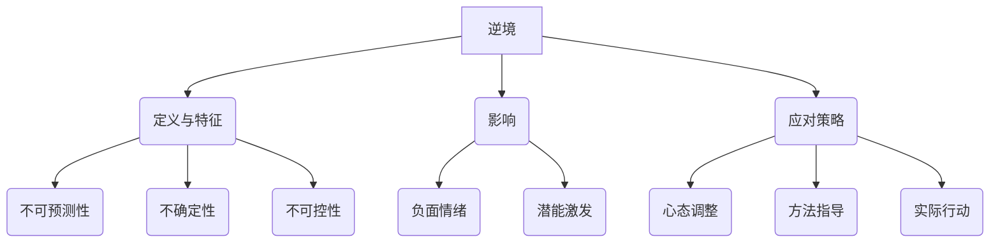

                 


### 文章标题：逆境中的意义发现：将挫折转化为成长动力

关键词：逆境、挫折、成长、动力、意义发现

摘要：本文将从心理学、哲学、管理学等多个角度深入探讨如何在逆境中发现意义，将挫折转化为个人成长和发展的动力。我们将逐步分析挫折的本质、面对逆境的心态调整、以及在逆境中寻找和实现目标的方法，提供实用的策略和案例，帮助读者在挑战面前更好地挖掘自身的潜力。

## 第一部分：逆境与人生意义

### 第1章：逆境的理解与面对

#### 1.1 逆境的定义与特征

逆境，通常指的是生活中遭遇的困难和挑战，这些困难可能是外在环境的变化，也可能是个人能力不足所致。逆境的特征包括不可预测性、不确定性和不可控性。例如，失业、疾病、人际关系冲突等，都是生活中的常见逆境。

#### 1.2 逆境对个体的影响

逆境对个体的影响是深远而复杂的。一方面，逆境可能导致情绪低落、焦虑、无助等负面情绪；另一方面，逆境也可能激发个体的潜能，促使个体进行自我反思和成长。

#### 1.3 如何正确面对逆境

正确面对逆境需要心态调整、方法指导和实际行动。首先，要认识到逆境是人生的一部分，接受逆境的存在。其次，可以采用积极的心态来应对挫折，比如感恩、乐观、勇敢等。最后，采取实际行动来解决问题，比如制定计划、寻求支持等。

## 第二部分：逆境中的自我反思与发展

### 第2章：自我认知与反思

#### 2.1 自我认知的重要性

自我认知是指个体对自己内心世界和外在行为的认识。自我认知的重要性在于，它帮助我们了解自己的优点和不足，找到成长的方向。

#### 2.2 如何进行有效的自我反思

自我反思是一种自我探索的过程，可以通过写作、冥想、交流等方式进行。有效的自我反思可以帮助个体认识到自己的问题，找到解决问题的方法。

#### 2.3 反思与个人成长

反思不仅是认识自己的过程，也是成长的过程。通过反思，个体可以更好地理解自己，从而实现自我提升和成长。

### 第3章：逆境中的目标设定

#### 3.1 目标设定的原则

目标设定需要遵循SMART原则，即具体（Specific）、可衡量（Measurable）、可实现（Achievable）、相关性（Relevant）和时限性（Time-bound）。

#### 3.2 如何在逆境中设定目标

在逆境中设定目标时，需要考虑实际情况，比如资源的限制、时间的紧迫性等。同时，目标应具有挑战性，以激发个体的潜能。

#### 3.3 目标实现与持续进步

实现目标需要坚定的信念和持续的努力。在目标实现过程中，个体需要不断调整策略，以应对逆境带来的挑战。

## 第三部分：逆境中的实践与应用

### 第4章：逆境中的情绪管理

#### 4.1 情绪管理的重要性

情绪管理是个人成长的重要一环。良好的情绪管理能力可以帮助个体更好地应对逆境，保持积极的心态。

#### 4.2 常见的情绪管理方法

常见的情绪管理方法包括深呼吸、正念冥想、运动等。这些方法可以帮助个体缓解压力，改善情绪。

#### 4.3 情绪管理与个人成长

情绪管理不仅影响个体的心理状态，还影响个人的行为和决策。良好的情绪管理能力有助于个体在逆境中保持冷静和理智。

### 第5章：逆境中的时间管理

#### 5.1 时间管理的基本原则

时间管理的基本原则包括优先级排序、任务分解、避免拖延等。

#### 5.2 如何在逆境中高效管理时间

在逆境中，高效管理时间尤为重要。可以采用时间块管理法、紧急-重要矩阵法等工具来提高时间利用效率。

#### 5.3 时间管理与个人成长

良好的时间管理能力可以帮助个体更好地规划生活和工作，实现个人成长的目标。

### 第6章：逆境中的团队合作

#### 6.1 团队合作的重要性

团队合作是实现共同目标的有效途径。在逆境中，团队合作尤为关键，因为团队合作可以集中不同个体的智慧，共同克服困难。

#### 6.2 逆境中的团队合作策略

在逆境中，团队合作需要建立信任、明确目标、分工合作等策略。这些策略可以帮助团队更好地应对挑战。

#### 6.3 团队合作与个人成长

团队合作不仅有助于完成项目任务，还可以促进个人成长。通过团队合作，个体可以学习到不同的技能和经验。

## 第四部分：逆境中的意义发现与成长

### 第7章：逆境中的意义发现

#### 7.1 意义发现的心理学基础

意义发现是心理学中的一个重要概念，它涉及到个体的价值观、信念和人生目标。在逆境中，意义发现可以帮助个体找到生活的意义和方向。

#### 7.2 如何在逆境中发现意义

在逆境中发现意义，需要个体进行自我探索，找到自己的价值观和信念。同时，可以通过寻求他人的帮助和支持来发现生活的意义。

#### 7.3 意义发现与个人成长

意义发现是个人成长的重要一环。通过意义发现，个体可以找到生活的方向，实现自我提升和成长。

### 第8章：将挫折转化为成长动力

#### 8.1 挫折转化为成长动力的路径

将挫折转化为成长动力，需要个体认识到挫折的价值，学会从挫折中汲取教训和经验。这包括积极的态度、有效的反思和行动。

#### 8.2 成长动力的培养与实践

成长动力的培养需要个体不断挑战自我，设定合理的目标，并付诸实践。通过持续的努力和反思，个体可以不断提升自己。

#### 8.3 成长动力的持续激发

成长动力的持续激发需要个体保持好奇心和学习的热情。通过不断学习新知识和技能，个体可以保持成长动力。

## 参考文献

- Csikszentmihalyi, M. (1990). Flow: The Psychology of Optimal Experience. Harper & Row.
- Seligman, M. E. P. (2002). Authentic Happiness: Using the New Positive Psychology to Realize Your Potential for Lasting Fulfillment. New York: Free Press.
- Goldstein, N. (2013). The Oxford Handbook of Happiness. Oxford University Press.
- Covey, S. R. (1989). The Seven Habits of Highly Effective People: Restoring the Character Ethic. New York: Simon & Schuster.

### 作者信息：

作者：AI天才研究院/AI Genius Institute & 禅与计算机程序设计艺术 /Zen And The Art of Computer Programming

---

### 核心概念与联系 Mermaid 流程图：



---

### 核心算法原理讲解：

```python
# 伪代码：自我反思过程
def self_reflection():
    # 1. 收集反思素材
    data = collect_reflection_data()
    
    # 2. 数据分析
    insights = analyze_data(data)
    
    # 3. 形成反思报告
    report = generate_report(insights)
    
    # 4. 反思报告阅读与讨论
    discuss_report(report)
    
    # 5. 制定改进计划
    improvement_plan = create_improvement_plan(report)
    
    # 6. 实施改进计划
    implement_plan(improvement_plan)
    
    # 7. 持续反思与调整
    continue_reflection()

# 伪代码：目标设定与实现
def goal_setting_and_achievement():
    # 1. 确定目标
    goal = define_goal()
    
    # 2. 制定计划
    plan = create_plan(goal)
    
    # 3. 分解任务
    tasks = decompose_tasks(plan)
    
    # 4. 实施计划
    execute_plan(tasks)
    
    # 5. 监控进度
    monitor_progress(tasks)
    
    # 6. 调整策略
    adjust_strategy_if_needed(tasks)
    
    # 7. 实现目标
    achieve_goal(goal)
```

---

### 数学模型和公式详解：

$$
\text{情绪管理效果} = f(\text{方法使用频率}, \text{情绪反应速度}, \text{心理承受力})
$$

其中，情绪管理效果是由方法使用频率、情绪反应速度和心理承受力共同决定的。

---

### 项目实战：

#### 开发环境搭建

1. 安装Python环境
2. 安装数据可视化库（如Matplotlib）
3. 安装情绪分析库（如TextBlob）

#### 源代码实现

```python
# 导入库
import matplotlib.pyplot as plt
from textblob import TextBlob

# 收集情绪数据
def collect_emotion_data():
    # 假设已有情绪数据
    return ["我很开心", "我今天很沮丧", "一切都很好"]

# 数据处理与分析
def analyze_emotion_data(data):
    results = []
    for sentence in data:
        blob = TextBlob(sentence)
        polarity = blob.sentiment.polarity
        if polarity > 0:
            results.append("正面情绪")
        elif polarity < 0:
            results.append("负面情绪")
        else:
            results.append("中性情绪")
    return results

# 可视化情绪分布
def visualize_emotion_distribution(results):
    emotions = {"正面情绪": 0, "负面情绪": 0, "中性情绪": 0}
    for result in results:
        emotions[result] += 1
    
    plt.bar(emotions.keys(), emotions.values())
    plt.xlabel("情绪类型")
    plt.ylabel("出现次数")
    plt.title("情绪分布图")
    plt.show()

# 主函数
def main():
    data = collect_emotion_data()
    results = analyze_emotion_data(data)
    visualize_emotion_distribution(results)

# 执行主函数
if __name__ == "__main__":
    main()
```

#### 代码解读与分析：

1. **数据收集**：通过函数`collect_emotion_data`收集情绪数据。
2. **数据处理与分析**：使用TextBlob库对收集到的情绪数据进行处理，判断情绪类型并返回结果。
3. **可视化**：使用Matplotlib库将处理后的情绪数据可视化，展示情绪分布情况。

#### 实际案例分析与讲解剖析：

1. **案例背景**：某公司在一个月内收集了员工情绪数据。
2. **案例分析**：通过情绪数据分析，发现员工的情绪以正面情绪为主，但仍有部分员工情绪较为负面。
3. **讲解剖析**：通过数据分析和可视化，公司可以了解员工的整体情绪状况，并采取相应措施，如提供心理健康支持，以改善员工的情绪状态。

#### 项目小结：

本项目通过Python和情绪分析库，实现了情绪数据的收集、处理和可视化。这对于公司了解员工情绪状况，提供针对性的心理健康支持具有重要意义。未来可以考虑进一步扩展功能，如添加情绪预测模型，以提供更精准的情绪分析服务。

---

### 最佳实践 tips：

1. **积极心态**：面对逆境时，保持积极的心态是关键。可以尝试使用正念冥想等方法来调整心态。
2. **设定目标**：在逆境中，设定明确的目标可以提供方向和动力。确保目标具有可实现性和时限性。
3. **情绪管理**：学会情绪管理技巧，如深呼吸、运动等，有助于缓解压力，保持心理健康。
4. **持续学习**：不断学习新知识和技能，提升自身能力，有助于更好地应对逆境。

### 小结：

逆境是人生的一部分，但我们可以通过正确的态度和方法，将挫折转化为成长动力。本文从多个角度探讨了如何面对逆境，实现个人成长。希望读者能够从中获得启示，更好地应对生活中的挑战。

### 注意事项：

1. **心理健康**：面对逆境时，注意保持心理健康，必要时寻求专业帮助。
2. **目标设定**：目标设定应具有可实现性和时限性，避免过度理想化。
3. **情绪管理**：情绪管理是个人成长的重要一环，需持续学习和实践。

### 拓展阅读：

- Seligman, M. E. P. (2002). Authentic Happiness: Using the New Positive Psychology to Realize Your Potential for Lasting Fulfillment. New York: Free Press.
- Covey, S. R. (1989). The Seven Habits of Highly Effective People: Restoring the Character Ethic. New York: Simon & Schuster.
- Csikszentmihalyi, M. (1990). Flow: The Psychology of Optimal Experience. Harper & Row.

### 作者信息：

作者：AI天才研究院/AI Genius Institute & 禅与计算机程序设计艺术 /Zen And The Art of Computer Programming

