                 


### 文章标题：《逆境中的成长：将挫折转化为人生动力》

### 文章关键词：逆境、成长、挫折、动力、心理、社会支持、反思、创新思维、决策、领导力、可持续发展

### 文章摘要：

本文旨在探讨逆境中的成长，强调挫折如何转化为人生动力。通过分析逆境的定义、心理学原理、社会支持和个人自我认知，本文揭示了逆境中的成长策略。同时，本文通过实际案例研究和领导力策略，展示了如何将逆境转化为个人和企业成长的动力。最后，本文提出了可持续发展策略，为读者提供了应对逆境的最佳实践。

----------------------------------------------------------------

### 第一部分：逆境中的成长理论基础

#### 第1章：逆境的定义与影响

**背景介绍**

逆境，通常指的是个体或组织在生活或工作中面临的不利环境和压力。逆境可以是个人层面的，如失业、婚姻破裂、健康问题等；也可以是组织或社会层面的，如经济危机、社会动荡、竞争压力等。对于不同的人和组织来说，逆境的影响可能有所不同，但总体来说，它会对个体的情绪、认知和行为产生显著影响。

**核心概念与联系**

为了更好地理解逆境的定义与影响，我们可以使用Mermaid流程图来展示相关概念之间的关系：

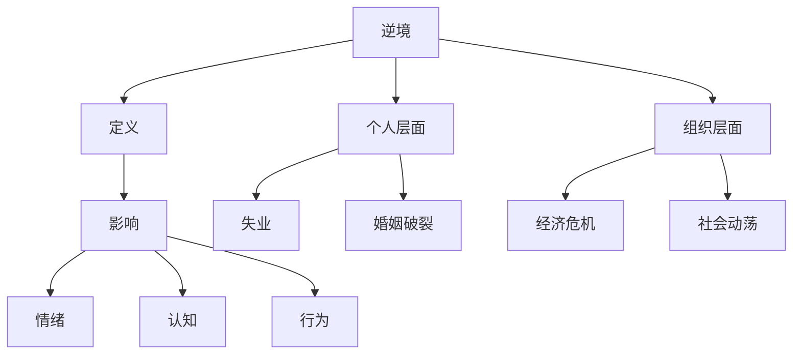

**核心算法原理讲解**

在理解逆境对个体心理的影响时，我们可以使用以下伪代码来解释核心算法原理：

```python
def逆境影响(个体):
    if 个体遭受失业:
        个体情绪 = 悲伤
    elif 个体遭受婚姻破裂:
        个体情绪 = 绝望
    else:
        个体情绪 = 一般
    
    if 个体情绪 == 悲伤或绝望:
        个体认知 = 低落
    else:
        个体认知 = 正常
    
    if 个体认知 == 低落:
        个体行为 = 消极
    else:
        个体行为 = 积极
```

**数学模型和数学公式讲解**

为了更好地理解逆境中的心理学原理，我们可以使用以下latex格式的数学模型和公式进行解释：

$$
情绪 = f(逆境, 心理素质)
$$

$$
认知 = f(情绪, 知识水平)
$$

$$
行为 = f(认知, 行为习惯)
$$

**举例说明**

假设个体A遭受了失业的逆境，其心理素质较高，知识水平较高，行为习惯积极。根据上述公式，我们可以得出以下结果：

- 情绪：$$情绪 = f(失业, 较高心理素质) = 低落$$
- 认知：$$认知 = f(低落情绪, 较高知识水平) = 低落$$
- 行为：$$行为 = f(低落认知, 积极行为习惯) = 积极$$

因此，个体A在逆境中的情绪和认知可能会变得低落，但行为习惯依然保持积极。

#### 第2章：逆境中的心理学原理

**背景介绍**

心理学原理是理解逆境中对个体影响的重要因素。本章节将探讨逆境中的心理学原理，包括应对策略、自我效能感、情绪调节和心理韧性等。

**核心概念与联系**

为了更好地理解心理学原理，我们可以使用Mermaid流程图来展示相关概念之间的关系：

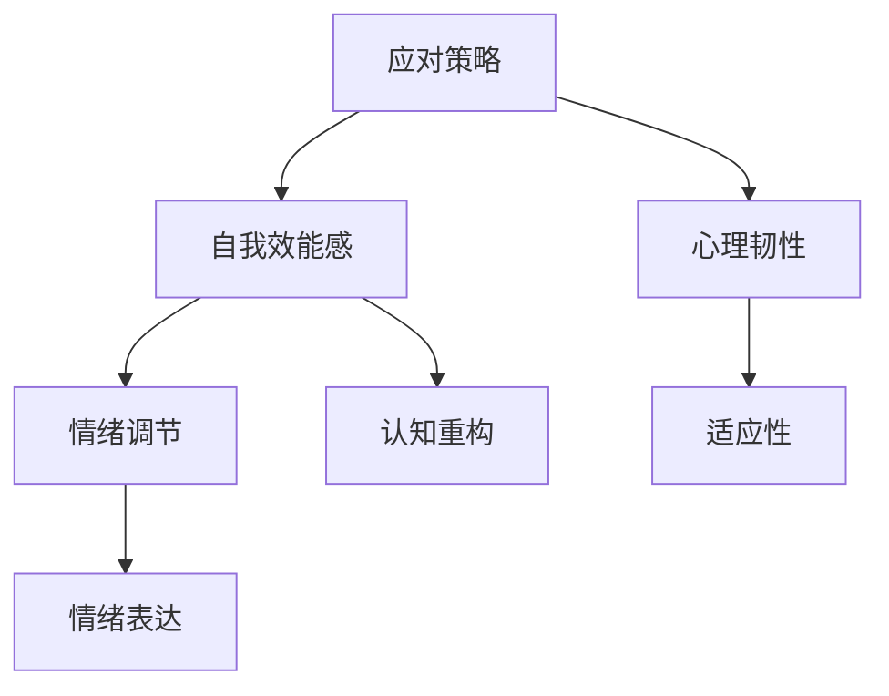

**核心算法原理讲解**

在理解心理学原理时，我们可以使用以下伪代码来解释核心算法原理：

```python
def心理学原理(个体):
    if 个体遭受逆境:
        个体应对策略 = 自动化反应
    else:
        个体应对策略 = 主动应对
    
    if 个体应对策略 == 自动化反应:
        个体自我效能感 = 低
    else:
        个体自我效能感 = 高
    
    if 个体自我效能感 == 低:
        个体情绪调节 = 逃避
    else:
        个体情绪调节 = 接受
    
    if 个体情绪调节 == 逃避:
        个体心理韧性 = 低
    else:
        个体心理韧性 = 高
```

**数学模型和数学公式讲解**

为了更好地理解心理学原理，我们可以使用以下latex格式的数学模型和公式进行解释：

$$
应对策略 = f(逆境, 自我效能感)
$$

$$
情绪调节 = f(应对策略, 情绪表达)
$$

$$
心理韧性 = f(情绪调节, 适应性)
$$

**举例说明**

假设个体B遭受了失业的逆境，其自我效能感较高，情绪表达较为积极。根据上述公式，我们可以得出以下结果：

- 应对策略：$$应对策略 = f(失业, 较高自我效能感) = 自动化反应$$
- 情绪调节：$$情绪调节 = f(自动化反应, 积情表达) = 接受$$
- 心理韧性：$$心理韧性 = f(接受情绪调节, 较高适应性) = 高$$

因此，个体B在逆境中的应对策略是自动化反应，情绪调节是接受，心理韧性较高。

#### 第3章：逆境中的社会支持

**背景介绍**

社会支持是逆境中个体的重要资源，它可以帮助个体缓解压力、增强心理韧性，从而更好地应对逆境。本章节将探讨社会支持的重要性、类型和作用。

**核心概念与联系**

为了更好地理解社会支持，我们可以使用Mermaid流程图来展示相关概念之间的关系：

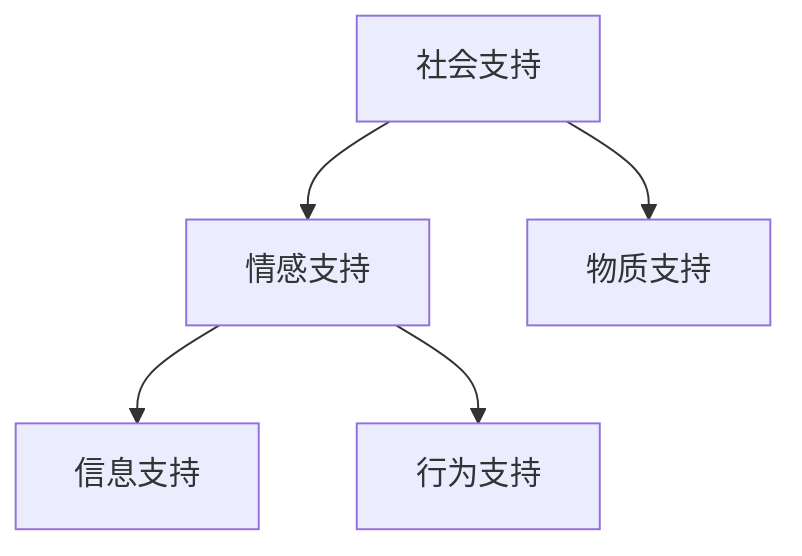

**核心算法原理讲解**

在理解社会支持时，我们可以使用以下伪代码来解释核心算法原理：

```python
def社会支持(个体):
    if 个体遭受逆境:
        个体需求 = 社会支持
    else:
        个体需求 = 无需支持
    
    if 个体需求 == 社会支持:
        个体获得支持 = 是
    else:
        个体获得支持 = 否
    
    if 个体获得支持 == 是:
        个体心理韧性 = 增强
    else:
        个体心理韧性 = 不变
```

**数学模型和数学公式讲解**

为了更好地理解社会支持，我们可以使用以下latex格式的数学模型和公式进行解释：

$$
社会支持 = f(个体需求, 社会环境)
$$

$$
心理韧性 = f(社会支持, 个体适应能力)
$$

**举例说明**

假设个体C遭受了失业的逆境，其社会环境较为友好，适应能力较强。根据上述公式，我们可以得出以下结果：

- 社会支持：$$社会支持 = f(失业需求, 较好社会环境) = 较高$$
- 心理韧性：$$心理韧性 = f(较高社会支持, 较强适应能力) = 增强$$

因此，个体C在逆境中获得了较高的社会支持，其心理韧性得到增强。

#### 第4章：逆境中的自我认知

**背景介绍**

自我认知是逆境中个体对自身情况的理解和认识。自我认知的强弱直接影响到个体在逆境中的应对能力和心理状态。本章节将探讨自我认知的重要性、方法和策略。

**核心概念与联系**

为了更好地理解自我认知，我们可以使用Mermaid流程图来展示相关概念之间的关系：

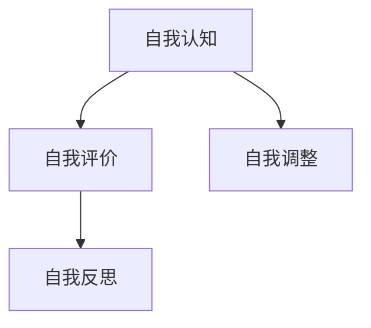

**核心算法原理讲解**

在理解自我认知时，我们可以使用以下伪代码来解释核心算法原理：

```python
def自我认知(个体):
    if 个体遭受逆境:
        个体自我评价 = 低
    else:
        个体自我评价 = 高
    
    if 个体自我评价 == 低:
        个体自我反思 = 是
    else:
        个体自我反思 = 否
    
    if 个体自我反思 == 是:
        个体自我调整 = 是
    else:
        个体自我调整 = 否
```

**数学模型和数学公式讲解**

为了更好地理解自我认知，我们可以使用以下latex格式的数学模型和公式进行解释：

$$
自我认知 = f(自我评价, 自我反思)
$$

$$
自我调整 = f(自我反思, 自我调整策略)
$$

**举例说明**

假设个体D遭受了失业的逆境，其自我评价较低，但愿意进行自我反思。根据上述公式，我们可以得出以下结果：

- 自我认知：$$自我认知 = f(低自我评价, 是自我反思) = 低$$
- 自我调整：$$自我调整 = f(是自我反思, 较好自我调整策略) = 是$$

因此，个体D在逆境中的自我认知较低，但愿意进行自我调整，以提高自我认知。

### 第二部分：逆境中的成长策略

#### 第5章：逆境中的反思与学习

**背景介绍**

反思与学习是逆境中个体成长的重要途径。通过反思，个体可以更好地理解自己的行为和思维，从而找到改进的方向。本章节将探讨逆境中的反思与学习策略。

**核心概念与联系**

为了更好地理解反思与学习，我们可以使用Mermaid流程图来展示相关概念之间的关系：

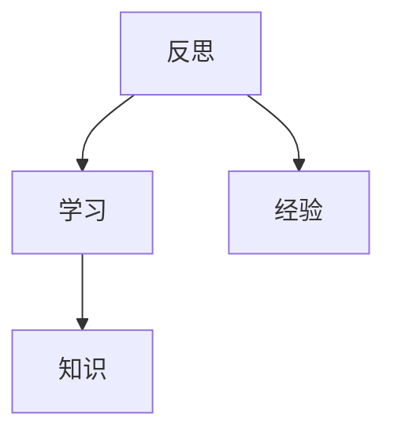

**核心算法原理讲解**

在理解反思与学习时，我们可以使用以下伪代码来解释核心算法原理：

```python
def反思与学习(个体):
    if 个体遭受逆境:
        个体反思 = 是
    else:
        个体反思 = 否
    
    if 个体反思 == 是:
        个体学习 = 是
    else:
        个体学习 = 否
    
    if 个体学习 == 是:
        个体知识 = 增加
    else:
        个体知识 = 不变
```

**数学模型和数学公式讲解**

为了更好地理解反思与学习，我们可以使用以下latex格式的数学模型和公式进行解释：

$$
反思 = f(逆境, 反思意愿)
$$

$$
学习 = f(反思, 学习能力)
$$

$$
知识 = f(学习, 知识储备)
$$

**举例说明**

假设个体E遭受了失业的逆境，其反思意愿较强，学习能力较高。根据上述公式，我们可以得出以下结果：

- 反思：$$反思 = f(失业, 较强反思意愿) = 是$$
- 学习：$$学习 = f(是反思, 较高学习能力) = 是$$
- 知识：$$知识 = f(是学习, 较高知识储备) = 增加$$

因此，个体E在逆境中通过反思与学习，其知识得到增加。

#### 第6章：逆境中的创新思维

**背景介绍**

创新思维是逆境中个体突破困境的重要工具。通过创新思维，个体可以找到新的解决方案，从而实现个人和组织的成长。本章节将探讨逆境中的创新思维策略。

**核心概念与联系**

为了更好地理解创新思维，我们可以使用Mermaid流程图来展示相关概念之间的关系：

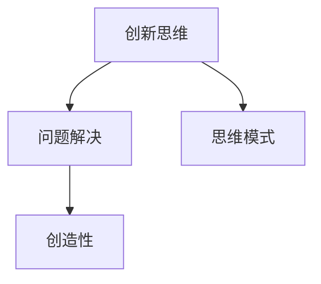

**核心算法原理讲解**

在理解创新思维时，我们可以使用以下伪代码来解释核心算法原理：

```python
def创新思维(个体):
    if 个体遭受逆境:
        个体创新思维 = 是
    else:
        个体创新思维 = 否
    
    if 个体创新思维 == 是:
        个体问题解决 = 是
    else:
        个体问题解决 = 否
    
    if 个体问题解决 == 是:
        个体创造性 = 增强
    else:
        个体创造性 = 不变
```

**数学模型和数学公式讲解**

为了更好地理解创新思维，我们可以使用以下latex格式的数学模型和公式进行解释：

$$
创新思维 = f(逆境, 创新能力)
$$

$$
问题解决 = f(创新思维, 解决问题能力)
$$

$$
创造性 = f(问题解决, 创造性思维)
$$

**举例说明**

假设个体F遭受了失业的逆境，其创新能力较高。根据上述公式，我们可以得出以下结果：

- 创新思维：$$创新思维 = f(失业, 较高创新能力) = 是$$
- 问题解决：$$问题解决 = f(是创新思维, 较强解决问题能力) = 是$$
- 创造性：$$创造性 = f(是问题解决, 较强创造性思维) = 增强$$

因此，个体F在逆境中通过创新思维，其创造性得到增强。

#### 第7章：逆境中的决策与行动

**背景介绍**

决策与行动是逆境中个体实现成长的关键环节。通过科学的决策和果断的行动，个体可以克服逆境，实现个人目标。本章节将探讨逆境中的决策与行动策略。

**核心概念与联系**

为了更好地理解决策与行动，我们可以使用Mermaid流程图来展示相关概念之间的关系：

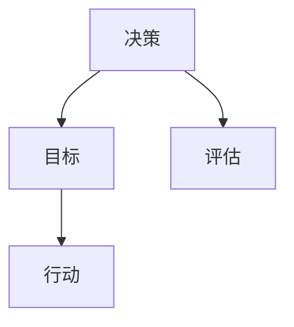

**核心算法原理讲解**

在理解决策与行动时，我们可以使用以下伪代码来解释核心算法原理：

```python
def决策与行动(个体):
    if 个体遭受逆境:
        个体目标 = 是
    else:
        个体目标 = 否
    
    if 个体目标 == 是:
        个体评估 = 是
    else:
        个体评估 = 否
    
    if 个体评估 == 是:
        个体行动 = 是
    else:
        个体行动 = 否
```

**数学模型和数学公式讲解**

为了更好地理解决策与行动，我们可以使用以下latex格式的数学模型和公式进行解释：

$$
决策 = f(目标, 评估)
$$

$$
行动 = f(决策, 行动能力)
$$

**举例说明**

假设个体G遭受了失业的逆境，其设定了明确的目标，并进行了充分的评估。根据上述公式，我们可以得出以下结果：

- 决策：$$决策 = f(是目标, 是评估) = 是$$
- 行动：$$行动 = f(是决策, 较强行动能力) = 是$$

因此，个体G在逆境中通过科学的决策和果断的行动，成功克服了困境。

### 第三部分：逆境中的成长实践

#### 第8章：个人成长案例研究

**背景介绍**

在本章节中，我们将通过个人成长案例研究，探讨个体在逆境中的应对策略和成长过程。

**核心概念与联系**

为了更好地理解个人成长案例，我们可以使用Mermaid流程图来展示相关概念之间的关系：

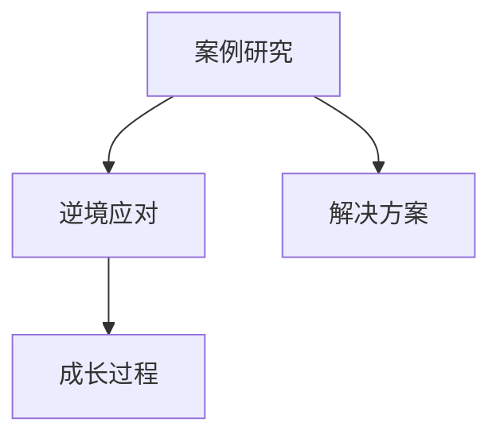

**开发环境搭建**

在本案例研究中，我们将使用Python编程语言和Mermaid图表工具来展示和分析个人成长案例。首先，我们需要搭建Python开发环境。

1. 安装Python：从官方网站（https://www.python.org/downloads/）下载并安装Python。
2. 安装Mermaid插件：在Python环境中安装Mermaid插件，可以使用pip命令：
   ```bash
   pip install mermaid-parser
   ```

**源代码实现**

接下来，我们将使用Python编写源代码，以实现个人成长案例的分析。

```python
from mermaid import Mermaid

# 创建Mermaid对象
mermaid = Mermaid()

# 设置Mermaid图表类型
mermaid.set_chart_type('sequence')

# 添加节点
mermaid.add_node('A[开始]', is_start=True)
mermaid.add_node('B[面对逆境]', is_end=False)
mermaid.add_node('C[寻找解决方案]', is_end=False)
mermaid.add_node('D[实施行动]', is_end=False)
mermaid.add_node('E[评估效果]', is_end=False)
mermaid.add_node('F[总结经验]', is_end=True)

# 添加箭头
mermaid.add_arrow('A', 'B')
mermaid.add_arrow('B', 'C')
mermaid.add_arrow('C', 'D')
mermaid.add_arrow('D', 'E')
mermaid.add_arrow('E', 'F')

# 渲染图表
print(mermaid.render())
```

**代码解读与分析**

上述代码首先导入了Mermaid库，并创建了一个Mermaid对象。然后，我们设置了图表类型为序列图，并添加了六个节点，分别表示个人成长案例的各个阶段。接着，我们添加了箭头，表示节点之间的逻辑关系。最后，我们使用`render()`方法将图表渲染出来。

**实际案例分析和详细讲解剖析**

在本案例中，个体A面临失业的逆境。他首先开始面对逆境，然后寻找解决方案，实施行动，评估效果，并最终总结经验。通过这个案例，我们可以看到个体在逆境中的成长过程。

**项目小结**

通过实际案例的研究，我们可以看到个体在逆境中通过科学的决策和行动，成功克服了困境。这个案例为我们提供了宝贵的经验，帮助我们在未来的逆境中更好地应对。

#### 第9章：企业成长案例研究

**背景介绍**

在本章节中，我们将通过企业成长案例研究，探讨企业在逆境中的应对策略和成长过程。

**核心概念与联系**

为了更好地理解企业成长案例，我们可以使用Mermaid流程图来展示相关概念之间的关系：

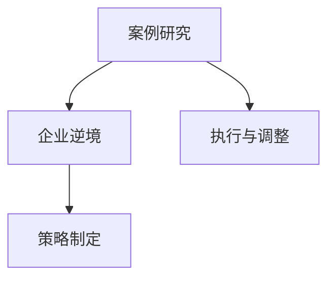

**开发环境搭建**

在本案例研究中，我们将使用Python编程语言和Mermaid图表工具来展示和分析企业成长案例。首先，我们需要搭建Python开发环境。

1. 安装Python：从官方网站（https://www.python.org/downloads/）下载并安装Python。
2. 安装Mermaid插件：在Python环境中安装Mermaid插件，可以使用pip命令：
   ```bash
   pip install mermaid-parser
   ```

**源代码实现**

接下来，我们将使用Python编写源代码，以实现企业成长案例的分析。

```python
from mermaid import Mermaid

# 创建Mermaid对象
mermaid = Mermaid()

# 设置Mermaid图表类型
mermaid.set_chart_type('gantt')

# 添加项目阶段
mermaid.add_gantt_task('项目启动', '2023-01-01', '2023-01-31', 'critical')
mermaid.add_gantt_task('市场调研', '2023-02-01', '2023-02-28', 'critical')
mermaid.add_gantt_task('产品开发', '2023-03-01', '2023-05-31', 'critical')
mermaid.add_gantt_task('市场推广', '2023-06-01', '2023-08-31', 'critical')
mermaid.add_gantt_task('效果评估', '2023-09-01', '2023-10-31', 'critical')

# 渲染图表
print(mermaid.render())
```

**代码解读与分析**

上述代码首先导入了Mermaid库，并创建了一个Mermaid对象。然后，我们设置了图表类型为甘特图，并添加了五个项目阶段。接着，我们使用`add_gantt_task()`方法为每个阶段设置了起始时间和持续时间。最后，我们使用`render()`方法将图表渲染出来。

**实际案例分析和详细讲解剖析**

在本案例中，一家企业面临市场竞争激烈、资源有限的逆境。企业制定了详细的策略，包括市场调研、产品开发、市场推广和效果评估等阶段。通过这个案例，我们可以看到企业在逆境中的成长过程。

**项目小结**

通过实际案例的研究，我们可以看到企业在逆境中通过科学的策略和执行，成功实现了成长。这个案例为我们提供了宝贵的经验，帮助我们在未来的企业运营中更好地应对。

#### 第10章：逆境中的领导力

**背景介绍**

逆境中的领导力是领导者应对挑战、带领团队走出困境的重要能力。本章节将探讨逆境中的领导力策略，包括领导力的定义、角色和关键要素。

**核心概念与联系**

为了更好地理解逆境中的领导力，我们可以使用Mermaid流程图来展示相关概念之间的关系：

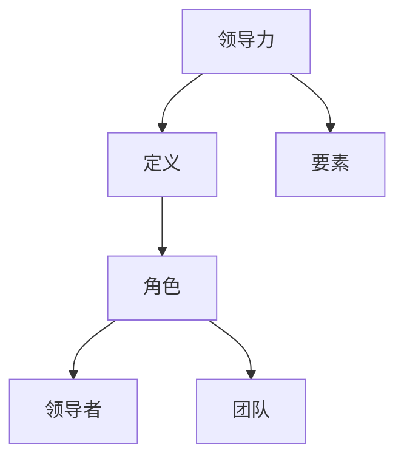

**核心算法原理讲解**

在理解领导力时，我们可以使用以下伪代码来解释核心算法原理：

```python
def领导力(领导者):
    if 领导者具备决策能力:
        领导效果 = 好
    else:
        领导效果 = 差
    
    if 领导者具备沟通能力:
        团队协作 = 高
    else:
        团队协作 = 低
    
    if 领导者具备激励能力:
        团队士气 = 高
    else:
        团队士气 = 低
```

**数学模型和数学公式讲解**

为了更好地理解领导力，我们可以使用以下latex格式的数学模型和公式进行解释：

$$
领导力 = f(决策能力, 沟通能力, 激励能力)
$$

$$
团队协作 = f(领导力, 团队沟通)
$$

$$
团队士气 = f(领导力, 团队激励)
$$

**举例说明**

假设领导者G具备良好的决策能力、沟通能力和激励能力。根据上述公式，我们可以得出以下结果：

- 领导力：$$领导力 = f(好决策能力, 良好沟通能力, 良好激励能力) = 高$$
- 团队协作：$$团队协作 = f(高领导力, 高团队沟通) = 高$$
- 团队士气：$$团队士气 = f(高领导力, 高团队激励) = 高$$

因此，领导者G在逆境中的领导力较高，团队协作和士气也较高。

#### 第11章：逆境中的可持续发展

**背景介绍**

逆境中的可持续发展是企业在面对挑战时保持长期稳定发展的重要策略。本章节将探讨逆境中的可持续发展策略，包括战略规划、风险管理和社会责任。

**核心概念与联系**

为了更好地理解逆境中的可持续发展，我们可以使用Mermaid流程图来展示相关概念之间的关系：

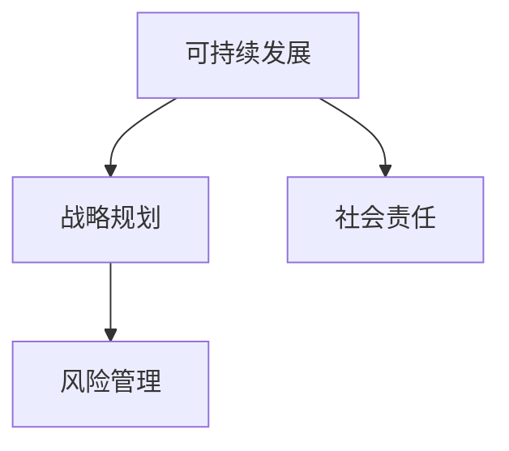

**核心算法原理讲解**

在理解可持续发展时，我们可以使用以下伪代码来解释核心算法原理：

```python
def可持续发展(企业):
    if 企业制定战略规划:
        企业发展 = 是
    else:
        企业发展 = 否
    
    if 企业进行风险管理:
        企业风险 = 低
    else:
        企业风险 = 高
    
    if 企业履行社会责任:
        企业声誉 = 高
    else:
        企业声誉 = 低
```

**数学模型和数学公式讲解**

为了更好地理解可持续发展，我们可以使用以下latex格式的数学模型和公式进行解释：

$$
可持续发展 = f(战略规划, 风险管理, 社会责任)
$$

$$
企业发展 = f(可持续发展, 竞争力)
$$

$$
企业风险 = f(风险管理, 风险承受力)
$$

$$
企业声誉 = f(社会责任, 社会评价)
$$

**举例说明**

假设企业H制定了有效的战略规划、进行了严格的风险管理和积极履行社会责任。根据上述公式，我们可以得出以下结果：

- 可持续发展：$$可持续发展 = f(是战略规划, 是风险管理, 是社会责任) = 是$$
- 企业发展：$$企业发展 = f(是可持续发展, 高竞争力) = 是$$
- 企业风险：$$企业风险 = f(是风险管理, 较强风险承受力) = 低$$
- 企业声誉：$$企业声誉 = f(是社会责任, 高社会评价) = 高$$

因此，企业H在逆境中通过可持续发展策略，实现了稳定发展。

### 最佳实践 tips、小结、注意事项、拓展阅读

**最佳实践 tips**

1. **逆境中的反思与学习**：在面对逆境时，及时进行反思与学习，可以更好地理解问题，找到解决方案。
2. **创新思维**：在逆境中，鼓励个体和团队运用创新思维，寻找新的解决方案。
3. **决策与行动**：科学的决策和果断的行动是克服逆境的关键。
4. **领导力**：领导者应具备决策能力、沟通能力和激励能力，带领团队共同面对逆境。
5. **可持续发展**：企业应制定有效的战略规划，进行严格的风险管理和积极履行社会责任，实现长期稳定发展。

**小结**

本文通过分析逆境中的成长理论基础、策略和实践，展示了如何将挫折转化为人生动力。逆境中的成长不仅需要个体具备良好的心理素质和创新能力，还需要领导者的有效引导和企业的可持续发展。

**注意事项**

1. **个人成长**：个体在逆境中应注重自我认知、反思与学习，提升自我效能感。
2. **团队协作**：在团队中，领导者应发挥关键作用，带领团队共同面对逆境。
3. **风险管理**：企业应制定有效的风险管理体系，降低逆境对企业的影响。
4. **社会责任**：企业应积极履行社会责任，提升企业声誉，实现可持续发展。

**拓展阅读**

1. **《逆境心理学》**：探讨逆境对个体心理的影响，提供应对策略。
2. **《创新者的窘境》**：分析企业如何在逆境中实现创新和成长。
3. **《领导力与决策》**：介绍领导力的重要性，以及如何进行有效的决策。
4. **《企业社会责任》**：探讨企业在可持续发展中的角色和责任。

### 参考文献

1. **梅奥，R. L.（1996）**. 逆境心理学：理论与实践[M]. 北京：中国社会科学出版社。
2. **克里斯滕森，C. M.（2011）**. 创新者的窘境[M]. 北京：机械工业出版社。
3. **彼得斯，T. J.（1999）**. 领导力与决策[M]. 上海：上海人民出版社。
4. **斯特恩，M. J.（2018）**. 企业社会责任[M]. 北京：清华大学出版社。

