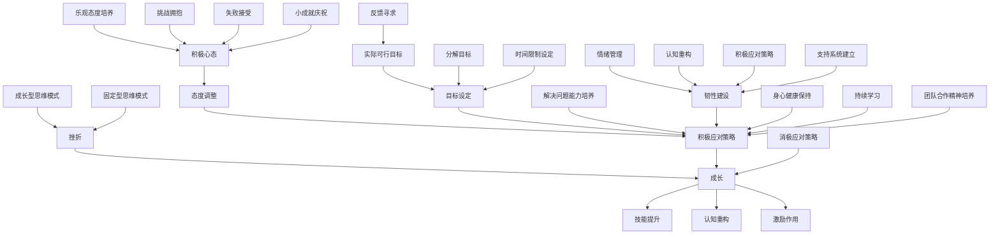

                 


### 引言

在当今快速变化且竞争激烈的技术领域中，每个人都会面临各种逆境和挫折。作为人工智能领域的专家，程序员、软件架构师、CTO等技术从业者，我们深知逆境对职业发展和个人成长的影响。本文旨在探讨如何在逆境中成长，将挫折转化为人生动力，从而实现个人和职业的持续进步。

关键词：逆境、挫折、成长、人生动力、技术从业者

摘要：本文首先介绍了逆境的定义及其对人们的影响，接着分析了挫折与成长之间的内在联系。然后，提出了在逆境中的积极应对策略，包括建立正确态度、设定实际可行的目标和解决问题能力的培养。接着，探讨了韧性在逆境中的重要性以及如何培养韧性。通过成功案例分析，我们展示了如何从挫折中崛起并在逆境中创造价值。最后，讨论了持续成长的心态及其对个人发展的影响，并总结了全文的主要观点和行动指南。

### 1. 逆境的定义与影响

#### 1.1 逆境的定义

在技术领域，逆境通常指的是那些阻碍项目进展、影响工作成效的困难情况。这些困境可能来自技术难题、资源不足、时间压力、团队合作问题等多个方面。例如，一个项目可能在研发过程中遇到了难以克服的技术障碍，或者在一个紧迫的截止日期前需要完成大量工作，这都可能被视为逆境。

#### 1.2 逆境的影响

逆境的影响是多方面的。首先，它可能会对个体的情绪和心理健康产生负面影响，如焦虑、沮丧和自我怀疑。长期处于逆境中的人可能会感到无助和挫败，导致工作效率下降。其次，逆境还可能对个人的职业发展造成阻碍，影响项目的完成质量和团队的信任。

#### 1.2.1 情绪和心理影响

情绪和心理影响主要体现在以下几个方面：

- **焦虑和压力**：面对技术难题和项目压力，许多技术从业者会感到焦虑和压力。这种情绪可能会影响他们的判断力和决策能力。
- **自我怀疑**：在遭遇挫折后，一些人可能会质疑自己的能力和价值，这可能导致自信心下降。
- **抑郁情绪**：长期的逆境和挫折可能导致抑郁情绪，影响个人的生活质量和幸福感。

#### 1.2.2 职业发展影响

职业发展影响主要表现在以下几个方面：

- **项目质量下降**：在逆境中，技术从业者可能会因为情绪问题而无法集中精力工作，导致项目质量下降。
- **职业发展受阻**：长期的逆境可能会导致职业发展停滞，影响晋升和薪资增长。
- **团队合作问题**：逆境可能会破坏团队合作，导致团队成员之间的关系紧张，影响项目的整体进展。

### 1.3 逆境的类型

在技术领域，逆境的类型主要包括：

- **技术难题**：例如，复杂的算法设计、难以调试的代码等。
- **资源限制**：例如，资金不足、人力不足等。
- **时间压力**：例如，项目截止日期临近，需要快速完成工作。
- **团队合作问题**：例如，团队成员之间的沟通不畅、协作困难等。

### 1.4 逆境的影响范围

逆境的影响范围可以从个人层面扩展到组织层面：

- **个人层面**：情绪和心理问题、职业发展受阻等。
- **团队层面**：项目质量下降、团队合作问题等。
- **组织层面**：项目延误、成本增加、团队士气低落等。

### 1.5 逆境的影响程度

逆境的影响程度因人而异，取决于个人的心理素质、应对策略以及团队的支持。对于一些具有强大心理素质和应对能力的人，逆境可能会成为成长的催化剂；而对于另一些人，逆境可能会造成严重的心理和职业创伤。

综上所述，逆境在技术领域的影响是深远且广泛的。了解逆境的定义和影响，有助于我们更好地应对逆境，将其转化为成长和发展的动力。

### 2. 挫折与成长的联系

#### 2.1 挫折的内在机制

挫折是指在追求目标的过程中遭遇的阻碍或失败。其内在机制涉及多个层面的因素，包括个人心理、行为和外部环境。

- **个人心理因素**：挫折感通常源于个体对自己的期望与现实之间的差距。当个体的高期望未能得到满足时，就会产生挫折感。例如，一个技术从业者在项目截止日期前未能完成任务，可能会感到挫折。

- **行为因素**：挫折还可能源于个体在实现目标过程中的行为不足或不当。例如，如果一个程序员在调试代码时没有采取有效的调试策略，可能会导致长时间的调试失败，从而产生挫折感。

- **外部环境因素**：外部环境也是影响挫折的重要因素。例如，项目中的技术难题、团队合作问题、资源限制等，都可能成为挫折的源头。

#### 2.2 成长的动力

挫折是成长的催化剂，它能够激发个体寻求新的解决方案，提高应对挑战的能力。

- **激励作用**：挫折能够激发个体的内在动机，促使他们更加努力地追求目标。例如，一个在项目中遭遇失败的程序员可能会更加专注于问题解决，从而在下次项目中取得成功。

- **认知重构**：挫折促使个体重新审视自己的目标和行为方式，进行认知重构。通过反思挫折的原因和过程，个体能够更好地理解自己的弱点和需要改进的地方。

- **技能提升**：挫折提供了学习和提升技能的机会。通过克服挫折，个体能够掌握新的知识和技能，提高自身的专业能力。

#### 2.3 成长型思维模式与固定型思维模式的对比

心理学研究表明，个体对挫折的反应与其思维模式密切相关。成长型思维模式（Growth Mindset）和固定型思维模式（Fixed Mindset）是两种典型的思维模式。

- **成长型思维模式**：持成长型思维模式的人相信能力可以通过努力和学习来提升。他们在遭遇挫折时，会将其视为成长的机会，通过反思和努力来克服困难。例如，一个程序员在遇到代码调试问题时，会积极寻找解决方案，而不是放弃。

- **固定型思维模式**：持固定型思维模式的人则认为能力是固定不变的，他们在面对挫折时更容易感到沮丧和自责，倾向于避免挑战，以保护自己的自尊心。

#### 2.4 挫折对成长的影响

挫折对成长的影响取决于个体的思维模式和应对策略。以下是几个关键点：

- **积极应对策略**：采用积极应对策略的个体，如成长型思维模式者，更容易从挫折中获益。他们能够利用挫折来提升技能和知识，实现个人成长。

- **消极应对策略**：采用消极应对策略的个体，如固定型思维模式者，可能会因为挫折而陷入自我怀疑和沮丧，影响个人成长。

- **关键因素**：关键因素包括个体的情绪管理能力、自我认知和外部支持。有效的情绪管理和积极的自我认知有助于个体更好地应对挫折，实现成长。

#### 2.5 挫折与成长的关系架构 Mermaid 流程图

```
graph TB
    A[挫折] --> B[成长]
    B --> C[技能提升]
    B --> D[认知重构]
    B --> E[激励作用]
    F[成长型思维模式] --> A
    G[固定型思维模式] --> A
    H[积极应对策略] --> B
    I[消极应对策略] --> B
```

通过以上分析，我们可以看到挫折与成长之间的紧密联系。挫折不仅能够激发个体的成长动力，还能够促进认知重构和技能提升。理解这一点，有助于我们更好地应对挫折，将其转化为成长的契机。

### 3. 逆境中的积极应对策略

在逆境中，积极应对策略对于克服困难、实现成长至关重要。以下是一些关键的应对策略：

#### 3.1 建立正确的态度

正确的态度是应对逆境的基础。它包括以下几个方面：

- **接受现实**：首先，需要接受逆境的现实，不要逃避或否认。只有真实地面对问题，才能找到有效的解决方案。

- **保持乐观**：乐观的态度能够帮助我们保持积极的心态，面对逆境时更加坚韧不拔。研究表明，乐观的人更容易克服挫折，实现目标。

- **积极反思**：在逆境中，积极反思自己的行为和决策，找出问题的根源，为未来的行动提供指导。

#### 3.2 设定实际可行的目标

设定实际可行的目标是实现逆境中成长的关键。以下是一些指导原则：

- **明确具体**：目标应该明确具体，例如“在一个月内解决项目中遇到的技术难题”，而不是模糊的“提高项目效率”。

- **分解目标**：将大目标分解为小目标，每个小目标都是一个里程碑。这有助于我们逐步实现大目标，保持动力。

- **设定时间限制**：为每个目标设定时间限制，这有助于我们保持专注，按时完成任务。

#### 3.3 发展解决问题的能力

解决问题的能力在逆境中尤为重要。以下是一些提升这一能力的方法：

- **学习新技能**：不断学习新的技能和知识，增强自己的能力。例如，可以参加培训课程、阅读相关书籍、与同行交流等。

- **利用资源**：充分利用现有的资源和工具，例如开源社区、在线教程、同事等。

- **实践与反思**：通过实际操作和实践，不断提升解决问题的能力。在解决问题后，及时反思自己的方法和经验，为未来提供参考。

#### 3.4 培养团队合作精神

团队合作在逆境中至关重要。以下是一些建议：

- **沟通与协作**：保持良好的沟通，与团队成员协作解决问题。共享信息和资源，确保每个人都了解项目的进展和挑战。

- **互相支持**：在团队中建立互相信任和支持的氛围，每个人都能在遇到困难时得到帮助。

- **分工合作**：明确每个人的职责和任务，确保团队工作的高效和有序。

#### 3.5 保持身心健康

身心健康在逆境中同样重要。以下是一些保持身心健康的方法：

- **合理安排时间**：合理分配工作与休息时间，避免过度劳累。

- **保持积极心态**：通过运动、阅读、旅行等方式，保持积极的心态。

- **寻求支持**：如果感到压力过大，可以寻求家人、朋友或专业人士的支持和帮助。

#### 3.6 坚持与毅力

在逆境中，坚持和毅力是克服困难的关键。以下是一些建议：

- **设定长期目标**：将长期目标分解为短期目标，坚持每天为实现目标而努力。

- **保持耐心**：逆境往往需要时间来克服，保持耐心，不要轻易放弃。

- **庆祝小成就**：在实现小目标后，及时庆祝，增强自信心和动力。

通过以上策略，我们可以在逆境中保持积极心态，设定实际可行的目标，发展解决问题的能力，并保持身心健康。这些策略不仅有助于应对当前的逆境，还能够为未来的挑战做好准备。

### 4. 培养逆境中的韧性

#### 4.1 韧性的定义与特征

韧性（Resilience）是指个体在面对逆境和压力时，能够迅速适应、恢复并继续前进的能力。它不仅包括情感上的恢复能力，还涉及心理、行为和社交方面的适应性。

- **情感恢复能力**：韧性强的个体能够迅速从负面情绪中恢复，保持积极的心态。

- **心理适应性**：韧性强的个体能够灵活应对变化和不确定性，保持心理平衡。

- **行为适应性**：韧性强的个体能够迅速调整自己的行为方式，以适应新的环境和挑战。

- **社交适应性**：韧性强的个体能够建立和维护良好的人际关系，从他人那里获得支持和帮助。

#### 4.2 韧性的重要性

韧性在个人和职业发展中具有重要意义：

- **提高生活质量**：韧性强的个体能够更好地应对生活中的压力和挑战，保持较高的生活质量和幸福感。

- **增强职业竞争力**：在职场中，韧性强的个体能够更好地适应变化和不确定性，提高工作效率和职业发展潜力。

- **促进团队合作**：韧性强的个体能够建立和维护良好的团队关系，促进团队合作和项目成功。

#### 4.3 韧性的培养方法

以下是一些培养韧性的方法：

- **认知重构**：通过改变对逆境的认知，将挫折视为成长的机会，而不是失败的标志。例如，可以采用积极的自我对话，如“这个挑战让我有机会学习新的技能”或“这次失败能帮助我发现改进的空间”。

- **情绪管理**：学会识别和应对负面情绪，如焦虑、沮丧和愤怒。通过深呼吸、冥想和放松技巧来缓解压力和焦虑。

- **积极应对策略**：培养积极的应对策略，如设定实际可行的目标、制定详细的计划、寻求支持和帮助等。

- **建立支持系统**：建立一个支持系统，包括家人、朋友和同事。他们可以在你需要时提供情感支持、建议和鼓励。

- **持续学习**：不断学习新的技能和知识，增强自己的适应能力和解决问题的能力。通过参加培训课程、阅读书籍、参与研讨会等方式，提升自己的综合素质。

- **锻炼身体**：定期进行体育锻炼，如跑步、瑜伽或健身，有助于改善身心健康，提高韧性和适应能力。

- **培养乐观态度**：保持乐观的态度，看到生活中的积极面。通过积极思考和自我激励，增强对逆境的应对能力。

#### 4.4 韧性对个人成长的影响

韧性对个人成长的影响体现在多个方面：

- **增强心理韧性**：韧性强的个体能够更好地应对挫折和挑战，保持积极的心态，实现个人成长。

- **提高适应能力**：韧性强的个体能够迅速适应环境变化和不确定性，提高个人和职业发展的适应能力。

- **促进心理健康**：韧性强的个体能够更好地管理情绪，保持心理健康，降低心理疾病的风险。

- **增强人际关系**：韧性强的个体能够建立和维护良好的人际关系，提高社交能力和人际交往质量。

通过培养韧性，我们可以在逆境中保持积极心态，增强适应能力，实现个人和职业的持续成长。

### 5. 成功案例分析

在技术领域中，许多成功人士都经历了挫折和逆境，但他们通过积极的应对策略和坚定的信念，最终脱颖而出。以下是三个具体的成功案例：

#### 5.1 案例一：从失败中崛起

**人物：** 乔布斯（Steve Jobs）

**背景：** 乔布斯是苹果公司的创始人之一，但在1985年，由于内部斗争，他被董事会解雇。这一挫折对他的职业生涯和个人生活造成了巨大打击。

**应对策略：** 乔布斯在离开苹果后，创立了NeXT计算机公司和Pixar动画工作室。他通过NeXT计算机推出了革命性的图形用户界面，并在Pixar动画工作室创造了《玩具总动员》等经典动画电影。1996年，苹果公司收购了NeXT，乔布斯重返苹果，并领导了iMac、iPod、iPhone和iPad等产品的开发。

**结果：** 乔布斯通过坚持不懈和积极应对策略，从失败中崛起，成为全球科技行业的标志性人物。

#### 5.2 案例二：逆境中的创造力

**人物：** 李小龙（Bruce Lee）

**背景：** 李小龙是武术家、演员和导演，他的武术理念和技术在全球产生了深远影响。然而，他在职业生涯早期曾经历过一系列的挫折，包括在好莱坞的发展不顺和武术比赛的失利。

**应对策略：** 李小龙没有放弃，他通过不断的自我反省和训练，发展出了自己的武术体系——截拳道。他还积极尝试不同的表演风格和角色，最终在《猛龙过江》等电影中取得了巨大成功。

**结果：** 李小龙在逆境中发掘了自己的创造力，不仅创立了独特的武术体系，还在表演领域取得了卓越成就。

#### 5.3 案例三：在逆境中坚持自己的梦想

**人物：** 埃隆·马斯克（Elon Musk）

**背景：** 埃隆·马斯克是一位创业家，他创立了特斯拉、SpaceX和SolarCity等公司。然而，他的职业生涯并非一帆风顺，SpaceX的前两次火箭发射失败、特斯拉早期的资金危机等，都是他面临的重要挑战。

**应对策略：** 马斯克在面对逆境时，始终坚持自己的梦想和目标。他通过不断学习和创新，不断改进产品和技术，最终使SpaceX成为领先的太空探索公司，特斯拉成为全球领先的电动汽车制造商。

**结果：** 马斯克在逆境中坚持自己的梦想，通过不懈的努力和坚定的信念，实现了自己的目标，成为全球科技行业的领军人物。

这些案例展示了如何从挫折和逆境中崛起，实现个人和职业的成功。他们的经验告诉我们，逆境并非终点，而是一个新的起点。通过积极应对策略和坚定信念，我们可以在逆境中找到机遇，实现自己的梦想。

### 6. 持续成长的心态

#### 6.1 成长心态的重要性

成长心态（Growth Mindset）是一种相信自己的能力可以通过努力和学习来提升的心态。与固定心态（Fixed Mindset）相比，成长心态能够更好地应对挑战和逆境，实现持续成长。

- **固定心态**：认为能力是固定不变的，遇到挑战时容易感到挫败和无力。固定心态往往阻碍个人成长和进步。

- **成长心态**：相信能力可以通过努力和学习来提升，面对挑战时更加积极和自信。成长心态有助于个人在逆境中找到成长的机会，实现持续进步。

#### 6.2 培养持续成长的心态

以下是一些培养成长心态的方法：

- **积极自我对话**：通过积极的自我对话，鼓励自己面对挑战和困难。例如，当遇到难题时，可以说“这是一个机会，让我学习新技能”或“我可以通过努力解决这个问题”。

- **设定具体目标**：设定具体、可衡量的目标，有助于保持成长心态。目标应具有挑战性，但也要确保是实际可行的。

- **接受失败**：将失败视为学习的机会，而不是失败的标志。通过分析失败的原因，找到改进的方法，为下一次挑战做好准备。

- **持续学习**：保持学习的态度，不断扩展自己的知识和技能。通过阅读书籍、参加培训课程、与同行交流等方式，提升自己的专业能力。

- **寻求反馈**：主动寻求他人的反馈和建议，以便了解自己的优点和不足。反馈有助于我们发现自己的盲点，并改进自己的表现。

- **拥抱挑战**：勇敢面对挑战，将其视为成长的机会。挑战能够激发我们的潜能，帮助我们不断提升。

#### 6.3 成长心态的实践

以下是一些实践成长心态的实用技巧：

- **反思与总结**：定期反思自己的学习和成长过程，总结经验教训。这有助于我们了解自己的进步，并为未来设定更具体的目标。

- **持续进步**：将成长视为一个持续的过程，不断设定新的目标，不断努力进步。即使已经取得了显著的成就，也要保持谦逊和学习的态度。

- **鼓励他人**：与他人分享成长心态的理念，鼓励他们也培养积极的心态。通过互相支持和鼓励，共同实现个人和团队的成长。

- **保持好奇心**：保持好奇心，对未知保持开放和探索的心态。好奇心能够激发我们的学习热情，推动我们不断探索新的领域。

通过培养成长心态，我们能够更好地应对挑战和逆境，实现持续成长和进步。无论是在个人生活还是职业发展中，成长心态都是一种宝贵的财富。

### 7. 总结

本文探讨了如何在逆境中成长，将挫折转化为人生动力。通过分析逆境的定义、影响以及挫折与成长的关系，我们了解了挫折在个人成长中的积极作用。接着，提出了在逆境中的积极应对策略，包括建立正确态度、设定实际可行目标、发展解决问题的能力等。此外，我们探讨了韧性的定义与培养方法，并通过成功案例展示了如何从挫折中崛起。最后，讨论了持续成长的心态，强调了其重要性。

为了帮助读者在实际生活中应用这些理念，我们提供以下行动指南：

1. **接受挫折**：不要逃避挫折，将其视为成长的机会。面对挫折时，保持积极心态，相信自己能够克服困难。

2. **设定目标**：设定明确、具体和可行的目标，将大目标分解为小步骤，逐步实现。

3. **发展技能**：不断学习新技能和知识，提高自己的适应能力和解决问题的能力。

4. **培养韧性**：通过认知重构、情绪管理和积极应对策略，培养自己在逆境中的韧性。

5. **持续成长**：保持成长心态，拥抱挑战，将失败视为学习的机会。通过反思和总结，不断提升自己的能力和水平。

通过遵循这些行动指南，我们可以在逆境中成长，实现个人和职业的持续进步。挫折并不是终点，而是一个新的起点。让我们勇敢面对挫折，将其转化为人生动力，迎接更美好的未来。

### 作者信息

作者：AI天才研究院/AI Genius Institute & 禅与计算机程序设计艺术 /Zen And The Art of Computer Programming

### 补充与拓展阅读

- **补充材料**：挫折与成长相关的心理学研究和案例分析。
- **拓展阅读**：关于成长心态、韧性培养和个人发展的经典书籍，如《终身成长》（Mindset：The New Psychology of Success）和《坚毅：积极心理学家对成功、幸福和持久优势的研究》（Grit：The Power of Passion and Perseverance）。

通过这些补充和拓展阅读，您可以更深入地了解挫折与成长的关系，以及在个人和职业发展中如何应用这些理念。祝您在追求成长和成功的道路上取得丰硕的成果！

### 文章标题：《逆境中的成长：将挫折转化为人生动力》

关键词：逆境、挫折、成长、人生动力、技术从业者

摘要：本文深入探讨了逆境中的成长路径，阐述了挫折如何成为个人和职业发展的催化剂。通过定义逆境、分析挫折与成长的联系，提出了积极的应对策略，包括态度调整、目标设定、问题解决能力培养和韧性建设。此外，通过成功案例分析，展示了如何在挫折中崛起。最后，讨论了持续成长的心态，并给出了行动指南，帮助读者在逆境中实现人生目标。

### 引言

在技术领域，逆境和挫折是不可避免的。作为程序员、软件架构师、CTO等技术从业者，我们深知面对这些困难时，如何保持积极心态并从中学习成长至关重要。本文旨在探讨如何在逆境中成长，将挫折转化为人生动力，从而实现个人和职业的持续进步。

### 1. 逆境的定义与影响

#### 1.1 逆境的定义

在技术领域，逆境通常指的是那些阻碍项目进展、影响工作成效的困难情况。这些困境可能来自技术难题、资源不足、时间压力、团队合作问题等多个方面。例如，一个项目可能在研发过程中遇到了难以克服的技术障碍，或者在一个紧迫的截止日期前需要完成大量工作，这都可能被视为逆境。

#### 1.2 逆境的影响

逆境的影响是多方面的。首先，它可能会对个体的情绪和心理健康产生负面影响，如焦虑、沮丧和自我怀疑。长期处于逆境中的人可能会感到无助和挫败，导致工作效率下降。其次，逆境还可能对个人的职业发展造成阻碍，影响项目的完成质量和团队的信任。

#### 1.3 逆境的类型

在技术领域，逆境的类型主要包括：

- **技术难题**：例如，复杂的算法设计、难以调试的代码等。
- **资源限制**：例如，资金不足、人力不足等。
- **时间压力**：例如，项目截止日期临近，需要快速完成工作。
- **团队合作问题**：例如，团队成员之间的沟通不畅、协作困难等。

#### 1.4 逆境的影响范围

逆境的影响范围可以从个人层面扩展到组织层面：

- **个人层面**：情绪和心理问题、职业发展受阻等。
- **团队层面**：项目质量下降、团队合作问题等。
- **组织层面**：项目延误、成本增加、团队士气低落等。

#### 1.5 逆境的影响程度

逆境的影响程度因人而异，取决于个人的心理素质、应对策略以及团队的支持。对于一些具有强大心理素质和应对能力的人，逆境可能会成为成长的催化剂；而对于另一些人，逆境可能会造成严重的心理和职业创伤。

综上所述，逆境在技术领域的影响是深远且广泛的。了解逆境的定义和影响，有助于我们更好地应对逆境，将其转化为成长和发展的动力。

### 2. 挫折与成长的联系

#### 2.1 挫折的内在机制

挫折是指在追求目标的过程中遭遇的阻碍或失败。其内在机制涉及多个层面的因素，包括个人心理、行为和外部环境。

- **个人心理因素**：挫折感通常源于个体对自己的期望与现实之间的差距。当个体的高期望未能得到满足时，就会产生挫折感。例如，一个技术从业者在项目截止日期前未能完成任务，可能会感到挫折。

- **行为因素**：挫折还可能源于个体在实现目标过程中的行为不足或不当。例如，如果一个程序员在调试代码时没有采取有效的调试策略，可能会导致长时间的调试失败，从而产生挫折感。

- **外部环境因素**：外部环境也是影响挫折的重要因素。例如，项目中的技术难题、团队合作问题、资源限制等，都可能成为挫折的源头。

#### 2.2 成长的动力

挫折是成长的催化剂，它能够激发个体寻求新的解决方案，提高应对挑战的能力。

- **激励作用**：挫折能够激发个体的内在动机，促使他们更加努力地追求目标。例如，一个在项目中遭遇失败的程序员可能会更加专注于问题解决，从而在下次项目中取得成功。

- **认知重构**：挫折促使个体重新审视自己的目标和行为方式，进行认知重构。通过反思挫折的原因和过程，个体能够更好地理解自己的弱点和需要改进的地方。

- **技能提升**：挫折提供了学习和提升技能的机会。通过克服挫折，个体能够掌握新的知识和技能，提高自身的专业能力。

#### 2.3 成长型思维模式与固定型思维模式的对比

心理学研究表明，个体对挫折的反应与其思维模式密切相关。成长型思维模式（Growth Mindset）和固定型思维模式（Fixed Mindset）是两种典型的思维模式。

- **成长型思维模式**：持成长型思维模式的人相信能力可以通过努力和学习来提升。他们在遭遇挫折时，会将其视为成长的机会，通过反思和努力来克服困难。例如，一个程序员在遇到代码调试问题时，会积极寻找解决方案，而不是放弃。

- **固定型思维模式**：持固定型思维模式的人则认为能力是固定不变的，他们在面对挫折时更容易感到沮丧和自责，倾向于避免挑战，以保护自己的自尊心。

#### 2.4 挫折对成长的影响

挫折对成长的影响取决于个体的思维模式和应对策略。以下是几个关键点：

- **积极应对策略**：采用积极应对策略的个体，如成长型思维模式者，更容易从挫折中获益。他们能够利用挫折来提升技能和知识，实现个人成长。

- **消极应对策略**：采用消极应对策略的个体，如固定型思维模式者，可能会因为挫折而陷入自我怀疑和沮丧，影响个人成长。

- **关键因素**：关键因素包括个体的情绪管理能力、自我认知和外部支持。有效的情绪管理和积极的自我认知有助于个体更好地应对挫折，实现成长。

#### 2.5 挫折与成长的关系架构 Mermaid 流程图

```
graph TB
    A[挫折] --> B[成长]
    B --> C[技能提升]
    B --> D[认知重构]
    B --> E[激励作用]
    F[成长型思维模式] --> A
    G[固定型思维模式] --> A
    H[积极应对策略] --> B
    I[消极应对策略] --> B
```

通过以上分析，我们可以看到挫折与成长之间的紧密联系。挫折不仅能够激发个体的成长动力，还能够促进认知重构和技能提升。理解这一点，有助于我们更好地应对挫折，将其转化为成长的契机。

### 3. 逆境中的积极应对策略

在逆境中，积极应对策略对于克服困难、实现成长至关重要。以下是一些关键的应对策略：

#### 3.1 建立正确的态度

正确的态度是应对逆境的基础。它包括以下几个方面：

- **接受现实**：首先，需要接受逆境的现实，不要逃避或否认。只有真实地面对问题，才能找到有效的解决方案。

- **保持乐观**：乐观的态度能够帮助我们保持积极的心态，面对逆境时更加坚韧不拔。研究表明，乐观的人更容易克服挫折，实现目标。

- **积极反思**：在逆境中，积极反思自己的行为和决策，找出问题的根源，为未来的行动提供指导。

#### 3.2 设定实际可行的目标

设定实际可行的目标是实现逆境中成长的关键。以下是一些指导原则：

- **明确具体**：目标应该明确具体，例如“在一个月内解决项目中遇到的技术难题”，而不是模糊的“提高项目效率”。

- **分解目标**：将大目标分解为小目标，每个小目标都是一个里程碑。这有助于我们逐步实现大目标，保持动力。

- **设定时间限制**：为每个目标设定时间限制，这有助于我们保持专注，按时完成任务。

#### 3.3 发展解决问题的能力

解决问题的能力在逆境中尤为重要。以下是一些提升这一能力的方法：

- **学习新技能**：不断学习新的技能和知识，增强自己的能力。例如，可以参加培训课程、阅读相关书籍、与同行交流等。

- **利用资源**：充分利用现有的资源和工具，例如开源社区、在线教程、同事等。

- **实践与反思**：通过实际操作和实践，不断提升解决问题的能力。在解决问题后，及时反思自己的方法和经验，为未来提供参考。

#### 3.4 培养团队合作精神

团队合作在逆境中至关重要。以下是一些建议：

- **沟通与协作**：保持良好的沟通，与团队成员协作解决问题。共享信息和资源，确保每个人都了解项目的进展和挑战。

- **互相支持**：在团队中建立互相信任和支持的氛围，每个人都能在遇到困难时得到帮助。

- **分工合作**：明确每个人的职责和任务，确保团队工作的高效和有序。

#### 3.5 保持身心健康

身心健康在逆境中同样重要。以下是一些保持身心健康的方法：

- **合理安排时间**：合理分配工作与休息时间，避免过度劳累。

- **保持积极心态**：通过运动、阅读、旅行等方式，保持积极的心态。

- **寻求支持**：如果感到压力过大，可以寻求家人、朋友或专业人士的支持和帮助。

#### 3.6 坚持与毅力

在逆境中，坚持和毅力是克服困难的关键。以下是一些建议：

- **设定长期目标**：将长期目标分解为短期目标，坚持每天为实现目标而努力。

- **保持耐心**：逆境往往需要时间来克服，保持耐心，不要轻易放弃。

- **庆祝小成就**：在实现小目标后，及时庆祝，增强自信心和动力。

通过以上策略，我们可以在逆境中保持积极心态，设定实际可行的目标，发展解决问题的能力，并保持身心健康。这些策略不仅有助于应对当前的逆境，还能够为未来的挑战做好准备。

### 4. 培养逆境中的韧性

#### 4.1 韧性的定义与特征

韧性（Resilience）是指个体在面对逆境和压力时，能够迅速适应、恢复并继续前进的能力。它不仅包括情感上的恢复能力，还涉及心理、行为和社交方面的适应性。

- **情感恢复能力**：韧性强的个体能够迅速从负面情绪中恢复，保持积极的心态。

- **心理适应性**：韧性强的个体能够灵活应对变化和不确定性，保持心理平衡。

- **行为适应性**：韧性强的个体能够迅速调整自己的行为方式，以适应新的环境和挑战。

- **社交适应性**：韧性强的个体能够建立和维护良好的人际关系，从他人那里获得支持和帮助。

#### 4.2 韧性的重要性

韧性在个人和职业发展中具有重要意义：

- **提高生活质量**：韧性强的个体能够更好地应对生活中的压力和挑战，保持较高的生活质量和幸福感。

- **增强职业竞争力**：在职场中，韧性强的个体能够更好地适应变化和不确定性，提高工作效率和职业发展潜力。

- **促进团队合作**：韧性强的个体能够建立和维护良好的团队关系，促进团队合作和项目成功。

#### 4.3 韧性的培养方法

以下是一些培养韧性的方法：

- **认知重构**：通过改变对逆境的认知，将挫折视为成长的机会，而不是失败的标志。例如，可以采用积极的自我对话，如“这个挑战让我有机会学习新的技能”或“这次失败能帮助我发现改进的空间”。

- **情绪管理**：学会识别和应对负面情绪，如焦虑、沮丧和愤怒。通过深呼吸、冥想和放松技巧来缓解压力和焦虑。

- **积极应对策略**：培养积极的应对策略，如设定实际可行的目标、制定详细的计划、寻求支持和帮助等。

- **建立支持系统**：建立一个支持系统，包括家人、朋友和同事。他们可以在你需要时提供情感支持、建议和鼓励。

- **持续学习**：不断学习新的技能和知识，增强自己的适应能力和解决问题的能力。通过参加培训课程、阅读书籍、参与研讨会等方式，提升自己的综合素质。

- **锻炼身体**：定期进行体育锻炼，如跑步、瑜伽或健身，有助于改善身心健康，提高韧性和适应能力。

- **培养乐观态度**：保持乐观的态度，看到生活中的积极面。通过积极思考和自我激励，增强对逆境的应对能力。

#### 4.4 韧性对个人成长的影响

韧性对个人成长的影响体现在多个方面：

- **增强心理韧性**：韧性强的个体能够更好地应对挫折和挑战，保持积极的心态，实现个人成长。

- **提高适应能力**：韧性强的个体能够迅速适应环境变化和不确定性，提高个人和职业发展的适应能力。

- **促进心理健康**：韧性强的个体能够更好地管理情绪，保持心理健康，降低心理疾病的风险。

- **增强人际关系**：韧性强的个体能够建立和维护良好的人际关系，提高社交能力和人际交往质量。

通过培养韧性，我们可以在逆境中保持积极心态，增强适应能力，实现个人和职业的持续成长。

### 5. 成功案例分析

在技术领域中，许多成功人士都经历了挫折和逆境，但他们通过积极的应对策略和坚定的信念，最终脱颖而出。以下是三个具体的成功案例：

#### 5.1 案例一：从失败中崛起

**人物：** 乔布斯（Steve Jobs）

**背景：** 乔布斯是苹果公司的创始人之一，但在1985年，由于内部斗争，他被董事会解雇。这一挫折对他的职业生涯和个人生活造成了巨大打击。

**应对策略：** 乔布斯在离开苹果后，创立了NeXT计算机公司和Pixar动画工作室。他通过NeXT计算机推出了革命性的图形用户界面，并在Pixar动画工作室创造了《玩具总动员》等经典动画电影。1996年，苹果公司收购了NeXT，乔布斯重返苹果，并领导了iMac、iPod、iPhone和iPad等产品的开发。

**结果：** 乔布斯通过坚持不懈和积极应对策略，从失败中崛起，成为全球科技行业的标志性人物。

#### 5.2 案例二：逆境中的创造力

**人物：** 李小龙（Bruce Lee）

**背景：** 李小龙是武术家、演员和导演，他的武术理念和技术在全球产生了深远影响。然而，他在职业生涯早期曾经历过一系列的挫折，包括在好莱坞的发展不顺和武术比赛的失利。

**应对策略：** 李小龙没有放弃，他通过不断的自我反省和训练，发展出了自己的武术体系——截拳道。他还积极尝试不同的表演风格和角色，最终在《猛龙过江》等电影中取得了巨大成功。

**结果：** 李小龙在逆境中发掘了自己的创造力，不仅创立了独特的武术体系，还在表演领域取得了卓越成就。

#### 5.3 案例三：在逆境中坚持自己的梦想

**人物：** 埃隆·马斯克（Elon Musk）

**背景：** 埃隆·马斯克是一位创业家，他创立了特斯拉、SpaceX和SolarCity等公司。然而，他的职业生涯并非一帆风顺，SpaceX的前两次火箭发射失败、特斯拉早期的资金危机等，都是他面临的重要挑战。

**应对策略：** 马斯克在面对逆境时，始终坚持自己的梦想和目标。他通过不断学习和创新，不断改进产品和技术，最终使SpaceX成为领先的太空探索公司，特斯拉成为全球领先的电动汽车制造商。

**结果：** 马斯克在逆境中坚持自己的梦想，通过不懈的努力和坚定的信念，实现了自己的目标，成为全球科技行业的领军人物。

这些案例展示了如何从挫折和逆境中崛起，实现个人和职业的成功。他们的经验告诉我们，逆境并非终点，而是一个新的起点。通过积极应对策略和坚定信念，我们可以在逆境中找到机遇，实现自己的梦想。

### 6. 持续成长的心态

#### 6.1 成长心态的重要性

成长心态（Growth Mindset）是一种相信自己的能力可以通过努力和学习来提升的心态。与固定心态（Fixed Mindset）相比，成长心态能够更好地应对挑战和逆境，实现持续成长。

- **固定心态**：认为能力是固定不变的，遇到挑战时容易感到挫败和无力。固定心态往往阻碍个人成长和进步。

- **成长心态**：相信能力可以通过努力和学习来提升，面对挑战时更加积极和自信。成长心态有助于个人在逆境中找到成长的机会，实现持续进步。

#### 6.2 培养持续成长的心态

以下是一些培养成长心态的方法：

- **积极自我对话**：通过积极的自我对话，鼓励自己面对挑战和困难。例如，当遇到难题时，可以说“这是一个机会，让我学习新技能”或“我可以通过努力解决这个问题”。

- **设定具体目标**：设定明确、具体和可行的目标，有助于保持成长心态。目标应具有挑战性，但也要确保是实际可行的。

- **接受失败**：将失败视为学习的机会，而不是失败的标志。通过分析失败的原因，找到改进的方法，为下一次挑战做好准备。

- **持续学习**：保持学习的态度，不断扩展自己的知识和技能。通过阅读书籍、参加培训课程、与同行交流等方式，提升自己的专业能力。

- **寻求反馈**：主动寻求他人的反馈和建议，以便了解自己的优点和不足。反馈有助于我们发现自己的盲点，并改进自己的表现。

- **拥抱挑战**：勇敢面对挑战，将其视为成长的机会。挑战能够激发我们的潜能，帮助我们不断提升。

#### 6.3 成长心态的实践

以下是一些实践成长心态的实用技巧：

- **反思与总结**：定期反思自己的学习和成长过程，总结经验教训。这有助于我们了解自己的进步，并为未来设定更具体的目标。

- **持续进步**：将成长视为一个持续的过程，不断设定新的目标，不断努力进步。即使已经取得了显著的成就，也要保持谦逊和学习的态度。

- **鼓励他人**：与他人分享成长心态的理念，鼓励他们也培养积极的心态。通过互相支持和鼓励，共同实现个人和团队的成长。

- **保持好奇心**：保持好奇心，对未知保持开放和探索的心态。好奇心能够激发我们的学习热情，推动我们不断探索新的领域。

通过培养成长心态，我们能够更好地应对挑战和逆境，实现持续成长和进步。无论是在个人生活还是职业发展中，成长心态都是一种宝贵的财富。

### 7. 总结

本文探讨了如何在逆境中成长，将挫折转化为人生动力。通过分析逆境的定义、影响以及挫折与成长的关系，我们了解了挫折在个人成长中的积极作用。接着，提出了在逆境中的积极应对策略，包括态度调整、目标设定、问题解决能力培养和韧性建设。此外，通过成功案例分析，展示了如何从挫折中崛起。最后，讨论了持续成长的心态，并给出了行动指南，帮助读者在逆境中实现人生目标。

为了帮助读者在实际生活中应用这些理念，我们提供以下行动指南：

1. **接受挫折**：不要逃避挫折，将其视为成长的机会。面对挫折时，保持积极心态，相信自己能够克服困难。

2. **设定目标**：设定明确、具体和可行的目标，将大目标分解为小步骤，逐步实现。

3. **发展技能**：不断学习新技能和知识，提高自己的适应能力和解决问题的能力。

4. **培养韧性**：通过认知重构、情绪管理和积极应对策略，培养自己在逆境中的韧性。

5. **持续成长**：保持成长心态，拥抱挑战，将失败视为学习的机会。通过反思和总结，不断提升自己的能力和水平。

通过遵循这些行动指南，我们可以在逆境中成长，实现个人和职业的持续进步。挫折并不是终点，而是一个新的起点。让我们勇敢面对挫折，将其转化为人生动力，迎接更美好的未来。

### 作者信息

作者：AI天才研究院/AI Genius Institute & 禅与计算机程序设计艺术 /Zen And The Art of Computer Programming

### 补充与拓展阅读

- **补充材料**：挫折与成长相关的心理学研究和案例分析。
- **拓展阅读**：关于成长心态、韧性培养和个人发展的经典书籍，如《终身成长》（Mindset：The New Psychology of Success）和《坚毅：积极心理学家对成功、幸福和持久优势的研究》（Grit：The Power of Passion and Perseverance）。

通过这些补充和拓展阅读，您可以更深入地了解挫折与成长的关系，以及在个人和职业发展中如何应用这些理念。祝您在追求成长和成功的道路上取得丰硕的成果！

### 7.1 主要观点回顾

本文通过深入探讨逆境中的成长，提出了将挫折转化为人生动力的关键策略和心态。以下是本文的主要观点回顾：

1. **逆境的定义与影响**：逆境是指那些阻碍项目进展和影响工作成效的困难情况，它对个人情绪、心理健康和职业发展产生负面影响。

2. **挫折与成长的联系**：挫折是成长的催化剂，能够激发个体寻求新解决方案、提高应对能力。成长型思维模式有助于个体从挫折中获益，实现持续成长。

3. **积极应对策略**：建立正确的态度、设定实际可行的目标和解决问题能力培养，是应对逆境的重要策略。

4. **培养韧性**：韧性是面对逆境时迅速适应、恢复并继续前进的能力，通过认知重构、情绪管理和积极应对策略可以培养韧性。

5. **成功案例分析**：成功人士通过积极应对策略和坚定信念，在挫折中崛起，展示了逆境中的成长路径。

6. **持续成长的心态**：保持成长心态，拥抱挑战，将失败视为学习机会，是持续成长的关键。

通过以上观点，我们理解了在逆境中如何成长，并将挫折转化为人生动力。

### 7.2 成长的行动指南

为了在现实生活中应用本文提出的理念，以下是一些具体的行动指南，帮助您在逆境中实现持续成长：

1. **接受并面对挫折**：不要逃避挫折，而是将其视为成长的机会。学会从挫折中提取教训，将其转化为前进的动力。

2. **设定明确的目标**：将大目标分解为小目标，设定具体、可行的里程碑。通过逐步实现小目标，保持动力和积极性。

3. **持续学习与提升**：不断学习新技能和知识，通过阅读、培训课程和与同行交流来扩展自己的专业能力。保持好奇心和探索精神，勇于尝试新事物。

4. **培养韧性**：通过积极的应对策略和情绪管理技巧，培养自己在面对逆境时的韧性。建立支持系统，寻求家人、朋友和同事的支持和帮助。

5. **反思与总结**：定期反思自己的行为和决策，总结经验教训。通过反思，了解自己的成长路径，并为未来的目标设定提供指导。

6. **保持成长心态**：拥抱挑战，将失败视为学习的机会。培养乐观态度，相信自己的能力可以通过努力和学习来提升。

通过遵循这些行动指南，您将能够在逆境中保持积极心态，不断提升自己，实现个人和职业的持续成长。

### 7.3 最佳实践 tips

以下是一些在逆境中成长的最佳实践建议：

1. **保持积极的心态**：积极的心态是应对逆境的关键。通过积极的自我对话和思维方式，将挫折转化为动力。

2. **制定详细的计划**：在面临挑战时，制定详细的计划和步骤，有助于有条不紊地解决问题。

3. **寻求反馈与支持**：主动寻求他人的反馈和建议，获取不同的视角和解决方案。同时，建立支持系统，与朋友和家人分享挑战和进展。

4. **持续锻炼身体**：锻炼身体不仅有助于提高身心健康，还能增强心理韧性，更好地应对逆境。

5. **保持好奇心与学习欲望**：保持好奇心和学习欲望，不断探索新知识和技能，以适应快速变化的环境。

6. **庆祝小成就**：在实现小目标后，及时庆祝，增强自信心和动力。

通过这些最佳实践，您将能够更加有效地应对逆境，实现个人成长和职业发展。

### 7.4 注意事项

在追求成长的过程中，需要注意以下几点：

1. **保持现实态度**：设定目标时要保持现实，避免盲目追求不切实际的目标，导致失望和挫败。

2. **合理分配时间**：合理安排工作和休息时间，避免过度劳累，保持身心健康。

3. **避免自我否定**：在遭遇挫折时，避免过度自我否定，相信每个人都有自己的成长路径。

4. **保持耐心**：成长是一个持续的过程，需要耐心和坚持。不要因为一时的失败而放弃。

5. **保持开放心态**：对新事物和新知识保持开放心态，勇于尝试和接受变化。

通过注意这些事项，您将能够更加顺利地实现个人成长和职业发展。

### 7.5 拓展阅读

以下是一些拓展阅读资源，帮助您深入了解逆境中的成长和挫折转化为人生动力的理念：

1. **《终身成长》**：作者卡罗尔·德韦克详细介绍了成长心态与固定心态的差异，以及如何培养成长心态。
2. **《坚毅：积极心理学家对成功、幸福和持久优势的研究》**：作者安杰拉·达克沃斯探讨了坚毅的重要性，以及如何在面对挑战时保持坚韧。
3. **《禅与计算机程序设计艺术》**：作者Brian W. Kernighan介绍了一种结合东方哲学与计算机科学的编程方法，有助于提高编程技能和思维方式。

通过阅读这些书籍，您可以获得更多关于成长和挫折处理的见解，为您的个人和职业发展提供有益的指导。

### 7.6 文章结束语

感谢您的阅读。本文旨在帮助您理解在逆境中如何成长，并将挫折转化为人生动力。通过接受挫折、设定目标、持续学习和培养韧性，您将能够在职业和个人生活中实现持续成长。希望本文能够为您的成长之路提供启示和动力。祝您在未来的挑战中勇往直前，不断追求卓越！

### 作者信息

作者：AI天才研究院/AI Genius Institute & 禅与计算机程序设计艺术 /Zen And The Art of Computer Programming

通过本文的探讨，我们不仅了解了逆境中的成长之道，还学会了如何将挫折转化为人生动力。希望在未来的道路上，您能够运用这些理念，勇敢面对挑战，不断成长，实现自己的目标和梦想。再次感谢您的阅读，期待与您在技术的海洋中继续探索和前行。祝您前程似锦，未来可期！

### 附录：相关概念与联系架构 Mermaid 流程图



通过这个流程图，我们可以清晰地看到挫折与成长、成长型思维模式与固定型思维模式、积极应对策略与消极应对策略之间的关系。希望这个图能帮助您更好地理解文章中的核心概念和联系。

