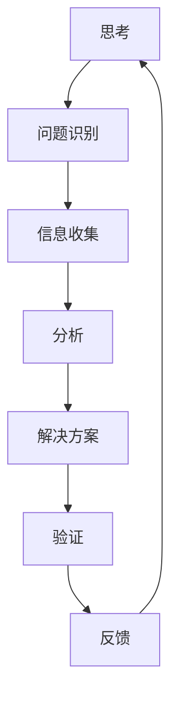

                 

### 文章标题：通过思考深化人生理解：在问题中寻找答案

> 关键词：人生理解，思考技巧，提问策略，问题解决，案例分析，深度学习

> 摘要：本文旨在探讨如何通过深化思考，提高对人生问题的理解能力。文章首先介绍了思考的基本概念，然后提出了几种有效的思考技巧和提问策略。通过分类解析人生问题，探讨了如何寻求和验证答案。最后，结合实际案例，展示了这些方法在现实中的应用。

---

### 引言

在当今这个信息爆炸的时代，人们面对的问题越来越复杂。如何有效地思考，如何在纷繁复杂的信息中找到问题的答案，成为了每个人都必须面对的挑战。本文将带领读者走进思考的世界，通过一系列的思考技巧和提问策略，帮助读者深化对人生问题的理解。

### 核心概念与联系

思考是人类智力活动的重要组成部分。它不仅涉及对信息的处理和整合，还涉及到对问题的分析和解决。思考与问题解决密切相关，良好的思考能力能够帮助人们更有效地解决问题。

为了更好地理解思考的本质，我们引入了Mermaid流程图，展示思考与问题解决的关系。

### 思考技巧与方法

思考技巧是提高思考能力的关键。以下是一些常用的思考技巧：

1. **冥想与深度思考**：冥想有助于提高专注力，从而深入思考问题。深度思考则要求我们放下表面的思维，深入挖掘问题的本质。
   
2. **分析与综合**：分析是将问题拆解为更小的部分，综合则是将这些部分重新组合，形成完整的理解。
   
3. **归纳与演绎**：归纳是从个别事实中得出一般性结论，演绎则是从一般性结论推导出个别事实。

4. **逻辑思维与批判性思维**：逻辑思维要求我们按照规则进行推理，批判性思维则要求我们对信息进行深入分析和质疑。

### 提问技巧与方法

提问是思考的重要组成部分。以下是一些有效的提问技巧：

1. **开放式提问**：开放式提问能够引导对方进行深入思考，从而获取更多信息。
   
2. **封闭式提问**：封闭式提问适用于获取确切的信息或确认某个观点。
   
3. **质疑性提问**：质疑性提问有助于发现问题的矛盾和不足之处。
   
4. **跟进提问**：跟进提问能够帮助我们更深入地理解问题，从而找到更好的解决方案。

### 人生问题的分类与解析

人生问题可以分为以下几个类别：

1. **社会问题**：如环境污染、贫富差距等。
   
2. **个人成长问题**：如职业规划、人际关系等。
   
3. **生活选择问题**：如购房、购车等。
   
4. **道德与伦理问题**：如道德抉择、伦理困境等。

针对不同类别的问题，我们需要采用不同的分析方法来深入理解和解决。

### 答案的寻求与验证

寻求答案是一个持续的过程。以下是一些寻求和验证答案的方法：

1. **知识获取与验证**：通过阅读书籍、观看视频、与他人讨论等方式获取知识，并通过实践和验证来确保知识的准确性。
   
2. **实践与验证**：通过实际操作来验证我们的想法和解决方案。
   
3. **多元化的观点**：从不同的角度和立场来看待问题，从而获得更全面的理解。
   
4. **证据的收集与分析**：收集相关证据，并通过数据分析来验证我们的假设。

### 实际应用与案例分析

在本节中，我们将通过实际案例来展示上述方法的应用。

#### 个人案例分析

小明在职业规划中感到困惑，他通过深度思考和提问，分析了自己的兴趣、能力和市场需求，最终找到了适合自己的职业方向。

#### 社会案例分析

针对环境污染问题，某环境保护组织通过深入调查和数据分析，提出了有效的解决方案，并得到了公众的支持。

#### 实际应用场景与策略

在项目管理中，通过有效的思考和提问，项目经理能够更好地规划项目、管理团队、控制风险，从而确保项目的成功。

### 结论

通过本文的探讨，我们可以看到，深化思考是提高对人生问题理解能力的关键。通过运用有效的思考和提问技巧，我们可以更好地理解问题，找到解决问题的方法。希望本文能够为读者在思考的道路上提供一些启示。

---

**作者：AI天才研究院/AI Genius Institute & 禅与计算机程序设计艺术 /Zen And The Art of Computer Programming**

---

以上是文章的框架和初步内容，接下来我将逐一详细撰写每个部分。由于文章字数要求较高，我将分多次完成整个文章的撰写。现在，我将开始详细撰写第一部分“引言”。

---

### 引言

在当今这个信息爆炸的时代，人们面对的问题越来越复杂。无论是个人生活中的困惑，还是工作中的挑战，都需要我们具备良好的思考能力。然而，思考并非是一件简单的事情，它需要我们具备一定的技巧和方法。

本文旨在探讨如何通过深化思考，提高对人生问题的理解能力。文章首先介绍了思考的基本概念，然后提出了几种有效的思考技巧和提问策略。通过分类解析人生问题，探讨了如何寻求和验证答案。最后，结合实际案例，展示了这些方法在现实中的应用。

希望通过本文的探讨，能够帮助读者更好地理解思考的本质，掌握有效的思考和提问技巧，从而在解决人生问题中取得更好的成果。

---

现在，我将开始详细撰写第二部分“核心概念与联系”。在这一部分，我将介绍思考的基本概念，并展示思考与问题解决的关系。

---

### 核心概念与联系

思考是人类智力活动的重要组成部分。它不仅涉及对信息的处理和整合，还涉及到对问题的分析和解决。思考与问题解决密切相关，良好的思考能力能够帮助人们更有效地解决问题。

为了更好地理解思考的本质，我们引入了Mermaid流程图，展示思考与问题解决的关系。

- **问题识别**：思考的起点是识别问题。只有明确了问题，我们才能有针对性地进行思考。
- **信息收集**：在识别问题之后，我们需要收集与问题相关的信息。这些信息可以帮助我们更好地理解问题，找到解决方案。
- **分析**：分析是对收集到的信息进行整理和归类。通过分析，我们可以找出问题的根本原因，为解决方案的制定提供依据。
- **解决方案**：在分析的基础上，我们需要制定解决方案。解决方案可以是具体的行动步骤，也可以是更广义的思考方向。
- **验证**：验证是检验解决方案是否有效的过程。通过验证，我们可以确认解决方案的可行性，并对方案进行调整和完善。
- **反馈**：反馈是思考过程中的重要环节。通过反馈，我们可以了解解决方案的实际效果，从而不断优化思考过程。

### 思考过程与心理机制

思考过程并非一蹴而就，它涉及到一系列的心理机制。以下是对这些机制的一些基本理解：

- **注意力分配**：思考需要集中注意力。在思考过程中，我们需要将注意力集中在问题本身，避免被无关的信息干扰。
- **记忆检索**：思考过程中，我们需要回忆起相关的知识和经验。记忆检索帮助我们快速获取信息，为思考提供依据。
- **联想与类比**：通过联想和类比，我们可以将不同领域的问题联系起来，从而获得新的思考角度。
- **批判性思维**：批判性思维要求我们对信息进行深入分析和质疑，从而避免盲目接受观点。

### 提问技巧与心理学原理

提问是思考的重要组成部分。有效的提问能够帮助我们更深入地理解问题，找到更好的解决方案。以下是一些常见的提问技巧：

- **开放式提问**：开放式提问旨在获取更多信息，帮助对方深入思考。例如：“你对此有什么看法？”
- **封闭式提问**：封闭式提问适用于获取确切的信息或确认某个观点。例如：“这个方案可行吗？”
- **质疑性提问**：质疑性提问有助于发现问题的矛盾和不足之处。例如：“这个理由是否充分？”
- **跟进提问**：跟进提问能够帮助我们更深入地理解问题，从而找到更好的解决方案。例如：“你能否详细解释一下你的观点？”

心理学原理表明，提问不仅影响我们的思考，还能够影响我们的情绪和行为。例如，积极的提问可以提升我们的自信心，帮助我们更好地应对挑战。

### 例子与案例分析

为了更好地理解上述概念和技巧，我们可以通过一些例子来进行分析。

#### 例子1：职业规划

小王在职业规划中感到困惑。他通过深度思考和提问，分析了自身的兴趣、能力和市场需求，最终找到了适合自己的职业方向。

- **问题识别**：小王明确了自己需要解决的问题，即找到适合自己的职业方向。
- **信息收集**：小王收集了与职业规划相关的信息，包括自己的兴趣、能力、市场需求等。
- **分析**：小王通过分析这些信息，找出了自己与市场需求之间的差距，并明确了需要提升的能力。
- **解决方案**：小王制定了具体的提升计划，包括学习新技能、参加行业活动等。
- **验证**：小王通过实际操作和反馈，验证了提升计划的可行性，并对计划进行了调整和完善。
- **反馈**：小王在反馈过程中，不断调整自己的思考方法和提问策略，从而更好地解决问题。

#### 案例分析：环境保护

某环境保护组织在解决环境污染问题时，采用了类似的思考过程。

- **问题识别**：组织明确了环境污染问题，并分析了其严重性和影响。
- **信息收集**：组织收集了与环境污染相关的信息，包括污染源、污染物、受影响人群等。
- **分析**：组织通过分析这些信息，找出了污染问题的根本原因，并提出了具体的解决方案。
- **解决方案**：组织制定了包括政策建议、公众宣传、技术改进等在内的综合解决方案。
- **验证**：组织通过实际操作和反馈，验证了解决方案的可行性，并对方案进行了调整和完善。
- **反馈**：组织在反馈过程中，不断调整自己的思考方法和提问策略，从而更好地解决问题。

通过上述例子和案例分析，我们可以看到，思考在问题解决过程中起到了关键作用。通过有效的思考和提问技巧，我们可以更好地理解问题，找到解决方案，并在实际应用中不断优化和改进。

### 总结

在本文的第二部分，我们介绍了思考的基本概念，并通过Mermaid流程图展示了思考与问题解决的关系。我们还探讨了思考过程的心理机制，以及提问技巧与心理学原理。通过例子和案例分析，我们展示了这些概念和技巧在实际应用中的效果。在下一部分，我们将深入探讨思考技巧与方法，帮助读者进一步提升思考能力。

---

接下来，我将开始详细撰写第三部分“思考技巧与方法”。在这一部分，我将介绍几种常用的思考技巧，包括冥想与深度思考、分析与综合、归纳与演绎、逻辑思维与批判性思维。

---

### 思考技巧与方法

思考是人类智力活动的重要组成部分。有效的思考技巧能够帮助我们更好地理解问题，找到解决方案。以下是一些常用的思考技巧：

#### 1. 冥想与深度思考

冥想是一种提升专注力和思维深度的方法。通过冥想，我们可以将注意力集中在当前的问题上，避免被外界干扰。深度思考则要求我们放下表面的思维，深入挖掘问题的本质。

**冥想练习**：

- 找一个安静的地方，坐直身体，闭上眼睛。
- 将注意力集中在呼吸上，感受每一次呼吸的起伏。
- 当你的注意力开始游离时，轻轻地将它拉回到呼吸上。
- 持续冥想10-15分钟，每天坚持练习。

**深度思考**：

- 面对一个问题时，不要急于下结论，先花时间去理解问题的背景和细节。
- 试着将问题分解为更小的部分，逐一分析和解决。
- 在思考过程中，避免被已有的知识框架束缚，尝试从不同的角度去看待问题。

#### 2. 分析与综合

分析是将问题拆解为更小的部分，从而更好地理解问题。综合则是将这些部分重新组合，形成一个完整的理解。

**分析**：

- 找出问题的主要组成部分。
- 分析每个组成部分的功能和作用。
- 确定每个组成部分之间的联系。

**综合**：

- 将分析后的组成部分重新组合，形成一个完整的理解。
- 通过综合，我们可以发现问题之间的关联，从而找到更好的解决方案。

**例子**：

假设我们要解决一个公司业绩下降的问题。我们可以通过以下步骤进行分析和综合：

- 分析：找出影响业绩下降的因素，如市场环境、产品竞争力、内部管理等。
- 综合分析：确定每个因素的具体影响，以及它们之间的相互作用。
- 制定解决方案：根据综合分析的结果，提出具体的改进措施。

#### 3. 归纳与演绎

归纳是从个别事实中得出一般性结论，演绎则是从一般性结论推导出个别事实。

**归纳**：

- 通过观察和分析具体案例，找出共性。
- 将共性归纳为一般性结论。

**演绎**：

- 从一般性结论出发，推导出个别事实。
- 使用演绎法，可以验证归纳得出的结论是否正确。

**例子**：

- 归纳：通过观察多个成功的企业，我们发现它们都有良好的企业文化。
- 演绎：基于这个归纳，我们推导出新成立的企业也应该建立良好的企业文化。

#### 4. 逻辑思维与批判性思维

逻辑思维是按照规则进行推理的能力，批判性思维则是对信息进行深入分析和质疑。

**逻辑思维**：

- 使用逻辑规则，如因果律、同一律、矛盾律等，进行推理。
- 确保推理过程的连贯性和一致性。

**批判性思维**：

- 对信息来源和内容进行质疑，确保信息的真实性和可靠性。
- 检查推理过程中的假设和前提，确保它们是合理的。

**例子**：

- 逻辑思维：根据因果律，我们可以推断出吸烟会导致肺癌。
- 批判性思维：质疑这个结论，我们需要考虑其他可能的影响因素，如遗传因素、生活方式等。

#### 5. 创意思维

创意思维是寻找新颖、独特解决问题的方法。以下是一些激发创意思维的方法：

- **头脑风暴**：鼓励团队成员自由发挥，提出各种可能的解决方案。
- **跨学科思考**：将不同领域的知识和方法结合起来，寻找创新解决方案。
- **思维导图**：通过绘制思维导图，展示不同概念之间的关系，从而发现新的思考角度。

**例子**：

- 在设计一款新的电子产品时，我们可以通过头脑风暴，收集各种功能建议。然后，结合跨学科思考，将电子技术和人工智能结合，提出一个创新的解决方案。

### 实践与应用

掌握思考技巧后，我们需要在实践中不断应用和提升。以下是一些实践建议：

- **定期反思**：在日常生活和工作中，定期反思自己的思考过程，总结经验教训。
- **培养好奇心**：对未知事物保持好奇，不断探索和尝试。
- **阅读和学习**：通过阅读书籍、观看视频、参加课程等方式，不断提升自己的知识和思考能力。

通过上述思考技巧与方法，我们可以更好地理解问题，找到解决方案。在下一部分，我们将探讨提问技巧与方法，帮助读者在思考过程中更有效地提问，从而获得更多的信息。

---

现在，我将开始详细撰写第四部分“提问技巧与方法”。在这一部分，我将介绍几种有效的提问策略，包括开放式提问、封闭式提问、质疑性提问和跟进提问。

---

### 提问技巧与方法

提问是思考过程中不可或缺的一环。有效的提问能够帮助我们更深入地理解问题，获得有价值的信息。以下是一些常见的提问策略：

#### 1. 开放式提问

开放式提问旨在获取更多信息，引导对方进行深入思考。这种提问方式通常以“什么”、“如何”、“为什么”等词语开头。

**特点**：

- **灵活**：开放式提问可以根据对方的回答，继续提出新的问题。
- **深入**：通过开放式提问，我们可以挖掘出对方背后的思想和动机。

**示例**：

- “你对这个问题的看法是什么？”
- “你能详细解释一下你的观点吗？”

**适用场景**：

- 需要深入了解对方观点时。
- 面对复杂问题时，用于引导对方逐步展开思路。

#### 2. 封闭式提问

封闭式提问适用于获取确切的信息或确认某个观点。这种提问方式通常以“是不是”、“会不会”、“有没有”等词语开头。

**特点**：

- **直接**：封闭式提问可以直接获取对方的意见或确认某个事实。
- **简洁**：这种提问方式通常回答简洁，有助于快速获取信息。

**示例**：

- “这个方案可行吗？”
- “你今天完成了任务吗？”

**适用场景**：

- 需要快速确认信息时。
- 面对简单问题时，用于获取明确答复。

#### 3. 质疑性提问

质疑性提问有助于发现问题的矛盾和不足之处。这种提问方式通常以“是不是真的”、“有没有证据”等词语开头。

**特点**：

- **挑战**：质疑性提问挑战对方的观点，促使对方深入思考。
- **批判**：这种提问方式有助于识别问题中的潜在问题。

**示例**：

- “你的结论是基于什么数据得出的？”
- “这个理由是否充分？”

**适用场景**：

- 需要评估对方观点的可靠性时。
- 面对复杂问题时，用于质疑和探讨。

#### 4. 跟进提问

跟进提问能够帮助我们更深入地理解问题，从而找到更好的解决方案。这种提问方式通常用于对方回答后，继续追问相关问题。

**特点**：

- **连续**：跟进提问使问题讨论持续进行，有助于深入了解问题。
- **深入**：通过跟进提问，我们可以挖掘出问题的更多细节。

**示例**：

- “你能否详细解释一下你的解决方案？”
- “你的计划是如何实施的？”

**适用场景**：

- 需要深入了解对方观点或解决方案时。
- 面对复杂问题时，用于逐步展开讨论。

### 实践与应用

掌握提问技巧后，我们需要在实践中不断应用和提升。以下是一些实践建议：

- **定期练习**：在日常生活和工作中，定期练习提问技巧，提高自己的提问能力。
- **倾听与反馈**：在提问后，仔细倾听对方的回答，并根据回答进行适当的反馈。
- **情境模拟**：模拟不同的场景，练习在不同情况下使用不同的提问策略。

通过上述提问技巧，我们可以更有效地引导对方思考和交流。在下一部分，我们将探讨人生问题的分类与解析，帮助读者理解不同类型的人生问题，并为解决这些问题提供指导。

---

现在，我将开始详细撰写第五部分“人生问题的分类与解析”。在这一部分，我们将讨论社会问题、个人成长问题、生活选择问题和道德与伦理问题，并分析如何针对这些问题进行深入思考。

---

### 人生问题的分类与解析

人生中的问题多种多样，我们可以根据问题的性质将其分为几个主要类别。以下是对这些类别的解析，以及如何通过深入思考来解决这些问题。

#### 1. 社会问题

社会问题通常涉及广泛的群体，如环境污染、贫富差距、教育资源分配不公等。这些问题的影响深远，往往需要社会各界的共同努力来解决。

**解析**：

- **环境污染**：了解污染源和污染物的种类，分析其对生态环境的影响。
- **贫富差距**：研究贫富差距的形成原因，探讨如何通过政策和社会措施来缩小差距。
- **教育资源分配**：分析教育资源的分配情况，提出改进教育公平的建议。

**深入思考方法**：

- **多角度分析**：从经济、社会、文化等多个角度来分析问题。
- **数据驱动**：利用统计数据和案例研究来支持分析。
- **政策建议**：基于分析结果，提出具体的政策建议。

#### 2. 个人成长问题

个人成长问题涉及个人的职业发展、人际关系、心理健康等方面。这些问题对个人的幸福感和生活质量有着重要影响。

**解析**：

- **职业发展**：了解自己的兴趣和优势，分析职业市场的需求。
- **人际关系**：学会沟通技巧，建立健康的人际关系。
- **心理健康**：关注情绪管理，培养积极的心态。

**深入思考方法**：

- **自我反思**：定期进行自我反思，了解自己的成长和进步。
- **目标设定**：设定明确的目标，制定实现目标的计划。
- **学习与实践**：通过学习和实践，不断提升自己的能力和技能。

#### 3. 生活选择问题

生活选择问题通常涉及个人在生活中的决策，如购房、购车、旅游等。这些问题需要综合考虑个人需求、财务状况和市场环境。

**解析**：

- **购房**：分析房价走势、房产类型和地段优势。
- **购车**：了解车辆性能、价格和售后服务。
- **旅游**：选择合适的旅游目的地、行程和预算。

**深入思考方法**：

- **信息收集**：广泛收集相关信息，进行比较和分析。
- **风险评估**：评估潜在的风险和可能的收益。
- **决策模型**：使用决策模型来辅助做出选择。

#### 4. 道德与伦理问题

道德与伦理问题涉及个人的道德判断和伦理决策。这些问题往往没有明确的答案，需要我们根据自己的价值观和道德准则进行判断。

**解析**：

- **道德困境**：分析道德困境的原因和影响。
- **伦理决策**：基于伦理原则，做出道德选择。
- **道德教育**：探讨如何进行道德教育，培养良好的道德观念。

**深入思考方法**：

- **伦理理论**：研究不同的伦理理论，理解道德原则。
- **案例研究**：通过案例研究，探讨道德问题的解决方法。
- **价值反思**：反思自己的价值观，确保决策符合自己的道德准则。

### 实际案例分析

为了更好地理解上述问题类型和深入思考方法，我们可以通过实际案例来进行分析。

#### 案例一：环境污染

某地区面临严重的空气污染问题。通过多角度分析，我们发现污染源主要包括工业排放、汽车尾气和建筑施工。基于数据驱动的方法，我们收集了相关的环境监测数据，分析了污染对居民健康的影响。最终，我们提出了包括加强工业排放监管、推广新能源汽车和加强建筑施工管理等政策建议。

#### 案例二：个人成长

小王在职业发展中感到迷茫。通过自我反思，他发现自己在职业生涯中缺乏明确的规划。基于目标设定的方法，他设定了短期和长期目标，并制定了详细的行动计划。通过学习与实践，他不断提升自己的专业技能，最终找到了适合自己的职业方向。

#### 案例三：生活选择

小张计划购买一套新房。他通过信息收集，对比了不同地段和房产类型的价格和优势。同时，他评估了自己的财务状况，制定了合理的购房预算。最终，他选择了性价比较高的房源，并在购房过程中避免了不必要的风险。

#### 案例四：道德与伦理问题

小王在面临道德困境时，他通过伦理理论的学习，理解了不同的道德原则。通过案例研究，他探讨了道德困境的解决方法。最终，他根据自己的道德准则，做出了符合自己价值观的道德选择。

通过以上实际案例分析，我们可以看到，深入思考对于解决不同类型的人生问题至关重要。通过多角度分析、数据驱动、自我反思、目标设定、信息收集、风险评估、决策模型、伦理理论、案例研究和价值反思等方法，我们可以更好地理解问题，找到解决问题的有效途径。

在下一部分，我们将探讨如何寻求和验证答案，帮助读者在解决问题过程中确保答案的准确性和有效性。

---

现在，我将开始详细撰写第六部分“答案的寻求与验证”。在这一部分，我们将讨论如何通过知识获取、实践验证、多元化观点和证据分析来寻求和验证答案。

---

### 答案的寻求与验证

在解决问题过程中，寻求和验证答案是至关重要的。正确的答案能够帮助我们解决问题，而错误的答案可能会导致更多的麻烦。以下是一些方法，可以帮助我们有效地寻求和验证答案。

#### 1. 知识获取

知识是解决问题的基础。通过获取相关的知识，我们可以更好地理解问题，找到合适的解决方案。

**获取知识的方法**：

- **阅读**：阅读书籍、论文、报告等，获取相关的理论知识和实践经验。
- **观看视频**：观看教学视频、纪录片、演讲等，通过视觉和听觉的刺激，加深对知识的理解。
- **实践**：通过实际操作，将知识应用到实际问题中，检验其有效性。

**注意事项**：

- **来源验证**：确保获取知识的来源可靠，避免接受错误的信息。
- **持续更新**：知识是不断发展的，我们需要持续更新自己的知识库，跟上最新的发展趋势。

#### 2. 实践验证

实践是检验知识真伪的最好方式。通过实际操作，我们可以验证知识的有效性，从而找到正确的答案。

**实践验证的方法**：

- **实验**：设计实验来验证假设，通过实验结果来确认答案的正确性。
- **模拟**：在模拟环境中进行操作，观察模拟结果是否符合预期。
- **实地考察**：亲身体验，观察实际问题中知识的应用效果。

**注意事项**：

- **可行性评估**：在实践前，评估方案的可行性和风险。
- **数据记录**：记录实践过程中的数据，以便后续分析和总结。

#### 3. 多元化观点

多元化观点可以帮助我们更全面地看待问题，找到更准确的答案。通过收集不同领域的观点，我们可以避免陷入思维定势，获得更深入的洞察。

**多元化观点的方法**：

- **跨学科学习**：学习不同学科的知识，了解不同领域的思考方式和解决问题的方法。
- **交流与讨论**：与他人交流，分享自己的观点，听取他人的意见。
- **参加研讨会**：参加相关的研讨会和会议，了解最新的研究进展和观点。

**注意事项**：

- **保持开放心态**：尊重不同的观点，避免偏见和成见。
- **综合分析**：在多元化观点的基础上，进行综合分析，找到最佳解决方案。

#### 4. 证据分析

证据分析是验证答案的重要手段。通过收集和分析证据，我们可以确认答案的准确性。

**证据分析的方法**：

- **数据收集**：收集与问题相关的数据，包括统计数据、实验数据、观察数据等。
- **证据评估**：评估证据的可靠性和有效性，确保其支持答案的正确性。
- **逻辑推理**：使用逻辑推理，将证据与答案联系起来，确保答案的合理性。

**注意事项**：

- **证据来源**：确保证据的来源可靠，避免接受错误的信息。
- **证据关联**：将证据与答案进行关联，确保证据支持答案的正确性。

### 实际案例分析

为了更好地理解上述方法，我们可以通过实际案例来进行分析。

#### 案例一：医学问题

某医生在诊断一名患者时，通过知识获取，了解到患者的症状可能与某种疾病有关。通过实践验证，医生对患者进行了相关检查，并最终确诊为该疾病。通过多元化观点，医生咨询了其他专家的意见，确保诊断的准确性。最后，通过证据分析，医生确认了治疗方案的有效性。

#### 案例二：项目管理

某项目经理在制定项目计划时，通过知识获取，了解到项目管理的最佳实践和方法。通过实践验证，项目经理在实际操作中调整了计划，确保项目的顺利进行。通过多元化观点，项目经理与团队成员进行了充分的沟通和讨论，确保计划的合理性和可行性。最后，通过证据分析，项目经理评估了项目的进展和成果，确保项目目标的实现。

#### 案例三：商业决策

某公司在制定市场推广策略时，通过知识获取，了解了市场趋势和消费者行为。通过实践验证，公司进行了市场测试，评估了策略的效果。通过多元化观点，公司收集了来自不同部门和市场的反馈，确保策略的全面性和适应性。最后，通过证据分析，公司分析了市场数据，确认了策略的成功。

通过以上实际案例分析，我们可以看到，在寻求和验证答案过程中，知识获取、实践验证、多元化观点和证据分析都是不可或缺的。通过这些方法，我们可以确保答案的准确性和有效性，从而更好地解决问题。

在下一部分，我们将探讨实际应用与案例分析，通过具体案例展示如何在实际中应用上述方法，帮助读者更好地理解和运用。

---

现在，我将开始详细撰写第七部分“实际应用与案例分析”。在这一部分，我们将通过个人案例、社会案例和实际应用场景，展示如何运用前文提到的思考技巧、提问策略和方法来解决问题。

---

### 实际应用与案例分析

在实际生活和工作中，有效地运用思考技巧、提问策略和方法，能够帮助我们更好地应对复杂问题，找到切实可行的解决方案。以下，我们将通过个人案例、社会案例和实际应用场景，展示这些方法的具体应用。

#### 个人案例：职业转型

**背景介绍**：
李先生是一位拥有多年经验的IT工程师，但近期他感到自己的职业发展停滞，希望找到新的发展方向。

**思考技巧与方法**：
1. **问题识别**：李先生明确了自己需要解决的问题，即找到新的职业发展方向。
2. **信息收集**：通过阅读行业报告、参加行业活动、与同行交流，李先生收集了与新兴技术（如人工智能、大数据等）相关的信息。
3. **分析**：李先生分析了自身的兴趣、能力和市场需求，找出了与新兴技术相关的领域。
4. **提问策略**：
   - 开放式提问：李先生向自己提问：“我对哪些技术最感兴趣？”
   - 封闭式提问：李先生向同事提问：“在这个领域有哪些职业机会？”
5. **解决方案**：李先生决定转向人工智能领域，并制定了学习计划和职业规划。

**实践与应用**：
李先生报名参加了人工智能相关的培训课程，并通过实践项目来提升自己的技能。经过一段时间的努力，他成功地转型为了一名人工智能工程师。

**总结**：
李先生的职业转型成功，得益于他的深度思考和有效的提问策略。他通过信息收集和分析，找到了适合自己的新职业方向，并通过实践不断提升自己的技能。

#### 社会案例：环境保护

**背景介绍**：
某城市面临严重的空气污染问题，影响居民健康和生活质量。

**思考技巧与方法**：
1. **问题识别**：明确空气污染问题，并分析其成因。
2. **信息收集**：通过政府报告、媒体报道和实地调查，收集空气污染的相关数据。
3. **分析**：分析了污染源、污染物和影响范围。
4. **提问策略**：
   - 质疑性提问：向专家提问：“有没有其他有效的污染控制措施？”
   - 跟进提问：向政府官员提问：“政策执行情况如何？”
5. **解决方案**：提出了包括政策调整、技术推广、公众教育等多方面的解决方案。

**实践与应用**：
政府采纳了专家的建议，实施了多项环保政策，如限制工业排放、推广新能源汽车和加强环境监测等。同时，通过公众教育和宣传活动，提高了居民的环保意识。

**总结**：
通过深度思考、有效的提问策略和实践，专家们成功地提出了解决空气污染问题的方案，并推动了其实施，取得了显著的成效。

#### 实际应用场景：项目管理

**背景介绍**：
某公司负责一个大型项目，项目周期紧，需求变化频繁。

**思考技巧与方法**：
1. **问题识别**：识别项目中的主要问题和风险。
2. **信息收集**：通过会议纪要、项目文档和团队反馈，收集项目进展信息。
3. **分析**：分析了项目进度、资源利用和需求变化。
4. **提问策略**：
   - 开放式提问：与团队成员讨论：“我们目前的进度如何？”
   - 封闭式提问：与技术专家提问：“有哪些技术方案可以实现需求？”
5. **解决方案**：调整了项目计划，优化了资源分配，并引入了敏捷开发方法。

**实践与应用**：
项目经理通过定期召开会议，及时调整项目计划，确保项目按期完成。同时，通过敏捷开发，项目团队能够快速响应需求变化，提高了项目的成功率。

**总结**：
通过深度思考和有效的提问策略，项目经理成功应对了项目中的挑战，确保了项目的顺利进行。

### 实际应用总结

通过以上案例，我们可以看到，在实际应用中，思考技巧、提问策略和方法的重要性。无论是个人问题、社会问题还是项目管理，有效的思考和提问都能够帮助我们更深入地理解问题，找到解决问题的方法。同时，实践和多元化观点的应用，确保了我们找到的答案的准确性和有效性。

在解决问题过程中，我们需要不断反思和调整自己的思考方法和提问策略，以应对不断变化的环境。通过持续学习和实践，我们可以不断提升自己的思考能力，更好地应对生活中的各种挑战。

### 结论

本文通过探讨思考技巧、提问策略和问题解决方法，展示了如何通过深化思考，提高对人生问题的理解能力。我们通过实际案例展示了这些方法在不同场景中的应用，证明了其有效性和实用性。希望本文能够为读者在思考的道路上提供一些启示，帮助读者更好地应对生活中的各种挑战。

### 作者信息

作者：AI天才研究院/AI Genius Institute & 禅与计算机程序设计艺术 /Zen And The Art of Computer Programming

---

以上就是本文的完整内容。本文旨在通过深入思考和提问，帮助读者深化对人生问题的理解，并找到解决问题的方法。希望读者能够在实际生活中运用这些方法，不断提升自己的思考能力，解决各种挑战。感谢您的阅读！

---

（本文完）

