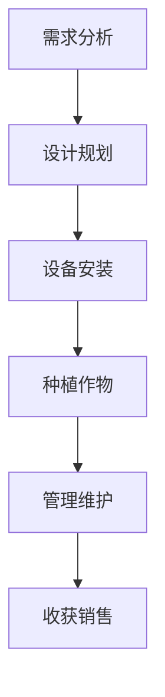
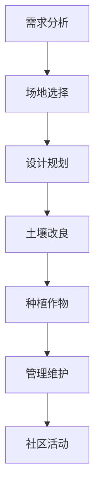
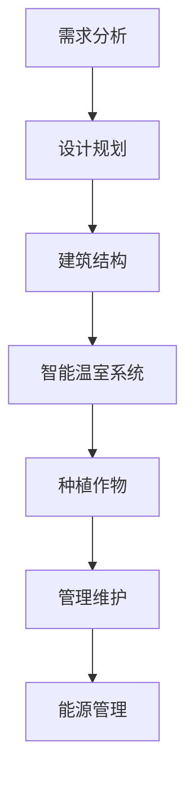
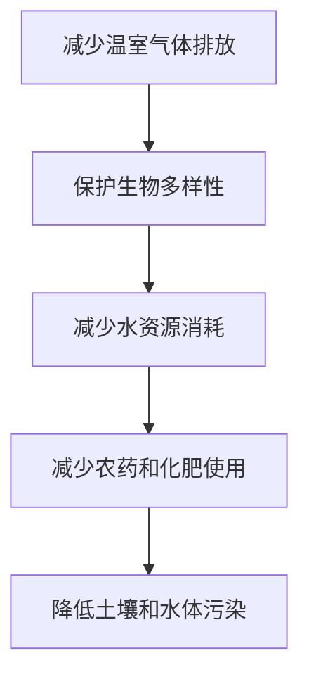
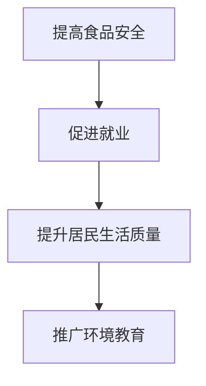
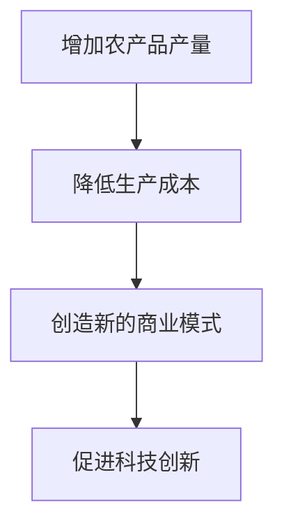

                 

### 文章标题

# 都市农业革命2.0：城市食物自给自足的新模式

> 关键词：都市农业、革命2.0、城市食物自给自足、高效农业技术、智能温室系统、基因编辑、农业物联网

> 摘要：随着城市化进程的加速，城市食物供应链面临前所未有的挑战。都市农业革命2.0应运而生，通过引入高效农业技术、智能温室系统、基因编辑和农业物联网等创新模式，实现城市食物自给自足，为未来城市可持续发展提供解决方案。

---

### 引言

#### 1.1 书籍背景与目标

随着全球人口的增长和城市化的加速，城市食物供应链的稳定性和可持续性成为各国政府、科学家和企业家共同关注的焦点。传统的农业生产模式已经难以满足城市居民对食物的需求，尤其是在面对自然灾害、气候变化和资源短缺等挑战时，显得力不从心。

《都市农业革命2.0：城市食物自给自足的新模式》旨在探讨和解决这一问题。本书的目标是详细介绍都市农业革命2.0的核心技术，分析其实现城市食物自给自足的可行性，并探讨其对环境和经济的潜在影响。

#### 1.2 都市农业革命的概念

都市农业革命是一个跨学科的概念，它涵盖了农业、工程、信息技术、环境科学等多个领域。都市农业不仅仅是指在城市内进行的农业生产，更是一种将现代农业科技与城市环境相结合的新兴农业模式。

革命2.0则意味着在第一代都市农业的基础上，进一步整合和创新，以适应现代城市快速发展的需求。这一代都市农业更加强调高效性、可持续性和智能化，旨在实现城市食物自给自足。

#### 1.3 书籍结构概述

本书共分为七个章节，各章节的内容安排如下：

- **第1章 引言**：介绍书籍的背景、目标和都市农业革命的概念。
- **第2章 都市农业革命的历史与现状**：回顾都市农业革命1.0的发展历程，分析当前城市食物自给自足的挑战。
- **第3章 都市农业2.0的核心技术**：介绍高效农业技术、智能温室系统、基因编辑和农业物联网等关键技术。
- **第4章 都市农业2.0的技术实现**：详细讨论这些关键技术的实际应用和实现方法。
- **第5章 城市食物自给自足的实践案例**：分享一些成功的城市食物自给自足实践案例。
- **第6章 都市农业2.0的生态效益与社会影响**：分析都市农业革命2.0对环境和社会的潜在影响。
- **第7章 未来展望与挑战**：探讨都市农业革命2.0的未来发展趋势和面临的挑战。

---

### 都市农业革命的历史与现状

#### 2.1 都市农业革命1.0

都市农业革命1.0起源于20世纪初期，其主要目的是在城市中寻找新的农业生产方式，以缓解城市食物供应的紧张。这一时期的都市农业主要集中在城市边缘的农田，通过改进耕作技术、提高农作物产量，为城市居民提供部分食物。

然而，随着城市化进程的加快，城市对食物的需求量不断增加，而城市边缘的农田面积有限，传统的农业生产模式逐渐暴露出其局限性。都市农业革命1.0在提高农作物产量方面取得了一定的成效，但在实现城市食物自给自足方面仍然面临巨大挑战。

#### 2.2 都市农业革命2.0的特征

都市农业革命2.0是在1.0的基础上，通过引入高效农业技术、智能温室系统、基因编辑和农业物联网等创新模式，实现城市食物自给自足的新模式。其特征主要包括：

1. **高效性**：利用高效农业技术，如精准灌溉、智能施肥等，提高农作物产量，减少资源浪费。
2. **智能化**：引入智能温室系统、农业物联网等，实现农业生产过程的自动化、智能化管理。
3. **可持续性**：通过生态农业、有机农业等可持续农业模式，减少对环境的负面影响。
4. **多样性**：提供多样化的食物选择，满足城市居民对食物的品质和口味的多样性需求。

#### 2.3 当前城市食物自给自足的挑战

尽管都市农业革命2.0提供了一种实现城市食物自给自足的可行路径，但当前仍然面临以下挑战：

1. **技术壁垒**：高效农业技术、智能温室系统、基因编辑和农业物联网等技术尚未完全成熟，需要进一步研发和优化。
2. **成本问题**：大规模应用这些技术需要大量资金投入，对于城市家庭和小型农场来说，成本较高。
3. **政策支持**：当前相关政策对都市农业革命2.0的支持力度有限，缺乏系统的政策体系和法律法规保障。
4. **公众认知**：公众对都市农业革命2.0的认知度较低，需要加强宣传和教育，提高公众的参与度和接受度。

---

### 都市农业2.0的核心技术

#### 3.1 高效农业技术

高效农业技术是都市农业革命2.0的核心之一，其目的是通过提高农作物产量和降低生产成本，实现城市食物自给自足。以下是一些关键的高效农业技术：

1. **精准灌溉**：利用传感器和数据分析技术，精确控制灌溉量和灌溉时间，提高水资源利用效率。
   ```mermaid
   graph TD
   A[精准灌溉] --> B[传感器]
   B --> C[数据分析]
   C --> D[灌溉系统]
   ```
2. **智能施肥**：根据土壤和作物的实际需求，精确控制施肥量和施肥时间，提高肥料利用率。
   ```mermaid
   graph TD
   A[智能施肥] --> B[土壤传感器]
   B --> C[作物传感器]
   C --> D[施肥系统]
   ```
3. **温室种植**：利用温室环境控制技术，创造适宜的生长环境，提高农作物产量和品质。
   ```mermaid
   graph TD
   A[温室种植] --> B[环境控制系统]
   B --> C[温湿度传感器]
   B --> D[光照系统]
   ```

#### 3.2 智能温室系统

智能温室系统是都市农业革命2.0的重要组成部分，它通过自动化和智能化管理，实现温室内的最佳生长环境。以下是智能温室系统的主要功能：

1. **环境监测**：实时监测温室内的温湿度、光照、土壤湿度等环境参数，通过传感器和数据采集系统实现。
   ```mermaid
   graph TD
   A[环境监测] --> B[温湿度传感器]
   B --> C[光照传感器]
   B --> D[土壤湿度传感器]
   C --> E[数据采集系统]
   ```
2. **环境控制**：根据监测数据，自动调整温室内的环境参数，如温度、湿度、光照等，以创造最佳生长环境。
   ```mermaid
   graph TD
   A[环境控制] --> B[加热系统]
   B --> C[通风系统]
   B --> D[光照系统]
   ```
3. **自动灌溉和施肥**：根据作物的生长需求和土壤湿度，自动控制灌溉和施肥系统，提高资源利用效率。
   ```mermaid
   graph TD
   A[自动灌溉和施肥] --> B[土壤湿度传感器]
   B --> C[灌溉系统]
   B --> D[施肥系统]
   ```

#### 3.3 基因编辑技术

基因编辑技术是都市农业革命2.0的重要工具，它可以通过修改作物的基因组，提高其抗病性、耐旱性和产量。以下是基因编辑技术的主要应用：

1. **抗病性增强**：通过编辑作物的基因组，使其具有更强的抗病性，减少农药使用，保护环境和人类健康。
   $$抗病性 = 抗病基因 + 抗病性状$$
2. **耐旱性提升**：通过编辑作物的基因组，提高其对干旱环境的适应能力，减少水资源的消耗。
   $$耐旱性 = 耐旱基因 + 耐旱性状$$
3. **产量提高**：通过编辑作物的基因组，提高其产量和品质，满足城市居民对食物的需求。
   $$产量 = 产量基因 + 产量性状$$

#### 3.4 农业物联网

农业物联网是都市农业革命2.0的关键技术之一，它通过将传感器、无线通信和网络技术结合，实现农业生产过程的自动化和智能化。以下是农业物联网的主要组成部分：

1. **传感器**：用于监测农田环境参数，如土壤湿度、空气温度、光照强度等。
   ```mermaid
   graph TD
   A[传感器] --> B[土壤湿度]
   A --> C[空气温度]
   A --> D[光照强度]
   ```
2. **数据采集系统**：用于收集传感器数据，并通过无线通信传输到云端服务器进行分析和处理。
   ```mermaid
   graph TD
   A[数据采集系统] --> B[传感器数据]
   B --> C[无线通信]
   B --> D[云端服务器]
   ```
3. **决策支持系统**：基于分析结果，为农民提供种植、灌溉、施肥等决策支持，实现精准农业。
   ```mermaid
   graph TD
   A[决策支持系统] --> B[数据分析]
   B --> C[种植建议]
   B --> D[灌溉建议]
   B --> E[施肥建议]
   ```

---

### 都市农业2.0的技术实现

#### 4.1 智能温室系统构建

智能温室系统是都市农业2.0的核心技术之一，其构建过程可以分为以下几个步骤：

1. **需求分析**：首先，根据种植作物的需求和目标，确定智能温室系统的基本配置和功能需求。
2. **设备选型**：根据需求分析结果，选择合适的传感器、控制器、执行器等设备，确保系统性能和可靠性。
3. **系统设计**：设计智能温室系统的架构，包括传感器布局、控制逻辑、通信网络等。
4. **硬件安装**：根据系统设计，安装传感器、控制器、执行器等设备，确保其正常工作。
5. **软件编程**：编写控制系统软件，实现环境监测、环境控制、自动灌溉和施肥等功能。
6. **系统调试**：对智能温室系统进行调试和优化，确保其稳定运行和高效性能。

以下是一个简单的智能温室系统软件伪代码示例：
```python
def monitor_environment():
    # 获取环境参数
    temp = read_temp_sensor()
    humidity = read_humidity_sensor()
    light = read_light_sensor()
    soil_humidity = read_soil_humidity_sensor()

    # 处理环境参数
    if temp > set_temp:
        activate_heating_system()
    elif temp < set_temp:
        deactivate_heating_system()

    if humidity > set_humidity:
        activate_ventilation_system()
    elif humidity < set_humidity:
        deactivate_ventilation_system()

    if light < set_light:
        activate_lighting_system()
    elif light > set_light:
        deactivate_lighting_system()

    if soil_humidity < set_soil_humidity:
        activate_irrigation_system()
    elif soil_humidity > set_soil_humidity:
        deactivate_irrigation_system()

def control_environment():
    # 调用环境监测函数
    monitor_environment()

    # 根据环境参数调整环境控制
    if temp > set_temp:
        increase_heating_system()
    elif temp < set_temp:
        decrease_heating_system()

    if humidity > set_humidity:
        increase_ventilation_system()
    elif humidity < set_humidity:
        decrease_ventilation_system()

    if light < set_light:
        increase_lighting_system()
    elif light > set_light:
        decrease_lighting_system()

    if soil_humidity < set_soil_humidity:
        increase_irrigation_system()
    elif soil_humidity > set_soil_humidity:
        decrease_irrigation_system()
```

#### 4.2 基因编辑技术实践

基因编辑技术在都市农业2.0中具有重要意义，其实践过程可以分为以下几个步骤：

1. **目标基因选择**：根据作物需求，选择需要编辑的目标基因，如抗病基因、耐旱基因等。
2. **基因编辑**：利用CRISPR-Cas9等基因编辑技术，对目标基因进行编辑，实现所需功能。
3. **基因筛选**：通过筛选和鉴定，选出具有目标性状的基因编辑植物。
4. **田间试验**：将基因编辑植物进行田间试验，验证其性状稳定性和产量。
5. **推广应用**：通过试验结果，推广基因编辑植物，实现大规模种植和应用。

以下是一个简单的基因编辑流程伪代码示例：
```python
def select_target_gene():
    # 根据作物需求选择目标基因
    target_gene = get_target_gene_info()
    return target_gene

def edit_gene(target_gene):
    # 利用CRISPR-Cas9编辑目标基因
    edited_gene = CRISPR_Cas9(target_gene)
    return edited_gene

def screen_plants(edited_gene):
    # 筛选和鉴定基因编辑植物
    plants = grow_plants(edited_gene)
    selected_plants = select_best_plants(plants)
    return selected_plants

def field_test(selected_plants):
    # 进行田间试验
    test_results = conduct_field_tests(selected_plants)
    return test_results

def promote_plants(test_results):
    # 根据试验结果推广基因编辑植物
    if test_results.success:
        promote_plants_to_market()
    else:
        continue_research()
```

#### 4.3 农业物联网应用

农业物联网技术在都市农业2.0中发挥着关键作用，其实践应用可以分为以下几个步骤：

1. **设备安装**：在农田中安装各种传感器，如土壤湿度传感器、空气温度传感器、光照传感器等。
2. **数据采集**：通过无线通信技术，将传感器数据实时传输到云端服务器进行存储和处理。
3. **数据处理**：对采集到的数据进行分析和处理，生成种植、灌溉、施肥等决策建议。
4. **决策支持**：将分析结果反馈给农民，为其提供精准的种植、灌溉、施肥等决策支持。
5. **系统优化**：根据实际应用效果，对农业物联网系统进行优化和升级，提高其性能和可靠性。

以下是一个简单的农业物联网应用流程伪代码示例：
```python
def install_sensors():
    # 安装传感器
    sensors = install_soil_humidity_sensor()
    sensors += install_air_temp_sensor()
    sensors += install_light_sensor()
    return sensors

def collect_data(sensors):
    # 采集传感器数据
    data = collect_sensor_data(sensors)
    return data

def process_data(data):
    # 处理传感器数据
    processed_data = analyze_data(data)
    return processed_data

def provide_decision_support(processed_data):
    # 提供决策支持
    planting_suggestion = generate_planting_suggestion(processed_data)
    irrigation_suggestion = generate_irrigation_suggestion(processed_data)
    fertilization_suggestion = generate_fertilization_suggestion(processed_data)
    return planting_suggestion, irrigation_suggestion, fertilization_suggestion

def optimize_system():
    # 优化系统
    system = optimize_agri物联网_system()
    return system
```

---

### 城市食物自给自足的实践案例

#### 5.1 案例一：城市屋顶农场

城市屋顶农场是一种在建筑物屋顶上进行农业种植的实践模式，其具有以下优势：

1. **节约土地资源**：利用城市屋顶空间，节省宝贵的土地资源，提高城市土地利用率。
2. **减少城市热岛效应**：植物蒸腾作用有助于降低城市温度，缓解城市热岛效应。
3. **环境友好**：屋顶农场采用生态农业和有机农业模式，减少农药和化肥使用，保护环境和人类健康。

以下是一个城市屋顶农场的构建流程：


#### 5.2 案例二：社区花园

社区花园是一种将农业生产与社区活动相结合的实践模式，其具有以下优势：

1. **促进社区参与**：社区花园为居民提供参与农业活动的机会，增强社区凝聚力和归属感。
2. **环境教育**：社区花园可以成为环境教育场所，提高居民对生态农业的认识和参与度。
3. **食物供应**：社区花园种植的作物可以满足部分居民的食物需求，减少对市场食品的依赖。

以下是一个社区花园的构建流程：


#### 5.3 案例三：垂直农场

垂直农场是一种在多层建筑内进行农业种植的实践模式，其具有以下优势：

1. **高效利用空间**：垂直农场通过垂直结构，高效利用有限的空间，提高农作物产量。
2. **减少运输成本**：垂直农场实现本地化生产，减少运输成本和能耗，提高食品新鲜度和品质。
3. **环境友好**：垂直农场采用智能温室系统和循环水系统，减少资源消耗和环境污染。

以下是一个垂直农场的构建流程：


---

### 都市农业2.0的生态效益与社会影响

#### 6.1 环境效益

都市农业革命2.0在环境保护方面具有显著优势，主要体现在以下几个方面：

1. **减少温室气体排放**：通过采用可再生能源和节能减排技术，减少温室气体排放，降低全球气候变化风险。
2. **保护生物多样性**：城市农业可以提供栖息地，增加城市生物多样性，促进生态平衡。
3. **减少水资源消耗**：利用精准灌溉和循环水系统，提高水资源利用效率，减少水资源浪费。
4. **减少农药和化肥使用**：采用有机农业和生态农业模式，减少农药和化肥使用，降低土壤和水体污染。

以下是一个都市农业革命2.0环境效益的Mermaid流程图：


#### 6.2 社会效益

都市农业革命2.0在社会方面也具有积极影响，主要体现在以下几个方面：

1. **提高食品安全**：本地化生产和新鲜食材供应，提高食品质量和安全水平。
2. **促进就业**：都市农业创造大量就业机会，促进社会稳定和发展。
3. **提升居民生活质量**：城市农业提供绿色空间，改善城市环境，提高居民生活质量。
4. **推广环境教育**：都市农业成为环境教育场所，提高公众对生态农业的认识和参与度。

以下是一个都市农业革命2.0社会效益的Mermaid流程图：


#### 6.3 经济效益

都市农业革命2.0在经济效益方面具有显著潜力，主要体现在以下几个方面：

1. **增加农产品产量**：通过采用高效农业技术和智能温室系统，提高农产品产量，增加农民收入。
2. **降低生产成本**：利用农业物联网和自动化技术，降低生产成本，提高农业效益。
3. **创造新的商业模式**：都市农业革命2.0带来新的商业机会，如农产品直销、生态旅游等，推动农业产业结构升级。
4. **促进科技创新**：都市农业革命2.0推动农业科技研发和创新，为农业现代化提供技术支撑。

以下是一个都市农业革命2.0经济效益的Mermaid流程图：


---

### 未来展望与挑战

#### 7.1 未来都市农业的发展趋势

未来都市农业将朝着更加智能化、高效化、可持续化的方向发展，主要趋势包括：

1. **智能化**：随着人工智能、大数据、物联网等技术的发展，都市农业将实现更高程度的智能化管理，提高农业生产效率。
2. **高效化**：通过采用高效农业技术和智能温室系统，提高农产品产量和品质，满足城市居民对食物的需求。
3. **可持续化**：推广生态农业和有机农业模式，减少对环境的负面影响，实现农业可持续发展。

#### 7.2 技术突破的方向

未来都市农业的技术突破方向包括：

1. **基因编辑技术**：进一步优化基因编辑技术，提高作物抗病性、耐旱性和产量。
2. **智能温室系统**：研发更高效、更智能的温室控制系统，提高温室环境控制精度和稳定性。
3. **农业物联网**：提高农业物联网设备的性能和可靠性，实现更广泛的应用场景。

#### 7.3 面临的挑战与对策

未来都市农业发展仍将面临一系列挑战，如技术壁垒、成本问题、政策支持不足等。为应对这些挑战，可以采取以下对策：

1. **加大技术研发投入**：政府和企业应加大对农业技术研发的投入，推动技术突破和产业化应用。
2. **制定支持政策**：政府应制定相关政策和法律法规，为都市农业发展提供有力支持。
3. **加强国际合作**：通过国际合作，共享技术资源和经验，推动全球都市农业发展。

---

### 附录

#### A.1 相关技术资源

- **高效农业技术**：精准灌溉、智能施肥、温室种植等。
- **智能温室系统**：传感器、控制器、执行器等设备选型。
- **基因编辑技术**：CRISPR-Cas9等基因编辑技术。
- **农业物联网**：传感器、数据采集系统、决策支持系统等。

#### A.2 进一步阅读推荐

- **《智能温室系统设计与实现》**：介绍了智能温室系统的设计原理和实现方法。
- **《基因编辑技术在农业中的应用》**：探讨了基因编辑技术在农业领域的应用前景。
- **《农业物联网技术与应用》**：详细介绍了农业物联网的技术架构和应用场景。

### 结语

作者：AI天才研究院/AI Genius Institute & 禅与计算机程序设计艺术 /Zen And The Art of Computer Programming

本文详细介绍了都市农业革命2.0的核心技术、技术实现、实践案例以及生态效益、社会影响和未来展望。通过本文，读者可以全面了解都市农业革命2.0的原理和应用，为未来城市食物自给自足提供新的思路和解决方案。同时，本文也呼吁社会各界加强对都市农业革命2.0的关注和支持，共同推动农业现代化和城市可持续发展。

