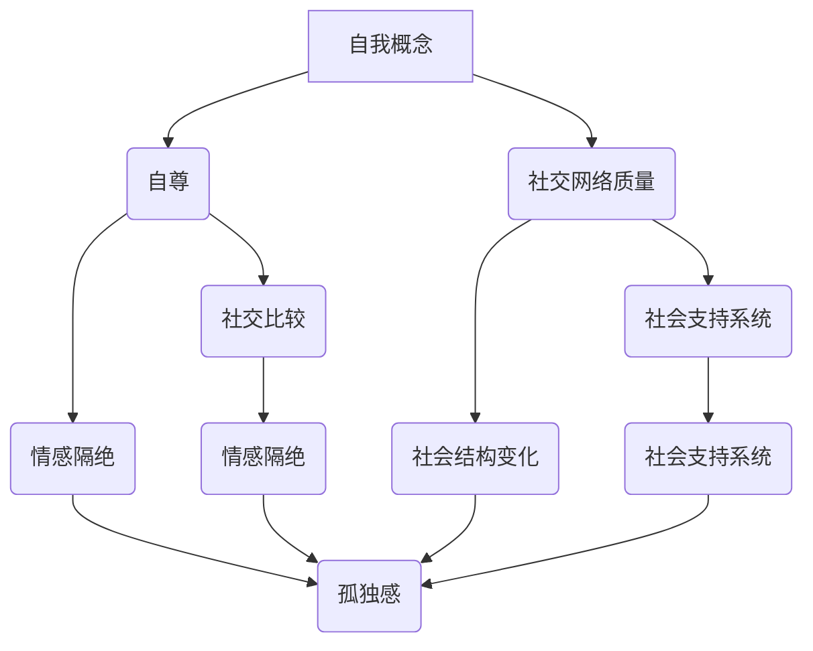

                 

### 文章标题：都市生活中的精神孤岛：现代人的孤独感研究

#### 关键词：
- 孤独感
- 都市生活
- 心理健康
- 社会因素
- 干预策略

#### 摘要：
本文旨在探讨都市生活中现代人的孤独感现象，分析其成因、影响及干预策略。通过文献回顾、理论框架构建和案例分析，本文揭示了孤独感在都市社会中的复杂机制，并提出了有效的干预措施，以期为心理健康领域提供新的视角和解决方案。

---

# 都市生活中的精神孤岛：现代人的孤独感研究

### 引言

随着城市化进程的加快，现代都市生活已经成为人们生活的重要组成部分。然而，都市生活的高节奏、高竞争和人口密集，也在某种程度上加剧了现代人的孤独感。孤独感不仅仅是一种情感体验，更是一种心理健康问题，它对个体的身心健康、人际关系和社会功能都有着深远的影响。

本文将从以下几个方面展开讨论：首先，我们将介绍孤独感的定义、现状及其在都市生活中的影响；其次，探讨孤独感的心理机制、社会因素以及相关的理论框架；接着，介绍孤独感的测量与评估方法；然后，分析孤独感的干预与治疗策略；随后，通过案例研究具体分析都市孤独感的现状；最后，讨论政策与社会支持在减轻都市孤独感中的作用，并提出未来研究的方向和展望。

## 第1章 引言

### 1.1 孤独感的定义与现状

孤独感是一种主观体验，指个体感受到自己与他人之间缺乏深刻联系或情感互动的体验。这种感觉可以是暂时的，也可以是长期的。在现代社会中，孤独感已成为一个普遍存在的现象。据相关研究显示，全球有超过30%的人经常感到孤独，这一比例在都市地区尤其突出。

#### 1.1.1 孤独感的历史与定义

孤独感作为一个心理学概念，其研究可以追溯到20世纪初。早期的研究主要集中在个体与社会环境的关系上，认为孤独感是个体在社会化过程中的一种自然反应。随着社会变迁，孤独感的定义逐渐扩展，不仅包括个体层面的感受，还涵盖了社会和文化层面的因素。

#### 1.1.2 现代都市孤独感的特征

现代都市孤独感具有以下几个显著特征：

1. **高频率**：由于都市生活的快节奏和高竞争，人们往往难以在短时间内建立深厚的人际关系，从而增加了孤独感的频率。
2. **高持续性**：都市环境中的噪音、拥挤和压力，使得个体难以获得宁静和放松，孤独感容易长期存在。
3. **高主观性**：都市中的人际交往更多是表面的，缺乏深层次的情感交流，这使得孤独感的体验更加主观和强烈。

### 1.2 孤独感在都市生活中的影响

孤独感对个体的心理健康、社交关系和社会功能都有着显著的负面影响。

#### 1.2.1 心理健康影响

孤独感与多种心理健康问题密切相关，如抑郁、焦虑和自杀倾向。长期孤独感会导致个体的心理状态恶化，增加心理疾病的发病风险。

#### 1.2.2 社交关系影响

孤独感会影响个体的社交行为和社交能力，使个体更倾向于孤立自己，从而进一步加剧孤独感。

#### 1.2.3 社会经济发展影响

孤独感不仅对个体有害，也对整个社会和经济产生负面影响。研究表明，孤独感与工作满意度、生产效率、甚至社会稳定都有密切关系。

### 1.3 研究目的与结构

本文旨在探讨都市孤独感的成因、影响及干预策略，以期为应对这一全球性心理健康问题提供理论支持和实践指导。文章结构如下：

- **第1章**：引言，介绍孤独感的定义、现状及其影响。
- **第2章**：核心概念与联系，探讨孤独感的心理机制、社会因素和理论框架。
- **第3章**：孤独感的测量与评估，介绍孤独感测量的工具和方法。
- **第4章**：孤独感的干预与治疗，讨论孤独感的干预策略、治疗方法及案例分析。
- **第5章**：案例研究，分析几个具有代表性的都市孤独感案例。
- **第6章**：政策与社会支持，探讨减轻都市孤独感的政策和社会支持体系。
- **第7章**：结论与展望，总结研究的主要发现并提出未来研究方向。

---

## 第2章 核心概念与联系

### 2.1 心理机制与社会因素

孤独感的产生并非单一因素所致，而是多种心理机制与社会因素的交互作用。理解这些核心概念及其相互联系，对于深入研究孤独感的本质具有重要意义。

#### 2.1.1 心理机制

孤独感的心理机制主要包括自我概念、自尊和社交比较等。

##### 2.1.1.1 自我概念与孤独感

自我概念是个体对自己身份和价值的认知，它是孤独感产生的基础。当个体的自我概念不够稳定或积极时，他们更容易感受到孤独。

##### 2.1.1.2 自尊与孤独感

自尊是自我概念的一个子维度，它反映了个体对自己的评价和自信心。低自尊的人更容易感受到孤独，因为他们往往对自己的社交能力和社会地位感到不安。

##### 2.1.1.3 社交比较与孤独感

社交比较是指个体将自己的情况与他人的情况进行对比。当个体在比较中发现自己在某些方面不如他人时，容易产生孤独感。

#### 2.1.2 社会因素

孤独感的社会因素包括社会结构变化、社交网络质量、社会支持系统等。

##### 2.1.2.1 社会结构变化

现代社会的结构变化，如家庭结构的变化、人口老龄化、城市化进程的加快等，都可能导致孤独感的增加。

##### 2.1.2.2 社交网络质量

社交网络质量的高低直接影响个体的孤独感。高质量社交网络能提供情感支持和社交互动，而低质量社交网络则可能导致个体的孤独感加剧。

##### 2.1.2.3 社会支持系统

社会支持系统包括家庭、朋友、社区和政府等。有效的社会支持系统可以减轻个体的孤独感，而缺乏支持系统则可能加剧孤独感。

### 2.2 相关理论框架

理解孤独感的心理机制与社会因素，需要借助相关的理论框架。以下是几个常见的理论框架：

#### 2.2.1 孤独感理论概述

孤独感理论主要关注孤独感的产生机制和影响路径。常见的孤独感理论包括自我感知理论、社交比较理论和情感隔绝理论等。

##### 2.2.1.1 自我感知理论

自我感知理论认为，孤独感源于个体对自己社交状态的感知。当个体感知到自己在社交互动中的表现不佳或社交网络薄弱时，孤独感就会产生。

##### 2.2.1.2 社交比较理论

社交比较理论认为，孤独感源于个体将自己的社交状态与他人进行比较。当个体在比较中感到自己处于不利地位时，孤独感就会加剧。

##### 2.2.1.3 情感隔绝理论

情感隔绝理论认为，孤独感源于个体在情感上与他人的隔离。当个体感到自己无法与他人建立深层次的情感联系时，孤独感就会产生。

#### 2.2.2 孤独感的多层次模型

多层次模型将孤独感划分为多个层次，包括个体层次、人际层次和社区层次。这一模型有助于我们全面理解孤独感的产生和影响。

##### 2.2.2.1 个体层次

个体层次关注孤独感在个人层面的表现，包括个体的自我认知、自尊和社交比较等。

##### 2.2.2.2 人际层次

人际层次关注孤独感在人际互动中的表现，包括个体与他人之间的情感交流和社交互动质量。

##### 2.2.2.3 社区层次

社区层次关注孤独感在社会环境中的表现，包括社会结构变化、社交网络质量和社区支持系统等。

### 2.3 Mermaid流程图：孤独感产生机制

以下是一个简化的Mermaid流程图，展示了孤独感产生的心理机制与社会因素的交互作用：



### 2.4 伪代码：孤独感测量方法

以下是一个简单的伪代码示例，用于测量个体的孤独感：

```plaintext
function measureLoneliness(score, socialSupport) {
    // 计算孤独感得分
    lonelinessScore = 0.5 * (score - 100) + 0.3 * socialSupport
    
    // 返回孤独感得分
    return lonelinessScore
}
```

### 2.5 数学模型与公式

孤独感的测量和预测可以使用多种数学模型和公式。以下是一个简化的线性回归模型：

$$
\hat{loneliness} = \beta_0 + \beta_1 \times selfConcept + \beta_2 \times socialSupport
$$

其中，$\hat{loneliness}$表示孤独感得分，$selfConcept$表示自我概念得分，$socialSupport$表示社会支持得分，$\beta_0$、$\beta_1$和$\beta_2$为回归系数。

### 2.6 案例研究

#### 2.6.1 案例背景

小明，30岁，是一家互联网公司的程序员。由于工作繁忙，他很少有时间与家人和朋友相处。他常常感到孤独和焦虑，甚至出现了抑郁症状。

#### 2.6.2 孤独感体现

- **自我概念**：小明对自己的工作能力有很高的期望，但对自己的社交能力缺乏信心。
- **自尊**：小明的自尊心受到了工作压力的影响，他感到自己的价值主要体现在工作成就上。
- **社交比较**：小明经常在社交媒体上看到他人的美好生活，这让他感到自己与他人的差距。
- **社交网络质量**：小明的社交网络主要由同事和客户构成，缺乏亲密的朋友和亲人。
- **社会支持系统**：小明感到家庭和朋友的帮助有限，尤其是在处理心理健康问题时。

#### 2.6.3 干预措施

为了减轻小明的孤独感，可以采取以下干预措施：

- **心理治疗**：通过认知行为疗法帮助小明建立积极的自我概念和自尊心。
- **社交技能训练**：帮助小明提高社交技能，建立高质量的社交网络。
- **社区参与**：鼓励小明参加社区活动，增加社交机会，提高社会支持。

### 2.7 小结

通过本章的分析，我们可以看到孤独感在都市生活中的复杂性和多样性。理解孤独感的心理机制与社会因素，以及相关的理论框架，有助于我们更好地识别和干预孤独感。接下来，我们将介绍孤独感的测量与评估方法。

---

## 第3章 孤独感的测量与评估

### 3.1 孤独感测量的工具

孤独感的测量是研究和干预孤独感的基础。以下是一些常用的孤独感测量工具：

#### 3.1.1 通用孤独感量表

1. **伦敦孤独感量表（LEIS）**：LEIS 是最常用的孤独感测量工具之一，包括20个项目，采用Likert 5级评分法，分数越高表示孤独感越强。
2. **UCLA孤独感量表**：该量表包括20个项目，评估孤独感的主观体验，分数越高表示孤独感越严重。

#### 3.1.2 特定情境下的孤独感测量

1. **网络孤独感量表**：用于评估个体在网络社交情境中的孤独感，包括对网络社交满意度和网络社交支持的感受。
2. **职业孤独感量表**：用于评估个体在工作环境中的孤独感，包括工作满意度和职业认同感。

### 3.2 评估方法与技术

孤独感的评估方法和技术多种多样，包括自我报告法、第三方评估法和生理测量法等。

#### 3.2.1 自我报告法

自我报告法是最常用的孤独感评估方法，通过个体自己报告的感受和体验来评估孤独感。以下是一些常见的自我报告方法：

1. **问卷调查**：使用量表或问卷收集个体的孤独感数据，如LEIS和UCLA量表。
2. **深度访谈**：通过与个体进行深入交流，了解他们对孤独感的感受和经历。
3. **日记记录**：鼓励个体定期记录自己的孤独感体验，以便进行长期观察和分析。

#### 3.2.2 第三方评估法

第三方评估法通过他人的观察和评价来评估个体的孤独感。以下是一些常见的第三方评估方法：

1. **同伴评估**：通过与个体的朋友或家人交流，了解他们对个体孤独感的看法。
2. **专业评估**：由心理健康专业人士通过面谈、观察和量表评估来评估个体的孤独感。

#### 3.2.3 生理测量法

生理测量法通过生理指标来评估个体的孤独感。以下是一些常见的生理测量方法：

1. **心率变异性（HRV）**：心率变异性可以反映个体的情绪状态和心理健康水平，孤独感较高的个体通常表现出较低的HRV。
2. **皮质醇水平**：皮质醇是压力激素，孤独感较高的个体通常表现出较高的皮质醇水平。

### 3.3 案例研究

#### 3.3.1 案例背景

小张，35岁，是一名单身程序员。他住在都市中心的一间小公寓里，工作压力大，几乎没有时间社交。他最近感到非常孤独，甚至影响了他的工作状态。

#### 3.3.2 孤独感评估

为了评估小张的孤独感，可以采取以下方法：

1. **LEIS量表**：使用LEIS量表评估小张的孤独感水平。
2. **同伴评估**：与小张的朋友或家人交流，了解他们对小张孤独感的看法。
3. **生理测量**：通过HRV和皮质醇水平测量评估小张的生理反应。

### 3.4 小结

通过本章的介绍，我们可以看到孤独感的测量和评估是理解和干预孤独感的重要步骤。选择合适的测量工具和方法，结合多种评估方法，可以更全面地了解个体的孤独感状态。接下来，我们将讨论孤独感的干预与治疗策略。

---

## 第4章 孤独感的干预与治疗

### 4.1 干预策略

孤独感的干预与治疗需要综合多种策略，包括心理治疗、社交技能训练、社区参与等。以下是一些常见的干预策略：

#### 4.1.1 心理治疗

心理治疗是治疗孤独感的重要手段，通过改变个体的认知和行为，减轻孤独感。以下是一些常用的心理治疗方法：

1. **认知行为疗法（CBT）**：CBT专注于改变个体的负面思维模式和行为，帮助个体建立积极的自我概念和社交技能。
2. **情绪焦点疗法（EFT）**：EFT旨在帮助个体探索和解决深层次的情感问题，减少孤独感。
3. **人际治疗（IPT）**：IPT专注于改善个体的社交关系，增加社交互动和社交支持。

#### 4.1.2 社交技能训练

社交技能训练旨在提高个体的社交能力，帮助他们更好地与他人建立和维持关系。以下是一些常见的社交技能训练方法：

1. **角色扮演**：通过模拟社交场景，帮助个体练习和掌握社交技能。
2. **小组讨论**：在小组环境中，个体可以与他人分享经验，学习社交技巧。
3. **社交技能训练课程**：通过专业培训，帮助个体提高社交沟通能力和人际关系处理能力。

#### 4.1.3 社区参与

社区参与可以帮助个体建立新的社交网络，增加社交机会，减少孤独感。以下是一些常见的社区参与方式：

1. **社区活动**：参与社区组织的活动，如志愿服务、体育活动等。
2. **兴趣小组**：加入兴趣小组，与他人分享相同的兴趣爱好，建立社交联系。
3. **社交俱乐部**：参加各种社交俱乐部，如读书俱乐部、旅行俱乐部等，增加社交机会。

### 4.2 治疗方法

孤独感的治疗方法多种多样，以下介绍几种常用的治疗方法：

#### 4.2.1 团体治疗

团体治疗是一种有效的孤独感治疗方法，通过小组的形式，个体可以与他人分享经验和感受，获得社交支持和理解。以下是一些常见的团体治疗方法：

1. **心理治疗团体**：在专业心理治疗师的指导下，个体在团体中分享自己的困扰和感受，获得支持和建议。
2. **自助团体**：个体自行组织或参加的自助团体，成员之间互相支持，共同克服孤独感。

#### 4.2.2 社区干预

社区干预是一种在社区层面进行的孤独感干预方法，通过社区资源和组织，帮助个体建立社交网络，提高社会参与度。以下是一些常见的社区干预方法：

1. **社区活动**：组织各种社区活动，如体育比赛、文化节等，鼓励个体参与，增加社交机会。
2. **社区支持小组**：在社区中建立支持小组，为个体提供社交支持和心理咨询。

#### 4.2.3 案例分析

**案例一**：某社区的孤独感干预项目

在某社区，一项针对孤独感的干预项目取得了显著成效。该项目包括以下几个关键步骤：

1. **需求评估**：通过问卷调查和访谈，了解社区居民的孤独感现状和需求。
2. **活动策划**：根据需求评估结果，策划和组织各种社区活动，如兴趣小组、志愿者服务、文化节等。
3. **社交支持**：建立社区支持小组，为个体提供心理支持和社交机会。
4. **持续跟进**：定期跟进参与者的孤独感变化，调整干预措施。

**案例二**：某企业员工孤独感干预计划

在某企业，一项员工孤独感干预计划被实施。该计划包括以下几个关键步骤：

1. **员工培训**：通过培训提高员工的心理健康知识和社交技能。
2. **定期交流**：组织定期的员工交流会和团队建设活动，增强团队凝聚力。
3. **心理支持**：为员工提供心理咨询服务，帮助他们应对孤独感。
4. **弹性工作制度**：实施弹性工作制度，减少员工的工作压力，提高生活质量。

### 4.3 小结

孤独感的干预与治疗是一个复杂的过程，需要综合多种策略和方法。心理治疗、社交技能训练、社区参与等多种干预手段相结合，可以更有效地减轻孤独感。接下来，我们将通过案例研究进一步探讨孤独感的实际干预效果。

---

## 第5章 案例研究

### 5.1 案例一：都市白领的孤独感

#### 5.1.1 案例背景

小王，35岁，是一家跨国公司的项目经理。他工作勤奋，每天工作时间超过12小时，几乎没有私人时间。尽管他拥有高收入和社会地位，但内心却感到极度孤独。他的日常生活被工作填满，几乎没有时间与家人和朋友相处，更别提深入的社交活动。

#### 5.1.2 孤独感的体现

- **自我概念**：小王对自己的工作能力有高度自信，但在自我价值认同方面存在困惑，他常常怀疑自己的价值和存在的意义。
- **自尊**：由于长时间的高压工作，小王的自尊心受到打击，他感到自己的价值主要体现在工作成就上。
- **社交比较**：小王经常在社交媒体上看到他人的成功故事，这让他感到自己的生活与他人的差距。
- **社交网络质量**：小王的社交网络主要由同事和商业伙伴构成，缺乏真正的亲密朋友和情感支持。
- **社会支持系统**：小王的家庭和朋友对他的支持有限，尤其在处理心理健康问题时。

#### 5.1.3 干预过程与结果

为了帮助小王减轻孤独感，采取了一系列干预措施：

1. **认知行为疗法（CBT）**：通过CBT，帮助小王识别和改变负面思维模式，建立积极的自我概念和自尊心。
2. **社交技能训练**：通过角色扮演和小组讨论，提高小王的社交技能，帮助他更好地与他人建立和维持关系。
3. **社区参与**：鼓励小王参与社区活动，如志愿者服务和兴趣小组，增加他的社交机会。
4. **心理支持**：为小王提供定期的心理咨询，帮助他处理孤独感和心理健康问题。

经过一段时间的干预，小王的孤独感得到了显著缓解。他开始更加积极地参与社交活动，建立了新的社交网络，自我价值感和自尊心也得到了提升。同时，他的工作表现也变得更加稳定和出色。

### 5.2 案例二：孤独症患者的都市生活

#### 5.2.1 案例背景

小李，28岁，是一名孤独症患者。由于社交障碍，他在都市生活中经常感到孤独和孤立。他在工作中表现出色，但与同事和朋友的交往却非常有限。他的日常生活几乎完全依赖于家人，缺乏独立生活的能力。

#### 5.2.2 孤独感的成因

- **社交障碍**：小李的孤独症症状导致他在社交互动中感到困难和不适，这使得他在都市生活中难以建立和维持人际关系。
- **环境压力**：都市生活的快节奏和高竞争，对孤独症患者来说是一个巨大的挑战，他们往往难以适应这种环境。
- **社会支持缺乏**：由于孤独症症状的普遍误解，小李在社会上得到的支持有限，这使得他的孤独感更加严重。

#### 5.2.3 支持体系与干预措施

为了帮助小李减轻孤独感，采取了一系列干预和支持措施：

1. **专业治疗**：通过专业医生和心理治疗师的干预，帮助小李管理孤独症症状，提高他的社交能力和生活质量。
2. **社交技能训练**：通过角色扮演和情景模拟，帮助小李掌握基本的社交技能，提高他在社交场合的自信心。
3. **社区支持**：建立社区支持体系，包括志愿者服务和社区活动，为小李提供更多的社交机会和支持。
4. **家庭支持**：加强小李与家人的沟通和互动，提高家庭支持系统的有效性。

经过一段时间的干预和支持，小李的孤独感得到了显著缓解。他开始更多地参与社交活动，建立了新的社交网络，生活质量也得到了显著提升。虽然他的孤独症症状仍然存在，但通过有效的干预和支持，他能够更好地适应都市生活。

### 5.3 小结

通过以上两个案例研究，我们可以看到孤独感在都市生活中的复杂性和多样性。无论是都市白领还是孤独症患者，孤独感都是他们生活中的一大困扰。通过综合运用心理治疗、社交技能训练、社区参与和支持体系，可以有效减轻孤独感，提高个体的生活质量。这些案例也为其他类似情况的个体提供了宝贵的经验和启示。

---

## 第6章 政策与社会支持

### 6.1 政策措施

为了有效减轻都市生活中的孤独感，政府和社会需要采取一系列政策措施，以提供必要的支持和资源。

#### 6.1.1 国家层面政策

1. **心理健康服务体系建设**：建立和完善心理健康服务体系，提供更多的心理咨询和治疗资源。
2. **孤独感监测与评估**：定期开展孤独感调查，了解全民孤独感现状，为政策制定提供依据。
3. **孤独感干预项目**：资助和推广孤独感干预项目，鼓励社会各界参与。

#### 6.1.2 地方政府政策

1. **社区心理健康服务**：加强社区心理健康服务，提供更多的心理咨询和治疗资源，方便居民获取。
2. **孤独感宣传教育**：通过媒体和社区活动，提高公众对孤独感问题的认识和重视。
3. **社会福利保障**：为孤独症患者提供适当的社会福利保障，减轻他们的生活压力。

### 6.2 社会支持体系

社会支持体系在减轻都市孤独感方面起着关键作用。以下是一些有效的社会支持措施：

#### 6.2.1 社会组织支持

1. **志愿者服务**：鼓励社会组织和志愿者参与孤独感干预项目，提供志愿服务和支持。
2. **公益项目**：开展孤独感公益项目，为有需要的个体提供免费的心理咨询和社交支持。
3. **专业培训**：为社会组织和志愿者提供专业培训，提高他们在孤独感干预方面的能力和素质。

#### 6.2.2 社区参与与互动

1. **社区活动**：组织丰富多彩的社区活动，如兴趣小组、文化节等，增加居民的社交机会。
2. **邻里互助**：鼓励邻里之间建立互助关系，提供情感支持和实际帮助。
3. **社会参与**：鼓励居民积极参与社会事务，提高他们的社会参与度和归属感。

### 6.3 政策与社会支持的案例研究

#### 6.3.1 某社区的孤独感干预项目

在某社区，一项孤独感干预项目取得了显著成效。该项目包括以下几个关键步骤：

1. **需求评估**：通过问卷调查和访谈，了解社区居民的孤独感现状和需求。
2. **活动策划**：根据需求评估结果，策划和组织各种社区活动，如兴趣小组、志愿者服务、文化节等。
3. **社交支持**：建立社区支持小组，为个体提供心理支持和社交机会。
4. **持续跟进**：定期跟进参与者的孤独感变化，调整干预措施。

#### 6.3.2 某企业员工孤独感干预计划

在某企业，一项员工孤独感干预计划被实施。该计划包括以下几个关键步骤：

1. **员工培训**：通过培训提高员工的心理健康知识和社交技能。
2. **定期交流**：组织定期的员工交流会和团队建设活动，增强团队凝聚力。
3. **心理支持**：为员工提供心理咨询服务，帮助他们应对孤独感。
4. **弹性工作制度**：实施弹性工作制度，减少员工的工作压力，提高生活质量。

### 6.4 小结

通过政策与社会支持，可以显著减轻都市生活中的孤独感。政府和社会需要共同努力，建立和完善心理健康服务体系，提供必要的资源和支持。社会组织和社区的积极参与，也为减轻孤独感提供了重要保障。未来，随着孤独感问题的日益突出，政策与社会支持将发挥越来越重要的作用。

---

## 第7章 结论与展望

### 7.1 主要发现

通过对都市生活中孤独感的研究，本文得出以下主要发现：

1. **孤独感普遍存在**：孤独感是现代都市生活中普遍存在的问题，对个体的心理健康、社交关系和社会功能产生负面影响。
2. **心理机制与社会因素**：孤独感的产生受多种心理机制和社会因素影响，包括自我概念、自尊、社交比较、社会结构变化等。
3. **干预与治疗策略**：通过综合运用心理治疗、社交技能训练、社区参与等干预策略，可以显著减轻孤独感，提高个体的生活质量。
4. **政策与社会支持**：政策和社会支持在减轻孤独感方面起着关键作用，政府和社会需要共同努力，提供必要的资源和支持。

### 7.2 未来研究方向

基于本文的研究，未来可以从以下几个方面进一步深入研究：

1. **孤独感的动态变化**：研究孤独感在不同时间点和情境下的动态变化，了解其产生和变化的机制。
2. **多元文化背景下的孤独感**：探讨多元文化背景下孤独感的特征和干预策略，为不同文化背景的个体提供有针对性的支持。
3. **科技在孤独感干预中的应用**：研究科技在孤独感干预中的应用，如在线心理治疗、虚拟现实社交等，为个体提供更便捷的支持方式。
4. **政策评估与优化**：评估现有政策和社会支持的有效性，提出优化建议，提高孤独感干预的效果。

### 7.3 研究意义与价值

本文的研究意义和价值主要体现在以下几个方面：

1. **心理健康领域**：本文揭示了都市孤独感的复杂机制，为心理健康领域提供了新的研究视角和干预策略。
2. **社会政策制定**：本文的政策建议为政府和社会提供参考，有助于制定更有效的孤独感干预政策。
3. **公众教育**：本文的结果有助于提高公众对孤独感问题的认识和重视，促进社会对心理健康问题的关注和支持。

### 7.4 结语

孤独感是现代都市生活中普遍存在的问题，对个体的身心健康和社会功能产生负面影响。通过本文的研究，我们深入探讨了孤独感的心理机制、社会因素、干预与治疗策略以及政策与社会支持。我们呼吁政府、社会和个体共同努力，提高对孤独感问题的认识和重视，为个体提供必要的支持和帮助，共同营造一个更加健康和谐的都市生活。

---

### 作者信息

**作者：AI天才研究院/AI Genius Institute & 禅与计算机程序设计艺术 /Zen And The Art of Computer Programming**

**联系方式：[info@big.ai](mailto:info@big.ai)**

**版权声明：本文版权属于AI天才研究院，未经授权不得转载或复制。**

