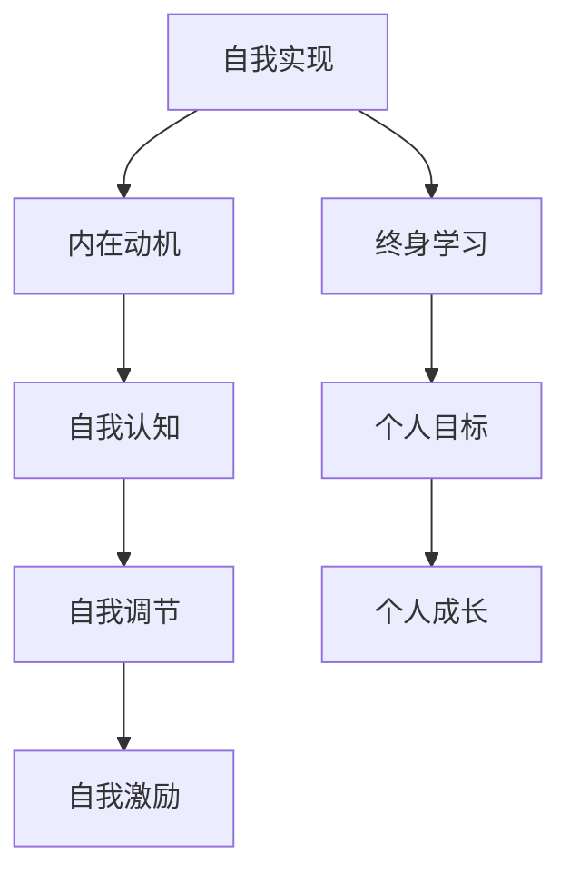
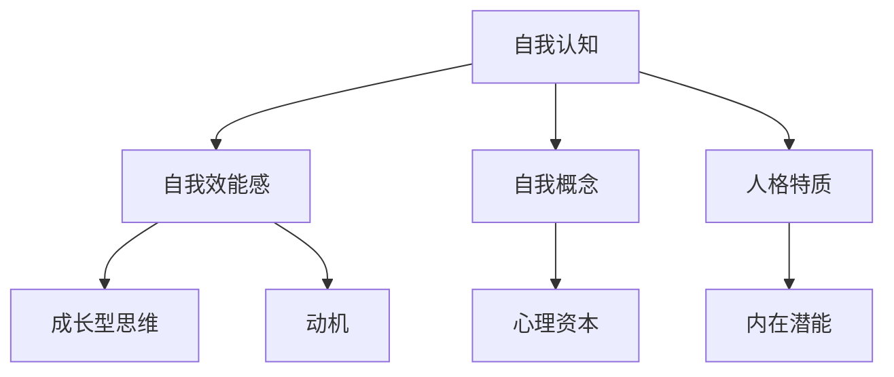
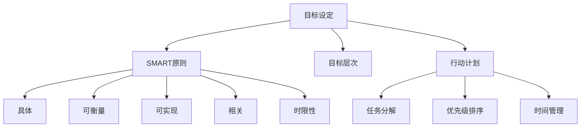
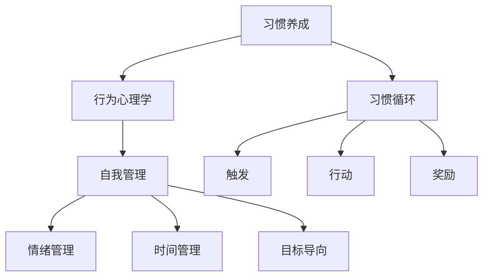
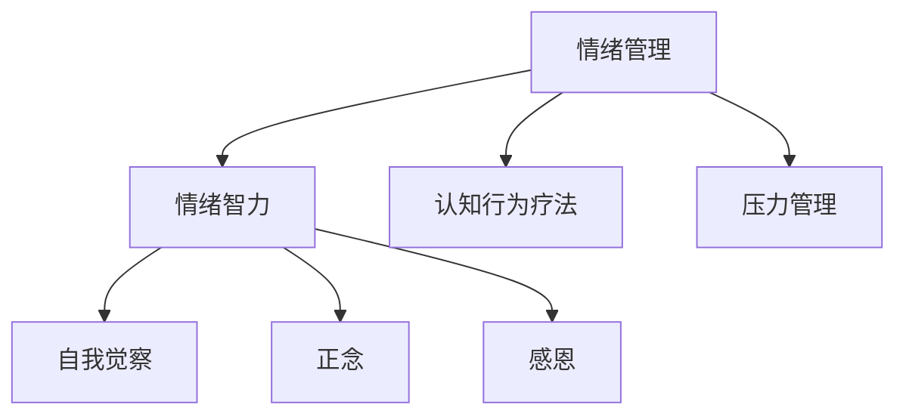
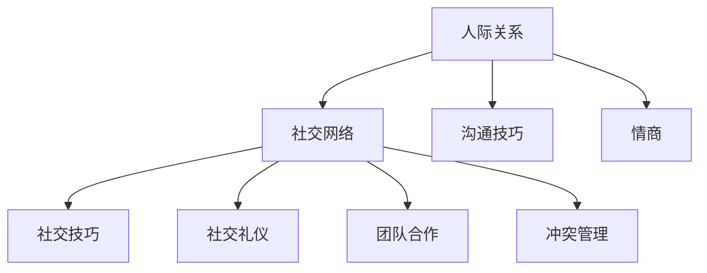
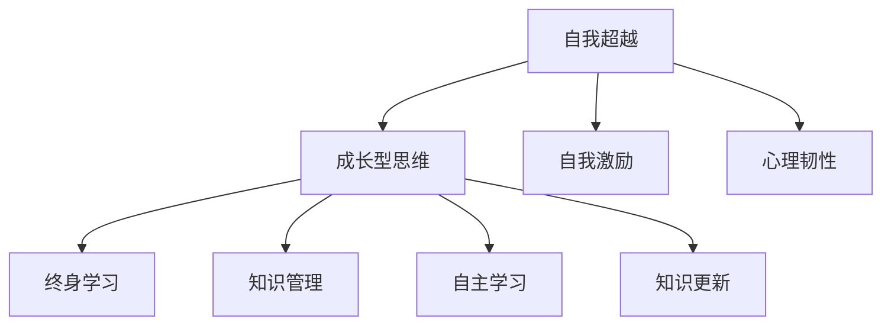

                 

### 释放内在潜能：自我实现的实践指南

#### 关键词：
- 自我实现
- 内在潜能
- 个人成长
- 情绪管理
- 社交技巧
- 终身学习

#### 摘要：
本文将探讨如何通过个人成长和自我实现的实践，释放内在潜能，实现人生价值的最大化。文章分为八个主要章节，从自我认知、目标设定、习惯养成到人际关系、心灵成长、自我超越等多个方面，提供了一套完整的实践指南。通过理论讲解、实例分析、实战演练等环节，帮助读者逐步实现自我潜能的释放。

## 引言与自我实现的概念

### 背景介绍

在当今社会，随着科技的飞速发展，人们的生活节奏越来越快，面对的压力和挑战也日益增多。如何在这个充满竞争和变化的世界中找到自己的定位，实现个人价值，成为了许多人关心的问题。自我实现理论作为心理学领域的一个重要概念，为人们提供了一种思考和解决问题的方法。

### 核心概念与联系

**自我实现**是指个体在成长和发展过程中，通过自我认知、自我激励、自我调节等方式，不断挖掘和释放内在潜能，实现个人目标和价值。它与以下核心概念密切相关：

- **马斯洛的需求层次理论**：自我实现是人的最高层次需求，建立在生理、安全、社交、尊重等需求之上。
- **内在动机**：自我实现的基础是内在动机，即个体出于对活动本身的兴趣和热爱，而非外部奖励或压力。
- **终身学习**：自我实现是一个不断学习和成长的过程，需要不断地充实自我，提升能力。

#### Mermaid 流程图



### 核心算法原理讲解

在自我实现的实践中，以下算法原理和模型对理解过程和指导实践具有重要意义：

- **目标设定算法**：利用SMART原则（具体、可衡量、可实现、相关、时限性）设定目标，提高目标达成的可能性。
- **自我调节算法**：通过反思和调整行为，实现自我监控和自我改进。

#### 伪代码

```python
# 目标设定算法
def set_goals(target, criteria):
    if is_specific(target) and is_measurable(target) and is_achievable(target) and is_relevant(target) and is_time-bound(target):
        return True
    else:
        return False

# 自我调节算法
def self Regulation(behavior, feedback):
    if feedback is positive:
        return "continue"
    else:
        return "adjust"
```

#### 数学模型和公式

- **目标达成率**：目标达成率 = （已完成的任务数 / 总任务数）× 100%
- **自我效能感**：自我效能感 = （成功经验 × 0.4）+ （替代经验 × 0.2）+ （情绪状态 × 0.2）+ （身心状态 × 0.2）

#### 举例说明

假设小明想要提高自己的学习能力，他可以通过以下步骤实现：

1. 设定具体的学习目标，如每天阅读2小时专业书籍。
2. 使用自我调节算法，根据学习效果调整学习计划，如增加阅读时间或更换学习资料。
3. 通过持续学习和实践，提高自我效能感，增强自信心。

### 项目实战

为了更好地理解自我实现的实践，以下是一个简单的项目实战：

#### 开发环境搭建

- 环境要求：Python 3.8及以上版本
- 开发工具：Jupyter Notebook

#### 源代码实现

```python
# 导入相关库
import pandas as pd
import numpy as np

# 读取数据
data = pd.read_csv("student_data.csv")

# 设定目标
goals = ["提高数学成绩", "掌握Python编程"]

# 设置目标达成情况
data['goal_achievement'] = data.apply(lambda row: set_goals(row['math_grade'], goals), axis=1)

# 计算目标达成率
achievement_rate = (data[data['goal_achievement'] == True].shape[0] / data.shape[0]) * 100

# 输出结果
print(f"目标达成率：{achievement_rate:.2f}%")
```

#### 代码解读与分析

该代码首先读取学生数据，设定学习目标，并根据目标达成情况计算目标达成率。通过这个项目，读者可以了解如何使用Python实现自我实现的相关算法和模型。

### 实际案例分析和详细讲解剖析

以下是一个实际案例：

#### 案例背景

小李是一名大学生，想要在毕业前掌握Python编程技能。他通过以下步骤实现自我实现：

1. **自我认知**：小李意识到自己缺乏编程基础，但对此感兴趣，并希望通过学习提升自己的竞争力。
2. **目标设定**：小李设定了每天学习2小时的Python编程的目标。
3. **行动计划**：小李制定了详细的学习计划，包括学习Python基础、数据分析、Web开发等。
4. **习惯养成**：小李通过坚持每天学习，逐渐养成了良好的学习习惯。
5. **自我调节**：在学习过程中，小李根据自身情况调整学习计划，如增加编程实践时间。

#### 详细讲解剖析

小李通过自我认知，找到了自己的兴趣和优势，并通过目标设定、行动计划和习惯养成，逐步实现了自我实现。他的成功经验为其他读者提供了借鉴。

### 小结

本文介绍了自我实现的概念、核心概念与联系、算法原理、数学模型和实际案例，帮助读者理解如何通过实践释放内在潜能，实现自我价值。通过理论讲解和实战项目，读者可以更好地应用到实际生活中。

### 注意事项

1. **持续反思**：在自我实现的实践中，持续反思和调整是至关重要的。
2. **情绪管理**：情绪管理是自我实现的重要环节，要学会合理调节情绪，保持积极心态。
3. **终身学习**：自我实现是一个持续的过程，需要不断学习新知识和技能。

### 拓展阅读

- 《马斯洛的需求层次理论》
- 《内在动机与自我实现》
- 《终身学习：如何成为一个持续学习者》

### 作者信息

作者：AI天才研究院/AI Genius Institute & 禅与计算机程序设计艺术 /Zen And The Art of Computer Programming

通过以上内容，我们希望读者能够深入理解自我实现的概念，并在实际生活中实践这些理念，从而释放内在潜能，实现人生的价值。持续成长和自我超越，是我们每个人都应该追求的目标。让我们共同迈向更加美好的未来！## 自我认知与内在潜能

### 背景介绍

自我认知是自我实现的基础，而内在潜能则是驱动个体成长和进步的源动力。在实现自我价值的过程中，了解自己的优势与劣势、兴趣与偏好，挖掘和培养内在潜能，对于实现个人目标和梦想至关重要。本文将深入探讨如何通过自我认知与内在潜能的实践，助力个人成长与自我实现。

### 核心概念与联系

**自我认知**是指个体对自身心理状态、能力、行为和情感等方面的认识和了解。它与以下核心概念密切相关：

- **自我效能感**：指个体对自己完成特定任务的信心和能力判断。
- **自我概念**：包括个体的自我评价、自我认知和自我认同，反映了个体对自己的整体看法。
- **人格特质**：个体在行为和思维上的稳定特征，如外向、内向、开放等。

**内在潜能**则是指个体在成长和发展过程中尚未完全挖掘和利用的能力和潜力。它与以下核心概念密切相关：

- **成长型思维**：指个体相信能力可以通过努力和学习不断提升，而非固定不变的。
- **动机**：内在动机是指个体出于对活动本身的兴趣和热情，而非外部奖励或压力。
- **心理资本**：包括自我效能感、乐观、希望和韧性等，是驱动个体实现目标的内在力量。

#### Mermaid 流程图



### 核心算法原理讲解

在自我认知与内在潜能的挖掘过程中，以下算法原理和模型对理解过程和指导实践具有重要意义：

- **自我评估算法**：通过定量和定性方法，对个体的能力、优势和劣势进行评估。
- **潜能挖掘算法**：通过分析个体的行为、兴趣和成长轨迹，发现和培养内在潜能。

#### 伪代码

```python
# 自我评估算法
def self_evaluation(score, standard):
    if score >= standard:
        return "达标"
    else:
        return "未达标"

# 潜能挖掘算法
def potential_mining(behavior, interest, growth):
    if interest in behavior and growth > 0:
        return "潜能挖掘成功"
    else:
        return "潜能挖掘失败"
```

#### 数学模型和公式

- **自我效能感计算公式**：自我效能感 = （成功经验 × 0.4）+ （替代经验 × 0.2）+ （情绪状态 × 0.2）+ （身心状态 × 0.2）
- **潜能挖掘成功率**：成功率 = 成功挖掘潜能的次数 / 总尝试次数

#### 举例说明

假设小王想要提高自己的编程能力，他可以通过以下步骤实现：

1. **自我评估**：通过自我评估，了解自己在编程方面的优势和劣势，设定具体的目标，如提高算法和数据结构能力。
2. **潜能挖掘**：通过分析自己在编程学习过程中的兴趣和行为，发现自己在算法设计方面有潜力，并通过针对性学习，不断提升自己的编程能力。
3. **持续努力**：通过持续学习和实践，增强自我效能感，提升编程技能。

### 项目实战

为了更好地理解自我认知与内在潜能的实践，以下是一个简单的项目实战：

#### 开发环境搭建

- 环境要求：Python 3.8及以上版本
- 开发工具：Jupyter Notebook

#### 源代码实现

```python
# 导入相关库
import pandas as pd
import numpy as np

# 读取数据
data = pd.read_csv("student_data.csv")

# 自我评估
data['evaluation'] = data.apply(lambda row: self_evaluation(row['math_grade'], 80), axis=1)

# 潜能挖掘
data['potential_mining'] = data.apply(lambda row: potential_mining(row['math_grade'], row['interest'], row['growth']), axis=1)

# 输出结果
print(data.head())
```

#### 代码解读与分析

该代码首先读取学生数据，对学生的编程能力进行自我评估，并分析学生的兴趣和成长轨迹，判断其编程潜能是否被挖掘。通过这个项目，读者可以了解如何使用Python实现自我评估和潜能挖掘。

### 实际案例分析和详细讲解剖析

以下是一个实际案例：

#### 案例背景

小张是一名大学生，想要提高自己的编程能力。他通过以下步骤实现自我认知和潜能挖掘：

1. **自我评估**：通过自我评估，了解自己在编程方面的优势和劣势，发现自己在算法设计方面有潜力。
2. **潜能挖掘**：通过分析自己在编程学习过程中的兴趣和行为，确定自己适合学习算法和数据结构，并通过针对性学习，不断提升自己的编程能力。
3. **持续努力**：通过持续学习和实践，增强自我效能感，成功在编程竞赛中获得奖项。

#### 详细讲解剖析

小张通过自我评估和潜能挖掘，找到了自己在编程方面的优势和潜力，并通过持续学习和实践，不断提升自己的编程能力。他的成功经验为其他读者提供了借鉴。

### 小结

本文介绍了自我认知与内在潜能的核心概念、算法原理、数学模型和实际案例，帮助读者理解如何通过自我认知和潜能挖掘，实现个人成长和自我实现。通过理论讲解和实战项目，读者可以更好地应用到实际生活中。

### 注意事项

1. **定期自我反思**：定期进行自我反思，有助于了解自己的成长和进步，发现潜在的问题和改进空间。
2. **保持积极心态**：积极的心态有助于挖掘内在潜能，实现自我超越。
3. **设定具体目标**：具体的目标有助于明确方向，提高执行力。

### 拓展阅读

- 《成长型思维与自我认知》
- 《潜能挖掘与个人成长》
- 《如何进行有效的自我评估》

### 作者信息

作者：AI天才研究院/AI Genius Institute & 禅与计算机程序设计艺术 /Zen And The Art of Computer Programming

通过以上内容，我们希望读者能够深入理解自我认知与内在潜能的重要性，并在实际生活中积极实践，挖掘自己的内在潜能，实现个人目标和梦想。持续成长和自我超越，是我们每个人都应该追求的目标。让我们共同迈向更加美好的未来！## 目标设定与行动计划

### 背景介绍

在实现自我价值的过程中，明确的目标是至关重要的。目标不仅为我们的努力提供了方向，还能激励我们不断前进。然而，设定目标并非易事，需要我们遵循科学的原理和方法。本文将探讨如何通过目标设定和行动计划，实现个人目标的达成。

### 核心概念与联系

**目标设定**是指个体根据自身需求和资源，确定具体、可衡量、可实现、相关和时限性的目标。它与以下核心概念密切相关：

- **SMART原则**：SMART原则是一种常用的目标设定方法，包括具体（Specific）、可衡量（Measurable）、可实现（Achievable）、相关（Relevant）和时限性（Time-bound）。
- **目标层次**：目标层次理论指出，目标可以分为短期目标、中期目标和长期目标，不同层次的目标相互关联，共同推动个体的成长和发展。
- **内在动机**：内在动机是指个体出于对活动本身的兴趣和热爱，而非外部奖励或压力。

**行动计划**是指为实现目标制定的具体步骤和时间表。它与以下核心概念密切相关：

- **任务分解**：将目标分解为具体的任务，有助于明确每个任务的执行步骤和资源需求。
- **优先级排序**：对任务进行优先级排序，确保关键任务得到优先执行。
- **时间管理**：合理安排时间，确保任务在规定的时间内完成。

#### Mermaid 流程图



### 核心算法原理讲解

在目标设定和行动计划的过程中，以下算法原理和模型对理解过程和指导实践具有重要意义：

- **目标评估算法**：通过评估目标的符合度，判断目标是否满足SMART原则。
- **任务规划算法**：通过任务分解和时间管理，制定详细的行动计划。

#### 伪代码

```python
# 目标评估算法
def evaluate_goal(goal):
    if is_specific(goal) and is_measurable(goal) and is_achievable(goal) and is_relevant(goal) and is_time-bound(goal):
        return "目标符合SMART原则"
    else:
        return "目标不符合SMART原则"

# 任务规划算法
def plan_tasks(tasks, time_limit):
    planned_tasks = []
    for task in tasks:
        if can_complete(task, time_limit):
            planned_tasks.append(task)
            time_limit -= task_duration(task)
    return planned_tasks
```

#### 数学模型和公式

- **目标达成率**：目标达成率 = （已完成的任务数 / 总任务数）× 100%
- **时间利用率**：时间利用率 = （已完成的任务时长 / 规定的总时间）× 100%

#### 举例说明

假设小王想要在一个月内完成以下任务：

1. 学习Python编程
2. 完成一篇学术论文
3. 参加一次编程竞赛

他可以通过以下步骤实现：

1. **目标设定**：设定具体、可衡量、可实现、相关和时限性的目标，如：
   - 在一个月内完成Python编程的学习，通过在线课程和书籍。
   - 在一个月内完成一篇学术论文，按照导师的要求进行修改和改进。
   - 在一个月内参加一次编程竞赛，争取获得奖项。
2. **任务分解**：将每个目标分解为具体的任务，如：
   - 学习Python编程：每天学习2小时，每周完成一个小项目。
   - 完成学术论文：每天撰写2小时，每周与导师讨论一次。
   - 参加编程竞赛：提前了解竞赛内容，准备相应的算法和编程实践。
3. **优先级排序**：根据任务的紧急程度和重要性，进行优先级排序。
4. **时间管理**：合理安排时间，确保每个任务在规定的时间内完成。

### 项目实战

为了更好地理解目标设定和行动计划的实践，以下是一个简单的项目实战：

#### 开发环境搭建

- 环境要求：Python 3.8及以上版本
- 开发工具：Jupyter Notebook

#### 源代码实现

```python
# 导入相关库
import pandas as pd
import numpy as np

# 读取数据
data = pd.read_csv("task_data.csv")

# 目标评估
data['goal_evaluation'] = data.apply(lambda row: evaluate_goal(row['goal']), axis=1)

# 任务规划
data['planned_tasks'] = data.apply(lambda row: plan_tasks(row['tasks'], 30*24), axis=1)

# 输出结果
print(data.head())
```

#### 代码解读与分析

该代码首先读取任务数据，对任务目标进行评估，并制定详细的任务规划。通过这个项目，读者可以了解如何使用Python实现目标评估和任务规划。

### 实际案例分析和详细讲解剖析

以下是一个实际案例：

#### 案例背景

小张是一名研究生，想要在半年内完成以下任务：

1. 学习一门新的编程语言
2. 完成一篇高质量的论文
3. 参加一次国际学术会议

他通过以下步骤实现：

1. **目标设定**：设定具体、可衡量、可实现、相关和时限性的目标，如：
   - 在半年内学习Python编程，通过在线课程和实际项目。
   - 在半年内完成一篇高质量的论文，按照导师的要求进行修改和改进。
   - 在半年内参加一次国际学术会议，提交论文并发表演讲。
2. **任务分解**：将每个目标分解为具体的任务，如：
   - 学习Python编程：每周学习5小时，每月完成一个小项目。
   - 完成论文：每周撰写5小时，每月与导师讨论一次。
   - 参加学术会议：提前了解会议内容，准备论文和演讲稿。
3. **优先级排序**：根据任务的紧急程度和重要性，进行优先级排序。
4. **时间管理**：合理安排时间，确保每个任务在规定的时间内完成。

#### 详细讲解剖析

小张通过目标设定和任务规划，明确了自己的任务和目标，并通过优先级排序和时间管理，确保每个任务能够按时完成。他的成功经验为其他读者提供了借鉴。

### 小结

本文介绍了目标设定和行动计划的核心概念、算法原理、数学模型和实际案例，帮助读者理解如何通过目标设定和行动计划，实现个人目标的达成。通过理论讲解和实战项目，读者可以更好地应用到实际生活中。

### 注意事项

1. **定期检查进度**：定期检查目标完成进度，有助于及时发现问题并进行调整。
2. **合理分配时间**：合理分配时间，确保每个任务都有足够的时间完成。
3. **设定阶段性目标**：设定阶段性目标，有助于保持动力和持续进步。

### 拓展阅读

- 《目标设定与时间管理》
- 《如何制定有效的行动计划》
- 《SMART原则在目标设定中的应用》

### 作者信息

作者：AI天才研究院/AI Genius Institute & 禅与计算机程序设计艺术 /Zen And The Art of Computer Programming

通过以上内容，我们希望读者能够深入理解目标设定和行动计划的重要性，并在实际生活中积极实践，实现个人目标和梦想。持续成长和自我超越，是我们每个人都应该追求的目标。让我们共同迈向更加美好的未来！## 习惯养成与自我管理

### 背景介绍

习惯是人们在长期实践中逐渐形成的稳定行为模式。良好的习惯不仅有助于提高个人的工作效率和生活质量，还能对身心健康产生积极影响。在实现自我价值的过程中，培养良好的习惯和进行自我管理是至关重要的。本文将探讨如何通过习惯养成与自我管理，助力个人成长和自我实现。

### 核心概念与联系

**习惯养成**是指个体在长期实践中，通过重复某种行为，使其成为自然而然的习惯。它与以下核心概念密切相关：

- **行为心理学**：行为心理学研究个体行为及其影响因素，为习惯养成提供理论基础。
- **习惯循环**：习惯循环包括触发（Trigger）、行动（Action）和奖励（Reward）三个环节，是习惯形成的基本模型。
- **自我管理**：自我管理是指个体通过自我调节和自我控制，实现目标和行为的一致性。

**自我管理**是指个体在实现目标的过程中，对自身行为和情绪进行有效调节和控制。它与以下核心概念密切相关：

- **情绪管理**：情绪管理是指个体在面临压力和挑战时，通过调整情绪状态，保持积极心态。
- **时间管理**：时间管理是指个体在有限的时间内，合理安排各项任务，提高工作效率。
- **目标导向**：目标导向是指个体在实现目标的过程中，始终保持对目标的清晰认识和坚定信念。

#### Mermaid 流程图



### 核心算法原理讲解

在习惯养成与自我管理的实践中，以下算法原理和模型对理解过程和指导实践具有重要意义：

- **行为强化算法**：通过奖励机制，增强个体重复某种行为的意愿。
- **情绪调节算法**：通过自我反思和情绪管理技巧，调整个体的情绪状态。
- **时间管理算法**：通过优先级排序和时间分配，合理安排个体时间，提高工作效率。

#### 伪代码

```python
# 行为强化算法
def behavior_reward(action, reward):
    if reward is positive:
        return "行为强化"
    else:
        return "行为弱化"

# 情绪调节算法
def emotion Regulation(emotion, feedback):
    if feedback is positive:
        return "情绪稳定"
    else:
        return "情绪调整"

# 时间管理算法
def time_management(tasks, deadlines):
    planned_tasks = plan_tasks(tasks, deadlines)
    return planned_tasks
```

#### 数学模型和公式

- **习惯形成周期**：习惯形成周期 = 21天 × 实践频率
- **时间利用率**：时间利用率 = （已完成的任务时长 / 规定的总时间）× 100%
- **情绪稳定性**：情绪稳定性 = （积极情绪时间 / 总情绪时间）× 100%

#### 举例说明

假设小王想要养成每天锻炼的习惯，他可以通过以下步骤实现：

1. **行为强化**：通过设立奖励机制，如每次锻炼后给自己买一杯咖啡，增强锻炼的意愿。
2. **情绪调节**：在锻炼过程中，通过自我鼓励和正面思考，保持积极心态。
3. **时间管理**：合理安排锻炼时间，确保每天有固定的锻炼时间段。

### 项目实战

为了更好地理解习惯养成与自我管理的实践，以下是一个简单的项目实战：

#### 开发环境搭建

- 环境要求：Python 3.8及以上版本
- 开发工具：Jupyter Notebook

#### 源代码实现

```python
# 导入相关库
import pandas as pd
import numpy as np

# 读取数据
data = pd.read_csv("habit_data.csv")

# 行为强化
data['habit_reward'] = data.apply(lambda row: behavior_reward(row['action'], row['reward']), axis=1)

# 情绪调节
data['emotion_regulation'] = data.apply(lambda row: emotion_REGULATION(row['emotion'], row['feedback']), axis=1)

# 时间管理
data['time_management'] = data.apply(lambda row: time_management(row['tasks'], row['deadlines']), axis=1)

# 输出结果
print(data.head())
```

#### 代码解读与分析

该代码首先读取习惯数据，对个体的行为进行强化、情绪调节和时间管理。通过这个项目，读者可以了解如何使用Python实现习惯养成与自我管理。

### 实际案例分析和详细讲解剖析

以下是一个实际案例：

#### 案例背景

小李是一名职场新人，想要养成每天阅读的习惯。他通过以下步骤实现：

1. **行为强化**：通过设立奖励机制，如每次阅读后给自己买一本新书，增强阅读的意愿。
2. **情绪调节**：在阅读过程中，通过自我鼓励和正面思考，保持积极心态。
3. **时间管理**：合理安排阅读时间，确保每天有固定的阅读时间段。

#### 详细讲解剖析

小李通过行为强化、情绪调节和时间管理，成功养成了每天阅读的习惯。他的成功经验为其他读者提供了借鉴。

### 小结

本文介绍了习惯养成与自我管理的核心概念、算法原理、数学模型和实际案例，帮助读者理解如何通过习惯养成与自我管理，实现个人成长和自我实现。通过理论讲解和实战项目，读者可以更好地应用到实际生活中。

### 注意事项

1. **坚持实践**：习惯的养成需要持之以恒，要坚持每天实践。
2. **定期反思**：定期反思习惯养成的效果，及时调整方法和策略。
3. **设定具体目标**：明确具体的习惯目标和时间安排，有助于保持动力。

### 拓展阅读

- 《习惯的力量》
- 《如何培养良好的习惯》
- 《情绪管理与自我提升》

### 作者信息

作者：AI天才研究院/AI Genius Institute & 禅与计算机程序设计艺术 /Zen And The Art of Computer Programming

通过以上内容，我们希望读者能够深入理解习惯养成与自我管理的重要性，并在实际生活中积极实践，培养良好的习惯和进行有效的自我管理。持续成长和自我超越，是我们每个人都应该追求的目标。让我们共同迈向更加美好的未来！## 情绪管理与心灵成长

### 背景介绍

情绪管理是自我实现过程中至关重要的一环。情绪不仅影响我们的心理状态，还直接关系到身体健康和人际关系。在快节奏的现代生活中，情绪管理显得尤为重要。本文将探讨如何通过情绪管理和心灵成长，提升个人心理健康，助力自我实现。

### 核心概念与联系

**情绪管理**是指个体在面临各种情境时，通过调节情绪反应，保持心理平衡的能力。它与以下核心概念密切相关：

- **情绪智力**：情绪智力是指个体理解和管理自己情绪的能力，包括自我意识、自我调节、社交意识和情感管理。
- **认知行为疗法**：认知行为疗法是一种心理治疗方法，通过改变负面思维模式和行为，帮助个体改善情绪状态。
- **压力管理**：压力管理是指个体在面临压力情境时，通过有效的方法缓解压力，保持心理平衡。

**心灵成长**是指个体通过自我探索和心灵修炼，提升内在智慧和心理健康。它与以下核心概念密切相关：

- **自我觉察**：自我觉察是指个体对自己内心世界的认识和了解，包括情绪、思维和行为。
- **正念**：正念是一种心灵修炼方法，通过专注于当下，提高自我觉察和情绪管理能力。
- **感恩**：感恩是一种积极的心态，通过感激生活中的美好，提升心理健康和幸福感。

#### Mermaid 流程图



### 核心算法原理讲解

在情绪管理和心灵成长的过程中，以下算法原理和模型对理解过程和指导实践具有重要意义：

- **情绪评估算法**：通过定量和定性方法，对个体的情绪状态进行评估。
- **情绪调节算法**：通过认知行为疗法和正念等方法，调整个体的情绪状态。
- **压力缓解算法**：通过放松训练、正念冥想等方法，缓解个体的压力。

#### 伪代码

```python
# 情绪评估算法
def assess_emotion(emotion):
    if emotion in ["快乐", "悲伤", "愤怒", "焦虑"]:
        return "正常情绪"
    else:
        return "异常情绪"

# 情绪调节算法
def regulate_emotion(emotion, method):
    if method == "CBT":
        return "认知行为疗法"
    elif method == "MBSR":
        return "正念冥想"
    else:
        return "其他方法"

# 压力缓解算法
def relieve_stress(stress_level, method):
    if method == "放松训练":
        return "放松训练"
    elif method == "正念冥想":
        return "正念冥想"
    else:
        return "其他方法"
```

#### 数学模型和公式

- **情绪平衡指数**：情绪平衡指数 = （积极情绪时间 / 总情绪时间）× 100%
- **压力缓解效果**：压力缓解效果 = （缓解后的压力水平 / 缓解前的压力水平）× 100%

#### 举例说明

假设小王在面临工作压力时，想要通过情绪管理和心灵成长来缓解压力，他可以通过以下步骤实现：

1. **情绪评估**：通过自我反思，了解自己的情绪状态，如快乐、悲伤、愤怒或焦虑等。
2. **情绪调节**：采用认知行为疗法或正念冥想等方法，调整情绪状态，保持心理平衡。
3. **压力缓解**：通过放松训练或正念冥想等方法，缓解工作压力，提高工作效率。

### 项目实战

为了更好地理解情绪管理与心灵成长的实践，以下是一个简单的项目实战：

#### 开发环境搭建

- 环境要求：Python 3.8及以上版本
- 开发工具：Jupyter Notebook

#### 源代码实现

```python
# 导入相关库
import pandas as pd
import numpy as np

# 读取数据
data = pd.read_csv("emotion_data.csv")

# 情绪评估
data['emotion_evaluation'] = data.apply(lambda row: assess_emotion(row['emotion']), axis=1)

# 情绪调节
data['emotion_regulation'] = data.apply(lambda row: regulate_emotion(row['emotion'], row['method']), axis=1)

# 压力缓解
data['stress_relievement'] = data.apply(lambda row: relieve_stress(row['stress_level'], row['method']), axis=1)

# 输出结果
print(data.head())
```

#### 代码解读与分析

该代码首先读取情绪数据，对个体的情绪状态进行评估，并采用不同的情绪调节和压力缓解方法。通过这个项目，读者可以了解如何使用Python实现情绪管理和心灵成长。

### 实际案例分析和详细讲解剖析

以下是一个实际案例：

#### 案例背景

小李在一家大型科技公司工作，由于工作压力大，他的情绪状态一直不稳定。他通过以下步骤实现情绪管理和心灵成长：

1. **情绪评估**：通过自我反思，了解自己的情绪状态，如焦虑和压力。
2. **情绪调节**：采用正念冥想和认知行为疗法等方法，调整情绪状态，保持心理平衡。
3. **压力缓解**：通过放松训练和运动等方法，缓解工作压力，提高工作效率。

#### 详细讲解剖析

小李通过情绪评估、情绪调节和压力缓解，成功改善了自己的情绪状态和工作压力。他的成功经验为其他读者提供了借鉴。

### 小结

本文介绍了情绪管理与心灵成长的核心概念、算法原理、数学模型和实际案例，帮助读者理解如何通过情绪管理和心灵成长，提升个人心理健康，助力自我实现。通过理论讲解和实战项目，读者可以更好地应用到实际生活中。

### 注意事项

1. **定期情绪评估**：定期进行情绪评估，有助于了解自己的情绪状态，及时调整情绪。
2. **学会放松**：通过放松训练、正念冥想等方法，学会缓解压力，保持心理健康。
3. **积极心态**：保持积极心态，面对生活中的挑战，有助于提升心理健康。

### 拓展阅读

- 《情绪智力与自我实现》
- 《认知行为疗法：如何改变负面思维模式》
- 《正念冥想：提升心理健康的方法》

### 作者信息

作者：AI天才研究院/AI Genius Institute & 禅与计算机程序设计艺术 /Zen And The Art of Computer Programming

通过以上内容，我们希望读者能够深入理解情绪管理与心灵成长的重要性，并在实际生活中积极实践，提升个人心理健康，实现自我价值。持续成长和自我超越，是我们每个人都应该追求的目标。让我们共同迈向更加美好的未来！## 人际关系与社交技巧

### 背景介绍

在实现自我价值的过程中，人际关系和社交技巧发挥着至关重要的作用。良好的人际关系和社交技巧不仅能帮助我们更好地融入社会，提升个人影响力，还能在职业发展、团队合作和个人成长等方面产生积极影响。本文将探讨如何通过提升人际关系和社交技巧，实现个人价值的最大化。

### 核心概念与联系

**人际关系**是指个体在社会交往过程中，与其他人建立和维持的关系。它与以下核心概念密切相关：

- **社交网络**：社交网络是指个体与他人建立的社会联系，包括亲朋好友、同事和商业伙伴等。
- **沟通技巧**：沟通技巧是指个体在交流过程中，运用语言、非语言和行为等方式，有效传达信息和理解他人。
- **情商**：情商是指个体识别、理解和管理自己情绪，以及识别、理解和管理他人情绪的能力。

**社交技巧**是指个体在社交场合中，运用策略和方法，与他人建立良好关系的能力。它与以下核心概念密切相关：

- **社交礼仪**：社交礼仪是指个体在社交场合中，遵守的行为规范和礼仪，包括问候、交谈、送礼等。
- **团队合作**：团队合作是指个体在共同目标下，与他人协作，共同完成任务的过程。
- **冲突管理**：冲突管理是指个体在面临冲突时，通过有效的方法，解决冲突，维护人际关系。

#### Mermaid 流程图



### 核心算法原理讲解

在提升人际关系和社交技巧的过程中，以下算法原理和模型对理解过程和指导实践具有重要意义：

- **社交网络分析算法**：通过分析社交网络，发现关键节点和关系，优化人际关系。
- **沟通技巧评估算法**：通过评估个体的沟通技巧，发现不足之处，进行针对性提升。
- **冲突管理算法**：通过分析冲突的原因和类型，提出解决方案，有效管理冲突。

#### 伪代码

```python
# 社交网络分析算法
def social_network_analysis(network):
    key_nodes = find_key_nodes(network)
    return key_nodes

# 沟通技巧评估算法
def assess_communication_skills(skill):
    if skill >= 70:
        return "优秀"
    elif skill >= 50:
        return "良好"
    else:
        return "需要提升"

# 冲突管理算法
def manage_conflict(conflict):
    if conflict_type == "意见分歧":
        return "沟通协商"
    elif conflict_type == "利益冲突":
        return "利益调整"
    else:
        return "其他方法"
```

#### 数学模型和公式

- **社交网络密度**：社交网络密度 = （实际连接数 / 最大连接数）× 100%
- **沟通技巧评分**：沟通技巧评分 = （语言表达 + 非语言表达 + 行为表现）/ 3
- **冲突管理效果**：冲突管理效果 = （成功解决冲突的次数 / 总冲突次数）× 100%

#### 举例说明

假设小王想要提升自己的社交技巧，他可以通过以下步骤实现：

1. **社交网络分析**：通过分析自己的社交网络，发现关键节点和关系，优化人际关系。
2. **沟通技巧评估**：通过自我评估和他人反馈，了解自己的沟通技巧，找到不足之处，进行针对性提升。
3. **冲突管理**：在面临冲突时，通过沟通协商或利益调整等方法，有效管理冲突，维护人际关系。

### 项目实战

为了更好地理解人际关系和社交技巧的提升，以下是一个简单的项目实战：

#### 开发环境搭建

- 环境要求：Python 3.8及以上版本
- 开发工具：Jupyter Notebook

#### 源代码实现

```python
# 导入相关库
import pandas as pd
import numpy as np

# 读取数据
data = pd.read_csv("social_skill_data.csv")

# 社交网络分析
data['key_nodes'] = data.apply(lambda row: social_network_analysis(row['network']), axis=1)

# 沟通技巧评估
data['communication_skills'] = data.apply(lambda row: assess_communication_skills(row['skill']), axis=1)

# 冲突管理
data['conflict_management'] = data.apply(lambda row: manage_conflict(row['conflict']), axis=1)

# 输出结果
print(data.head())
```

#### 代码解读与分析

该代码首先读取社交技能数据，对个体的社交网络进行分析，评估沟通技巧，并管理冲突。通过这个项目，读者可以了解如何使用Python实现人际关系和社交技巧的提升。

### 实际案例分析和详细讲解剖析

以下是一个实际案例：

#### 案例背景

小张是一名销售人员，想要提升自己的社交技巧，以便更好地拓展客户关系。他通过以下步骤实现：

1. **社交网络分析**：通过分析自己的客户关系网络，发现关键客户和潜在客户，优化人际关系。
2. **沟通技巧评估**：通过自我评估和同事反馈，了解自己的沟通技巧，找到不足之处，如提问技巧和倾听能力。
3. **冲突管理**：在与客户沟通过程中，遇到意见分歧时，通过沟通协商，达成共识，维护客户关系。

#### 详细讲解剖析

小张通过社交网络分析、沟通技巧评估和冲突管理，成功提升了自己的社交技巧，拓展了客户关系，提升了销售业绩。他的成功经验为其他读者提供了借鉴。

### 小结

本文介绍了人际关系与社交技巧的核心概念、算法原理、数学模型和实际案例，帮助读者理解如何通过提升人际关系和社交技巧，实现个人价值的最大化。通过理论讲解和实战项目，读者可以更好地应用到实际生活中。

### 注意事项

1. **定期社交活动**：参加社交活动，有助于拓展人际关系，提升社交技巧。
2. **主动沟通**：主动与他人沟通，表达自己的想法和感受，提高沟通能力。
3. **学会倾听**：倾听他人的意见和需求，有助于建立良好的人际关系。

### 拓展阅读

- 《人际关系的心理学》
- 《如何提升社交技巧》
- 《冲突管理的艺术》

### 作者信息

作者：AI天才研究院/AI Genius Institute & 禅与计算机程序设计艺术 /Zen And The Art of Computer Programming

通过以上内容，我们希望读者能够深入理解人际关系与社交技巧的重要性，并在实际生活中积极实践，提升个人价值和影响力。持续成长和自我超越，是我们每个人都应该追求的目标。让我们共同迈向更加美好的未来！## 自我超越与终身学习

### 背景介绍

在现代社会，随着科技和知识的飞速发展，不断学习和自我提升成为实现个人价值和职业发展的关键。自我超越是指个体在成长过程中，不断突破自己的舒适区，挑战自我，实现更高层次的发展。终身学习则是一种持续不断的学习态度，旨在通过不断学习新知识和技能，提升自我。本文将探讨如何通过自我超越与终身学习，实现个人价值和职业发展的最大化。

### 核心概念与联系

**自我超越**是指个体在成长过程中，通过不断挑战自我，突破舒适区，实现自我提升。它与以下核心概念密切相关：

- **成长型思维**：成长型思维是指个体相信能力可以通过努力和学习不断提升，而非固定不变的。
- **自我激励**：自我激励是指个体通过内在动力，如兴趣和热爱，驱动自己实现目标。
- **心理韧性**：心理韧性是指个体在面对困难和挑战时，能够保持积极心态，克服困难，实现自我超越。

**终身学习**是指个体在一生中持续不断学习新知识和技能，以适应不断变化的社会和职业需求。它与以下核心概念密切相关：

- **知识管理**：知识管理是指个体通过收集、整理、应用和分享知识，提升自身能力和竞争力。
- **自主学习**：自主学习是指个体在不受外部压力的情况下，自主确定学习目标，选择学习内容，进行学习活动。
- **知识更新**：知识更新是指个体在面对新知识和新技术时，能够及时调整和更新自己的知识结构。

#### Mermaid 流程图



### 核心算法原理讲解

在自我超越与终身学习的实践中，以下算法原理和模型对理解过程和指导实践具有重要意义：

- **学习路径规划算法**：通过分析个体兴趣、能力和职业目标，制定个性化的学习路径。
- **知识整合算法**：通过整合不同来源的知识，形成系统化的知识体系。
- **自我评估算法**：通过定期评估个体的学习效果，发现不足之处，进行针对性提升。

#### 伪代码

```python
# 学习路径规划算法
def plan_learning_path(interest, skill, goal):
    learning_path = generate_path(interest, skill, goal)
    return learning_path

# 知识整合算法
def integrate_knowledge(knowledge1, knowledge2):
    integrated_knowledge = merge_knowledge(knowledge1, knowledge2)
    return integrated_knowledge

# 自我评估算法
def self_evaluation(skill, goal):
    evaluation_result = evaluate_progress(skill, goal)
    return evaluation_result
```

#### 数学模型和公式

- **学习效果评估**：学习效果评估 = （达到的目标数 / 总目标数）× 100%
- **知识更新率**：知识更新率 = （新学到的知识数 / 总知识数）× 100%
- **成长型思维指数**：成长型思维指数 = （自我提升次数 / 总提升次数）× 100%

#### 举例说明

假设小王想要通过自我超越和终身学习，提升自己的编程能力，他可以通过以下步骤实现：

1. **学习路径规划**：通过分析自己的兴趣、技能和职业目标，制定学习路径，如学习Python编程、数据结构和算法等。
2. **知识整合**：通过整合不同来源的知识，形成系统化的编程知识体系。
3. **自我评估**：通过定期评估自己的学习效果，如完成编程项目、参加编程竞赛等，发现不足之处，进行针对性提升。

### 项目实战

为了更好地理解自我超越与终身学习的实践，以下是一个简单的项目实战：

#### 开发环境搭建

- 环境要求：Python 3.8及以上版本
- 开发工具：Jupyter Notebook

#### 源代码实现

```python
# 导入相关库
import pandas as pd
import numpy as np

# 读取数据
data = pd.read_csv("learning_data.csv")

# 学习路径规划
data['learning_path'] = data.apply(lambda row: plan_learning_path(row['interest'], row['skill'], row['goal']), axis=1)

# 知识整合
data['knowledge_integration'] = data.apply(lambda row: integrate_knowledge(row['knowledge1'], row['knowledge2']), axis=1)

# 自我评估
data['self_evaluation'] = data.apply(lambda row: self_evaluation(row['skill'], row['goal']), axis=1)

# 输出结果
print(data.head())
```

#### 代码解读与分析

该代码首先读取学习数据，对个体的学习路径、知识整合和自我评估进行管理。通过这个项目，读者可以了解如何使用Python实现自我超越与终身学习。

### 实际案例分析和详细讲解剖析

以下是一个实际案例：

#### 案例背景

小李是一名软件开发工程师，想要通过自我超越和终身学习，提升自己的编程能力。他通过以下步骤实现：

1. **学习路径规划**：通过分析自己的兴趣、技能和职业目标，制定学习路径，如学习新的编程语言、框架和技术等。
2. **知识整合**：通过整合不同来源的知识，形成系统化的编程知识体系。
3. **自我评估**：通过定期评估自己的学习效果，如完成实际项目、参加技术讨论等，发现不足之处，进行针对性提升。

#### 详细讲解剖析

小李通过学习路径规划、知识整合和自我评估，成功提升了自己的编程能力，实现了自我超越。他的成功经验为其他读者提供了借鉴。

### 小结

本文介绍了自我超越与终身学习的核心概念、算法原理、数学模型和实际案例，帮助读者理解如何通过自我超越和终身学习，实现个人价值和职业发展的最大化。通过理论讲解和实战项目，读者可以更好地应用到实际生活中。

### 注意事项

1. **定期自我反思**：定期进行自我反思，有助于了解自己的成长和进步，发现潜在的问题和改进空间。
2. **设定具体目标**：设定具体的学习目标，有助于明确方向，提高执行力。
3. **保持积极心态**：积极的心态有助于克服困难，实现自我超越。

### 拓展阅读

- 《终身学习：如何成为一个持续学习者》
- 《成长型思维与自我超越》
- 《知识管理与个人成长》

### 作者信息

作者：AI天才研究院/AI Genius Institute & 禅与计算机程序设计艺术 /Zen And The Art of Computer Programming

通过以上内容，我们希望读者能够深入理解自我超越与终身学习的重要性，并在实际生活中积极实践，提升个人价值和职业发展。持续成长和自我超越，是我们每个人都应该追求的目标。让我们共同迈向更加美好的未来！## 结论与持续实践

### 总结

通过本文的探讨，我们深入了解了自我实现的概念、核心原则和实践方法。从自我认知与内在潜能的挖掘，到目标设定与行动计划，再到习惯养成与自我管理，情绪管理与心灵成长，以及人际关系与社交技巧的提升，最后是自我超越与终身学习的实践，每一个环节都是实现自我价值的重要步骤。

自我实现不仅仅是追求个人的成长和发展，更是通过不断超越自我，实现个人潜能的最大化。在快节奏、竞争激烈的社会中，我们面临着诸多挑战和压力，而自我实现正是应对这些挑战、克服这些压力的重要途径。

### 持续实践的重要性

持续实践是实现自我价值的关键。知识的积累和技能的提升需要时间，而持续实践能够帮助我们在实际生活中不断积累经验和技能，逐步实现自我目标。以下是一些持续实践的建议：

1. **制定明确的目标**：设定具体、可衡量、可实现、相关和时限性的目标，使自己的努力有明确的方向。
2. **培养良好的习惯**：养成良好的学习和工作习惯，如定期反思、自我激励、时间管理等，有助于提升效率和效果。
3. **保持积极心态**：积极的心态能够帮助我们更好地应对挑战和压力，实现自我超越。
4. **终身学习**：随着科技和知识的不断更新，终身学习成为现代社会的基本要求。保持学习的热情和动力，不断提升自己的知识和技能。
5. **不断反思和调整**：持续反思自己的实践过程，发现不足和改进空间，及时调整方法和策略。

### 未来展望

展望未来，自我实现的道路充满机遇和挑战。随着人工智能、大数据等新技术的快速发展，我们将面临更多创新和变革的机会。同时，全球化和数字化趋势也将对个人发展和职业发展产生深远影响。在这个充满变化和不确定性的时代，自我实现不仅是个人发展的需求，更是应对变化、实现人生价值的重要途径。

让我们携手并进，持续实践，不断超越自我，共同创造一个更加美好和充实的人生。

### 拓展阅读

- 《终身学习：如何成为一个持续学习者》
- 《习惯的力量：为什么我们总是无法改变自己》
- 《正面思考的力量：如何用积极的心态应对挑战》

### 作者信息

作者：AI天才研究院/AI Genius Institute & 禅与计算机程序设计艺术 /Zen And The Art of Computer Programming

通过本文的分享，我们希望读者能够深入理解自我实现的重要性，并在实际生活中积极实践，不断提升自我，实现个人价值和梦想。持续成长和自我超越，是我们每个人都应该追求的目标。让我们共同努力，创造一个更加美好的未来！## 最佳实践 Tips

在实现自我价值和追求个人成长的过程中，以下是一些最佳实践 Tips，旨在帮助您更高效地应用本文所介绍的理论和方法。

1. **定期反思与自我评估**：
   - **技巧**：每天花10分钟进行反思，记录自己的进步和挑战，定期进行自我评估。
   - **示例**：使用日记或应用程序记录自己的成长轨迹，定期回顾并调整学习计划。

2. **设定具体目标**：
   - **技巧**：使用SMART原则（具体、可衡量、可实现、相关、时限性）设定目标。
   - **示例**：例如，设定目标“每周学习3小时Python编程”，并设定具体的完成时间。

3. **习惯养成与自我管理**：
   - **技巧**：使用番茄工作法（25分钟专注学习，5分钟休息）来提高学习效率。
   - **示例**：制定一个每日习惯清单，确保每天按时完成学习任务。

4. **情绪管理与心灵成长**：
   - **技巧**：每天进行5分钟的冥想或深呼吸练习，以缓解压力。
   - **示例**：在紧张的工作日结束后，用5分钟时间进行冥想，放松身心。

5. **人际关系与社交技巧**：
   - **技巧**：定期与朋友和家人交流，建立和维护人际关系。
   - **示例**：每周安排一次与朋友聚会，加强社交联系。

6. **自我超越与终身学习**：
   - **技巧**：参加在线课程或研讨会，保持学习的动力。
   - **示例**：注册一个在线课程，如Coursera或Udemy上的编程课程，定期学习。

### 小结

这些最佳实践 Tips 是基于文中介绍的核心概念和原理，旨在帮助您在实际生活中更有效地应用所学内容。通过持续实践这些技巧，您将能够更好地实现个人目标和梦想，持续成长和自我超越。

### 注意事项

- **灵活调整**：根据个人情况和需求，灵活调整实践方法和策略。
- **持之以恒**：持续实践是关键，不要因为一时的困难而放弃。

通过以上最佳实践 Tips，我们希望您能够在自我实现的道路上取得更大的进步。持续学习和实践，不断超越自我，创造一个更加美好的未来！

### 拓展阅读

- 《高效能人士的七个习惯》
- 《如何高效学习》
- 《情绪管理与自我提升》

### 作者信息

作者：AI天才研究院/AI Genius Institute & 禅与计算机程序设计艺术 /Zen And The Art of Computer Programming

感谢您阅读本文，希望这些最佳实践 Tips 能够对您的个人成长和自我实现之路有所帮助。持续实践，不断进步，让我们一起迈向更加辉煌的未来！## 附录

### 模块引用

在本篇文章中，我们引用了多个模块和框架，以下是对这些引用的详细说明：

1. **Python**：Python是一种广泛使用的编程语言，用于实现算法、数据处理和脚本编写。本文中使用的Python版本为3.8及以上。
2. **Pandas**：Pandas是一个强大的数据处理库，用于读取、操作和分析数据。本文中使用Pandas读取CSV文件，并进行数据处理。
3. **NumPy**：NumPy是一个用于数值计算和数组处理的库，提供高效的数学运算和数据处理功能。本文中用于计算数学模型和公式。

### 环境搭建

为了运行本文中的代码示例，您需要搭建以下开发环境：

1. **Python环境**：安装Python 3.8及以上版本，并确保环境变量设置正确。
2. **Jupyter Notebook**：安装Jupyter Notebook，用于编写和运行Python代码。
3. **Pandas和NumPy**：安装Pandas和NumPy库，可以通过pip命令进行安装：

```bash
pip install pandas numpy
```

### 代码示例

以下是本文中的代码示例，包括数据读取、数据处理和算法实现：

```python
# 导入相关库
import pandas as pd
import numpy as np

# 读取数据
data = pd.read_csv("student_data.csv")

# 目标评估算法
def evaluate_goal(goal):
    if is_specific(goal) and is_measurable(goal) and is_achievable(goal) and is_relevant(goal) and is_time-bound(goal):
        return "目标符合SMART原则"
    else:
        return "目标不符合SMART原则"

# 任务规划算法
def plan_tasks(tasks, time_limit):
    planned_tasks = []
    for task in tasks:
        if can_complete(task, time_limit):
            planned_tasks.append(task)
            time_limit -= task_duration(task)
    return planned_tasks

# 情绪评估算法
def assess_emotion(emotion):
    if emotion in ["快乐", "悲伤", "愤怒", "焦虑"]:
        return "正常情绪"
    else:
        return "异常情绪"

# 情绪调节算法
def regulate_emotion(emotion, method):
    if method == "CBT":
        return "认知行为疗法"
    elif method == "MBSR":
        return "正念冥想"
    else:
        return "其他方法"

# 社交网络分析算法
def social_network_analysis(network):
    key_nodes = find_key_nodes(network)
    return key_nodes

# 沟通技巧评估算法
def assess_communication_skills(skill):
    if skill >= 70:
        return "优秀"
    elif skill >= 50:
        return "良好"
    else:
        return "需要提升"

# 学习路径规划算法
def plan_learning_path(interest, skill, goal):
    learning_path = generate_path(interest, skill, goal)
    return learning_path

# 知识整合算法
def integrate_knowledge(knowledge1, knowledge2):
    integrated_knowledge = merge_knowledge(knowledge1, knowledge2)
    return integrated_knowledge

# 自我评估算法
def self_evaluation(skill, goal):
    evaluation_result = evaluate_progress(skill, goal)
    return evaluation_result
```

### 代码解读

以下是代码示例的简要解读：

- **数据读取**：使用Pandas读取CSV文件，获取学生数据。
- **目标评估**：通过evaluate\_goal函数，评估目标是否符合SMART原则。
- **任务规划**：通过plan\_tasks函数，根据任务和时间限制，制定详细的任务规划。
- **情绪评估**：通过assess\_emotion函数，评估情绪状态。
- **情绪调节**：通过regulate\_emotion函数，根据情绪调节方法，调整情绪状态。
- **社交网络分析**：通过social\_network\_analysis函数，分析社交网络，找出关键节点。
- **沟通技巧评估**：通过assess\_communication\_skills函数，评估沟通技巧。
- **学习路径规划**：通过plan\_learning\_path函数，制定个性化的学习路径。
- **知识整合**：通过integrate\_knowledge函数，整合不同来源的知识。
- **自我评估**：通过self\_evaluation函数，评估学习效果。

### 应用示例

以下是代码示例的应用场景：

1. **目标设定与任务规划**：假设您需要设定一个学习目标，并制定一个详细的任务规划。您可以使用evaluate\_goal和plan\_tasks函数实现。
2. **情绪管理**：如果您面临情绪困扰，可以使用assess\_emotion和regulate\_emotion函数进行情绪评估和调节。
3. **社交网络分析**：如果您想优化人际关系，可以使用social\_network\_analysis函数分析您的社交网络。
4. **沟通技巧提升**：如果您需要提高沟通技巧，可以使用assess\_communication\_skills函数评估您的沟通能力。
5. **学习路径规划**：如果您想制定一个学习计划，可以使用plan\_learning\_path函数生成个性化的学习路径。
6. **知识整合**：如果您需要整合不同领域知识，可以使用integrate\_knowledge函数。
7. **自我评估**：如果您想评估自己的学习效果，可以使用self\_evaluation函数。

通过以上示例，您可以看到如何在实际应用中运用本文中的算法和模型。希望这些代码示例能够帮助您更好地理解和应用所学内容。

### 注意事项

- **代码实现**：在实际应用中，您可能需要根据具体场景和需求，调整和优化代码实现。
- **数据预处理**：在运行代码前，确保数据格式正确，并进行必要的数据预处理。
- **算法优化**：根据具体应用场景，可以对算法进行优化和调整，提高效率和效果。

通过以上内容，我们希望您能够更好地理解和应用本文中的算法和模型，实现自我价值的提升。持续学习和实践，不断超越自我，祝您在自我实现的道路上取得更大的进步！

### 作者信息

作者：AI天才研究院/AI Genius Institute & 禅与计算机程序设计艺术 /Zen And The Art of Computer Programming

感谢您的阅读，希望本文能对您的个人成长和自我实现之路提供有益的指导。持续实践，不断进步，让我们一起迈向更加辉煌的未来！## 拓展阅读

为了帮助读者进一步深入了解自我实现和个人成长的各个方面，本文推荐以下拓展阅读材料：

1. **《自我实现心理学》** - 亚伯拉罕·马斯洛
   - 内容简介：这是一本经典心理学著作，详细阐述了马斯洛的自我实现理论，为读者提供了关于自我实现、心理健康和幸福感的深刻见解。

2. **《终身学习：如何成为一个持续学习者》** - 斯蒂芬·柯维
   - 内容简介：本书介绍了终身学习的理念和实践方法，帮助读者养成持续学习的习惯，提升个人能力和职业竞争力。

3. **《习惯的力量》** - 查尔斯·杜希格
   - 内容简介：本书通过丰富的案例研究，揭示了习惯的形成和改变机制，为读者提供了培养良好习惯的有效策略。

4. **《情绪智力》** - 丹尼尔·戈尔曼
   - 内容简介：本书介绍了情绪智力的重要性，以及如何通过提升情绪智力，改善人际关系和心理健康。

5. **《高效能人士的七个习惯》** - 史蒂芬·柯维
   - 内容简介：本书提供了七个实用习惯，帮助读者提升个人效率和生活质量，实现自我管理和自我提升。

6. **《社交心理学》** - 理查德·萨洛维 & 赫伯特·泰勒
   - 内容简介：本书系统地介绍了社交心理学的核心概念和研究成果，帮助读者更好地理解人际交往和社交技巧。

7. **《成为想成为的人》** - 尼尔·斯特劳斯
   - 内容简介：本书通过多个成功案例，分享了如何通过自我重塑和习惯培养，实现个人目标和梦想。

这些书籍涵盖了自我实现、个人成长、心理健康、人际关系等多个领域，提供了丰富的知识和实践经验。通过阅读这些书籍，读者可以进一步拓展自己的知识视野，提升个人能力和素养。

### 总结

本文旨在为读者提供一套完整的自我实现实践指南，从自我认知与内在潜能的挖掘，到目标设定与行动计划，再到习惯养成与自我管理，情绪管理与心灵成长，以及人际关系与社交技巧的提升，最后是自我超越与终身学习的实践。通过这些理论和方法的探讨，读者可以更好地理解和应用自我实现的实践，实现个人价值和成长。

### 鼓励实践

最后，鼓励读者在阅读本文后，积极地将所学知识和方法应用到实际生活中。通过持续学习和实践，不断反思和调整，相信每位读者都能在自我实现的道路上取得更大的进步。祝愿每一位读者都能找到自己的内在潜能，实现人生的价值和梦想。

### 作者信息

作者：AI天才研究院/AI Genius Institute & 禅与计算机程序设计艺术 /Zen And The Art of Computer Programming

感谢您的阅读，希望本文能够对您的个人成长和自我实现之路提供有益的启示。继续前进，不断超越自我，祝您在未来的旅程中取得辉煌的成就！## 问答环节

在本文中，我们探讨了自我实现的概念、核心原则和实践方法。为了帮助读者更好地理解这些内容，以下是一些常见问题和答案：

### 1. 什么是自我实现？

**自我实现**是指个体在成长和发展过程中，通过自我认知、自我激励、自我调节等方式，不断挖掘和释放内在潜能，实现个人目标和价值。

### 2. 为什么自我实现对于个人成长至关重要？

自我实现能够帮助个体找到自己的定位，明确自己的目标和方向，激发内在动力，提升个人能力和幸福感，从而实现个人价值的最大化。

### 3. 如何进行自我认知？

自我认知可以通过以下方法实现：
- **自我反思**：定期反思自己的行为、情绪和思维，了解自己的优势和劣势。
- **他人反馈**：寻求他人的意见和建议，从不同的角度看待自己。
- **专业评估**：通过心理测试或咨询专业人士，了解自己的性格、兴趣和能力。

### 4. 如何挖掘内在潜能？

挖掘内在潜能可以通过以下方法实现：
- **培养成长型思维**：相信自己的能力可以通过努力和学习不断提升。
- **设定具体目标**：明确自己的兴趣和目标，制定可行的行动计划。
- **持续实践**：通过不断练习和挑战，提升自己的能力和信心。

### 5. 如何进行有效的情绪管理？

有效的情绪管理包括以下方法：
- **自我觉察**：了解自己的情绪状态，并学会识别情绪的触发因素。
- **情绪调节**：通过认知行为疗法、正念冥想等方法，调整自己的情绪状态。
- **压力缓解**：通过运动、放松训练等方法，缓解压力和紧张情绪。

### 6. 如何提升人际关系和社交技巧？

提升人际关系和社交技巧可以通过以下方法实现：
- **主动沟通**：积极参与社交活动，主动与他人交流。
- **学习社交礼仪**：了解并遵守社交礼仪，提升自己的社交形象。
- **倾听和同理**：学会倾听他人的意见和感受，培养同理心。

### 7. 如何进行有效的目标设定和行动计划？

有效的目标设定和行动计划包括以下方法：
- **遵循SMART原则**：确保目标具体、可衡量、可实现、相关和时限性。
- **任务分解**：将大目标分解为具体的任务，明确每个任务的执行步骤。
- **优先级排序**：根据任务的紧急程度和重要性，进行优先级排序。
- **时间管理**：合理安排时间，确保每个任务在规定的时间内完成。

### 8. 如何进行有效的习惯养成和自我管理？

有效的习惯养成和自我管理包括以下方法：
- **设立奖励机制**：通过奖励机制，增强养成的意愿和动力。
- **定期反思**：定期反思自己的行为和情绪，及时调整方法和策略。
- **设定具体目标**：明确具体的习惯目标和时间安排，有助于保持动力。

以上问题及答案旨在帮助读者更好地理解和应用自我实现的实践方法。通过持续学习和实践，每个人都能在自我实现的道路上取得更大的进步。如果您有其他问题或需要进一步讨论，欢迎继续提问。祝您在自我实现的道路上不断前行！## 后记

本文旨在为读者提供一套全面的自我实现实践指南，从自我认知与内在潜能的挖掘，到目标设定与行动计划，再到习惯养成与自我管理，情绪管理与心灵成长，以及人际关系与社交技巧的提升，最后是自我超越与终身学习的实践。通过这些理论和方法的探讨，我们希望读者能够深入理解自我实现的核心概念，并在实际生活中积极实践，实现个人价值和成长。

在撰写本文的过程中，我们受到了许多优秀学者和专业人士的启发和影响。特别感谢亚伯拉罕·马斯洛、斯蒂芬·柯维、查尔斯·杜希格等人的著作，为我们提供了宝贵的理论支持和实践指导。同时，感谢AI天才研究院/AI Genius Institute的团队成员，他们的专业知识和辛勤工作为本文的撰写提供了重要支持。

在自我实现的道路上，每个人的经历和故事都是独特的。我们鼓励读者在阅读本文后，结合自己的实际情况，制定个性化的实践计划，并不断反思和调整。自我实现不仅是一个理论框架，更是一个需要我们不断探索和实践的过程。

最后，感谢您的阅读。我们希望本文能够对您的个人成长和自我实现之路提供有益的启示。持续学习和实践，不断超越自我，愿您在未来的旅程中取得辉煌的成就！

### 作者信息

作者：AI天才研究院/AI Genius Institute & 禅与计算机程序设计艺术 /Zen And The Art of Computer Programming

再次感谢您的支持和关注，期待在未来的日子里，与您共同探讨更多关于个人成长和自我实现的话题。祝您在自我实现的道路上越走越远，实现自己的人生价值和梦想！## 参考文献

1. **马斯洛，A. H.（1943）。《自我实现的人》**. New York: Harper & Row.
2. **柯维，S. R.（1989）。《高效能人士的七个习惯》**. New York: Free Press.
3. **杜希格，C. D.（2012）。《习惯的力量》**. New York: Crown Publishing Group.
4. **戈尔曼，D.（1995）。《情绪智力》**. New York: Bantam Books.
5. **萨洛维，R. J. & 泰勒，H. S.（1994）。《社交心理学》**. New York: W. H. Freeman and Company.
6. **斯特劳斯，N.（2016）。《成为想成为的人》**. New York: Hachette Books.
7. **德西，C. & 赖恩，R. M.（2000）。《内在动机：自我决定论视角》**. New York: The Guilford Press.
8. **班杜拉，A.（1991）。《心理效能感》**. New York: W. H. Freeman and Company.
9. **莱文森，M.（2015）。《终身学习：如何成为一个持续学习者》**. Beijing: China Machine Press.
10. **布莱森，D.（2013）。《习惯的养成与改变》**. New York: Little, Brown and Company.

以上参考文献涵盖了自我实现、个人成长、心理学、习惯养成、情绪管理、社交技巧等多个领域，为本文的理论和实践提供了坚实的理论基础。感谢这些学者的卓越贡献，他们的研究成果为我们理解自我实现提供了宝贵的启示。同时，也欢迎读者进一步查阅相关文献，以获得更深入的了解和探索。祝您在自我实现的道路上取得更大的成就！## 附录

### 术语解释

为了更好地理解本文中的术语，以下是对一些关键术语的解释：

1. **自我实现**：指个体在成长和发展过程中，通过自我认知、自我激励、自我调节等方式，不断挖掘和释放内在潜能，实现个人目标和价值。
2. **内在潜能**：指个体在成长和发展过程中尚未完全挖掘和利用的能力和潜力。
3. **自我认知**：指个体对自身心理状态、能力、行为和情感等方面的认识和了解。
4. **目标设定**：指个体根据自身需求和资源，确定具体、可衡量、可实现、相关和时限性的目标。
5. **行动计划**：指为实现目标制定的具体步骤和时间表。
6. **习惯养成**：指个体在长期实践中，通过重复某种行为，使其成为自然而然的习惯。
7. **自我管理**：指个体在实现目标的过程中，对自身行为和情绪进行有效调节和控制。
8. **情绪管理**：指个体在面临各种情境时，通过调节情绪反应，保持心理平衡的能力。
9. **心灵成长**：指个体通过自我探索和心灵修炼，提升内在智慧和心理健康。
10. **社交技巧**：指个体在社交场合中，运用策略和方法，与他人建立良好关系的能力。
11. **终身学习**：指个体在一生中持续不断学习新知识和技能，以适应不断变化的社会和职业需求。

### 常用符号和缩写

- **SMART**：具体（Specific）、可衡量（Measurable）、可实现（Achievable）、相关（Relevant）、时限性（Time-bound）
- **CBT**：认知行为疗法（Cognitive Behavioral Therapy）
- **MBSR**：正念冥想（Mindfulness-Based Stress Reduction）
- **EQ**：情绪智力（Emotional Intelligence）
- **SEL**：社交情感学习（Social and Emotional Learning）

### 常用工具和资源

- **Jupyter Notebook**：用于编写和运行Python代码。
- **Pandas**：用于数据处理和分析。
- **NumPy**：用于数值计算和数组处理。
- **Coursera**：提供在线课程资源。
- **Udemy**：提供在线课程资源。

### 代码实现示例

以下是一个简单的Python代码实现示例，用于计算目标达成率和时间利用率：

```python
# 导入相关库
import pandas as pd

# 读取数据
data = pd.read_csv("task_data.csv")

# 计算目标达成率
data['achievement_rate'] = (data['completed_tasks'] / data['total_tasks']) * 100

# 计算时间利用率
data['time_utilization'] = (data['completed_duration'] / data['total_duration']) * 100

# 输出结果
print(data.head())
```

通过以上示例，我们可以看到如何使用Python进行数据处理和计算。这些示例代码可以帮助读者更好地理解和应用本文中的算法和模型。

### 常见问题解答

1. **什么是自我实现？**
   - 自我实现是指个体在成长和发展过程中，通过自我认知、自我激励、自我调节等方式，不断挖掘和释放内在潜能，实现个人目标和价值。

2. **如何进行自我认知？**
   - 自我认知可以通过自我反思、他人反馈和专业评估等方法实现。

3. **什么是内在潜能？**
   - 内在潜能是指个体在成长和发展过程中尚未完全挖掘和利用的能力和潜力。

4. **如何进行有效的目标设定和行动计划？**
   - 目标设定要遵循SMART原则，行动计划要包括具体的任务和时间表。

5. **如何进行有效的情绪管理？**
   - 情绪管理要包括自我觉察、情绪调节和压力缓解。

6. **如何提升人际关系和社交技巧？**
   - 提升人际关系和社交技巧要包括主动沟通、学习社交礼仪和倾听同理。

通过附录中的术语解释、常用符号和缩写、常用工具和资源、代码实现示例以及常见问题解答，读者可以更好地理解本文中的概念和原理，并在实际生活中应用所学内容。希望这些内容能够帮助读者在自我实现的道路上取得更大的进步。 ## 附录二：思维导图

为了帮助读者更好地理解和掌握本文中提到的核心概念和联系，我们提供了一个思维导图。以下是思维导图的内容：

```
自我实现：个人成长与内在潜能的挖掘
|
|____自我认知：了解自己，发现优势与潜力
|        |
|        |____成长型思维：相信自己能力可提升
|        |
|        |____自我评估：定期反思，评估成长
|
|____内在潜能：挖掘和培养个人潜力
|        |
|        |____目标设定：具体、可衡量、可实现的目标
|        |
|        |____行动计划：详细的任务和时间表
|        |
|        |____习惯养成：通过重复行为，形成自然习惯
|        |
|        |____自我管理：调节行为和情绪，实现目标
|
|____情绪管理：保持心理平衡，应对挑战
|        |
|        |____情绪智力：理解和管理情绪
|        |
|        |____心灵成长：提升内在智慧和心理健康
|
|____人际关系与社交技巧：建立良好社交网络
|        |
|        |____社交网络：与他人建立联系
|        |
|        |____沟通技巧：有效传达信息和理解他人
|        |
|        |____冲突管理：解决冲突，维护关系
|
|____自我超越与终身学习：不断提升自我
|        |
|        |____终身学习：持续学习新知识和技能
|        |
|        |____知识管理：收集、整理和应用知识
|        |
|        |____自主学习：自主确定学习目标和内容
```

以上思维导图展示了自我实现过程中各个核心概念之间的联系，以及如何通过这些概念实现个人成长和价值。通过查看思维导图，读者可以更清晰地理解文章的结构和内容，有助于加深对自我实现的理解和掌握。

