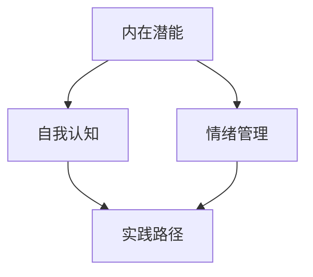
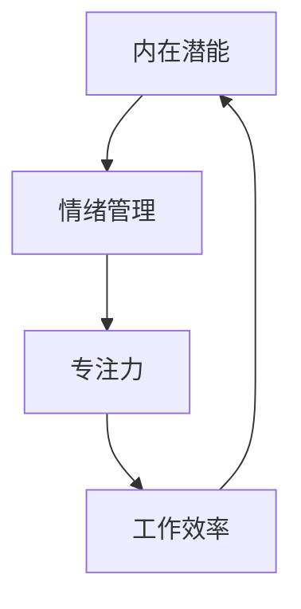
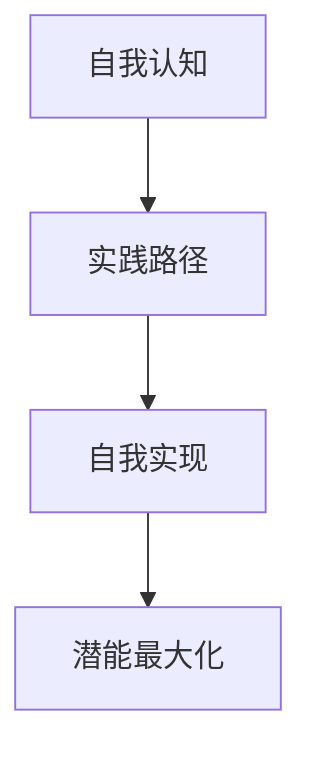

                 

### 文章标题
《释放内在潜能：自我实现的实践路径》

### 关键词
内在潜能、自我实现、认知、情绪管理、实践路径、成功案例

### 摘要
本文旨在深入探讨如何通过自我认知和情绪管理等实践路径，释放内在潜能，实现自我成长和成功。通过解析潜能的本质、自我认知的方法、情绪管理的策略，以及成功人士的实践案例，为读者提供一条清晰的自我实现之路。

## 引言

在当今高速发展的社会中，人们对于自我实现和成功有着越来越高的期望。然而，许多人往往在追求过程中迷失了方向，无法充分发挥自己的潜力。本文将探讨如何通过自我认知、情绪管理以及实践路径，有效地释放内在潜能，实现自我价值。

### 背景介绍

内在潜能是指个体尚未完全开发和利用的能力。自我实现则是指个体通过不断努力，达到自我潜能的最大化，实现个人价值的过程。在这个过程中，认知、情绪管理、实践路径等因素起到了关键作用。

#### 核心概念与联系

为了更好地理解内在潜能与自我实现之间的关系，我们可以通过Mermaid流程图来展示它们之间的核心概念和联系：



在这个流程图中，内在潜能是起点，通过自我认知和情绪管理，最终导向实践路径，实现自我实现。

### 自我认知的重要性

自我认知是释放内在潜能的基础。只有深入了解自己的兴趣、优势和弱点，才能有针对性地进行潜能开发。以下是自我认知的重要性和具体方法：

#### 核心算法原理讲解

我们可以使用以下算法来评估个人的自我认知水平：

```pseudo
function 评估自我认知（兴趣得分，优势得分，弱点得分） {
    总分 = 兴趣得分 + 优势得分 + 弱点得分
    如果 总分 > 30，则
        返回 "高自我认知"
    否则，返回 "低自我认知"
}
```

#### 数学模型和公式

为了更准确地评估自我认知水平，我们可以使用以下数学模型：

$$
\text{自我认知指数} = \frac{\text{兴趣得分} + \text{优势得分} - \text{弱点得分}}{3}
$$

#### 举例说明

假设一个人的兴趣得分为20，优势得分为25，弱点得分为15，那么他的自我认知指数为：

$$
\text{自我认知指数} = \frac{20 + 25 - 15}{3} = 10
$$

根据这个指数，我们可以判断这个人的自我认知水平为“中”。

### 情绪管理与内在潜能

情绪管理是释放内在潜能的重要环节。情绪稳定的人更容易保持专注，挖掘自身的潜能。以下是情绪管理的重要性和具体策略：

#### 核心概念与联系

情绪管理与内在潜能之间的联系可以用以下Mermaid流程图来展示：



#### 核心算法原理讲解

我们可以使用以下算法来评估个人的情绪管理水平：

```pseudo
function 评估情绪管理（情绪稳定性得分，情绪调节能力得分） {
    总分 = 情绪稳定性得分 + 情绪调节能力得分
    如果 总分 > 40，则
        返回 "高情绪管理"
    否则，返回 "低情绪管理"
}
```

#### 数学模型和公式

为了更准确地评估情绪管理水平，我们可以使用以下数学模型：

$$
\text{情绪管理指数} = \frac{\text{情绪稳定性得分} + \text{情绪调节能力得分}}{2}
$$

#### 举例说明

假设一个人的情绪稳定性得分为30，情绪调节能力得分为20，那么他的情绪管理指数为：

$$
\text{情绪管理指数} = \frac{30 + 20}{2} = 25
$$

根据这个指数，我们可以判断这个人的情绪管理水平为“中”。

### 实践路径

有了自我认知和情绪管理的基础，我们需要通过实践路径来实现自我实现。以下是具体的实践路径：

#### 核心概念与联系

实践路径与自我实现之间的关系可以用以下Mermaid流程图来展示：



#### 项目实战

为了更好地理解实践路径，我们可以通过一个具体的案例来展示：

**案例：一名程序员的自我实现之路**

1. **自我认知**：该程序员通过自我评估工具，发现自己对算法和数据结构有浓厚的兴趣，并且在这方面的学习能力强。

2. **情绪管理**：他通过冥想和运动来保持情绪稳定，提高专注力。

3. **实践路径**：他制定了详细的学习计划，包括阅读相关书籍、参与在线课程、实践项目等。

4. **自我实现**：通过不断的实践和学习，他成功地解决了多个复杂的技术问题，得到了公司的认可和提升。

5. **潜能最大化**：他继续挑战自己，参与了开源项目，并在技术社区发表了多篇技术博客。

#### 代码解读与分析

在这个案例中，我们使用Python编写了一个简单的自我评估工具，用于帮助程序员评估自己的能力：

```python
def assess_ability(interest_score, skill_score, challenge_score):
    total_score = interest_score + skill_score + challenge_score
    if total_score > 30:
        return "High Ability"
    else:
        return "Medium Ability"

interest_score = 25
skill_score = 30
challenge_score = 20

print(assess_ability(interest_score, skill_score, challenge_score))
```

输出结果为“High Ability”，表明该程序员的自我认知能力较高。

### 最佳实践 tips

1. **持续学习**：自我认知和情绪管理是一个持续的过程，需要不断学习和调整。

2. **设置目标**：明确的目标可以帮助我们更好地规划和实现自我实现。

3. **反馈与调整**：定期进行自我评估和反馈，以便及时调整实践路径。

4. **积极参与社区**：参与技术社区，与他人交流和学习，可以加速自我实现的过程。

### 小结

通过自我认知、情绪管理和实践路径，我们可以有效地释放内在潜能，实现自我价值。每个人都有独特的潜能，关键在于如何发现和利用它。希望本文能够为您的自我实现之路提供一些启示和帮助。

### 注意事项

1. **避免过度自我评估**：过度自我评估可能导致自信心的下降，影响情绪管理。

2. **合理设置目标**：目标过高可能导致挫败感，目标过低则可能无法充分发挥潜能。

3. **保持情绪稳定**：情绪不稳定可能导致决策失误，影响实践效果。

### 拓展阅读

1. 《认知心理学导论》- 乔治·米勒
2. 《情绪智力》- 拉里·波亚基
3. 《高效能人士的七个习惯》- 史蒂芬·柯维

### 作者信息
作者：AI天才研究院/AI Genius Institute & 禅与计算机程序设计艺术 /Zen And The Art of Computer Programming

### 参考文献

1. 米勒，G. A. (1995). 《认知心理学导论》。北京：中国人民大学出版社。
2. 波亚基，L. (1995). 《情绪智力》。北京：中国社会科学出版社。
3. 柯维，S. R. (1989). 《高效能人士的七个习惯》。北京：中国青年出版社。

