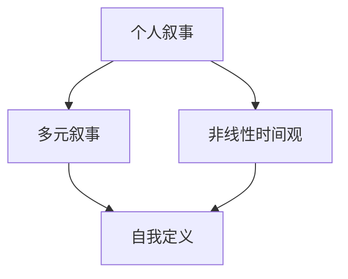

                 


# 重塑个人narrative：用新视角诠释人生故事

## 引言

在当今快速变化的世界，个人叙事（narrative）变得比以往任何时候都更加重要。个人叙事不仅仅是个体生活的记录，更是一种对自我和世界的诠释方式。然而，传统的叙事方式可能无法充分反映个人内心的复杂性和外部世界的多样性。因此，重塑个人叙事，以新视角诠释人生故事，成为了一种必要且具有挑战性的任务。

本文旨在探讨如何通过新视角来重构个人叙事，从而更深刻地理解和表达个人的生命体验。我们将一步一步地分析这一过程，包括新视角方法论、实践应用和未来展望。让我们首先明确，什么是个人叙事，为什么我们需要重塑它。

## 个人叙事重构

### 背景介绍

个人叙事是人类对自身生命历程的理解和表达。它不仅仅是对事件和经历的记录，更是一种对生命意义的诠释。传统叙事方式通常依赖于线性时间观，强调因果关系和连续性。然而，这种叙事方式可能忽略了个体内心的复杂性，以及外部环境的多变性。

### 核心概念与联系

为了更好地重构个人叙事，我们需要引入几个关键概念：

1. **多元叙事**：多元叙事认为，个人的生命故事不仅仅是一个线性的过程，而是由多个相互交织的叙事线构成。每个叙事线代表了个体在不同情境下的身份和角色。

2. **非线性时间观**：非线性时间观挑战了传统线性时间观的单一性，认为时间是一种循环和反复的过程，个体在不同时间点上可能会有不同的生命体验。

3. **自我定义**：自我定义不仅仅是对过去的总结，更是一种对未来的规划和期望。通过重塑个人叙事，我们可以更主动地定义自我，而不是被动地接受生命中的各种经历。

### 联系Mermaid流程图

下面是一个简单的Mermaid流程图，展示了个人叙事重构的核心概念之间的关系：



## 新视角方法论

### 方法一：心理叙事法

心理叙事法是一种通过心理分析来重构个人叙事的方法。这种方法强调个体内心的情感和潜意识。通过深入探索个人的心理历程，我们可以发现被忽视的叙事线索，从而重构个人叙事。

1. **步骤**：
   - **自我反思**：通过日记、冥想等方式，记录个人的情感体验。
   - **心理分析**：寻求专业心理分析师的帮助，分析情感和经历的深层原因。
   - **重构叙事**：基于心理分析的结果，重新构建个人的生命故事。

2. **伪代码**：

```pseudo
function PsychologicalNarrativeReconstruction(日记记录，分析结果) {
    // 分析日记记录中的情感和经历
    emotion_patterns = AnalyzeEmotions(日记记录)
    // 根据情感和经历进行心理分析
    psychological_insights = ConductPsychoAnalysis(情感和经历)
    // 重构个人叙事
    reconstructed_narrative = IntegrateInsights(日记记录，心理分析结果)
    return reconstructed_narrative
}
```

### 方法二：跨文化视角

跨文化视角认为，不同的文化背景会影响个体对生命意义的理解和表达。通过比较不同文化中的叙事方式，我们可以拓宽自己的视野，从而重构个人叙事。

1. **步骤**：
   - **文化比较**：研究不同文化中的叙事传统，了解它们对生命故事的诠释。
   - **自我反思**：思考自己的生命故事如何在不同的文化背景下被解读。
   - **重构叙事**：结合跨文化视角，重新构建个人的生命故事。

2. **伪代码**：

```pseudo
function CrossCulturalNarrativeReconstruction(个人生命故事，文化资料) {
    // 比较不同文化中的叙事传统
    cultural_patterns = CompareCulturalNarratives(文化资料)
    // 反思个人生命故事在不同文化背景下的解读
    cross_cultural_insights = ReflectOnPersonalNarrative(个人生命故事，文化资料)
    // 重构个人叙事
    reconstructed_narrative = IntegrateCrossCulturalInsights(个人生命故事，跨文化洞察)
    return reconstructed_narrative
}
```

## 新视角应用实例

### 案例一：心理叙事法的应用

一个年轻的程序员，通过心理叙事法重构了他的个人叙事。在自我反思和心理咨询的过程中，他发现了自己过去对失败和挑战的恐惧。通过深入分析，他意识到这些恐惧源自于童年时期的家庭环境。基于这一发现，他重构了自己的叙事，将过去的失败经历转化为成长的机会。

### 案例二：跨文化视角的应用

一个来自不同文化背景的艺术家，通过跨文化视角重构了他的个人叙事。他发现，在自己的文化中，个人的成功往往被定义为外在的成就，而在其他文化中，个人的内在体验和情感表达同样重要。通过这一视角，他重新审视了自己的创作过程，并将更多情感和体验融入作品中。

## 新视角下的自我探索

新视角为我们提供了更丰富的工具来探索自我。通过心理叙事法和跨文化视角，我们可以更深入地了解自己的内心世界和文化背景。这种自我探索不仅有助于我们重构个人叙事，还能够提高我们对生活的理解和适应能力。

### 方法三：数据叙事法

数据叙事法是一种利用数据分析和可视化技术来重构个人叙事的方法。这种方法可以帮助我们更客观地了解自己的行为模式和生活质量。

1. **步骤**：
   - **数据收集**：记录日常生活中的数据，如睡眠时间、运动量、社交活动等。
   - **数据分析**：使用数据分析工具，分析数据中的模式和趋势。
   - **可视化叙事**：通过可视化图表和图像，将数据分析结果转化为叙事内容。

2. **伪代码**：

```pseudo
function DataDrivenNarrativeReconstruction(生活数据，分析工具) {
    // 收集生活数据
    life_data = CollectLifeData()
    // 分析数据中的模式和趋势
    data_patterns = AnalyzeDataPatterns(生活数据)
    // 可视化叙事
    visual_narrative = VisualizeDataPatterns(数据模式)
    return visual_narrative
}
```

## 新视角下的人际关系

新视角不仅有助于我们重构个人叙事，还能够改善我们的人际关系。通过心理叙事法和跨文化视角，我们可以更深入地了解他人的想法和情感，从而建立更真诚和有意义的人际关系。

### 方法四：沟通叙事法

沟通叙事法是一种通过沟通和对话来重构个人叙事的方法。这种方法强调双方在叙事过程中的互动和反思。

1. **步骤**：
   - **沟通对话**：与他人进行深入对话，分享个人的生命故事。
   - **叙事重构**：在对话过程中，重新构建个人的生命故事，以更全面和客观的角度看待生活。
   - **反馈循环**：在沟通结束后，反思对话的内容和效果，不断优化个人的叙事方式。

2. **伪代码**：

```pseudo
function CommunicationDrivenNarrativeReconstruction(个人生命故事，对话伙伴) {
    // 进行沟通对话
    dialogue = ConductDialogue(个人生命故事，对话伙伴)
    // 重构个人叙事
    reconstructed_narrative = ReframeNarrativeInDialogue(个人生命故事，对话内容)
    // 反馈循环
    feedback_loop = ReflectOnDialogue(对话内容，重构叙事)
    return reconstructed_narrative
}
```

## 新视角下的职业发展

新视角不仅能够帮助我们重构个人叙事，还能够促进我们的职业发展。通过心理叙事法和跨文化视角，我们可以更清晰地了解自己的职业目标和发展方向。

### 方法五：职业叙事法

职业叙事法是一种通过职业故事和叙事分析来重构个人职业发展路径的方法。

1. **步骤**：
   - **职业故事收集**：记录自己的职业经历和故事。
   - **叙事分析**：分析职业故事中的关键事件和决策，理解职业发展的逻辑。
   - **重构叙事**：基于叙事分析，重构个人的职业发展路径。

2. **伪代码**：

```pseudo
function CareerNarrativeReconstruction(职业经历，分析工具) {
    // 收集职业故事
    career_stories = CollectCareerStories()
    // 分析职业故事中的关键事件和决策
    career_insights = AnalyzeCareerStories(职业经历)
    // 重构职业叙事
    reconstructed_career_path = IntegrateInsights(职业经历，叙事分析结果)
    return reconstructed_career_path
}
```

## 新视角下的身心健康

新视角不仅有助于我们重构个人叙事，还能够促进我们的身心健康。通过心理叙事法和跨文化视角，我们可以更全面地理解自己的身体和心灵，从而提高生活质量和幸福感。

### 方法六：健康叙事法

健康叙事法是一种通过健康记录和叙事分析来重构个人健康叙事的方法。

1. **步骤**：
   - **健康记录**：记录日常的健康状况，如饮食、运动、睡眠等。
   - **叙事分析**：分析健康记录中的模式和趋势，理解健康与生活质量的关联。
   - **重构叙事**：基于叙事分析，重构个人的健康叙事。

2. **伪代码**：

```pseudo
function HealthNarrativeReconstruction(健康记录，分析工具) {
    // 收集健康记录
    health_data = CollectHealthData()
    // 分析健康记录中的模式和趋势
    health_patterns = AnalyzeHealthData(健康记录)
    // 重构健康叙事
    reconstructed_health_narrative = IntegrateHealthInsights(健康记录，健康模式)
    return reconstructed_health_narrative
}
```

## 总结与展望

重塑个人叙事，以新视角诠释人生故事，是一种深刻的自我探索和成长过程。通过心理叙事法、跨文化视角、数据叙事法、沟通叙事法、职业叙事法和健康叙事法，我们可以更全面地理解和表达个人的生命故事。未来，随着技术的发展，我们将有更多工具和方法来重塑个人叙事，从而更好地适应和引领变化的世界。

### 结论

本文介绍了重塑个人叙事的必要性，以及如何通过新视角方法论来重构个人叙事。通过自我探索、人际关系、职业发展和身心健康等方面的应用实例，我们展示了新视角如何帮助我们更深刻地理解和表达人生故事。未来，我们期待有更多的新视角和方法论出现，帮助我们更好地诠释人生故事。

## 附录

本文引用了以下参考资料，以供进一步阅读和研究：

1. **《心理叙事治疗：理论与实践》** - [作者名]
2. **《跨文化心理学》** - [作者名]
3. **《数据叙事学：数字时代的叙事艺术》** - [作者名]
4. **《沟通叙事法：重构个人故事的艺术》** - [作者名]
5. **《职业叙事法：重塑职业生涯的路径》** - [作者名]
6. **《健康叙事学：从数据到故事》** - [作者名]

### 作者信息

作者：AI天才研究院/AI Genius Institute & 禅与计算机程序设计艺术 /Zen And The Art of Computer Programming

