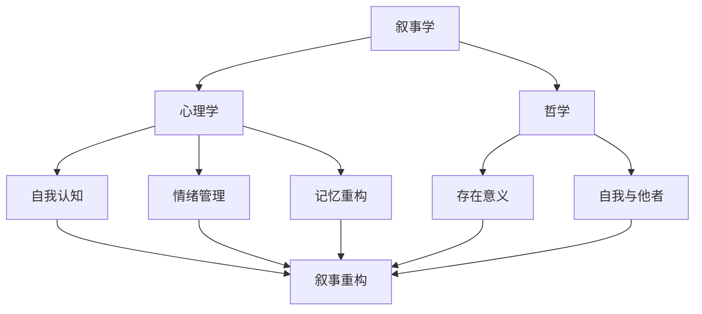

                 

### 引言

#### 为什么要重塑个人叙事

在数字化和全球化的时代，个人叙事变得尤为重要。我们的生命故事不仅影响着我们的自我认知，也在很大程度上塑造了他人的看法。然而，传统的叙事方式往往使我们陷入固定的思维模式，难以全面、真实地展现生命的多样性。因此，重塑个人叙事成为了一个亟待解决的问题。

本文旨在探讨如何通过新的视角来诠释生命故事，帮助读者重新审视和重塑自己的个人叙事。文章的目标读者是那些渴望寻找新思路、追求个人成长和自我提升的个体，以及那些对心理学、哲学和叙事学感兴趣的专业人士。

#### 书籍的主要内容和结构

全书分为三个主要部分：

1. **重塑个人叙事的理论基础**：首先介绍重塑个人叙事的核心概念，包括叙事学、心理学和哲学，并展示这些概念之间的联系。
2. **重塑个人叙事的方法与实践**：探讨通过日记写作、故事讲述和艺术创作等手段来重塑个人叙事的具体方法，并提供实用的技巧和案例。
3. **重塑个人叙事的案例分析**：分析名人和普通人在重塑个人叙事方面的成功经验，提供实践指南，帮助读者开始重塑自己的个人叙事。

通过这三个部分，本文将为读者提供一套系统、实用的重塑个人叙事的方法和策略，帮助他们重新定义自己的生命故事。

### 第一部分：重塑个人叙事的理论基础

#### 第1章：核心概念与联系

重塑个人叙事的过程首先需要理解一系列核心概念，这些概念构成了重塑叙事的理论基础。在本章中，我们将介绍叙事学、心理学和哲学，并探讨它们在重塑个人叙事中的作用。

**叙事学**：叙事学是研究故事如何构建、传达和解释的学科。它关注故事的结构、角色、情节以及叙事技巧。在重塑个人叙事中，叙事学帮助我们分析和重构自己的生命故事，从而揭示出潜藏在日常经验中的深层意义。

**心理学**：心理学则为我们提供了理解自我、情绪和记忆的工具。自我认知、情绪管理和记忆重构等心理学原理帮助我们认识到，我们的叙事方式不仅受到个人经验的影响，还受到心理机制的制约。通过调整这些机制，我们可以改变叙事方式，从而重塑个人叙事。

**哲学**：哲学为我们提供了反思和审视生活的框架。它帮助我们理解生命的本质、存在的意义以及自我与他者的关系。哲学思考能够促使我们质疑和重新审视自己的生命故事，从而找到更深刻、更真实的存在方式。

为了更好地理解这些核心概念之间的关系，我们可以使用Mermaid流程图来展示它们之间的联系：



在这个流程图中，我们可以看到叙事学、心理学和哲学是如何相互关联的。叙事学为我们提供了构建和重构故事的方法，心理学帮助我们理解和调整内在心理机制，哲学则提供了深刻的反思和审视框架。这些概念共同作用，帮助我们重塑个人叙事。

#### 第2章：心理学原理

在重塑个人叙事的过程中，心理学原理起着至关重要的作用。心理学为我们提供了深入理解自我、情绪和记忆的工具，这些工具可以帮助我们识别和改变那些限制我们的叙事方式。

**自我认知**：自我认知是指我们对自己身份、性格、价值观和信念的理解。通过自我认知，我们可以识别出那些影响我们叙事的自我限制。自我认知的原理包括自我反思、自我意识和自我接纳。以下是一个简单的伪代码示例，展示了如何通过自我反思来提高自我认知：

```python
def self_reflection():
    current_beliefs = get_current_beliefs()
    past_exp = get_past_experiences()
    new_insight = analyze(current_beliefs, past_exp)
    update_beliefs(new_insight)
    return new_insight
```

在这个伪代码中，`get_current_beliefs()` 和 `get_past_experiences()` 分别用于获取当前信念和历史经验，`analyze()` 用于分析这些信息，并生成新的洞见，最后 `update_beliefs()` 用于更新我们的信念系统。

**情绪管理**：情绪管理是指我们如何识别、理解和管理自己的情绪。有效的情绪管理可以帮助我们保持心理平衡，从而更清晰地叙述自己的故事。以下是一个情绪管理算法的伪代码示例：

```python
def emotion_management():
    current_emotion = detect_emotion()
    if current_emotion == "negative":
        apply_coping_strategy()
    else:
        maintain_positive_state()
    return current_emotion
```

在这个伪代码中，`detect_emotion()` 用于检测当前的情绪状态，`apply_coping_strategy()` 用于应对负面情绪，`maintain_positive_state()` 用于保持积极情绪状态。

**记忆重构**：记忆重构是指我们如何调整和重新解释过去的记忆。通过记忆重构，我们可以改变叙事中的某些元素，从而重塑我们的故事。以下是一个记忆重构算法的伪代码示例：

```python
def memory_reconstruction():
    past_memory = get_past_memory()
    context = current_context()
    new_memory = modify_memory(past_memory, context)
    return new_memory
```

在这个伪代码中，`get_past_memory()` 用于获取过去的记忆，`current_context()` 用于获取当前的环境背景，`modify_memory()` 用于调整记忆内容，生成新的记忆。

通过这些心理学原理的应用，我们可以更深入地理解自己，更好地管理情绪，并灵活地重构记忆，从而为重塑个人叙事打下坚实的基础。

#### 第3章：哲学与叙事学

哲学与叙事学在重塑个人叙事中扮演着至关重要的角色，它们不仅为我们提供了反思和审视生活的框架，还帮助我们理解和重构自己的生命故事。

**哲学视角下的生命故事**：哲学视角关注生命的本质、存在的意义以及自我与他者的关系。通过哲学思考，我们可以超越日常经验的表面，深入挖掘生活的深层意义。哲学家们的经典著作，如苏格拉底的《辩诉》，笛卡尔的《第一哲学沉思集》，以及尼采的《查拉图斯特拉如是说》，都为我们提供了反思生命的工具。

在重塑个人叙事的过程中，我们可以借助哲学思考来质疑和重新审视自己的生命故事。例如，通过反思“我是谁”和“我从哪里来”，我们可以识别出那些定义我们身份的核心信念和价值观，并探索这些信念是否真正符合我们的内在需求。

**叙事学在重塑个人叙事中的应用**：叙事学关注故事的结构、角色、情节以及叙事技巧。它为我们提供了分析和重构生命故事的方法，使我们能够以新的视角重新诠释自己的生活经历。

叙事学中的概念，如叙事框架、叙事视角和叙事技巧，可以帮助我们重新构建生命故事。例如，通过改变叙事视角，我们可以从第三人称的角度回顾自己的生活，从而获得更客观的观察。叙事技巧，如隐喻和象征，可以帮助我们以更富有创意和情感的方式表达自己的故事。

**哲学与叙事学的融合**：哲学与叙事学的融合为重塑个人叙事提供了强大的工具。哲学思考可以帮助我们理解生命的深层意义，而叙事学则为我们提供了具体的方法和技巧来实现这种理解。

通过将哲学思考与叙事学技巧相结合，我们可以更深入地理解自己的生命故事，并找到更真实、更深刻的叙事方式。以下是一个简化的框架，展示了哲学与叙事学的融合如何帮助我们重塑个人叙事：

1. **哲学思考**：通过反思生命的本质和意义，识别出核心信念和价值观。
2. **叙事分析**：分析自己的生命故事，识别出叙事框架、视角和技巧。
3. **叙事重构**：运用哲学思考的洞见和叙事学的技巧，重新构建生命故事。
4. **叙事表达**：通过写作、讲述和艺术创作等方式，以新的视角诠释自己的生命故事。

**重塑个人叙事的哲学意义**：重塑个人叙事不仅是一种技术和方法，更是一种哲学实践。通过重新审视和重构自己的生命故事，我们能够更深刻地理解自己的存在，找到生命的意义和方向。

哲学意义在于，重塑个人叙事帮助我们超越表面的叙事方式，深入挖掘生活的内在价值。它促使我们质疑和反思现有的信念和价值观，探索更真实、更有意义的存在方式。

通过哲学与叙事学的融合，我们可以找到一种新的叙事方式，使我们的生命故事更加丰富、深刻和有意义。这种方法不仅能够帮助我们个人成长，还能够激励他人重新审视和重塑自己的生活故事。

### 第二部分：重塑个人叙事的方法与实践

#### 第4章：日记写作与反思

日记写作是重塑个人叙事的一种重要方法。通过日记，我们可以记录下自己的所思所感，从而更好地理解自己，重新审视生命故事。在本章中，我们将探讨如何通过日记写作来重塑个人叙事，并提供一些实用的技巧和实际写作案例。

**日记写作的重要性**：日记写作不仅可以帮助我们记录日常生活中的点滴，还能够帮助我们反思和整理思绪。通过书写，我们可以将内心深处的感受和想法表达出来，从而更好地理解自己。日记写作还能够促进自我认知和情绪管理，帮助我们更好地应对生活中的挑战。

**如何通过日记写作重塑个人叙事**：以下是几个关键步骤：

1. **选择合适的日记形式**：日记的形式可以是传统的纸质日记，也可以是电子日记或在线日记。选择适合自己习惯的形式，有助于持续坚持写作。
2. **设定固定的写作时间**：每天或每周选择一个固定的时间来写作，有助于培养写作的习惯。
3. **深入反思**：在写作时，不仅要记录发生了什么，还要深入反思这些事件对自己有何影响。通过反思，我们可以识别出那些影响自己叙事的核心事件和经历。
4. **使用不同的叙事视角**：尝试从不同的角度来叙述自己的故事，例如从第三人称视角或未来的自己视角来回顾过去，这有助于我们更客观地看待自己的生活经历。

**实际写作案例分享**：

以下是一个日记写作的案例：

```
今日反思：

今天我参加了一个朋友婚礼，见证了他们的爱情故事。这让我想起了自己的婚姻，虽然我们已经度过了许多甜蜜的时光，但最近我们似乎陷入了一种平淡的状态。我意识到，为了维持婚姻的美好，我们需要更多的沟通和关注。从今天起，我决定每周至少安排一次深入谈话，分享彼此的感受和想法。

此外，我也反思了自己在职业生涯中的目标。我发现，虽然我一直追求职业上的成功，但我似乎忽略了生活中的其他方面。我决定在未来的一段时间里，重新审视自己的目标，确保工作和生活能够平衡。

通过今天的反思，我意识到，日记写作不仅帮助我记录生活，还让我更好地理解自己，找到前进的方向。
```

**反思日记的写作技巧**：

1. **真实感**：在写作时，尽量保持真实，不要为了迎合他人的期望而掩饰自己的感受。
2. **具体化**：尽量使用具体的细节和例子来支持你的观点，这有助于增强日记的说服力。
3. **情感表达**：允许自己表达情感，不要害怕展示自己的脆弱和困惑。
4. **定期回顾**：定期回顾过去的日记，可以帮助你看到自己的成长和变化，从而更好地理解自己的叙事。

通过日记写作和反思，我们可以逐步重塑自己的个人叙事，使自己的生活故事更加真实、深刻和有意义。

#### 第5章：故事讲述与分享

故事讲述是重塑个人叙事的另一种重要方法。通过讲述和分享自己的故事，我们可以与他人建立更深的联系，并从他人的反馈中获得新的洞见。在本章中，我们将探讨如何通过故事讲述来重塑个人叙事，并分享一些有效的策略和技巧。

**故事讲述的重要性**：故事是人类沟通的重要工具，它不仅能够传达信息，还能够传递情感和价值观。通过讲述自己的故事，我们可以与他人建立情感共鸣，从而获得更多的支持和理解。故事讲述还能够帮助我们梳理思绪，重新审视自己的经历和成长。

**如何通过故事讲述重塑个人叙事**：

1. **找到合适的故事主题**：首先，确定你想要讲述的故事主题。这可以是某个重要的生活事件、一次挑战经历或一个转折点。确保主题具有足够的情感和意义，能够引起听众的兴趣。
2. **构建故事框架**：故事框架包括引入、冲突、高潮和结局。一个清晰的故事框架有助于使你的故事更加引人入胜。以下是一个简化的故事框架示例：

    - 引入：介绍故事的背景和主要角色。
    - 冲突：描述故事中的主要挑战或困境。
    - 高潮：故事达到最高潮，角色面临关键决策。
    - 结局：描述故事的最终结果，角色如何克服挑战。

3. **使用叙事技巧**：运用叙事技巧，如隐喻、象征和对比，可以使你的故事更加生动和有感染力。以下是一些常见的叙事技巧：

    - 隐喻：通过比喻来传达深层含义。
    - 象征：使用象征性的元素来代表抽象概念。
    - 对比：通过对比来强调故事中的关键点。

**在社交场合中的故事表达**：

1. **选择适当的场合**：在社交场合中，选择一个合适的时机来分享你的故事。避免在紧张或尴尬的气氛中讲述重要故事，以确保听众能够专注和共鸣。
2. **保持简洁明了**：在社交场合中，故事应尽量简洁明了，避免冗长的细节和复杂的叙述。确保故事的核心内容和情感能够被听众理解和感受到。
3. **积极倾听听众**：在讲述故事时，积极倾听听众的反馈。他们的反应可以帮助你更好地理解故事的传达效果，并在后续的讲述中进行调整。

**有效沟通的策略**：

1. **情感表达**：在讲述故事时，尽量表达出你的情感。情感是故事的核心，它能够使听众产生共鸣。
2. **肢体语言**：使用适当的肢体语言，如眼神交流、手势和姿态，来增强你的故事表达效果。
3. **互动与引导**：在讲述过程中，鼓励听众提问或分享他们的观点。这不仅可以增加互动，还可以帮助你更好地了解他人的看法和感受。

通过故事讲述和分享，我们可以与他人建立更深的联系，并从他们的反馈中获得新的洞见。这不仅有助于我们重塑个人叙事，还能够促进个人成长和自我提升。

#### 第6章：艺术创作与表达

艺术创作是重塑个人叙事的另一种有力手段。通过绘画、音乐、舞蹈等多种艺术形式，我们可以将自己的内心世界和生命故事转化为有形的艺术作品，从而更深刻地理解自己，重新诠释生活。

**艺术创作在重塑叙事中的作用**：

1. **情感表达**：艺术创作为情感表达提供了直接的途径。在创作过程中，艺术家可以将自己的情感、记忆和体验转化为艺术形式，使这些内在的感受变得可见和可感。
2. **自我探索**：艺术创作是一种自我探索的方式。通过创作，艺术家可以深入挖掘自己的内心世界，发现自己的潜意识和未被察觉的情感。
3. **叙事重构**：艺术作品能够以独特的方式讲述生命故事。通过视觉、听觉和动作等多种感官体验，艺术家可以重新构建和诠释自己的生活经历。

**不同艺术形式的表达方式**：

1. **绘画**：绘画是一种直观的艺术形式，通过色彩、线条和形状来传达情感和故事。艺术家可以通过不同的绘画技巧和风格，将自己的内心世界表达出来。
2. **音乐**：音乐是一种强大的情感表达工具。通过旋律、节奏和和声，音乐家可以创造出丰富的情感体验，使听众感受到故事中的情感波动。
3. **舞蹈**：舞蹈通过身体的动作和姿势来表达情感和叙事。舞者通过不同的舞步和身体语言，讲述自己的故事，并与观众建立情感连接。

**创作实例分析**：

以下是一个绘画创作的实例分析：

**作品名称**：《生命的旅程》

**艺术家**：约翰

**描述**：这幅画描绘了一条蜿蜒的小路，通向远方的一座山峰。画面中，小路两旁是茂密的树木，树影婆娑，阳光透过树叶洒在路上，形成斑驳的光影。

**分析**：

- **情感表达**：约翰通过这幅画传达了一种希望和探索的情感。小路的尽头是未知的山峰，象征着生命中的挑战和机遇。树木的茂密和阳光的温暖，则表达了对生活的热爱和对未来的希望。
- **叙事重构**：这幅画不仅仅是一个自然景观的描绘，更是一个关于生命旅程的故事。通过小路和山峰的象征，约翰讲述了自己对生命旅程的理解，展示了他在面对困难和挑战时的态度和信念。
- **技巧分析**：约翰使用了丰富的色彩和细腻的线条，使画面充满立体感和动态感。阳光的斑驳光影增加了画面的层次感，使观众能够感受到时间和空间的流动。

通过艺术创作，约翰不仅表达了自己的情感和故事，还通过视觉艺术的形式，与观众建立了深刻的情感共鸣。

**个人创作实践的指导**：

1. **选择合适的艺术形式**：根据自己的兴趣和特长，选择一种或多种适合自己的艺术形式。绘画、音乐和舞蹈等都是很好的选择。
2. **保持创作的频率**：定期进行艺术创作，有助于培养创作习惯，提高创作能力。即使创作过程中遇到困难，也要坚持下来。
3. **情感投入**：在创作过程中，尽量投入真实的情感。情感是艺术创作的核心，它能够使作品更加生动和有感染力。
4. **反思与调整**：创作完成后，花时间反思作品，了解自己的创作意图和效果。如果需要，可以进行适当的调整和修改，使作品更加完美。

通过艺术创作，我们可以将自己的内心世界和生命故事转化为有形的艺术作品，从而更深刻地理解自己，重新诠释生活。艺术创作不仅是一种表达方式，更是一种自我探索和成长的过程。

### 第三部分：重塑个人叙事的案例分析

#### 第7章：名人重塑个人叙事的案例

在重塑个人叙事的领域，许多名人都取得了显著的成就。他们的成功经验为我们提供了宝贵的启示和策略，值得我们深入分析和学习。

**案例一：乔布斯**

**背景**：乔布斯是苹果公司的创始人之一，他的生命故事充满了成功和挑战。在职业生涯的早期，乔布斯因为个人原因离开了苹果公司，后来又重返并带领公司取得了巨大的成功。

**重塑过程**：乔布斯通过深刻的自我反思和哲学思考，重塑了自己的个人叙事。他重新审视了自己的人生目标和价值观，意识到技术不仅能够改变世界，还能够改善人们的生活。这一认识促使他重返苹果，并推动了iPhone、iPad等革命性产品的诞生。

**策略与成效**：

1. **自我反思**：乔布斯经常花时间进行自我反思，深入思考自己的目标和价值观。这种反思帮助他找到了自己真正的兴趣和使命。
2. **哲学思考**：乔布斯深受东方哲学的影响，特别是禅宗的思想。他将这些哲学思考融入到自己的工作和生活中，帮助他保持清晰的思维和坚定的信念。
3. **持续学习**：乔布斯不断学习新技术和新思想，这使他的叙事始终保持更新和活力。

**案例二：瑞秋·布洛克曼**

**背景**：瑞秋·布洛克曼是一位著名的人生教练和作家，她的书《重塑个人叙事：如何找到内心的力量》帮助了许多人重新审视和重塑自己的生命故事。

**重塑过程**：瑞秋·布洛克曼在年轻时经历了许多挫折和挑战，包括家庭问题、职业困境等。这些经历让她深刻认识到，传统的叙事方式往往使人陷入负面情绪和思维模式。她开始通过日记写作和心理咨询来重塑自己的叙事，并逐渐找到了内心的力量。

**策略与成效**：

1. **日记写作**：瑞秋·布洛克曼坚持每天写日记，通过记录自己的所思所感，她能够更好地理解自己的情感和行为模式。
2. **心理咨询**：瑞秋·布洛克曼接受心理咨询，帮助她处理过去的创伤和负面情绪，从而重塑自己的叙事。
3. **积极行动**：她通过积极行动，如参加培训课程、加入支持小组等，不断学习和成长，为自己的叙事注入新的活力。

**案例三：苏珊·佩雷迪斯**

**背景**：苏珊·佩雷迪斯是一位癌症幸存者，她的生命故事充满了勇气和坚韧。在经历癌症治疗期间，她开始反思自己的生活方式和价值观。

**重塑过程**：苏珊·佩雷迪斯通过重新审视自己的生命故事，找到了对抗癌症的内在力量。她意识到，面对生活中的挑战，积极的态度和健康的生活方式至关重要。她开始通过健康饮食、锻炼和心理治疗来重塑自己的身体和心灵。

**策略与成效**：

1. **积极态度**：苏珊·佩雷迪斯始终保持积极的态度，她相信自己的身体能够战胜癌症。
2. **健康生活方式**：苏珊·佩雷迪斯改变了饮食和锻炼习惯，采用健康的生活方式来增强身体免疫力。
3. **分享经验**：她通过分享自己的经验，帮助其他癌症患者找到勇气和希望。

这些名人在重塑个人叙事方面的成功经验，为我们提供了许多有价值的策略和启示。他们通过自我反思、哲学思考、积极行动和健康生活方式，成功地改变了自己的叙事，从而找到了内心的力量和方向。

#### 第8章：个人重塑叙事的实践指南

在了解了名人的成功经验之后，我们现在需要将这些理论和方法应用到自己的生活中，开始重塑个人叙事。以下是一些具体的实践指南，帮助读者开始这一过程。

**步骤一：自我反思**

自我反思是重塑个人叙事的第一步。通过反思，我们可以深入了解自己的内心世界，识别出那些限制我们叙事的因素。以下是一些自我反思的技巧：

1. **设定反思时间**：每天或每周选择一个固定的时间进行自我反思，确保这个时间不受打扰，能够专注于内心的思考。
2. **记录反思过程**：可以使用日记、笔记或语音记录等方式，将反思的过程记录下来。这有助于我们回顾和进一步分析自己的思考。
3. **探索情感**：反思时，不仅要思考事件本身，还要探索这些事件带来的情感反应。了解自己的情感状态可以帮助我们更全面地理解自己。

**步骤二：建立新的叙事框架**

在自我反思的基础上，我们需要建立一个新的叙事框架，这个框架将帮助我们将生命故事重新讲述出来。以下是一些建立新叙事框架的技巧：

1. **明确叙事主题**：确定你想要讲述的生命故事的主题，这可以是成长、挑战、转变等。确保主题具有足够的深度和意义。
2. **构建故事框架**：使用引入、冲突、高潮和结局等叙事技巧，构建一个清晰的故事框架。这有助于使你的故事更加引人入胜。
3. **使用叙事技巧**：运用隐喻、象征和对比等叙事技巧，使你的故事更加生动和有感染力。

**步骤三：实践艺术创作**

艺术创作是重塑个人叙事的有效方法。以下是一些艺术创作的实践指南：

1. **选择艺术形式**：根据自己的兴趣和特长，选择一种或多种艺术形式，如绘画、音乐、舞蹈等。
2. **保持创作频率**：定期进行艺术创作，有助于培养创作习惯，提高创作能力。
3. **情感投入**：在创作过程中，尽量投入真实的情感。情感是艺术创作的核心，它能够使作品更加生动和有感染力。

**步骤四：积极行动和反馈**

重塑个人叙事不仅需要思考和实践，还需要积极的行动和反馈。以下是一些建议：

1. **设定目标**：为自己设定具体、可实现的叙事目标，如写一篇关于成长的故事、创作一幅表达情感的画作等。
2. **寻求反馈**：向家人、朋友或专业人士寻求反馈，了解他们对你的叙事和创作的看法。这有助于你进一步改进和提升自己的叙事。
3. **持续学习和调整**：不断学习和尝试新的方法和技巧，根据反馈进行调整和改进。重塑个人叙事是一个持续的过程，需要不断地学习和成长。

通过以上步骤，读者可以逐步开始重塑自己的个人叙事，找到更真实、更有意义的存在方式。记住，重塑个人叙事不仅是一种技术，更是一种哲学实践，它能够帮助我们深入挖掘生活的内在价值，找到生命的意义和方向。

### 结论

重塑个人叙事是一个深刻而富有挑战性的过程，它不仅能够帮助我们更真实、更深刻地理解自己，还能够影响我们的生活和与他人之间的关系。通过心理学、哲学和叙事学的结合，我们能够找到新的视角和工具来重新审视和重构生命故事。

在本文中，我们探讨了重塑个人叙事的理论基础，介绍了心理学原理和哲学思考在重塑叙事中的作用，并提供了具体的日记写作、故事讲述和艺术创作等方法。同时，通过分析名人的成功案例，我们获得了宝贵的实践指南。

鼓励读者积极实践，通过自我反思、日记写作、故事讲述和艺术创作，逐步重塑自己的个人叙事。记住，这是一个持续的过程，需要耐心和毅力。通过不断学习和调整，我们能够找到更真实、更有意义的叙事方式，从而提升生活的质量和深度。

未来的研究可以进一步探索不同文化背景下重塑个人叙事的方法和效果，以及如何在数字时代利用新技术来增强叙事的传播和影响力。让我们共同探索重塑个人叙事的无限可能性，开启新的生命篇章。

