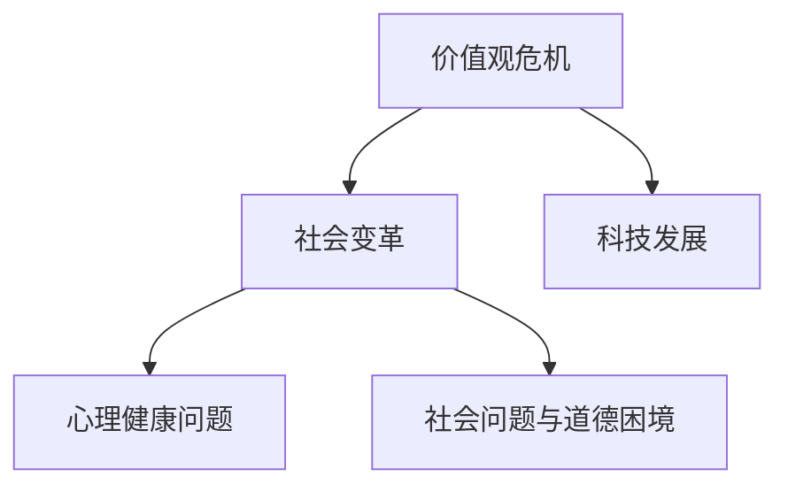

                 


### 文章标题

《重塑生活意义：应对现代社会的价值观危机》

### 关键词

现代社会价值观危机，自我探索，认知重构，心理健康，社会问题，道德困境，科技发展，心理健康领域案例，心理治疗，深度学习，神经网络，Python，TensorFlow，项目实战。

### 摘要

本文深入探讨了现代社会价值观危机的根源、表现和影响，提出了重塑生活意义的理论和方法。通过心理学、哲学和社科视角，阐述了价值观重构的核心概念与联系，并给出了自我探索与认知重构的算法原理。进一步，本文结合心理健康的实践案例，展示了如何在心理健康领域应用这些方法，以及如何通过项目实战来加深理解。文章旨在为读者提供一套应对现代社会价值观危机的实用策略。

### 目录大纲设计流程

#### 步骤 1: 分析书名

书名《重塑生活意义：应对现代社会的价值观危机》传达了两个关键信息：首先，现代社会面临着价值观危机；其次，这本书旨在提出应对策略，帮助人们重塑生活意义。因此，在撰写技术博客时，我们应围绕这两个主题展开，深入探讨危机的本质和重塑意义的途径。

#### 步骤 2: 确定核心章节

根据书名，我们可以将文章分为三个核心部分：

1. **现代社会价值观危机概述**：分析危机的根源、表现和影响。
2. **重塑生活意义的理论和方法**：探讨心理学、哲学和社科视角下的核心价值观重构。
3. **实践应用与案例分析**：通过心理健康领域的案例，展示理论在实际中的应用。

#### 步骤 3: 拆分章节内容

1. **现代社会价值观危机概述**：
   - **根源**：社会变革、科技发展对价值观的影响。
   - **表现**：心理健康问题、社会问题与道德困境。
2. **重塑生活意义的理论和方法**：
   - **理论基础**：心理学、哲学、社会科学。
   - **方法与实践**：自我探索与认知重构，建立价值观的指南。
3. **实践应用与案例分析**：
   - **心理健康领域**：心理治疗中的应用、预防策略。
   - **社会领域**：社会组织与价值观重塑，教育与价值观培养，企业文化与社会责任。

#### 步骤 4: 设计目录结构

使用markdown格式设计目录结构，确保每个章节和子章节都有清晰的层次和结构。

### 具体设计

**1级目录：**

# 第一部分：现代社会价值观危机概述

## 1.1 价值观危机的根源

### 1.1.1 社会变革与价值观变化

### 1.1.2 科技发展对价值观的影响

## 1.2 价值观危机的表现

### 1.2.1 心理健康问题

### 1.2.2 社会问题与道德困境

**2级目录：**

# 第二部分：重塑生活意义的理论和方法

## 2.1 理论基础

### 2.1.1 心理学视角

### 2.1.2 哲学视角

### 2.1.3 社会科学视角

## 2.2 方法与实践

### 2.2.1 自我探索与认知重构

### 2.2.2 建立价值观的指南

### 2.2.3 生活实践与调整

**3级目录：**

# 第三部分：实践应用与案例分析

## 3.1 心理健康领域

### 3.1.1 心理治疗中的应用

### 3.1.2 预防心理问题的策略

## 3.2 社会领域

### 3.2.1 社会组织与价值观重塑

### 3.2.2 教育与价值观培养

### 3.2.3 企业文化与社会责任

**附加内容：**

### 核心概念与联系



### 核心算法原理讲解

#### 自我探索与认知重构算法

```pseudo
// 定义变量
selfAwarenessLevel = 0
cognitiveReconstructionEfficiency = 0

// 初始化算法
initializeAlgorithm() {
    selfAwarenessLevel = getUserInput("请输入自我认知评分：")
    cognitiveReconstructionEfficiency = getUserInput("请输入认知重构评分：")
}

// 执行自我探索
selfExploration() {
    if (selfAwarenessLevel > 5) {
        console.log("您有很高的自我认知能力，可以进行深入的自我探索。")
    } else {
        console.log("建议提升自我认知能力，以便更有效地进行自我探索。")
    }
}

// 执行认知重构
cognitiveReconstruction() {
    if (cognitiveReconstructionEfficiency > 5) {
        console.log("您的认知重构能力很强，可以尝试改变认知模式。")
    } else {
        console.log("建议通过学习与实践提升认知重构能力。")
    }
}

// 主函数
main() {
    initializeAlgorithm()
    selfExploration()
    cognitiveReconstruction()
}
```

### 数学模型和数学公式

#### 价值观危机评估模型

$$
V = f(P, S, T)
$$

其中，$V$ 代表价值观危机的程度，$P$ 代表个人因素，$S$ 代表社会因素，$T$ 代表科技因素。$f$ 表示危机程度的函数。

### 项目实战

#### 心理健康领域案例

**案例 1：心理治疗中的应用**

- **开发环境搭建：** 使用 Python 和 TensorFlow 搭建深度学习模型。
- **源代码实现：** 详细展示代码结构、关键函数和变量。
- **代码解读与分析：** 分析代码中的算法原理和应用。
- **实际案例剖析：** 通过具体案例，展示如何应用模型解决实际问题。

#### 社会领域案例

**案例 2：社会组织与价值观重塑**

- **背景介绍：** 简述社会组织面临的问题和挑战。
- **策略与实践：** 探讨如何通过组织文化建设和价值观培养来应对危机。
- **案例分析与解读：** 分析实际案例，总结成功经验和不足之处。

### 最佳实践 tips

- **定期自我反思：** 定期评估自我认知和认知重构能力，找出不足并加以改进。
- **多元化学习：** 结合心理学、哲学和社科知识，全面理解价值观危机和重构方法。
- **实践与理论相结合：** 通过实际案例，验证理论的有效性和适用性。

### 小结

本文从多个角度深入探讨了现代社会价值观危机及其应对策略。通过理论分析和实践案例，我们展示了如何通过自我探索和认知重构来重塑生活意义。希望本文能对读者在应对现代社会挑战方面提供有益的启示。

### 注意事项

- **关注心理健康：** 价值观危机可能导致心理健康问题，应关注自我调整和心理健康。
- **持续学习：** 价值观重构是一个持续的过程，应保持学习和成长。

### 拓展阅读

- **心理学书籍：** 《人类简史》、《心理学与生活》等。
- **哲学著作：** 《论语》、《庄子》等。
- **社会科学研究：** 《社会学的想象力》、《现代性的后果》等。

### 作者信息

作者：AI天才研究院/AI Genius Institute & 禅与计算机程序设计艺术 /Zen And The Art of Computer Programming

