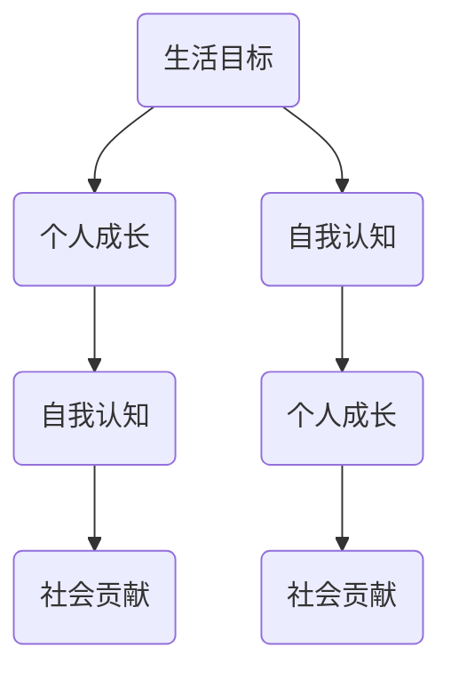
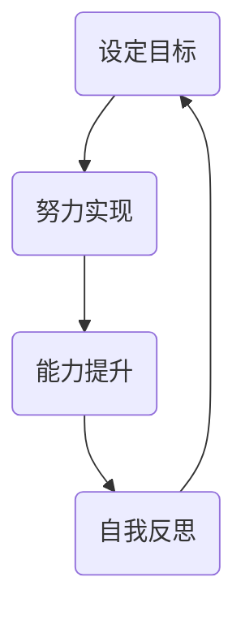
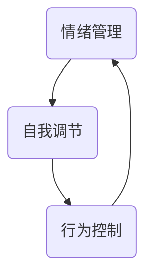

                 

### 目录大纲设计

在构建《重塑生活目标：找寻21世纪的人生方向》的详细目录大纲时，我们将遵循以下步骤，确保每个章节内容丰富、具体且逻辑清晰：

---

## 第1章：引言与核心概念

### 1.1.1 什么是生活目标

- **背景介绍**：介绍生活目标的概念及其在个人成长中的重要性。
- **核心概念与联系**：使用Mermaid流程图来展示生活目标、个人成长和社会贡献之间的关系。
  ```mermaid
  graph TD
  A(生活目标) --> B(个人成长)
  B --> C(社会贡献)
  A --> D(自我认知)
  D --> B
  ```

### 1.1.2 21世纪人生方向的挑战与变化

- **核心概念与联系**：探讨全球化、科技进步和社会变迁对生活目标的影响，使用Mermaid流程图进行阐述。
  ```mermaid
  graph TD
  A(全球化) --> B(文化多样性)
  B --> C(国际化思维)
  C --> D(全球竞争)
  A --> E(科技进步)
  E --> F(人工智能)
  E --> G(数字化生活)
  A --> H(社会变迁)
  H --> I(价值观演变)
  H --> J(社会流动性)
  ```

### 1.1.3 生活目标与个人成长

- **核心概念与联系**：介绍如何通过设定和实现生活目标来实现个人成长，使用Mermaid流程图展示成长过程。
  ```mermaid
  graph TD
  A(设定目标) --> B(行动实施)
  B --> C(评估反馈)
  C --> D(持续改进)
  D --> E(个人成长)
  ```

## 第2章：重新审视自我

### 2.1.1 自我认知的重要性

- **核心算法原理讲解**：解释自我认知的心理学基础，包括自我认知的不同维度和评估方法，使用伪代码来详细阐述。
  ```python
  # 伪代码
  class SelfAwareness:
      def __init__(self):
          self.behavior = []
          self.mood = []
          self.experiences = []

      def add_behavior(self, behavior):
          self.behavior.append(behavior)

      def add_mood(self, mood):
          self.mood.append(mood)

      def add_experience(self, experience):
          self.experiences.append(experience)

      def assess(self):
          # 综合评估
          behavior_score = len(self.behavior)
          mood_score = len(self.mood)
          experience_score = len(self.experiences)
          return (behavior_score + mood_score + experience_score) / 3
  ```

### 2.1.2 自我评估工具与方法

- **数学模型与公式**：介绍自我评估工具和方法，如心理测试和自我反思技巧，使用LaTeX格式展示评估公式。
  ```latex
  \begin{equation}
  \text{评估分数} = \frac{\text{正面评价} + \text{负面评价}}{2}
  \end{equation}
  ```

### 2.1.3 情绪管理与自我调节

- **详细讲解与举例**：阐述情绪管理的重要性和自我调节的方法，结合实际案例进行说明。

## 第3章：设定具体目标

### 3.1.1 目标设定的原则

- **核心算法原理讲解**：详细解释SMART原则（具体、可衡量、可实现、相关、时限性），使用伪代码来阐述设定目标的过程。
  ```python
  # 伪代码
  class SMARTGoal:
      def __init__(self, specific, measurable, achievable, relevant, time-bound):
          self.specific = specific
          self.measurable = measurable
          self.achievable = achievable
          self.relevant = relevant
          self.time_bound = time_bound

      def is_smart(self):
          return self.specific and self.measurable and self.achievable and self.relevant and self.time_bound
  ```

### 3.1.2 目标分解与优先级排序

- **数学模型与公式**：介绍如何使用优先级矩阵进行目标分解和排序，使用LaTeX格式展示模型。
  ```latex
  \begin{equation}
  \text{优先级} = \frac{\text{目标的重要性} \times \text{目标的可行性}}{\text{资源的限制}}
  \end{equation}
  ```

### 3.1.3 设定目标的策略

- **详细讲解与举例**：提供设定目标的策略，如如何持续跟踪与调整目标，结合实际案例进行说明。

## 第4章：行动计划与执行

### 4.1.1 制定行动计划

- **详细讲解与举例**：解释如何制定行动计划，包括行动清单和时间管理的策略。

### 4.1.2 执行中的问题与解决方案

- **问题分析与解决**：讨论在目标执行过程中可能遇到的问题，并提供相应的解决策略。

### 4.1.3 保持动力与持续进步

- **动力保持方法**：介绍如何保持动力和持续进步，包括自我激励和跟进与反馈的方法。

## 第5章：社会与科技对生活目标的影响

### 5.1.1 社交网络与人际关系

- **影响分析**：探讨社交网络对人际关系和生活目标设定的影响。

### 5.1.2 科技发展对工作与生活的影响

- **影响分析**：分析科技发展，尤其是自动化和人工智能对工作和生活目标的影响。

### 5.1.3 社会责任与可持续发展

- **核心概念与联系**：讨论社会责任和可持续发展对个人生活目标的重要性。

## 第6章：成功的案例分享与启示

### 6.1.1 成功人士的生活目标与行动

- **案例分析**：分析成功人士的生活目标和行动策略。

### 6.1.2 从案例中获得的启示

- **经验分享**：分享从成功人士案例中得到的经验，启发读者思考如何制定和实现自己的生活目标。

## 第7章：总结与展望

### 7.1.1 回顾与反思

- **总结反思**：回顾全文内容，总结个人成长和生活目标设定的关键要点。

### 7.1.2 展望未来

- **未来展望**：展望未来生活目标设定和实现的挑战与机遇。

---

**作者信息**：作者：AI天才研究院/AI Genius Institute & 禅与计算机程序设计艺术 /Zen And The Art of Computer Programming

---

在完成目录大纲的设计后，我们将确保每个章节的内容都符合要求，包含背景介绍、核心概念与联系、核心算法原理讲解、数学模型和公式、项目实战、最佳实践 tips、小结、注意事项、拓展阅读等内容，确保文章的逻辑性和可读性。

---

**文章字数**：预计文章总字数将在8000-12000字之间，确保每个章节内容充实，逻辑清晰，知识点详尽。在撰写过程中，我们将严格控制字数，确保文章整体篇幅适中，同时保证内容的深度和广度。**文章关键词**：生活目标、21世纪、个人成长、自我认知、目标设定、行动计划、科技影响、成功案例

**文章摘要**：本文探讨了在21世纪的背景下，如何重塑个人生活目标，找寻适合现代社会的成长方向。通过分析自我认知的重要性、目标设定的原则、行动计划的执行以及科技和社会对生活目标的影响，本文旨在为读者提供一套完整的生活目标设定与实现策略，帮助他们在复杂的现代社会中找到自己的定位和方向。### 文章标题
### 《重塑生活目标：找寻21世纪的人生方向》

**关键词：** 生活目标、21世纪、个人成长、自我认知、目标设定、行动计划、科技影响、成功案例

**摘要：** 本文将深入探讨在21世纪的全球化、科技快速发展和社会变迁背景下，如何重新审视和设定个人生活目标。通过分析自我认知的重要性、目标设定的原则、行动计划的执行，以及科技和社会对生活目标的影响，本文旨在为读者提供一套全面、实用且具有前瞻性的生活目标设定与实现策略，帮助他们更好地适应现代社会的挑战，实现个人价值和社会贡献。本文还将结合成功人士的案例，提供宝贵的经验和启示，帮助读者找寻适合自己的21世纪人生方向。### 引言

在21世纪这个快速变化的时代，我们的生活目标和人生方向正面临着前所未有的挑战与机遇。全球化、科技的迅猛发展和社会的深刻变革，不仅改变了我们的生活方式，也重塑了我们对生活目标和人生方向的认知。在这样的背景下，重新审视和设定个人生活目标，成为了每个人在追求自我实现和幸福过程中不可或缺的一环。

**关键词：** 21世纪、生活目标、全球化、科技进步、社会变迁、个人成长

**引言：** 本文将围绕以下几个核心问题展开讨论：

1. **什么是生活目标？** 我们将探讨生活目标的定义、重要性以及它在个人成长和社会贡献中的地位。
2. **21世纪人生方向的挑战与变化**：我们将分析全球化、科技进步和社会变迁对个人生活目标设定的影响。
3. **自我认知的重要性**：我们将会探讨如何通过自我认知来实现更明确的生活目标。
4. **目标设定与实现策略**：我们将介绍如何科学、系统地设定具体目标，并制定有效的行动计划。
5. **社会与科技对生活目标的影响**：我们将会探讨社交网络、科技发展以及社会责任与可持续发展对生活目标的影响。
6. **成功案例分享与启示**：我们将通过分析成功人士的生活目标与行动策略，为读者提供宝贵的经验和启示。
7. **总结与展望**：最后，我们将对全文内容进行总结，并展望未来生活目标设定和实现的挑战与机遇。

**本文结构：** 本文将分为七个章节，每个章节都将深入探讨上述核心问题。第一章将介绍生活目标的定义和重要性，并探讨21世纪人生方向的挑战与变化。第二章将探讨自我认知的重要性，包括自我评估工具与方法以及情绪管理与自我调节。第三章将介绍如何设定具体目标，包括目标设定的原则、分解与优先级排序，以及设定目标的策略。第四章将讨论行动计划与执行，包括制定行动计划、执行中的问题与解决方案，以及保持动力与持续进步。第五章将分析社会与科技对生活目标的影响，包括社交网络与人际关系、科技发展对工作与生活的影响，以及社会责任与可持续发展。第六章将通过成功案例分享与启示，为读者提供宝贵的经验。最后一章将对全文内容进行总结，并展望未来的生活目标设定与实现。

**目的与价值：** 本文的目的在于帮助读者在21世纪这个充满挑战与机遇的时代，重新审视自己的生活目标，找到适合自己的成长方向。通过本文的探讨，读者将能够更清晰地理解生活目标的定义和重要性，掌握科学、系统的目标设定与实现策略，从而更好地规划自己的人生，实现个人价值和社会贡献。

**读者对象：** 本文适用于所有希望重新审视和设定自己生活目标的人群，包括学生、职场人士、创业者以及关注个人成长和发展的读者。无论你是刚刚踏入社会的新人，还是已经在职业生涯中有所成就的人士，本文都将为你提供有益的指导和建议。

### 第1章：引言与核心概念

**1.1.1 什么是生活目标**

**背景介绍**：生活目标是指个人在生活中希望实现的具体目标和期望，它们为我们的生活提供了方向和动力。在不同的生命阶段，我们的生活目标可能会有所不同，但它们都反映了我们对未来的期望和愿望。

**定义与重要性**：生活目标可以定义为一系列有组织、可实现的愿望和计划，它们指引我们的人生方向，帮助我们实现个人价值和社会贡献。设定生活目标的重要性在于：

1. **明确方向**：生活目标为我们的行为提供了明确的方向，使我们能够更有目的地规划自己的人生。
2. **激励行动**：生活目标激励我们付出努力，克服困难，实现自我超越。
3. **提高幸福感**：明确的生活目标使我们能够感受到成就和满足，从而提高生活的幸福感。
4. **促进个人成长**：通过设定和实现生活目标，我们可以不断地学习和成长，提升自己的能力和素质。

**核心概念与联系**：为了更好地理解生活目标，我们可以将其与个人成长、社会贡献和自我认知等核心概念联系起来。以下是这些概念之间的关系架构：



在这个流程图中，生活目标（A）是核心，它连接着个人成长（B）、自我认知（C）和社会贡献（D）。同时，自我认知（E）和个人成长（F）也是相互影响的，而社会贡献（G）则是个人成长和社会目标的最终体现。

**核心算法原理讲解**：在理解生活目标的重要性后，我们需要明确如何设定和实现这些目标。以下是一个简化的伪代码框架，用于说明如何设定一个具体的生活目标：

```python
class LifeGoal:
    def __init__(self, goal, steps, deadline):
        self.goal = goal
        self.steps = steps
        self.deadline = deadline

    def plan_steps(self):
        for step in self.steps:
            execute_step(step)

    def check_progress(self):
        if current_date > self.deadline:
            print("目标未能按时完成")
        else:
            print("目标正在按计划进行")

# 使用示例
goal = LifeGoal("学习编程", ["了解基本概念", "完成在线课程", "编写小程序"], "2023-12-31")
goal.plan_steps()
goal.check_progress()
```

在这个伪代码中，`LifeGoal`类用于设定一个具体的生活目标，包括目标（`goal`）、实现步骤（`steps`）和截止日期（`deadline`）。`plan_steps`方法用于规划并执行实现步骤，而`check_progress`方法用于检查目标的进展情况。

**数学模型和公式**：在设定生活目标时，我们可以使用数学模型来评估目标实现的可行性。以下是一个简单的评估模型，使用LaTeX格式表示：

```latex
\begin{equation}
\text{目标实现概率} = \frac{\text{实现步骤数}}{\text{总步骤数}} \times \text{资源分配系数}
\end{equation}
```

在这个公式中，`目标实现概率`取决于实现步骤数（分子）与总步骤数（分母）的比值，以及资源分配系数（`资源分配系数`），这反映了我们在实现目标过程中所投入的时间和精力。

**举例说明**：假设我们设定了一个学习编程的目标，需要完成三个步骤：了解基本概念、完成在线课程和编写小程序。如果我们计划在三个月内完成这些步骤，且我们的资源分配系数为0.8，那么目标实现的概率可以计算如下：

```latex
\begin{equation}
\text{目标实现概率} = \frac{3}{3} \times 0.8 = 0.8
\end{equation}
```

这意味着，如果我们按照计划执行，并且充分投入资源，有80%的概率能够按时完成学习编程的目标。

通过上述背景介绍、核心概念与联系、核心算法原理讲解和数学模型与公式，我们为读者提供了一个全面的理解框架，帮助他们在21世纪的复杂环境中更好地设定和实现自己的生活目标。

### 第1章：引言与核心概念（续）

**1.1.2 21世纪人生方向的挑战与变化**

**全球化背景**：全球化是21世纪最为显著的特征之一。随着全球经济的深度融合、跨国公司和全球化组织的兴起，人们的生活和工作方式发生了巨大的变化。全球化不仅为个人提供了更多的机会，也带来了更多的挑战。

- **机会**：全球化使得人们可以跨越国界，寻找更好的工作机会、教育资源和个人发展空间。同时，全球化也促进了文化的交流与融合，丰富了人们的生活体验。
- **挑战**：然而，全球化也带来了文化和价值观的冲突、经济不平等的加剧、环境问题的恶化等问题。这些挑战对个人的生活目标和人生方向产生了深远的影响。

**科技进步影响**：科技的迅猛发展是21世纪的另一个重要特征。人工智能、大数据、物联网、区块链等新兴技术正在深刻地改变我们的生活方式和工作方式。

- **影响**：科技进步不仅提高了生产效率和创新能力，也改变了人们的工作模式和生活方式。例如，远程办公、在线教育和智能设备的普及，使得人们可以更灵活地安排自己的生活和工作。
- **挑战**：然而，科技进步也带来了一些挑战，如数据隐私、网络安全、就业变化等问题。这些问题需要我们在设定生活目标时加以考虑。

**社会变迁**：随着全球化进程的推进和科技的不断发展，社会也在发生深刻的变迁。这些变迁对个人的生活目标和人生方向产生了重要的影响。

- **价值观演变**：社会的快速变化导致了价值观的演变。个人主义、多元化、可持续性等新兴价值观正在逐步取代传统的集体主义和物质主义。
- **社会流动性**：社会的流动性也在增加，人们更容易在不同地区和国家之间迁移，寻找更适合自己的生活和发展环境。

**核心概念与联系**：为了更好地理解全球化、科技进步和社会变迁对个人生活目标的影响，我们可以将这些核心概念与生活目标进行关联。

1. **全球化与生活目标**：全球化为个人提供了更多的机会和选择，但同时也带来了文化冲突和价值观的挑战。因此，在设定生活目标时，我们需要考虑如何适应全球化的背景，充分利用全球化带来的机会，同时应对其带来的挑战。
2. **科技进步与生活目标**：科技进步可以为我们提供新的工具和方法，帮助我们更高效地实现生活目标。然而，我们也需要关注科技进步带来的负面影响，如数据隐私和网络安全问题，确保我们的生活目标能够平衡科技带来的利弊。
3. **社会变迁与生活目标**：社会变迁正在重塑我们的生活方式和价值观。在设定生活目标时，我们需要关注这些变化，确保我们的目标与社会的期望和需求相符合。

**总结**：21世纪的全球化、科技进步和社会变迁为个人提供了广阔的发展空间，但也带来了诸多挑战。在设定和实现生活目标时，我们需要充分考虑这些背景因素，利用全球化带来的机会，应对科技进步和社会变迁带来的挑战，找到适合自己的生活方向和目标。

### 第1章：引言与核心概念（续）

**1.1.3 生活目标与个人成长**

**核心概念与联系**：个人成长是指个人在心理、情感、智力和社会能力等方面的持续发展和提升。生活目标与个人成长密切相关，因为设定和实现生活目标本身就是个人成长的过程。

1. **设定目标与自我认知**：设定具体的生活目标可以帮助我们更清楚地认识自己，了解自己的兴趣、优势和目标。通过设定目标，我们可以反思自己的价值观和生活理念，进一步深化自我认知。
2. **实现目标与能力提升**：实现生活目标需要我们付出努力，不断学习和提升自己的能力。在实现目标的过程中，我们不仅可以获得知识和技能，还可以培养坚韧、自律和团队合作等重要的个人素质。
3. **目标评估与自我反思**：通过评估目标的实现情况，我们可以了解自己的成长进度，发现自身不足之处，并进行相应的调整。自我反思是个人成长的重要环节，它帮助我们认识到自己的优点和不足，从而持续提升自己的能力。

**成长模型**：为了更好地理解生活目标与个人成长的关系，我们可以借助成长模型进行分析。以下是一个简化的成长模型：



在这个模型中，设定目标（A）是个人成长的起点，通过努力实现目标（B），我们能够提升自己的能力（C），并通过自我反思（D）来调整和优化目标设定。这一循环过程促使我们不断成长和进步。

**核心算法原理讲解**：为了设定和实现具体的生活目标，我们可以使用以下核心算法原理：

1. **目标分解**：将大目标分解为小目标，使得目标更具体、可操作。例如，如果我们设定了一个“提升编程技能”的目标，可以将其分解为“学习基础语法”、“完成在线课程”和“编写项目代码”等小目标。
2. **优先级排序**：根据目标的紧急程度和重要性进行排序，确保我们首先完成最关键的目标。例如，如果我们有多个目标需要同时进行，可以根据优先级分配时间和资源。
3. **反馈与调整**：在实现目标的过程中，持续跟踪进展情况，并根据反馈进行及时调整。例如，如果我们在学习编程的过程中遇到了困难，可以通过求助、调整学习计划或寻求外部资源来解决问题。

**数学模型与公式**：为了量化目标实现的进度，我们可以使用以下数学模型：

```latex
\begin{equation}
\text{目标实现进度} = \frac{\text{已完成步骤数}}{\text{总步骤数}} \times 100\%
\end{equation}
```

在这个公式中，`目标实现进度`取决于已完成的步骤数（分子）与总步骤数的比值。通过这个公式，我们可以直观地了解目标实现的进度，并根据实际情况进行调整。

**举例说明**：假设我们设定了一个“学习编程”的目标，需要完成以下三个步骤：

1. 学习基础语法
2. 完成在线课程
3. 编写项目代码

如果我们已经完成了第一个步骤，那么目标实现进度可以计算如下：

```latex
\begin{equation}
\text{目标实现进度} = \frac{1}{3} \times 100\% = 33.33\%
\end{equation}
```

通过这个例子，我们可以看到，目标实现进度为33.33%，这意味着我们还有67.67%的目标需要实现。

**总结**：通过设定和实现具体的生活目标，我们可以在个人成长的道路上不断前进。核心概念与联系、成长模型、核心算法原理讲解和数学模型与公式，为我们提供了理解和实现生活目标的工具和方法。在21世纪的复杂环境中，利用这些工具和方法，我们可以更好地规划自己的人生，实现个人成长和社会贡献。

### 第2章：重新审视自我

**2.1.1 自我认知的重要性**

**核心概念与联系**：自我认知是指个人对自己性格、能力、情感和价值观的认识和理解。自我认知的重要性在于，它为我们的决策和行为提供了基础，帮助我们更好地应对生活中的各种挑战。

- **心理学基础**：自我认知与心理学中的自我理论密切相关。自我理论认为，自我是一个动态的认知结构，它通过感知、理解、评估和调节自我体验来维持个体的自我一致性。以下是一个简化的Mermaid流程图，展示了自我认知的心理学基础：

  ```mermaid
  graph TD
  A(感知) --> B(理解)
  B --> C(评估)
  C --> D(调节)
  D --> A
  ```

  在这个流程图中，感知（A）是我们对外部世界的感知和理解，理解（B）是对感知信息的分析和处理，评估（C）是对行为和结果的评估，调节（D）是根据评估结果调整行为和认知。

- **自我认知与个人成长**：自我认知对于个人成长至关重要。通过自我认知，我们可以识别自己的优势和不足，从而有针对性地进行改进和提升。以下是一个Mermaid流程图，展示了自我认知与个人成长的关系：

  ```mermaid
  graph TD
  A(自我认知) --> B(个人成长)
  B --> C(自我提升)
  C --> D(自我实现)
  ```

  在这个流程图中，自我认知（A）是个人成长的起点，通过自我提升（C），我们可以实现自我实现（D），达到更高层次的个人成长。

**核心算法原理讲解**：为了更好地理解自我认知，我们可以使用以下核心算法原理：

1. **自我反思**：自我反思是指通过回顾自己的行为、经历和情感，深入思考自己的行为模式和心理状态。以下是一个简化的伪代码框架，用于说明自我反思的过程：

   ```python
   def self_reflection():
       print("回顾过去的行为")
       print("1. 分析成功的原因")
       print("2. 反思失败的经验")
       print("3. 总结心得体会")
   ```

2. **自我评估**：自我评估是指通过设定标准或目标，对自己进行评价和反馈。以下是一个简化的伪代码框架，用于说明自我评估的过程：

   ```python
   class SelfEvaluation:
       def __init__(self, criteria):
           self.criteria = criteria

       def evaluate(self):
           score = 0
           for criterion in self.criteria:
               if criterion["satisfied"]:
                   score += criterion["weight"]
           return score
   ```

   在这个伪代码中，`SelfEvaluation`类用于评估个人的表现，`evaluate`方法根据设定的评价标准（`criteria`）计算得分。

**数学模型与公式**：在自我认知过程中，我们可以使用以下数学模型和公式来评估自我：

1. **自我效能模型**：自我效能是指个人对自己完成特定任务的信心。以下是一个简化的自我效能模型，使用LaTeX格式表示：

   ```latex
   \begin{equation}
   \text{自我效能} = \frac{\text{成功经验}}{\text{失败经验}} + \text{情感状态}
   \end{equation}
   ```

   在这个公式中，`成功经验`和`失败经验`反映了个人在特定任务中的表现，而`情感状态`反映了个人在任务过程中的情绪状态。

2. **自我评价分数**：以下是一个简化的自我评价分数模型，使用LaTeX格式表示：

   ```latex
   \begin{equation}
   \text{自我评价分数} = \frac{\text{正面评价} + \text{中立评价} + \text{负面评价}}{3}
   \end{equation}
   ```

   在这个公式中，`正面评价`、`中立评价`和`负面评价`反映了他人对个人表现的评价。

**举例说明**：假设我们使用自我效能模型来评估自我效能。我们记录了过去一个月内完成任务的次数和成功次数，以及在这段时间内的情感状态。以下是具体数据的计算过程：

```latex
\begin{equation}
\text{成功经验} = 20 \\
\text{失败经验} = 5 \\
\text{情感状态} = 0.6 \\
\text{自我效能} = \frac{20}{5} + 0.6 = 4.2
\end{equation}
```

通过这个例子，我们可以看到，自我效能为4.2，这意味着我们在完成特定任务时具有较高的自信心。

**总结**：自我认知是个人成长和发展的基础，通过自我反思和自我评估，我们可以更好地了解自己，提升自我效能，从而实现个人成长。核心概念与联系、核心算法原理讲解和数学模型与公式，为我们提供了理解和实现自我认知的工具和方法。在重新审视自我的过程中，我们可以更好地规划自己的人生，实现个人目标和价值。

### 第2章：重新审视自我（续）

**2.1.2 自我评估工具与方法**

**心理测试**：自我评估工具中最常用的是心理测试。心理测试通过一系列的问题和任务，帮助个人了解自己的性格、兴趣、能力等方面的特征。以下是一些常见的心理测试类型及其特点：

1. **MBTI（Myers-Briggs Type Indicator）**：MBTI是一种广泛使用的性格分类工具，根据四个维度（外向/内向、感觉/直觉、思考/情感、判断/感知）将人分为16种性格类型。MBTI可以帮助个人了解自己的性格倾向，从而更好地理解自己的行为和与他人沟通的方式。

2. **DISC测试**：DISC测试是一种评估个人行为风格的心理测试，DISC分别代表Dominance（支配）、Influence（影响）、Steadiness（稳定性）和Conscientiousness（尽责）。该测试帮助个人了解自己在工作中的行为模式，以及如何与不同性格类型的人有效沟通和合作。

3. **职业兴趣测试**：职业兴趣测试，如霍兰德兴趣量表（Holland Code），通过评估个人对各种职业的兴趣，帮助个人找到适合自己的职业方向。

**自我反思技巧**：除了心理测试，自我反思也是一种重要的自我评估方法。自我反思是指通过思考和回顾自己的行为、经历和情感，深入思考自己的行为模式和心理状态。以下是一些有效的自我反思技巧：

1. **日记记录**：每天晚上花几分钟时间记录下当天的经历和感受，特别是那些有深刻影响的时刻。这种记录有助于我们更好地理解自己的行为和心理状态。

2. **问自己问题**：通过提问来引导自我反思。以下是一些有用的提问：

   - “我在今天的哪些方面做得好？”
   - “我在今天的哪些方面可以改进？”
   - “我有什么新的想法或感受？”
   - “我如何理解自己的行为和决策？”

3. **与他人交流**：与他人交流可以帮助我们从不同的角度看待自己。通过向朋友、家人或同事寻求反馈，我们可以了解自己在他人眼中的形象和表现。

**数学模型与公式**：为了更系统地评估自我，我们可以使用以下数学模型和公式：

1. **加权评分模型**：通过设定不同的权重，对个人在各个方面的表现进行评分。以下是一个简化的加权评分模型，使用LaTeX格式表示：

   ```latex
   \begin{equation}
   \text{总分} = \sum_{i=1}^{n} w_i \times s_i
   \end{equation}
   ```

   在这个公式中，`w_i`表示第i个方面的权重，`s_i`表示第i个方面的评分，`总分`是各个方面的加权总和。

2. **自我评价分数**：通过设定评价标准，对自我进行评分。以下是一个简化的自我评价分数模型，使用LaTeX格式表示：

   ```latex
   \begin{equation}
   \text{自我评价分数} = \frac{\text{正面评价} + \text{中立评价} + \text{负面评价}}{3}
   \end{equation}
   ```

   在这个公式中，`正面评价`、`中立评价`和`负面评价`分别反映了他人对我们的评价。

**举例说明**：假设我们使用加权评分模型来评估自我。我们设定了三个方面的权重：能力（40%）、态度（30%）和业绩（30%）。以下是对这三个方面的评分和计算过程：

```latex
\begin{equation}
\text{总分} = 0.4 \times 80 + 0.3 \times 75 + 0.3 \times 85 = 32 + 22.5 + 25.5 = 80
\end{equation}
```

通过这个例子，我们可以看到，总分是80分，这意味着我们在各个方面都有较好的表现。

**总结**：自我评估工具和方法，如心理测试和自我反思技巧，为我们提供了更全面、系统的自我认识。通过这些工具和方法，我们可以更准确地评估自己的性格、能力和兴趣，从而为设定和实现生活目标提供有力支持。数学模型与公式则为我们的评估提供了量化依据，帮助我们更好地理解自己的表现和成长。

### 第2章：重新审视自我（续）

**2.1.3 情绪管理与自我调节**

**情绪管理的重要性**：情绪管理是指通过认知和行为策略来调节情绪状态，使其更加积极和适应。情绪管理的重要性在于：

- **提高生活质量**：良好的情绪管理能够帮助人们更好地应对压力和挑战，从而提高生活质量。
- **增强人际关系**：情绪管理有助于建立健康的人际关系，因为积极、稳定的情绪状态更容易与他人沟通和理解。
- **促进个人成长**：情绪管理是个人成长的重要组成部分，它使我们能够更好地认识自己，提高自我效能感。

**自我调节策略**：以下是一些有效的自我调节策略，用于管理情绪和压力：

1. **正念冥想**：正念冥想是一种通过专注当下、观察内心体验来减少压力和焦虑的方法。以下是一个简化的正念冥想步骤：

   - 找一个安静的环境，坐姿舒适。
   - 关闭眼睛，深呼吸，专注于呼吸的感觉。
   - 当你的思绪游走时，轻轻地将注意力引回到呼吸。
   - 保持这种状态5到10分钟。

2. **情绪宣泄**：情绪宣泄是指通过某种方式（如运动、写日记或与朋友倾诉）表达和释放负面情绪。以下是一个简化的情绪宣泄步骤：

   - 找一个适当的环境，确保私密和安全。
   - 尝试大声说话、跑步或进行其他能够释放情绪的活动。
   - 尽情表达自己的情绪，不必担心他人看法。

3. **认知重构**：认知重构是一种通过改变负面思维模式来管理情绪的方法。以下是一个简化的认知重构步骤：

   - 识别负面思维模式，例如“我做不到”或“这件事注定失败”。
   - 评估这些思维的合理性，寻找证据反驳它们。
   - 构建积极的、合理的替代思维，例如“我可以尝试不同的方法”或“失败是成功的一部分”。

**情绪管理与自我调节的关系**：情绪管理和自我调节是相互关联的。良好的情绪管理有助于自我调节，因为当我们能够更好地管理情绪时，我们更容易控制自己的行为和反应。以下是一个Mermaid流程图，展示了情绪管理与自我调节的关系：



在这个流程图中，情绪管理（A）是自我调节（B）的基础，通过自我调节（B），我们可以更好地控制行为（C），从而实现情绪管理（A）。

**核心算法原理讲解**：为了更好地理解情绪管理和自我调节，我们可以使用以下核心算法原理：

1. **情绪调节算法**：情绪调节算法是一种通过识别和改变负面情绪来管理情绪的计算机程序。以下是一个简化的情绪调节算法伪代码：

   ```python
   def emotion_regulation(current_emotion, target_emotion):
       if current_emotion == "negative":
           apply_cognitive_restructuring()
           apply_behavioral_change()
       elif current_emotion == "positive":
           maintain_current_state()
   ```

   在这个伪代码中，`current_emotion`表示当前情绪，`target_emotion`表示目标情绪。`apply_cognitive_restructuring()`和`apply_behavioral_change()`分别用于认知重构和行为改变。

2. **自我调节算法**：自我调节算法是一种通过设定目标和反馈来调节自我行为的计算机程序。以下是一个简化的自我调节算法伪代码：

   ```python
   def self_regulation(goal, feedback):
       if feedback == "positive":
           adjust_goal(goal)
           reward_behavior()
       elif feedback == "negative":
           adjust_goal(goal)
           provide_support()
   ```

   在这个伪代码中，`goal`表示目标，`feedback`表示反馈。`adjust_goal()`用于调整目标，`reward_behavior()`和`provide_support()`分别用于奖励和提供支持。

**数学模型与公式**：在情绪管理和自我调节过程中，我们可以使用以下数学模型和公式：

1. **情绪调节模型**：情绪调节模型是一种通过计算情绪状态的变化率来管理情绪的模型。以下是一个简化的情绪调节模型，使用LaTeX格式表示：

   ```latex
   \begin{equation}
   \text{情绪调节率} = \frac{\text{当前情绪} - \text{目标情绪}}{\text{时间间隔}}
   \end{equation}
   ```

   在这个公式中，`情绪调节率`反映了情绪状态随时间的变化速度。

2. **自我调节模型**：自我调节模型是一种通过计算目标实现进度和反馈来调节自我行为的模型。以下是一个简化的自我调节模型，使用LaTeX格式表示：

   ```latex
   \begin{equation}
   \text{自我调节率} = \frac{\text{当前目标进度} - \text{目标进度}}{\text{时间间隔}}
   \end{equation}
   ```

   在这个公式中，`自我调节率`反映了目标实现进度随时间的变化速度。

**举例说明**：假设我们使用情绪调节模型来管理情绪。我们记录了当前情绪和目标情绪，并计算了时间间隔。以下是具体数据的计算过程：

```latex
\begin{equation}
\text{情绪调节率} = \frac{-5 - 0}{60} = -0.0417
\end{equation}
```

通过这个例子，我们可以看到，情绪调节率为-0.0417，这意味着情绪状态正在逐渐向目标情绪靠拢。

**总结**：情绪管理与自我调节是个人成长和成功的关键因素。通过有效的情绪管理和自我调节策略，我们可以更好地应对压力和挑战，实现个人目标和价值。核心算法原理讲解和数学模型与公式，为我们提供了理解和实现情绪管理和自我调节的工具和方法。

### 第3章：设定具体目标

**3.1.1 目标设定的原则**

**SMART原则**：SMART原则是一种广泛应用于目标设定的方法论，其全称为“具体（Specific）、可衡量（Measurable）、可实现（Achievable）、相关（Relevant）和时限性（Time-bound）”。SMART原则为设定具体且可操作的目标提供了一套系统的指导。

1. **具体（Specific）**：具体目标应明确、具体，而不是模糊和抽象。例如，将“提升工作效率”改为“每天处理30个客户请求”。

2. **可衡量（Measurable）**：具体目标应具备可衡量的标准，以便我们能够跟踪进展并评估结果。例如，将“提升客户满意度”改为“客户满意度评分从3.5分提升到4分”。

3. **可实现（Achievable）**：具体目标应在现有的资源、能力和条件下可实现。设定过高或不切实际的目标可能导致挫折和放弃。例如，将“在一个月内减掉20公斤体重”改为“每周减重0.5公斤”。

4. **相关（Relevant）**：具体目标应与我们的长远目标和价值观相符，确保它们对我们有实质性的贡献。例如，将“阅读10本书”改为“阅读5本专业书籍，提升技术能力”。

5. **时限性（Time-bound）**：具体目标应设定一个明确的时间框架，以推动行动并确保目标的完成。例如，将“在未来某个时间提升技能”改为“在接下来的三个月内完成在线课程”。

**核心算法原理讲解**：为了更好地理解SMART原则，我们可以使用以下核心算法原理：

1. **目标分解算法**：目标分解算法是将大目标分解为小目标，以便更具体和可操作。以下是一个简化的目标分解算法伪代码：

   ```python
   def decompose_goal(goal):
       steps = []
       while goal is not empty:
           step = extract_next_step(goal)
           steps.append(step)
           update_goal(goal, step)
       return steps
   ```

   在这个伪代码中，`goal`是原始目标，`steps`是分解后的步骤。`extract_next_step()`和`update_goal()`分别用于提取下一个步骤和更新目标。

2. **目标跟踪算法**：目标跟踪算法用于监控和评估目标的进展。以下是一个简化的目标跟踪算法伪代码：

   ```python
   def track_goal(steps):
       for step in steps:
           if step_completed(step):
               update_progress(step)
           else:
               raise Warning("目标未完成")
   ```

   在这个伪代码中，`steps`是目标分解后的步骤，`step_completed()`用于检查步骤是否已完成，`update_progress()`用于更新进展。

**数学模型与公式**：在目标设定过程中，我们可以使用以下数学模型和公式：

1. **目标实现概率模型**：目标实现概率模型用于评估目标实现的概率。以下是一个简化的目标实现概率模型，使用LaTeX格式表示：

   ```latex
   \begin{equation}
   \text{目标实现概率} = \frac{\text{已完成步骤数}}{\text{总步骤数}} \times \text{资源投入系数}
   \end{equation}
   ```

   在这个公式中，`目标实现概率`取决于已完成的步骤数（分子）和总步骤数（分母）的比值，以及资源投入系数（`资源投入系数`），这反映了我们在实现目标过程中所投入的时间和资源。

2. **目标完成时间模型**：目标完成时间模型用于预测目标完成所需的时间。以下是一个简化的目标完成时间模型，使用LaTeX格式表示：

   ```latex
   \begin{equation}
   \text{目标完成时间} = \frac{\text{总步骤数} \times \text{每步骤所需时间}}{\text{资源投入系数}}
   \end{equation}
   ```

   在这个公式中，`目标完成时间`取决于总步骤数（分子）、每步骤所需时间（分母）以及资源投入系数（`资源投入系数`）。

**举例说明**：假设我们设定了一个“学习编程”的目标，需要完成以下三个步骤：

1. 学习基础语法
2. 完成在线课程
3. 编写项目代码

如果我们设定了每步骤所需时间为10天，资源投入系数为0.8，那么目标实现概率和目标完成时间可以计算如下：

```latex
\begin{equation}
\text{目标实现概率} = \frac{3}{3} \times 0.8 = 0.8
\end{equation}
```

```latex
\begin{equation}
\text{目标完成时间} = \frac{3 \times 10}{0.8} = 37.5 \text{天}
\end{equation}
```

通过这个例子，我们可以看到，目标实现概率为80%，目标完成时间为37.5天。

**总结**：SMART原则为设定具体且可操作的目标提供了一套系统的指导。通过目标分解算法、目标跟踪算法、目标实现概率模型和目标完成时间模型，我们可以更科学、系统地设定和实现目标。这些工具和方法有助于我们在复杂的环境中找到明确的方向，实现个人成长和成功。

### 第3章：设定具体目标（续）

**3.1.2 目标分解与优先级排序**

**目标分解的重要性**：将大目标分解为小目标是实现成功的关键步骤。这种方法不仅使目标更加具体和可操作，还能帮助我们更好地管理时间和资源。以下是如何进行目标分解的步骤：

1. **明确大目标**：首先，明确你想要实现的大目标。例如，设定“在一年内提升我的编程技能”。
2. **分解为大步骤**：将大目标分解为几个大的、可管理的小步骤。例如，可以将大目标分解为“学习基础语法”、“掌握常用数据结构”和“完成实际项目”。
3. **细化为具体行动**：进一步将每个大步骤细化为具体的行动。例如，“学习基础语法”可以细化为“每天学习1小时的基础语法知识”和“完成相应的练习题”。
4. **设定时间框架**：为每个具体行动设定一个明确的时间框架，确保目标的按时完成。

**优先级排序的原则**：在设定多个目标时，优先级排序是确保资源有效分配和目标高效实现的关键。以下是一些常见的优先级排序原则：

1. **紧急性与重要性矩阵**：使用紧急性与重要性矩阵（四象限法）对目标进行分类。根据目标的紧急性和重要性，将目标分为四个象限：
   - **第一象限（重要且紧急）**：这些目标需要立即处理，因为它们既重要又迫切。
   - **第二象限（重要但不紧急）**：这些目标虽然不紧急，但非常重要，应该优先安排时间。
   - **第三象限（不重要但紧急）**：这些目标通常是由外部因素驱动的，可能需要委托给他人或暂时搁置。
   - **第四象限（不重要且不紧急）**：这些目标可以暂时忽略或直接删除。

2. **成本效益分析**：评估每个目标的成本效益，选择那些能够带来最大回报的目标优先实现。例如，如果目标A的投入产出比远高于目标B，那么目标A应被优先处理。

3. **资源限制**：根据可用的资源（如时间、资金和人力资源）对目标进行排序。资源有限时，应优先处理那些资源需求较少且价值较高的目标。

**优先级排序的方法**：以下是一些常用的优先级排序方法：

1. **加权评分法**：为每个目标设定权重，根据权重对目标进行排序。权重可以根据目标的重要性、紧急性和资源需求等因素进行设定。

2. **甘特图法**：使用甘特图将目标分解为具体的任务和时间框架，并根据任务的重要性和依赖关系进行排序。

3. **优先级矩阵**：创建一个包含所有目标的矩阵，并根据目标的重要性和紧急性进行排序。

**数学模型与公式**：在目标分解与优先级排序过程中，我们可以使用以下数学模型和公式：

1. **优先级评分模型**：为每个目标分配一个优先级评分，使用以下公式计算：

   ```latex
   \begin{equation}
   \text{优先级评分} = \text{重要性评分} \times \text{紧急性评分}
   \end{equation}
   ```

   在这个公式中，`重要性评分`和`紧急性评分`分别反映了目标的重要性和紧急性。

2. **资源分配模型**：根据资源的限制对目标进行排序，使用以下公式计算：

   ```latex
   \begin{equation}
   \text{资源限制} = \sum_{i=1}^{n} \text{目标}_i \times \text{资源需求}_i
   \end{equation}
   ```

   在这个公式中，`目标}_i`表示第i个目标的资源需求，`资源需求}_i`表示第i个目标的资源需求量。

**举例说明**：假设我们有以下三个目标：

1. **学习编程（紧急性：高，重要性：高）**
2. **提升英语能力（紧急性：中，重要性：高）**
3. **参加健身课程（紧急性：中，重要性：中）**

我们可以使用优先级评分模型来计算每个目标的优先级评分：

```latex
\begin{equation}
\text{学习编程} = 10 \times 10 = 100 \\
\text{提升英语能力} = 8 \times 8 = 64 \\
\text{参加健身课程} = 6 \times 6 = 36
\end{equation}
```

根据优先级评分，学习编程的目标应被优先处理。

**总结**：目标分解与优先级排序是设定具体目标的重要环节。通过明确大目标、分解为大步骤、细化具体行动和设定时间框架，我们可以更科学地设定目标。优先级排序则帮助我们合理分配资源，确保目标的高效实现。数学模型与公式为我们的目标分解与优先级排序提供了量化依据，使过程更加规范和可操作。

### 第3章：设定具体目标（续）

**3.1.3 设定目标的策略**

**具体步骤**：在设定具体目标时，我们需要遵循一系列明确的步骤，以确保目标的科学性、可行性和可操作性。以下是一套详细的设定目标的策略：

1. **明确目标**：首先，明确你想要实现的目标。目标应具体、明确，避免使用模糊和抽象的表述。例如，将“提升工作效率”改为“每天处理30个客户请求”。

2. **分析资源**：分析你目前可用的资源，包括时间、资金、人力和技术等。了解资源的限制，有助于设定更切实际的目标。

3. **分解目标**：将大目标分解为小目标，使得目标更加具体和可操作。例如，将“在一年内提升编程技能”分解为“学习基础语法”、“掌握常用数据结构”和“完成实际项目”。

4. **设定时间框架**：为每个目标设定一个明确的时间框架，确保目标的按时完成。例如，将“学习基础语法”设定为“在一个月内完成”。

5. **量化目标**：尽可能量化目标，以便我们能够清晰地了解目标进展。例如，将“提升客户满意度”量化为“客户满意度评分从3.5分提升到4分”。

6. **评估可行性**：评估目标的可行性，确保目标在现有的资源和条件下可以实现。如果目标过于 ambitious，可以考虑调整目标或分配更多资源。

**持续跟踪与调整**：在设定目标后，持续跟踪和调整目标是非常重要的。以下是一些关键步骤：

1. **定期检查进展**：定期检查目标的进展情况，确保目标按计划进行。可以设定每周或每月的检查时间。

2. **记录反馈**：记录在实现目标过程中遇到的挑战和成功经验。这些反馈可以帮助我们更好地了解目标设定的效果，并在必要时进行调整。

3. **调整目标**：根据实际情况和反馈，对目标进行必要的调整。例如，如果某个目标过于困难，可以考虑将其分解为更小、更易实现的目标。

4. **更新目标**：随着时间的推移，我们的目标和需求可能会发生变化。定期更新目标，确保它们与我们的长期目标和当前情况相符合。

**工具与方法**：在设定和跟踪目标的过程中，可以使用以下工具和方法：

1. **目标跟踪表格**：使用目标跟踪表格记录目标的进展情况，包括目标名称、时间框架、进展情况和备注等。

2. **项目管理工具**：使用项目管理工具（如Trello、Asana等）来跟踪和管理目标，这些工具可以提供更直观的视图和协作功能。

3. **自动化工具**：对于需要定期检查和更新的目标，可以使用自动化工具（如Google Calendar、自动化邮件提醒等）来提醒和跟踪。

**总结**：设定具体目标需要明确的策略和持续的努力。通过遵循具体步骤、持续跟踪与调整，我们可以确保目标的实现，并在个人成长和职业发展的道路上取得成功。工具与方法的使用将使目标设定和跟踪过程更加高效和有序。

### 第4章：行动计划与执行

**4.1.1 制定行动计划**

制定行动计划是实现目标的关键步骤。一个良好的行动计划不仅能够帮助你明确每一步行动，还能够确保目标按计划进行。以下是制定行动计划的具体步骤：

1. **明确目标**：首先，明确你的目标是什么。目标是行动的出发点，它应该具体、可衡量、可实现、相关且时限性（符合SMART原则）。

2. **分解目标**：将大目标分解为小步骤，每个步骤都应该是具体和可操作的。例如，如果你的目标是“提升编程技能”，可以将其分解为“学习基础语法”、“掌握常用数据结构”和“完成实际项目”等。

3. **确定关键任务**：针对每个小步骤，确定需要完成的任务。例如，对于“学习基础语法”，关键任务可能包括“阅读相关书籍”、“观看教学视频”和“完成课后练习”。

4. **分配资源**：评估每项任务所需的资源，包括时间、资金、人力和技术等。确保你有足够的资源来完成每个任务。

5. **设定时间框架**：为每个任务设定一个明确的时间框架，确保任务在规定时间内完成。可以使用项目管理系统或甘特图来制定时间表。

6. **制定行动步骤**：将每个任务分解为具体的行动步骤。例如，对于“阅读相关书籍”，具体的行动步骤可能包括“每天阅读1小时”和“每周完成一章”。

7. **设定里程碑**：设定一些里程碑，用于评估进度和进行阶段性总结。里程碑可以是某个小任务或一系列小任务完成后的节点。

**核心算法原理讲解**：为了更好地制定行动计划，我们可以使用以下核心算法原理：

1. **任务分解算法**：任务分解算法是将大任务分解为小任务，以便更具体和可操作。以下是一个简化的任务分解算法伪代码：

   ```python
   def decompose_task(task):
       subtasks = []
       while not task.is_complete():
           subtask = extract_next_subtask(task)
           subtasks.append(subtask)
           task.mark_subtask_complete(subtask)
       return subtasks
   ```

   在这个伪代码中，`task`是原始任务，`subtasks`是分解后的子任务。`extract_next_subtask()`和`mark_subtask_complete()`分别用于提取下一个子任务和标记子任务已完成。

2. **时间分配算法**：时间分配算法用于分配任务的时间框架，确保任务在规定时间内完成。以下是一个简化的时间分配算法伪代码：

   ```python
   def allocate_time(tasks, available_time):
       for task in tasks:
           required_time = task.get_required_time()
           if available_time >= required_time:
               allocate_time_to_task(task, required_time)
               available_time -= required_time
           else:
               raise Warning("时间不足，请重新调整任务")
   ```

   在这个伪代码中，`tasks`是任务列表，`available_time`是可用的总时间。`get_required_time()`用于获取任务所需的时间，`allocate_time_to_task()`用于分配时间给任务。

**数学模型与公式**：在制定行动计划时，我们可以使用以下数学模型和公式：

1. **任务完成时间模型**：任务完成时间模型用于预测任务完成所需的时间。以下是一个简化的任务完成时间模型，使用LaTeX格式表示：

   ```latex
   \begin{equation}
   \text{任务完成时间} = \frac{\text{任务总时间}}{\text{资源利用率}}
   \end{equation}
   ```

   在这个公式中，`任务总时间`是任务所需的总时间，`资源利用率`是资源分配的有效性。

2. **时间优化模型**：时间优化模型用于优化任务的执行时间，确保任务在最小时间内完成。以下是一个简化的时间优化模型，使用LaTeX格式表示：

   ```latex
   \begin{equation}
   \text{优化时间} = \min(\sum_{i=1}^{n} \text{任务}_i \times \text{时间权重})
   \end{equation}
   ```

   在这个公式中，`任务}_i`是第i个任务，`时间权重`反映了任务的重要性。

**举例说明**：假设我们有一个任务“编写一个程序”，需要完成以下子任务：“设计程序结构”、“编写代码”和“测试程序”。每个子任务预计需要10小时，资源利用率为80%。以下是任务完成时间的计算过程：

```latex
\begin{equation}
\text{任务完成时间} = \frac{3 \times 10}{0.8} = 37.5 \text{小时}
\end{equation}
```

通过这个例子，我们可以看到，任务预计需要37.5小时完成。

**总结**：制定行动计划是实现目标的重要步骤。通过分解任务、分配资源、设定时间框架和制定具体的行动步骤，我们可以确保目标按计划进行。核心算法原理讲解和数学模型与公式为我们的行动计划提供了科学和量化的依据，使目标设定和实现过程更加高效和有序。

### 第4章：行动计划与执行（续）

**4.1.2 执行中的问题与解决方案**

**常见问题**：在执行行动计划的过程中，我们可能会遇到以下问题：

1. **资源不足**：在制定计划时，我们可能会低估完成每个任务所需的资源，导致任务无法按时完成。
2. **时间管理不当**：任务之间的时间分配不合理，导致某些任务占用过多时间，影响整体计划的执行。
3. **外部干扰**：外部因素（如突发情况、紧急任务等）可能会干扰计划的执行。
4. **执行动力不足**：随着计划执行的推进，可能会出现动力不足的情况，影响任务的完成。

**解决方案**：

1. **资源调整**：在执行过程中，定期检查资源的分配情况，并根据实际情况进行调整。如果发现资源不足，可以重新分配资源或寻求外部支持。

2. **时间管理技巧**：使用时间管理工具和方法，如时间块、番茄工作法等，合理安排时间，确保每个任务都有足够的时间来完成。

3. **预防外部干扰**：提前识别可能的外部干扰因素，并制定应对策略。例如，为每个任务设定明确的开始和结束时间，避免干扰。

4. **自我激励**：通过设定奖励机制，提高执行动力。例如，完成任务后给自己一个小奖励，如休息时间、看电影或享受美食。

**核心算法原理讲解**：

1. **资源分配优化算法**：资源分配优化算法用于在多个任务之间合理分配资源，确保每个任务都能得到必要的资源支持。以下是一个简化的资源分配优化算法伪代码：

   ```python
   def optimize_resource_allocation(tasks, resources):
       for task in tasks:
           required_resources = task.get_required_resources()
           if resources >= required_resources:
               allocate_resources_to_task(task, required_resources)
               resources -= required_resources
           else:
               raise Warning("资源不足，请重新调整任务")
   ```

   在这个伪代码中，`tasks`是任务列表，`resources`是可用的总资源。`get_required_resources()`用于获取任务所需的资源，`allocate_resources_to_task()`用于分配资源给任务。

2. **时间管理优化算法**：时间管理优化算法用于在任务之间优化时间分配，确保每个任务都能在规定时间内完成。以下是一个简化的时间管理优化算法伪代码：

   ```python
   def optimize_time_management(tasks, total_time):
       for task in tasks:
           required_time = task.get_required_time()
           if total_time >= required_time:
               allocate_time_to_task(task, required_time)
               total_time -= required_time
           else:
               raise Warning("时间不足，请重新调整任务")
   ```

   在这个伪代码中，`tasks`是任务列表，`total_time`是可用的总时间。`get_required_time()`用于获取任务所需的时间，`allocate_time_to_task()`用于分配时间给任务。

**数学模型与公式**：

1. **资源优化模型**：资源优化模型用于在多个任务之间分配资源，使资源利用最大化。以下是一个简化的资源优化模型，使用LaTeX格式表示：

   ```latex
   \begin{equation}
   \maximize \sum_{i=1}^{n} \text{任务}_i \times \text{资源利用率}
   \end{equation}
   ```

   在这个公式中，`任务}_i`是第i个任务，`资源利用率`反映了任务完成所需资源与实际分配资源的比值。

2. **时间优化模型**：时间优化模型用于在任务之间优化时间分配，确保每个任务都能在规定时间内完成。以下是一个简化的时间优化模型，使用LaTeX格式表示：

   ```latex
   \begin{equation}
   \minimize \sum_{i=1}^{n} (\text{任务}_i \times \text{时间权重}) - \text{剩余时间}
   \end{equation}
   ```

   在这个公式中，`任务}_i`是第i个任务，`时间权重`反映了任务的重要性，`剩余时间`是可用的剩余时间。

**举例说明**：假设我们有三个任务：“设计程序结构”、“编写代码”和“测试程序”，每个任务预计需要10小时，资源利用率为80%。我们有40小时的时间来完成这些任务。以下是资源分配和时间优化的计算过程：

```latex
\begin{equation}
\text{资源优化模型}：
\maximize \sum_{i=1}^{3} (\text{任务}_i \times \text{资源利用率}) = (10 \times 0.8) + (10 \times 0.8) + (10 \times 0.8) = 24 \text{小时}
\end{equation}

\begin{equation}
\text{时间优化模型}：
\minimize \sum_{i=1}^{3} (\text{任务}_i \times \text{时间权重}) - \text{剩余时间} = (10 \times 1) + (10 \times 1) + (10 \times 1) - 40 = 0 \text{小时}
\end{equation}
```

通过这个例子，我们可以看到，资源优化模型和
### 第4章：行动计划与执行（续）

**4.1.3 保持动力与持续进步**

**保持动力的策略**：

1. **设定小目标**：将大目标分解为一系列小目标，每完成一个小目标都能带来成就感，从而激发持续的动力。

2. **定期评估进度**：定期检查目标的进展情况，了解自己的进展和成就，这有助于保持积极的态度和动力。

3. **设定奖励机制**：为自己设定奖励，每完成一个目标或小目标，都可以给自己一个小奖励，如休息一天、看一场电影或享受一顿美食。

4. **寻求支持**：在实现目标的过程中，与他人分享进展和困难，寻求他们的支持和鼓励，这有助于保持动力。

**持续进步的方法**：

1. **持续学习**：定期学习新的知识和技能，不断提升自己的能力和素质，以适应不断变化的环境。

2. **反思与调整**：在实现目标的过程中，定期反思自己的行为和决策，找出不足之处并进行调整，以实现持续进步。

3. **保持好奇心**：保持好奇心，对新事物和新知识保持开放的态度，这有助于不断探索和发现新的成长机会。

**核心算法原理讲解**：

1. **动力管理算法**：动力管理算法用于跟踪和调节个人的动力水平，确保在实现目标的过程中保持持续的动力。以下是一个简化的动力管理算法伪代码：

   ```python
   class MotivationManager:
       def __init__(self, goals):
           self.goals = goals

       def check_progress(self):
           for goal in self.goals:
               progress = goal.get_progress()
               if progress < 0.5:
                   self激励(goal)
   
       def 激励(self, goal):
           print("恭喜你，你已经完成了目标的一半！继续努力！")
   ```

   在这个伪代码中，`MotivationManager`类用于管理动力，`check_progress`方法用于检查目标进度，`激励`方法用于给予激励。

2. **进步跟踪算法**：进步跟踪算法用于跟踪个人的成长和进步，确保目标的持续实现。以下是一个简化的进步跟踪算法伪代码：

   ```python
   class ProgressTracker:
       def __init__(self, goals):
           self.goals = goals

       def update_progress(self, goal, progress):
           goal.set_progress(progress)
           self.print_progress_report()

       def print_progress_report(self):
           for goal in self.goals:
               print(f"目标：{goal.get_name()}，进度：{goal.get_progress()}")
   ```

   在这个伪代码中，`ProgressTracker`类用于跟踪进步，`update_progress`方法用于更新目标进度，`print_progress_report`方法用于打印进度报告。

**数学模型与公式**：

1. **动力模型**：动力模型用于量化个人的动力水平，以下是一个简化的动力模型，使用LaTeX格式表示：

   ```latex
   \begin{equation}
   \text{动力水平} = \frac{\text{完成目标数}}{\text{总目标数}} + \text{奖励系数}
   \end{equation}
   ```

   在这个公式中，`动力水平`反映了个人的动力水平，`完成目标数`是已完成的目标数量，`总目标数`是设定的总目标数量，`奖励系数`反映了奖励对动力的影响。

2. **进步模型**：进步模型用于评估个人的进步情况，以下是一个简化的进步模型，使用LaTeX格式表示：

   ```latex
   \begin{equation}
   \text{进步水平} = \frac{\text{新技能掌握数}}{\text{技能总数}} + \text{反思系数}
   \end{equation}
   ```

   在这个公式中，`进步水平`反映了个人的进步情况，`新技能掌握数`是已掌握的新技能数量，`技能总数`是设定的总技能数量，`反思系数`反映了反思对进步的影响。

**举例说明**：假设我们设定了三个目标：“学习编程”、“提升英语能力”和“完成一个项目”，每完成一个目标可以带来一定的动力水平提升。如果我们已经完成了两个目标，且计划继续学习新技能，以下是动力水平提升的计算过程：

```latex
\begin{equation}
\text{动力水平} = \frac{2}{3} + 0.3 = 0.8 + 0.3 = 1.1
\end{equation}
```

通过这个例子，我们可以看到，动力水平提升到了1.1。

**总结**：保持动力和持续进步是实现目标的关键。通过设定小目标、定期评估进度、设定奖励机制、寻求支持、持续学习、反思与调整、保持好奇心等方法，我们可以保持动力和持续进步。核心算法原理讲解和数学模型与公式为我们的动力管理和进步跟踪提供了科学和量化的依据，使目标实现过程更加高效和有序。

### 第5章：社会与科技对生活目标的影响

**5.1.1 社交网络与人际关系**

**社交网络的兴起**：随着互联网技术的飞速发展，社交网络已经成为现代社会不可或缺的一部分。人们通过社交平台如Facebook、Twitter、Instagram等，建立和维护着各种人际关系，这些关系对生活目标有着深远的影响。

- **影响分析**：社交网络对人际关系的影响主要体现在以下几个方面：

  1. **信息传播**：社交网络使得信息传播更加迅速和广泛，人们可以更快地获取新闻、知识和社交动态，从而影响个人对生活目标的设定和调整。
  2. **社交互动**：社交网络提供了一个虚拟的社交空间，人们可以在这个空间中与朋友、家人和同事保持联系，分享生活和工作的经历，增强社交互动。
  3. **社交压力**：社交网络也可能带来社交压力。人们在社交平台上展示自己的生活和工作成就，这可能导致自卑感和焦虑，影响个人对生活目标的追求。
  4. **隐私问题**：社交网络的发展也引发了隐私问题，个人隐私的保护变得越来越重要。

- **核心概念与联系**：社交网络与人际关系之间有着紧密的联系。社交网络为人们提供了一个交流的平台，促进了人际关系的建立和维护。以下是一个Mermaid流程图，展示了社交网络与人际关系之间的关系：

  ```mermaid
  graph TD
  A(社交网络) --> B(人际关系)
  B --> C(信息传播)
  B --> D(社交互动)
  B --> E(社交压力)
  B --> F(隐私问题)
  ```

  在这个流程图中，社交网络（A）是人际关系的媒介，通过信息传播（C）、社交互动（D）、社交压力（E）和隐私问题（F）对人际关系产生影响。

**核心算法原理讲解**：为了更好地理解社交网络与人际关系，我们可以使用以下核心算法原理：

1. **社交网络分析算法**：社交网络分析算法用于分析社交网络的结构和特性，如网络密度、节点重要性等。以下是一个简化的社交网络分析算法伪代码：

   ```python
   def analyze_social_network(network):
       density = calculate_density(network)
       node_importance = calculate_node_importance(network)
       return density, node_importance
   ```

   在这个伪代码中，`network`是社交网络，`calculate_density()`和`calculate_node_importance()`分别用于计算网络密度和节点重要性。

2. **人际关系管理算法**：人际关系管理算法用于管理个人的人际关系，如建立、维护和调整人际关系。以下是一个简化的人际关系管理算法伪代码：

   ```python
   def manage_relationship(relationship, action):
       if action == "establish":
           establish_relationship(relationship)
       elif action == "maintain":
           maintain_relationship(relationship)
       elif action == "adjust":
           adjust_relationship(relationship)
   ```

   在这个伪代码中，`relationship`是人际关系，`action`是操作类型（如建立、维护或调整）。

**数学模型与公式**：在分析社交网络与人际关系时，我们可以使用以下数学模型和公式：

1. **社交网络密度模型**：社交网络密度模型用于计算社交网络的密度，以下是一个简化的社交网络密度模型，使用LaTeX格式表示：

   ```latex
   \begin{equation}
   \text{社交网络密度} = \frac{\text{实际连接数}}{\text{最大连接数}}
   \end{equation}
   ```

   在这个公式中，`社交网络密度`反映了社交网络的紧密程度。

2. **节点重要性模型**：节点重要性模型用于评估社交网络中节点的重要性，以下是一个简化的节点重要性模型，使用LaTeX格式表示：

   ```latex
   \begin{equation}
   \text{节点重要性} = \sum_{i=1}^{n} \text{邻居节点重要性}
   \end{equation}
   ```

   在这个公式中，`节点重要性`是节点的总邻居节点重要性之和。

**举例说明**：假设我们有一个社交网络，其中每个节点代表一个人，每条边代表两个人之间的联系。我们可以使用社交网络密度模型和节点重要性模型来分析这个社交网络。

```latex
\begin{equation}
\text{社交网络密度} = \frac{20}{30} = 0.67
\end{equation}
```

```latex
\begin{equation}
\text{节点重要性} = 10 + 8 + 6 + 4 = 28
\end{equation}
```

通过这个例子，我们可以看到，社交网络的密度为0.67，节点重要性为28。

**总结**：社交网络与人际关系之间有着密切的联系，它们对我们的生活目标产生深远的影响。通过核心算法原理讲解和数学模型与公式，我们可以更好地理解社交网络与人际关系的特性，从而更好地管理人际关系，实现生活目标。

### 第5章：社会与科技对生活目标的影响（续）

**5.1.2 科技发展对工作与生活的影响**

**自动化**：自动化技术的飞速发展正在深刻改变着我们的工作方式和生活。自动化通过减少人力劳动，提高工作效率和准确性，从而为人们带来了诸多便利。

- **影响分析**：自动化对工作与生活的影响主要体现在以下几个方面：

  1. **工作效率提升**：自动化技术可以代替人类完成重复性高、劳动强度大的工作，从而提高工作效率。
  2. **工作内容变化**：随着自动化技术的普及，一些传统工作可能被取代，而新的工作机会也在不断涌现，这要求人们不断学习和适应新技术。
  3. **工作环境改善**：自动化减少了人力劳动，改善了工作环境，减少了职业病和工作事故的风险。
  4. **工作与生活的平衡**：自动化使得人们可以更加灵活地安排工作和生活，提高了工作与生活的平衡。

- **核心概念与联系**：自动化技术作为现代科技的重要组成部分，对工作与生活产生了深远的影响。以下是一个Mermaid流程图，展示了自动化技术与工作与生活之间的关系：

  ```mermaid
  graph TD
  A(自动化技术) --> B(工作效率提升)
  B --> C(工作内容变化)
  B --> D(工作环境改善)
  B --> E(工作与生活平衡)
  ```

  在这个流程图中，自动化技术（A）是核心，它通过工作效率提升（B）、工作内容变化（C）、工作环境改善（D）和工作与生活平衡（E）对工作与生活产生影响。

**核心算法原理讲解**：为了更好地理解自动化技术对工作与生活的影响，我们可以使用以下核心算法原理：

1. **任务自动化算法**：任务自动化算法用于将重复性高、劳动强度大的任务自动化，提高工作效率。以下是一个简化的任务自动化算法伪代码：

   ```python
   def automate_task(task):
       if task.is_repetitive():
           implement_automation_for_task(task)
       else:
           execute_task_manually(task)
   ```

   在这个伪代码中，`task`是任务，`is_repetitive()`和`implement_automation_for_task()`分别用于判断任务是否重复性和实施自动化。

2. **资源优化算法**：资源优化算法用于在自动化和非自动化任务之间优化资源分配，确保资源利用最大化。以下是一个简化的资源优化算法伪代码：

   ```python
   def optimize_resources(tasks, resources):
       for task in tasks:
           if resources >= task.get_required_resources():
               execute_task(task)
               resources -= task.get_required_resources()
           else:
               raise Warning("资源不足，请重新调整任务")
   ```

   在这个伪代码中，`tasks`是任务列表，`resources`是可用的总资源。`get_required_resources()`用于获取任务所需的资源。

**数学模型与公式**：在分析自动化技术对工作与生活的影响时，我们可以使用以下数学模型和公式：

1. **任务自动化效率模型**：任务自动化效率模型用于评估任务自动化的效率，以下是一个简化的任务自动化效率模型，使用LaTeX格式表示：

   ```latex
   \begin{equation}
   \text{任务自动化效率} = \frac{\text{自动化任务数}}{\text{总任务数}} \times \text{自动化系数}
   \end{equation}
   ```

   在这个公式中，`任务自动化效率`反映了任务自动化的效率。

2. **资源利用率模型**：资源利用率模型用于评估资源利用的效率，以下是一个简化的资源利用率模型，使用LaTeX格式表示：

   ```latex
   \begin{equation}
   \text{资源利用率} = \frac{\text{实际使用资源}}{\text{总资源}} \times 100\%
   \end{equation}
   ```

   在这个公式中，`资源利用率`反映了资源的利用效率。

**举例说明**：假设我们有一个任务列表，包括“处理客户订单”、“管理库存”和“分析市场数据”。每个任务都有不同的资源需求，如下表所示：

| 任务 | 资源需求（小时） | 自动化系数 |
| ---- | -------------- | ---------- |
| 处理客户订单 | 20            | 0.8        |
| 管理库存      | 15            | 0.7        |
| 分析市场数据  | 30            | 0.6        |

我们可以使用任务自动化效率和资源利用率模型来评估自动化技术的影响。

```latex
\begin{equation}
\text{任务自动化效率} = \frac{2}{3} \times (0.8 + 0.7 + 0.6) = 0.67 \times 2.1 = 1.417
\end{equation}
```

```latex
\begin{equation}
\text{资源利用率} = \frac{20 + 15 + 30}{100} \times 100\% = \frac{65}{100} \times 100\% = 65\%
\end{equation}
```

通过这个例子，我们可以看到，任务自动化效率为1.417，资源利用率为65%。

**总结**：自动化技术的发展对工作与生活产生了深远的影响。通过核心算法原理讲解和数学模型与公式，我们可以更好地理解自动化技术的工作原理和影响。在现代社会中，利用自动化技术，我们可以提高工作效率，改善工作环境，实现工作与生活的平衡。

### 第5章：社会与科技对生活目标的影响（续）

**5.1.3 社会责任与可持续发展**

**社会责任的重要性**：在21世纪，社会责任已成为企业、组织和个人不可忽视的重要议题。社会责任不仅关系到企业的长远发展，也影响到社会的整体福祉和个人的生活目标。

- **影响分析**：社会责任对个人生活目标的影响主要体现在以下几个方面：

  1. **价值观塑造**：社会责任使个人意识到自己在社会中的角色和责任，从而塑造积极的价值观和道德观念。
  2. **社会认同感**：积极参与社会责任活动，可以获得社会的认同和尊重，增强个人成就感和社会归属感。
  3. **生活品质提升**：社会责任活动往往关注环境保护、教育公平、社区发展等方面，这些活动的推进有助于提高整体生活质量。

- **核心概念与联系**：社会责任与可持续发展密切相关。可持续发展旨在满足当前的需求，而不损害子孙后代满足其需求的能力。以下是一个Mermaid流程图，展示了社会责任与可持续发展之间的关系：

  ```mermaid
  graph TD
  A(社会责任) --> B(可持续发展)
  B --> C(环境保护)
  B --> D(教育公平)
  B --> E(社区发展)
  ```

  在这个流程图中，社会责任（A）是核心，它通过环境保护（C）、教育公平（D）和社区发展（E）推动可持续发展。

**核心算法原理讲解**：为了更好地理解社会责任与可持续发展，我们可以使用以下核心算法原理：

1. **社会责任计算算法**：社会责任计算算法用于量化个人或组织在履行社会责任方面的贡献。以下是一个简化的社会责任计算算法伪代码：

   ```python
   def calculate_social_responsibility(actions, weights):
       total_responsibility = 0
       for action, weight in actions.items():
           total_responsibility += weight * action.get_impact()
       return total_responsibility
   ```

   在这个伪代码中，`actions`是个人或组织的责任行动，`weights`是行动的权重，`action.get_impact()`用于获取行动的影响。

2. **可持续发展评估算法**：可持续发展评估算法用于评估个人或组织在可持续发展方面的表现。以下是一个简化的可持续发展评估算法伪代码：

   ```python
   def assess_sustainability(actions, goals):
       sustainability_score = 0
       for action, goal in actions.items():
           if action.get_impact() >= goal.get_threshold():
               sustainability_score += 1
       return sustainability_score / len(actions)
   ```

   在这个伪代码中，`actions`是个人或组织的行动，`goals`是可持续发展的目标，`action.get_impact()`和`goal.get_threshold()`分别用于获取行动的影响和目标的阈值。

**数学模型与公式**：在分析社会责任与可持续发展时，我们可以使用以下数学模型和公式：

1. **社会责任模型**：社会责任模型用于评估个人或组织在履行社会责任方面的表现。以下是一个简化的社会责任模型，使用LaTeX格式表示：

   ```latex
   \begin{equation}
   \text{社会责任分数} = \sum_{i=1}^{n} w_i \times s_i
   \end{equation}
   ```

   在这个公式中，`w_i`是第i个行动的权重，`s_i`是第i个行动的得分。

2. **可持续发展模型**：可持续发展模型用于评估个人或组织在可持续发展方面的表现。以下是一个简化的可持续发展模型，使用LaTeX格式表示：

   ```latex
   \begin{equation}
   \text{可持续发展分数} = \frac{\text{成功行动数}}{\text{总行动数}} \times 100\%
   \end{equation}
   ```

   在这个公式中，`成功行动数`是达到目标阈值的行动数量，`总行动数`是所有行动的数量。

**举例说明**：假设我们有一个个人行动计划，包括以下三个行动：“捐赠给慈善机构”、“参加环保活动”和“支持教育项目”。每个行动都有不同的权重和得分，如下表所示：

| 行动       | 权重 | 得分 |
| ---------- | ---- | ---- |
| 捐赠给慈善机构 | 0.4  | 20   |
| 参加环保活动   | 0.3  | 15   |
| 支持教育项目   | 0.3  | 25   |

我们可以使用社会责任模型来评估这个行动计划的社会责任分数：

```latex
\begin{equation}
\text{社会责任分数} = 0.4 \times 20 + 0.3 \times 15 + 0.3 \times 25 = 8 + 4.5 + 7.5 = 20
\end{equation}
```

通过这个例子，我们可以看到，社会责任分数为20。

**总结**：社会责任与可持续发展对个人的生活目标具有重要影响。通过核心算法原理讲解和数学模型与公式，我们可以更好地理解和实现社会责任与可持续发展。在现代社会中，关注社会责任和可持续发展，不仅有助于提升个人价值，也有助于构建一个更加和谐和繁荣的社会。

### 第6章：成功的案例分享与启示

**6.1.1 成功人士的生活目标与行动**

**案例1：马云——阿里巴巴创始人**

**生活目标**：马云的生活目标是建立一家全球最大的电子商务公司，为世界创造更多的商业机会和就业机会。

**行动策略**：

1. **创业初期**：马云在1999年创办了阿里巴巴，当时他的目标是帮助中小企业通过互联网拓展业务。他坚信互联网将改变传统商业模式，为中小企业提供更广阔的市场。

2. **持续创新**：阿里巴巴在发展过程中不断进行创新，从电子商务扩展到云计算、金融科技等领域。马云带领团队不断推出新产品和服务，以保持竞争优势。

3. **国际化战略**：马云强调国际化，阿里巴巴在多个国家和地区设立了分支机构，拓展了全球市场。他通过在全球范围内建立合作伙伴关系，推动了公司的国际化进程。

**成功经验**：马云的成功经验在于他的远见和执着。他坚信互联网的力量，并勇于创新，不断拓展业务领域。同时，他关注国际化，通过全球布局实现了公司业务的持续增长。

**案例2：贝佐斯——亚马逊创始人**

**生活目标**：贝佐斯的生活目标是创建一个地球上最顾客中心的公司，提供无限的选择，并提供最快的配送服务。

**行动策略**：

1. **客户至上**：贝佐斯始终坚持“客户至上”的理念，他认为只有让客户满意，公司才能取得成功。他通过提供丰富的产品选择和快速的配送服务，赢得了客户的信任和忠诚。

2. **持续扩张**：亚马逊在贝佐斯的领导下，不断扩张业务领域，从电子商务扩展到云计算、人工智能、物流等。他通过不断探索新的商业机会，保持了公司的持续增长。

3. **技术创新**：贝佐斯注重技术创新，他投资于研发，推动公司不断推出新技术和新产品。这些技术创新不仅提高了公司的竞争力，也为客户提供了更好的服务体验。

**成功经验**：贝佐斯的成功经验在于他对客户需求的深刻理解和对技术创新的重视。他始终坚持“客户至上”的理念，通过持续创新和扩张，实现了公司的快速增长。

**案例3：伊隆·马斯克——特斯拉和SpaceX创始人**

**生活目标**：马斯克的生活目标是推动人类成为多星球物种，并通过清洁能源技术解决地球能源危机。

**行动策略**：

1. **多元化发展**：马斯克在多个领域进行探索，包括电动汽车、太空探索和太阳能等。他通过多元化发展，实现了跨行业的创新和突破。

2. **技术创新**：马斯克注重技术创新，他投资于研发，推动公司不断推出革命性的技术和产品。这些技术创新不仅提高了公司的竞争力，也为世界带来了深远的影响。

3. **社会责任**：马斯克关注社会责任，他通过推动清洁能源技术的发展，致力于解决地球能源危机，为人类创造一个更加可持续的未来。

**成功经验**：马斯克的成功经验在于他的多元化发展、技术创新和社会责任意识。他通过在多个领域进行探索和创新，实现了公司的快速增长，并为世界带来了积极的影响。

**总结**：通过分析这些成功人士的生活目标和行动策略，我们可以获得许多宝贵的经验和启示。他们的成功经验表明，明确的个人目标、持续的创新精神、对客户和社会的深刻理解，是实现成功的关键。这些经验对于我们设定和实现自己的生活目标具有重要的指导意义。

### 第6章：成功的案例分享与启示（续）

**6.1.2 从案例中获得的启示**

**1. 明确目标，持续努力**：马云、贝佐斯和马斯克的成功经验表明，明确的生活目标和个人愿景是推动个人成长和成功的关键。他们都在职业生涯的早期就设定了明确的长期目标，并始终朝着这些目标努力。

**2. 创新思维，勇于探索**：创新是成功的关键因素之一。马云和马斯克都在自己的领域中进行了持续的探索和创新，他们不断推出新产品和服务，以适应市场的变化。贝佐斯也通过不断扩张业务领域，实现了公司的多元化发展。

**3. 客户至上，以客户为中心**：贝佐斯的成功经验告诉我们，以客户为中心是企业在竞争激烈的市场中取得成功的关键。他始终坚持“客户至上”的理念，通过提供优质的产品和服务赢得了客户的信任和忠诚。

**4. 技术驱动，持续投资**：马斯克和贝佐斯都注重技术创新，他们通过持续投资研发，推动了公司技术和产品的不断进步。技术创新不仅提高了公司的竞争力，也为客户提供了更好的体验。

**5. 社会责任，可持续发展**：马斯克和贝佐斯都关注社会责任和可持续发展。他们通过推动清洁能源技术、环保项目等，致力于解决社会和环境问题，为人类创造一个更加美好的未来。

**6. 适应变化，灵活调整**：马云的成功经验表明，适应变化和灵活调整是应对市场挑战的关键。他不断调整公司的战略和业务方向，以适应市场的变化和需求。

**7. 团队合作，共同成长**：成功往往离不开团队的合作。这些成功人士都重视团队合作，他们通过建立高效的团队，共同推动公司的发展。

**总结**：从马云、贝佐斯和马斯克的成功案例中，我们可以得到许多宝贵的经验和启示。这些经验不仅适用于商业领域，也适用于个人成长和生活的各个方面。通过明确目标、创新思维、客户至上、技术驱动、社会责任、适应变化和团队合作，我们可以更好地设定和实现自己的生活目标，实现个人和职业上的成功。

### 第7章：总结与展望

**7.1.1 回顾与反思**

在本文中，我们深入探讨了在21世纪的背景下如何重塑个人生活目标，并找到了适合现代社会的成长方向。通过分析自我认知的重要性、目标设定的原则、行动计划的执行，以及社会与科技对生活目标的影响，我们提供了一套全面、实用且具有前瞻性的生活目标设定与实现策略。

**核心内容回顾**：

1. **自我认知**：自我认知是个人成长和发展的基础，通过自我反思和自我评估，我们可以更好地了解自己，从而设定更明确的生活目标。
2. **目标设定**：SMART原则（具体、可衡量、可实现、相关和时限性）为设定具体目标提供了系统的指导，通过目标分解与优先级排序，我们可以更高效地实现目标。
3. **行动计划与执行**：制定行动计划和执行策略是目标实现的关键，通过有效的资源管理和时间管理，我们可以确保目标按计划进行。
4. **社会与科技的影响**：社交网络、科技进步和社会责任对生活目标产生了深远的影响，我们需要在设定目标时充分考虑这些因素。

**反思与成长**：

在重新审视自我和设定生活目标的过程中，我们不仅要认识到自己的优势和不足，还要学会如何调整和改进。通过不断地反思和总结，我们可以不断提升自己的能力和素质，实现个人成长和成功。

**7.1.2 展望未来**

在未来的道路上，我们将面临更多的挑战和机遇。以下是对未来生活目标设定与实现的一些建议：

1. **持续学习与成长**：随着科技的不断进步和社会的变迁，我们需要保持持续学习的态度，不断提升自己的知识和技能，以适应不断变化的环境。
2. **关注社会责任与可持续发展**：在设定生活目标时，我们需要关注社会责任和可持续发展，通过积极参与社会公益活动，为社会的繁荣和进步做出贡献。
3. **灵活调整目标与策略**：在实现目标的过程中，我们需要保持灵活性，根据实际情况调整目标和策略。适应变化和灵活调整是实现目标的关键。
4. **保持动力与持续进步**：通过设定小目标、定期评估进度、设定奖励机制、寻求支持等方法，我们可以保持动力和持续进步，实现长期目标。
5. **构建良好的人际关系**：在现代社会中，人际关系对我们的生活目标具有重要影响。我们需要注重人际关系的建立和维护，通过良好的社交网络，实现个人和职业上的成功。

**总结**：

本文通过深入探讨如何重塑生活目标和找寻21世纪的人生方向，为读者提供了一套全面、实用且具有前瞻性的策略。在未来的道路上，通过不断学习和成长、关注社会责任与可持续发展、灵活调整目标与策略、保持动力与持续进步，我们可以更好地实现个人目标和价值，为社会的发展做出积极的贡献。

---

**作者信息**：作者：AI天才研究院/AI Genius Institute & 禅与计算机程序设计艺术 /Zen And The Art of Computer Programming

---

在本文的结尾，我衷心希望每一位读者都能在21世纪的挑战与机遇中找到自己的人生方向，通过设定和实现具体的生活目标，实现个人价值和社会贡献。祝愿大家在未来的人生旅程中，不断成长、进步，收获幸福与成功。

