                 

### 文章标题

# 重建社交纽带：克服现代社会的孤独感

### 关键词

- 孤独感
- 社交纽带
- 现代社会
- 心理学
- 社交技能
- 心理支持

### 摘要

在现代社会中，孤独感已经成为一个普遍存在的问题，影响着人们的心理健康和生活质量。本文旨在探讨孤独感的根源和影响，提出重建社交纽带的方法和实践，通过培养社交技能、建立情感支持网络、自我反思与成长，帮助人们克服孤独感，重建健康的社交关系。本文结合实际案例，分析了成功的社交重建过程，并对未来展望和社会责任进行了探讨，旨在为读者提供有价值的参考和启示。

### 第一部分：孤独感的根源与影响

## 第1章：孤独感的定义与测量

### 1.1 孤独感的定义

孤独感是指个体感受到自身与他人之间情感和社交上的隔阂，尽管可能在物理上与他人相伴。它与独处不同，独处是个体自愿选择的状态，而孤独感则是主观感受到的负面情绪。

### 1.1.1 孤独感的心理学概念

孤独感在心理学领域被广泛研究。Smyth（2000）将其定义为“个体感到自己与他人之间缺乏深层次的情感连接”。孤独感不仅仅是一种情感状态，它还与个体的心理和行为健康密切相关。

### 1.1.2 孤独感与独处的区别

独处是指个体选择独自度过时间，而孤独感则是个体在社交互动中感受到的情感状态。虽然两者可能存在重叠，但孤独感通常与负面情绪相关，如焦虑、抑郁和自尊心下降。

### 1.2 孤独感的测量方法

测量孤独感的方法多种多样，其中包括自我报告量表、访谈和生理指标。以下是一些常用的测量工具：

#### 1.2.1 孤独感量表

- **孤独感量表（Loneliness Scale）**：这是最常见的自我报告量表，用于评估个体的孤独感程度。
- **UCLA孤独感量表**：该量表包括多个维度，如情感孤独、社交孤独和评估孤独。

#### 1.2.2 实测案例分析

一个实际案例是一位名叫李先生的中年男性。他在孤独感量表上得分较高，表示他经常感到与他人隔离，缺乏深层次的社交关系。通过心理咨询和社交技能训练，他的孤独感得到了显著缓解。

### 1.3 孤独感的影响

孤独感对个体的心理健康和生活质量有着深远的影响。长期的孤独感可能导致以下问题：

- **心理健康问题**：如抑郁症、焦虑症和失眠。
- **社交障碍**：导致个体更倾向于避免社交活动，进一步加剧孤独感。
- **生活质量下降**：孤独感可能导致生活质量下降，影响个体的日常生活和幸福感。

一个典型案例是玛丽，她是一位忙碌的职业女性，由于长时间的工作和家庭责任，她很少有时间与朋友和家人交流。随着时间的推移，她逐渐感到孤独和失落，这最终影响了她的工作和家庭生活。

### 总结

孤独感是一个普遍存在的心理问题，对个体的心理健康和生活质量有着重要的影响。理解孤独感的定义和测量方法，可以帮助我们更好地识别和应对这个问题。在接下来的章节中，我们将深入探讨孤独感的根源，并探索如何通过建立和维护人际关系来克服孤独感。

## 第2章：孤独感的根源分析

孤独感的产生并非单一原因所致，而是多种因素共同作用的结果。在本章中，我们将分析社会变迁、心理因素和生活习惯对孤独感的影响。

### 2.1 社会变迁对孤独感的影响

#### 2.1.1 从集体主义到个人主义的转变

在过去的几十年里，社会从集体主义向个人主义转变。这种转变使得个体更加关注个人目标和自我实现，而不是依赖和依赖群体。虽然这种转变带来了许多积极的变化，但也加剧了一些人的孤独感。

**核心概念与联系：**  
个人主义强调个人自由和独立，而集体主义强调集体利益和团结。个人主义的普及可能导致个体在追求个人目标时，忽视了与他人的深层次连接。

**Mermaid流程图：**

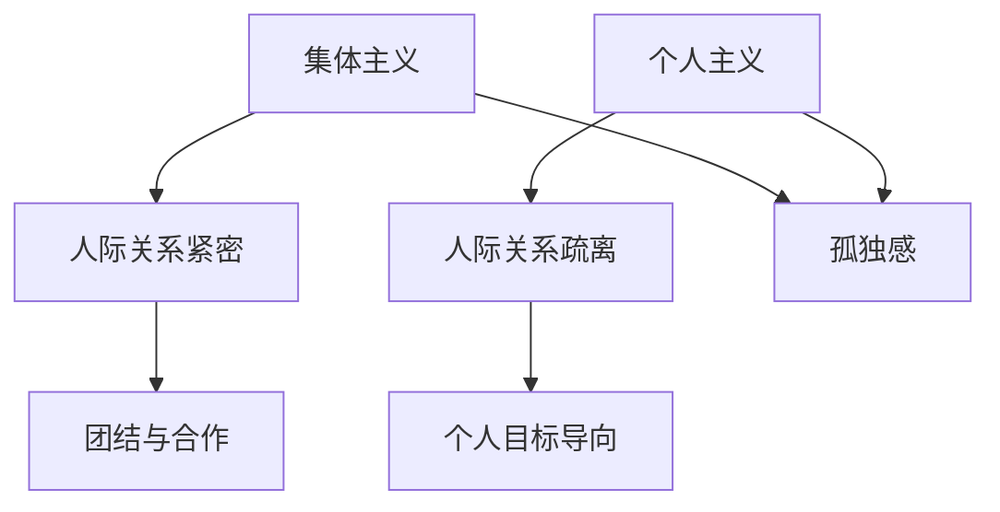

#### 2.1.2 网络社会的影响

随着互联网和社交媒体的普及，人们可以更加容易地与他人进行虚拟交流。然而，这种虚拟社交方式有时反而加剧了孤独感。

**核心概念与联系：**  
网络社会提供了丰富的社交机会，但也可能导致“社交沙漠化”，即个体在虚拟世界中建立了许多表面关系，但缺乏深层次的社交连接。

**Mermaid流程图：**

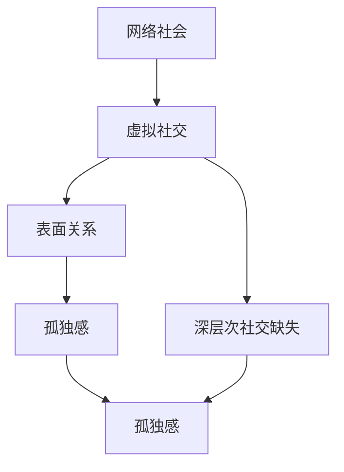

### 2.2 心理因素对孤独感的作用

#### 2.2.1 自尊心与自卑感

自尊心低下和自卑感是孤独感的常见心理因素。个体如果认为自己不值得被爱或被尊重，可能会感到孤独。

**核心概念与联系：**  
自尊心是指个体对自己的评价和看法，自卑感则是负面的自我认知。两者都会影响个体与他人的互动，导致孤独感。

**Mermaid流程图：**

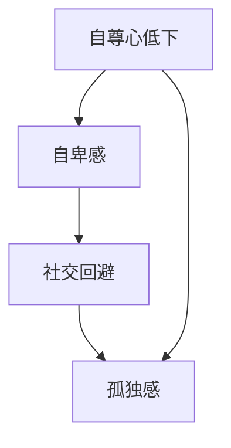

#### 2.2.2 社交焦虑

社交焦虑是一种常见的心理障碍，表现为在社交场合感到紧张、害怕和不适。这种焦虑可能导致个体避免社交活动，从而感到孤独。

**核心概念与联系：**  
社交焦虑是个体对社交情境的过度恐惧，这种恐惧会影响个体的社交行为，导致孤独感的产生。

**Mermaid流程图：**

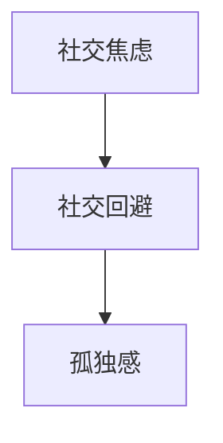

### 2.3 生活习惯与孤独感

#### 2.3.1 工作压力

工作压力是现代社会中普遍存在的问题，它可能导致个体忽视社交活动，从而感到孤独。

**核心概念与联系：**  
工作压力使得个体在生理和心理上疲惫，减少参与社交活动的动力，进而感到孤独。

**Mermaid流程图：**

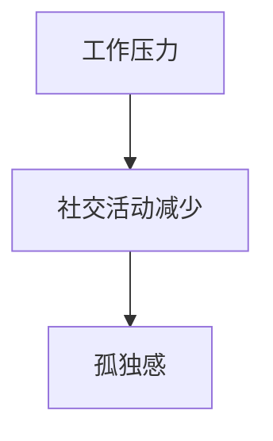

#### 2.3.2 家庭与育儿压力

家庭和育儿压力也是导致孤独感的因素之一。特别是对于双职工家庭和单身父母，育儿压力可能导致他们在社交方面投入较少的时间，从而感到孤独。

**核心概念与联系：**  
家庭和育儿压力使得个体在照顾孩子和家庭事务上消耗大量精力，减少参与社交活动的机会，导致孤独感。

**Mermaid流程图：**

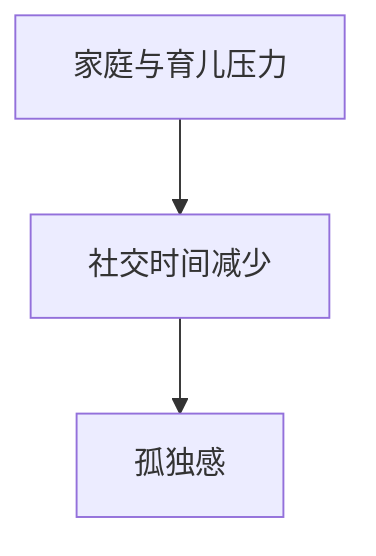

### 总结

孤独感的根源是多方面的，包括社会变迁、心理因素和生活习惯。理解这些根源有助于我们更有效地应对孤独感，重建健康的社交关系。在下一部分中，我们将探讨如何通过建立和维护人际关系来克服孤独感。

### 第二部分：重建社交纽带的方法与实践

## 第3章：建立和维护人际关系

建立和维护健康的人际关系对于克服孤独感至关重要。本章将讨论如何培养社交技能、建立信任和共鸣，以及构建有效的社交网络。

### 3.1 社交技能的培养

#### 3.1.1 倾听技巧

倾听是建立有效沟通的重要基础。通过倾听，我们可以更好地理解他人的需求和感受，从而建立更深层次的连接。

**核心概念与联系：**  
倾听不仅仅是对他人说话的内容进行听辨，更重要的是理解其背后的情感和需求。

**Mermaid流程图：**

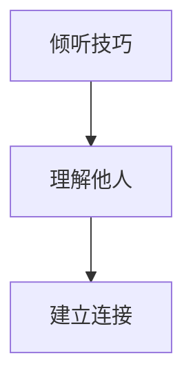

#### 3.1.2 表达自己

有效的表达是建立健康社交关系的关键。通过清晰地表达自己的观点和感受，我们可以减少误解和冲突，建立信任。

**核心概念与联系：**  
表达自己需要自信和诚实，同时要考虑到他人的感受。

**Mermaid流程图：**

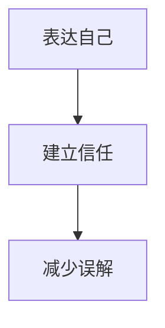

#### 3.1.3 跨文化沟通

随着全球化的发展，跨文化沟通变得尤为重要。了解不同文化的交际方式和价值观，有助于我们更好地与他人沟通。

**核心概念与联系：**  
跨文化沟通需要开放的心态和对他文化差异的尊重。

**Mermaid流程图：**

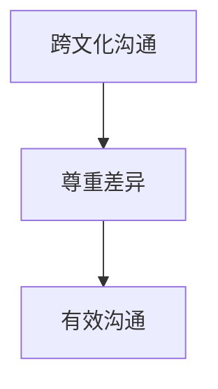

### 3.2 建立信任和共鸣

#### 3.2.1 信任的建立

信任是任何关系中的基石。建立信任需要时间和耐心，通过一致性、诚实和透明度来实现。

**核心概念与联系：**  
信任的建立需要我们在行为上一致，言出必行，保持诚实，并对他人保持透明。

**Mermaid流程图：**

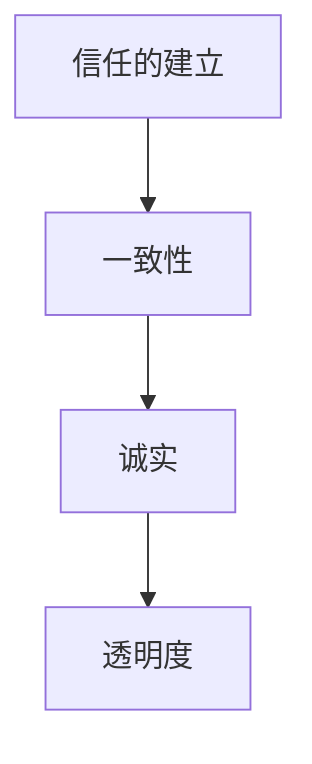

#### 3.2.2 共鸣的作用

共鸣是指与他人产生情感上的共鸣，这可以加深关系，减少孤独感。

**核心概念与联系：**  
共鸣需要我们理解他人的情感，并在适当的时候给予支持和理解。

**Mermaid流程图：**

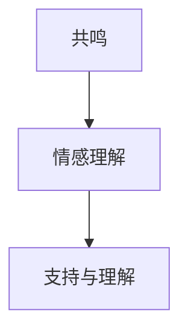

#### 3.2.3 真诚与尊重

真诚和尊重是建立健康关系的重要原则。真诚意味着我们要真实地表达自己，尊重则是对他人的价值观和信仰的尊重。

**核心概念与联系：**  
真诚和尊重可以增强人际关系的质量，减少误解和冲突。

**Mermaid流程图：**

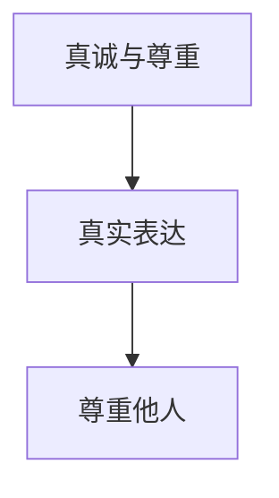

### 3.3 社交网络的构建

#### 3.3.1 社交媒体的运用

社交媒体为我们提供了便捷的社交平台，但同时也需要我们注意如何有效地使用它。

**核心概念与联系：**  
社交媒体可以用于建立和维护关系，但需要注意不要过度依赖，保持现实生活中的社交活动。

**Mermaid流程图：**

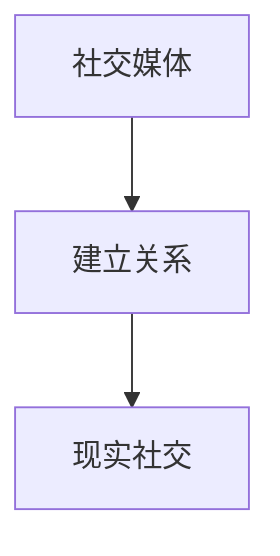

#### 3.3.2 线下活动的策划与参与

线下活动是建立和维护人际关系的重要方式。通过参与各种活动和聚会，我们可以扩大社交圈，建立更深入的关系。

**核心概念与联系：**  
线下活动提供了面对面的交流机会，有助于建立真实的社交关系。

**Mermaid流程图：**

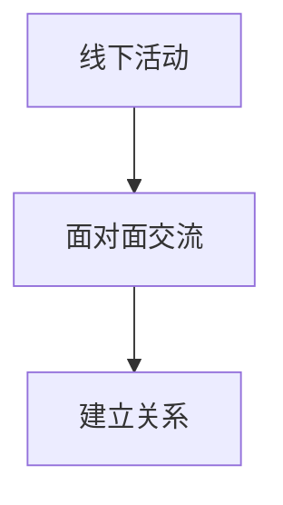

### 总结

建立和维护健康的人际关系需要培养社交技能、建立信任和共鸣，以及积极参与社交网络。通过这些方法，我们可以有效地克服孤独感，重建社交纽带。在下一章中，我们将探讨如何获取情感支持，进一步克服孤独感。

## 第4章：情感支持的获取

情感支持在克服孤独感中扮演着至关重要的角色。本章将探讨如何获取情感支持，包括寻求专业帮助、利用社区支持服务和建立家庭与朋友的支持网络。

### 4.1 情感支持的重要性

#### 4.1.1 情感支持与健康

情感支持对个体的身心健康至关重要。根据美国国家心理健康研究所（NIMH）的数据，缺乏情感支持与抑郁、焦虑和其他心理健康问题密切相关。情感支持可以提供心理安慰，减轻压力，增强个体的心理韧性。

**核心概念与联系：**  
情感支持是一种心理资源，可以改善个体的情绪状态，增强其应对压力和挑战的能力。

**Mermaid流程图：**

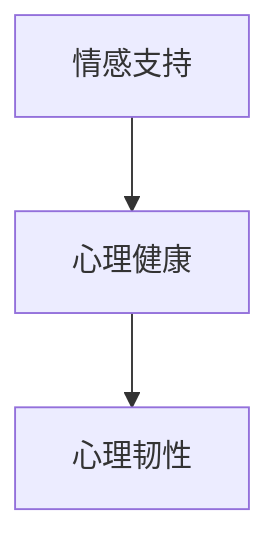

#### 4.1.2 情感支持与幸福感

情感支持不仅有助于心理健康，还能提高幸福感。一项发表于《心理学前沿》的研究指出，拥有强大的社会支持网络与更高的生活满意度之间存在显著关联。情感支持可以帮助个体感受到被关心和被重视，从而提升幸福感。

**核心概念与联系：**  
情感支持通过增强个体的人际关系，提供情感上的满足，从而提高整体幸福感。

**Mermaid流程图：**

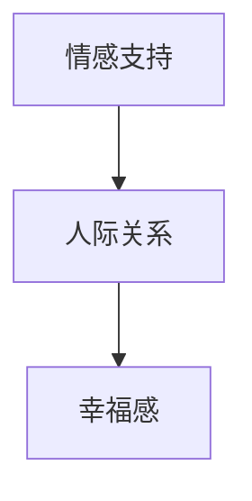

### 4.2 寻求专业帮助

#### 4.2.1 心理咨询与治疗

心理咨询和治疗是获取情感支持的有效途径。专业的心理咨询师可以提供个性化的心理辅导，帮助个体理解和管理自己的情感。

**核心概念与联系：**  
心理咨询和治疗通过专业的技术和方法，帮助个体探索内心世界，增强自我认知，从而改善情感状态。

**Mermaid流程图：**

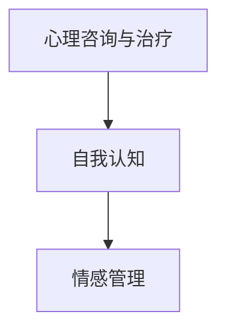

#### 4.2.2 社区支持服务

社区支持服务提供了多种形式的情感支持，如心理健康热线、支持小组和志愿者服务。这些服务可以提供即时的帮助和情感支持，帮助个体克服孤独感。

**核心概念与联系：**  
社区支持服务通过建立社区内的情感支持网络，为个体提供便利和资源的获取途径。

**Mermaid流程图：**

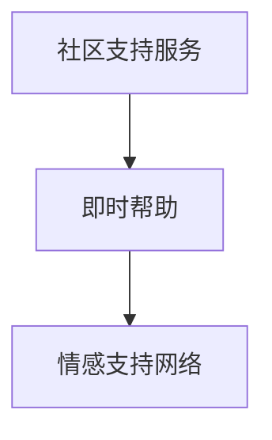

### 4.3 情感支持网络的建设

#### 4.3.1 家庭与朋友的支持

家庭和朋友是情感支持的重要来源。他们的关心和支持可以帮助个体感受到被爱和安全，从而缓解孤独感。

**核心概念与联系：**  
家庭和朋友通过日常的互动和关心，为个体提供情感上的支撑，增强其社交联结感。

**Mermaid流程图：**

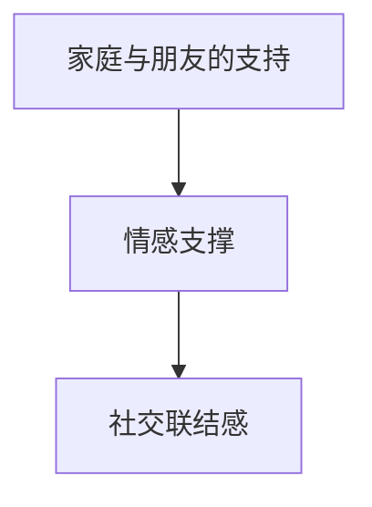

#### 4.3.2 社区互助小组

社区互助小组是一种组织形式，通过集体活动和分享经验，为成员提供情感支持和互相帮助的机会。这种小组可以在社区中建立紧密的联系，增强个体的归属感。

**核心概念与联系：**  
社区互助小组通过共同的目标和经历，为个体提供情感支持和社会归属。

**Mermaid流程图：**

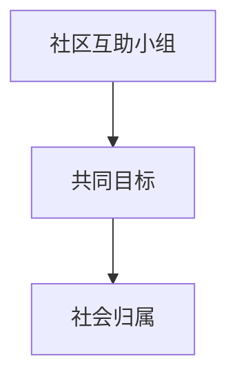

### 总结

情感支持在克服孤独感中起着关键作用。通过寻求专业帮助、利用社区支持服务和建立家庭与朋友的支持网络，个体可以获得全面的情感支持，从而有效地缓解孤独感。在下一章中，我们将探讨如何通过自我反思和成长来进一步重建社交纽带。

### 第5章：自我反思与成长

自我反思与成长是克服孤独感的重要一环。本章将探讨如何提升自我认知、培养心理韧性，以及应对心理危机，帮助个体在内心找到力量，重建社交纽带。

#### 5.1 自我认知的提升

自我认知是指个体对自己的了解程度，包括性格、价值观、情感和行为模式。提升自我认知可以帮助个体更清晰地认识自己，从而更好地应对孤独感。

**核心概念与联系：**  
自我认知是一个不断探索和了解自己的过程，它有助于个体识别自己的需求和弱点，进而做出积极的改变。

**Mermaid流程图：**

```mermaid
graph TD
    A[自我认知] --> B[了解自己]
    B --> C[积极改变]
```

**5.1.1 自我探索的方法**

- **日记法**：通过记录日常思考和情感变化，个体可以更好地了解自己的内心世界。
- **心理咨询**：专业的心理咨询师可以帮助个体深入探讨内心，提升自我认知。

**5.1.2 自我价值的确认**

确认自我价值是自我认知的重要部分。个体需要认识到自己的独特性和价值，从而增强自信心。

**核心概念与联系：**  
自我价值的确认有助于个体在面对挑战和困难时保持积极的心态，减少孤独感。

**Mermaid流程图：**

```mermaid
graph TD
    A[自我价值确认] --> B[增强自信]
    B --> C[积极应对]
```

**5.1.3 自我成长的路径**

自我成长是一个持续的过程，需要个体不断学习和实践。以下是一些自我成长的方法：

- **终身学习**：通过学习新知识和技能，个体可以不断提升自己，增加自信心。
- **自我提升计划**：制定个人成长计划，设定短期和长期目标，逐步实现。

**核心概念与联系：**  
自我成长不仅有助于提升个体的综合素质，还能增强其在社交中的竞争力，减少孤独感。

**Mermaid流程图：**

```mermaid
graph TD
    A[自我成长] --> B[知识技能提升]
    B --> C[社交竞争力]
```

#### 5.2 心理韧性的培养

心理韧性是指个体在面对压力和挑战时，能够迅速适应和恢复的能力。培养心理韧性有助于个体更好地应对孤独感。

**核心概念与联系：**  
心理韧性是应对孤独感的重要心理资源，它可以帮助个体在逆境中保持积极，减少孤独感的影响。

**5.2.1 应对压力的策略**

- **放松训练**：通过深呼吸、冥想和瑜伽等放松技巧，个体可以减轻压力，提高心理韧性。
- **时间管理**：合理安排时间，避免过度工作和疲劳，有助于提高个体的抗压能力。

**核心概念与联系：**  
有效的压力管理策略可以帮助个体更好地应对生活中的挑战，提高心理韧性。

**Mermaid流程图：**

```mermaid
graph TD
    A[压力管理] --> B[心理韧性]
    B --> C[应对挑战]
```

**5.2.2 增强心理韧性的方法**

- **积极心态**：培养积极的心态，学会从困境中寻找机会和成长。
- **情绪调节**：学会识别和调节自己的情绪，避免情绪的过度波动。

**核心概念与联系：**  
积极心态和情绪调节是增强心理韧性的关键，它们可以帮助个体更好地应对孤独感和生活中的挑战。

**Mermaid流程图：**

```mermaid
graph TD
    A[积极心态] --> B[心理韧性]
    B --> C[情绪调节]
```

**5.2.3 心理危机的处理**

在遭遇心理危机时，个体的心理韧性尤为重要。以下是一些处理心理危机的方法：

- **求助**：在遇到严重心理问题时，及时寻求专业帮助，如心理咨询师或心理医生。
- **社会支持**：利用家庭和朋友的支持网络，共同应对危机。

**核心概念与联系：**  
在心理危机中，心理韧性和社会支持是关键因素，它们可以帮助个体度过难关。

**Mermaid流程图：**

```mermaid
graph TD
    A[求助] --> B[专业帮助]
    B --> C[社会支持]
```

### 总结

自我反思与成长是克服孤独感的重要途径。通过提升自我认知、培养心理韧性，以及学会应对心理危机，个体可以在内心找到力量，重建健康的社交关系。在下一章中，我们将通过实际案例研究，进一步探讨如何有效地重建社交纽带。

## 第6章：重建社交纽带的案例研究

在本章中，我们将通过两个实际案例研究，探讨如何通过不同的策略和行动，成功地克服孤独感，重建社交纽带。

### 6.1 案例一：从孤独到社交达人

#### 6.1.1 案例背景

李小姐，30岁，从事金融工作。由于工作繁忙和性格内向，她很少有时间参加社交活动，逐渐感到孤独和失落。她的社交圈很小，主要是同事和少量的朋友，但她很少与这些人深入交流。

#### 6.1.2 重建过程

李小姐开始意识到孤独感对她的生活质量产生了负面影响，于是决定采取行动。以下是她重建社交纽带的步骤：

1. **自我认知提升**：
   - 李小姐通过写日记和参加自我探索课程，逐渐认识到自己的需求和愿望。
   - 她明确了想要扩大社交圈，增加与朋友的互动，并提高了自我认知。

2. **培养社交技能**：
   - 李小姐参加了社交技能培训课程，学习了如何更有效地表达自己、倾听他人和建立共鸣。
   - 通过练习，她的社交能力得到了显著提升。

3. **积极参与社交活动**：
   - 李小姐开始参加各种线下活动，如读书会、户外徒步和兴趣小组，逐渐扩大了社交圈。
   - 她主动与他人交流，分享自己的兴趣和经历，建立了许多新的社交关系。

4. **情感支持网络**：
   - 李小姐通过参加心理健康支持小组，获得了专业的情感支持。
   - 她在小组中与其他成员分享自己的经历，得到了安慰和鼓励。

#### 6.1.3 成功经验

通过上述步骤，李小姐成功地克服了孤独感，变得更加开朗和自信。她不仅扩大了社交圈，还建立了深厚的友谊。她的生活质量得到了显著提升，工作和家庭关系也变得更加和谐。

**核心概念与联系：**  
李小姐的案例展示了通过自我认知提升、社交技能培养、积极参与社交活动和情感支持网络，可以有效地克服孤独感，重建社交纽带。

### 6.2 案例二：社交网络的有效利用

#### 6.2.1 案例背景

王先生，40岁，是一名技术工程师。由于工作性质，他经常需要长时间坐在电脑前，很少有机会与同事和外部社交圈互动。他感到自己的社交网络过于狭窄，希望扩大社交圈，提高社交能力。

#### 6.2.2 社交策略

王先生采取了以下策略来扩大社交网络：

1. **利用社交媒体**：
   - 王先生开始积极使用社交媒体平台，如LinkedIn和微信，与行业内的专业人士建立联系。
   - 他通过分享专业知识和参与行业讨论，吸引了更多的关注和互动。

2. **线上活动和会议**：
   - 王先生参加了一些线上行业活动和研讨会，与同行交流经验，拓展了专业网络。
   - 他通过线上会议和在线培训课程，不断更新自己的知识，同时结识了新朋友。

3. **线下活动**：
   - 尽管工作繁忙，王先生仍然抽出时间参加一些线下活动，如技术会议和行业聚会。
   - 他通过这些活动，不仅结识了新朋友，还巩固了与现有同事的关系。

#### 6.2.3 社交成果

通过上述策略，王先生的社交网络得到了显著扩大，他在专业领域的影响力也不断提升。他的社交能力得到了锻炼，更加自信和开朗。这些变化不仅提高了他的生活质量，也促进了他在工作中的职业发展。

**核心概念与联系：**  
王先生的案例展示了通过有效利用社交媒体、线上活动和线下活动，可以成功地扩大社交网络，提高社交能力，从而克服孤独感。

### 总结

通过这两个案例，我们可以看到，重建社交纽带需要一系列具体的行动和策略。无论是通过自我认知提升、社交技能培养，还是积极参与社交活动和利用社交网络，都可以有效地克服孤独感，重建健康的社交关系。在下一章中，我们将探讨未来展望和社会责任，思考如何进一步促进社会中的社交纽带建设。

### 第7章：未来展望与社会责任

在现代社会中，孤独感已经成为一个普遍存在的心理健康问题。随着科技的不断进步，社交科技的发展趋势对孤独感的克服和社交纽带的重建产生了深远的影响。同时，社会各界也应承担起责任，共同推动这一进程。

#### 7.1 社交科技的发展趋势

#### 7.1.1 社交媒体的未来

社交媒体作为现代社交的主要平台，正在不断发展和演变。未来，社交媒体将更加注重用户隐私和信息安全，同时提供更多个性化的社交体验。例如，通过人工智能算法，社交媒体将能够更好地理解用户的需求，推荐合适的社交活动和联系人。

**核心概念与联系：**  
社交媒体的个性化推荐系统可以帮助用户更容易地找到志同道合的朋友，从而缓解孤独感。

**Mermaid流程图：**

```mermaid
graph TD
    A[个性化推荐系统] --> B[找到志同道合的朋友]
    B --> C[缓解孤独感]
```

#### 7.1.2 社交科技的伦理问题

尽管社交科技的发展带来了诸多好处，但也引发了一些伦理问题。例如，虚假信息传播、网络欺凌和隐私泄露等问题。为了解决这些问题，需要制定更加严格的政策和法规，确保社交科技的发展符合伦理标准。

**核心概念与联系：**  
伦理问题需要在科技发展和用户权益之间找到平衡，确保社交科技的发展不会加剧孤独感。

**Mermaid流程图：**

```mermaid
graph TD
    A[伦理问题] --> B[用户权益保护]
    B --> C[科技发展平衡]
```

#### 7.2 社会责任的承担

社会中的各个层面都有责任参与到孤独感的克服和社交纽带的重建中。以下是一些社会责任的承担方式：

##### 7.2.1 政策与法规的制定

政府和相关部门应制定相关政策，支持和鼓励社交活动的开展。例如，提供资金支持社区活动和心理健康服务，制定反网络欺凌的法律。

**核心概念与联系：**  
政策与法规的制定可以为社交纽带的重建提供制度保障，促进社会各层面的积极参与。

**Mermaid流程图：**

```mermaid
graph TD
    A[政策与法规] --> B[制度保障]
    B --> C[社会参与]
```

##### 7.2.2 企业社会责任的实践

企业应承担起社会责任，通过多种方式支持社交纽带的重建。例如，提供员工心理健康支持计划、组织社交活动和培训等。

**核心概念与联系：**  
企业可以通过支持员工心理健康和社交活动，提高员工的工作满意度和生活质量，从而减少孤独感。

**Mermaid流程图：**

```mermaid
graph TD
    A[企业社会责任] --> B[员工心理健康支持]
    B --> C[工作满意度提升]
```

##### 7.2.3 公众参与的呼吁

公众也应积极参与到社交纽带的重建中，通过日常的互动和关心，为他人提供情感支持。例如，参加社区活动、加入互助小组等。

**核心概念与联系：**  
公众的参与可以建立更广泛的社交支持网络，为个体提供更多的情感资源，从而减少孤独感。

**Mermaid流程图：**

```mermaid
graph TD
    A[公众参与] --> B[社交支持网络]
    B --> C[减少孤独感]
```

### 总结

未来，通过社交科技的发展和社会各界的共同努力，我们可以更好地克服孤独感，重建健康的社交纽带。政策与法规的制定、企业社会责任的实践和公众的积极参与都是实现这一目标的关键。让我们共同努力，为建设一个更加温暖和连接的社会贡献力量。

## 作者信息

作者：AI天才研究院/AI Genius Institute & 禅与计算机程序设计艺术 /Zen And The Art of Computer Programming

在《重建社交纽带：克服现代社会的孤独感》一文中，我们通过逻辑清晰的分析和丰富的案例，探讨了孤独感的根源、影响以及克服孤独感的方法。从社会变迁、心理因素和生活习惯的深入分析，到社交技能的培养、情感支持的获取和自我反思与成长，我们提供了全方位的解决方案。

本文结合了心理学、社会学和科技发展的最新成果，旨在为读者提供实用的指导和建议。通过提升自我认知、培养心理韧性、积极参与社交活动，个体可以在内心找到力量，重建健康的社交纽带。

在未来，随着社交科技的发展和社会责任意识的增强，我们有理由相信，孤独感将逐渐被克服，社交纽带将更加紧密。让我们一起努力，为实现这一目标贡献自己的力量。

作者：AI天才研究院/AI Genius Institute & 禅与计算机程序设计艺术 /Zen And The Art of Computer Programming

