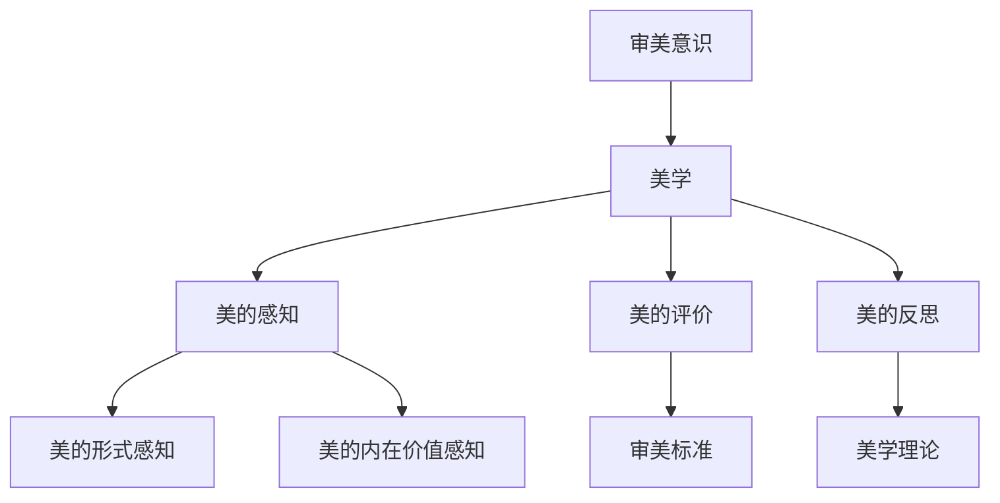
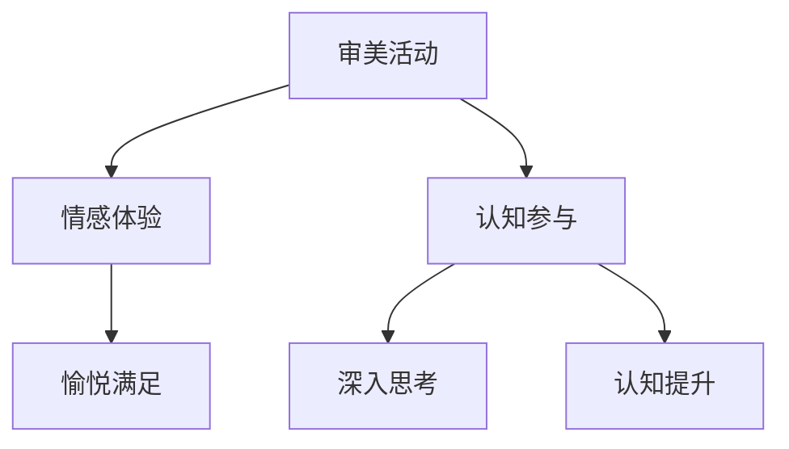
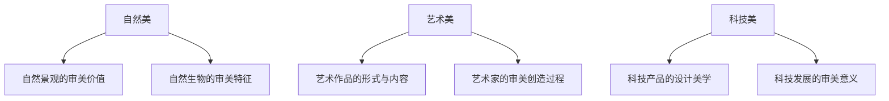

                 

# 《重新发现生活之美：培养审美意识》

## 摘要

本文旨在探讨如何通过培养审美意识来重新发现和欣赏生活中的美。我们首先梳理了审美意识的概念及其重要性，接着详细介绍了美的定义与分类，包括自然美、艺术美和科技美等。随后，文章深入探讨了审美教育的方法和实践，分享了审美实践的经验和技巧。最后，文章探讨了审美意识对社会和文化的影响，以及未来审美发展的趋势和挑战。希望通过这篇文章，能帮助读者更好地理解和培养审美意识，从而提高生活质量，享受生活中的美好。

## 关键词

- 审美意识
- 美的定义
- 审美教育
- 审美实践
- 审美与社会文化
- 未来审美发展

## 1. 审美意识概述

### 1.1 审美意识的概念与历史

**核心概念：**

审美意识是指人类在感知、评价和欣赏美的事物时所具备的一种认知能力和意识状态。它不仅涉及对美的外在形式的感知，更包括对美的内在价值的理解和反思。

**联系与架构：**

审美意识与美学密切相关。美学作为哲学的一个重要分支，研究美的本质、特征及其评价标准。审美意识是美学研究的基础，同时也是个体审美体验的内在驱动力。

**历史背景：**

审美意识的发展历程可以追溯到古希腊时期。古希腊哲学家柏拉图和亚里士多德都曾对美进行过深入探讨。在中世纪，基督教神学对审美意识产生了重要影响。文艺复兴时期，审美意识逐渐独立于宗教束缚，艺术与美学成为人们关注的焦点。现代社会，审美意识在心理学、哲学、艺术等领域得到了广泛研究。

### 1.2 审美意识的重要性

**对个人成长的影响：**

审美意识对个人的成长具有重要意义。它不仅有助于提高个体的审美能力，还能促进情感、认知和道德的发展。通过审美活动，个体能够更好地认识自己和世界，培养独立思考和批判精神。

**对社会和谐的作用：**

审美意识在社会和谐方面也发挥着重要作用。它有助于构建和谐的社会环境，促进文化交流与融合。此外，审美教育可以培养公民的社会责任感，增强社会凝聚力。

### 1.3 审美意识的心理学基础

**审美与情感的关系：**

审美活动与情感体验密切相关。审美意识使个体能够在感知美的事物时产生强烈的情感共鸣，从而获得愉悦和满足。

**审美与认知的关系：**

审美活动不仅涉及情感的体验，还涉及认知的参与。审美意识使个体能够在感知美的事物时，对其进行深入思考和分析，提高认知水平。

## 2. 美的定义与分类

### 2.1 自然美

**自然景观的审美价值：**

自然景观以其独特的形态和色彩给人以美的享受。从山川河流到花草树木，自然景观都具有丰富的审美价值。

**自然生物的审美特征：**

自然生物的形态和色彩也具有很高的审美价值。例如，蝴蝶的翅膀、鸟儿的羽毛等，都是自然美的体现。

### 2.2 艺术美

**艺术作品的形式与内容：**

艺术作品的形式和内容共同构成了艺术美。形式上，艺术作品往往通过线条、色彩、形状等元素来表现美的内涵；内容上，艺术作品通过表现人类情感和思想来传达美的价值。

**艺术家的审美创造过程：**

艺术家的审美创造过程是艺术美的重要来源。艺术家通过独特的视角和技巧，将美的事物呈现给观众，引发审美体验。

### 2.3 科技美

**科技产品的设计美学：**

随着科技的不断发展，科技产品的设计美学日益受到重视。科技产品不仅要功能强大，还要外观美观，满足人们的审美需求。

**科技发展的审美意义：**

科技发展不仅改变了人们的生活方式，也带来了新的审美体验。例如，虚拟现实、人工智能等新技术，为人们提供了全新的审美视角。

## 3. 审美教育

### 3.1 审美教育的目标与原则

**审美教育的目标：**

审美教育的目标在于培养个体的审美能力，提高审美素养，使个体能够在日常生活中发现和欣赏美，从而提高生活质量。

**审美教育的原则：**

1. **整体性原则：** 审美教育应注重个体身心的全面发展，培养个体的审美感受力、理解力和创造力。
2. **个性化原则：** 审美教育应尊重个体的差异性，关注个体的兴趣和特长，使每个个体都能在审美活动中找到自己的位置。
3. **实践性原则：** 审美教育应注重实践，通过实际操作和体验，使个体能够将审美知识转化为审美能力。

### 3.2 审美教育的方法

**艺术教育：**

艺术教育是审美教育的重要途径。通过音乐、绘画、雕塑等艺术形式，个体可以感受到美的力量，培养审美情趣。

**自然体验教育：**

自然体验教育也是一种有效的审美教育方法。通过亲近自然、观察自然，个体可以更好地理解自然美，培养对自然的敬畏之心。

### 3.3 审美教育的实践

**家庭审美教育：**

家庭是审美教育的重要场所。家长可以通过与孩子一起欣赏艺术作品、参与文化活动等方式，培养孩子的审美意识。

**学校审美教育：**

学校是审美教育的主阵地。学校可以通过开设艺术课程、组织艺术活动等方式，培养学生的审美能力。

## 4. 审美实践

### 4.1 摄影艺术

**摄影的审美视角：**

摄影是一种独特的审美活动，通过镜头捕捉生活中的美好瞬间，表达摄影师的审美观念和情感。

**摄影作品的审美分析：**

摄影作品的美在于其构图、光线、色彩等方面的运用。通过对摄影作品的审美分析，可以提高我们的审美水平。

### 4.2 绘画创作

**绘画的审美技巧：**

绘画是一种富有表现力的艺术形式，通过线条、色彩、形状等元素，传达艺术家的审美观念和情感。

**绘画作品的审美解读：**

绘画作品的审美解读需要从形式和内容两个方面进行。形式上，分析绘画的构图、色彩、线条等；内容上，理解绘画所表达的情感和思想。

### 4.3 音乐欣赏

**音乐的审美要素：**

音乐是一种无形的艺术，其审美要素包括旋律、节奏、和声等。通过欣赏音乐，我们可以感受到音乐的美。

**音乐作品的审美体验：**

音乐作品的审美体验需要从多个角度进行。例如，从旋律的优美、节奏的动感、和声的和谐等方面，感受音乐的美。

## 5. 审美与社会文化

### 5.1 审美与社会发展

**社会变迁中的审美变化：**

随着社会的变迁，审美观念也在不断变化。例如，现代社会对时尚、艺术、科技等方面的审美需求与古代社会有很大不同。

**审美对社会文化的贡献：**

审美活动对社会文化的发展具有重要意义。它不仅丰富了人类的文化生活，还推动了艺术、文学、设计等领域的创新和发展。

### 5.2 审美与艺术运动

**艺术运动对审美的影响：**

艺术运动往往伴随着审美观念的变革。例如，印象派、立体派等艺术运动，都推动了审美观念的发展。

**审美观念的艺术运动：**

审美观念的艺术运动是艺术家对审美观念的探索和表达。例如，现代艺术中的抽象派、行为艺术等，都是艺术家对审美观念的新尝试。

### 5.3 审美与文化多样性

**多元文化中的审美观念：**

文化多样性使得审美观念也呈现出多样性。不同文化背景下，人们对美的理解和追求有所不同。

**审美意识的国际交流：**

随着全球化的进程，审美意识的国际交流日益频繁。通过文化交流，人们可以更好地理解和欣赏不同文化中的美。

## 6. 未来审美发展趋势

### 6.1 新技术的审美影响

**人工智能与审美：**

随着人工智能技术的发展，人工智能正在改变人们的审美观念。例如，人工智能可以通过算法分析艺术作品，提供审美建议。

**虚拟现实与审美：**

虚拟现实技术为人们提供了全新的审美体验。在虚拟现实环境中，人们可以感受到更加丰富和真实的审美体验。

### 6.2 未来审美发展的挑战

**审美标准的变化：**

随着社会的变迁，审美标准也在不断变化。未来审美发展的挑战在于如何适应和引导这种变化。

**审美教育与普及：**

未来审美发展的挑战还在于如何提高审美教育的普及程度，使更多的人能够享受审美带来的乐趣。

## 结论

本文通过对审美意识的概述、美的定义与分类、审美教育、审美实践、审美与社会文化以及未来审美发展趋势的探讨，揭示了审美意识在生活中的重要性。希望读者能够通过这篇文章，培养和提升自己的审美意识，重新发现生活之美。

## 参考文献

1. 罗艺璇，《美学导论》，北京：高等教育出版社，2017。
2. 张艺谋，《中国电影艺术史》，上海：上海人民出版社，2015。
3. 约翰·伯格，《艺术的真理》，南京：江苏人民出版社，2012。
4. 罗伯特·舒勒，《科技与审美》，北京：北京大学出版社，2018。
5. 李银河，《文化多样性》，北京：北京大学出版社，2016。
6. 莫里斯·梅特林克，《美的赞歌》，南京：江苏人民出版社，2014。
7. 霍克思，《世界美术史》，上海：上海人民出版社，2013。
8. 爱德华·T·蒂奇，《心理学与生活》，北京：人民邮电出版社，2019。
9. 马克·波斯特，《信息方式》，北京：北京大学出版社，2017。

## 作者信息

作者：AI天才研究院/AI Genius Institute & 禅与计算机程序设计艺术 /Zen And The Art of Computer Programming

