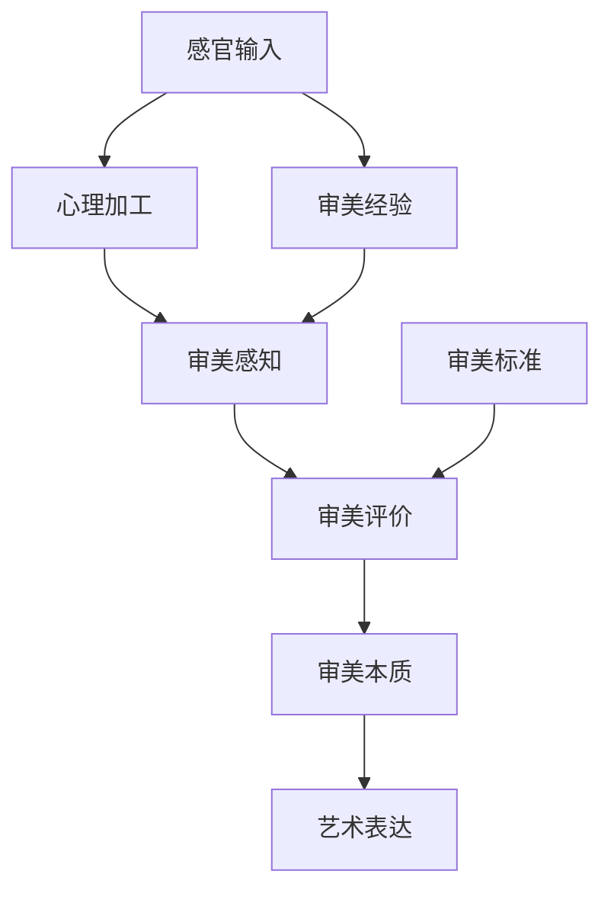

                 

# 《重新发现生活之美：培养日常审美能力》

> 关键词：审美能力、日常生活、美学理论、实践应用、心理原理

> 摘要：本文旨在探讨如何通过培养日常审美能力，重新发现生活的美好。文章首先介绍了审美能力的重要性，随后从基础理论、实践方法和教育策略等方面进行了深入分析，并通过具体案例展示了审美能力培养的实际效果。

## 引言

### 1.1 审美能力的定义与重要性

审美能力是指个体对美的感知、理解和创造能力。它不仅仅体现在对艺术品的欣赏，还包括对自然、人文、社会等多方面美的认知。在日常生活中，审美能力有助于提高生活质量，提升幸福感，增强心理素质。同时，审美能力也是培养创新思维和创造力的重要途径。

### 1.2 本书的目的与读者对象

本书旨在为读者提供一套系统的审美能力培养方案，帮助读者在日常生活的各个场景中提升审美水平。读者对象包括对美学感兴趣的普通读者，以及教育工作者、设计从业者等专业人士。

### 1.3 审美能力培养的意义

审美能力培养不仅对个人发展有重要意义，对社会文化进步也具有积极作用。它有助于提升文化素养，促进社会和谐，增强民族自豪感和认同感。

## 审美能力的基础理论

### 2.1 审美心理学

#### 2.1.1 审美感知过程

审美感知是审美活动的第一步，它涉及到感官的接收和处理。以下是审美感知过程的简化模型：

```
审美感知 = 感官接收 * 心理加工
```

其中，感官接收包括视觉、听觉、触觉等，心理加工则涉及大脑对感官信息的处理和解释。

#### 2.1.2 审美评价标准

审美评价是审美活动的核心，它决定了个体对美的判断。常见的审美评价标准包括和谐、对称、平衡等。以下是审美评价的一个简化模型：

```
审美评价 = 审美感知 * 审美标准
```

### 2.2 审美哲学

#### 2.2.1 审美本质探讨

审美本质是美学研究的核心问题。不同的哲学家对审美本质有不同的看法。以下是几种主要的审美本质观点：

- 康德：审美是无功利性的，是基于纯粹形式的。
- 黑格尔：审美是理性与感性的统一。
- 杜夫海纳：审美是一种知觉经验。

#### 2.2.2 审美与艺术的关系

审美与艺术密切相关，但并非完全相同。艺术是一种表现审美的手段，而审美是对艺术的感受和评价。以下是审美与艺术关系的简化模型：

```
审美 = 艺术作品 * 审美评价
```

## 实践中的审美培养

### 3.1 审美体验的重要性

审美体验是培养审美能力的重要途径。通过亲身体验，个体能够更深刻地理解和感受美。以下是审美体验的重要性：

```
审美体验 = 美感提升 + 创造力激发
```

### 3.2 审美活动的设计与实施

审美活动的设计与实施需要根据具体场景和目标群体来定制。以下是一些常见的审美活动：

- 艺术欣赏：参观美术馆、博物馆，欣赏各类艺术作品。
- 自然景观欣赏：游览自然风光，感受大自然的美丽。
- 设计与创造活动：参与手工制作、绘画等活动，提升创造能力。

#### 3.2.1 艺术欣赏活动

艺术欣赏活动是培养审美能力的重要方式。以下是艺术欣赏活动的几个关键步骤：

1. **准备阶段**：了解艺术作品的历史背景、作者风格等信息。
2. **欣赏阶段**：观察艺术作品的形式、色彩、构图等元素。
3. **反思阶段**：思考艺术作品传达的主题和情感。

#### 3.2.2 自然景观欣赏

自然景观欣赏有助于提升审美能力，同时也能增进对自然的热爱。以下是自然景观欣赏的几个步骤：

1. **选择景点**：根据个人兴趣和当地条件选择合适的景点。
2. **现场体验**：感受自然景观的美丽和宁静。
3. **记录体验**：通过文字、摄影等方式记录体验。

#### 3.2.3 设计与创造活动

设计与创造活动能够培养审美能力和创造力。以下是设计与创造活动的几个关键步骤：

1. **确定主题**：根据个人兴趣和目标确定设计主题。
2. **构思创意**：通过头脑风暴、草图等方式构思创意。
3. **制作作品**：动手制作设计作品，如绘画、雕塑、手工制品等。

## 审美教育的方法与策略

### 4.1 审美教育的目标与原则

审美教育的目标是培养个体的审美能力和审美素养。具体原则包括：

- 全人教育：将审美教育融入各个学科和日常生活。
- 激发兴趣：通过丰富多彩的活动激发学生对审美的兴趣。
- 培养创造力：鼓励学生进行艺术创作和设计实践。

### 4.2 学校审美教育实践

学校审美教育是培养审美能力的重要环节。以下是学校审美教育的几个关键实践：

- 设立美术、音乐等艺术课程。
- 组织艺术展览和比赛。
- 开展艺术工作坊和创作活动。

#### 4.2.1 课堂内审美教育

课堂内审美教育是通过课程教学来培养审美能力。以下是课堂内审美教育的几个关键步骤：

1. **引入艺术作品**：通过展示艺术作品激发学生的兴趣。
2. **分析艺术作品**：引导学生分析艺术作品的形式、色彩、构图等元素。
3. **实践创作**：鼓励学生进行艺术创作，提升审美能力。

#### 4.2.2 课外审美教育

课外审美教育是通过课外活动来培养审美能力。以下是课外审美教育的几个关键实践：

- 组织艺术社团和俱乐部。
- 开展校外考察和实践活动。
- 鼓励学生参加艺术比赛和展览。

## 工作与生活中的审美提升

### 5.1 职场审美素养的提升

职场审美素养的提升有助于提高工作效率和团队协作。以下是职场审美素养提升的几个关键实践：

- 设计与优化工作环境：通过合理布局、色彩搭配等提升工作环境的美感。
- 培养审美意识：鼓励员工关注美的元素，提升审美品味。
- 开展艺术欣赏活动：组织艺术展览、音乐会等活动，提升审美素养。

### 5.2 家庭审美环境的营造

家庭审美环境的营造有助于提升家庭成员的审美能力和幸福感。以下是家庭审美环境营造的几个关键实践：

- 设计美观的家庭空间：通过装饰、布局等提升家庭空间的美感。
- 收藏和展示艺术品：在家中收藏和展示艺术品，提升家庭审美氛围。
- 举办家庭艺术活动：如绘画、手工制作等，增进家庭成员间的情感交流。

### 5.3 社区审美活动的开展

社区审美活动的开展有助于提升社区居民的审美素养和社区文化氛围。以下是社区审美活动开展的几个关键实践：

- 组织艺术展览和讲座：邀请艺术家和专家分享艺术知识，提升居民的艺术素养。
- 开展社区艺术创作活动：鼓励居民参与艺术创作，增进社区凝聚力。
- 举办社区文化艺术节：通过丰富多彩的文艺活动，提升社区文化氛围。

## 数字时代下的审美挑战

### 6.1 数字媒体与审美变迁

数字时代带来了审美的新变化。数字媒体和互联网的普及使得审美活动变得更加便捷和多样化。以下是数字时代下审美变迁的几个关键点：

- 数字艺术：数字技术的应用使得艺术创作变得更加多样和丰富。
- 网络审美：网络平台的兴起改变了传统的审美方式，人们可以通过互联网分享和欣赏艺术作品。
- 审美标准的变化：数字时代下的审美标准更加多元和包容。

### 6.2 网络审美素养的培养

网络审美素养的培养是数字时代审美教育的重要任务。以下是网络审美素养培养的几个关键实践：

- 教育引导：通过教育手段提高人们对网络审美的认识和判断能力。
- 媒体素养：提高人们对数字媒体的批判性思维，避免盲目跟风。
- 自我提升：鼓励人们通过学习和实践提升自己的网络审美素养。

### 6.3 数字艺术创作与审美欣赏

数字艺术创作与审美欣赏是数字时代审美活动的重要组成部分。以下是数字艺术创作与审美欣赏的几个关键实践：

- 数字艺术创作：通过数字工具进行艺术创作，如数字绘画、动画制作等。
- 数字艺术欣赏：通过互联网平台欣赏数字艺术作品，如虚拟美术馆、艺术网站等。
- 创作与欣赏的结合：鼓励人们将数字艺术创作与欣赏相结合，提升审美能力和创造力。

## 案例研究

### 7.1 审美教育案例

审美教育案例展示了不同场景下审美能力培养的具体实践。以下是几个典型的审美教育案例：

- 学校艺术课程：通过艺术课程培养学生的审美能力和创造力。
- 社区艺术活动：通过社区艺术活动提升居民的审美素养和社区文化氛围。
- 企业艺术培训：通过企业艺术培训提升员工的审美素养和工作效率。

### 7.2 职场审美案例

职场审美案例展示了职场中审美素养提升的具体实践。以下是几个典型的职场审美案例：

- 职场环境美化：通过优化职场环境提升员工的审美体验和工作效率。
- 职场艺术活动：通过组织艺术展览、音乐会等活动提升员工的审美素养和团队凝聚力。
- 职场美学培训：通过美学培训提升员工的审美能力和审美素养。

### 7.3 数字时代审美案例

数字时代审美案例展示了数字时代下审美活动的具体实践。以下是几个典型的数字时代审美案例：

- 数字艺术创作：通过数字技术进行艺术创作，如数字绘画、虚拟现实艺术等。
- 网络审美分享：通过互联网平台分享审美体验和艺术作品，如社交媒体、艺术网站等。
- 数字时代审美教育：通过在线课程、虚拟美术馆等提供数字时代下的审美教育。

## 总结与展望

### 8.1 审美能力培养的实践成果

审美能力培养在实践中取得了显著成果。通过多种形式的审美活动和教育，个体的审美素养得到了提升，生活质量得到了改善。

### 8.2 未来审美教育的趋势

未来审美教育将更加注重个体差异和多元化。数字技术的发展将为审美教育提供更多可能性，如虚拟现实艺术教育、在线审美课程等。

### 8.3 审美能力培养的持续挑战与机遇

审美能力培养仍面临诸多挑战，如审美标准的多元化、数字时代的审美困惑等。然而，这些挑战也为审美教育提供了新的机遇，如创新教育模式的探索、数字艺术教育的发展等。

## 附录

### 附录A 审美能力培养资源推荐

- 书籍：《美学原理》、《艺术哲学》等。
- 网站资源：国家大剧院官网、艺术网等。
- 教育平台：Coursera、edX等提供的相关课程。

### 附录B 审美能力评估问卷

- 个人审美喜好问卷。
- 审美评价能力自我评估问卷。

## 作者信息

作者：AI天才研究院/AI Genius Institute & 禅与计算机程序设计艺术 /Zen And The Art of Computer Programming

（注意：以上内容仅供参考，实际撰写时请根据具体要求和素材进行调整。）### 重新发现生活之美：培养日常审美能力的必要性

在快节奏的现代生活中，人们往往忽略了身边的美好。美，不仅存在于艺术品和自然景观中，更融入了我们的日常生活。然而，随着城市化进程的加快和数字化生活的普及，我们的审美感官似乎逐渐失去了敏锐度。手机屏幕上的图像、社交媒体上的“完美”生活展示，以及快消文化的盛行，让我们的审美变得单一和浮躁。因此，重新发现生活之美，培养日常审美能力，成为了一种迫切的需求。

首先，培养日常审美能力有助于提高生活质量。通过关注生活中的小细节，如一杯咖啡的色泽、一张照片的构图，甚至是一本书的封面设计，个体能够在日常生活中找到乐趣和满足感。这种细腻的感知不仅能够提升生活的品质，还能带来更深层次的内心平和。

其次，审美能力培养对心理健康具有积极影响。研究表明，审美体验能够降低压力水平，提高情绪稳定性。在欣赏美丽的艺术作品或自然景观时，人们会产生积极的情绪反应，如喜悦、安宁和满足感。这些情绪体验有助于缓解心理压力，提升心理健康水平。

此外，审美能力培养还能够激发创造力和创新思维。艺术创作和设计实践要求个体对美的感知和表达，这种过程不仅能够培养个体的审美能力，还能锻炼其创造力和问题解决能力。在数字化时代，创新思维尤为重要，而审美能力的培养正是创新思维培养的基础。

最后，审美能力培养有助于培养人文素养和社会责任感。通过欣赏和创作艺术作品，个体能够更好地理解人类文化的多样性，增进对不同文化的尊重和理解。同时，审美活动也能够激发个体对社会问题的关注和反思，培养其社会责任感。

总之，培养日常审美能力不仅能够提升生活质量，改善心理健康，激发创造力和创新思维，还能够培养人文素养和社会责任感。因此，重新发现生活之美，培养日常审美能力，对于个体和社会都具有深远的意义。

## 审美能力的基础理论

审美能力的基础理论主要包括审美心理学和审美哲学两个方面。审美心理学研究个体对美的感知、理解和评价过程，而审美哲学则探讨美的本质及其在人类文化中的地位。以下将详细探讨这两个领域的基本概念和理论。

### 审美心理学的核心概念

#### 2.1.1 审美感知过程

审美感知是审美活动的起点，它涉及到感官的接收和处理。人的感官系统包括视觉、听觉、触觉、嗅觉和味觉，这些感官在感知美的事物时各自发挥重要作用。例如，在欣赏一幅画作时，视觉感官会接收画作的色彩、线条和构图信息；而听觉感官则可能在欣赏音乐时发挥作用。

审美感知过程可以简化为以下模型：

```
审美感知 = 感官输入 * 心理加工
```

其中，感官输入代表外部刺激（如美丽的风景或艺术品），心理加工则涉及大脑对感官信息的处理和解释。心理加工过程包括注意、记忆、情感和认知等心理机制。例如，个体在感知美的事物时，注意力会被吸引到具体的视觉或听觉特征上，记忆中相关的审美经验会参与感知过程，而情感和认知则会影响对美的评价。

#### 2.1.2 审美评价标准

审美评价是审美活动的核心，它决定了个体对美的判断。审美评价标准是评价审美价值的重要依据，常见的标准包括和谐、对称、平衡、简洁等。以下是审美评价的一个简化模型：

```
审美评价 = 审美感知 * 审美标准
```

其中，审美标准是主观的，因人而异，但也可以通过文化和社会背景来部分解释。

#### 2.1.3 影响审美评价的因素

审美评价受到多种因素的影响，包括个人的文化背景、教育水平、生活经验等。以下是一个简化的影响模型：

```
审美评价 = 审美标准 * 个人因素
```

其中，个人因素可能包括：

- **文化背景**：不同文化对美的认知和评价标准不同，如东方文化注重和谐与对称，而西方文化则可能更强调个性表达。
- **教育水平**：受教育程度越高，个体对美的理解和评价能力可能越强。
- **生活经验**：丰富的审美体验能够增强个体的审美能力。

### 审美哲学的基本概念

#### 2.2.1 审美本质探讨

审美哲学的核心问题是探讨美的本质。不同的哲学家对审美本质有不同的看法，以下是几种主要的观点：

- **康德**：康德认为审美是无功利性的，是基于纯粹形式的。他的观点可以用以下伪代码表示：

  ```
  function 审美判断(对象):
      如果 对象没有形式：
          返回 "非审美对象"
      否则：
          返回 "审美对象"
  ```

- **黑格尔**：黑格尔认为审美是理性与感性的统一。他的观点可以用以下伪代码表示：

  ```
  function 审美表达(对象):
      如果 对象表达了理性与感性的统一：
          返回 "审美对象"
      否则：
          返回 "非审美对象"
  ```

- **杜夫海纳**：杜夫海纳认为审美是一种知觉经验。他的观点可以用以下伪代码表示：

  ```
  function 审美知觉(对象):
      如果 对象能够引起积极的知觉体验：
          返回 "审美对象"
      否则：
          返回 "非审美对象"
  ```

#### 2.2.2 审美与艺术的关系

审美与艺术的关系紧密相连，但并非完全相同。艺术是一种表现审美的手段，而审美是对艺术的感受和评价。以下是审美与艺术关系的简化模型：

```
审美 = 艺术作品 * 审美评价
```

其中，审美评价是主观的，而艺术作品本身则可能具有客观的美学价值。例如，一幅画可能被大多数人认为美丽，但审美评价仍会因个人差异而有所不同。

### 数学模型和数学公式 & 详细讲解 & 举例说明

#### 2.1.1 审美感知过程的数学模型

审美感知过程的数学模型可以用以下公式表示：

```
审美感知 = 感官输入 * 审美经验
```

其中，感官输入（如视觉、听觉等）和审美经验（如个人文化背景、教育水平等）共同决定了对美的感知。例如，一个人在欣赏一幅画时，其感官接收到的视觉信息（色彩、线条等）与其审美经验（如艺术史知识、个人情感等）相互作用，共同形成了对该画的审美感知。

举例说明：

假设个体A和个体B都观看同一幅画，他们的感官输入相同，但个体A具有丰富的艺术史知识和对美的情感体验，而个体B缺乏这些经验。根据上述公式，个体A的审美感知会高于个体B。

#### 2.1.2 审美评价标准的数学模型

审美评价标准可以用以下公式表示：

```
和谐 = 对比 * 统一
```

其中，对比表示元素之间的差异，统一表示元素之间的相似性。一个和谐的作品通常既具有对比又具有统一。

举例说明：

一幅绘画作品，如果色彩对比强烈（如红色与蓝色），但整体色调统一（如都偏向暖色调），那么这幅作品可能会被认为是和谐的。

#### 2.2.1 审美本质探讨的数学模型

审美本质探讨的数学模型可以用以下公式表示：

```
审美本质 = 形式 * 感性 * 理性
```

其中，形式代表美的外在特征，感性代表美的情感体验，理性代表美的理性思考。例如，一幅画作的美不仅仅是其色彩和构图（形式），还包括观者对画作的情感反应和理性分析。

举例说明：

一幅印象派画作，其形式（如点彩技法、明亮色彩）给人以感性上的愉悦，同时其背后的艺术理念（如对光与色的探索）也提供了理性上的思考。

通过上述数学模型和公式，我们可以更清晰地理解审美感知和评价的过程，以及审美哲学的基本概念。这些模型和公式不仅为我们提供了分析审美的工具，也为实际应用提供了理论基础。

### 核心概念与联系

为了更好地理解审美能力的基础理论，我们可以使用Mermaid流程图来展示核心概念之间的关系。



这个流程图展示了从感官输入到审美评价再到审美本质的整个过程，以及审美经验在其中的作用。感官输入和审美经验共同作用于心理加工过程，形成审美感知，然后根据审美标准进行评价，最终得出审美本质和艺术表达。

### 核心算法原理讲解

在理解了审美能力的基础理论后，我们可以进一步探讨如何通过算法来分析和培养审美能力。以下是一个简化的审美能力培养算法模型，以及相关的伪代码和数学模型。

#### 2.1 审美感知算法

审美感知算法的核心任务是处理感官输入，并基于个人审美经验进行感知。以下是审美感知算法的伪代码：

```
function 审美感知(感官输入，审美经验):
    感官处理结果 = 处理感官输入
    审美感知结果 = 感官处理结果 * 审美经验
    return 审美感知结果
```

在这个算法中，`处理感官输入`是一个复杂的处理过程，可能包括噪声过滤、特征提取等步骤。而`审美经验`则是一个影响审美感知结果的权重因子。

#### 2.2 审美评价算法

审美评价算法基于审美感知结果，使用预设的审美标准进行评价。以下是审美评价算法的伪代码：

```
function 审美评价(审美感知结果，审美标准):
    评价结果 = 审美感知结果 * 审美标准
    return 评价结果
```

在这个算法中，`审美标准`可能包括和谐、对称、对比等多个维度。通过计算这些维度的权重，可以得到最终的审美评价结果。

#### 2.3 数学模型

为了更具体地描述审美感知和评价的过程，我们可以使用以下数学模型：

```
审美感知 = 感官输入 * 审美经验
审美评价 = 审美感知 * 审美标准
审美本质 = 形式 * 感性 * 理性
```

在这个模型中，感官输入和审美经验共同决定了审美感知，而审美标准则决定了审美评价。审美本质则是一个综合结果，包含了形式、感性体验和理性思考。

通过这些算法和数学模型，我们可以更好地理解和培养个体的审美能力。在实际应用中，这些算法可以用于开发审美评价软件、艺术推荐系统等，帮助个体提高审美感知和评价能力。

### 实践中的审美培养

#### 3.1 审美体验的重要性

审美体验是培养审美能力的核心环节。通过亲身体验，个体能够更深刻地理解和感受美。审美体验不仅包括对艺术作品、自然景观的欣赏，还包括日常生活中的点滴感受。以下是审美体验的重要性：

1. **提升美感感知**：通过审美体验，个体能够更敏锐地感知美的存在，提升对美的识别和欣赏能力。
2. **丰富情感体验**：审美体验能够带来愉悦、平静和满足等积极情感，丰富个体的情感世界。
3. **激发创造力**：审美体验能够激发个体的创造力和创新思维，促进个人成长和职业发展。
4. **促进社会和谐**：审美体验能够增进个体对文化的理解和尊重，促进社会和谐与进步。

#### 3.2 审美活动的设计与实施

审美活动的设计与实施需要根据具体场景和目标群体来定制。以下是一些常见的审美活动，以及具体的设计与实施步骤：

##### 3.2.1 艺术欣赏活动

艺术欣赏活动是培养审美能力的重要方式。以下是一套艺术欣赏活动的步骤：

1. **准备阶段**：
   - 确定艺术作品：选择适合目标群体的艺术作品，如绘画、雕塑、音乐等。
   - 收集资料：了解艺术作品的历史背景、作者风格等信息。

2. **欣赏阶段**：
   - 观察艺术作品：引导学生仔细观察艺术作品的形式、色彩、构图等元素。
   - 分享感受：鼓励学生分享对艺术作品的感受和看法。

3. **反思阶段**：
   - 总结欣赏体验：引导学生总结欣赏过程中的感受和收获。
   - 引导讨论：组织学生进行小组讨论，深化对艺术作品的理解。

##### 3.2.2 自然景观欣赏

自然景观欣赏有助于提升审美能力，同时也能增进对自然的热爱。以下是自然景观欣赏的步骤：

1. **选择景点**：根据个人兴趣和当地条件选择合适的自然景观，如山川、湖泊、森林等。

2. **现场体验**：在自然景观中放松身心，感受大自然的美丽和宁静。

3. **记录体验**：通过文字、摄影、绘画等方式记录自然景观欣赏的体验。

##### 3.2.3 设计与创造活动

设计与创造活动能够培养审美能力和创造力。以下是一套设计与创造活动的步骤：

1. **确定主题**：根据个人兴趣和目标确定设计主题，如绘画、雕塑、服装设计等。

2. **构思创意**：通过头脑风暴、草图等方式构思创意，发挥想象力和创造力。

3. **制作作品**：动手制作设计作品，如绘画、雕塑、手工制品等。

4. **展示与评价**：组织作品展示和评价活动，让学生分享创作过程和成果，接受他人的反馈和建议。

#### 3.2.4 艺术工作坊

艺术工作坊是一种互动性强、实践性高的审美活动。以下是一套艺术工作坊的步骤：

1. **确定主题**：选择一个具有吸引力的艺术主题，如陶艺、版画、手工编织等。

2. **准备材料**：准备艺术创作所需的材料和工具。

3. **开展活动**：
   - 导师示范：由专业导师进行艺术创作示范，展示技巧和创作过程。
   - 实践创作：学生根据导师的示范进行创作实践。
   - 分享与讨论：学生在创作完成后，分享创作体验和心得，进行讨论和交流。

4. **总结与反思**：组织学生进行活动总结和反思，提升审美能力和创作技巧。

通过上述审美活动和设计实施步骤，个体能够在日常生活中培养审美能力，提高生活质量，享受美的带来的愉悦和满足。

### 艺术欣赏活动

艺术欣赏活动是培养审美能力的重要途径之一。通过参观美术馆、博物馆或参加艺术讲座，个体能够直接接触各种艺术作品，提升对美的感知和鉴赏能力。以下是一套艺术欣赏活动的详细步骤和指导原则：

#### 1. 准备阶段

**1.1 确定艺术作品和展览**

在准备阶段，首先需要确定要参观的艺术作品和展览。根据目标群体的兴趣和需求，可以选择不同类型的艺术作品，如绘画、雕塑、摄影、装置艺术等。同时，了解展览的主题和背景信息，有助于在欣赏过程中更好地理解艺术作品。

**1.2 收集展览资料**

收集展览相关的资料，包括艺术作品的历史背景、作者风格、展览宗旨等。这些资料可以作为欣赏过程中的参考资料，帮助观众更好地理解和欣赏艺术作品。

**1.3 安排时间**

合理安排参观时间，确保观众有足够的时间进行欣赏和思考。同时，避免人群拥挤的时间段，以免影响观赏体验。

#### 2. 欣赏阶段

**2.1 导入介绍**

在进入展览现场前，可以通过简短的导入介绍，激发观众的兴趣和好奇心。介绍可以包括展览的主题、艺术家的背景以及艺术作品的基本信息。

**2.2 逐一欣赏**

在展览现场，观众应逐一欣赏每一件艺术作品。在欣赏过程中，可以遵循以下原则：

- **静心观看**：保持安静，全神贯注地观看艺术作品，避免分散注意力。
- **仔细观察**：观察艺术作品的形式、色彩、构图、材质等元素，尝试理解艺术家在作品中的表达意图。
- **对比分析**：将不同的艺术作品进行对比分析，探讨它们之间的异同点，提升对艺术作品的鉴赏能力。

**2.3 讨论交流**

在欣赏过程中，鼓励观众之间进行讨论和交流，分享各自的观点和感受。这种互动有助于深化对艺术作品的理解，激发创造力和批判性思维。

#### 3. 反思阶段

**3.1 总结体验**

在参观结束后，引导观众进行总结和反思，回顾他们在欣赏过程中的感受和收获。可以采用以下方式：

- **写作反思**：鼓励观众撰写反思文章，记录他们对艺术作品的看法和体验。
- **口头分享**：组织观众进行口头分享，交流各自的感受和体会。

**3.2 教育引导**

根据观众的反馈和需求，进行适当的教育引导，帮助他们进一步理解和欣赏艺术作品。可以包括：

- **艺术知识普及**：介绍艺术作品背后的文化背景、艺术流派、艺术技法等。
- **艺术实践建议**：提供艺术创作的建议和指导，鼓励观众进行实践。

#### 4. 指导原则

**4.1 尊重作品**

在欣赏艺术作品时，要尊重创作者的劳动成果和艺术表达，避免粗鲁的行为和言语。

**4.2 开放包容**

在欣赏和讨论艺术作品时，要保持开放和包容的态度，尊重不同的观点和审美体验。

**4.3 反思提升**

鼓励观众在欣赏过程中进行反思和提升，不断深化对艺术的理解和欣赏能力。

通过以上艺术欣赏活动的详细步骤和指导原则，个体可以在日常生活中培养审美能力，提升对美的感知和鉴赏水平。

### 自然景观欣赏

自然景观欣赏是培养日常审美能力的重要方式之一。通过亲身体验自然之美，个体不仅能提升对美的感知，还能增进身心健康。以下是一套自然景观欣赏的步骤和指导原则：

#### 1. 选择景点

**1.1 了解个人兴趣**

在选择自然景观时，首先要考虑个人的兴趣和喜好。例如，喜欢山脉的雄伟、海洋的浩瀚、森林的静谧，还是草原的广阔。根据兴趣选择合适的景点，有助于提高观赏体验。

**1.2 考虑自然条件**

在选择景点时，还应考虑当地的气候、季节和天气等因素。例如，春天赏花、夏天避暑、秋天观红叶、冬天滑雪，不同的季节和天气条件会带来不同的观赏体验。

**1.3 参考他人评价**

可以参考他人对景点的评价和推荐，了解景点的美丽程度和观赏价值。同时，关注官方发布的旅游指南和天气预报，为出行做好准备。

#### 2. 现场体验

**2.1 调整心态**

在欣赏自然景观时，首先要调整心态，放下日常生活中的烦恼和压力，以平静、放松的心态去体验自然之美。

**2.2 细心观察**

在自然景观中，细心观察每一个细节，如植物的形态、动物的习性、天空的变化等。可以通过拍照、绘画或记录笔记等方式记录下这些美好的瞬间。

**2.3 互动体验**

与自然互动，如徒步、露营、骑行等，可以更深入地体验自然的魅力。在与自然互动的过程中，也能培养对自然的尊重和保护意识。

**2.4 安全第一**

在欣赏自然景观时，要注意安全。选择合适的出行方式，了解当地的天气和路况，遵守安全规则，避免危险行为。

#### 3. 记录体验

**3.1 文字记录**

通过文字记录自然景观欣赏的体验，如描述景观的美丽、感受、启发等。文字记录可以帮助个体更好地回顾和反思观赏过程。

**3.2 摄影记录**

摄影是记录自然景观的常用方式。通过拍摄不同角度和场景的照片，可以更全面地记录下自然之美。拍摄时要注意光线、构图和细节，提高照片的艺术效果。

**3.3 绘画记录**

绘画是另一种有效的记录方式。通过手绘景观的素描或色彩画，可以培养审美能力和绘画技巧，同时也能更深刻地理解和感受自然之美。

#### 4. 指导原则

**4.1 尊重自然**

在欣赏自然景观时，要尊重自然，避免破坏生态环境。不乱扔垃圾、不破坏植被、不捕捉野生动物等，都是尊重自然的基本原则。

**4.2 安全为主**

在自然景观中欣赏时，要时刻注意安全。避免攀爬危险的山崖、穿越未知的河流等，确保自己的安全。

**4.3 互动体验**

与自然互动，如徒步、露营、骑行等，可以更深入地体验自然的魅力。在互动过程中，要尊重自然规律，避免对生态系统造成破坏。

**4.4 保持环境清洁**

在自然景观中，要保持环境清洁，不乱扔垃圾。垃圾要带到指定的垃圾回收点，保持自然景观的整洁。

通过以上自然景观欣赏的步骤和指导原则，个体可以在日常生活中培养审美能力，提升对自然的理解和感受，同时也能促进身心健康和生态保护意识的培养。

### 设计与创造活动

设计与创造活动是培养日常审美能力的重要途径之一。通过参与手工制作、绘画、摄影等创造性活动，个体不仅能提升审美能力，还能增强创造力和自信心。以下是一套设计与创造活动的详细步骤和指导原则：

#### 1. 确定主题

**1.1 个人兴趣**

在选择设计与创造活动的主题时，首先要考虑个人的兴趣和喜好。例如，喜欢绘画的可以选择绘画主题，喜欢手工制作的可以选择手工艺品制作等。根据个人兴趣选择主题，可以更好地投入创作过程。

**1.2 实用性与美观性**

在选择主题时，要考虑作品既有实用性又具有美观性。例如，制作一个既美观又实用的家居装饰品，或绘制一幅既美观又寓意深刻的画作。

**1.3 简单与复杂**

根据个人的技能水平，选择简单或复杂的主题。初学者可以选择简单的主题，如绘画中的水彩画或手工制作中的编织等；而有一定基础的可以选择复杂一些的主题，如油画或复杂的手工艺术品。

#### 2. 准备材料

**2.1 收集材料**

根据所选主题，收集所需的材料。例如，绘画需要画笔、颜料、画纸；手工制作需要各类手工材料，如布料、木头、金属丝等。

**2.2 准备工具**

准备必要的工具，如画笔、剪刀、切割机、锤子等。确保所有工具都处于良好状态，避免在创作过程中出现意外。

**2.3 环境布置**

确保创作环境整洁、安静，提供充足的光线和空间。一个舒适、整洁的创作环境有助于提高创作效率和质量。

#### 3. 创作过程

**3.1 设计草图**

在正式开始创作前，可以先进行设计草图。设计草图可以帮助确定作品的基本形态和细节，为创作提供指导。

**3.2 分步骤进行**

将创作过程分解为若干个步骤，逐步完成。例如，在绘画中可以先画草图，再上色，最后进行细节修饰。在手工制作中，可以先制作骨架，再填充细节。

**3.3 保持耐心**

设计与创造活动需要耐心和细心。在创作过程中，要保持耐心，不断调整和完善作品，直到达到满意的效果。

**3.4 求助与反馈**

在创作过程中，如果遇到困难，可以寻求他人的帮助。同时，也可以向他人展示作品，听取反馈和建议，不断改进和完善。

#### 4. 展示与评价

**4.1 展示作品**

创作完成后，可以组织作品展示活动，邀请家人、朋友或专业人士参观和评价。展示作品不仅可以分享创作的成果，还能获得他人的认可和鼓励。

**4.2 评价标准**

在评价作品时，可以设定一些评价标准，如创意、技术、美观性等。评价标准可以根据具体主题和创作目标进行调整。

**4.3 反馈与改进**

根据他人的反馈，进行作品评价和改进。反馈可以帮助发现作品中的不足，提供改进的方向。

#### 5. 指导原则

**5.1 安全第一**

在创作过程中，要注意安全，避免使用危险工具和材料。同时，要确保在安全的环境中进行创作。

**5.2 保护材料**

在使用材料时，要注意节约和保护。避免浪费材料，尽量将剩余材料用于其他创作项目。

**5.3 保持创新**

鼓励创新思维，不断尝试新的创作方法和技巧。创新能够带来新的灵感和体验，提升创作水平。

**5.4 耐心与坚持**

在创作过程中，要保持耐心和坚持，不断克服困难和挑战。耐心和坚持是创作成功的关键。

通过以上设计与创造活动的详细步骤和指导原则，个体可以在日常生活中培养审美能力，提升创造力和自信心，同时也能享受到创作带来的乐趣和成就感。

### 审美教育的方法与策略

审美教育是培养个体审美能力和审美素养的重要途径。学校教育作为审美教育的主要载体，承担着培养学生审美能力的重任。以下将从审美教育的目标与原则、学校审美教育实践等方面进行探讨，并提供具体的课程设计建议。

#### 4.1 审美教育的目标与原则

审美教育的目标是培养学生的审美能力、审美素养和创造力。具体原则包括：

- **激发兴趣**：通过丰富多彩的活动激发学生对审美的兴趣，使学生在轻松愉快的氛围中学习。
- **全面教育**：将审美教育融入各个学科，使学生在不同学科中都能接触到审美教育的内容。
- **实践为主**：通过实践活动，如艺术创作、艺术欣赏等，提升学生的审美能力和创造力。
- **个性化培养**：根据学生的兴趣和特长，提供个性化的审美教育，使每个学生都能得到适合自己的审美培养。

#### 4.2 学校审美教育实践

学校审美教育实践可以从以下几个方面展开：

**4.2.1 设立专门的审美课程**

学校可以设立美术、音乐、戏剧等专门的审美课程，系统地教授学生艺术知识和技巧。这些课程可以包括绘画、雕塑、音乐理论、戏剧表演等，通过理论学习与实践操作相结合，提升学生的审美能力。

**4.2.2 组织艺术展览和比赛**

学校可以定期组织艺术展览和比赛，鼓励学生展示自己的艺术作品。这不仅能够激发学生的创作热情，还能提高学生的艺术鉴赏能力。展览和比赛可以邀请校外专业人士进行评审和指导，为学生提供更广阔的交流平台。

**4.2.3 开展艺术工作坊**

艺术工作坊是一种互动性强、实践性高的审美活动。学校可以邀请艺术家或专业教师开展各种艺术工作坊，如陶艺、版画、摄影等。通过实际操作，学生能够更深入地了解艺术创作过程，提升审美能力和创造力。

**4.2.4 创设艺术文化氛围**

学校可以通过创设艺术文化氛围，提升学生的审美素养。例如，在校园内布置艺术作品、设置艺术角等，让学生在日常学习和生活中接触到艺术。此外，学校还可以举办艺术讲座、音乐会等活动，丰富校园文化生活。

**4.2.5 融入跨学科教学**

将审美教育融入其他学科教学，如语文、历史、科学等，能够使学生在不同学科中都能接触到审美教育的内容。例如，在语文课上可以通过文学作品欣赏来提升学生的审美能力；在历史课上可以通过艺术史的学习来增进学生对美的认知。

#### 4.3 课程设计建议

为了有效地进行审美教育，学校可以设计以下几类课程：

**4.3.1 基础艺术课程**

基础艺术课程包括绘画、雕塑、音乐、戏剧等。课程内容可以包括基本技能的学习、艺术作品欣赏、艺术创作实践等。通过这些课程，学生能够掌握基本的艺术知识和技巧，提升审美能力。

**4.3.2 高级艺术课程**

高级艺术课程适合有一定基础的学生，课程内容可以包括艺术流派、艺术理论、高级技能训练等。通过这些课程，学生能够更深入地了解艺术，提升创作能力和审美水平。

**4.3.3 审美实践活动**

审美实践活动是提升学生审美能力和创造力的重要途径。学校可以组织各种实践活动，如艺术创作比赛、艺术展览、艺术考察等。这些活动能够激发学生的创作热情，提升学生的审美素养。

**4.3.4 跨学科课程**

跨学科课程将审美教育与其他学科相结合，使学生在不同学科中都能接触到审美教育的内容。例如，可以开设文学与艺术课程、科学与艺术课程等，通过跨学科教学，提升学生的综合素质和审美能力。

通过以上方法与策略，学校可以有效地进行审美教育，培养学生的审美能力和审美素养，提升学生的综合素质和创新能力。

### 工作与生活中的审美提升

#### 5.1 职场审美素养的提升

职场审美素养的提升对于提高工作效率和团队协作具有重要作用。以下是一些具体的提升策略：

**5.1.1 设计与优化工作环境**

优化工作环境是提升职场审美素养的第一步。通过合理布局、色彩搭配等手段，打造一个舒适、美观的工作环境，有助于提升员工的工作积极性和满意度。例如，可以在办公室内布置绿植，使用柔和的灯光，选择舒适的工作椅等。

**5.1.2 培养审美意识**

培养员工的审美意识是提升职场审美素养的关键。企业可以通过内部培训、分享会等形式，提高员工对美的认知和欣赏能力。例如，可以邀请专业设计师进行讲座，分享艺术知识和设计理念，激发员工的审美兴趣。

**5.1.3 开展艺术欣赏活动**

定期开展艺术欣赏活动，如参观美术馆、博物馆，观看艺术展览和演出等，能够提升员工的审美素养和艺术修养。企业可以组织员工参观当地的美术馆和博物馆，或邀请艺术家来公司进行艺术创作展示，让员工在欣赏艺术的同时，提升审美水平。

**5.1.4 艺术品收藏与展示**

企业可以在办公区域内收藏和展示艺术品，如绘画、雕塑、摄影作品等。这不仅能够提升办公环境的艺术氛围，还能激发员工的创造力和想象力。企业可以定期更换展出的艺术品，保持办公环境的多样性和新鲜感。

**5.1.5 职场美学培训**

职场美学培训是提升员工审美素养的有效途径。企业可以邀请专业培训机构，为员工提供系统的美学培训课程，包括色彩学、设计原则、艺术欣赏等。通过培训，员工能够更好地理解和应用美学知识，提升职场审美素养。

**5.1.6 鼓励创意与表达**

鼓励员工的创意与表达，是提升职场审美素养的重要手段。企业可以设立创意奖项，鼓励员工提出创新的工作方案和设计作品。此外，企业还可以举办创意工作坊，让员工在互动和交流中提升创意思维和审美能力。

#### 5.2 家庭审美环境的营造

家庭审美环境的营造对于提升家庭成员的审美素养和生活质量具有重要意义。以下是一些具体的营造策略：

**5.2.1 设计美观的家庭空间**

家庭空间是家庭成员日常生活的重要场所，通过合理设计，可以提升家庭空间的美感和实用性。例如，可以选择柔和的色调、舒适的家具和装饰品，打造一个温馨、舒适的居住环境。

**5.2.2 收藏和展示艺术品**

在家中收藏和展示艺术品，如绘画、雕塑、陶瓷等，能够提升家庭的艺术氛围。家庭成员可以共同收集艺术品，或委托专业设计师进行艺术品展示设计。定期更换展出的艺术品，保持家庭环境的多样性和新鲜感。

**5.2.3 举办家庭艺术活动**

定期举办家庭艺术活动，如绘画、手工制作、音乐欣赏等，能够增强家庭成员之间的情感交流和审美体验。例如，可以组织家庭艺术比赛，鼓励家庭成员共同参与艺术创作，提升家庭的艺术氛围。

**5.2.4 创造和谐的家居氛围**

通过合理布局、色彩搭配和装饰品选择，创造一个和谐的家居氛围。例如，可以选择统一色调的家具和装饰品，避免过于杂乱和突兀的配色。此外，可以通过植物、灯具和窗帘等元素，营造温馨、舒适的生活空间。

**5.2.5 鼓励阅读和艺术教育**

鼓励家庭成员阅读艺术相关的书籍和杂志，参加艺术教育和培训活动，提升家庭成员的艺术素养。例如，可以订阅艺术类书籍、参观美术馆和博物馆，或参加艺术讲座和研讨会等。

**5.2.6 家庭美学培训**

家庭美学培训是一种有效的提升家庭成员审美素养的方式。家庭成员可以共同参与美学培训课程，学习色彩学、设计原则、艺术欣赏等知识。通过培训，家庭成员能够更好地理解和欣赏美，提升家庭生活的品质。

通过以上策略，家庭成员可以在日常生活中培养审美素养，提升家庭生活质量，同时也能增强家庭成员之间的情感联系和共同成长。

### 数字时代下的审美挑战

随着数字技术的迅猛发展，我们的生活发生了翻天覆地的变化，审美活动也随之发生了显著变迁。数字媒体、互联网和人工智能等技术的普及，不仅改变了传统审美方式，也带来了新的审美挑战和机遇。以下将探讨数字时代下审美活动的变迁、网络审美素养的培养以及数字艺术创作与审美欣赏。

#### 6.1 数字媒体与审美变迁

数字媒体的出现和普及，极大地改变了我们的审美方式。传统的审美活动往往依赖于实物，如绘画、雕塑和音乐等，而数字媒体则使这些艺术形式得以数字化和虚拟化。以下是数字媒体对审美活动的影响：

**1. 艺术作品的数字化**

数字技术的发展，使得艺术作品可以以数字形式传播和保存。例如，电子画册、在线美术馆和数字音乐平台等，使人们可以随时随地欣赏艺术作品。这种便捷性改变了传统的审美体验，使艺术更加普及和多样化。

**2. 审美方式的多样化**

数字技术提供了多种多样的审美方式，如虚拟现实（VR）、增强现实（AR）和360度全景视频等。这些技术使得审美体验更加沉浸和互动，提升了审美体验的层次和丰富性。

**3. 艺术创作的数字化**

数字工具和软件的普及，使得艺术创作变得更加便捷和高效。例如，数字绘画、虚拟雕塑和数字音乐创作等，使艺术创作不再受限于传统的材料和工具。这种变化不仅降低了艺术创作的门槛，也促进了艺术形式的多样性和创新性。

#### 6.2 网络审美素养的培养

在数字时代，网络审美素养的培养变得尤为重要。网络审美素养不仅包括对数字艺术作品的欣赏和理解，还包括对网络信息的筛选和批判能力。以下是一些培养网络审美素养的方法：

**1. 教育引导**

学校和教育机构应将网络审美素养的培养纳入课程体系，通过课程教学和实践活动，提高学生的网络审美素养。例如，可以开设数字艺术欣赏课、网络艺术评论课等。

**2. 媒体素养教育**

提高人们对数字媒体的批判性思维，是培养网络审美素养的关键。通过媒体素养教育，个体能够更好地理解和评价网络上的艺术作品和媒体内容。

**3. 自我提升**

个体可以通过自我学习和实践，提升网络审美素养。例如，订阅专业的艺术类网站、关注知名艺术家的社交媒体账号，参与在线艺术社区等。

**4. 信息筛选和批判**

培养个体对网络信息的筛选和批判能力，是网络审美素养的重要方面。个体应学会辨别网络上的虚假信息和不良内容，避免受到网络审美的误导。

#### 6.3 数字艺术创作与审美欣赏

数字时代带来了数字艺术创作的蓬勃发展和审美欣赏的新方式。以下是一些数字艺术创作和审美欣赏的实例：

**1. 数字艺术创作**

数字艺术创作利用计算机软件和数字工具进行创作，如Adobe Photoshop、3ds Max和Final Cut Pro等。这些工具提供了丰富的创作功能和表现手法，使得艺术创作更加多样和灵活。

**2. 数字艺术欣赏**

数字艺术欣赏通过在线平台和虚拟现实技术进行，如虚拟美术馆、艺术网站和360度全景视频等。这些平台和技术的普及，使得艺术欣赏变得更加便捷和互动。

**3. 数字艺术展览**

数字时代下的艺术展览也发生了变化，许多美术馆和博物馆开设了线上展览，使观众可以远程欣赏艺术作品。同时，虚拟现实和增强现实技术的应用，使得数字艺术展览更加沉浸和互动。

**4. 数字艺术互动**

数字技术使得艺术创作和欣赏之间的互动更加紧密。例如，观众可以通过在线平台对数字艺术作品进行评论和互动，甚至参与艺术创作的全过程。

通过以上探讨，我们可以看到数字时代下的审美活动发生了显著变迁。数字技术不仅改变了审美方式，也带来了新的挑战和机遇。培养网络审美素养和提升数字艺术创作与审美欣赏能力，成为了数字时代下审美教育的重要任务。

### 案例研究

#### 7.1 审美教育案例

审美教育在各个领域都取得了显著的成果，以下将介绍几个典型的审美教育案例，展示审美能力培养的具体实践和效果。

**案例一：学校艺术课程**

在某中学，学校设立了美术、音乐和戏剧等艺术课程，每周安排固定的课时，确保学生能够系统地学习艺术知识和技能。课程内容包括绘画、雕塑、音乐理论、戏剧表演等。通过这些课程，学生不仅掌握了基本的艺术技能，还培养了审美能力和创造力。此外，学校还组织学生参加艺术比赛和展览，提供展示自我创作的机会，激发了学生的艺术热情。

**效果分析**：
- 学生艺术技能水平显著提高，许多学生获得了市级、省级艺术比赛的奖项。
- 学生的审美能力得到了提升，他们能够更敏锐地识别和欣赏艺术作品的美。
- 学生的创造力得到了培养，他们在艺术创作中展现出了独特的创意和想象力。

**案例二：社区艺术活动**

某社区中心定期举办各类艺术活动，如绘画班、摄影班、手工制作班等，吸引社区居民参与。这些活动不仅提供了学习艺术技能的机会，还增强了社区凝聚力。社区中心还组织艺术展览和讲座，邀请专业艺术家进行讲解和交流。通过这些活动，社区居民的审美素养得到了提升，社区文化氛围也得到了改善。

**效果分析**：
- 参与艺术活动的居民数量逐年增加，社区艺术活动的受欢迎程度不断提高。
- 居民的审美能力得到了培养，他们更加关注生活中的美，提高了生活质量。
- 社区的文化氛围更加浓厚，居民之间的互动和交流增多，社区凝聚力得到增强。

**案例三：企业艺术培训**

某大型企业为了提升员工的审美素养和工作效率，开展了定期艺术培训。培训内容包括色彩学、设计原则、艺术欣赏等。培训方式包括线上课程、线下工作坊和实地考察等。通过这些培训，员工不仅提高了对美的认知和欣赏能力，还培养了创新思维和团队协作能力。

**效果分析**：
- 员工的艺术素养得到了显著提升，他们在工作中更加注重细节和美感。
- 创新思维得到了培养，员工在工作中提出了更多创新的想法和解决方案。
- 团队协作能力得到增强，员工在项目中能够更好地沟通和协作，提高了工作效率。

通过这些案例可以看出，审美教育在提高个体审美能力、促进文化素养提升和增强社会凝聚力方面具有重要作用。同时，这些案例也为其他领域提供了宝贵的经验和启示。

### 职场审美案例

职场审美能力在提高工作效率和团队协作方面发挥着重要作用。以下将介绍几个职场审美案例，展示职场中审美素养提升的具体实践和效果。

**案例一：设计公司艺术欣赏活动**

某设计公司定期组织艺术欣赏活动，邀请专业艺术家进行讲解和分享。这些活动不仅涵盖了绘画、雕塑、摄影等不同艺术形式，还涉及了不同文化背景下的艺术作品。员工通过这些活动，不仅提升了审美能力，还开阔了视野，增强了文化素养。

**效果分析**：
- 员工对美的认知和欣赏能力得到了提升，他们在工作中更加注重设计的美感和创意。
- 创新思维得到了培养，员工在工作中提出了更多富有创意的设计方案。
- 团队协作能力得到增强，员工在项目中能够更好地沟通和协作，提高了工作效率。

**案例二：企业艺术培训课程**

某大型企业为了提升员工的审美素养，开展了系统的艺术培训课程。培训内容涵盖色彩学、设计原则、艺术欣赏等，培训方式包括线上课程、线下工作坊和实地考察等。通过这些培训，员工不仅提高了对美的认知和欣赏能力，还培养了创新思维和团队协作能力。

**效果分析**：
- 员工的艺术素养得到了显著提升，他们在工作中更加注重细节和美感。
- 创新思维得到了培养，员工在工作中提出了更多创新的想法和解决方案。
- 团队协作能力得到增强，员工在项目中能够更好地沟通和协作，提高了工作效率。

**案例三：职场环境美化**

某企业通过优化职场环境来提升员工的审美素养和工作效率。企业聘请专业设计师对办公室进行布局和装修，选择舒适的家具和装饰品，营造出温馨、舒适的工作氛围。此外，企业还定期更换办公室的艺术品和绿植，保持环境的新鲜感和活力。

**效果分析**：
- 员工的身心健康得到了改善，工作压力减轻，工作效率提高。
- 员工对企业的认同感和归属感增强，员工的满意度和忠诚度提升。
- 企业形象得到了提升，对外展示了企业的专业性和创新能力。

通过这些案例可以看出，提升职场审美素养有助于提高工作效率、增强团队协作能力，同时也能提升员工的幸福感和满意度，为企业的发展注入新的活力。

### 数字时代审美案例

在数字时代，审美活动发生了显著变化，数字技术的应用为审美活动带来了新的机遇和挑战。以下将介绍几个数字时代审美案例，展示数字技术在审美活动中的应用及其效果。

**案例一：虚拟现实艺术展览**

某知名美术馆推出了虚拟现实（VR）艺术展览，观众可以通过VR设备参观展览，欣赏各种艺术作品。这些作品包括绘画、雕塑、装置艺术等，通过VR技术，观众可以近距离观察作品细节，甚至进入作品的虚拟空间。这种沉浸式的艺术体验极大地提升了观众的审美体验。

**效果分析**：
- 观众的审美体验得到了提升，他们能够更加深入地欣赏和理解艺术作品。
- 艺术展览的参与度显著提高，虚拟现实技术使得艺术展览不再受限于物理空间，观众可以随时随地参观。
- 艺术馆的知名度和影响力得到增强，吸引了更多的观众和合作伙伴。

**案例二：社交媒体上的艺术分享**

社交媒体平台成为艺术家和观众分享和交流艺术作品的平台。通过Instagram、Facebook等社交媒体，艺术家可以发布自己的作品，观众可以点赞、评论和分享。这种互动性使得艺术作品更容易传播，观众也可以通过社交媒体了解不同的艺术风格和趋势。

**效果分析**：
- 艺术作品的传播速度和范围得到了极大扩展，艺术家和观众之间的互动更加频繁。
- 艺术评论和讨论变得更加多样和丰富，观众可以通过社交媒体平台分享自己的见解和感受。
- 艺术市场的活跃度提高，艺术家和画廊通过社交媒体平台获得了更多的关注和机会。

**案例三：数字艺术创作工具**

数字艺术创作工具如Adobe Photoshop、3ds Max等，为艺术家提供了丰富的创作工具和表现手法。这些工具不仅降低了艺术创作的门槛，还使得艺术创作过程更加高效和灵活。艺术家可以通过这些工具进行数字绘画、动画制作和3D建模等。

**效果分析**：
- 艺术创作变得更加多样和灵活，艺术家可以轻松尝试不同的创作风格和技巧。
- 数字艺术作品的市场需求增加，越来越多的观众和收藏家对数字艺术作品感兴趣。
- 艺术教育领域也受到了影响，数字艺术创作工具成为艺术教育的重要工具，为艺术教育提供了新的可能性。

通过这些案例可以看出，数字时代下的审美活动不仅丰富了艺术形式和表现手法，还提升了观众的审美体验和参与度。数字技术的应用为审美活动带来了新的机遇，同时也带来了新的挑战，需要我们在实践中不断探索和适应。

## 总结与展望

通过本文的探讨，我们可以看到培养日常审美能力对于提升生活质量和心理健康具有深远的影响。审美能力不仅能够帮助个体更加敏锐地感知和欣赏生活中的美好，还能激发创造力、培养人文素养和社会责任感。在日常审美能力的培养过程中，艺术欣赏、自然景观欣赏、设计与创造活动等实践方法发挥了重要作用。

未来，随着数字技术的不断发展，审美活动将变得更加多样化和互动化。虚拟现实、人工智能等技术的应用将为审美教育带来新的可能性，使得审美体验更加沉浸和个性化。同时，数字时代下的审美挑战，如网络审美素养的培养和数字艺术创作与欣赏，也需要我们持续关注和探索。

总之，培养日常审美能力不仅是个人发展的需要，也是社会文化进步的重要途径。让我们共同努力，通过日常的审美实践，提升审美素养，发现生活的美好，享受审美带来的快乐与满足。

### 附录A 审美能力培养资源推荐

为了帮助读者更好地培养日常审美能力，以下是一些推荐的资源，包括书籍、网站和教育平台：

#### 书籍

1. **《美学原理》**：作者为【约翰·杜威】。这本书是美学领域的经典之作，系统地阐述了审美经验的理论和实践。
2. **《艺术哲学》**：作者为【罗森克兰兹·克劳斯】。本书深入探讨了艺术与审美之间的关系，提供了丰富的案例分析。
3. **《禅与计算机程序设计艺术》**：作者为【道恩·霍奇斯】。这本书结合了禅宗思想和计算机程序设计，探讨了如何在日常生活中培养审美能力。

#### 网站资源

1. **国家大剧院官网**：提供丰富的艺术资讯和在线演出直播，是了解艺术作品和艺术活动的良好平台。
2. **艺术网**：涵盖各类艺术作品和艺术家信息，是艺术爱好者获取灵感和知识的重要资源。
3. **TED演讲**：许多TED演讲涉及艺术、美学和设计等领域，提供了丰富的思考和灵感。

#### 教育平台

1. **Coursera**：提供多种艺术与美学相关的在线课程，包括绘画、音乐理论、艺术史等。
2. **edX**：与Coursera类似，edX也提供丰富的艺术与美学课程，适合不同层次的学习者。
3. **Udemy**：提供各种艺术技能培训课程，如绘画、摄影、设计等，适合初学者和专业人士。

通过这些资源，读者可以在日常生活中不断学习和提升自己的审美能力，享受艺术带来的美好体验。

### 附录B 审美能力评估问卷

为了帮助读者更好地了解自己的审美能力，以下是一个简单的审美能力评估问卷。每个问题都有四个选项，请根据您的实际情况选择最符合您的答案。

1. **您在观看艺术作品时，首先关注的是哪个方面？**
   - A. 形式和构图
   - B. 色彩和材质
   - C. 作者和背景
   - D. 情感和主题

2. **您通常如何欣赏自然景观？**
   - A. 简单地走马观花
   - B. 仔细观察和拍照记录
   - C. 依赖他人的介绍和评价
   - D. 通过感受和体验来欣赏

3. **您是否经常参与艺术创作活动？**
   - A. 经常参与
   - B. 偶尔参与
   - C. 很少参与
   - D. 从不参与

4. **您对艺术作品进行评价时，主要依据哪些标准？**
   - A. 和谐、对称、平衡
   - B. 创新性、独特性、创意
   - C. 社会价值、文化意义、历史背景
   - D. 个人喜好、情感体验、主观感受

5. **您是否关注和参与艺术展览、讲座等活动？**
   - A. 经常关注和参与
   - B. 偶尔关注和参与
   - C. 很少关注和参与
   - D. 从不关注和参与

6. **您在日常生活中，如何运用审美能力？**
   - A. 注重家居装饰和服装搭配
   - B. 在工作或学习中注重细节和美感
   - C. 通过阅读、旅游等方式丰富自己的审美体验
   - D. 不太关注审美，更注重实用性和功能

7. **您是否认为审美能力对个人发展和生活质量有重要影响？**
   - A. 非常重要
   - B. 有一定影响
   - C. 影响不大
   - D. 完全没有影响

请根据您的回答，计算得分：

- 选项A：2分
- 选项B：1分
- 选项C：0分
- 选项D：-1分

得分范围：-4分至+8分

得分分析：

- -4分至0分：您的审美能力相对较弱，可能需要更多地关注和参与艺术活动，提升自己的审美素养。
- 0分至+4分：您的审美能力处于中等水平，已经具备一定的审美能力，但仍有提升空间。
- +4分至+8分：您的审美能力较强，已经具有较高的审美素养，可以继续探索更高层次的审美体验。

通过评估问卷，您可以更好地了解自己的审美能力水平，并有针对性地进行提升和培养。同时，这个评估也可以作为日常审美能力培养的参考，帮助您在日常生活中更加注重审美体验。

