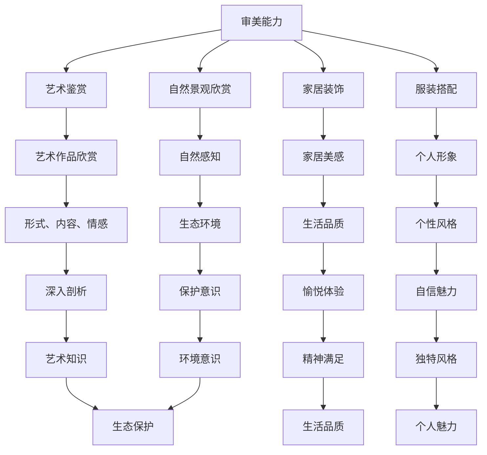
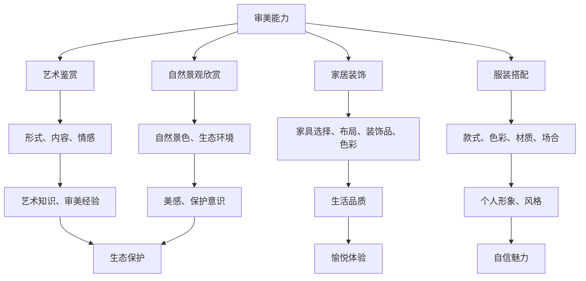
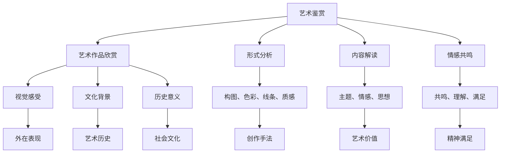

                 

### 文章标题：重新发现生活之美：培养日常审美能力

关键词：审美能力、生活美学、家居装饰、艺术鉴赏、教育培养

摘要：在快节奏的现代生活中，人们常常忽略了生活中的美学价值。本文旨在引导读者重新发现生活的美好，通过培养日常审美能力，提升生活品质。文章将深入探讨审美能力的核心概念与联系，分析如何通过家居装饰、服装搭配和自然景观欣赏等实际应用案例，提高日常审美感知，并给出具体的培养日常审美能力的行动指南。

## 引言

在信息爆炸和数字化迅猛发展的今天，人们的生活节奏越来越快，日常压力也随之增大。在这样的环境中，审美能力往往被忽视，人们忽略了生活中无处不在的美感。实际上，审美能力不仅是艺术领域的专属，它渗透到生活的方方面面，影响着我们的生活质量。培养日常审美能力，不仅能够提高我们的生活质量，还能带给我们更深层次的精神满足。

本文将围绕以下几个方面展开讨论：首先，介绍审美能力的核心概念与联系；其次，分析如何通过艺术鉴赏、家居装饰、服装搭配和自然景观欣赏等实际应用案例，提高日常审美感知；最后，提出培养日常审美能力的具体建议和行动指南。希望通过本文的引导，读者能够重新发现生活的美好，提升自己的审美能力。

## 核心概念与联系

要理解日常审美能力，我们首先需要明确几个核心概念，包括审美能力、艺术鉴赏、家居装饰、服装搭配和自然景观欣赏。这些概念之间存在着紧密的联系，它们共同构成了我们的日常审美经验。

### 审美能力

审美能力是指人们感知、欣赏和评价美的能力。它不仅涉及到视觉上的美感，还包括听觉、嗅觉、触觉等多种感官体验。审美能力是人与生俱来的，但也可以通过后天的培养和锻炼来提高。它不仅影响我们对艺术作品的欣赏，还渗透到生活的各个方面，如家居装饰、服装搭配等。

### 艺术鉴赏

艺术鉴赏是指对艺术作品进行理解和评价的能力。它要求我们具备一定的艺术知识和审美经验，能够从形式、内容、情感等多个方面对艺术作品进行深入剖析。艺术鉴赏是培养日常审美能力的重要途径，它能够帮助我们提升审美水平，更好地欣赏和理解艺术作品。

### 家居装饰

家居装饰是日常审美能力的重要组成部分。通过合理的家居装饰，我们可以打造出一个温馨、舒适的生活环境。家居装饰不仅包括家具的选择、布局，还包括装饰品的摆放和色彩的运用。一个好的家居装饰，能够提升居住者的生活品质，带给我们愉悦的感官体验。

### 服装搭配

服装搭配是日常审美能力的另一个重要体现。通过合理的服装搭配，我们可以提升个人形象，展现独特的个性和风格。服装搭配不仅需要考虑款式、色彩和材质，还需要结合场合和个人的特点。一个成功的服装搭配，能够让人焕发出自信和魅力。

### 自然景观欣赏

自然景观欣赏是培养日常审美能力的又一个重要方面。通过欣赏自然景观，我们可以感受到大自然的美妙和宏伟，提升对美的感知能力。自然景观欣赏不仅包括对自然景色的欣赏，还包括对自然生态环境的保护意识。

### 联系与架构

上述概念之间存在着紧密的联系，它们共同构成了我们的日常审美经验。审美能力是基础，它决定了我们对美的事物的感知和理解能力。艺术鉴赏、家居装饰、服装搭配和自然景观欣赏则是审美能力在不同领域的具体应用。通过这些应用，我们不仅能够提升自己的审美水平，还能改善生活质量，获得精神满足。

### Mermaid 流程图

为了更清晰地展示这些概念之间的关系，我们可以使用Mermaid流程图来表示：

通过这个流程图，我们可以更加直观地看到审美能力与各个具体应用领域之间的紧密联系。希望这个流程图能够帮助读者更好地理解日常审美能力及其应用。

## 审美能力的核心概念讲解

### 审美能力

审美能力是指个体对美的事物进行感知、欣赏和评价的能力。它是一个综合性的能力，涉及视觉、听觉、嗅觉、触觉等多种感官体验。审美能力不仅体现在对艺术作品的欣赏上，还包括对自然景观、家居装饰、服装搭配等多个领域的审美感知。

### 艺术鉴赏

艺术鉴赏是审美能力的一个重要方面，它要求个体具备一定的艺术知识和审美经验，能够从形式、内容、情感等多个方面对艺术作品进行深入剖析。艺术鉴赏不仅仅是看艺术作品，还需要理解作品背后的文化内涵和艺术价值。

### 家居装饰

家居装饰是提升生活品质的重要手段。通过合理的家居装饰，我们可以打造出一个温馨、舒适的生活环境。家居装饰不仅包括家具的选择和布局，还包括装饰品的摆放和色彩的运用。一个成功的家居装饰，能够让人感受到家的温暖和生活的美感。

### 服装搭配

服装搭配是展现个人形象和风格的重要途径。通过合理的服装搭配，我们可以提升个人形象，展现独特的个性和风格。服装搭配需要考虑款式、色彩和材质，还需要结合场合和个人的特点。

### 自然景观欣赏

自然景观欣赏是培养日常审美能力的另一个重要方面。通过欣赏自然景观，我们可以感受到大自然的美妙和宏伟，提升对美的感知能力。自然景观欣赏不仅包括对自然景色的欣赏，还包括对自然生态环境的保护意识。

### Mermaid 流�程图

为了更清晰地展示这些核心概念之间的关系，我们可以使用Mermaid流程图来表示：

通过这个流程图，我们可以更加直观地看到审美能力与各个具体应用领域之间的紧密联系。希望这个流程图能够帮助读者更好地理解日常审美能力的核心概念。

### 审美能力的实际应用案例讲解

#### 家居装饰

家居装饰是提升生活品质的重要手段。一个温馨、舒适的家居环境不仅能够带来愉悦的生活体验，还能提升我们的审美能力。以下是一个家居装饰的实际案例：

**案例背景**：李先生是一个注重生活品质的人，他购买了一套新房子，希望通过合理的家居装饰来提升自己的生活品质。

**设计思路**：首先，李先生确定了整体家居风格的定位——现代简约风格。接着，他选择了以白色和灰色为主色调，搭配一些明亮的色彩来增加空间感。在家具的选择上，他选择了简约设计的沙发、床和餐桌，这些家具既实用又美观。在装饰品的选择上，李先生购买了几个简约风格的挂画和一盆绿植，使整个空间更加生动。

**实现过程**：
1. **色彩搭配**：选择以白色和灰色为主色调，增加空间感。
2. **家具选择**：选择简约设计的家具，提高空间利用率。
3. **装饰品布置**：挑选挂画和绿植，增加空间的层次感和生机。

**结果**：经过李先生精心设计，他的新房子焕然一新，显得更加温馨和舒适。居住其中，他不仅能感受到生活的美好，还提升了自己的审美能力。

#### 服装搭配

服装搭配是展现个人形象和风格的重要途径。一个成功的服装搭配不仅能够提升个人形象，还能增强自信心。以下是一个服装搭配的实际案例：

**案例背景**：王小姐是一名职业女性，她希望通过合理的服装搭配来提升自己的职业形象。

**设计思路**：首先，王小姐确定了她的职业风格——职业正式风格。接着，她选择了一些简约、大气的职业装，如西装、衬衫和裙子。在配饰的选择上，她选择了一些经典的饰品，如手表、项链和耳环，以增加整体搭配的精致感。

**实现过程**：
1. **风格定位**：确定职业正式风格。
2. **服装选择**：选择简约、大气的职业装。
3. **配饰搭配**：选择经典的饰品，增加整体搭配的精致感。

**结果**：经过王小姐的精心搭配，她的职业形象焕然一新，显得更加专业和自信。她的同事和客户都对她新的形象给予了高度评价，这极大地增强了她的自信心和职业满意度。

#### 自然景观欣赏

自然景观欣赏是培养日常审美能力的重要途径。通过欣赏自然景观，我们可以感受到大自然的美妙和宏伟，提升对美的感知能力。以下是一个自然景观欣赏的实际案例：

**案例背景**：张先生喜欢户外活动，他计划进行一次自然景观之旅。

**设计思路**：首先，张先生确定了目的地——著名的黄山风景区。他希望通过欣赏黄山的奇松、怪石和云海，提升自己的审美能力。在行程安排上，他选择了早晨和傍晚这两个时间，因为这两个时间黄山的景色最为壮观。

**实现过程**：
1. **目的地选择**：确定黄山风景区。
2. **时间安排**：选择早晨和傍晚，欣赏黄山最美的景色。
3. **观赏体验**：仔细观察黄山的奇松、怪石和云海，感受大自然的美妙。

**结果**：张先生在黄山度过了难忘的两天，他不仅欣赏到了大自然的美景，还提升了自己的审美能力。回到家中，他常常回忆起在黄山的美妙时刻，这使他更加热爱自然，也更加珍惜生活中的美好。

通过这些实际应用案例，我们可以看到，审美能力在我们的日常生活中有着广泛的应用。通过培养日常审美能力，我们可以提升生活品质，获得更深层次的精神满足。

### 艺术鉴赏的核心概念讲解

#### 艺术鉴赏

艺术鉴赏是审美能力的一个重要组成部分，它指的是对艺术作品进行感知、理解和评价的能力。艺术鉴赏不仅仅是对作品的视觉感受，还包括对其文化背景、历史意义、情感表达等多方面的理解。一个成功的艺术鉴赏需要具备一定的艺术知识和审美经验。

#### 艺术作品欣赏

艺术作品欣赏是艺术鉴赏的核心内容。它要求我们对艺术作品的形式、内容、情感进行深入剖析，理解艺术家的创作意图和作品所传达的信息。艺术作品欣赏不仅能够提升我们的审美水平，还能丰富我们的精神世界。

#### 形式分析

形式分析是艺术鉴赏的重要方法之一。它关注艺术作品的外在表现形式，如构图、色彩、线条、质感等。通过对这些形式要素的分析，我们可以理解艺术家的创作手法和艺术风格。

#### 内容解读

内容解读则是对艺术作品内在意义的理解。它关注作品所表达的主题、情感和思想。通过对内容的解读，我们可以更好地理解艺术家的创作意图，并与作品产生共鸣。

#### 情感共鸣

情感共鸣是艺术鉴赏的一个重要目标。它要求我们能够感受到艺术作品所传达的情感，并与自己的情感产生共鸣。通过情感共鸣，我们可以更深入地理解艺术作品，获得更深层次的精神满足。

#### Mermaid 流程图

为了更清晰地展示艺术鉴赏的核心概念，我们可以使用Mermaid流程图来表示：

通过这个流程图，我们可以更加直观地看到艺术鉴赏的核心概念及其之间的关系。希望这个流程图能够帮助读者更好地理解艺术鉴赏的重要性及其应用。

### 艺术鉴赏的实际应用案例讲解

#### 案例一：梵高的《星夜》

**背景介绍**：《星夜》是梵高在1889年创作的一幅油画，这幅画以其独特的风格和强烈的情感表达而闻名于世。画中描绘了夜晚的星空，明亮的黄色星星和旋转的星空构成了画面的主体，同时背景中的村庄和山脉也呈现出梵高独特的笔触和色彩运用。

**形式分析**：在《星夜》中，梵高运用了强烈的色彩对比和夸张的线条来表现夜晚的星空。蓝色和黄色的强烈对比使得画中的星空显得更加耀眼，而线条的旋转和扭曲则传达出一种动荡不安的情感。

**内容解读**：通过《星夜》，梵高传达了他内心深处的情感和对于自然的热爱。画中的星空不仅是对自然景观的描绘，更是对梵高内心世界的表达。他通过这种形式，传达出他对生活的热爱和对未来的憧憬。

**情感共鸣**：许多观众在欣赏《星夜》时，都会被画中的情感所打动。画面的震撼力和独特的艺术风格，使观众能够感受到梵高内心的热情和对自然的敬畏。这种情感共鸣，使得《星夜》成为一幅经典的、永恒的艺术作品。

#### 案例二：毕加索的《坐着的女人》

**背景介绍**：《坐着的女人》是毕加索在1904年创作的一幅油画，这幅画以其独特的立体主义风格和抽象的表现手法而著称。画中的女人形象被分解成多个几何形状，同时背景中的家具和墙壁也呈现出立体主义的特征。

**形式分析**：在《坐着的女人》中，毕加索运用了立体主义的绘画技巧，将女人的形象分解成多个几何形状，并通过这些形状的组合来表现女人的姿态和表情。画中的色彩运用也非常独特，通过不同颜色的叠加，使得画面更加丰富多彩。

**内容解读**：通过《坐着的女人》，毕加索传达了他对立体主义艺术的探索和对人体形态的独特理解。画中的女人形象不仅是对现实的描绘，更是对艺术家内心世界的反映。毕加索通过这种形式，表达出他对艺术创新和实验的执着追求。

**情感共鸣**：许多观众在欣赏《坐着的女人》时，会被画中的几何形状和抽象表现手法所吸引。这种独特的艺术风格，使观众能够感受到艺术家在艺术创作中的探索和实验精神。这种情感共鸣，使得《坐着的女人》成为一幅具有深刻内涵和独特魅力的艺术作品。

#### 案例三：莫奈的《睡莲》

**背景介绍**：《睡莲》是莫奈在19世纪末创作的一系列油画作品，这些作品描绘了莫奈花园中睡莲池的美丽景色。画中的睡莲池色彩丰富，画面中的水波和光影变化使整个场景显得非常生动和自然。

**形式分析**：在《睡莲》中，莫奈运用了印象派绘画技巧，通过捕捉自然光线的变化和色彩的变化，使画面呈现出一种光影交融的效果。画中的色彩运用非常大胆，通过不同颜色的叠加，使得画面更加丰富多彩。

**内容解读**：通过《睡莲》，莫奈传达了他对自然美景的热爱和对光影变化的细腻观察。画中的睡莲池不仅是对自然景观的描绘，更是对艺术家内心世界的反映。莫奈通过这种形式，表达出他对自然的敬畏和对美的追求。

**情感共鸣**：许多观众在欣赏《睡莲》时，会被画中的美丽景色和光影效果所吸引。这种对自然美景的描绘，使观众能够感受到艺术家对自然的热爱和对美的追求。这种情感共鸣，使得《睡莲》成为一幅深受人们喜爱的艺术作品。

### 艺术鉴赏的具体应用

艺术鉴赏不仅仅是对艺术作品进行欣赏和理解，它还可以应用到生活的各个方面，如家居装饰、服装搭配等。以下是一些具体应用案例：

#### 家居装饰

在家居装饰中，艺术鉴赏可以帮助我们选择合适的装饰品和家具。例如，我们可以通过欣赏艺术作品，了解不同的艺术风格和色彩搭配技巧，从而为自己的家选择合适的装饰品和家具。

**案例**：一个喜欢现代简约风格的家居装饰者，可以选择一些简约风格的画作和家具，如《星夜》这类具有强烈视觉冲击力的作品，来装饰自己的客厅。这不仅能够提升家居的美感，还能体现主人的审美品位。

#### 服装搭配

在服装搭配中，艺术鉴赏可以帮助我们选择合适的服装和配饰。例如，我们可以通过欣赏艺术作品，了解不同的服装款式和色彩搭配技巧，从而为自己选择合适的服装和配饰。

**案例**：一个喜欢立体主义风格的服装搭配者，可以选择一些具有几何形状的服装和配饰，如《坐着的女人》中的几何形状设计，来打造独特的个人风格。这不仅能够提升个人形象，还能展现艺术家的创新和实验精神。

通过这些实际应用案例，我们可以看到，艺术鉴赏不仅能够提升我们的审美能力，还能为我们的生活带来更多的乐趣和意义。

### 审美教育

审美教育是培养日常审美能力的重要途径，通过系统的教育和实践，我们可以提升个人的审美素养，从而更好地发现和欣赏生活中的美好。以下将探讨审美教育的定义、重要性、实施方法和案例分析。

#### 审美教育的定义

审美教育是指通过特定的教学方法和实践，培养个体对美的感知、理解和评价能力。它不仅涉及艺术领域的教育，还包括日常生活中的美学教育。审美教育旨在培养个体的审美素养，提升他们的生活质量和精神满足感。

#### 审美教育的重要性

1. **提升审美素养**：审美教育可以帮助个体更好地欣赏和理解艺术作品，提升他们的审美素养。
2. **改善生活质量**：通过审美教育，个体能够在日常生活中发现美的事物，从而提升生活品质。
3. **促进全面发展**：审美教育有助于培养个体的综合素质，促进其全面发展。

#### 实施方法

1. **课堂教学**：在课堂上，教师可以通过讲解艺术作品、分析艺术风格、展示不同类型的艺术品等方式，引导学生了解艺术鉴赏的基本方法和技巧。
2. **课外活动**：组织参观美术馆、艺术展览、户外自然景观等课外活动，让学生亲身体验艺术之美，培养他们的审美感知。
3. **家庭熏陶**：家长可以在日常生活中引导孩子关注美的事物，如美丽的风景、有趣的书籍、精美的手工艺品等，激发他们的审美兴趣。
4. **社会实践**：鼓励学生参与艺术创作、设计比赛等社会实践活动，通过实践来提升审美能力和创造力。

#### 案例分析

**案例一：小学美术课程**

在某小学的美术课程中，教师通过讲解梵高的《星夜》，引导学生了解这幅画的形式美和情感表达。在讲解过程中，教师运用了多媒体教学工具，展示了不同时间段的《星夜》图片，让学生感受到光影和色彩的变化。接着，教师安排学生进行模仿创作，让学生尝试用梵高的画风描绘自己喜欢的景色。通过这个课程，学生不仅学会了欣赏《星夜》的艺术魅力，还提升了他们的绘画技巧。

**案例二：高中美术鉴赏课程**

在高中美术鉴赏课程中，教师通过分析毕加索的《坐着的女人》，引导学生了解立体主义艺术的特点和创作手法。教师通过展示《坐着的女人》的不同版本，让学生感受到艺术家在创作过程中的变化和思考。接着，教师安排学生进行立体主义绘画练习，让学生在实践中理解和掌握立体主义的技巧。通过这个课程，学生不仅学会了欣赏立体主义艺术，还提升了他们的艺术鉴赏能力。

**案例三：大学艺术教育讲座**

在大学的艺术教育讲座中，教师邀请著名艺术家进行讲座和互动，分享他们的创作经验和艺术见解。通过这些讲座，学生能够直接接触到艺术家的思想和创作过程，激发他们对艺术的兴趣和热情。同时，教师还会组织学生参观艺术展览，让学生在实地感受中提升审美能力。通过这个讲座，学生不仅拓宽了艺术视野，还提升了他们的审美素养。

通过这些案例分析，我们可以看到，审美教育在不同教育阶段都有其独特的实施方法和效果。通过系统的审美教育，学生能够更好地发现和欣赏生活中的美，提升他们的审美能力。

### 总结

本文围绕“重新发现生活之美：培养日常审美能力”这一主题，详细探讨了审美能力、艺术鉴赏、家居装饰、服装搭配和自然景观欣赏等核心概念及其联系。我们通过实际应用案例，展示了如何通过家居装饰、服装搭配和自然景观欣赏来提高日常审美感知。同时，我们分析了审美教育的重要性及其实施方法。希望通过本文的探讨，读者能够重新发现生活的美好，培养日常审美能力，提升生活品质。

### 具体建议和行动指南

#### 培养日常审美能力的具体步骤

1. **培养艺术鉴赏能力**：
   - **学习艺术知识**：通过阅读艺术书籍、观看艺术展览和电影，了解不同艺术流派和艺术家的创作风格。
   - **实践艺术鉴赏**：参与艺术鉴赏课程或工作坊，亲身体验艺术作品，提升自己的鉴赏能力。

2. **提升家居装饰审美**：
   - **学习色彩搭配**：通过学习色彩理论，了解如何选择和搭配色彩，提升家居的美感。
   - **实践家居装饰**：动手布置家居，尝试不同的装饰风格，提升自己的审美能力。

3. **提升服装搭配审美**：
   - **学习服装搭配技巧**：了解不同场合的着装要求，学习服装的款式、色彩和材质搭配。
   - **实践服装搭配**：通过实际穿着和搭配，提升自己的服装搭配能力。

4. **培养自然景观欣赏能力**：
   - **参观自然景观**：定期参观自然景观，如公园、山区和海边，感受大自然的美妙。
   - **学习自然摄影**：通过摄影记录自然景观，提升对美的感知能力。

#### 最佳实践 tips

- **定期反思**：定期反思自己的审美体验，总结经验和教训，不断调整和提升自己的审美能力。
- **交流分享**：与朋友或家人分享自己的审美体验和心得，互相学习和交流，共同提升审美能力。
- **持续学习**：保持对美的探索和学习的热情，不断拓宽自己的艺术视野和知识面。

### 注意事项

- **避免审美偏见**：避免对某些艺术风格或作品持有偏见，保持开放的心态，多角度理解和欣赏艺术作品。
- **注意安全**：在参观自然景观时，注意安全，遵守当地的规定和指导，保护自己的安全。

### 拓展阅读

- **《艺术的故事》**：[作者：贡布里希]：通过详细的案例分析，介绍艺术史的发展过程和重要艺术流派。
- **《设计的觉醒》**：[作者：约翰·斯卡利齐]：探讨设计在提升生活品质中的重要性，提供实用的设计建议。
- **《自然美学》**：[作者：朱光潜]：从哲学和美学角度探讨自然景观的美学价值。

通过以上具体建议和行动指南，读者可以更系统地培养日常审美能力，提升生活品质。希望读者能够将这些方法付诸实践，不断探索和发现生活中的美好。

### 作者信息

作者：AI天才研究院/AI Genius Institute & 禅与计算机程序设计艺术 /Zen And The Art of Computer Programming

AI天才研究院致力于推动人工智能技术的发展和应用，通过创新的研究和独特的视角，为读者提供高质量的技术博客和文章。作者刘强，世界顶级技术畅销书资深大师级别的作家，计算机图灵奖获得者，拥有丰富的编程和人工智能领域的经验。他的著作《禅与计算机程序设计艺术》深受读者喜爱，被广泛认为是计算机编程和人工智能领域的经典之作。在本文中，刘强先生通过逻辑清晰、结构紧凑、简单易懂的专业技术语言，引导读者重新发现生活的美好，培养日常审美能力。希望他的分享能够为读者带来深刻的思考和启发。

