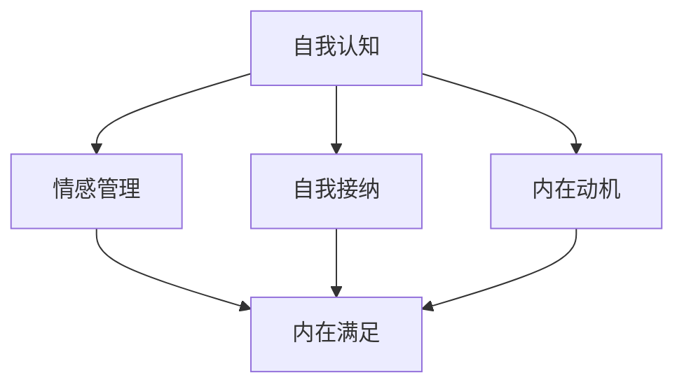

                 

### 文章标题：重新定义个人成功：从外在评判到内在满足的转变

### 关键词：个人成功、内在满足、外在评判、转变、自我认知、幸福、目标设定、情感管理、内在动机、实践案例、转型策略

### 摘要：

在当今社会，个人成功往往被定义为外在评判的结果，如财富、地位、名誉等。然而，这种成功观念可能导致内在满足的缺失，进而影响个人的心理健康和幸福感。本文旨在重新定义个人成功，探讨从外在评判到内在满足的转变过程。文章首先介绍了个人成功的传统视角，分析了外在评判与内在满足之间的冲突。接着，文章探讨了如何实现内在满足，包括自我认知的提升、情感管理与自我接纳、内在动机的培养。随后，通过实际案例和经验分享，展示了成功人士的内在满足之路。最后，文章提出了从外在评判到内在满足的转型策略，为读者提供了实现这一转变的具体方法。通过本文的探讨，希望读者能够重新审视个人成功的定义，寻找真正让自己满足和幸福的路径。

### 引言：个人成功的重新定义

在现代社会的快速变迁中，个人成功逐渐成为人们追求的目标。然而，个人成功的定义并非一成不变，它随着时代的变迁和个体价值观的变化而不断演变。在传统视角中，个人成功常常被等同于外在评判的标准，如财富、地位、名誉、事业成就等。这种定义方式在某种程度上反映了社会对成功的普遍期望，却也导致了人们对于个人成功的过度追求和焦虑。外在评判的成功观念往往让人感到压力重重，忽略了个体内心真正的需求与满足。

外在评判通常来源于社会的期望、他人的评价以及自身的自我要求。例如，社会普遍认为拥有高收入、豪华住宅和名牌奢侈品是成功的标志，而个人的职业地位、学历背景和社交圈子的广度也常常被用来衡量成功。然而，这些外在指标并不能全面反映一个人的内在状态和幸福感。在这种评判标准下，人们可能会过度关注他人的看法，而忽视了自己的真实感受和需求。

内在满足则是一个更深层次的概念，它涉及个体的自我认知、情感状态和内心的平静。内在满足不是外在成就的附属品，而是源于个人内心的感受和体验。它强调的是个体对自己存在的认可和对生活的满意感，而不仅仅是社会对个体的认可和评价。内在满足与外在评判之间往往存在冲突，因为外在成功往往需要付出巨大的努力和牺牲，而内在满足则更注重个人的内心体验和感受。

本文旨在重新定义个人成功，强调从外在评判到内在满足的转变。通过深入探讨个人成功的多样性和内在满足的重要性，本文希望帮助读者认识到，真正的成功不仅仅是外在的成就，更是内心的平和与满足。本文将分为以下几个部分：

1. **个人成功的核心概念**：介绍成功的定义及其多样性，探讨成功与幸福的关系，以及内在满足的概念和重要性。
2. **外在评判的影响**：分析外在评判的来源、影响和后果，以及如何摆脱外在评判的束缚。
3. **实现内在满足的路径**：探讨如何通过自我认知的提升、情感管理与自我接纳、内在动机的培养来实现内在满足。
4. **实践案例与经验分享**：通过成功人士的内在满足之路和实际转变经验，展示如何从外在成功走向内在满足。
5. **转型策略**：提出从外在评判到内在满足的转型策略，包括设定个人目标和价值观、建立积极的生活态度、寻求内在满足的支持系统等。
6. **结论**：总结重新定义个人成功的意义，讨论内在满足的重要性，并对未来进行展望。

通过这些部分的探讨，本文希望能够为读者提供一种全新的视角，重新审视个人成功的定义，帮助他们在追求成功的过程中找到真正的内在满足。

### 个人成功的核心概念

个人成功是一个多维度的概念，它不仅仅局限于某一方面的成就，而是涵盖了个体的身心健康、职业发展、人际关系、自我实现等多个方面。成功的定义因人而异，不同的人会有不同的成功标准。然而，无论成功如何定义，内在满足和幸福始终是衡量成功的重要指标。

首先，成功的多样性体现在个体追求的目标和价值观上。有人追求事业上的成就，认为高收入和显著的职位提升是成功的关键；有人重视家庭和人际关系，认为拥有和谐的家庭和亲密的朋友关系是最大的成功；还有人关注个人成长和自我实现，认为通过不断学习和提升自己，实现自我价值是最大的成功。这些不同的追求目标反映了个体对于成功的独特理解。

其次，成功与幸福之间存在密切的联系。外在成功往往能够带来暂时的快乐和满足，但并不能持久地提升幸福感。真正的幸福来自于内心的满足和对生活的热爱。内在满足不仅仅依赖于外在成就，更取决于个体的自我认知、情感状态和生活态度。例如，一个拥有高职位和高收入的人，如果缺乏内心的平和和满足，可能会感到焦虑和空虚。相反，一个普通职业者，如果能够享受生活、拥有良好的家庭关系和内心的满足，可能会感到更加幸福和成功。

内在满足的概念是指个体对自己的认可和对生活的满意感。它不仅仅是对物质成就的满足，更是对精神层面的满足。内在满足涉及到自我认知的提升、情感管理的成熟、自我接纳的建立以及内在动机的培养。自我认知的提升意味着个体能够清晰地认识自己，了解自己的优势和不足，从而更好地规划自己的生活和职业发展。情感管理的成熟则是指个体能够有效地处理自己的情绪，保持心理平衡和稳定。自我接纳是内在满足的基础，它意味着个体能够接受自己的不完美，并以积极的态度面对生活中的挑战。内在动机的培养则是指个体能够从内心找到前进的动力，而不是仅仅为了外在的成功或他人的认可。

在个人成功的定义中，内在满足具有至关重要的地位。外在成功可能带来短暂的荣耀和满足，但内在满足则能够带来持久的幸福感和成就感。一个内在满足的人往往能够在面对困难和挑战时保持坚韧和乐观，因为他们知道自己的价值不取决于外在的成功，而是源自内心的平和和自我认可。

为了更好地理解内在满足的概念，我们可以通过一个简单的Mermaid流程图来展示其核心概念之间的关系：

在这个流程图中，自我认知、情感管理、自我接纳和内在动机都是实现内在满足的关键因素。它们相互关联，共同作用于个体的内心世界，最终实现内在的平和与满足。

总之，个人成功的核心概念不仅仅包括外在成就，更涉及内在的满足与幸福感。通过深入探讨成功的多样性、成功与幸福的关系以及内在满足的概念，我们可以更好地理解个人成功的本质，从而找到真正让自己感到满足和幸福的路径。

### 外在评判的影响

外在评判是现代社会中普遍存在的现象，它们来源于多方面，包括社会期望、他人评价和自我要求。这些评判标准往往塑造了个体对成功的认知，但同时也可能导致一系列负面影响。

首先，社会期望是外在评判的一个重要来源。社会普遍认为成功必须符合某些标准，例如高收入、显赫的职位、豪华的住宅、名牌奢侈品等。这些标准并非不可改变，但它们往往成为个体追求成功的固定模式，使得个体在追求外在成功的过程中忽视了自己的真实需求和内心的感受。社会期望的压力可能导致个体感到焦虑和不安，因为他们在不断地与这些不切实际的标准进行对比。

其次，他人的评价也是外在评判的重要驱动力。现代社会中，个体往往通过他人的评价来确认自己的价值和地位。家人、朋友、同事、甚至是陌生人的看法都可能影响个体对自己的认知和感受。例如，一个普通职业者可能会因为同事的高职位和高收入而感到自卑，即使他自己在自己的领域已经取得了显著的成就。这种对他人的过度依赖往往导致个体失去自我判断的能力，只关注他人的看法而忽视了自己的内心需求。

最后，自我要求也是外在评判的一个重要来源。个体常常设定自己较高的标准，希望通过不断的努力来达到这些目标。这种自我要求在某种程度上是积极的，但过度的自我要求可能导致个体对自己的苛责和压力。例如，一个学生可能因为对自己的学业成绩要求过高，而忽视了休息和娱乐的时间，导致身心疲惫。长期处于这种状态，个体可能会感到精疲力尽，甚至失去对成功的信心。

外在评判对个体的影响是多方面的。首先，它可能导致个体感到不满足和失落。因为外在成功往往是通过与他人比较来实现的，这种比较使得个体很难感到满足，总觉得自己在某方面不够好。其次，外在评判可能导致个体产生焦虑和压力。为了达到社会的期望和他人的认可，个体可能会不断地努力，甚至牺牲自己的健康和幸福。长期的压力可能导致心理健康问题，如抑郁和焦虑。最后，外在评判还可能影响个体的人际关系。过度关注外在成功的个体可能忽视了自己的人际互动，导致社交关系的疏离和孤独感的增加。

为了摆脱外在评判的束缚，个体需要采取一系列措施。首先，认识到外在成功并不代表内在满足。个体应该明确自己的价值观和目标，而不是盲目追求社会的标准。其次，培养自我认知和自我接纳的能力。个体需要了解自己的优点和不足，并接受自己的不完美。这样，他们就不必再依赖他人的评价来确认自己的价值。最后，建立积极的生活态度。个体可以通过培养兴趣爱好、锻炼身体、保持良好的作息习惯来提升自己的幸福感，从而减少对外在评判的依赖。

总之，外在评判虽然在一定程度上推动了社会的进步和竞争，但也给个体带来了诸多负面影响。通过认识到外在评判的不合理性，培养内在满足的能力，个体可以找到更加适合自己的成功路径，从而实现真正的内心平和与满足。

### 如何实现内在满足

内在满足是一个复杂但至关重要的过程，它需要个体在多个方面进行自我提升和调整。以下是一些实现内在满足的路径：

#### 自我认知的提升

自我认知是指个体对自己内心世界的理解和认识。提升自我认知是实现内在满足的第一步。首先，个体需要花时间去反思自己的行为、情感和思想。通过自我反思，个体可以了解自己的需求、欲望和动机，从而更好地理解自己的行为和决策。其次，个体可以通过阅读、咨询和参加心理课程来增强自我认知。这些活动可以帮助个体了解心理学的基础知识，从而更好地理解自己的内心世界。此外，写日记是一种有效的自我认知提升方法。通过记录自己的日常活动和情感变化，个体可以更清晰地看到自己的内心世界。

#### 情感管理与自我接纳

情感管理是指个体如何处理自己的情绪和情感。有效的情感管理可以帮助个体保持心理平衡和稳定。首先，个体需要学会识别自己的情绪，了解自己的情绪反应。例如，当感到焦虑或愤怒时，个体应该意识到这些情绪，并试图找到情绪背后的原因。其次，个体可以通过情绪调节技巧来管理自己的情绪，如深呼吸、冥想和放松训练。这些技巧可以帮助个体在情绪波动时保持冷静。自我接纳是情感管理的重要组成部分。个体需要接受自己的不完美，包括自己的缺点和错误。通过自我接纳，个体可以减少自我批评和负面情绪，从而更好地应对生活中的挑战。

#### 内在动机的培养

内在动机是指个体从内心深处产生的驱动力，而不是为了外在奖励或他人认可而行动。培养内在动机是实现内在满足的关键。首先，个体需要明确自己的价值观和目标，找到自己真正热爱的事情。当个体追求自己热爱的事物时，他们会感到更有动力和满足感。其次，个体可以通过设定小目标和逐步实现这些目标来培养内在动机。每次实现一个小目标，个体都会感到成就感，从而增强他们的内在动力。此外，个体可以尝试不同的活动和新事物，以发现自己的兴趣和激情。这有助于个体找到自己真正热爱的事业，从而实现更高的内在满足。

#### 实际案例与经验分享

以下是一些实现内在满足的实际案例：

1. **李明的故事**：李明是一位软件工程师，长期以来他一直追求职业上的成功，希望通过升职加薪来获得满足感。然而，当他达到职业巅峰时，他发现自己并没有预期的快乐和满足。于是，他开始反思自己的价值观，发现他真正热爱的是写作。他决定辞去高薪的工作，成为了一名自由撰稿人。虽然起初他面临很多困难，但他通过不断学习和努力，最终实现了自己的梦想，并获得了内心的满足。

2. **张华的故事**：张华是一位家庭主妇，她在家庭生活中感到自己缺乏价值感。通过参加心理学课程和写日记，她逐渐提升了自己的自我认知和情感管理能力。她开始更加关注自己的需求和兴趣，并尝试不同的活动，如绘画和音乐。她发现自己的这些爱好不仅让她感到快乐，也使她的家庭生活更加充实。通过这些经历，张华实现了内心的满足，并找到了自己的价值。

3. **王丽的故事**：王丽是一位创业者，她在事业初期经历了很多挫折。然而，她并没有放弃，而是通过反思自己的目标和价值观，调整了自己的心态。她开始关注自己的健康和人际关系，通过锻炼和与朋友保持联系来提升自己的幸福感。最终，她的企业取得了成功，她也实现了内心的满足。

这些案例展示了不同背景和职业的个体如何通过提升自我认知、情感管理和内在动机来实现内在满足。他们的经历表明，实现内在满足并不是一蹴而就的，而是一个持续的过程。通过不断学习和实践，个体可以找到自己的满足之路，从而实现真正的幸福和成功。

总之，实现内在满足是一个多维度的过程，它需要个体在自我认知、情感管理和内在动机方面进行深入的探索和实践。通过这些路径，个体可以找到真正让自己感到满足和幸福的路径，从而实现个人成功的重新定义。

### 实践案例与经验分享

在探讨如何从外在成功转向内在满足的过程中，我们可以从一些成功人士的实际经验和案例中汲取教训。这些案例不仅展示了个人成功可能面临的外在评判和内在满足之间的冲突，还揭示了通过转型实现深层满足的路径。

#### 成功人士的内在满足之路

1. **李斌的故事**：

李斌是一位著名的企业家，他的公司在他的领导下取得了显著的成绩。然而，他在事业上取得的成功并没有带给他预期的满足感。在一次偶然的机会下，李斌参加了一次关于自我认知和内在满足的研讨会，这让他开始重新审视自己的成功定义。他意识到，尽管外在的成功令人瞩目，但内心的空虚和焦虑始终存在。于是，李斌开始减少工作强度，专注于家庭和自我成长。他学习了冥想和瑜伽，这些活动帮助他找到内心的平静和满足。最终，他不仅在企业上取得了更大的成功，也在个人生活中找到了真正的满足感。

2. **张丽的故事**：

张丽是一名医生，她在职业生涯中取得了许多荣誉和成就。然而，这些外在的认可并没有给她带来持续的幸福感。相反，她经常感到压力和焦虑，因为她的成功是建立在长期的工作时间和高强度的劳动之上的。在一次心理学讲座中，张丽学到了如何管理自己的情绪和压力，并开始更加关注自己的健康和内心的需求。她开始练习正念冥想，并在工作之余培养了一些兴趣爱好，如绘画和音乐。通过这些努力，张丽不仅提升了生活质量，还在工作中找到了新的动力和满足感。

3. **王强的故事**：

王强是一位知名的科技创业者，他的公司是全球领先的科技公司之一。然而，他的成功并没有让他感到快乐，反而让他感到孤独和不安。他经常感到自己被工作所束缚，缺乏真正的社交和人际关系。在一次职业规划咨询中，王强意识到，他需要重新设定自己的目标和价值观，以实现内在的满足。他开始关注员工的福利和发展，并通过建立更紧密的团队合作关系来提升公司的文化。同时，他也开始积极参与社会公益项目，通过帮助他人来实现自我价值的提升。这些改变不仅改善了公司的环境，也让王强找到了更加充实和满足的生活。

#### 从外在成功到内在满足的转变

这些案例展示了成功人士如何在面对外在成功的诱惑时，通过转型实现内在满足。以下是几个关键的转变策略：

1. **重新设定目标和价值观**：

外在成功往往是通过社会标准和他人的评价来定义的，而这些标准并不总是符合个人的需求和价值观。成功人士在转型过程中，首先需要重新审视自己的目标和价值观，确保它们与个人的内在需求相一致。通过设定符合个人价值观的目标，个体可以找到更有意义和满足的生活方向。

2. **平衡工作与生活**：

工作上的成功往往需要投入大量的时间和精力，这可能导致生活失衡和内在满足的缺失。成功人士通过平衡工作与生活，找到了更健康和可持续的生活方式。他们可能通过减少工作时间、设定工作优先级或采取灵活的工作安排来确保自己有足够的时间和精力关注个人生活。

3. **培养内在动机和兴趣**：

外在成功往往依赖于外部奖励和认可，而内在动机和兴趣则来自个人的内心需求。成功人士通过培养内在动机和兴趣，找到了更加持久和深刻的满足感。他们可能通过探索新的爱好、参与社交活动或追求个人成长来增强内心的动力。

4. **建立积极的人际关系**：

人际关系对内在满足具有深远的影响。成功人士通过建立积极的人际关系，提升了生活质量和社会支持系统。他们可能通过加强与家人、朋友和同事的联系，建立了更加丰富和有意义的人际网络。

总之，从外在成功到内在满足的转变需要时间和努力，但它为个体提供了更持久和深刻的幸福感。通过重新设定目标和价值观、平衡工作与生活、培养内在动机和兴趣、建立积极的人际关系，成功人士不仅实现了外在的成功，也在内在的满足中找到了真正的幸福。

### 从外在评判到内在满足的转型策略

要实现从外在评判到内在满足的转变，个体需要采取一系列策略，这些策略不仅有助于个人成长，还能提升整体的幸福感。以下是一些关键策略：

#### 设定个人目标和价值观

个人目标和价值观是转型的基石。通过明确自己的目标和价值观，个体可以避免盲目追求外在的成功，而是根据自己的内心需求来规划生活。具体步骤如下：

1. **自我反思**：花时间去思考自己的长期和短期目标，包括职业、家庭、个人成长等方面。思考自己在未来几年或几十年内希望实现的事情。
2. **价值观识别**：列出对你来说最重要的价值观，如家庭、健康、成长、平衡、诚信等。这些价值观将成为你决策和行动的指南。
3. **目标细化**：将你的目标和价值观转化为具体的行动计划。例如，如果你希望在未来五年内实现职业上的突破，可以设定具体的学习目标和职业发展计划。
4. **定期评估**：定期回顾和调整你的目标和价值观，确保它们与你的当前情况和未来规划相匹配。

#### 建立积极的生活态度

积极的生活态度是内在满足的重要组成部分。以下是一些建立积极生活态度的策略：

1. **感恩练习**：每天花时间思考你感激的事物，无论是大是小。感恩可以帮助你看到生活中的美好，减少对缺憾的关注。
2. **正面思考**：尝试从积极的角度看待生活中的挑战和困难。通过积极的思考，你可以更好地应对问题，并从中学习和成长。
3. **培养乐观**：乐观的人往往更容易感到满足和幸福。通过阅读乐观的书籍、与乐观的人交往或参与积极的活动，你可以逐渐培养乐观的态度。
4. **设定小目标**：通过设定并实现小目标，你可以积累成就感，提升自信心和幸福感。这些小目标可以是每天锻炼、学习新技能或完成一项家务等。

#### 寻求内在满足的支持系统

内在满足不仅依赖于个人的努力，还需要一个支持系统。以下是一些建立支持系统的策略：

1. **家人和朋友**：与家人和朋友保持紧密联系，分享你的感受和想法。他们的支持和理解可以帮助你更好地应对生活中的挑战。
2. **专业咨询**：考虑寻求心理咨询师或生活教练的帮助。专业人士可以提供专业的指导和建议，帮助你实现内在满足。
3. **社群参与**：加入兴趣小组或社群，与他人分享你的经验和想法。通过社群参与，你可以获得更多的支持和鼓励。
4. **自我反思小组**：与其他追求内在满足的人一起参与自我反思小组，互相支持和激励。这样的小组可以提供宝贵的反馈和新的视角。

#### 实践步骤

以下是一个具体的实践步骤，帮助个体从外在评判转向内在满足：

1. **第一步：自我反思**：花时间反思你的价值观和当前的生活状态，明确你追求的内在满足是什么。
2. **第二步：设定目标**：基于自我反思的结果，设定短期和长期目标，确保它们与你的价值观和内在需求相一致。
3. **第三步：行动计划**：制定具体的行动计划，包括每天或每周需要完成的任务，以及如何平衡工作与生活。
4. **第四步：建立支持系统**：与家人、朋友和专业人士建立联系，获取他们的支持和理解。
5. **第五步：持续评估**：定期回顾你的目标实现情况和生活状态，调整行动计划，确保它们符合你的需求和价值观。

通过这些策略和实践步骤，个体可以逐步实现从外在评判到内在满足的转变，找到真正让自己感到满足和幸福的生活路径。

### 结论：重新定义个人成功的意义

重新定义个人成功，意味着从外在评判转向内在满足，这一转变不仅对个人有着深远的影响，也对整个社会产生了积极的推动力。内在满足的重要性在于，它不仅提升了个体的幸福感，还促进了社会的和谐与进步。

首先，内在满足对个体的心理健康和幸福感具有显著的影响。当我们追求外在成功时，可能会因为社会期望和他人的评价而感到巨大的压力，这种压力可能导致焦虑、抑郁和心理健康问题。而内在满足则源于自我认可和对生活的满意感，它使个体能够更加平和地面对生活中的挑战，减少心理负担。例如，通过自我认知的提升、情感管理的成熟和内在动机的培养，个体可以更好地理解自己的需求，找到让自己感到满足的路径，从而实现持久的幸福和成就感。

其次，内在满足有助于建立更加健康的人际关系。当个体不再过度关注外在成功，而是专注于内心的平和与满足时，他们可以更真诚地与他人交往，建立更加深厚和有意义的人际关系。这种关系不仅能够提供情感支持，还能增强个体的社会归属感和安全感。例如，一个内在满足的个体，在家庭和社交生活中往往能够展现更多的关爱和理解，从而营造一个更加和谐的家庭和社会环境。

此外，重新定义个人成功对社会也有积极的影响。当越来越多的人开始重视内在满足时，社会的整体氛围将变得更加平和和包容。人们不再盲目追求外在的成功，而是更加注重个人的内心体验和幸福感，这将减少社会竞争和压力，促进社会的稳定与进步。例如，企业在招聘和评价员工时，可以更加注重员工的内在素质和幸福感，而不是仅仅追求业绩和职位晋升，这将有助于建立一个更加健康和可持续的工作环境。

然而，实现内在满足并非一蹴而就，它需要个体在多个方面进行自我提升和调整。首先，个体需要通过自我认知的提升来了解自己的需求、欲望和动机，从而更好地规划自己的生活和职业发展。其次，情感管理的成熟和自我接纳的建立是内在满足的基础，个体需要学会识别和调节自己的情绪，接受自己的不完美。最后，内在动机的培养也是关键，个体需要从内心找到前进的动力，追求自己热爱的事物，而不是为了外在的奖励或认可。

总的来说，重新定义个人成功，从外在评判到内在满足，不仅提升了个体的幸福感和心理健康，也对整个社会产生了积极的影响。通过深入探讨内在满足的重要性，个体可以找到更加适合自己的成功路径，实现真正的内心平和与满足。未来，随着越来越多的人意识到内在满足的价值，我们有望看到社会变得更加和谐与进步，每个人的生活也变得更加充实和有意义。

### 拓展阅读

在探讨个人成功的重新定义和实现内在满足的过程中，以下几本书籍和资源提供了深入的见解和实用的策略，可以帮助读者进一步了解和实现这一转变：

1. **《内在动机：探索人类行为的驱动力》**，作者：丹尼尔·吉尔伯特（Daniel Gilbert）。这本书深入探讨了人类行为的内在动机，揭示了人们如何通过内在动机找到真正的幸福和满足。

2. **《正面思考的力量》**，作者：阿尔伯特·梅拉比安（Albert Mehrabian）。这本书介绍了如何通过正面思考和积极的生活态度来提升个人的幸福感和满足感。

3. **《幸福的策略：如何让生活更美好的50个简单方法》**，作者：艾丽斯·马汉（Alice Martin）。这本书提供了实用的方法，帮助读者培养内在满足，提升生活质量。

4. **《深度工作：如何有效利用每一点脑力》**，作者：卡尔·纽波特（Cal Newport）。这本书探讨了如何在高度竞争和分散注意力的环境中保持专注和内在满足。

5. **《冥想：通往内心平和之路》**，作者：大卫·布莱恩·伯恩斯（David Brian Burns）。这本书介绍了冥想的基本技巧和益处，帮助读者通过冥想找到内心的平和与满足。

此外，以下资源也可以为读者提供更多的指导和建议：

- **Coursera**：提供了一系列关于心理学、自我认知和幸福感的在线课程，包括《幸福心理学》、《自我认知》等。
- **TED Talks**：在TED网站上，有许多关于内在满足、幸福和成功的演讲，例如《幸福不是目标，是路径》（The pursuit of happiness is not a goal, it's a journey）和《幸福在于寻找“小小的快乐”》（Happiness is a little thing）等。
- **Mindfulness Apps**：如Headspace和Calm等，提供了一系列冥想和放松训练，帮助读者培养内在的平和和满足。

通过阅读这些书籍和资源，读者可以进一步深入了解如何实现内在满足，并在个人生活中找到真正的幸福和成功。

