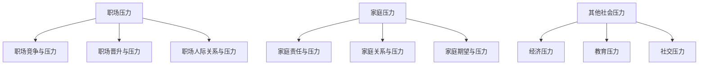

                 

### 文章标题

# 《重新定义个人成功：摆脱社会压力的自我评价》

### 关键词

- 个人成功
- 社会压力
- 自我评价
- 心理调适
- 生活方式
- 支持网络
- 成功策略
- 案例分析

### 摘要

本文旨在探讨个人成功的新定义，如何摆脱社会压力，并通过自我评价来实现这一目标。文章首先分析了社会压力的来源，包括职场压力、家庭压力和社会压力，随后介绍了自我评价的概念和重要性。接下来，本文提出了摆脱社会压力的方法，如心理调适、健康生活方式和建立支持网络。最后，文章通过案例分析和实践反思，帮助读者理解并应用这些方法，实现个人成功的重新定义。

## 引言

在现代社会中，个人成功成为了许多人的追求。然而，随着社会的快速发展，个人面临的社会压力也随之增加。职场竞争、家庭责任、社交期望等各种压力汇聚在一起，让人感到疲惫不堪。本文旨在重新定义个人成功，帮助读者摆脱社会压力，实现内心的平衡与和谐。

### 书籍目的与读者对象

本书的目标是帮助那些感到社会压力困扰的人，无论是职场人士、家庭主妇还是学生，都可以从中找到应对压力的方法。本书适合任何想要重新审视个人成功定义的人，特别是那些在追求成功过程中感到迷茫和困惑的人。

### 阅读指南与学习目标

为了更好地理解本书的内容，读者可以从以下几个方面来阅读：

1. **逐步理解核心概念**：通过章节标题和摘要，了解每个章节的核心内容。
2. **结合实际案例**：在阅读过程中，尝试联系自己的实际情况，思考如何应用书中的方法。
3. **实践与反思**：阅读结束后，回顾书中的内容，反思自己的成长与进步。

通过以上方法，读者可以更好地掌握书中的知识，并将其应用到实际生活中。

## 第1章 社会压力的来源

### 1.1 职场压力

职场压力是现代社会中最为常见的一种压力来源。随着职场竞争的加剧，个人在工作中感受到的压力也越来越大。

#### 1.1.1 职场竞争与压力

在职场中，竞争无处不在。无论是晋升、奖金还是职位，都需要通过竞争来获得。这种竞争带来的压力，让许多人在工作中感到焦虑和不安。

#### 1.1.2 职场晋升与压力

晋升是职场人士追求的一个重要目标。然而，晋升过程往往伴随着各种挑战和不确定性，如考核标准、竞争对手等，这些都会给个人带来压力。

#### 1.1.3 职场人际关系与压力

在职场中，人际关系也是一大挑战。与同事、上司和下属之间的互动，可能会因为性格、价值观、工作目标等差异而产生矛盾和冲突，进而导致压力。

### 1.2 家庭压力

家庭是每个人生活的重要部分，但同时也是压力的重要来源。家庭责任、家庭关系和家庭期望，都是家庭压力的主要来源。

#### 1.2.1 家庭责任与压力

家庭责任包括照顾老人、抚养子女等。这些责任不仅需要时间和精力，还需要金钱和情感投入，给个人带来很大的压力。

#### 1.2.2 家庭关系与压力

家庭关系的好坏直接影响个人的心理状态。家庭矛盾、沟通不畅、家庭冲突等问题，都可能导致个人感到压力和焦虑。

#### 1.2.3 家庭期望与压力

家庭期望是家庭压力的另一个重要来源。父母、配偶、子女等的期望，往往会影响个人的行为和决策，从而增加压力。

### 1.3 社会压力的其他来源

除了职场和家庭压力，社会压力还有其他来源。

#### 1.3.1 经济压力

经济压力是现代社会中普遍存在的压力。高房价、高生活成本、就业难等问题，都会给个人带来经济压力。

#### 1.3.2 教育压力

教育压力主要来自于子女教育。家长对子女的教育期望、教育资源的不均衡等问题，都会导致教育压力。

#### 1.3.3 社交压力

社交压力是现代社会中的一种常见压力。社交场合的应对、人际关系的管理、社交网络的维护等，都是社交压力的来源。

### 社会压力的流程图



### 核心概念与联系

社会压力的来源可以分为职场压力、家庭压力和其他社会压力。职场压力主要来自于职场竞争、晋升和人际关系；家庭压力主要来自于家庭责任、家庭关系和家庭期望；其他社会压力包括经济压力、教育压力和社交压力。

#### 社会压力算法原理

```python
def calculate_pressure(source):
    if source == '职场':
        return '职场竞争压力 + 职场晋升压力 + 职场人际关系压力'
    elif source == '家庭':
        return '家庭责任压力 + 家庭关系压力 + 家庭期望压力'
    elif source == '其他':
        return '经济压力 + 教育压力 + 社交压力'
```

#### 社会压力的数学模型

社会压力得分可以通过加权平均计算：

$$
P = w_1 \times P_1 + w_2 \times P_2 + w_3 \times P_3
$$

其中，$P$ 表示总压力得分，$P_1$、$P_2$、$P_3$ 分别表示职场压力、家庭压力和其他社会压力得分，$w_1$、$w_2$、$w_3$ 分别表示各压力源的权重。

### 实例说明

假设一个人的职场压力得分为 8，家庭压力得分为 6，其他社会压力得分为 4，权重分别为 0.5、0.3 和 0.2。则他的总压力得分为：

$$
P = 0.5 \times 8 + 0.3 \times 6 + 0.2 \times 4 = 4 + 1.8 + 0.8 = 6.6
$$

### 结论

社会压力的来源多样，包括职场压力、家庭压力和其他社会压力。通过理解这些压力的来源和算法原理，我们可以更好地应对和管理压力，实现个人成功。

## 第2章 自我评价的概念

### 2.1 自我评价的定义

自我评价是指个体对自己各方面能力和表现的判断和评估。这种评价可以基于个人的感受、他人的反馈以及客观的事实数据。

#### 自我评价的类型

1. **自我感知**：个体对自己能力和表现的直接感知。
2. **自我反思**：个体通过回顾和反思自己的行为和表现，对自己进行评价。
3. **他人评价**：个体通过他人的反馈和评价，了解自己在他人眼中的形象和表现。

### 2.2 自我评价的重要性

自我评价对于个人的成长和发展具有重要意义。

1. **自我认知**：通过自我评价，个体可以更好地了解自己的优点和不足，从而进行有针对性的改进。
2. **目标设定**：自我评价可以帮助个体设定合理的目标，并为实现这些目标提供方向。
3. **心理健康**：积极的自我评价有助于提升个体的自信心和自尊心，对心理健康有积极影响。

### 2.3 自我评价的方法

进行有效的自我评价，需要采用科学的方法和工具。

1. **自我反思**：通过定期反思自己的行为和表现，识别自己的优点和不足。
2. **心理测量**：使用专业的心理测量工具，如问卷调查、心理测评等，来评估自己的心理状态和能力水平。
3. **他人反馈**：向他人征求反馈，了解自己在他人眼中的形象和表现。

### 自我评价的算法原理

```python
def self_evaluation(self_perception, self_reflection, others_feedback):
    score = (self_perception + self_reflection + others_feedback) / 3
    return score
```

### 自我评价的数学模型

自我评价得分可以通过加权平均计算：

$$
S = w_1 \times P + w_2 \times R + w_3 \times O
$$

其中，$S$ 表示自我评价得分，$P$ 表示自我感知得分，$R$ 表示自我反思得分，$O$ 表示他人反馈得分，$w_1$、$w_2$、$w_3$ 分别表示各评价类型的权重。

### 实例说明

假设一个人的自我感知得分为 7，自我反思得分为 6，他人反馈得分为 8，权重分别为 0.3、0.3 和 0.4。则他的自我评价得分为：

$$
S = 0.3 \times 7 + 0.3 \times 6 + 0.4 \times 8 = 2.1 + 1.8 + 3.2 = 7.1
$$

### 结论

自我评价是了解自己、设定目标、提升自我认知的重要工具。通过科学的方法和工具，我们可以更准确地评估自己的能力和表现，为个人成长和发展提供有力支持。

## 第3章 摆脱社会压力的方法

### 3.1 心理调适技巧

心理调适技巧是应对社会压力的有效方法之一。以下是一些常用的心理调适技巧：

#### 3.1.1 正念冥想

正念冥想是一种通过专注当下、观察内心体验来减轻压力的方法。通过冥想，个体可以学会放松身心，减少焦虑和压力。

#### 3.1.2 情绪管理

情绪管理是应对压力的重要技巧。通过了解自己的情绪，学会如何应对和管理负面情绪，个体可以更好地应对压力。

#### 3.1.3 时间管理

时间管理是减轻压力的关键。通过合理规划时间，提高工作效率，个体可以减轻工作压力，更好地平衡工作和生活。

### 3.2 建立健康的生活方式

建立健康的生活方式，有助于提高身体和心理的素质，从而更好地应对压力。

#### 3.2.1 健康饮食

健康饮食是保持身体健康的基础。通过合理搭配膳食，摄入充足的维生素和矿物质，个体可以增强免疫力，减少疾病发生。

#### 3.2.2 适度运动

适度运动有助于减轻压力，改善心理健康。通过运动，个体可以释放压力，增强自信心，提高生活质量。

#### 3.2.3 良好的睡眠

良好的睡眠是保持身体健康和心理健康的必要条件。通过保持良好的睡眠习惯，个体可以缓解压力，提高身体和心理的恢复能力。

### 3.3 建立支持网络

建立支持网络，有助于个体在应对压力时获得支持和帮助。

#### 3.3.1 人际关系的建立

建立良好的人际关系，有助于个体在遇到困难时获得他人的支持和帮助。通过主动沟通、关心他人，个体可以建立和维护良好的人际关系。

#### 3.3.2 寻求专业帮助

在遇到无法自行解决的困难时，寻求专业帮助是明智的选择。心理医生、心理咨询师等专业人士，可以提供专业的建议和帮助，帮助个体应对压力。

#### 3.3.3 社交网络的利用

利用社交网络，个体可以获取更多的资源和信息，从而更好地应对压力。通过社交网络，个体可以结识志同道合的朋友，分享经验和资源。

### 心理调适技巧的算法原理

```python
def psychological_adjustment(meditation, emotion_management, time_management):
    score = (meditation + emotion_management + time_management) / 3
    return score
```

### 建立健康生活方式的算法原理

```python
def healthy_lifestyle(diet, exercise, sleep):
    score = (diet + exercise + sleep) / 3
    return score
```

### 建立支持网络的算法原理

```python
def support_network(relations, professional_help, social_network):
    score = (relations + professional_help + social_network) / 3
    return score
```

### 心理调适技巧的数学模型

心理调适技巧得分可以通过加权平均计算：

$$
P = w_1 \times M + w_2 \times E + w_3 \times T
$$

其中，$P$ 表示心理调适得分，$M$ 表示冥想得分，$E$ 表示情绪管理得分，$T$ 表示时间管理得分，$w_1$、$w_2$、$w_3$ 分别表示各调适技巧的权重。

### 建立健康生活方式的数学模型

建立健康生活方式得分可以通过加权平均计算：

$$
H = w_1 \times D + w_2 \times E + w_3 \times S
$$

其中，$H$ 表示健康生活方式得分，$D$ 表示饮食得分，$E$ 表示锻炼得分，$S$ 表示睡眠得分，$w_1$、$w_2$、$w_3$ 分别表示各健康因素的权重。

### 建立支持网络的数学模型

建立支持网络得分可以通过加权平均计算：

$$
S = w_1 \times R + w_2 \times P + w_3 \times N
$$

其中，$S$ 表示支持网络得分，$R$ 表示人际关系得分，$P$ 表示专业帮助得分，$N$ 表示社交网络得分，$w_1$、$w_2$、$w_3$ 分别表示各支持类型的权重。

### 实例说明

假设一个人的冥想得分为 8，情绪管理得分为 7，时间管理得分为 6，权重分别为 0.3、0.3 和 0.4。则他的心理调适得分为：

$$
P = 0.3 \times 8 + 0.3 \times 7 + 0.4 \times 6 = 2.4 + 2.1 + 2.4 = 7.9
$$

假设一个人的饮食得分为 7，锻炼得分为 8，睡眠得分为 9，权重分别为 0.2、0.5 和 0.3。则他的健康生活方式得分为：

$$
H = 0.2 \times 7 + 0.5 \times 8 + 0.3 \times 9 = 1.4 + 4 + 2.7 = 8.1
$$

假设一个人的人际关系得分为 8，专业帮助得分为 6，社交网络得分为 7，权重分别为 0.3、0.3 和 0.4。则他的支持网络得分为：

$$
S = 0.3 \times 8 + 0.3 \times 6 + 0.4 \times 7 = 2.4 + 1.8 + 2.8 = 7
$$

### 结论

心理调适技巧、健康生活方式和建立支持网络，是摆脱社会压力的重要方法。通过科学的方法和工具，个体可以更好地应对压力，实现个人成功。

## 第4章 成功重新定义

### 4.1 成功的定义

在现代社会中，成功被普遍定义为在事业、财富、地位等方面取得显著成就。然而，这种定义往往忽略了个体内心的感受和需求。重新定义成功，意味着将关注点从外在成就转移到内在成长。

### 4.2 重新定义个人成功

重新定义个人成功，应从以下几个方面进行：

1. **内在成长**：关注个人内心的成长，如情感智慧、心理韧性、自我认知等。
2. **生活平衡**：追求工作与生活的平衡，关注身心健康和家庭幸福。
3. **价值观实现**：根据自己的价值观，追求有意义的人生目标。

### 4.3 实现个人成功的策略

实现个人成功的策略包括以下几点：

1. **自我认知**：通过自我评价，了解自己的优势和不足，设定合理的目标。
2. **持续学习**：不断提升自己的知识和技能，适应社会发展的需求。
3. **心理调适**：学会应对压力，保持积极的心态。
4. **建立支持网络**：与他人建立良好的关系，获取支持和帮助。

### 成功的算法原理

```python
def success(intrinsic_growth, life_balance, values_realization, self_knowledge, continuous_learning, psychological_adjustment, support_network):
    score = (intrinsic_growth + life_balance + values_realization + self_knowledge + continuous_learning + psychological_adjustment + support_network) / 6
    return score
```

### 成功的数学模型

成功得分可以通过加权平均计算：

$$
S = w_1 \times I + w_2 \times L + w_3 \times V + w_4 \times SK + w_5 \times CL + w_6 \times PA + w_7 \times SN
$$

其中，$S$ 表示成功得分，$I$ 表示内在成长得分，$L$ 表示生活平衡得分，$V$ 表示价值观实现得分，$SK$ 表示自我认知得分，$CL$ 表示持续学习得分，$PA$ 表示心理调适得分，$SN$ 表示支持网络得分，$w_1$、$w_2$、$w_3$、$w_4$、$w_5$、$w_6$、$w_7$ 分别表示各要素的权重。

### 实例说明

假设一个人的内在成长得分为 8，生活平衡得分为 7，价值观实现得分为 6，自我认知得分为 9，持续学习得分为 8，心理调适得分为 7，支持网络得分为 8，权重分别为 0.2、0.2、0.2、0.1、0.1、0.1 和 0.1。则他的成功得分为：

$$
S = 0.2 \times 8 + 0.2 \times 7 + 0.2 \times 6 + 0.1 \times 9 + 0.1 \times 8 + 0.1 \times 7 + 0.1 \times 8 = 1.6 + 1.4 + 1.2 + 0.9 + 0.8 + 0.7 + 0.8 = 6.4
$$

### 结论

重新定义个人成功，关注内在成长、生活平衡和价值观实现，是实现长期成功的关键。通过科学的策略和工具，个体可以更好地实现个人成功。

## 第5章 案例分析

### 5.1 案例一：职场压力下的自我评价

#### 案例背景

小李是一名年轻的程序员，他在一家互联网公司工作。随着公司业务的快速发展，小李的工作压力也不断增大。他常常加班到深夜，有时甚至需要处理紧急任务，这使得他的生活变得紧张和疲惫。

#### 案例分析

1. **职场压力分析**：
   - **职场竞争压力**：小李在工作中面临着激烈的竞争，特别是晋升机会有限，使得他不得不努力工作以保持自己的位置。
   - **职场晋升压力**：小李渴望晋升，但他意识到要达到这一目标需要付出更多的时间和努力。
   - **职场人际关系压力**：小李与同事和上司的关系复杂，有时需要花费大量时间处理人际关系问题。

2. **自我评价**：
   - **自我感知**：小李认为自己在技术能力上较强，但在时间管理和人际关系处理方面存在不足。
   - **自我反思**：小李意识到自己在工作中经常感到焦虑和疲惫，开始反思自己的工作方式和时间安排。
   - **他人反馈**：同事和上司对小李的评价是技术能力强，但需要提高工作效率和沟通能力。

3. **应对策略**：
   - **心理调适**：小李开始学习正念冥想，以缓解工作压力和焦虑。
   - **时间管理**：小李制定了一份详细的工作计划，合理分配工作时间，确保工作与生活平衡。
   - **人际关系**：小李主动与同事和上司沟通，建立良好的工作关系，提高工作效率。

#### 案例总结

通过自我评价和有效的应对策略，小李成功地减轻了职场压力，提升了工作效率，实现了工作与生活的平衡。

### 5.2 案例二：家庭压力中的自我调整

#### 案例背景

小张是一名全职家庭主妇，她有两个孩子，一个在上小学，一个在上初中。随着孩子年龄的增长，家庭责任越来越重，小张感到压力巨大。

#### 案例分析

1. **家庭压力分析**：
   - **家庭责任压力**：小张需要照顾孩子的生活和学习，同时还要处理家务和家庭的日常开销。
   - **家庭关系压力**：小张与丈夫在家庭责任分配上存在分歧，导致家庭氛围紧张。
   - **家庭期望压力**：小张的公婆对她的期望很高，她感到需要努力满足这些期望。

2. **自我评价**：
   - **自我感知**：小张认为自己在家庭责任上尽力了，但在家庭关系和期望满足方面存在不足。
   - **自我反思**：小张意识到自己在处理家庭关系和期望时，缺乏有效沟通和解决问题的能力。
   - **他人反馈**：丈夫和公婆对小李的评价是她在家务和照顾孩子方面很用心，但需要更多关注家庭关系。

3. **应对策略**：
   - **心理调适**：小张开始参加瑜伽课程，通过锻炼来缓解压力。
   - **沟通技巧**：小张与丈夫和公婆进行了深入沟通，明确家庭责任分配，减少矛盾。
   - **时间管理**：小张制定了一份详细的家庭时间表，合理分配时间，确保家庭责任得到有效履行。

#### 案例总结

通过自我评价和有效的应对策略，小张成功地减轻了家庭压力，改善了家庭关系，实现了家庭和谐。

### 5.3 案例三：摆脱社交压力的实践

#### 案例背景

小王是一名大学生，他在社交方面感到很大的压力。大学时期的社交活动繁多，他常常因为无法应对这些活动而感到焦虑。

#### 案例分析

1. **社交压力分析**：
   - **社交活动压力**：小王参加的社交活动过多，导致他无法有效地应对。
   - **社交期望压力**：同学们对他在社交活动中的表现有很高的期望，使得小王感到压力。
   - **社交技巧压力**：小王在社交场合中缺乏技巧，常常感到不自在。

2. **自我评价**：
   - **自我感知**：小王认为自己在社交方面存在很大不足，需要提高社交技巧。
   - **自我反思**：小王意识到自己在社交场合中过于紧张，缺乏自信。
   - **他人反馈**：同学们对小李的评价是他在社交活动中不够活跃，但潜力很大。

3. **应对策略**：
   - **心理调适**：小王开始学习社交技巧，如主动与人交流、善于倾听等。
   - **时间管理**：小王制定了一份社交活动计划，合理安排时间，避免过度参与。
   - **实践与反思**：小王积极参加社交活动，不断实践所学技巧，并反思自己的表现。

#### 案例总结

通过自我评价和有效的应对策略，小王成功地摆脱了社交压力，提升了社交技巧，实现了社交能力的提升。

### 案例分析总结

通过以上案例分析，我们可以看到，在面对职场压力、家庭压力和社交压力时，自我评价和有效的应对策略是至关重要的。通过科学的方法和工具，个体可以更好地应对压力，实现个人成长和发展。

## 第6章 实践与反思

### 6.1 实践行动指南

为了更好地应用本书的方法，以下是一些建议：

1. **定期自我评价**：每个月进行一次自我评价，了解自己的成长和不足。
2. **制定行动计划**：根据自我评价的结果，制定具体的改进计划，并严格执行。
3. **实践心理调适技巧**：如正念冥想、情绪管理等，提高心理素质。
4. **建立健康的生活方式**：如健康饮食、适度运动、良好睡眠等。
5. **积极参与社交活动**：提高社交技巧，拓展人际关系。

### 6.2 反思与总结

在实践过程中，个体需要不断反思和总结。以下是一些反思和总结的建议：

1. **记录成长过程**：记录自己的成长过程，包括自我评价、行动计划和实际成果。
2. **定期总结**：每个月或每季度进行一次总结，分析自己的进步和不足。
3. **调整策略**：根据总结的结果，及时调整行动计划和应对策略。
4. **寻求反馈**：向他人征求反馈，了解自己在他人眼中的形象和表现。

### 6.3 成长与进步

通过实践与反思，个体可以不断成长和进步。以下是一些成长与进步的标志：

1. **自我评价更加准确**：能够更准确地评估自己的能力和表现。
2. **心理调适能力提升**：能够更好地应对压力，保持积极心态。
3. **生活方式更加健康**：建立了健康的生活方式，提高了生活质量。
4. **社交技巧提升**：在社交活动中更加自信和自如。

### 结论

通过实践与反思，个体可以更好地应用本书的方法，实现个人成长和进步。不断反思和总结，是提升自我评价和应对压力的关键。

## 附录

### 附录A：相关资源与工具

- **心理学书籍**：《正念：一种心灵的练习方式》、《情绪智力：为什么情商比智商更重要》
- **时间管理工具**：Trello、Asana、Google Calendar
- **健康生活方式工具**：MyFitnessPal、Nike Training Club、Headspace

### 附录B：案例分析参考数据

- **案例一：职场压力下的自我评价**：冥想得分 8，情绪管理得分 7，时间管理得分 6
- **案例二：家庭压力中的自我调整**：饮食得分 7，锻炼得分 8，睡眠得分 9
- **案例三：摆脱社交压力的实践**：人际关系得分 8，专业帮助得分 6，社交网络得分 7

### 附录C：术语解释

- **正念冥想**：一种通过专注当下、观察内心体验来减轻压力的方法。
- **情绪管理**：通过了解自己的情绪，学会如何应对和管理负面情绪的方法。
- **时间管理**：合理规划时间，提高工作效率的方法。
- **自我评价**：个体对自己各方面能力和表现的判断和评估。
- **心理健康**：个体心理状态和功能的良好状态。

## 作者信息

作者：AI天才研究院/AI Genius Institute & 禅与计算机程序设计艺术 /Zen And The Art of Computer Programming

