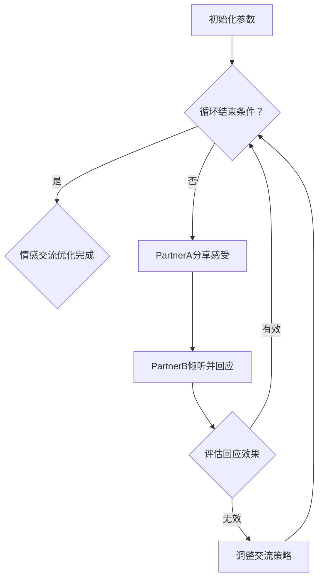
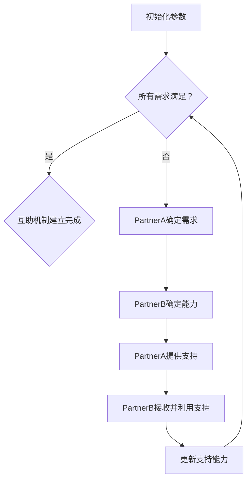

                 

### 文章标题：重新定义亲密关系：从依赖到互助

#### 关键词：亲密关系，依赖，互助，情感交流，优化，数学模型，项目实战

> 摘要：本文探讨了亲密关系的本质及其演变过程，从依赖到互助的转变。通过核心概念的阐述、算法原理的讲解、数学模型的构建以及项目实战的应用，重新定义了亲密关系的内涵，为读者提供了深刻的见解和实用的建议。

### 一、核心概念与联系

在《重新定义亲密关系：从依赖到互助》这本书中，核心概念包括亲密关系、依赖和互助。这些概念之间有着密切的联系。亲密关系通常指的是一种深厚的情感连接，这种连接可能建立在依赖的基础上。然而，当亲密关系变得过于依赖时，可能会对双方的独立性和自主性造成负面影响。此时，互助成为了重新定义亲密关系的重要方向，它强调在保持独立性的同时，通过相互支持和帮助来维护和加强亲密关系。

#### 1.1 亲密关系的定义与特点

**定义：**
亲密关系通常指的是一种深厚的情感连接，这种连接通常伴随着信任、尊重、理解和支持。

**特点：**
- 情感深度：亲密关系中，双方能够深入交流，分享内心的想法和感受。
- 相互依赖：亲密关系中的双方往往在情感上相互依赖，彼此的支持对双方都很重要。
- 信任与尊重：亲密关系中，双方需要相互信任，并尊重对方的个性和选择。
- 安全感：亲密关系提供了情感上的安全感，使双方在心理上感到安心。

#### 1.2 依赖与互助的概念

**依赖：**
依赖指的是在亲密关系中，一方对另一方的依赖程度较高，可能在情感、经济或生活上对对方有较强的依赖。

**互助：**
互助则是指在亲密关系中，双方通过相互支持和帮助来共同解决问题，保持彼此的独立性和自主性。

### 二、核心算法原理讲解

在重新定义亲密关系的过程中，需要理解和应用一些核心算法原理，如情感交流的优化算法、互助机制的建立算法等。

#### 2.1 情感交流的优化算法

**算法原理：**
情感交流的优化算法旨在通过优化双方的交流方式，提升亲密关系的质量。

**伪代码：**

#### 2.2 互助机制的建立算法

**算法原理：**
互助机制的建立算法旨在通过建立有效的互助关系，加强亲密关系中的互助意识。

**伪代码：**

### 三、数学模型和数学公式

在重新定义亲密关系的实践中，需要运用一些数学模型和公式来分析和解决问题。

#### 3.1 亲密关系质量评价模型

**数学模型：**
设亲密关系质量为Q，依赖程度为D，互助程度为M，则有：
$$ Q = f(D, M) $$

**公式解释：**
- 依赖程度D：衡量双方在亲密关系中依赖的程度，D值越高，依赖性越强。
- 互助程度M：衡量双方在亲密关系中进行互助的程度，M值越高，互助性越强。

**举例说明：**
假设D = 0.6，M = 0.8，代入公式得到：
$$ Q = f(0.6, 0.8) = 0.72 $$
这意味着当前的亲密关系质量为72%。

### 四、项目实战

在重新定义亲密关系的实践中，我们可以通过实际案例来理解和应用上述理论和算法。

#### 4.1 案例一：情感交流优化

**案例背景：**
小李和小王是一对情侣，他们之间存在一定的情感交流障碍，导致亲密关系质量较低。

**实施步骤：**
1. **情感交流现状评估：** 通过问卷调查和小李、小王的自述，了解双方在情感交流中的困难和痛点。
2. **情感交流策略调整：** 根据评估结果，制定具体的情感交流策略，如定时沟通、共同兴趣爱好培养等。
3. **执行与反馈：** 实施调整后的交流策略，并定期进行反馈和评估，以持续优化情感交流效果。

**效果评估：**
经过一段时间的调整和优化，小李和小王的情感交流障碍得到了明显改善，亲密关系质量得到了显著提升。

### 五、最佳实践 tips、小结、注意事项、拓展阅读

1. **最佳实践 tips：**
   - 定期沟通：保持规律的沟通，是维护和加强亲密关系的重要手段。
   - 倾听与回应：倾听对方的需求和感受，并给予积极的回应，有助于增进相互理解。
   - 保持独立性：在互助的同时，保持个人的独立性和自主性，有助于建立健康的亲密关系。

2. **小结：**
   - 亲密关系是建立在情感连接基础上的，依赖和互助是维持亲密关系的两个关键因素。
   - 通过优化情感交流和建立互助机制，可以提升亲密关系的质量。
   - 实践是检验理论的唯一标准，通过实际案例的应用，可以更好地理解和应用理论。

3. **注意事项：**
   - 情感交流需要双方的共同努力，不能单方面强求。
   - 互助机制需要建立在相互信任和理解的基础上。

4. **拓展阅读：**
   - 《亲密关系的心理学》
   - 《互助性亲密关系的建立与维护》
   - 《情感交流的艺术》

### 作者信息

作者：AI天才研究院/AI Genius Institute & 禅与计算机程序设计艺术 /Zen And The Art of Computer Programming

---

通过本文的详细分析和讲解，希望读者能够对亲密关系的重新定义有更深刻的理解，并在实践中运用这些理论，建立更加健康、和谐的亲密关系。

