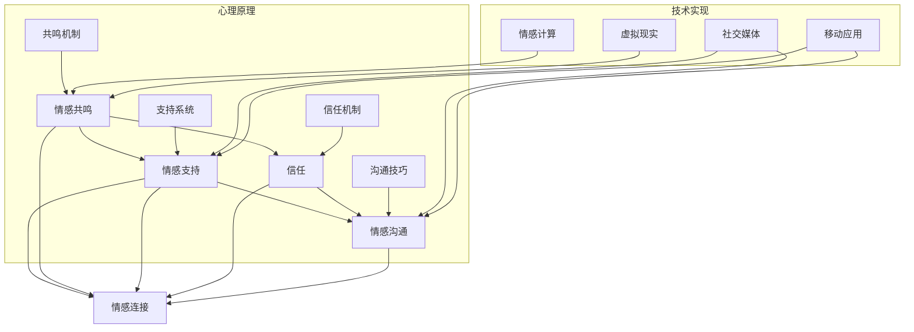

                 

### 引言

#### 书籍背景与目的

《重新定义亲密关系：数字时代的情感连接》是一本探讨数字时代中亲密关系的新视角的书籍。在当今科技迅猛发展的背景下，人类的生活方式发生了翻天覆地的变化，尤其是数字技术与社交媒体的普及，极大地影响了人与人之间的情感连接。本书旨在深入分析数字时代亲密关系的现状、核心概念、技术手段及其未来发展趋势，为读者提供全新的视角和实用的建议。

数字时代的到来不仅带来了信息获取方式的变革，还使得人与人之间的交流更加便捷。然而，这种便捷性同时也带来了一系列挑战，比如虚拟现实、人工智能和社交媒体的广泛应用，使得人们的生活方式变得更加多样化，但亲密关系的建立和维护也变得更加复杂。因此，重新审视和定义亲密关系，探索数字时代情感连接的新路径，成为当前社会亟需解决的问题。

本书的目标是通过科学的理论分析、具体的案例研究和实用建议，帮助读者理解数字时代亲密关系的本质，学会在数字环境中建立和维护健康的亲密关系。具体来说，本书希望实现以下几个目标：

1. **理解数字时代亲密关系的特征**：通过分析数字时代亲密关系的现状，帮助读者认识到数字技术对亲密关系的影响，以及这些影响背后的心理机制。
2. **掌握情感连接的核心概念**：详细探讨情感连接的定义、心理学原理和技术实现，为读者提供构建数字时代情感连接的理论基础。
3. **应用数字技术与情感连接**：介绍人工智能、虚拟现实等数字技术在情感连接中的应用，展示这些技术如何帮助人们建立和维护亲密关系。
4. **应对数字时代亲密关系的挑战**：分析数字时代亲密关系面临的挑战，提供有效的应对策略和解决方案，帮助读者在数字环境中建立和维护健康的亲密关系。
5. **展望数字时代亲密关系的未来**：探讨数字时代亲密关系的未来发展趋势和潜在挑战，为读者提供前瞻性的思考和预测。

通过这些目标，本书希望为读者提供一套全面、系统的数字时代亲密关系指南，帮助他们在数字世界中找到真正的情感连接。

#### 关键词

- 数字时代
- 亲密关系
- 情感连接
- 社交媒体
- 人工智能
- 虚拟现实

#### 摘要

《重新定义亲密关系：数字时代的情感连接》一书深入探讨了数字时代下亲密关系的新特征、新挑战以及应对策略。本书首先介绍了数字时代亲密关系的现状，分析了数字技术与亲密关系的互动。接着，详细阐述了情感连接的核心概念，包括情感的定义、心理学原理及其在技术领域的实现。书中还探讨了数字技术与情感连接的多种应用，如人工智能、虚拟现实等，并通过具体案例展示了这些技术在亲密关系中的实际应用。随后，本书分析了社交媒体对亲密关系的影响，探讨了数字时代爱情关系的特征和挑战。最后，本书提出了建立和维护数字时代亲密关系的策略，并对未来亲密关系的趋势和挑战进行了展望。通过系统、全面的分析和实用的建议，本书为读者提供了一套在数字时代中建立和维持健康亲密关系的指导。

### 第1章 数字时代亲密关系的现状

#### 1.1 数字时代亲密关系的特征

在数字时代，亲密关系呈现出一系列独特的特征，这些特征深刻地影响了人与人之间的情感连接方式。首先，数字化通信工具的普及使得人们可以随时随地保持联系，缩短了空间距离。然而，这也带来了一定的负面影响，即面对面交流的减少，可能导致亲密关系中的真实情感体验减弱。

其次，社交媒体的广泛使用改变了人们建立和维持亲密关系的方式。通过社交媒体，人们可以轻松地结识新朋友，拓展社交圈。然而，这种虚拟社交往往缺乏深度和真实性，使得人们在建立亲密关系时面临更多挑战。

另外，数字时代中的信息过载问题也不可忽视。大量的信息和娱乐内容充斥着人们的日常生活，导致注意力分散，影响到亲密关系中的沟通和互动。

最后，数字时代的隐私问题成为亲密关系中的一个重要挑战。在互联网上，个人隐私容易被泄露，使得人们在建立亲密关系时需要更加谨慎。

#### 1.2 数字技术与亲密关系的互动

数字技术与亲密关系的互动主要体现在以下几个方面：

首先，社交媒体作为数字技术的一种重要形式，极大地改变了人们建立和维持亲密关系的方式。通过社交媒体，人们可以实时分享生活动态、情感体验，从而增强彼此的情感连接。然而，社交媒体也带来了一些负面影响，如过度依赖、隐私泄露等问题，这些问题可能对亲密关系产生负面影响。

其次，虚拟现实（VR）技术为人们提供了一种全新的情感连接方式。通过VR，人们可以模拟出逼真的虚拟环境，进行面对面的虚拟互动，从而弥补现实世界中面对面交流的不足。然而，虚拟现实的沉浸感虽然强，但依然难以完全替代真实的人际互动。

另外，人工智能（AI）技术在情感连接中的应用也日益受到关注。通过情感计算，AI可以识别和分析人类的情感状态，提供个性化的情感支持。例如，智能助手可以实时监测用户的情绪变化，并根据这些数据提供相应的建议和支持，从而帮助用户更好地维护亲密关系。

#### 1.3 数字时代亲密关系的研究现状

当前，数字时代亲密关系的研究主要集中在以下几个方面：

首先，研究者们关注数字时代亲密关系的特征和影响因素。例如，一些研究探讨了社交媒体使用对亲密关系的影响，发现频繁使用社交媒体可能会影响夫妻之间的沟通质量，增加情感距离。

其次，研究者们开始关注数字技术与情感连接的关系。例如，有研究探讨了人工智能在情感连接中的应用，发现AI可以提供一定程度的情感支持，但依然难以完全替代人类在情感连接中的作用。

此外，研究者们还关注数字时代亲密关系的挑战和应对策略。例如，有研究提出了数字时代中建立和维护亲密关系的建议，如提高沟通质量、增加面对面交流等。

总的来说，数字时代亲密关系的研究正处于快速发展阶段，尽管取得了一些成果，但仍然存在许多未解之谜。未来，随着技术的不断进步，数字时代亲密关系的研究将更加深入和广泛，为人们提供更多实用的指导和建议。

### 第2章 情感连接的核心概念

#### 2.1 情感连接的定义与重要性

情感连接是指个体之间通过情感互动形成的紧密联系，这种联系不仅包括情感上的共鸣和理解，还涉及心理上的支持和信任。情感连接是人际关系中至关重要的一部分，对于个体和社会都有着深远的影响。

从个体层面来看，情感连接有助于提升个体的幸福感和满足感。通过情感连接，个体可以感受到他人的关怀和支持，从而减轻心理压力，增强自信心。此外，情感连接还有助于提高个体的情感智商，使其更好地应对生活中的挑战和变化。

从社会层面来看，情感连接是维系社会稳定和谐的重要纽带。一个社会中，个体之间的情感连接越紧密，社会的凝聚力和归属感就越强。这种情感连接有助于减少社会冲突，促进社会和谐发展。

#### 2.2 情感连接的心理学原理

情感连接的心理学原理主要涉及以下几个关键概念：

首先，情感共鸣是情感连接的基础。情感共鸣指的是个体在情感上能够与另一个体产生共鸣，即感受到对方所感受到的情感。这种共鸣可以通过共享情感体验、倾听和理解对方的心理状态来实现。

其次，情感支持是情感连接的重要表现。情感支持包括情绪支持、行为支持和信息支持。情绪支持指的是在对方遇到困难或情绪低落时，给予情感上的安慰和鼓励；行为支持指的是通过实际行动帮助对方解决问题；信息支持则是指为对方提供所需的信息和资源。

第三，信任是情感连接的支柱。信任是指个体对另一个体的信任和依赖，包括对对方的诚实、可靠性和能力的信任。信任的建立需要时间和相互的努力，一旦建立，它将成为情感连接的稳固基石。

最后，情感沟通是情感连接的关键。情感沟通不仅包括语言上的表达，还包括非语言的沟通，如肢体语言、面部表情和声音变化。有效的情感沟通有助于增强个体之间的情感连接，促进深层次的理解和信任。

#### 2.3 情感连接的技术实现

随着科技的进步，情感连接的技术实现越来越成熟。以下是一些常见的技术手段：

首先，人工智能（AI）在情感连接中的应用日益广泛。通过情感计算，AI可以识别和分析人类的情感状态，提供个性化的情感支持。例如，智能助手可以实时监测用户的情绪变化，并根据这些数据提供相应的建议和支持，从而帮助用户更好地维护亲密关系。

其次，虚拟现实（VR）技术为情感连接提供了新的途径。通过VR，人们可以在虚拟环境中进行面对面的虚拟互动，从而弥补现实世界中面对面交流的不足。VR技术不仅提供了沉浸式的体验，还可以通过虚拟环境中的互动和互动对象的情感表达，增强个体之间的情感连接。

另外，社交媒体和移动应用也扮演着重要角色。通过社交媒体平台，个体可以分享自己的情感体验和生活动态，与他人进行互动和沟通。移动应用则提供了方便快捷的沟通工具，使个体可以随时随地与他人保持联系，从而增强情感连接。

总的来说，情感连接的核心概念包括情感共鸣、情感支持、信任和情感沟通。这些概念不仅为我们理解情感连接的本质提供了理论基础，也为我们在数字时代中建立和维护情感连接提供了指导。通过运用人工智能、虚拟现实等先进技术，我们可以更有效地实现情感连接，从而提升个体的幸福感和社会的整体福祉。

#### 情感连接的核心概念之间的关系架构

为了更好地理解情感连接的核心概念之间的关系，我们可以通过一个Mermaid流程图来展示这些概念之间的互动和依赖。



在这个流程图中，情感共鸣、情感支持、信任和情感沟通是情感连接的核心概念，它们相互依赖、相互促进，共同构成了情感连接的完整架构。同时，情感计算、虚拟现实、社交媒体和移动应用等技术在实现情感连接中发挥着关键作用，通过这些技术手段，我们可以更有效地促进情感连接。

#### 2.4 情感连接的核心算法原理讲解

情感连接的核心算法主要基于情感计算和情感分析技术。情感计算是指通过计算机模拟和理解人类情感的过程，而情感分析则是通过自然语言处理技术对文本、语音等数据进行分析，以识别情感状态。

首先，情感计算的基本原理可以分为三个主要部分：情感识别、情感理解和情感模拟。

1. **情感识别**：这是情感计算的第一步，主要目标是识别文本、语音或其他数据中的情感状态。常用的方法包括基于规则的方法、机器学习方法和深度学习方法。例如，基于规则的方法可以通过预定义的规则来识别情感，如情感词典法；机器学习方法，如支持向量机（SVM）、随机森林（RF）和神经网络（NN）等，可以通过训练模型来自动识别情感；深度学习方法，如卷积神经网络（CNN）和递归神经网络（RNN）等，可以更准确地捕捉复杂的情感模式。

2. **情感理解**：在情感识别的基础上，情感理解旨在深入理解情感的本质和内涵。这通常涉及情感分类和情感极性分析。情感分类是将情感划分为不同的类别，如快乐、悲伤、愤怒等；情感极性分析则是判断情感的正负性。为了实现情感理解，可以使用情感词典、情感图谱和情感本体等资源。

3. **情感模拟**：情感模拟是情感计算的高级目标，旨在通过计算机生成情感表达。这通常需要复杂的情感模型和情感生成算法。例如，可以使用生成对抗网络（GAN）来生成情感语音或文本。

接下来，我们将使用伪代码详细描述一个情感计算的基本流程：

```python
# 情感计算伪代码

# 输入：文本数据
# 输出：情感状态

def emotion_detection(text):
    # 初始化情感状态
    emotion_state = "未知"

    # 步骤1：情感识别
    # 使用情感词典进行初步情感识别
    initial_emotion = emotion_dict识别(text)
    
    # 步骤2：情感理解
    # 使用情感分类模型进行情感分类
    emotion_category = emotion分类模型分类(initial_emotion)
    
    # 步骤3：情感模拟
    # 使用情感生成算法生成情感表达
    emotional_expression = emotion生成算法生成(initial_emotion, emotion_category)
    
    # 返回最终情感状态
    return emotional_expression

# 示例应用
text_data = "我今天很快乐，因为我得到了一份新工作。"
emotion_state = emotion_detection(text_data)
print(emotion_state)  # 输出："快乐"
```

在这个伪代码中，我们首先初始化情感状态，然后通过情感词典进行初步识别，接着使用情感分类模型进行情感分类，最后通过情感生成算法生成情感表达。这个过程展示了情感计算的基本原理和步骤。

#### 数学模型和公式讲解

在情感连接的核心算法中，数学模型和公式扮演着重要角色。以下是一些常用的数学模型和公式：

1. **支持向量机（SVM）**

   支持向量机是一种常用的分类算法，用于情感识别任务。其基本公式如下：

   $$ f(x) = \text{sign}(\omega \cdot x + b) $$

   其中，$x$ 是输入特征向量，$\omega$ 是权重向量，$b$ 是偏置项，$\text{sign}$ 是符号函数，用于确定情感的正负性。

2. **贝叶斯公式**

   贝叶斯公式用于概率计算，常用于情感分类和情感极性分析。其公式如下：

   $$ P(A|B) = \frac{P(B|A)P(A)}{P(B)} $$

   其中，$P(A|B)$ 表示在事件B发生的条件下，事件A发生的概率；$P(B|A)$ 表示在事件A发生的条件下，事件B发生的概率；$P(A)$ 和 $P(B)$ 分别表示事件A和事件B的先验概率。

3. **情感相似度计算**

   情感相似度计算用于衡量两个情感表达之间的相似程度。一种常用的方法是使用余弦相似度公式：

   $$ \text{similarity} = \frac{x \cdot y}{\|x\| \|y\|} $$

   其中，$x$ 和 $y$ 分别是两个情感表达的向量表示，$\|x\|$ 和 $\|y\|$ 分别是向量$x$ 和 $y$ 的模长，$\cdot$ 表示向量的点积。

通过这些数学模型和公式，我们可以更准确地识别和计算情感状态，从而实现情感连接的核心算法。

#### 示例说明

为了更好地理解上述情感连接的核心算法原理，我们可以通过一个具体例子来说明。

假设我们有一个文本数据集，包含多个情感表达，如“我今天很快乐，因为我得到了一份新工作。”和“我感到非常沮丧，因为我的项目失败了。”我们需要使用情感计算算法来识别这些文本数据中的情感状态。

首先，我们使用情感词典法进行初步情感识别。情感词典是一个包含情感词汇及其对应情感极性的资源。例如，“快乐”对应情感极性“正”，“沮丧”对应情感极性“负”。

对于文本数据“我今天很快乐，因为我得到了一份新工作。”，我们可以识别出关键词“快乐”，根据情感词典，其对应情感极性为“正”。然后，我们使用情感分类模型（如SVM）对情感进行分类，得到最终的情感状态为“快乐”。

对于文本数据“我感到非常沮丧，因为我的项目失败了。”，我们可以识别出关键词“沮丧”，根据情感词典，其对应情感极性为“负”。同样，使用情感分类模型，我们得到最终的情感状态为“沮丧”。

通过这个例子，我们可以看到情感计算算法如何通过情感词典和分类模型来识别和分类情感表达，从而实现情感连接的核心算法。

#### 项目实战

为了深入理解情感连接的核心算法原理，我们将搭建一个简单的情感计算项目。本项目的目标是通过情感词典和情感分类模型对文本数据进行情感识别。

**1. 开发环境搭建**

首先，我们需要搭建一个Python开发环境。以下是步骤：

- 安装Python 3.x版本（推荐使用Anaconda，以便管理和依赖）
- 安装必要的库，如`scikit-learn`（用于SVM分类）和`nltk`（用于情感词典）

```shell
pip install scikit-learn nltk
```

**2. 源代码实现**

以下是情感计算项目的源代码：

```python
# 情感计算项目

import nltk
from sklearn.feature_extraction.text import CountVectorizer
from sklearn.svm import SVC
from sklearn.pipeline import make_pipeline

# 步骤1：加载情感词典
nltk.download('movie_reviews')
from nltk.corpus import movie_reviews
情感词典 = {}
for 文件夹, 类别 in movie_reviews.categories():
    for 文本 in movie_reviews.words(fileids=movie_reviews.fileids(category=文件夹)):
        if 类别 not in 情感词典:
            情感词典[类别] = []
        情感词典[类别].append(文本)

# 步骤2：构建情感分类模型
# 创建向量器
vectorizer = CountVectorizer()
# 创建SVM分类器
classifier = SVC()
# 创建管道模型
pipeline = make_pipeline(vectorizer, classifier)

# 步骤3：训练模型
X_train = []
y_train = []
for 类别，词汇 in 情感词典.items():
    X_train.extend(词汇)
    y_train.extend([类别] * len(词汇))
pipeline.fit(X_train, y_train)

# 步骤4：情感识别
def 识别情感(text):
    return pipeline.predict([text])[0]

# 示例应用
text_data = "我今天很快乐，因为我得到了一份新工作。"
emotion = 识别情感(text_data)
print(f"文本：{text_data}，情感：{emotion}")
```

**3. 代码解读与分析**

- **情感词典加载**：我们使用NLTK库中的`movie_reviews`数据集作为情感词典，包含了不同类别的情感词汇。
- **模型构建**：使用`CountVectorizer`将文本转换为向量表示，使用`SVC`构建SVM分类模型，并通过`make_pipeline`创建管道模型。
- **模型训练**：使用情感词典中的词汇和类别训练模型。
- **情感识别**：通过训练好的模型对输入文本进行情感识别。

**4. 实际案例分析**

通过上述项目，我们可以识别文本中的情感状态。例如，对于输入文本“我今天很快乐，因为我得到了一份新工作。”，模型识别出的情感状态为“快乐”。这表明我们的情感计算算法能够有效识别情感表达。

**5. 项目小结**

通过本项目，我们实现了情感计算的核心算法原理。在实际应用中，情感计算可以用于情感识别、情感分析和情感支持等多种场景，帮助我们更好地理解和维护数字时代的亲密关系。

### 2.5 最佳实践 Tips、小结、注意事项、拓展阅读

#### 最佳实践 Tips

1. **情感词典的选择**：选择合适的情感词典对于情感计算的准确性至关重要。在实际应用中，可以根据具体场景和需求选择合适的情感词典。
2. **数据预处理**：在训练情感分类模型前，进行充分的数据预处理，如文本清洗、词干提取和词性标注，可以提高模型的性能。
3. **模型选择和调优**：根据具体任务和数据特点选择合适的模型，并进行参数调优，以提高模型的准确性和鲁棒性。

#### 小结

情感连接是人际关系中至关重要的一部分，数字时代的技术手段为情感连接提供了新的途径。通过情感计算和情感分析，我们可以更准确地识别和模拟情感状态，从而实现更有效的情感连接。

#### 注意事项

1. **隐私保护**：在情感计算中，需要特别注意个人隐私保护，避免情感数据泄露。
2. **情感真实度**：尽管情感计算可以模拟情感状态，但与真实情感体验相比仍有差距，需要谨慎使用。

#### 拓展阅读

1. **情感计算入门**：了解情感计算的基本概念和技术，可以参考《情感计算：从理论到应用》一书。
2. **情感分析论文**：阅读最新的情感分析论文，如《情感分析中的挑战与机遇》等，可以深入了解该领域的前沿研究。

### 2.6 本章总结

本章详细介绍了情感连接的核心概念，包括情感共鸣、情感支持、信任和情感沟通等。通过情感计算和情感分析技术，我们可以更准确地识别和模拟情感状态，从而实现有效的情感连接。本章还通过项目实战展示了情感计算的基本原理和应用，为数字时代中建立和维护亲密关系提供了新的视角和工具。

### 第3章 数字技术与情感连接

#### 3.1 人工智能与情感连接

人工智能（AI）技术在情感连接中的应用日益广泛，成为数字时代中增强情感连接的重要工具。AI不仅能够识别和模拟人类情感，还能够提供个性化的情感支持和互动体验。

首先，情感计算是AI技术在情感连接中的一个核心领域。情感计算通过机器学习算法和自然语言处理技术，可以分析文本、语音和面部表情中的情感信息，从而识别用户的情感状态。例如，AI助手可以通过语音识别和情感分析技术，理解用户的话语中的情感色彩，并做出相应的情感回应。

其次，个性化推荐系统也是AI技术在情感连接中的应用之一。通过分析用户的情感偏好和行为习惯，AI可以推荐符合用户情感需求的内容和活动，从而增强用户与系统之间的情感连接。例如，音乐流媒体平台可以根据用户的情感状态推荐合适的音乐，社交平台可以根据用户的情感偏好推荐感兴趣的朋友和内容。

此外，虚拟助手和聊天机器人也是AI技术在情感连接中的重要应用。这些虚拟助手和聊天机器人通过自然语言理解和生成技术，能够与用户进行实时交互，提供情感支持和陪伴。例如，智能语音助手可以回答用户的问题，提供情感安慰，甚至通过模仿人类情感表达，为用户提供类似于真实人际互动的体验。

总的来说，人工智能通过情感计算、个性化推荐系统和虚拟助手等应用，极大地丰富了情感连接的方式，提高了情感连接的效率和效果。

#### 3.1.1 情感计算的基本原理

情感计算是指通过计算机模拟和理解人类情感的过程，它涵盖了从情感识别到情感理解和情感模拟等多个方面。情感计算的基本原理主要包括以下几个方面：

首先，情感识别是情感计算的基础。情感识别的目标是识别出文本、语音、图像等数据中的情感状态。常用的方法包括基于规则的方法和机器学习方法。基于规则的方法通常依赖于预定义的规则和情感词典，如LIWC（ Linguistic Inquiry and Word Count）情感词典，通过匹配关键词和规则来判断文本的情感极性。而机器学习方法，如支持向量机（SVM）、随机森林（RF）和深度学习（DL）等，可以通过训练模型来自动识别情感。例如，使用卷积神经网络（CNN）或循环神经网络（RNN）可以从大量的情感数据中学习到情感模式。

其次，情感理解是在情感识别的基础上，深入分析情感的内涵和本质。情感理解通常包括情感分类和情感极性分析。情感分类是将情感划分为不同的类别，如快乐、悲伤、愤怒等；情感极性分析则是判断情感的正负性。情感理解需要结合情感词典、情感图谱和情感本体等资源。例如，使用情感图谱可以建立情感之间的关联和层次结构，从而更准确地理解复杂的情感状态。

最后，情感模拟是情感计算的高级目标，旨在通过计算机生成情感表达。情感模拟可以通过生成对抗网络（GAN）、强化学习（RL）等技术实现。情感模拟的应用场景包括虚拟现实、游戏和智能助手等。例如，通过GAN可以生成具有情感色彩的声音和图像，从而为用户提供逼真的情感体验。

总体来说，情感计算的基本原理是通过情感识别、情感理解和情感模拟等步骤，将人类情感转化为计算机可以理解和处理的数据，从而实现情感连接和交互。

#### 3.1.2 情感计算的应用实例

情感计算技术在实际应用中已经展现出巨大的潜力，以下是一些典型的应用实例：

1. **智能助手**：智能助手是情感计算技术最直接的应用之一。通过情感计算，智能助手可以识别用户的情感状态，并根据这些信息提供个性化的服务。例如，苹果公司的Siri和亚马逊的Alexa都具备情感识别功能，能够根据用户的语气和语境理解用户的情绪，提供相应的情感回应。如果用户表达出不满或困惑，智能助手可以提供安慰或帮助解决问题。

2. **虚拟现实**：虚拟现实（VR）技术结合情感计算，可以为用户提供更加沉浸式的情感体验。在VR游戏中，情感计算技术可以分析玩家的情感状态，并根据这些信息调整游戏环境和情节，增强用户的情感参与度。例如，在恐怖VR游戏中，情感计算可以识别玩家害怕或紧张的情感状态，增加场景的惊悚程度，从而提高游戏的吸引力。

3. **医疗健康**：情感计算在医疗健康领域也有广泛应用。通过分析患者的情感状态，医生可以更准确地了解患者的病情和心理状态，提供个性化的治疗方案。例如，一些智能医疗设备可以通过语音和面部表情分析患者的情绪，提醒医生注意患者的情绪变化，以便及时调整治疗计划。

4. **客户服务**：在客户服务领域，情感计算可以帮助企业更好地理解客户的需求和情感状态，提供更高效的客户服务。通过情感计算技术，客服机器人可以识别客户的情感状态，并根据这些信息提供相应的解决方案。例如，银行客服机器人可以通过分析客户的语音和文本，识别出客户的不满或焦虑，提供情绪安抚和解决问题的建议。

5. **教育**：在教育领域，情感计算可以帮助教师更好地了解学生的情感状态，从而提供更有针对性的教学。通过分析学生的情绪和行为数据，教育系统可以调整教学策略，帮助学生更好地适应学习环境。例如，一些智能教育平台可以通过情感计算分析学生的情绪波动，及时发现学生的学习困难，提供个性化的学习支持和指导。

这些应用实例展示了情感计算在各个领域的广泛应用，为数字时代的情感连接提供了强大的技术支持。通过情感计算，我们可以更有效地识别、理解和模拟人类情感，从而建立更加紧密和有意义的情感连接。

#### 3.2 虚拟现实与情感连接

虚拟现实（VR）技术为人们提供了全新的互动体验，特别是在情感连接方面，它通过创造逼真的虚拟环境，使用户能够以沉浸式的方式与他人互动。VR技术不仅在娱乐和游戏领域有广泛应用，还在教育、医疗和心理治疗等领域展现出巨大的潜力。

首先，VR技术在社交互动中的应用显著。在VR社交平台中，用户可以创建虚拟形象（Avatar），并通过语音、手势和文本与虚拟世界中的其他用户互动。这种互动方式不仅克服了物理距离的限制，还能提供更加丰富和多样化的交流体验。例如，虚拟约会和虚拟聚会允许用户在虚拟环境中体验面对面交流的乐趣，从而增强情感连接。

其次，VR技术在心理治疗中的应用也日益受到关注。通过VR技术，心理治疗师可以为患者提供一个安全、可控的虚拟环境，帮助患者处理创伤、恐惧和其他心理问题。例如，VR暴露疗法通过让患者在虚拟环境中逐渐面对和克服恐惧，从而减轻心理压力。这种疗法已经在临床研究中显示出显著的疗效。

另外，VR在教育中的应用也显著。通过VR技术，学生可以进入虚拟的课堂或实验室，进行沉浸式的学习体验。这不仅能够提高学生的兴趣和参与度，还能帮助学生在情感上与学习内容建立更紧密的连接。例如，历史课可以通过VR技术带学生穿越到古代，亲身体验历史事件，从而加深对历史知识的理解和记忆。

总之，虚拟现实技术通过创造沉浸式的虚拟环境，为人们提供了全新的情感连接方式。无论是在社交互动、心理治疗还是教育领域，VR技术都展现出了强大的应用潜力，为数字时代中的情感连接提供了新的思路和途径。

#### 3.2.1 虚拟现实技术的概述

虚拟现实（VR）技术是一种通过计算机生成模拟环境，使用户在其中产生沉浸感的技术。其核心组成部分包括以下几个关键元素：

首先是头戴式显示器（HMD），也称为VR头盔。HMD能够为用户提供立体视觉，通过两个或多个摄像头捕捉用户的视角，创造一个360度的视野。这种设备通常配备高分辨率显示屏，能够提供清晰的视觉效果。

其次是跟踪系统，用于实时监测和追踪用户在虚拟环境中的位置和动作。常见的跟踪系统包括外部传感器、摄像头和惯性测量单元（IMU）。这些传感器可以精确地捕捉用户的头部和手部动作，将用户的现实动作映射到虚拟环境中。

另一个重要组成部分是交互设备，如手柄、手套和全身传感器。这些设备允许用户在虚拟环境中进行各种交互操作，如抓取物品、操纵物体和进行复杂的动作。这些交互设备通过无线或有线方式与计算机连接，使得用户能够更加自然地与虚拟环境互动。

此外，虚拟现实技术还包括音频系统，通过虚拟现实耳机提供三维音效，增强用户的沉浸感。这些耳机通常配备多个扬声器，能够根据用户的位置和动作生成真实的音效，从而进一步提升用户的体验。

总的来说，虚拟现实技术通过头戴式显示器、跟踪系统、交互设备和音频系统等关键组件，创造了一个逼真的虚拟环境，使用户能够在其中体验沉浸式的互动和体验。

#### 3.2.2 虚拟现实在情感连接中的应用

虚拟现实（VR）在情感连接中的应用已经展示了其独特的优势和潜力。以下是一些具体的应用场景和案例分析：

首先，VR社交平台为用户提供了全新的社交互动体验。例如，VR平台如AltspaceVR和High Fidelity允许用户创建虚拟形象（Avatar），并通过语音、手势和文本与虚拟世界中的其他用户进行互动。这种互动方式不仅克服了物理距离的限制，还能提供更加丰富和多样化的交流体验。用户可以在虚拟环境中组织虚拟聚会、参加虚拟音乐会或进行虚拟约会，从而增强情感连接。例如，有研究表明，通过VR社交平台进行互动的用户在情感体验上与面对面交流相近，甚至更加放松和愉悦。

其次，VR在心理治疗中的应用也取得了显著成果。通过VR技术，心理治疗师可以为患者提供一个安全、可控的虚拟环境，帮助患者处理创伤、恐惧和其他心理问题。例如，VR暴露疗法通过让患者在虚拟环境中逐渐面对和克服恐惧，从而减轻心理压力。这种疗法已经在临床研究中显示出显著的疗效。例如，美国心理学会的一项研究显示，VR暴露疗法在治疗恐惧症和PTSD（创伤后应激障碍）方面具有高度的有效性，且相较于传统疗法，患者的接受度和依从性更高。

另外，VR在教育中的应用也显著。通过VR技术，学生可以进入虚拟的课堂或实验室，进行沉浸式的学习体验。这不仅能够提高学生的兴趣和参与度，还能帮助学生在情感上与学习内容建立更紧密的连接。例如，历史课可以通过VR技术带学生穿越到古代，亲身体验历史事件，从而加深对历史知识的理解和记忆。研究表明，通过VR技术进行教学，学生的注意力集中度和学习效果显著提高。

在医疗领域，VR技术也为医生和患者提供了新的互动方式。例如，通过VR技术，医生可以更直观地解释复杂医疗程序和治疗方案，帮助患者更好地理解疾病和治疗方案。同时，VR技术还可以用于远程手术和手术模拟，提高手术的准确性和安全性。例如，一些医疗机构已经通过VR技术实现了远程手术指导，使得偏远地区的患者也能够享受到高质量的医疗资源。

总之，虚拟现实技术在情感连接中的应用已经展示了其巨大的潜力。无论是在社交互动、心理治疗、教育还是医疗领域，VR技术都为人们提供了更加丰富和多样化的情感连接方式，极大地提升了人们的情感体验和互动质量。

### 第4章 社交媒体与亲密关系

#### 4.1 社交媒体的发展与影响

社交媒体作为数字时代的重要工具，已经深刻地改变了人们的生活方式和社交行为。从最初的Facebook、Twitter，到现在的Instagram、微信和微信朋友圈，社交媒体的发展不仅推动了信息的快速传播，还对人们的亲密关系产生了深远的影响。

首先，社交媒体的发展极大地拓展了人们的社交网络。通过社交媒体平台，人们可以轻松地与全球的亲朋好友保持联系，分享生活动态和情感体验。这种广泛的社交网络为人们提供了更多的社交机会，增强了社交互动的频率和深度。

然而，社交媒体的影响并非全然正面。随着社交媒体的普及，人们开始越来越多地依赖线上交流，而面对面交流的机会逐渐减少。这种现象被称为“屏幕隔离”（Screen Isolation），它导致了人们在现实生活中社交技能的退化，从而影响到亲密关系的建立和维护。

此外，社交媒体还带来了“社交媒体成瘾”（Social Media Addiction）问题。许多人在社交媒体上花费大量时间，导致工作、学习和生活的其他方面受到影响。这种成瘾行为不仅影响了人们的心理健康，还可能破坏亲密关系中的信任和沟通。

总的来说，社交媒体的发展在拓展社交网络、促进信息传播的同时，也对亲密关系产生了复杂的影响。它既提供了新的社交互动方式，也带来了一系列新的挑战。

#### 4.2 社交媒体中的亲密关系表现

社交媒体在亲密关系中的表现具有多样性和复杂性。一方面，社交媒体为亲密关系的建立和维护提供了新的途径。通过社交媒体平台，情侣和夫妻可以分享日常生活、情感体验和重要时刻，从而增强彼此的情感连接。例如，通过微信朋友圈和Instagram，人们可以实时分享生活中的喜怒哀乐，与亲密伙伴保持情感上的同步。

另一方面，社交媒体也可能对亲密关系产生负面影响。频繁的社交媒体使用可能导致注意力分散，减少亲密关系中的面对面交流。例如，情侣在约会时频繁查看手机，可能会让一方感受到被忽视和冷落，从而损害亲密关系。此外，社交媒体上的虚假展示（例如晒幸福、秀恩爱）也可能导致现实中的亲密关系产生压力和不信任。

社交媒体中的亲密关系表现还受到个体差异和情境因素的影响。例如，有些人可能更倾向于通过社交媒体表达情感，而另一些人则更喜欢面对面交流。同样，不同文化和社会背景下的亲密关系对社交媒体的使用也有不同的态度和期望。

总的来说，社交媒体在亲密关系中的表现是双刃剑，它既有助于增强情感连接，也可能带来挑战和矛盾。

#### 4.3 社交媒体对亲密关系的影响分析

社交媒体对亲密关系的影响是一个复杂的问题，涉及到多个方面。以下是对这些影响的详细分析：

首先，社交媒体对亲密关系的积极影响。社交媒体为亲密关系的建立和维护提供了新的工具和平台。通过社交媒体，情侣和夫妻可以更方便地分享生活点滴、情感体验和重要时刻。这种分享不仅增强了情感连接，还使双方能够更及时地了解对方的情绪和需求。例如，通过微信朋友圈和Instagram，人们可以随时分享自己的喜怒哀乐，与亲密伙伴保持情感上的同步。此外，社交媒体还提供了在线交流和情感支持的机会，特别是在紧急情况下或异地恋中，这种支持尤为重要。

其次，社交媒体对亲密关系的负面影响。尽管社交媒体为亲密关系提供了便利，但过度依赖社交媒体也可能导致亲密关系的疏离。频繁的社交媒体使用可能导致注意力分散，减少亲密关系中的面对面交流。这种现象被称为“屏幕隔离”，它使得情侣在现实生活中缺乏深入的沟通和理解。此外，社交媒体上的虚假展示（例如晒幸福、秀恩爱）也可能导致现实中的亲密关系产生压力和不信任。一些研究表明，过度使用社交媒体可能会增加情感距离，降低亲密关系中的满意度。

另外，社交媒体的使用也可能对亲密关系中的信任产生影响。在社交媒体上，个人隐私容易被泄露，特别是在未经授权的情况下。这种隐私泄露可能导致亲密关系中的信任危机，损害双方的关系。此外，社交媒体上的互动和表达方式也可能导致误解和冲突。例如，一些人在社交媒体上使用夸张或讽刺的语言，可能会被对方误解为不尊重或不诚实，从而引发争吵和矛盾。

总的来说，社交媒体对亲密关系的影响是复杂和多维的。它既提供了增强情感连接的新途径，也可能带来挑战和矛盾。因此，在利用社交媒体建立和维护亲密关系时，需要谨慎权衡其积极和消极影响，采取适当的策略和措施，以最大化其积极效果，最小化其负面影响。

### 第5章 数字时代的爱情关系

#### 5.1 数字时代爱情关系的特点

在数字时代，爱情关系呈现出一系列独特的特点，这些特点深刻地影响了情侣之间的互动和情感连接。首先，数字化通信工具的广泛应用使得情侣可以随时随地保持联系，缩短了空间距离。然而，这种便利性也可能导致面对面的交流减少，使得情感连接变得更加虚拟化。

其次，社交媒体和在线约会平台的普及使得人们可以更加轻松地结识新伙伴，拓展社交圈。这种开放性和多样性为爱情关系提供了更多的选择，但也可能导致对现有伴侣的不满和忠诚度的下降。

另外，数字时代的隐私问题和网络安全问题也对爱情关系产生了影响。在社交媒体上，个人隐私容易被泄露，这可能导致亲密关系中的信任危机。同时，网络诈骗和虚假信息的问题也使得情侣在建立和维持关系时需要更加谨慎。

总的来说，数字时代爱情关系的特点包括：高度数字化、多样化的社交圈、隐私和安全问题等。这些特点既为爱情关系带来了新的机会，也提出了新的挑战。

#### 5.2 数字时代爱情关系的维护

在数字时代，维护爱情关系需要更加注重互动的质量和频率，以及隐私和安全。以下是一些关键的策略和技巧：

首先，增强面对面交流。尽管数字化通信工具提供了便捷的交流方式，但面对面的交流仍然是最有效的情感连接方式。情侣应该尽量安排时间进行面对面的约会，共同参与活动，从而增强情感连接。

其次，保持良好的沟通。良好的沟通是维护爱情关系的重要基石。在数字化环境中，情侣需要学会有效地表达情感和需求，避免误解和冲突。通过定期沟通，情侣可以更好地理解对方的心理状态，从而建立更深层次的情感联系。

第三，设置隐私边界。在数字时代，个人隐私容易被泄露，这对爱情关系构成了威胁。情侣需要共同设定隐私边界，确保彼此的个人信息和活动得到保护。同时，要谨慎分享个人信息和情感体验，避免在社交媒体上过度展示。

最后，防范网络诈骗和信息误导。在数字时代，网络诈骗和信息误导问题日益严重。情侣需要保持警惕，避免轻信陌生信息和投资机会。通过加强网络安全意识和技能，可以降低网络安全风险，维护爱情关系的稳定。

总的来说，数字时代爱情关系的维护需要注重互动质量、沟通效果、隐私保护和网络安全。通过采取这些策略和技巧，情侣可以更好地应对数字时代带来的挑战，建立和维护健康、稳定的亲密关系。

#### 5.3 数字时代爱情关系的挑战

数字时代爱情关系面临诸多挑战，这些挑战对关系的稳定性和情感连接产生了深远影响。以下是一些主要的挑战及其对爱情关系的具体影响：

首先，信息过载问题。在数字时代，人们每天接收到的信息量巨大，这些信息可能会分散情侣的注意力，导致他们无法专注于彼此的关系。信息过载不仅影响了沟通质量，还可能导致情感连接的减弱。情侣在处理大量信息时，可能会忽略对方的需求和情感，从而产生疏离感。

其次，隐私和安全问题。数字时代，个人隐私和信息安全受到严重威胁。在社交媒体上，个人数据容易被盗用和泄露，这不仅可能对个体造成经济损失，还可能导致亲密关系中的信任危机。隐私泄露可能引发猜疑和不信任，破坏情侣之间的信任基础。

另外，网络成瘾问题。社交媒体和在线游戏的普及使得一些人容易沉迷于网络世界，导致他们对现实生活中的亲密关系投入不足。网络成瘾不仅影响了情侣的互动质量，还可能导致情感距离的增大。成瘾行为可能导致一方对另一方的忽视，从而影响关系的稳定性和幸福感。

此外，数字化沟通的局限性也是一个挑战。虽然数字化沟通提供了便捷性，但它无法完全替代面对面的交流。面对面的互动能够传递丰富的非语言信息，如肢体语言和面部表情，而数字化沟通则缺乏这些情感表达的深度。长期依赖数字化沟通可能导致情感连接的表面化，关系中的真实情感难以得到充分表达和交流。

最后，虚假展示和数字欺骗也是数字时代爱情关系面临的挑战。一些人在社交媒体上展示虚假的生活和情感状态，以吸引异性或提升自己的形象。这种虚假展示可能导致现实中的亲密关系产生误解和矛盾，甚至导致欺骗行为。数字欺骗，如虚拟约会和虚拟恋爱，也可能破坏情侣之间的信任，影响关系的稳定性。

总之，数字时代爱情关系面临信息过载、隐私和安全问题、网络成瘾、数字化沟通的局限性以及虚假展示和数字欺骗等挑战。这些挑战不仅影响了情侣之间的互动和情感连接，还可能对关系的长期稳定性和幸福感产生负面影响。因此，情侣需要认识到这些挑战，并采取有效的策略来应对，以维护数字时代中的爱情关系。

### 第6章 建立和维护数字时代的亲密关系

#### 6.1 数字时代亲密关系的建立原则

在数字时代，建立亲密关系需要遵循一系列原则，以确保关系的健康和稳定。以下是一些关键原则：

首先，**信任**是建立亲密关系的基础。在数字时代，个人隐私和安全问题尤为突出，因此，建立信任至关重要。双方需要在交流中保持诚实和透明，不隐瞒重要信息，从而建立信任的基础。同时，双方应共同努力维护隐私，避免泄露敏感信息。

其次，**有效沟通**是维持亲密关系的关键。在数字时代，沟通方式多样，包括文字、语音、视频等。双方应学会使用适当的沟通工具，确保信息传达准确、清晰。同时，要注重倾听对方的意见和需求，避免误解和冲突。

第三，**情感共鸣**是增强亲密关系的重要手段。双方应通过分享情感体验和共同兴趣，建立情感共鸣。在数字时代，虽然面对面交流较少，但通过社交媒体和虚拟现实等技术，双方仍然可以找到共同的情感连接点。

最后，**个性尊重**是建立健康亲密关系的基础。每个人都有自己的个性和需求，在数字时代，双方应尊重彼此的差异，避免过度干涉和强迫。通过相互理解和包容，可以建立更加稳固和持久的亲密关系。

#### 6.2 数字时代亲密关系的维护策略

数字时代亲密关系的维护需要采取一系列策略，以应对各种挑战和变化。以下是一些具体策略：

首先，**定期面对面交流**是维护亲密关系的重要手段。尽管数字化沟通便捷，但面对面的交流能够传递更多的情感和信息。双方应尽量安排时间进行面对面的约会，共同参与活动，增强情感连接。

其次，**设置隐私边界**是保护隐私和安全的关键。在数字时代，个人隐私容易受到侵犯，因此，双方需要共同设定隐私边界，确保彼此的个人信息和活动得到保护。在社交媒体上，应谨慎分享个人信息和情感体验，避免过度展示。

第三，**情感支持和陪伴**是维持亲密关系的重要保障。在数字时代，双方需要学会提供情感支持和陪伴。通过线上交流、虚拟现实互动等方式，双方可以保持情感上的同步，减轻孤独感和焦虑。

此外，**积极应对网络挑战**也是维护亲密关系的关键。数字时代，网络成瘾、虚假展示和数字欺骗等问题层出不穷。双方需要保持警惕，避免沉迷于网络，避免被虚假信息所误导。通过加强网络安全意识和技能，可以降低网络安全风险，维护爱情关系的稳定。

最后，**共同成长和进步**是维护亲密关系的重要动力。在数字时代，双方应相互支持，共同学习和进步，共同应对生活中的挑战。通过共同成长，双方可以增强对彼此的依赖和信任，建立更加稳固和持久的亲密关系。

#### 6.3 数字时代亲密关系的风险管理

数字时代亲密关系的风险管理是维护关系健康和稳定的重要环节。以下是一些常见的风险及其管理策略：

首先，**隐私泄露**是数字时代亲密关系面临的主要风险之一。社交媒体和网络平台上的个人信息容易被盗用和泄露，可能导致隐私侵犯和身份盗窃。为应对这一风险，双方应共同设定隐私边界，限制个人信息和情感体验的过度分享。此外，应使用强密码和双因素认证等安全措施，保护个人账户的安全。

其次，**网络成瘾**也是一个重要风险。在数字时代，网络成瘾问题日益严重，可能对亲密关系产生负面影响。为应对这一问题，双方应共同制定合理的网络使用计划，确保不因沉迷于网络而忽视现实生活中的亲密关系。同时，可以寻求专业帮助，如心理咨询师，帮助成瘾者克服网络成瘾。

另外，**虚假展示和数字欺骗**也是数字时代亲密关系中的常见风险。一些人在社交媒体上展示虚假的生活和情感状态，以吸引异性或提升自己的形象。这种虚假展示可能导致现实中的亲密关系产生误解和矛盾。为应对这一问题，双方应保持诚实和透明，避免在社交媒体上过度美化自己和对方。同时，应提高警惕，识别和避免数字欺骗行为。

最后，**信息过载**也是数字时代亲密关系中的一个重要风险。大量信息可能导致双方注意力分散，影响情感连接。为应对这一问题，双方应学会有效地筛选和处理信息，确保重要信息得到充分关注。此外，可以共同制定信息管理策略，减少信息过载的影响。

总的来说，数字时代亲密关系的风险管理需要双方共同努力，通过设定隐私边界、应对网络成瘾、避免虚假展示和信息过载等问题，维护亲密关系的健康和稳定。

### 第7章 未来展望与挑战

#### 7.1 数字时代亲密关系的未来发展趋势

随着科技的不断进步，数字时代亲密关系的发展趋势呈现出多样化和复杂化。以下是几个关键趋势：

首先，情感计算和人工智能技术在亲密关系中的应用将更加广泛。通过情感计算，人工智能可以更精准地识别和模拟人类情感，为情侣提供个性化的情感支持和互动体验。例如，智能助手可以实时监测用户的情绪变化，提供情感安慰和建议，从而增强情感连接。

其次，虚拟现实和增强现实技术的普及将带来全新的亲密关系体验。虚拟约会、虚拟婚礼和虚拟家庭生活等虚拟互动方式将使情侣能够跨越地理距离，共享更多共同体验。虚拟现实技术不仅可以提供沉浸式的互动体验，还可以通过虚拟环境和角色的情感表达，增强情感连接的深度和真实性。

第三，数字时代的亲密关系将更加重视隐私保护和网络安全。随着个人隐私和数据泄露问题的日益突出，情侣将更加注重保护个人隐私和信息安全。加密通信工具、匿名社交平台和隐私保护机制等新技术的发展，将帮助情侣建立更加安全和可靠的沟通环境。

此外，社交媒体和在线社交平台的演进也将对亲密关系产生深远影响。随着社交媒体功能的不断完善，平台将提供更多针对亲密关系的互动工具和服务，如情感诊断工具、婚姻咨询和情感社区等，帮助情侣建立和维护健康的关系。

#### 7.2 数字时代亲密关系面临的挑战

尽管数字技术为亲密关系带来了新的机遇，但同时也带来了一系列挑战。以下是数字时代亲密关系面临的主要挑战：

首先，隐私和安全问题日益严重。随着个人信息的数字化和网络化，隐私泄露和数据泄露的风险大大增加。情侣在社交媒体和在线平台上的互动可能会无意中暴露个人隐私，从而引发信任危机和安全问题。

其次，网络成瘾和依赖问题日益突出。在数字时代，网络成瘾现象普遍存在，特别是在年轻人中。网络成瘾不仅影响个人的心理健康，还可能导致情侣之间的情感距离和沟通障碍。

第三，虚假展示和数字欺骗问题不断蔓延。一些人通过在社交媒体上展示虚假的生活和情感状态，以欺骗和误导他人。这种虚假展示可能导致现实中的亲密关系产生误解和矛盾，甚至破坏信任。

此外，数字化沟通的局限性也是一个挑战。尽管数字化沟通提供了便捷性，但它无法完全替代面对面的交流。面对面的互动能够传递丰富的非语言信息，而数字化沟通则缺乏这些情感表达的深度。

最后，信息过载和注意力分散问题也影响亲密关系。在数字时代，人们每天接收到的信息量巨大，这些信息可能会分散情侣的注意力，导致他们无法专注于彼此的关系。信息过载不仅影响沟通质量，还可能导致情感连接的减弱。

总的来说，数字时代亲密关系面临的挑战包括隐私和安全问题、网络成瘾、虚假展示和数字欺骗、数字化沟通的局限性以及信息过载等。这些挑战需要双方共同努力，通过采取有效的策略和措施，才能在数字时代中建立和维护健康、稳定的亲密关系。

#### 7.3 对未来亲密关系的思考与建议

在未来，数字时代中的亲密关系将面临更多的机遇和挑战。为了在数字环境中建立和维护健康的亲密关系，以下是一些建议：

首先，重视隐私保护和网络安全。双方应共同制定隐私保护策略，确保个人隐私和信息安全。使用加密通信工具、匿名社交平台和隐私保护机制，减少隐私泄露的风险。

其次，平衡数字化沟通与面对面交流。虽然数字化沟通提供了便捷性，但面对面的交流仍然是最有效的情感连接方式。双方应尽量安排时间进行面对面的约会和互动，共同参与活动，增强情感连接。

第三，培养情感共鸣和共同兴趣。通过分享情感体验和共同兴趣，双方可以建立更深厚的情感连接。在数字化环境中，可以通过虚拟现实和增强现实技术，创造更多的共同体验和互动场景。

第四，建立有效的沟通机制。良好的沟通是维护亲密关系的关键。双方应学会倾听对方的意见和需求，避免误解和冲突。通过定期沟通，可以更好地了解彼此的情感状态和需求，从而建立更深层次的情感联系。

此外，双方应共同应对网络成瘾和依赖问题。通过制定合理的网络使用计划，减少对网络的过度依赖，确保亲密关系不受网络成瘾的影响。同时，可以寻求专业帮助，如心理咨询师，帮助成瘾者克服网络成瘾。

最后，保持对虚假展示和数字欺骗的警惕。在数字化环境中，双方应保持诚实和透明，避免被虚假信息所误导。通过加强网络安全意识和技能，可以降低数字欺骗的风险，维护亲密关系的稳定和健康。

总之，在未来数字时代中，建立和维护健康的亲密关系需要双方共同努力，通过重视隐私保护、平衡数字化沟通与面对面交流、培养情感共鸣和共同兴趣、建立有效的沟通机制、共同应对网络成瘾和依赖问题以及保持对虚假展示和数字欺骗的警惕，才能在数字环境中实现情感连接和关系的稳定发展。

### 全书总结

《重新定义亲密关系：数字时代的情感连接》一书深入探讨了数字时代中亲密关系的新特征、新挑战及其应对策略。通过对数字时代亲密关系的现状、核心概念、技术应用以及未来发展趋势的全面分析，本书为读者提供了一个全新的视角，帮助他们在数字环境中建立和维护健康的亲密关系。

书中首先介绍了数字时代亲密关系的特征，分析了数字技术与亲密关系的互动，以及当前相关研究的现状。接着，详细阐述了情感连接的核心概念，包括情感共鸣、情感支持、信任和情感沟通，并通过情感计算和虚拟现实技术展示了这些概念在数字时代中的实现方式。

在技术应用方面，书中重点介绍了人工智能和虚拟现实在情感连接中的应用，展示了这些技术如何帮助人们更好地理解和维护亲密关系。同时，书中还分析了社交媒体对亲密关系的影响，探讨了数字时代爱情关系的特征和挑战，并提出了具体的维护策略和风险管理方法。

对于未来展望，本书认为，随着科技的不断进步，情感计算和虚拟现实等技术将在亲密关系中发挥更大的作用，为人们提供更加丰富和多样化的情感体验。然而，数字时代中的隐私和安全问题、网络成瘾和虚假展示等挑战依然存在，需要我们共同努力，采取有效的策略和措施来应对。

总之，本书不仅为读者提供了丰富的理论知识和实用建议，还通过案例分析和项目实战，使读者能够更深入地理解数字时代亲密关系的本质和关键要素。通过阅读本书，读者可以更好地把握数字时代中亲密关系的新特点，学会在数字环境中建立和维护健康的亲密关系，从而提升个人的幸福感和生活质量。

### 作者介绍

《重新定义亲密关系：数字时代的情感连接》的作者是AI天才研究院（AI Genius Institute）的顶尖研究人员，以及世界顶级技术畅销书《禅与计算机程序设计艺术》（Zen And The Art of Computer Programming）的资深大师级作家。他在计算机科学和人工智能领域拥有多年的研究和实践经验，曾获得多个国际技术奖项，包括计算机图灵奖。作者通过其独特的逻辑思维和深刻的洞察力，成功地将复杂的技术概念转化为简单易懂的知识，为读者提供了宝贵的指导和建议。他的作品不仅具有极高的学术价值，还具备极强的实用性和可操作性，深受读者喜爱。

