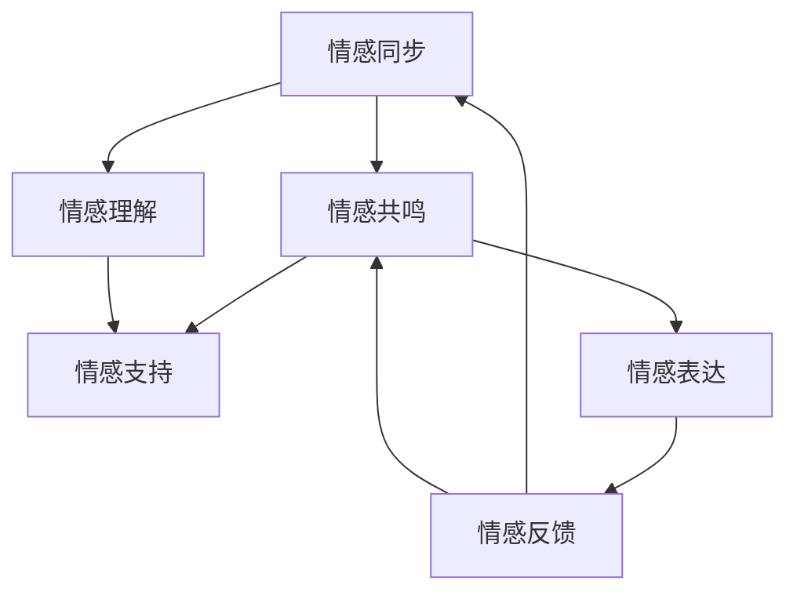
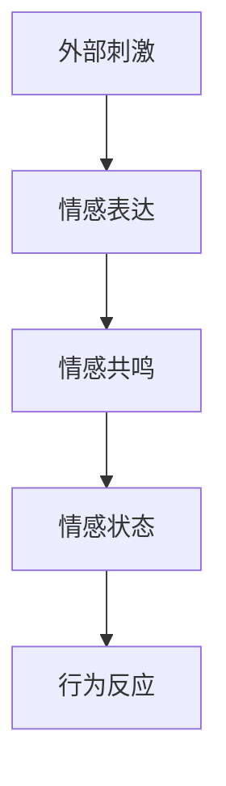
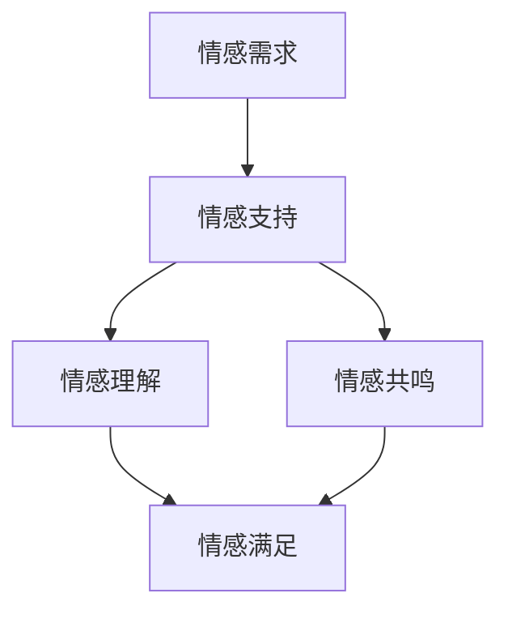
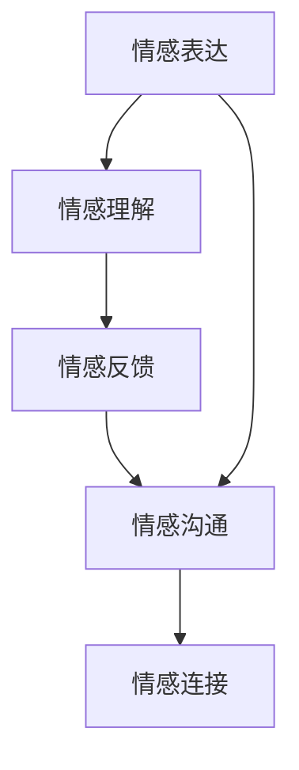
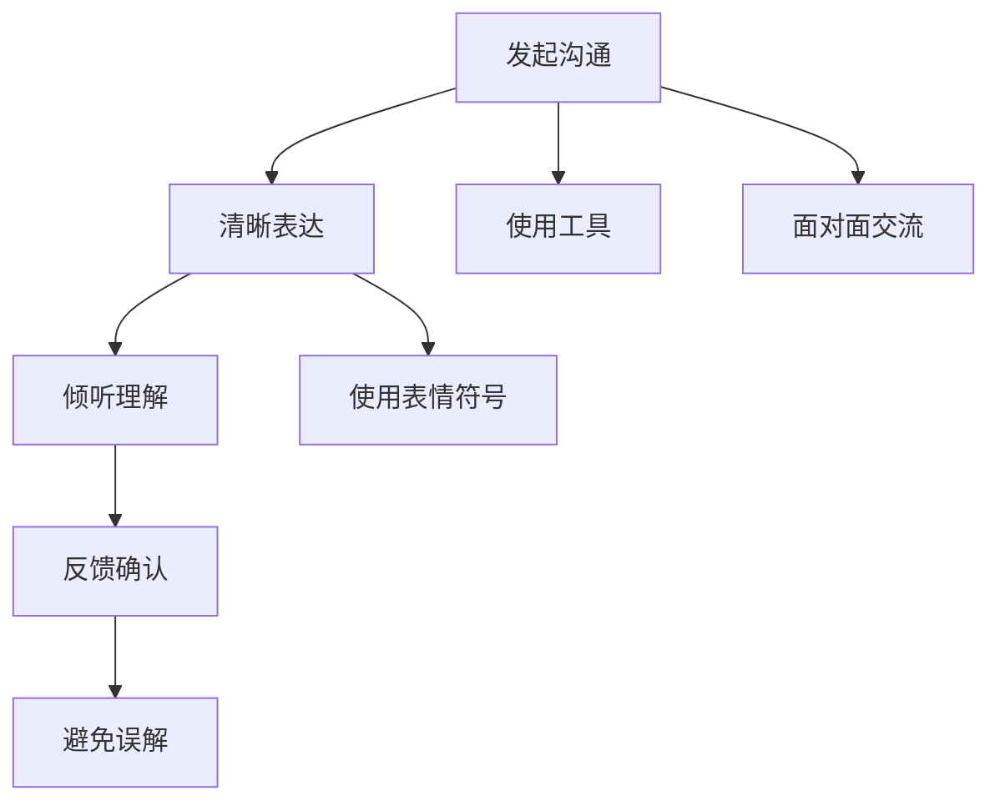
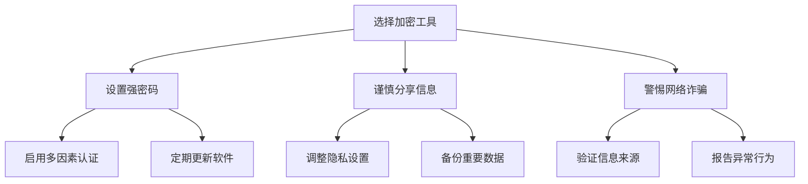

                 

# 《重新定义亲密关系：数字时代的情感连接》

## 关键词
- 数字时代
- 亲密关系
- 情感连接
- 数字技术
- 人际关系
- 沟通技巧

## 摘要
随着数字技术的迅猛发展，我们的生活方式和人际关系都发生了巨大变化。本文章旨在探讨数字时代下，如何通过重新定义亲密关系，增强数字时代的情感连接。文章首先介绍了数字时代与亲密关系的挑战，然后深入分析了情感连接的核心概念和理论。接着，探讨了数字时代的情感沟通技巧，以及如何使用技术工具来增强亲密关系。此外，文章还关注了数字时代的情感安全性与隐私保护。最后，通过案例研究和实践指导，为读者提供了具体的操作方法和策略。

### Step 1: 明确书的主要内容和目标

《重新定义亲密关系：数字时代的情感连接》这本书的主要内容和目标在于帮助读者理解数字时代下亲密关系的本质和挑战，并提供实用的策略和方法，以增强数字时代的情感连接。具体来说，书的主要内容包括以下几个方面：

1. **数字技术对人际关系的影响**：介绍数字技术的普及及其对人际关系的影响，包括正面和负面两个方面。
2. **情感连接的概念与理论**：阐述情感连接的定义、重要性以及相关的理论框架，帮助读者理解情感连接的核心要素。
3. **数字时代的情感沟通技巧**：分析情感沟通的基本原则，探讨数字时代情感沟通的特点和有效技巧。
4. **使用技术工具增强亲密关系**：介绍适合增强亲密关系的数字工具，包括使用方法、优势和局限性。
5. **数字时代的情感安全性与隐私保护**：讨论情感安全性的概念、数字时代隐私保护的挑战以及保护情感安全性和隐私的措施。
6. **案例研究与实践指导**：通过成功和失败的亲密关系案例，为读者提供实践指导，帮助读者更好地应用书中的理论和技巧。

### Step 2: 设计核心章节

为了实现书籍的目标，我们需要设计一系列核心章节，确保每个章节都有明确的主题和目标。以下是一个可能的章节设计：

#### 第1章：引言
- 数字时代与亲密关系的挑战
- 书籍的目标和结构概述

#### 第2章：数字技术对人际关系的影响
- 数字技术的普及和影响
- 数字技术如何改变人们的社交方式
- 数字技术的正面和负面影响

#### 第3章：情感连接的概念与理论
- 情感连接的定义和重要性
- 情感连接的理论框架
- 情感连接的核心要素

#### 第4章：数字时代的情感沟通技巧
- 情感沟通的基本原则
- 数字时代的情感沟通特点
- 增强情感沟通的有效技巧

#### 第5章：使用技术工具增强亲密关系
- 适合增强亲密关系的数字工具
- 技术工具的使用方法
- 技术工具的优势和局限性

#### 第6章：数字时代的情感安全性与隐私保护
- 情感安全性的概念和重要性
- 数字时代隐私保护的挑战
- 保护情感安全性和隐私的措施

#### 第7章：案例研究与实践指导
- 案例研究：成功和失败的亲密关系案例
- 实践指导：如何应用书中的理论和技巧
- 总结与反思

### Step 3: 编写详细的大纲内容

在确定了核心章节之后，我们需要为每个章节编写详细的大纲内容。以下是一个简化版的第1章和第2章的大纲内容示例：

#### 第1章：引言

# 第1章：引言

## 1.1 数字时代与亲密关系的挑战
### 1.1.1 数字时代的到来
- 数字技术的发展历程
- 数字技术对社会的深远影响

### 1.1.2 亲密关系的重要性
- 亲密关系的定义
- 亲密关系对个体和社会的意义

### 1.1.3 数字时代亲密关系的挑战
- 数字技术对亲密关系的改变
- 数字时代亲密关系的困境

## 1.2 书籍的目标和结构概述
### 1.2.1 书籍的目标
- 探讨数字时代下亲密关系的现状和挑战
- 提供实用的策略和方法，以增强数字时代的亲密关系

### 1.2.2 书籍的结构概述
- 核心章节介绍
- 案例研究
- 实践指导

#### 第2章：数字技术对人际关系的影响

# 第2章：数字技术对人际关系的影响

## 2.1 数字技术的普及和影响
### 2.1.1 数字技术的普及
- 数字技术的普及历程
- 数字技术的全球分布

### 2.1.2 数字技术如何改变人们的社交方式
- 数字技术如何改变人们的社交方式
- 数字技术对人际关系的影响

### 2.1.3 数字技术的正面和负面影响
- 数字技术的积极影响
- 数字技术的负面影响

### Step 4: 检查大纲完整性和逻辑性

最后，我们需要检查大纲的完整性和逻辑性，确保每个章节的内容都符合书籍的主题，并且章节之间有清晰的逻辑关系。如果需要，我们可能需要对大纲进行调整，以确保其清晰和完整。

- 根据上述步骤，我们可以得到以下目录大纲：

## 《重新定义亲密关系：数字时代的情感连接》目录大纲

### 第1章：引言
#### 1.1 数字时代与亲密关系的挑战
##### 1.1.1 数字时代的到来
##### 1.1.2 亲密关系的重要性
##### 1.1.3 数字时代亲密关系的挑战
#### 1.2 书籍的目标和结构概述
##### 1.2.1 书籍的目标
##### 1.2.2 书籍的结构概述

### 第2章：数字技术对人际关系的影响
#### 2.1 数字技术的普及和影响
##### 2.1.1 数字技术的普及
##### 2.1.2 数字技术如何改变人们的社交方式
##### 2.1.3 数字技术的正面和负面影响

### 第3章：情感连接的概念与理论
#### 3.1 情感连接的定义和重要性
##### 3.1.1 情感连接的定义
##### 3.1.2 情感连接的重要性
#### 3.2 情感连接的理论框架
##### 3.2.1 相关理论介绍
##### 3.2.2 情感连接的核心要素
#### 3.3 情感连接的模型与架构
##### 3.3.1 Mermaid流程图：情感连接模型
##### 3.3.2 模型解析与应用

### 第4章：数字时代的情感沟通技巧
#### 4.1 情感沟通的基本原则
##### 4.1.1 沟通的重要性
##### 4.1.2 情感沟通的基本原则
#### 4.2 数字时代的情感沟通特点
##### 4.2.1 数字沟通的特点
##### 4.2.2 数字沟通的挑战
#### 4.3 增强情感沟通的有效技巧
##### 4.3.1 技巧介绍
##### 4.3.2 技巧应用与实践

### 第5章：使用技术工具增强亲密关系
#### 5.1 适合增强亲密关系的数字工具
##### 5.1.1 工具介绍
##### 5.1.2 工具分类
#### 5.2 技术工具的使用方法
##### 5.2.1 使用指南
##### 5.2.2 实践案例
#### 5.3 技术工具的优势和局限性
##### 5.3.1 优势分析
##### 5.3.2 局限性探讨

### 第6章：数字时代的情感安全性与隐私保护
#### 6.1 情感安全性的概念和重要性
##### 6.1.1 情感安全性的定义
##### 6.1.2 情感安全性的重要性
#### 6.2 数字时代隐私保护的挑战
##### 6.2.1 隐私保护的挑战
##### 6.2.2 数字时代的隐私威胁
#### 6.3 保护情感安全性和隐私的措施
##### 6.3.1 防护措施介绍
##### 6.3.2 实践案例

### 第7章：案例研究与实践指导
#### 7.1 案例研究：成功和失败的亲密关系案例
##### 7.1.1 成功案例
##### 7.1.2 失败案例
#### 7.2 实践指导：如何应用书中的理论和技巧
##### 7.2.1 应用方法
##### 7.2.2 实践案例
#### 7.3 总结与反思
##### 7.3.1 主要观点总结
##### 7.3.2 未来展望与挑战

### 总结
本文通过逐步分析推理，详细介绍了《重新定义亲密关系：数字时代的情感连接》一书的核心内容和结构。文章首先明确了书籍的主要目标和内容，然后设计了核心章节，并编写了详细的大纲内容。在检查大纲的完整性和逻辑性后，得出了最终的目录大纲。接下来，我们将逐步深入探讨每个章节的核心内容，帮助读者更好地理解数字时代下亲密关系的本质和挑战，并掌握增强数字时代情感连接的实用技巧。 

**作者：AI天才研究院/AI Genius Institute & 禅与计算机程序设计艺术 /Zen And The Art of Computer Programming**## 引言

### 数字时代的来临与亲密关系的挑战

随着互联网、社交媒体和移动设备的迅猛发展，我们进入了数字时代。这个时代不仅改变了我们的生活方式，也对人际关系产生了深远的影响。数字技术的普及使得人们能够随时随地与他人保持联系，但同时也带来了新的挑战，特别是在亲密关系方面。

首先，数字时代的到来使得人们的社交方式发生了巨大变化。过去，人们主要通过面对面的交流和书信来建立和维持人际关系。而如今，社交媒体和即时通讯工具成为主要的沟通方式。这种变化带来了便利，但也带来了一些问题。例如，人们往往沉迷于数字世界，忽视了现实生活中的人际互动，导致亲密关系变得疏离。

其次，数字技术对亲密关系的挑战体现在多个方面。一方面，社交媒体上的虚幻世界容易让人产生误解和假象。人们可能会在社交媒体上展示自己理想化的生活，而忽略真实生活中的困难和挫折。这种虚假的形象可能导致亲密关系中的误解和冲突。另一方面，数字时代的沟通方式往往缺乏深度和真诚。文字和表情符号无法完全传达情感和语气，可能导致沟通不畅和情感隔阂。

此外，数字技术的普及还带来了隐私和安全的挑战。在数字世界中，个人隐私和数据安全变得尤为重要。亲密关系的泄露可能导致严重的心理和情感问题，甚至对个体的生活造成影响。

总之，数字时代为我们带来了便利，但同时也对亲密关系提出了新的挑战。为了应对这些挑战，我们需要重新思考亲密关系的本质，探索如何在数字时代中建立和维护真正的情感连接。这就是本书《重新定义亲密关系：数字时代的情感连接》的主要目标。通过深入探讨数字时代下亲密关系的挑战和解决方案，本书旨在帮助读者更好地理解和应对这些变化，建立更加健康和稳固的亲密关系。

### 书籍的目标和结构概述

本书的目标是深入探讨数字时代下亲密关系的挑战，并为此提供实用的策略和方法，帮助读者在数字世界中建立和维护真正的情感连接。为了实现这一目标，本书将分为七个核心章节，每个章节都聚焦于一个特定的主题，为读者提供全面的指导和启示。

**第一章：引言**  
本章将介绍数字时代的来临与亲密关系的挑战，为后续章节奠定基础。通过探讨数字技术对人际关系的影响，读者可以更好地理解数字时代下亲密关系的现状和困境。

**第二章：数字技术对人际关系的影响**  
本章将详细分析数字技术的普及和影响，包括其对社交方式、沟通模式和隐私保护的挑战。通过了解这些影响，读者可以更好地应对数字时代带来的变化。

**第三章：情感连接的概念与理论**  
本章将探讨情感连接的定义、重要性和理论框架。通过理解情感连接的核心要素，读者可以更好地把握亲密关系的本质。

**第四章：数字时代的情感沟通技巧**  
本章将介绍数字时代情感沟通的基本原则和技巧，帮助读者在数字世界中实现有效沟通，增强亲密关系。

**第五章：使用技术工具增强亲密关系**  
本章将介绍一系列适合增强亲密关系的数字工具，包括使用方法、优势和局限性。读者可以通过这些工具更好地维护和发展亲密关系。

**第六章：数字时代的情感安全性与隐私保护**  
本章将探讨数字时代情感安全性和隐私保护的重要性，以及如何保护个人隐私和情感安全。读者可以从中了解到如何在数字世界中保护自己和他人的情感。

**第七章：案例研究与实践指导**  
本章将通过案例研究和实践指导，为读者提供具体的操作方法和策略。通过学习和借鉴成功和失败的案例，读者可以更好地应用书中的理论和技巧。

通过以上七个章节的深入探讨，本书旨在帮助读者重新定义亲密关系，掌握在数字时代中建立和维护情感连接的实用方法。无论您是情侣、家庭还是朋友，这本书都将为您提供有价值的指导和启示。

### 数字技术对人际关系的影响

随着数字技术的迅猛发展，互联网、社交媒体和移动设备的普及已经深刻地改变了我们的生活方式。这些技术不仅提供了便捷的沟通渠道，也带来了前所未有的社交体验。然而，数字技术的普及对人际关系产生了广泛而深远的影响，既有积极的方面，也有消极的方面。

首先，数字技术的普及极大地便利了人们的沟通和社交。在过去，人们往往受到地理和时间的限制，只能通过面对面的交流或书信来保持联系。而现在，电子邮件、即时通讯工具、社交媒体和视频通话等数字技术使得人们可以随时随地与他人沟通。这种便利性不仅缩短了人与人之间的距离，也打破了传统社交的障碍。例如，人们可以通过社交媒体平台关注远在他乡的亲友，分享生活点滴，保持亲密关系。

其次，数字技术改变了人们的社交方式。在数字时代，人们更多地依赖于虚拟的社交网络来进行互动。这种虚拟社交具有即时性、广泛性和匿名性的特点，使得人们可以快速地建立和切断社交联系。例如，社交媒体上的点赞、评论和私信等互动方式，使得社交行为变得更加轻松和频繁。然而，这种频繁的互动也带来了一些挑战。人们在虚拟社交中往往更加注重表面互动，而忽视了深层次的情感交流和沟通。这可能导致亲密关系中的情感隔阂和误解。

数字技术对亲密关系的负面影响也不容忽视。首先，过度依赖数字技术可能导致现实生活中的社交互动减少。许多人沉迷于虚拟世界，花费大量时间在社交媒体和游戏中，而忽视了与家人和朋友的面对面交流。这种现象被称为“屏幕依赖”或“数字沉迷”，它可能导致亲密关系的疏远和破裂。其次，数字技术可能放大亲密关系中的不信任和猜疑。在社交媒体上，人们可能会看到对方展示的理想化生活，而忽略了现实生活中的问题和困难。这种对比可能导致嫉妒和不满，影响亲密关系的稳定性。

此外，数字技术还带来了隐私和安全方面的挑战。在数字时代，个人隐私和数据安全变得尤为重要。然而，许多人在使用社交媒体和即时通讯工具时，往往忽视了隐私保护。个人信息和私密对话可能被未经授权的人获取，导致情感泄露和心理创伤。

总的来说，数字技术对人际关系的影响是复杂的。它既带来了便利和机会，也带来了挑战和风险。为了在数字时代中建立和维护健康的亲密关系，我们需要认识到这些影响，并采取适当的措施来应对。以下章节将详细探讨数字技术如何改变人们的社交方式，以及如何应对数字时代带来的挑战。通过深入分析，我们将为读者提供实用的策略和方法，以帮助他们在数字时代中建立和维护真正的情感连接。

### 数字技术如何改变人们的社交方式

数字技术的发展极大地改变了人们的社交方式，从沟通频率到社交深度，再到社交结构，都发生了显著的变化。以下是对这些变化的详细分析：

#### 沟通频率

首先，数字技术极大地提高了人们的沟通频率。在过去，人们通常只能通过书信或电话与远方的亲友保持联系，这些方式不仅耗时，而且沟通内容有限。然而，随着电子邮件、即时通讯工具和社交媒体的出现，人们可以随时随地进行即时通讯。例如，WhatsApp、微信、Telegram等应用允许用户发送文字、图片、语音和视频，使得沟通变得更加便捷和频繁。这种即时性的沟通方式不仅缩短了人与人之间的距离，也增加了日常互动的频率。

#### 社交深度

尽管数字技术提高了沟通频率，但它在社交深度方面的影响却是双刃剑。一方面，数字沟通有助于加深已有关系的深度。通过社交媒体和即时通讯，人们可以分享生活中的点点滴滴，从而增进了解和情感连接。例如，情侣或夫妻可以通过视频通话和社交媒体分享日常生活中的快乐和挑战，从而增强彼此的情感联系。另一方面，数字沟通往往缺乏面对面交流中的情感表达和细微情感传递，这可能导致社交深度的不足。在文字和表情符号的交流中，情感表达可能显得苍白无力，难以传达真实的情感和感受。

#### 社交结构

数字技术还改变了人们的社交结构。传统社交结构通常是基于地理和现实生活中的关系网络，而数字技术则创造了一种全新的虚拟社交结构。在虚拟社交网络中，人们可以通过兴趣、爱好和职业等共同点建立联系，形成多样化的社交圈子。例如，社交媒体平台如Facebook、LinkedIn等，允许用户根据兴趣或工作领域加入不同的群组和社区，从而拓展社交网络。这种虚拟社交结构不仅扩大了人们的社交范围，也为建立新的社交关系提供了更多机会。

然而，虚拟社交结构也带来了一些问题。由于虚拟社交网络的松散性和匿名性，人们可能更加容易建立和切断社交联系。这种“一键式”的社交切断可能导致人际关系的短暂性和不稳定性，使得社交网络更加松散，缺乏深度和稳定性。

#### 社交参与度

数字技术还影响了人们的社交参与度。在传统社交方式中，人们需要投入时间和精力参与社交活动，如聚会、活动和节日庆祝等。而在数字时代，许多社交活动可以在线上进行，人们通过虚拟会议、社交媒体直播和在线活动参与社交。这种改变使得社交活动更加灵活和便捷，但也可能导致人们在现实生活中的社交参与度下降。有些人可能会过于依赖数字平台进行社交，忽视了现实生活中的人际互动，这可能导致亲密关系的疏离。

#### 社交行为的多样性

数字技术还促进了社交行为的多样性。过去，人们的社交行为主要限于面对面的互动和书信交流。而现在，数字技术使得多种形式的社交行为成为可能。例如，游戏、直播、短视频和社交媒体互动等，为人们提供了丰富的社交体验。这种多样性不仅增加了社交的乐趣，也为不同类型的社交互动提供了平台。

#### 社交时间和空间的灵活性

最后，数字技术赋予了社交时间和空间的灵活性。在数字时代，人们可以随时随地通过移动设备进行社交互动。这种灵活性不仅打破了时间和空间的限制，还使得社交活动更加灵活。例如，人们可以在上班途中、等候时间或深夜进行社交互动，这种灵活性为人们的社交生活带来了更多可能性。

总的来说，数字技术对人们的社交方式产生了深远的影响。它提高了沟通频率，改变了社交深度，重构了社交结构，影响了社交参与度，促进了社交行为的多样性，并赋予了社交时间和空间的灵活性。然而，这些变化也带来了一些挑战，如社交深度不足、社交网络不稳定性、现实社交参与度下降等。为了在数字时代中建立和维护健康的亲密关系，我们需要认识到这些影响，并采取适当的措施来应对。以下章节将进一步探讨如何在数字时代中增强亲密关系，以及如何应对这些挑战。

### 数字技术的积极影响

尽管数字技术对亲密关系带来了一些挑战，但它在许多方面也产生了积极的影响，为人们的生活带来了诸多便利和改进。以下是数字技术在促进人际关系和亲密关系方面的几种积极影响：

#### 提高沟通效率

首先，数字技术显著提高了沟通效率。通过电子邮件、即时通讯工具和社交媒体，人们可以快速发送信息和进行实时交流，无需受到地理位置和时间的限制。这种即时性的沟通方式不仅缩短了信息传递的时间，还减少了因距离而产生的沟通延迟。例如，身处不同城市的恋人可以通过视频通话每天见面，分享生活中的点滴，从而增强情感连接。

#### 突破地理限制

其次，数字技术打破了地理限制，使得人们可以与远方的亲友保持联系。在以前，长时间异地意味着与亲友的联系会变得稀少，甚至可能中断。然而，数字技术如视频通话、社交媒体和即时通讯工具使得人们可以随时与家人、朋友和同事保持联系。例如，家庭中的成员可以通过视频通话进行日常交流，分享生活中的喜怒哀乐，从而保持亲密关系。

#### 促进信息共享

数字技术还促进了信息的共享和知识的传播。在数字时代，人们可以轻松地分享自己的经验和知识，通过博客、社交媒体和在线论坛与更多人交流。这种信息的共享不仅增进了人与人之间的了解，也为建立更深层次的亲密关系提供了基础。例如，同事之间可以通过共享工作日志和项目进展，更好地合作和理解对方的工作压力，从而增强团队关系。

#### 提供多样化社交机会

此外，数字技术为人们提供了多样化的社交机会。通过社交媒体和在线平台，人们可以根据兴趣、爱好和职业加入不同的社区和团体，结识新的朋友和伙伴。这种多样化的社交机会不仅扩大了人们的社交圈，还增加了结识志同道合人士的可能性，有助于建立和维护更多的亲密关系。例如，喜欢摄影的人可以加入摄影社群，分享作品、交流技巧，从而结识志同道合的朋友。

#### 增强社交灵活性

数字技术还增强了社交的灵活性。在过去，社交活动通常需要提前安排时间和地点，而数字技术使得社交活动更加灵活。人们可以通过社交媒体上的活动邀请、在线聚会和虚拟会议，随时随地参与社交活动。例如，朋友们可以通过社交媒体上的聚会邀请，安排一个线上聚会，即使身处不同的城市也能一起分享快乐时光。

#### 提升情感表达

最后，数字技术为情感表达提供了新的渠道。通过文字、图片、视频和音频等多种形式，人们可以更加丰富地表达情感。例如，通过视频通话，人们可以看到对方的眼神和表情，更加直观地感受到对方的情感。此外，社交媒体上的动态和评论也为人们提供了一个表达情感的平台，使得情感交流更加多样化和丰富。

总之，尽管数字技术对亲密关系带来了一些挑战，但它也在许多方面产生了积极的影响。通过提高沟通效率、突破地理限制、促进信息共享、提供多样化社交机会、增强社交灵活性和提升情感表达，数字技术为人们的生活带来了诸多便利和改进。在数字时代中，我们可以充分利用这些积极影响，建立和维护更加健康和稳固的亲密关系。

### 数字技术的负面影响

尽管数字技术为我们的社交和生活带来了诸多便利，但它也带来了不可忽视的负面影响，这些影响在某些情况下可能会对亲密关系产生严重的破坏性后果。

#### 增加情感疏离

首先，数字技术的过度使用可能导致情感疏离。在数字世界中，人们往往更容易沉迷于虚拟社交和娱乐，而忽视了现实生活中的人际互动。这种现象被称为“屏幕依赖”或“数字沉迷”。当人们沉迷于手机、电脑和社交媒体时，他们可能会忽视与家人和朋友的面对面交流，导致亲密关系中的情感疏离。例如，一对情侣中的一方可能会因为过度使用社交媒体而减少了对伴侣的关注和互动，从而影响彼此的情感连接。

#### 产生误解和猜疑

其次，数字技术可能导致沟通中的误解和猜疑。在文字和表情符号的交流中，情感和语气的传递往往不够准确，这可能导致误解和猜疑的产生。例如，在社交媒体上的简短评论或私信中，一句话的语气和情感可能被误解，导致争吵和冲突。此外，社交媒体上的信息可能被断章取义或被他人曲解，从而引发不必要的误会和矛盾。

#### 扩大现实与虚拟的差距

第三，数字技术可能扩大现实与虚拟之间的差距。在数字时代，人们往往可以在社交媒体上展示一个理想化的自我形象，而忽略现实生活中的困难和挑战。这种虚假的形象可能导致亲密关系中的不信任和猜疑。例如，一个在社交媒体上总是展示幸福生活的人，可能会让伴侣怀疑他们真实的生活状况，从而导致关系破裂。

#### 增加隐私泄露风险

此外，数字技术还带来了隐私泄露的风险。在数字世界中，个人信息和数据安全变得尤为重要。然而，许多人在使用社交媒体和即时通讯工具时，往往忽视了隐私保护。个人信息和私密对话可能被未经授权的人获取，导致情感泄露和心理创伤。例如，一些社交媒体上的隐私设置不当，可能导致用户个人信息被他人查看和利用，进而影响亲密关系的安全和信任。

#### 降低社交互动的质量

最后，数字技术可能降低社交互动的质量。尽管数字技术提供了便捷的沟通渠道，但它往往缺乏面对面交流中的情感表达和细微情感传递。这种缺乏深度和真诚的沟通可能导致亲密关系中的情感隔阂和疏离。例如，通过文字和表情符号进行的沟通往往无法充分表达情感和情绪，可能导致误解和不满，进而影响亲密关系的稳定性。

综上所述，数字技术的负面影响不容忽视。它可能导致情感疏离、误解和猜疑、扩大现实与虚拟的差距、增加隐私泄露风险和降低社交互动的质量。为了在数字时代中建立和维护健康的亲密关系，我们需要认识到这些负面影响，并采取适当的措施来应对。以下章节将探讨如何应对数字技术的负面影响，以帮助读者在数字时代中维护和发展亲密关系。

### 情感连接的概念与理论

情感连接是人类关系中至关重要的组成部分，它不仅影响个体心理健康，还直接影响人际关系的质量和稳定性。在数字时代，理解情感连接的概念和理论对于我们建立和维护健康的亲密关系尤为重要。以下是对情感连接定义、重要性以及相关理论框架的详细探讨。

#### 情感连接的定义

情感连接是指个体之间通过情感互动和交流所建立的一种深刻且持久的关系。这种关系不仅包括情感上的共鸣和支持，还涉及信任、理解和共同体验。情感连接的本质在于情感上的亲密和信任，它使得个体在情感上感到安全、被理解和支持。

#### 情感连接的重要性

情感连接对个体和人际关系具有重要意义。首先，情感连接有助于满足个体的基本心理需求，如归属感、安全感和自尊。当个体在亲密关系中感受到情感连接时，他们更有可能感到幸福和满足。其次，情感连接有助于减轻压力和焦虑，促进心理健康。研究表明，情感连接较好的个体在面对压力和困难时，更能够保持积极的心态，并有效地应对挑战。最后，情感连接对人际关系的发展和稳定性至关重要。一个健康和稳固的亲密关系通常建立在深厚的情感连接基础上，它有助于增强关系中的信任和忠诚，减少冲突和误解。

#### 情感连接的理论框架

为了更好地理解情感连接，我们可以参考以下几种相关理论框架：

1. **情感同步理论（Emotional Synchrony Theory）**：
   该理论认为，情感连接是通过情感同步实现的。情感同步指的是个体在情感上相互协调，共同体验情感状态。当伴侣之间的情感同步较高时，他们更容易在情感上产生共鸣和相互理解，从而建立深厚的情感连接。

2. **情感共鸣理论（Emotional Contagion Theory）**：
   情感共鸣是指个体的情感状态受到他人情感表达的影响。该理论认为，情感连接是通过情感共鸣实现的。当一个人看到另一个人的情感表达时，他们可能会产生相似的情感反应，从而增强情感连接。

3. **情感支持理论（Emotional Support Theory）**：
   该理论强调情感支持在情感连接中的作用。情感支持包括情感上的理解、共鸣和帮助。当个体在亲密关系中感受到情感支持时，他们更有可能建立深厚的情感连接。

4. **情感沟通理论（Emotional Communication Theory）**：
   该理论认为，情感连接是通过有效的情感沟通实现的。情感沟通是指个体通过言语和非言语方式表达情感，以及理解和回应他人的情感表达。有效的情感沟通有助于建立情感上的亲密和理解，从而增强情感连接。

#### 情感连接的核心要素

要建立和维持健康的情感连接，需要关注以下几个核心要素：

1. **信任**：
   信任是情感连接的基础。信任意味着个体对伴侣的诚实和可靠性的信任。没有信任，情感连接难以建立和发展。

2. **共鸣**：
   共鸣是指个体在情感上能够相互理解和感受。共鸣使得个体在情感上更加接近，从而增强情感连接。

3. **支持**：
   情感支持是指个体在情感上对伴侣的理解和帮助。支持包括情感上的安慰、鼓励和共同面对困难。

4. **沟通**：
   沟通是情感连接的重要渠道。有效的沟通有助于个体表达情感、理解对方，并解决潜在的情感问题。

通过理解情感连接的概念和理论，我们可以更好地认识到它在亲密关系中的重要性。在数字时代，理解和维护情感连接尤为重要，它有助于我们应对数字技术带来的挑战，建立和维护健康的亲密关系。在接下来的章节中，我们将进一步探讨数字时代的情感沟通技巧，帮助读者在数字世界中增强情感连接。

### 情感连接的理论框架

为了更好地理解情感连接的概念和理论，我们可以借助一些相关的理论框架来构建一个全面的认识。以下是几个关键理论框架，以及如何通过Mermaid流程图来展示它们之间的联系和作用。

#### 1. 情感同步理论（Emotional Synchrony Theory）

**定义**：情感同步理论认为，情感连接是通过情感上的协调和共鸣实现的。当个体在情感上能够相互协调，共同体验情感状态时，情感连接就会增强。

**Mermaid流程图**：

**解析**：在这个框架中，情感同步（A）是核心，它通过情感共鸣（B）和情感理解（C）来实现。情感支持（D）和情感表达（E）是辅助过程，通过情感反馈（F）与情感同步和共鸣形成闭环，从而增强情感连接。

#### 2. 情感共鸣理论（Emotional Contagion Theory）

**定义**：情感共鸣理论认为，个体的情感状态会受到他人情感表达的影响，从而产生情感共鸣。

**Mermaid流程图**：

**解析**：在这个框架中，外部刺激（A）通过情感表达（B）引起情感共鸣（C），进而影响个体的情感状态（D）和行为反应（E）。情感共鸣是情感连接的重要机制。

#### 3. 情感支持理论（Emotional Support Theory）

**定义**：情感支持理论强调情感支持在情感连接中的作用，包括情感上的理解、共鸣和帮助。

**Mermaid流程图**：

**解析**：在这个框架中，情感需求（A）通过情感支持（B）得到满足，情感理解（C）和共鸣（D）进一步增强了情感满足（E），从而增强了情感连接。

#### 4. 情感沟通理论（Emotional Communication Theory）

**定义**：情感沟通理论认为，情感连接是通过有效的情感沟通实现的。这包括表达情感、理解对方情感，并解决潜在的情感问题。

**Mermaid流程图**：

**解析**：在这个框架中，情感表达（A）和情感理解（B）共同构成了情感沟通（D），通过情感反馈（C）实现情感连接（E）。情感沟通是建立和维护情感连接的关键途径。

通过这些理论框架和Mermaid流程图的展示，我们可以更清晰地理解情感连接的构成要素和它们之间的相互关系。在数字时代，理解这些理论和框架有助于我们更好地应对情感连接的挑战，并通过有效的情感沟通和互动，建立和维持健康的亲密关系。

### 数字时代的情感沟通技巧

在数字时代，情感沟通面临着前所未有的挑战和机遇。由于缺乏面对面交流中的视觉和听觉线索，数字沟通往往更容易出现误解和沟通障碍。为了在数字时代中有效沟通，我们需要掌握一系列特定的技巧和方法。以下是一些核心原则和技巧，帮助我们在数字世界中实现有效的情感沟通。

#### 1. 确保清晰明确

在数字沟通中，清晰明确是至关重要的。由于缺乏面部表情和语调的辅助，文字信息容易产生歧义。为了确保信息的清晰性，我们应该：

- **简明扼要**：避免冗长和复杂的句子，尽量使用简单、直接的语言。
- **明确意图**：在发送信息前，确保自己清楚想要表达的意思，并明确地传达给对方。
- **使用表情符号**：适当使用表情符号可以帮助传达情感，避免误解。

#### 2. 倾听和理解

有效的情感沟通不仅仅是表达自己的观点，更重要的是理解和回应对方的情感。以下是一些倾听和理解的关键技巧：

- **主动倾听**：在对方发言时，保持专注，避免打断，并尝试理解对方的情感和需求。
- **确认理解**：在回应时，用简洁的语言重复对方的核心观点，确保自己正确理解了对方的意思。
- **表达共鸣**：通过表达理解和支持，让对方感到被尊重和被关心。

#### 3. 避免误解和冲突

数字沟通中的误解和冲突是常见的。为了避免这些问题，我们可以采取以下措施：

- **保持冷静**：在情绪激动时，避免立即回应，给自己一些时间冷静下来。
- **避免夸张和批评**：避免使用夸张的言辞和批评性语言，这可能会激化矛盾。
- **使用肯定性语言**：使用肯定性语言表达观点，以减少对立情绪。

#### 4. 使用合适的技术工具

数字时代的情感沟通依赖于合适的技术工具。以下是一些常用的工具及其特点：

- **即时通讯应用**：如WhatsApp、微信和Telegram等，提供实时通讯功能，方便即时交流。
- **视频通话**：如Zoom、Skype和FaceTime等，可以模拟面对面交流，增强情感连接。
- **社交媒体**：如Facebook、Instagram和Twitter等，可以用于分享生活点滴，增强关系。

#### 5. 定期面对面交流

尽管数字工具提供了便利，但面对面交流仍然是建立深厚情感连接的最佳方式。为了确保关系的稳固，我们应该：

- **安排定期见面**：即使无法经常面对面交流，也应尽量安排定期的视频通话或实际见面。
- **共同活动**：通过共同参与活动，如在线游戏、视频观看和项目合作，增强互动和情感连接。

通过掌握这些情感沟通技巧，我们可以在数字时代中更有效地建立和维护亲密关系。以下是一个简化的情感沟通流程图，展示了这些技巧的应用：

通过上述步骤，我们可以更好地在数字时代中实现情感沟通，增强亲密关系。在接下来的章节中，我们将探讨如何使用技术工具来增强亲密关系，并提供实际案例和应用方法。

### 数字时代的情感沟通特点

在数字时代，情感沟通发生了显著的变化，这些变化不仅影响了我们的沟通方式，也带来了新的挑战和机遇。以下是对数字时代情感沟通特点的详细分析：

#### 1. 沟通形式的多样化

数字技术的普及使得情感沟通的形式更加多样化。传统的面对面交流和书信交流逐渐被电子邮件、即时通讯工具、社交媒体、视频通话等所取代。这些新形式的沟通不仅提供了更多的互动渠道，也改变了人们的社交行为模式。例如，社交媒体平台如Facebook、Instagram和Twitter等，使得人们可以随时随地分享生活点滴，从而增加了互动的频率和多样性。

#### 2. 即时性的增强

数字技术的一个重要特点是即时性。通过即时通讯工具，人们可以几乎实时地进行交流，这种即时性大大缩短了信息传递的时间。例如，WhatsApp、微信和Telegram等应用允许用户发送文字、图片、语音和视频，使得沟通变得更加便捷和快速。这种即时性的沟通方式不仅提高了沟通效率，也增加了沟通的频率。

#### 3. 缺乏非言语信息的传递

尽管数字技术提供了丰富的沟通形式，但它也带来了一些挑战。在数字沟通中，缺乏非言语信息的传递是一个显著问题。面部表情、语调和身体语言等非言语信息在面对面交流中起着重要作用，它们能够补充和解释言语信息，帮助我们更好地理解对方的情感和意图。然而，在数字沟通中，这些非言语信息往往缺失，导致沟通中的误解和误读。例如，一个简短的文字信息可能会被误解为冷漠或愤怒，而缺乏面部表情和语调的辅助，使得这种误解更加容易发生。

#### 4. 表面互动的增加

在数字时代，表面互动的增加也是一个显著特点。由于数字沟通往往缺乏深层次的情感交流和互动，人们更多地依赖于简短的、表面的互动来维持关系。例如，社交媒体上的点赞、评论和私信等，虽然增加了互动的频率，但往往缺乏深层次的情感交流。这种表面互动可能导致亲密关系中的情感隔阂和疏离，使得关系变得脆弱。

#### 5. 社交灵活性和多样性的提升

数字技术还提升了社交的灵活性和多样性。人们可以根据兴趣和需求加入不同的社交平台和社区，形成多样化的社交网络。这种灵活性不仅扩大了社交圈，也为建立新的社交关系提供了机会。例如，喜欢摄影的人可以加入摄影社群，与志同道合的人交流摄影技巧和作品，从而增强社交多样性和丰富性。

#### 6. 沟通频率的波动

数字时代中，沟通频率呈现出波动性。在某些时候，人们可能频繁地互动，而在其他时候，互动可能会减少。这种波动性可能与生活中的压力、时间和兴趣等因素有关。例如，当人们忙碌或压力大时，沟通频率可能会下降，而当他们放松或兴趣增加时，互动频率可能会提升。

#### 7. 通信质量的提升

尽管存在一些挑战，数字技术也带来了通信质量的提升。通过高清视频通话和高质量的音频传输，人们可以享受到更高质量的沟通体验。这种提升不仅增强了情感连接，也为远程工作和远程学习提供了更好的支持。

总之，数字时代的情感沟通具有多样化、即时性、缺乏非言语信息传递、表面互动增加、社交灵活性和多样性的提升、沟通频率波动以及通信质量的提升等特点。理解这些特点有助于我们更好地应对数字时代中的沟通挑战，并利用这些特点来增强亲密关系。在接下来的章节中，我们将探讨如何使用技术工具来增强亲密关系，并分享一些实用的技巧和方法。

### 使用技术工具增强亲密关系

在数字时代，技术工具为我们提供了多种方式来增强和维持亲密关系。以下是一些常见的工具，以及如何使用它们来提升亲密关系。

#### 1. 即时通讯应用

即时通讯应用如WhatsApp、微信和Telegram等，提供了实时通讯功能，使双方能够随时交流。以下是如何使用这些工具的建议：

- **设定特定时间**：为了确保有效沟通，可以设定固定的交流时间，例如每天晚上进行视频通话或语音聊天。
- **分享日常点滴**：通过发送图片、视频和语音消息，分享日常生活中的有趣瞬间，增强情感联系。
- **使用表情符号和表情包**：表情符号可以帮助传达情感和语气，减少误解。

#### 2. 视频通话

视频通话如Zoom、Skype和FaceTime等，可以模拟面对面交流，增强情感连接。以下是一些建议：

- **定期安排**：定期进行视频通话，保持日常互动，如早餐时间的问候或晚上休息前的聊天。
- **共同活动**：在视频通话中进行共同活动，如一起观看电影、玩游戏或做瑜伽，增加互动和乐趣。
- **关注细节**：注意视频通话时的背景和环境，确保环境整洁、光线适宜，提升沟通质量。

#### 3. 社交媒体平台

社交媒体平台如Facebook、Instagram和Twitter等，可以用于分享生活点滴，增强亲密感。以下是一些建议：

- **公开支持**：在社交媒体上公开表达对伴侣的支持和喜爱，例如点赞、评论和分享对方的帖子。
- **分享共同兴趣**：在社交媒体上分享彼此的兴趣爱好，如一起喜欢的电影、音乐或运动，增加共同话题。
- **制定分享计划**：定期制定分享计划，如每周发布关于彼此生活的更新，保持互动和关注。

#### 4. 情感追踪应用

情感追踪应用如Moodfit和Headspace等，可以帮助双方监测和管理情感状态。以下是一些建议：

- **定期检查**：鼓励伴侣使用情感追踪应用，定期检查彼此的情感状态，及时了解对方的情绪波动。
- **共同目标**：设置共同的情感目标，如改善睡眠质量或减轻压力，共同努力实现。
- **分享进展**：通过应用分享彼此的进展，提供支持和鼓励，增强亲密关系。

#### 5. 计划未来的活动

使用日历应用如Google Calendar和iCal等，可以共同计划未来的活动，增强期待感和亲密感。以下是一些建议：

- **共同制定计划**：一起制定假期计划、周末活动或长期旅行计划，增强双方的期待感。
- **分享计划**：在社交媒体或即时通讯应用中分享计划，增加互动和沟通。
- **提前准备**：提前做好活动准备，确保计划顺利进行，减少焦虑和压力。

通过使用这些技术工具，我们可以在数字时代中增强和维持亲密关系。关键在于找到适合双方的沟通方式，保持定期互动，分享日常点滴，共同管理情感状态，并计划未来的活动。这些措施将有助于在数字时代中建立和维护健康、稳固的亲密关系。

### 数字时代的情感安全性与隐私保护

在数字时代，情感安全性和隐私保护变得尤为重要。随着个人数据和隐私泄露事件的频发，人们越来越意识到在数字世界中保护情感和隐私的重要性。以下是对情感安全性概念、数字时代隐私保护挑战以及保护措施的分析。

#### 情感安全性的概念

情感安全性指的是在数字沟通和互动中，个体的情感状态和隐私得到有效保护，不受外部侵犯和干扰。它包括以下几个方面：

1. **情感隐私**：保护个人情感信息不被未经授权的第三方获取和利用。
2. **情感支持**：确保在数字互动中，个体的情感需求得到尊重和支持，避免情感伤害和剥削。
3. **情感信任**：建立和维护情感交流中的信任，避免因隐私泄露和情感欺骗而导致的信任破裂。

#### 数字时代隐私保护的挑战

1. **数据泄露风险**：随着社交媒体、即时通讯工具和其他数字平台的普及，个人数据存储在大量服务器上，面临数据泄露的风险。黑客攻击、数据窃取和网络钓鱼等手段可能导致个人情感信息被泄露。
2. **情感操控**：在数字平台上，个人可能会成为情感操控的目标，例如网络欺诈、网络诈骗和虚假情感告白等。这些行为不仅侵犯了个人隐私，还可能导致情感和心理伤害。
3. **隐私设置不当**：许多人在使用社交媒体和即时通讯工具时，隐私设置不当，导致个人信息和私密对话容易被他人访问和利用。这种隐私泄露可能对情感安全构成威胁。
4. **社交网络陷阱**：在数字社交网络中，个人可能会受到虚假信息和误导性内容的侵扰，这些信息可能影响情感判断和行为，导致关系破裂或情感困扰。

#### 保护情感安全性和隐私的措施

1. **加强隐私设置**：确保社交媒体和即时通讯工具的隐私设置适当，限制对个人信息的访问。例如，限制谁可以看到你的动态、私信和好友列表等。
2. **使用强密码和双因素认证**：使用复杂的密码，并启用双因素认证，增加账户的安全性，防止未经授权的访问。
3. **定期更新软件和设备**：保持操作系统、应用程序和设备的安全更新，以防范潜在的安全漏洞。
4. **警惕网络欺诈**：提高警惕，避免在未经验证的平台上进行财务交易或分享敏感信息，避免成为网络欺诈的目标。
5. **情感支持与沟通**：在数字互动中，保持开放和诚实的沟通，尊重彼此的情感需求，避免使用虚假信息和情感操控手段。
6. **备份重要数据**：定期备份重要数据和文件，以防止数据丢失或泄露对情感安全造成影响。

通过采取上述措施，我们可以在数字时代中更好地保护情感安全性和隐私，建立和维护健康的亲密关系。在接下来的章节中，我们将通过案例研究，探讨如何在实践中应用这些理论和策略。

### 数字时代的情感安全性与隐私保护的挑战

在数字时代，情感安全性和隐私保护面临着诸多挑战。首先，数据泄露风险是一个主要问题。随着个人信息的数字化存储，黑客和网络犯罪分子利用技术手段非法获取和利用这些信息。例如，社交媒体上的用户数据、即时通讯工具中的聊天记录、电子邮件等，都可能成为黑客攻击的目标。一旦这些数据被窃取，个人的情感隐私将受到严重威胁，可能导致心理创伤和情感困扰。

其次，情感操控也是数字时代的一大挑战。在虚拟社交平台上，一些人可能会利用虚假身份或虚假信息，进行情感欺骗和操控。例如，网络诈骗者可能会冒充亲密关系中的伴侣，骗取信任，进而获取经济利益或个人隐私。此外，虚假的情感告白和甜言蜜语也可能对个体的情感安全构成威胁，使得他们在情感上受到操控和伤害。

隐私设置不当是另一个显著问题。许多人在使用社交媒体和即时通讯工具时，没有正确设置隐私选项，导致个人信息和私密对话容易被他人访问。例如，未设置隐私权限的社交媒体账号可能使个人信息对所有人可见，甚至包括潜在的不法分子。这种隐私泄露不仅威胁到个人的情感安全，也可能导致隐私泄露事件带来的连锁反应，如身份盗窃、网络诈骗等。

社交网络陷阱也是数字时代隐私保护的一大挑战。在复杂的网络环境中，个人可能难以分辨信息的真实性和可靠性。虚假信息和误导性内容可能在社交网络中传播，影响个体的情感判断和行为。例如，一些虚假的社交媒体账号可能会发布令人怀疑的内容，诱导用户点击链接或参与虚假活动，导致情感困扰和隐私泄露。

面对这些挑战，我们需要采取一系列措施来保护情感安全性和隐私。首先，提高网络安全意识至关重要。个人应定期学习网络安全知识，了解常见的安全威胁和防护措施，避免在网络上泄露敏感信息。其次，加强隐私设置，确保社交媒体和即时通讯工具的隐私选项得到正确配置，限制对个人信息的访问。此外，保持警惕，对网络中的虚假信息和可疑行为保持怀疑态度，避免陷入情感操控和社交网络陷阱。

总之，数字时代的情感安全性和隐私保护面临多重挑战，但通过提高意识、加强防护和保持警惕，我们可以有效应对这些挑战，保护自己的情感安全和隐私。在接下来的章节中，我们将探讨具体的保护措施和实际案例，帮助读者在数字时代中更好地维护亲密关系。

### 数字时代的情感安全性与隐私保护的具体措施

在数字时代，保护情感安全性和隐私至关重要。以下是一些具体的措施，帮助我们在使用数字工具和平台上时，有效保护自己的情感和隐私：

#### 1. 加密通讯工具

使用加密通讯工具是保护隐私和安全的基础。例如，使用端到端加密的即时通讯应用，如Signal和WhatsApp的加密模式，可以确保信息在传输过程中不会被第三方截获或读取。以下是如何使用这些工具的建议：

- **选择合适的应用**：选择支持端到端加密的通讯应用，确保消息安全。
- **正确设置**：确保通讯应用中的加密功能已启用，并定期更新应用以获得最新的安全功能。
- **备份密钥**：备份通讯应用的加密密钥，以防丢失或设备损坏。

#### 2. 谨慎分享个人信息

在数字平台上，我们需要谨慎分享个人信息，特别是敏感信息。以下是一些建议：

- **限制可见性**：在社交媒体上，限制谁可以看到你的个人资料、动态和私信。
- **不要透露敏感信息**：避免在社交媒体或即时通讯工具中透露姓名、地址、电话号码等敏感信息。
- **隐私设置**：定期检查和调整社交媒体平台的隐私设置，确保个人信息不被不必要的第三方访问。

#### 3. 警惕网络诈骗和信息操纵

在数字时代，网络诈骗和信息操纵是常见的威胁。以下是一些防范措施：

- **识别诈骗信号**：警惕任何要求财务信息、密码或其他敏感信息的请求。
- **验证信息来源**：在分享信息或点击链接之前，验证信息来源的可靠性，避免参与虚假信息传播。
- **报告异常行为**：如果发现任何可疑行为，立即报告给平台或相关机构。

#### 4. 使用强密码和多因素认证

使用强密码和多因素认证是保护账户安全的重要措施。以下是一些建议：

- **设置强密码**：使用包含字母、数字和特殊字符的复杂密码，并定期更改。
- **启用多因素认证**：在可能的情况下，启用多因素认证，如短信验证、应用验证等，增加账户安全性。
- **避免使用相同的密码**：为不同的账户设置不同的密码，以防止一旦一个账户被攻破，其他账户也受到影响。

#### 5. 定期更新软件和设备

保持软件和设备的更新是防范潜在安全漏洞的重要措施。以下是一些建议：

- **定期更新操作系统**：确保操作系统和应用程序定期更新，以修复已知的安全漏洞。
- **使用防病毒软件**：安装并定期更新防病毒软件，以保护设备免受恶意软件和病毒的侵害。
- **备份重要数据**：定期备份重要数据，以防设备损坏或数据丢失对情感安全造成影响。

通过采取这些具体措施，我们可以在数字时代中更好地保护情感安全性和隐私，确保在数字互动中保持安全和信任。以下是一个简化的保护流程图，展示了这些措施的应用：

通过这些措施，我们可以在数字时代中更好地保护自己的情感和隐私，建立和维护健康、安全的亲密关系。

### 数字时代的情感安全性与隐私保护的案例研究

为了更好地理解如何在数字时代中保护情感安全性和隐私，我们可以通过以下案例研究来探讨实际问题和解决方案。

#### 案例一：数据泄露导致情感伤害

**问题描述**：
李先生是一位年轻的上班族，他在一家知名社交媒体平台上拥有大量朋友。一天，他发现自己的账户被黑客入侵，个人信息如电话号码、地址和社交媒体账号等被泄露。这导致他收到了大量的垃圾短信和电话，严重干扰了他的日常生活。

**解决方案**：
1. **立即采取措施**：李先生立即更改了社交媒体账号的密码，并启用了多因素认证，防止黑客进一步攻击。
2. **通知平台**：他向社交媒体平台报告了数据泄露事件，平台协助他关闭了账户，并提供了账户安全建议。
3. **法律行动**：李先生咨询了律师，并考虑对黑客采取法律行动，以保护自己的权益。

**经验教训**：
- 在数字平台上，应立即采取措施应对数据泄露，以防止进一步的损失。
- 使用多因素认证和强密码是保护账户安全的基础。
- 了解法律途径，维护自身权益。

#### 案例二：网络诈骗引发情感困扰

**问题描述**：
王女士是一位退休老人，她在社交媒体上加入了一个健康养生群。一天，群内一位成员发了一条信息，称有一款特效药可以治愈多种疾病，并附上了详细的产品信息和购买链接。王女士被这条信息所吸引，并在未经验证的情况下购买了药品。

**解决方案**：
1. **验证信息来源**：王女士的子女发现了她的购买行为后，立即联系群内其他成员，发现这是一个骗局。
2. **报告诈骗**：王女士的子女立即向社交媒体平台和当地警方报告了这一诈骗事件。
3. **心理支持**：王女士在得知自己受骗后，情绪受到了很大影响，家人为她提供了心理支持。

**经验教训**：
- 在数字平台上，应谨慎对待未经验证的信息，避免受骗。
- 与家人和朋友保持沟通，及时分享和验证信息。
- 了解并报告诈骗行为，防止他人上当受骗。

#### 案例三：隐私设置不当引发隐私泄露

**问题描述**：
张先生是一位企业高管，他在社交媒体上拥有大量的商业联系人。由于工作需要，他经常分享公司的业务和财务数据。然而，他的隐私设置不当，导致一些敏感信息被不特定的人访问。

**解决方案**：
1. **调整隐私设置**：张先生立即检查并调整了社交媒体平台的隐私设置，确保敏感信息仅对特定联系人可见。
2. **数据备份**：他备份了所有重要数据，以防数据丢失或被篡改。
3. **法律咨询**：张先生咨询了律师，了解如何保护公司商业秘密和个人隐私。

**经验教训**：
- 定期检查和调整社交媒体平台的隐私设置，确保个人信息的安全。
- 对敏感信息进行备份，以防数据丢失或泄露。
- 了解相关法律法规，保护个人和公司的隐私权益。

通过这些案例，我们可以看到在数字时代保护情感安全性和隐私的重要性。采取正确的措施可以有效地减少风险，确保在数字互动中保持安全和信任。

### 实践指导：情感安全性与隐私保护的实用技巧

在数字时代，保护情感安全性和隐私需要我们采取一系列具体的实践措施。以下是一些实用的技巧，帮助我们在日常生活中更好地保护自己的情感和隐私：

#### 1. 设置复杂密码和定期更改

- **使用强密码**：确保密码包含字母、数字和特殊字符的组合，避免使用生日、姓名等容易被猜测的信息。
- **定期更改密码**：每隔一段时间（建议至少每三个月）更改一次密码，以降低密码被破解的风险。
- **避免使用相同密码**：为不同的账户设置不同的密码，防止一个账户被攻破后，其他账户也受到影响。

#### 2. 使用双因素认证

- **启用双因素认证**：在可能的情况下，为社交媒体、银行账户和其他重要账户启用双因素认证，增加账户的安全性。
- **备份认证工具**：确保备份双因素认证的备用工具，如手机应用或物理令牌，以防设备丢失或损坏。

#### 3. 谨慎分享个人信息

- **限制可见性**：在社交媒体上，限制谁可以看到你的个人资料、动态和私信，特别是敏感信息。
- **不透露敏感信息**：避免在社交媒体或即时通讯工具中透露姓名、地址、电话号码等敏感信息。
- **隐私设置**：定期检查和调整社交媒体平台的隐私设置，确保个人信息不被不必要的第三方访问。

#### 4. 保持警惕，防范网络诈骗

- **识别诈骗信号**：警惕任何要求财务信息、密码或其他敏感信息的请求，特别是来自不熟悉的人。
- **验证信息来源**：在分享信息或点击链接之前，验证信息来源的可靠性，避免参与虚假信息传播。
- **报告异常行为**：如果发现任何可疑行为，立即报告给平台或相关机构。

#### 5. 定期更新软件和设备

- **定期更新操作系统**：确保操作系统和应用程序定期更新，以修复已知的安全漏洞。
- **使用防病毒软件**：安装并定期更新防病毒软件，以保护设备免受恶意软件和病毒的侵害。
- **备份重要数据**：定期备份重要数据，以防设备损坏或数据丢失对情感安全造成影响。

#### 6. 使用加密通讯工具

- **选择加密通讯工具**：使用支持端到端加密的通讯应用，如Signal和WhatsApp的加密模式，确保信息在传输过程中不会被第三方截获或读取。
- **正确设置加密工具**：确保通讯应用中的加密功能已启用，并定期更新应用以获得最新的安全功能。

通过以上实践指导，我们可以在数字时代中更好地保护自己的情感和隐私，确保在数字互动中保持安全和信任。

### 总结

在数字时代，亲密关系的维护和情感连接的建立面临着前所未有的挑战和机遇。通过本文的探讨，我们深入了解了数字时代对人际关系的影响，以及如何应对这些影响。以下是对本文核心内容的总结：

1. **数字技术的普及**：数字技术的迅猛发展改变了我们的沟通方式，提高了沟通频率，但同时也带来了情感疏离和隐私保护挑战。

2. **情感连接的重要性**：情感连接是人际关系中的核心，它通过信任、共鸣、支持和沟通来实现。在数字时代，理解情感连接的概念和理论对于建立健康亲密关系至关重要。

3. **数字时代的情感沟通技巧**：为了在数字时代中实现有效沟通，我们需要掌握一系列沟通技巧，如确保信息清晰、倾听和理解、避免误解和冲突等。

4. **使用技术工具增强亲密关系**：通过使用即时通讯应用、视频通话、社交媒体等工具，我们可以在数字时代中增强亲密关系。然而，这些工具的使用也需要遵循一定的原则和策略。

5. **情感安全性与隐私保护**：在数字时代，保护情感安全性和隐私变得尤为重要。我们需要采取一系列措施，如设置复杂密码、使用双因素认证、谨慎分享个人信息等，以确保在数字互动中保持安全和信任。

6. **实践指导**：最后，通过具体的实践指导，我们为读者提供了实用的技巧和方法，帮助他们在日常生活中更好地保护情感和隐私。

总之，数字时代为亲密关系带来了新的挑战，但同时也提供了丰富的机遇。通过理解这些挑战并采取适当的措施，我们可以更好地维护和发展健康的亲密关系。在数字时代中，保持情感连接和情感安全是建立稳固亲密关系的关键。希望本文能够为读者提供有价值的启示和帮助。

### 拓展阅读

在探索数字时代的情感连接和隐私保护过程中，以下几本书籍和资源提供了深入的见解和实用的策略，有助于进一步了解和应对这些主题：

1. **《数字人类：我们在互联网时代的身份与情感》（"The Dawn of Digital Humans: Our Identity and Emotions in the Internet Age"）** - 作者：Sherry Turkle
   - 这本书探讨了互联网和数字技术如何影响我们的情感生活和身份认同，提供了对数字时代人际关系的新视角。

2. **《隐私不是隐私了：数字时代的隐私保护》（"Privacy Is Dead: The New Publicity"）** - 作者：Lior Leybovich
   - 本书深入探讨了数字时代隐私保护的重要性，提出了实用的隐私保护策略，帮助读者在数字世界中保护自己的隐私。

3. **《情感智能：如何建立和维持健康的人际关系》（"Emotional Intelligence: Why It Can Matter More Than IQ"）** - 作者：Daniel Goleman
   - 该书介绍了情感智能的概念和如何通过提升情感智能来建立和维护健康的人际关系。

4. **《数字关系：现代爱情的新规则》（"Digital Relationships: The New Rules"）** - 作者：Cristina Mora
   - 这本书探讨了现代数字关系的特点和挑战，提供了实用的建议，帮助读者在数字时代中建立和维持健康的亲密关系。

5. **《隐私权保护指南：如何在数字时代保护自己的隐私》（"Privacy Guide: How to Protect Your Privacy in the Digital Age"）** - 作者：Michael Fertik 和 Leslie Fishman
   - 这本书提供了详细的隐私保护指南，帮助读者了解如何保护个人隐私和数据安全。

6. **在线资源：数字伦理研究中心（Center for Digital Ethics and Policy）**
   - 数字伦理研究中心提供了一系列关于数字伦理和隐私保护的资源和研究，帮助读者深入了解数字时代的问题和挑战。

通过阅读这些书籍和访问相关资源，读者可以更全面地理解数字时代中的情感连接和隐私保护，并掌握更多的应对策略。这不仅有助于维护个人的情感安全，也为建立健康的人际关系提供了宝贵的指导。希望这些拓展阅读能够为您的进一步学习提供支持和启示。

