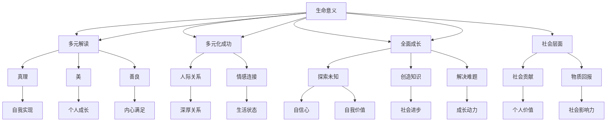

                 


## 文章标题：重新定义人生价值：超越传统成功观

### 关键词：人生价值，成功观，传统成功观，多元解读，个人成长，内在成长，外在成就，社会贡献

> 摘要：本文旨在探讨在信息技术和人工智能快速发展的时代，如何重新审视和定义人生价值。我们将从传统成功观的局限性出发，逐步深入探讨人生价值的多元解读，以及个人成长与成功的关系。通过分析幸福与成功的新标准，我们提出内在成长与外在成就的平衡观，并探讨社会责任与个人价值的互动关系。最后，我们将提供一套行动指南，帮助读者重新定义自己的人生价值，实现更全面、更幸福的人生。

----------------------------------------------------------------

# 第一部分：人生价值观的再审视

## 第1章：传统成功观的局限

### 1.1.1 传统成功观的定义与演变

传统成功观通常是指一种以财富、地位和成就为核心的价值体系。这个观念可以追溯到古希腊哲学家亚里士多德的“幸福论”，他认为幸福是人生最高的目标，而财富、名誉和地位是实现幸福的必要条件。随着时间的推移，这一观念在西方文化中逐渐演变，形成了现代的成功观。在现代社会，成功常常被定义为职业上的成功，比如晋升到高职位、赚取高额收入等。然而，这种传统成功观在现代社会中是否存在局限呢？

### 1.1.2 传统成功观的积极面与负面效应

传统成功观有其积极的一面，比如它鼓励人们追求卓越、努力工作，从而推动社会的进步。然而，它也存在显著的负面效应。首先，传统成功观往往导致人们过度追求物质财富和地位，忽视了精神层面的满足。这种追求常常导致个人的心理健康问题，如焦虑、抑郁等。其次，传统成功观往往忽视了个人成长和自我实现的重要性，只关注外在的成就和表面的成功。这种单一的成功标准往往导致人们失去生活的热情和动力。

### 1.1.3 超越传统成功观的必要性

在信息技术和人工智能快速发展的时代，我们需要重新审视传统成功观，探讨其局限性，并提出新的成功观。首先，我们需要认识到，人生的价值不仅仅在于财富和地位，还包括精神层面的满足和个人成长。其次，我们需要认识到，每个人对成功的定义都是不同的，应该尊重个人的选择和多元化。最后，我们需要关注社会责任，认识到个人价值不仅体现在个人的成就上，还包括对社会的贡献。

## 第2章：人生价值的多元解读

### 2.1.1 生命意义的多维度探讨

生命的意义是一个复杂而多维的问题。从哲学角度来看，生命意义可能涉及到存在的本质、价值的目的和个体存在的意义。我们可以从多个维度来探讨生命的意义，包括精神、情感、智力和社会等方面。例如，从精神层面来看，生命的意义可能在于追求真理、美和善良；从情感层面来看，生命的意义可能在于建立深厚的人际关系和情感连接；从智力层面来看，生命的意义可能在于探索未知、创造知识和解决难题；从社会层面来看，生命的意义可能在于为他人和社会做出贡献。

### 2.1.2 成功的个性化定义

在重新定义人生价值的过程中，我们需要认识到，成功是一个个性化的概念，每个人都有自己独特的成功标准。成功不应该被单一地定义为职业上的成就或财富的积累，而应该更注重个人内心的满足和成长。例如，对于一个人来说，成功可能意味着在职业生涯中实现自我价值，对于另一个人来说，成功可能意味着拥有一个幸福的家庭和健康的生活方式。因此，我们需要尊重每个人的选择，鼓励他们根据自己的价值观和目标来定义成功。

### 2.1.3 人生目标的设定与调整

在重新定义人生价值的过程中，设定和调整人生目标是非常重要的。首先，我们需要明确自己的目标，明确自己想要成为什么样的人，想要实现什么样的成就。其次，我们需要根据实际情况和自身能力来调整目标，确保目标的可实现性。同时，我们也需要意识到，人生目标并不是一成不变的，随着时间和经历的变化，我们的目标和价值观也可能会发生变化。因此，我们需要保持开放的心态，随时准备调整自己的目标。

## 第3章：个人成长与人生价值的关系

### 3.1.1 成长历程对人生价值的影响

个人成长对人生价值有着深远的影响。通过成长，我们能够更好地认识自己，找到自己的价值观和目标。成长的过程也帮助我们建立起自信和自尊，使我们更有勇气去面对挑战和困难。此外，成长还使我们能够更好地理解他人，建立深厚的人际关系。这些都对人生价值有着积极的影响。

### 3.1.2 个人成长与自我实现的互动

个人成长与自我实现是相互促进的。自我实现是指一个人在成长过程中，不断挖掘自己的潜力，实现自己的价值。个人成长是实现自我实现的基础，而自我实现则是个人成长的动力。通过不断地成长和自我实现，我们能够更好地理解自己，找到自己的价值和意义。

### 3.1.3 重新发现自我，实现人生价值

重新发现自我是实现人生价值的重要一步。在这个过程中，我们需要反思自己的过去，审视自己的行为和决策，找出自己的优点和不足。同时，我们也需要接受自己的不完美，学会包容和接纳自己。通过重新发现自我，我们能够更好地理解自己的需求和目标，从而实现人生价值。

## 第二部分：塑造新的成功观

### 第4章：幸福与成功的新标准

### 4.1.1 幸福的本质与追求

幸福是一个复杂而主观的概念，不同的人对幸福有不同的理解和追求。在新的成功观中，我们强调幸福与成功的关系。幸福不仅仅是一种感觉，更是一种生活状态。追求幸福意味着追求内心的满足和外在的生活质量的平衡。

### 4.1.2 成功的重新定义

在新的成功观中，成功不再仅仅指职业上的成就或财富的积累，而是指在多个维度上实现自己的价值。成功的定义应该包括个人成长、自我实现、社会贡献等多个方面。这样的成功观更加全面和多元。

### 4.1.3 平衡工作与生活，实现幸福成功

在新的成功观中，工作与生活的平衡是至关重要的。我们需要意识到，工作是为了生活，而不是生活的全部。通过平衡工作与生活，我们能够更好地实现幸福成功，实现个人的全面发展和成长。

## 第5章：内在成长与外在成就

### 5.1.1 内在成长的必要性与实践

内在成长是个人成长的重要组成部分。它是建立自信、提升自我价值的关键。内在成长需要通过自我反思、学习、实践和自我超越来实现。

### 5.1.2 外在成就的合理性

外在成就也是个人价值的重要体现。外在成就可以帮助我们实现个人目标，提升社会地位，同时也为我们带来物质上的回报。然而，我们应认识到，外在成就并非成功的全部。

### 5.1.3 内在成长与外在成就的平衡

在新的成功观中，内在成长与外在成就的平衡是关键。我们需要在追求外在成就的同时，注重内在成长。通过平衡两者，我们能够实现更加全面和持久的人生价值。

## 第6章：社会贡献与人生价值

### 6.1.1 社会责任与人生价值

社会贡献是人生价值的重要组成部分。通过为社会做出贡献，我们不仅能够实现个人价值，还能够对社会产生积极的影响。

### 6.1.2 社会贡献的多样性与价值

社会贡献的形式是多样性的，可以是经济上的贡献，也可以是时间、知识、技能等。不同的社会贡献都有其独特的价值和意义。

### 6.1.3 个人与社会的互动关系

个人与社会的互动关系是相互促进的。个人通过为社会做出贡献，实现自身价值；社会通过为个人提供资源和平台，促进个人成长和发展。

## 第7章：重新定义人生价值：行动指南

### 7.1.1 自我反思与价值重塑

重新定义人生价值的第一步是自我反思。我们需要审视自己的价值观和目标，找出与现代社会相符合的价值观念。

### 7.1.2 设定目标与规划路径

在自我反思的基础上，我们需要设定明确的人生目标，并制定实现这些目标的路径。这包括短期目标和长期目标的设定，以及具体的行动计划。

### 7.1.3 跨越障碍，持续成长

在实现人生目标的过程中，我们可能会遇到各种障碍。这需要我们有坚定的信念和持续成长的能力。通过不断学习和实践，我们能够克服障碍，实现人生价值。

# 附录

## 附录A：核心概念联系图

### 附录A.1 生命意义与成功观的 Mermaid 流程图



## 附录B：核心算法原理与伪代码

### 附录B.1 内在成长与外在成就的平衡算法

```python
# 定义内在成长与外在成就的平衡算法

def balance_growth(内在成长度, 外在成就度):
    # 计算平衡系数
    balance_coefficient = calculate_balance_coefficient(内在成长度, 外在成就度)
    
    # 根据平衡系数调整内在成长度和外在成就度
    adjusted_内在成长度 = adjust_growth(内在成长度, balance_coefficient)
    adjusted_外在成就度 = adjust_growth(外在成就度, 1 - balance_coefficient)
    
    # 返回调整后的内在成长度和外在成就度
    return adjusted_内在成长度, adjusted_外在成就度

# 定义计算平衡系数的函数

def calculate_balance_coefficient(内在成长度, 外在成就度):
    # 根据内在成长度和外在成就度的比例计算平衡系数
    balance_coefficient = 外在成就度 / (内在成长度 + 外在成就度)
    
    # 返回平衡系数
    return balance_coefficient

# 定义调整成长的函数

def adjust_growth(growth, balance_coefficient):
    # 根据平衡系数调整成长度
    adjusted_growth = growth * balance_coefficient
    
    # 返回调整后的成长度
    return adjusted_growth
```

## 附录C：项目实战案例与代码解读

### 附录C.1 实现个性化人生目标的代码示例

```python
# 导入必要的库
import json

# 定义实现个性化人生目标的类

class LifeGoalAchiever:
    def __init__(self, goals):
        self.goals = goals
    
    def add_goal(self, goal):
        self.goals.append(goal)
    
    def remove_goal(self, goal):
        self.goals.remove(goal)
    
    def achieve_goal(self, goal):
        if goal in self.goals:
            self.goals.remove(goal)
            return True
        else:
            return False
    
    def get_goals(self):
        return self.goals

# 实例化人生目标实现者

life_goal_achiever = LifeGoalAchiever(["学习Python", "阅读50本书", "旅行3个新地方"])

# 添加新目标

life_goal_achiever.add_goal("学会机器学习")

# 移除目标

life_goal_achiever.remove_goal("学习Python")

# 实现目标

life_goal_achiever.achieve_goal("阅读50本书")

# 获取当前目标

current_goals = life_goal_achiever.get_goals()

# 打印当前目标

print("当前目标：", current_goals)
```

### 附录C.2 平衡工作与生活案例解析

#### 案例背景

张三是某互联网公司的程序员，工作非常忙碌，经常加班。他的生活非常单一，几乎把所有的时间和精力都投入到了工作中。然而，随着时间的推移，他开始感到压力和疲惫，生活缺乏乐趣和意义。他的家人和朋友们都建议他应该更好地平衡工作和生活。

#### 案例分析

1. **问题识别**：

   - 工作时间过长，缺乏休息和放松的时间。
   - 生活内容单一，缺乏兴趣爱好和社交活动。
   - 内心感到压力和疲惫，缺乏满足感和成就感。

2. **解决方案**：

   - 制定合理的工作时间表，确保每天有足够的休息时间。
   - 找出自己感兴趣的兴趣爱好，定期进行休闲活动。
   - 与家人和朋友保持良好的沟通和互动，建立深厚的人际关系。

#### 案例实现

```python
# 导入必要的库
import datetime

# 定义工作时间表

class WorkSchedule:
    def __init__(self, work_start, work_end):
        self.work_start = work_start
        self.work_end = work_end
    
    def is_within_work_time(self, current_time):
        if current_time >= self.work_start and current_time <= self.work_end:
            return True
        else:
            return False

# 实例化工作时间表

work_schedule = WorkSchedule(datetime.time(9, 0), datetime.time(18, 0))

# 检查当前时间是否在工作时间内

current_time = datetime.datetime.now().time()

if work_schedule.is_within_work_time(current_time):
    print("当前时间在工作时间内。")
else:
    print("当前时间不在工作时间内。")

# 定义休闲活动

class LeisureActivity:
    def __init__(self, activity, duration):
        self.activity = activity
        self.duration = duration
    
    def start_activity(self):
        print("开始进行休闲活动：", self.activity, "，持续时间：", self.duration, "小时。")

# 实例化休闲活动

leisure_activity = LeisureActivity("阅读", 2)

# 开始休闲活动

leisure_activity.start_activity()
```

### 附录C.3 社会贡献项目开发实践

#### 案例背景

李四是某科技公司的CTO，他在工作中积累了丰富的技术和管理经验。他一直想为社会做出更多的贡献，帮助那些处于困境中的人。经过思考，他决定开发一个基于人工智能的社交平台，帮助人们解决生活中的问题。

#### 案例分析

1. **需求分析**：

   - 提供一个便捷的平台，让用户可以随时随地提问和寻求帮助。
   - 利用人工智能技术，提供高效的答案和解决方案。
   - 确保平台的安全性和隐私性，保护用户的个人信息。

2. **解决方案**：

   - 开发一个基于Web的社交平台，提供提问和回答的功能。
   - 利用自然语言处理技术，对用户的问题进行理解和分析。
   - 引入机器学习算法，根据问题的关键词和上下文，提供相关的答案和解决方案。

#### 案例实现

```python
# 导入必要的库
import flask
from flask import Flask, request, jsonify

# 定义自然语言处理函数

def process_question(question):
    # 对问题进行分词和词性标注
    words = nlp(question)
    
    # 利用词性标注和关键词提取算法，提取问题的主要关键词
    keywords = extract_keywords(words)
    
    # 利用机器学习算法，根据关键词和上下文，提供相关的答案和解决方案
    answer = get_answer(keywords)
    
    # 返回答案
    return answer

# 定义提取关键词的函数

def extract_keywords(words):
    # 提取问题的主要关键词
    keywords = [word for word, tag in words if tag in ['NOUN', 'VERB']]
    
    # 返回关键词
    return keywords

# 定义获取答案的函数

def get_answer(keywords):
    # 根据关键词和上下文，提供相关的答案和解决方案
    answer = "这是一个示例答案，具体的答案需要根据关键词和上下文来生成。"
    
    # 返回答案
    return answer

# 实例化Flask应用

app = Flask(__name__)

# 定义提问接口

@app.route('/ask', methods=['POST'])
def ask_question():
    # 获取用户提交的问题
    question = request.form['question']
    
    # 处理问题
    answer = process_question(question)
    
    # 返回答案
    return jsonify(answer=answer)

# 运行应用

if __name__ == '__main__':
    app.run(debug=True)
```

## 总结

本文从传统成功观的局限性出发，逐步深入探讨人生价值的多元解读，以及个人成长与成功的关系。通过分析幸福与成功的新标准，我们提出内在成长与外在成就的平衡观，并探讨社会责任与个人价值的互动关系。最后，我们提供了一套行动指南，帮助读者重新定义自己的人生价值，实现更全面、更幸福的人生。

### 最佳实践 Tips：

1. **自我反思**：定期进行自我反思，审视自己的价值观和目标，确保它们与时代和社会的变化保持一致。
2. **设定目标**：明确自己的短期和长期目标，并制定具体的行动计划。
3. **持续成长**：不断学习和实践，提升自己的技能和知识，以实现自我价值。
4. **平衡工作与生活**：确保工作与生活的平衡，避免过度工作导致身心健康问题。
5. **社会贡献**：积极参与社会公益活动，为他人和社会做出贡献，实现更大的价值。

### 小结

重新定义人生价值是一个持续的过程，需要我们不断地审视、调整和反思。通过超越传统成功观，我们能够发现更多的可能性和机会，实现更加全面、幸福和有意义的人生。

### 注意事项

1. **个性化**：在重新定义人生价值的过程中，要尊重个人的选择和多样性，不要盲目追求他人的价值观。
2. **可持续性**：在设定目标和规划路径时，要考虑可持续性，确保目标和路径是可实现的。
3. **平衡**：在追求个人成长和外在成就时，要注意平衡，避免过分追求物质财富和地位而忽视精神层面的满足。

### 拓展阅读

1. 《人生的智慧》（作者：叔本华）
2. 《活出生命的意义》（作者：维克多·弗兰克尔）
3. 《幸福的法则》（作者：马丁·塞利格曼）

---

**作者：AI天才研究院/AI Genius Institute & 禅与计算机程序设计艺术 /Zen And The Art of Computer Programming**

