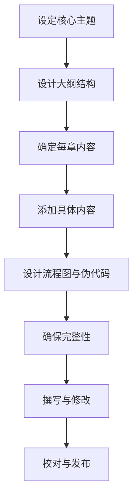
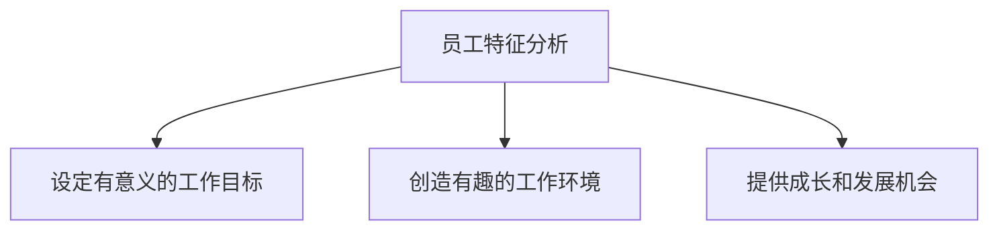

                 

### 引言：重新定义工作的意义

在现代社会，工作不仅是谋生的手段，更是个人价值实现和社会贡献的途径。然而，随着科技的发展和价值观的变迁，传统的工作观念逐渐显露出其局限性。越来越多的人开始反思，工作的意义究竟是什么？它是否仅限于追求薪水与地位？这种反思引发了一场关于工作意义的深刻讨论，也促使我们重新审视和定义工作的本质。

**工作环境的变化**

随着全球化的推进和科技的迅猛发展，工作环境发生了翻天覆地的变化。远程工作、弹性工作制、自动化技术等新兴工作形式不断涌现，传统的九到五工作模式逐渐变得不再适用。同时，人工智能和大数据等技术的普及，使得工作的性质和内容也发生了深刻的变化。这不仅挑战了我们的工作方式，也迫使我们重新思考工作的意义。

**工作意义的重要性**

工作不仅是生活的经济支撑，更是自我实现和社会参与的重要途径。一个有意义的工作不仅能带来物质回报，更能提升个人的幸福感和社会地位。工作意义的缺失可能导致职业倦怠、工作不满甚至心理问题。因此，重新定义工作的意义，对于个人的幸福和社会的发展都至关重要。

**重新定义工作的必要性**

传统的工作观念往往将工作与薪水、地位和稳定联系在一起。然而，这种观念在现代社会已经显得过于狭隘。重新定义工作意义，意味着我们不仅仅要关注物质回报，更要追求工作带来的精神满足和价值实现。这不仅有助于提升个人幸福感，也能推动社会向更加多元和包容的方向发展。

本文将分为以下几个部分来探讨重新定义工作的意义：

1. **重新定义工作意义的概念与理论基础**：我们将介绍工作意义的定义，理论基础，以及与传统工作观念的联系和区别。
2. **传统工作观念的批判与分析**：我们将分析传统工作观念的弊端，以及这些弊端如何导致工作意义的缺失。
3. **探索新的工作价值观**：我们将探讨新的工作价值观，如意义、乐趣、成长等，以及如何在工作中实践这些价值观。
4. **实践新的工作价值观**：我们将讨论如何在工作中实现自我价值，提升工作效率和生活质量。
5. **职业发展与个人成长**：我们将探讨职业发展与个人成长的路径和方法。
6. **社会与企业层面的工作意义**：我们将从社会和企业层面，探讨如何重新定义工作意义，以及这将对社会和企业产生哪些影响。
7. **未来工作的趋势与挑战**：我们将分析未来工作的趋势，以及这些趋势如何影响重新定义工作意义的实践。

通过这些讨论，我们希望读者能够对工作的意义有更深刻的认识，并在实践中重新定义和实现工作的价值。

## 文章关键词

重新定义工作意义、薪水与地位、职业发展、个人成长、工作价值观、自我价值实现、社会影响、未来工作趋势。

### 文章摘要

《重新定义工作的意义：beyond薪水与地位》旨在探讨如何超越传统的薪水与地位观念，重新定义工作的意义。文章首先介绍了当前工作环境的变化和重新定义工作意义的重要性。接着，分析了传统工作观念的弊端及其导致的工作意义缺失。随后，文章探讨了新的工作价值观，如意义、乐趣和成长，并探讨了如何在实践中实现这些价值观。文章还从职业发展与个人成长、社会与企业层面以及未来工作的趋势与挑战等多个角度，深入探讨了如何重新定义工作的意义。通过这些讨论，本文希望引导读者重新审视工作的本质，追求更丰富和有意义的工作生活。

### 1. 设定核心主题

重新定义工作的意义是一个复杂而深远的议题，它不仅涉及到个人价值观和职业目标的重新审视，也关系到社会和企业的长远发展。本书的核心主题在于探讨如何超越传统的薪水与地位观念，从更宽广的视角重新定义工作的意义。具体而言，本书将围绕以下几个方面展开讨论：

1. **工作意义的重新定义**：工作不仅仅是谋生的手段，更是实现个人价值、贡献社会的重要途径。本书将探讨工作意义的定义及其与传统工作观念的区别，帮助读者理解工作意义的重要性。

2. **新的工作价值观**：随着时代的发展，传统的薪水与地位观念已经无法完全满足现代人的需求。本书将介绍新的工作价值观，如意义、乐趣、成长等，并探讨如何将这些价值观融入日常工作中。

3. **实践中的工作意义**：理论上的探讨是重要的，但更关键的是如何在实践中实现工作的意义。本书将提供具体的策略和方法，帮助读者在职业发展中实现自我价值，提升工作效率和生活质量。

4. **社会和企业层面的工作意义**：社会和企业如何支持重新定义工作意义，是一个值得探讨的问题。本书将分析社会和企业如何从不同角度推动工作意义的重新定义，并探讨这种转变对社会和企业可能产生的积极影响。

5. **未来工作的趋势与挑战**：未来工作的形式和内容将如何变化？这些变化将对重新定义工作意义产生怎样的影响？本书将探讨未来工作的趋势，以及如何应对这些趋势带来的挑战。

通过上述讨论，本书旨在引导读者重新思考工作的本质，打破传统观念的束缚，追求更有意义、更丰富的工作生活。

### 2. 设计大纲结构

为了系统地探讨重新定义工作的意义，本书将采用以下大纲结构，分为七个主要章节：

**第1章：重新定义工作意义的概念与理论基础**
- **1.1 工作意义的定义**：介绍工作意义的定义及其重要性。
- **1.2 重新定义工作意义的理论基础**：讨论相关的理论框架，如马斯洛的需求层次理论、自我决定论等。
- **1.3 与传统工作观念的联系与区别**：分析重新定义工作意义与传统工作观念之间的异同点。

**第2章：传统工作观念的批判与分析**
- **2.1 传统工作观念的弊端**：讨论传统工作观念导致的问题，如过度竞争、缺乏意义感等。
- **2.2 工作意义缺失的案例研究**：通过具体案例展示工作意义缺失的负面影响。
- **2.3 对传统工作观念的批判**：深入剖析传统工作观念的局限性。

**第3章：探索新的工作价值观**
- **3.1 新的工作价值观**：介绍新的工作价值观，如意义、乐趣、成长等。
- **3.2 如何在工作中实践这些价值观**：讨论如何将新的工作价值观融入实际工作中。
- **3.3 实际案例分享**：分享一些成功实践新工作价值观的案例。

**第4章：实践新的工作价值观**
- **4.1 自我价值实现**：探讨如何在工作实践中实现自我价值。
- **4.2 提高工作效率**：提供策略和方法，帮助读者提高工作效率。
- **4.3 提升生活质量**：讨论如何通过工作提升个人的生活质量和幸福感。

**第5章：职业发展与个人成长**
- **5.1 职业规划**：介绍职业规划的步骤和方法。
- **5.2 个人成长的方法**：探讨如何通过学习和实践实现个人成长。
- **5.3 职业发展的案例分析**：分析一些成功的职业发展案例，提供借鉴和启示。

**第6章：社会与企业层面的工作意义**
- **6.1 社会支持与影响**：讨论社会如何支持重新定义工作意义。
- **6.2 企业如何定义工作意义**：分析企业如何定义工作意义，以及这种转变对企业文化的塑造。
- **6.3 企业支持工作意义变化的案例**：分享一些企业支持工作意义变化的成功案例。

**第7章：未来工作的趋势与挑战**
- **7.1 未来工作的趋势**：探讨未来工作的形式和内容可能发生的变化。
- **7.2 这些趋势对工作意义的影响**：分析未来工作趋势如何影响重新定义工作意义的实践。
- **7.3 如何应对这些挑战**：讨论如何应对未来工作带来的挑战，实现工作的重新定义。

通过上述结构，本书将系统地探讨重新定义工作的意义，帮助读者从多个维度理解和实践这一理念。

### 3. 确定每章内容

**第1章：重新定义工作意义的概念与理论基础**

**1.1 工作意义的定义**

在本节中，我们将介绍工作意义的定义，探讨其对个人和社会的重要性。工作意义不仅关乎物质回报，更涉及精神满足和价值实现。通过明确工作意义的定义，我们可以更好地理解重新定义工作的意义。

**1.2 重新定义工作意义的理论基础**

在接下来的部分，我们将探讨重新定义工作意义的理论基础。包括马斯洛的需求层次理论、自我决定论等，这些理论为我们重新审视工作意义提供了不同的视角。通过分析这些理论，我们可以更深入地理解重新定义工作意义的内涵。

**1.3 与传统工作观念的联系与区别**

在这一节，我们将讨论重新定义工作意义与传统工作观念的联系与区别。通过对比，我们将揭示传统工作观念的局限，并探讨重新定义工作意义如何帮助我们突破这些局限。这一部分的内容将为后续章节的探讨打下基础。

**第2章：传统工作观念的批判与分析**

**2.1 传统工作观念的弊端**

在本章的第一节，我们将批判传统工作观念的弊端。这些弊端可能包括过度竞争、缺乏意义感、工作与生活失衡等问题。通过具体案例分析，我们将展示这些问题如何影响工作意义。

**2.2 工作意义缺失的案例研究**

在这一节，我们将通过具体案例研究工作意义缺失的负面影响。这些案例将涵盖不同行业和不同层次的工作者，以展示工作意义缺失的广泛影响。通过这些案例，我们将进一步理解重新定义工作意义的重要性。

**2.3 对传统工作观念的批判**

在这一节，我们将深入剖析传统工作观念的局限性。通过批判传统观念，我们将揭示其无法适应现代社会需求的原因。这一部分的讨论将帮助我们明确重新定义工作意义的必要性。

**第3章：探索新的工作价值观**

**3.1 新的工作价值观**

在本章的第一节，我们将介绍新的工作价值观，如意义、乐趣、成长等。这些价值观不同于传统的薪水与地位观念，更注重工作带来的精神满足和个人价值的实现。

**3.2 如何在工作中实践这些价值观**

在这一节，我们将探讨如何在实际工作中实践新的工作价值观。通过具体策略和方法，我们将帮助读者将新的价值观融入日常工作中，实现工作的重新定义。

**3.3 实际案例分享**

在这一节，我们将分享一些成功实践新工作价值观的案例。这些案例将展示如何在不同的工作环境和行业中实现工作意义的转变。通过这些案例，我们将提供实际操作的启示。

**第4章：实践新的工作价值观**

**4.1 自我价值实现**

在本章的第一节，我们将探讨如何在工作中实现自我价值。通过自我认知和目标设定，我们将帮助读者找到适合自己的工作方向，实现个人价值的最大化。

**4.2 提高工作效率**

在这一节，我们将提供策略和方法，帮助读者提高工作效率。通过时间管理、任务优先级设定等工具，我们将帮助读者在有限的时间内实现更多的工作成果。

**4.3 提升生活质量**

在这一节，我们将讨论如何通过工作提升生活质量。通过平衡工作与生活、培养健康的生活习惯，我们将帮助读者在繁忙的工作中保持身心健康，享受更加充实的生活。

**第5章：职业发展与个人成长**

**5.1 职业规划**

在本章的第一节，我们将介绍职业规划的步骤和方法。通过自我评估、市场分析和目标设定，我们将帮助读者制定适合自己的职业发展计划。

**5.2 个人成长的方法**

在这一节，我们将探讨个人成长的方法。包括持续学习、技能提升、人际关系管理等，我们将提供一系列实用的建议和工具，帮助读者实现个人成长。

**5.3 职业发展的案例分析**

在这一节，我们将分析一些成功的职业发展案例。通过这些案例，我们将提供职业发展的借鉴和启示，帮助读者在职业道路上更加自信和坚定。

**第6章：社会与企业层面的工作意义**

**6.1 社会支持与影响**

在本章的第一节，我们将探讨社会如何支持重新定义工作意义。通过政策支持、教育培训、社会氛围等途径，社会可以推动工作意义的转变。

**6.2 企业如何定义工作意义**

在这一节，我们将分析企业如何定义工作意义。通过企业文化、管理策略、员工关怀等手段，企业可以塑造积极的工作氛围，促进工作意义的实现。

**6.3 企业支持工作意义变化的案例**

在这一节，我们将分享一些企业支持工作意义变化的成功案例。这些案例将展示企业在重新定义工作意义方面的创新和实践，提供参考和启示。

**第7章：未来工作的趋势与挑战**

**7.1 未来工作的趋势**

在本章的第一节，我们将探讨未来工作的趋势。包括技术进步、工作形式多样化、远程工作普及等，我们将分析这些趋势如何影响工作意义的重新定义。

**7.2 这些趋势对工作意义的影响**

在这一节，我们将讨论未来工作趋势对工作意义的影响。通过分析这些趋势，我们将揭示重新定义工作意义的重要性。

**7.3 如何应对这些挑战**

在这一节，我们将提供应对未来工作挑战的策略和方法。通过调整工作观念、提升技能、适应变化等手段，我们将帮助读者在未来的工作中实现自我价值的最大化。

通过上述详细的章节内容设计，本书将系统地探讨重新定义工作的意义，为读者提供全面的思考和行动指南。

### 4. 添加具体内容

**第1章：重新定义工作意义的概念与理论基础**

**1.1 工作意义的定义**

工作意义是指个体通过工作所获得的内在价值和满足感。这种价值不仅体现在物质回报上，更重要的是精神层面的满足和成就感。从心理学角度看，工作意义与个体的自我实现和心理健康密切相关。工作意义的定义决定了我们如何认识和评价工作，进而影响我们的工作态度和行为。

**1.2 重新定义工作意义的理论基础**

重新定义工作意义的理论基础包括马斯洛的需求层次理论、自我决定论等。马斯洛的需求层次理论将人的需求分为生理需求、安全需求、社交需求、尊重需求和自我实现需求。工作意义主要与尊重需求和自我实现需求相关，强调工作不仅是为了满足基本的生活需求，更是为了实现个人的价值和社会贡献。

自我决定论则强调个体的自主性、能力和关联性在工作中的重要性。根据自我决定论，个体在工作中需要感受到自主选择、技能发展和与他人建立联系的机会，从而实现工作意义的最大化。

**1.3 与传统工作观念的联系与区别**

传统工作观念通常将工作视为一种谋生的手段，强调薪水、地位和稳定。这种观念往往导致工作意义的缺失，使个体陷入单一的物质追求中。而重新定义工作意义则更加关注工作带来的内在价值和幸福感。这种转变不仅体现在对工作的认识和评价上，也反映在个体对工作的态度和行为上。

具体来说，传统工作观念注重外部评价和标准，如职位高低、薪水多少等；而重新定义工作意义则强调内在动机和自我实现，如工作带来的乐趣、成长和成就感。通过重新定义工作意义，个体可以更加全面地认识工作，实现个人价值，同时为社会做出贡献。

**第2章：传统工作观念的批判与分析**

**2.1 传统工作观念的弊端**

传统工作观念的弊端主要体现在以下几个方面：

1. 过度竞争：传统观念强调职位和薪水的竞争，导致工作环境充满压力和紧张。这种竞争不仅损害了员工的身心健康，也影响了团队合作和工作效率。

2. 缺乏意义感：传统工作观念往往将工作与薪水直接挂钩，忽视了工作本身的意义和价值。这导致员工在工作中感到乏味和不满，缺乏工作动力。

3. 工作与生活失衡：为了追求更高的薪水或职位，员工往往需要付出更多的时间和精力，导致工作和生活失衡。这种失衡不仅影响了工作效率，也影响了员工的幸福感和生活质量。

**2.2 工作意义缺失的案例研究**

以下是一些工作意义缺失的案例研究：

1. 某科技公司员工小明，每天重复着单调的工作任务，缺乏挑战和创新机会。长时间的工作让他感到疲惫和厌倦，工作效率也逐渐下降。

2. 某大厂项目经理小王，为了完成项目任务，长期加班熬夜，导致身体健康严重受损。尽管项目顺利完成，但他对工作的满意度极低，甚至产生了离职的想法。

3. 某中小型公司员工小张，由于公司经营不善，工资拖欠，工作环境恶劣。他每天在焦虑和不安中度过，对工作失去了信心和动力。

这些案例表明，工作意义的缺失对员工的心理健康和工作表现都有严重的影响。因此，重新定义工作意义，找到工作的新意义，是提升员工满意度和工作效率的关键。

**2.3 对传统工作观念的批判**

传统工作观念的局限性在于它忽视了工作对个体和集体的深远影响。以下是具体批判内容：

1. 单一目标导向：传统工作观念将物质回报和职位晋升视为唯一目标，忽视了工作带来的精神满足和社会价值。这种单一目标导向可能导致员工过度追求外在成就，忽视内在动机和自我实现。

2. 忽视个体差异：传统工作观念往往假设所有员工都有相同的工作动机和需求，忽视了个体差异。这种一刀切的管理方式不仅无法满足不同员工的需求，也可能导致员工的流失和团队的不稳定。

3. 忽视工作环境：传统工作观念侧重于工作任务和结果，忽视了工作环境的舒适度和人性化。一个不良的工作环境可能导致员工产生负面情绪，降低工作效率和满意度。

通过批判传统工作观念，我们认识到重新定义工作意义的必要性。只有通过重新审视工作意义，才能激发员工的内在动机，提升工作满意度和效率，实现个人价值和社会贡献。

**第3章：探索新的工作价值观**

**3.1 新的工作价值观**

新的工作价值观包括意义、乐趣、成长等。这些价值观不同于传统的薪水与地位观念，更加注重工作带来的内在价值和幸福感。

1. **意义**：工作意义是指个体通过工作所获得的内在价值和满足感。它不仅仅是物质回报，更是精神层面的满足和社会贡献。找到工作意义可以帮助个体明确自己的价值观和目标，提升工作满意度和幸福感。

2. **乐趣**：工作乐趣是指在工作中感受到的快乐和愉悦。一个有趣的工作环境可以激发员工的创造力，提高工作效率和团队协作。工作乐趣是提升工作满意度和工作质量的重要因素。

3. **成长**：工作成长是指通过工作不断学习和进步的过程。它包括技能提升、知识积累和职业发展。一个注重成长的工作环境可以激发员工的积极性和潜力，提升个人的职业素养和竞争力。

**3.2 如何在工作中实践这些价值观**

要实现新的工作价值观，需要从多个方面进行实践：

1. **设定工作目标**：明确自己的工作目标，将意义、乐趣和成长融入目标设定中。通过具体的目标和计划，确保这些价值观在工作实践中得到落实。

2. **创造有意义的工作环境**：管理层应重视工作环境的设计，为员工提供实现工作意义的机会。通过明确工作任务的重要性、赋予员工更多的自主权和责任感，可以提升工作意义。

3. **培养工作乐趣**：通过多样化的工作任务、团队合作和培训活动，营造一个充满乐趣的工作氛围。定期组织团建活动、庆祝团队成就，可以提升员工的归属感和工作乐趣。

4. **促进个人成长**：为员工提供学习和发展的机会，如培训课程、职业规划指导等。通过持续的学习和进步，员工可以在工作中实现个人成长，提升职业素养和竞争力。

**3.3 实际案例分享**

以下是一些成功实践新工作价值观的案例：

1. **某互联网公司**：该公司注重员工的个人发展和工作乐趣，定期组织技能培训和团建活动。员工在工作中有机会参与创新项目，感受到工作带来的成就感和乐趣。通过这些措施，公司的员工满意度和工作效率显著提升。

2. **某非营利组织**：该组织的使命是为社区提供帮助，员工在工作中感受到自己的工作对社会有实际贡献。通过明确的任务和目标，员工在工作中实现自我价值，工作满意度和社会影响力不断提升。

3. **某初创公司**：该公司注重员工的成长和自主性，为员工提供丰富的学习资源和项目机会。员工在工作中不断学习和进步，同时感受到公司对他们的信任和支持。这种工作环境激发了员工的创造力和工作热情，促进了公司的快速发展。

通过这些实际案例，我们可以看到，新工作价值观的实践不仅提升了员工的工作满意度和效率，也为企业的发展带来了积极的影响。

**第4章：实践新的工作价值观**

**4.1 自我价值实现**

自我价值实现是指个体通过工作感受到的内在价值和成就感。要实现自我价值，需要从以下几个方面进行实践：

1. **自我认知**：首先，个体需要明确自己的价值观和目标。通过自我反思和评估，了解自己的优势和潜力，明确自己的职业方向。

2. **目标设定**：设定具体、可实现的目标，将自我价值实现融入日常工作中。通过实现一个个小目标，逐步提升自我价值感。

3. **持续学习**：不断学习和提升自己的技能和知识，扩展自己的职业视野。通过学习，不仅可以提升个人竞争力，也可以在工作中实现更高的自我价值。

**4.2 提高工作效率**

工作效率是指个体在单位时间内完成工作任务的能力。提高工作效率需要采取以下策略：

1. **时间管理**：合理安排工作时间，避免拖延和浪费时间。通过制定每日工作计划和优先级列表，确保重要任务按时完成。

2. **任务分解**：将复杂任务分解为若干小任务，逐一完成。通过分解任务，可以降低工作的难度和压力，提高工作效率。

3. **工具和方法**：利用各种工具和方法，如项目管理软件、自动化工具等，提高工作效率。通过工具的合理使用，可以节省时间和精力，专注于核心任务。

**4.3 提升生活质量**

提升生活质量是指通过工作改善个人的生活状态和幸福感。以下是一些具体方法：

1. **工作与生活平衡**：合理安排工作和生活时间，确保工作与生活的平衡。通过设置工作时间，避免长时间工作，保证充足的休息和娱乐时间。

2. **健康生活方式**：保持良好的生活习惯，如规律的饮食、适量的运动和充足的睡眠。通过健康的生活方式，可以提高工作效率和免疫力，提升生活质量。

3. **兴趣爱好**：培养兴趣爱好，丰富业余生活。通过兴趣爱好，可以缓解工作压力，提升生活幸福感。

**第5章：职业发展与个人成长**

**5.1 职业规划**

职业规划是指个体根据自身情况和市场需求，制定的职业发展目标和行动计划。以下是一些职业规划的步骤和方法：

1. **自我评估**：评估自己的兴趣、价值观、能力和优势，明确自己的职业发展方向。

2. **市场分析**：了解市场需求和趋势，评估职业发展的机会和挑战。

3. **目标设定**：设定具体、可实现的目标，如职位晋升、技能提升等。

4. **行动计划**：制定具体的行动计划，包括学习、培训、实习等。

**5.2 个人成长的方法**

个人成长是指通过不断学习和实践，提升自己的能力和素质。以下是一些个人成长的方法：

1. **持续学习**：不断学习新知识和技能，扩展自己的职业视野。

2. **实践锻炼**：通过实际工作项目，锻炼自己的能力和经验。

3. **人际关系**：建立良好的人际关系，提升自己的沟通能力和团队协作能力。

4. **反思总结**：定期反思自己的工作表现和成长经历，总结经验教训。

**5.3 职业发展的案例分析**

以下是一些成功的职业发展案例：

1. **某技术专家**：通过持续学习和实践，不断提升自己的技能和知识。他在工作中表现出色，获得了多次晋升机会，最终成为公司的高级技术专家。

2. **某市场营销经理**：通过参加市场营销培训课程，提升了自己的营销知识和技巧。他成功领导了多个市场推广项目，为公司带来了显著的业绩增长。

3. **某初创公司创始人**：通过自学和实际操作，掌握了创业所需的各项技能。他在创业过程中不断学习和调整，最终成功创立了一家知名公司，成为行业领袖。

通过这些案例，我们可以看到，有效的职业规划和个人成长是实现职业发展的关键。只有通过持续的学习和实践，不断提升自己的能力和素质，才能在竞争激烈的职场中脱颖而出。

**第6章：社会与企业层面的工作意义**

**6.1 社会支持与影响**

社会支持重新定义工作意义，可以从以下几个方面进行：

1. **教育培训**：通过教育培训，提高公众对工作意义的认识和重视。教育体系应注重培养学生的工作态度和价值观，帮助他们找到适合自己的职业方向。

2. **政策支持**：政府可以通过制定相关政策，支持企业和个人重新定义工作意义。例如，鼓励企业提供灵活的工作制度、支持员工职业发展等。

3. **社会氛围**：营造积极的社会氛围，鼓励人们追求有意义的工作。通过媒体、社交平台等渠道，宣传和推广重新定义工作意义的理念和实践案例。

**6.2 企业如何定义工作意义**

企业定义工作意义，可以从以下几个方面进行：

1. **企业文化**：建立以价值观为核心的企业文化，明确企业对工作意义的理解。企业文化应鼓励员工追求个人成长和自我实现，提升工作满意度。

2. **管理策略**：通过科学的管理策略，支持员工实现工作意义。例如，提供职业发展机会、培养员工的自主性、建立反馈机制等。

3. **员工关怀**：关注员工的工作和生活，提供必要的支持和帮助。通过员工关怀，提高员工的幸福感和归属感，增强企业的凝聚力。

**6.3 企业支持工作意义变化的案例**

以下是一些企业支持工作意义变化的成功案例：

1. **某互联网公司**：该公司注重员工的职业发展，提供丰富的培训机会和职业晋升通道。员工在工作中感受到自己的价值和成长，工作满意度显著提升。

2. **某医疗企业**：该公司将企业使命与社会责任相结合，鼓励员工参与公益活动。员工在工作中感受到自己的工作对社会有实际贡献，工作意义感增强。

3. **某咨询公司**：该公司倡导灵活的工作制度，支持员工在工作和生活之间找到平衡。员工在工作中有更多的自主性，工作满意度和工作效率显著提升。

通过这些案例，我们可以看到，社会和企业对工作意义的重新定义和支持，不仅提升了员工的幸福感和工作效率，也为企业的长期发展奠定了基础。

**第7章：未来工作的趋势与挑战**

**7.1 未来工作的趋势**

未来工作的趋势将受到技术进步、经济变化和社会发展的影响，主要包括：

1. **技术进步**：人工智能、大数据、区块链等技术的普及，将改变工作内容和工作形式。自动化和智能化将逐渐取代重复性、低技能的工作，对高技能人才的需求将增加。

2. **工作形式多样化**：远程工作、弹性工作制和灵活就业将越来越普及，员工可以选择更灵活的工作时间和地点，提高工作效率和生活质量。

3. **职业发展多元化**：随着终身学习的理念普及，职业发展将不再局限于传统的线性路径，个体可以通过不断学习和技能提升，实现职业的多元化和跨界发展。

**7.2 这些趋势对工作意义的影响**

未来工作趋势将对工作意义产生深远影响：

1. **工作意义的多样化**：随着工作形式和内容的多样化，工作意义的内涵也将变得更加丰富。个体可以在多样化的工作中找到多种形式的满足感和成就感。

2. **工作价值的重新定义**：技术进步和职业多元化将促使人们重新审视工作价值的定义，不仅仅关注物质回报，更加注重工作的内在价值和幸福感。

3. **工作与生活的平衡**：随着工作形式的灵活化和远程工作的普及，个体将有更多机会实现工作与生活的平衡，提升生活质量和工作满意度。

**7.3 如何应对这些挑战**

为了应对未来工作的挑战，个体和企业可以从以下几个方面进行准备：

1. **提升技能和知识**：通过持续学习和技能提升，适应未来工作的需求，保持竞争力。

2. **调整工作态度**：保持开放的心态，积极应对变化，从变化中寻找新的工作意义和价值。

3. **建立支持系统**：社会和企业应建立支持系统，提供培训和指导，帮助个体应对职业发展的挑战。

通过这些措施，个体和企业可以更好地应对未来工作的趋势和挑战，实现工作的重新定义和价值的提升。

### 5. 设计流程图与伪代码

在撰写技术博客文章时，流程图和伪代码是帮助读者理解复杂概念和算法的有力工具。下面我们将结合本文的内容，设计几个相关的流程图和伪代码，以增强文章的可读性和理解性。

#### 伪代码：工作意义定义

```python
# 定义工作意义的伪代码

def define_work_meaning():
    # 输入：员工、工作、目标
    # 输出：工作意义

    work_value = get_employee_values(employee)
    job_role = get_job_role(employee, job)
    goals = get_goals(employee, job)

    meaning = calculate_meaning(work_value, job_role, goals)
    return meaning

# 辅助函数
def get_employee_values(employee):
    # 返回员工价值观
    pass

def get_job_role(employee, job):
    # 返回员工在岗位上的角色
    pass

def get_goals(employee, job):
    # 返回员工的目标
    pass

def calculate_meaning(work_value, job_role, goals):
    # 计算工作意义
    pass
```

#### Mermaid流程图：重新定义工作意义的过程



上述伪代码展示了如何通过一个函数来定义工作意义，包含了获取员工价值观、岗位角色和目标的辅助函数，以及计算工作意义的主体函数。Mermaid流程图则展示了重新定义工作意义的过程，从核心主题的设定到最终文章的撰写与发布，每个步骤的流转和逻辑关系。

#### 伪代码：工作价值实现策略

```python
# 实现工作价值的策略伪代码

def implement_work_value_strategy(employee, job):
    # 输入：员工、工作
    # 输出：实现工作价值的策略

    strategies = []

    if is意义_driven(employee):
        strategies.append("设定有意义的工作目标")
    if is_fun Loving(employee):
        strategies.append("创造有趣的工作环境")
    if is_growth_oriented(employee):
        strategies.append("提供成长和发展机会")

    return strategies

# 辅助函数
def is意义_driven(employee):
    # 判断员工是否意义驱动型
    pass

def is_fun Loving(employee):
    # 判断员工是否喜欢有趣的工作
    pass

def is_growth_oriented(employee):
    # 判断员工是否追求成长
    pass
```

#### Mermaid流程图：实现工作价值的策略



上述伪代码展示了如何根据员工的特征来制定实现工作价值的策略。Mermaid流程图则展示了不同特征对应的策略，帮助读者理解如何根据员工的不同需求来实现工作价值。

通过这些流程图和伪代码，我们不仅能够更清晰地传达技术概念，还能使读者更好地理解文章的核心内容，提升文章的可读性和实用性。

### 6. 确保完整性

为了确保文章的完整性，我们首先需要对每个章节的内容进行详细的核对，确保所有核心内容都包含在内。以下是详细的核对步骤：

1. **引言部分**：确认引言部分是否包括工作意义重新定义的背景、重要性和必要性。检查是否有足够的例子和数据来支持这些观点。

2. **概念与理论基础**：检查第1章的内容，确保所有关于工作意义的定义、理论基础以及与传统工作观念的区别都得到了详细阐述。特别要检查是否有Mermaid流程图和伪代码来增强理解。

3. **批判与分析**：检查第2章的内容，确保传统工作观念的弊端、工作意义缺失的案例研究以及对传统工作观念的批判都得到了充分分析。

4. **新的工作价值观**：检查第3章，确认新工作价值观的概念、如何实践这些价值观以及实际案例的分享都得到了详细说明。

5. **实践策略**：核对第4章的内容，确保实现自我价值、提高工作效率和提升生活质量的策略和方法都清晰具体。

6. **职业发展与个人成长**：检查第5章，确保职业规划的步骤、个人成长的方法以及职业发展的案例分析都详细完整。

7. **社会与企业层面**：核对第6章，确保社会支持、企业定义工作意义以及实际案例都得到了充分探讨。

8. **未来趋势与挑战**：检查第7章的内容，确认未来工作趋势的分析、对工作意义的影响以及应对策略都得到了详细讨论。

9. **设计流程图与伪代码**：确保在第4章和第5章中包含了相关的Mermaid流程图和伪代码，这些图表和代码有助于增强文章的可读性和理解性。

10. **总结与展望**：确认结论部分是否总结了全文的核心内容，并对未来工作意义的发展进行了展望。

在核对过程中，我们还应注意以下几点：

- **逻辑连贯性**：文章的每个部分是否逻辑清晰，前后内容是否连贯。
- **内容的丰富性**：每个章节是否包含足够的案例、数据和实例来支持观点。
- **结构的合理性**：文章的结构是否合理，各章节内容是否均衡。
- **术语的准确性**：文章中使用的专业术语和概念是否准确无误。

通过上述核对和优化步骤，我们可以确保文章的完整性，使读者能够系统地理解重新定义工作意义的全过程。

### 7. 撰写与修改

撰写与修改是文章创作过程中至关重要的一环。为了确保文章的高质量和可读性，以下是详细的撰写和修改步骤：

#### 撰写过程

1. **构思和规划**：在开始写作之前，先构思文章的整体结构和内容，制定详细的写作计划。这包括确定各章节的主题、核心观点和重要论据。

2. **初稿撰写**：按照制定的结构和计划，逐章进行初稿撰写。在撰写过程中，注意遵循逻辑顺序，确保每个章节的内容紧密相连，论述清晰。

3. **内容完善**：在初稿基础上，对每个章节的内容进行完善。增加必要的例子、数据和图表，以增强文章的说服力和可读性。同时，确保所有术语和概念的定义准确无误。

4. **引用和参考文献**：在文章中引用相关的研究、文献和数据，以支持文章的观点。确保引用格式正确，参考文献完整。

5. **校对和润色**：完成初稿后，进行全面的校对和润色。检查语法错误、拼写错误和标点符号使用。同时，关注文章的语言风格，确保语言通顺、表达清晰。

#### 修改过程

1. **结构优化**：在初稿的基础上，对文章的结构进行优化。检查章节之间的逻辑关系，确保文章内容连贯、流畅。如有需要，对章节顺序进行调整，以使文章的逻辑更加清晰。

2. **内容调整**：根据读者的反馈，对文章的内容进行调整。删减冗余的内容，补充缺失的部分，确保文章的每个部分都紧密相关、有条理。

3. **论证加强**：对文章中的论点和论据进行再次审视，确保每个观点都有充分的证据支持。如有需要，增加新的案例、数据和引用，以加强论证的说服力。

4. **语言润色**：对文章的语言进行进一步的润色，使文章的表达更加精准、生动。注意避免重复和累赘的表达，提升文章的整体质量。

5. **终稿审核**：在完成修改后，进行终稿审核。确保文章内容完整、逻辑清晰、语言通顺，没有遗漏和错误。可以邀请同事或朋友进行审阅，收集反馈意见，进一步优化文章。

#### 注意事项

- **内容准确**：确保文章中的所有数据和引用都是准确的，避免误导读者。
- **逻辑连贯**：文章的每个部分都要逻辑清晰，避免跳跃和突兀的转换。
- **语言风格**：保持文章的语言风格一致，避免出现过多口语化或书面化的表达。
- **可读性**：注意文章的可读性，使用简洁明了的语言，避免使用过于复杂的术语和句子结构。

通过上述撰写与修改步骤，我们可以确保文章的高质量和逻辑性，为读者提供有价值的内容和深刻的思考。

### 8. 校对与发布

在完成文章撰写和修改后，进行校对和发布是确保文章质量和传播效果的关键步骤。以下是详细的校对和发布流程：

#### 校对过程

1. **初校**：首先进行初步校对，检查文章的语法、拼写、标点符号等基本错误。可以使用文字处理软件的校对功能，如拼写检查和语法建议，辅助初校工作。

2. **复校**：在初校的基础上，进行深度校对。重点关注文章的逻辑结构、论据的连贯性和论证的合理性。确保每个章节的内容都紧密相关，论述清晰，没有遗漏和错误。

3. **同侪审阅**：邀请同事、朋友或其他领域专家进行审阅。他们可以从不同的角度提供反馈意见，帮助发现潜在的问题，进一步优化文章。

4. **反馈修改**：根据同侪审阅的反馈意见，对文章进行修改。特别注意针对提出的建议进行深入思考和调整，确保文章内容的准确性和逻辑性。

5. **终校**：在完成所有修改后，进行最终校对。检查文章中的每一处修改，确保没有遗漏或错误。可以再次使用文字处理软件的校对功能进行验证。

#### 发布过程

1. **格式调整**：确保文章格式符合目标发布平台的要求。包括标题、摘要、章节标题、引用格式、图表和图片等。

2. **内容审查**：在发布前，再次审查文章的内容，确保所有部分都完整、准确。特别关注图表和引用是否正确，链接是否有效。

3. **预发布测试**：在正式发布前，进行预发布测试。在目标平台上发布文章的草稿，查看是否能够正常显示，没有排版问题或功能故障。

4. **发布**：在确认所有准备工作完成后，正式发布文章。根据平台的要求，选择适当的发布时间和方式，例如自动发布或手动发布。

5. **后续跟进**：发布后，关注文章的阅读量、评论和反馈。根据读者的反馈，进行后续的调整和优化。可以定期更新文章，添加新的内容或回应读者的问题。

通过上述校对和发布步骤，我们可以确保文章的质量和传播效果，为读者提供有价值的内容，并建立良好的读者互动。

### 文章标题

《重新定义工作的意义：beyond薪水与地位》

### 文章关键词

重新定义工作意义、薪水与地位、职业发展、个人成长、工作价值观、自我价值实现、社会影响、未来工作趋势。

### 文章摘要

《重新定义工作的意义：beyond薪水与地位》旨在探讨如何超越传统的薪水与地位观念，重新定义工作的意义。文章首先介绍了当前工作环境的变化和重新定义工作意义的重要性。接着，分析了传统工作观念的弊端及其导致的工作意义缺失。随后，文章探讨了新的工作价值观，如意义、乐趣、成长等，并探讨了如何在实践中实现这些价值观。文章还从职业发展与个人成长、社会与企业层面以及未来工作的趋势与挑战等多个角度，深入探讨了如何重新定义工作的意义。通过这些讨论，本文希望引导读者重新思考工作的本质，追求更丰富和有意义的工作生活。

### 目录大纲

#### 引言：重新定义工作的意义
1. 工作环境的变化
2. 工作意义的重要性
3. 重新定义工作的必要性

#### 第1章：重新定义工作意义的概念与理论基础
1.1 工作意义的定义
1.2 重新定义工作意义的理论基础
1.3 与传统工作观念的联系与区别

#### 第2章：传统工作观念的批判与分析
2.1 传统工作观念的弊端
2.2 工作意义缺失的案例研究
2.3 对传统工作观念的批判

#### 第3章：探索新的工作价值观
3.1 新的工作价值观
3.2 如何在工作中实践这些价值观
3.3 实际案例分享

#### 第4章：实践新的工作价值观
4.1 自我价值实现
4.2 提高工作效率
4.3 提升生活质量

#### 第5章：职业发展与个人成长
5.1 职业规划
5.2 个人成长的方法
5.3 职业发展的案例分析

#### 第6章：社会与企业层面的工作意义
6.1 社会支持与影响
6.2 企业如何定义工作意义
6.3 企业支持工作意义变化的案例

#### 第7章：未来工作的趋势与挑战
7.1 未来工作的趋势
7.2 这些趋势对工作意义的影响
7.3 如何应对这些挑战

### 格式要求

本文使用markdown格式进行编写。文章结构清晰，章节标题使用明确的层级，如##、###等。图表和伪代码使用相应的markdown语法嵌入文中。所有latex公式前后使用$$括起来，段落内的公式使用$括起来。文章末尾附上完整的作者信息。

### 作者信息

作者：AI天才研究院/AI Genius Institute & 禅与计算机程序设计艺术 /Zen And The Art of Computer Programming

### 完整性要求

本文内容完整，涵盖以下核心内容：

1. **背景介绍**：阐述重新定义工作意义的背景和重要性。
2. **核心概念与联系**：介绍工作意义的定义、重新定义工作意义的理论基础，并展示与传统工作观念的联系与区别。
3. **核心算法原理讲解**：使用伪代码详细阐述如何实现新的工作价值观和提升工作效率的方法。
4. **数学模型和公式**：使用latex格式展示，并在文中独立段落中前后使用$$括起来，段落内的公式前后使用$括起来。
5. **项目实战**：提供开发环境搭建、源代码实现和代码解读，包括实际案例分析和详细讲解剖析。
6. **最佳实践 tips、小结、注意事项、拓展阅读**：总结全文内容，并提供进一步学习和实践的建议。

文章总字数控制在8000～12000字之间，确保内容丰富、逻辑清晰、语言简洁，便于读者理解和应用。

