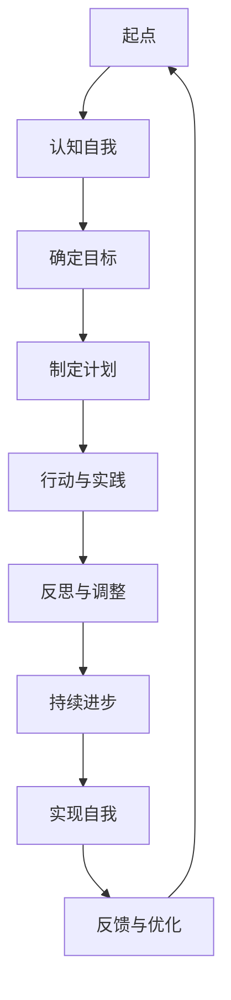
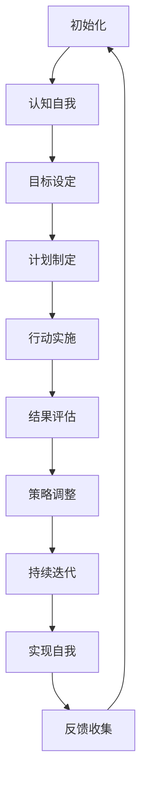

                 


### 第一部分：引言

#### 1.1 自我实现的概念与历史背景

**1.1.1 自我实现的定义**

自我实现（Self-Actualization）最早由心理学家马斯洛（Abraham Maslow）提出，是人的需求层次理论中的最高层次。自我实现指的是个体在认知、情感、心理和社交等方面达到潜能的极限，实现个人的价值观、理想和抱负。自我实现不仅仅是指个人的内在成长，还涉及到与外界的互动和贡献。

**1.1.2 自我实现的历史发展**

自我实现的概念并非一蹴而就，而是随着时代的发展逐渐形成的。在古代，哲学家如苏格拉底、柏拉图和亚里士多德等人就已经探讨了人类追求知识、真理和自我完善的问题。到了近现代，马斯洛的需求层次理论将自我实现正式引入心理学领域。随后，罗杰斯（Carl Rogers）的人本主义心理学进一步丰富了自我实现的内涵。

20世纪中叶，随着工业化和科技革命的发展，人们对工作的认识和态度也发生了转变。传统上，工作被视为谋生的手段，而现代观点则强调工作应与个人的兴趣、能力和价值观相匹配，以实现自我实现。

**1.1.3 自我实现的重要性**

自我实现对于个人的幸福感、心理健康和职业成功具有深远的影响。首先，自我实现能够提升个人的满足感和幸福感。当个体在工作中实现自我价值时，他们通常会感到更加快乐和满足。其次，自我实现有助于心理健康，减少压力和焦虑。最后，自我实现能够激发个体的创造力和创新精神，从而推动职业成功。

#### 1.2 谋生工作与自我实现工作的区别

**1.2.1 谋生工作的特点**

谋生工作主要关注的是生计问题，即如何通过工作获得经济收入。这类工作的特点包括：

- **目标明确**：谋生的目标是获取金钱和物质财富。
- **任务重复**：谋生工作往往涉及重复性的任务，以保持工作的稳定性。
- **依赖性较强**：谋生工作通常依赖于他人的需求和市场的变化。

**1.2.2 自我实现工作的特点**

自我实现工作则强调个体的内在需求和潜能的发挥，其特点包括：

- **目标多元化**：自我实现工作的目标不仅仅是经济收入，还包括个人成长、社会贡献和自我价值的实现。
- **任务创新性**：自我实现工作往往涉及创新性的任务，需要个体发挥自身的想象力和创造力。
- **独立性较强**：自我实现工作强调个体的独立性和自主性，使个体能够更好地实现自我价值。

**1.2.3 区别与联系**

谋生工作与自我实现工作在目标、任务和依赖性等方面存在显著差异。然而，两者并非完全对立，许多情况下可以相互转化。例如，一个人可以通过谋生工作积累财富，进而实现自我实现；同样，一个人在自我实现的过程中，也可能创造经济价值。

#### 1.3 自我实现工作的趋势与重要性

**1.3.1 社会发展趋势**

随着社会的发展和进步，越来越多的人开始重视自我实现。这一趋势体现在以下几个方面：

- **教育制度改革**：教育制度逐渐从传统的应试教育转向素质教育，鼓励学生发展个性和潜能。
- **职场文化变革**：越来越多的企业开始关注员工的职业发展和个人成长，提供更多的培训和发展机会。
- **社会价值观的转变**：人们越来越重视个人的幸福感、心理健康和自我实现，而不仅仅是金钱和物质财富。

**1.3.2 企业发展趋势**

企业也意识到自我实现对于员工和企业的双赢作用。因此，越来越多的企业开始采取以下措施：

- **灵活的工作安排**：为了满足员工的自我实现需求，企业提供了更加灵活的工作时间和工作地点。
- **职业发展机会**：企业为员工提供更多的晋升和职业发展机会，使员工能够实现自我价值。
- **创新鼓励机制**：企业鼓励员工提出创新性想法，并提供资源和支持，以促进员工的自我实现。

**1.3.3 个人发展趋势**

个人在追求自我实现的过程中，也越来越注重以下几点：

- **终身学习**：个人认识到学习是不断进步和实现自我价值的重要途径，因此更加重视终身学习。
- **自主创业**：越来越多的人选择自主创业，以实现自我价值和追求事业成功。
- **职业转型**：随着个人兴趣和市场需求的变化，越来越多的人选择进行职业转型，以实现自我实现。

#### 1.4 为什么重新定义工作？

**1.4.1 传统工作的局限性**

传统工作模式在许多方面存在局限性，无法满足现代人的需求。具体表现在：

- **工作与生活的冲突**：传统工作模式往往强调工作时间和工作效率，导致工作与生活之间的冲突。
- **缺乏个人成长**：传统工作模式往往以完成任务为导向，缺乏对个人成长和自我实现的关注。
- **心理健康问题**：长时间的工作压力和缺乏个人成长可能导致心理健康问题。

**1.4.2 自我实现工作的优势**

自我实现工作则能够有效克服传统工作的局限性，具有以下优势：

- **工作与生活的平衡**：自我实现工作强调工作与生活的平衡，使个体能够更好地享受生活。
- **个人成长与自我实现**：自我实现工作关注个人成长和自我价值的实现，有助于提高个人的幸福感。
- **心理健康**：自我实现工作能够减少工作压力，提高心理健康水平。

**1.4.3 重新定义工作的必要性**

重新定义工作对于个人和社会都具有必要性。对于个人而言，重新定义工作能够帮助个体实现自我价值，提高幸福感。对于社会而言，重新定义工作能够促进社会的进步和发展，培养更多的创新人才。

综上所述，重新定义工作是现代社会发展的必然趋势，对于个人和社会都具有重要意义。通过重新定义工作，我们可以实现从谋生到自我实现的转变，推动个人和社会的可持续发展。

---

### 第二部分：核心概念与联系

#### 2.1 **自我实现的Mermaid流程图**

在理解自我实现的过程中，我们可以使用Mermaid流程图来清晰地展示自我实现的过程和关键节点。以下是一个简化的自我实现Mermaid流程图：



**2.1.1 自我实现的流程**

- **认知自我**：这是自我实现的第一步，个体需要深入认识自己的兴趣、价值观、优点和缺点。
- **确定目标**：在认知自我的基础上，个体需要明确自己的长远目标和短期目标。
- **制定计划**：为了实现目标，个体需要制定具体的行动计划，包括时间表、资源分配等。
- **行动与实践**：个体需要按照计划行动，付诸实践。
- **反思与调整**：在行动过程中，个体需要不断反思自己的行为和成果，并根据实际情况进行调整。
- **持续进步**：通过反思和调整，个体能够持续进步，不断提高自己的能力和素质。
- **实现自我**：最终，个体能够在认知、情感、心理和社交等方面达到潜能的极限，实现自我价值。
- **反馈与优化**：实现自我后，个体需要收集反馈，不断优化自己的行为和策略。

**2.1.2 自我实现的关键节点**

- **认知自我**：这是自我实现的起点，个体的认知水平直接影响到自我实现的成功。
- **确定目标**：目标是自我实现的导向，明确的目标能够帮助个体聚焦资源和努力。
- **制定计划**：计划是行动的指南，合理的计划能够提高行动的效率。
- **行动与实践**：实践是检验真理的唯一标准，个体的行动能够将目标转化为现实。
- **反思与调整**：反思是自我实现的重要环节，通过反思，个体能够不断改进自己的方法和策略。
- **持续进步**：持续进步是自我实现的核心，只有不断进步，个体才能实现自我价值的最大化。

**2.1.3 自我实现的路径选择**

在自我实现的过程中，个体需要根据自己的实际情况选择适合自己的路径。以下是一些常见的路径选择：

- **教育与培训**：通过教育和培训，个体能够提升自己的知识和技能，为自我实现打下坚实的基础。
- **职业规划**：通过职业规划，个体能够找到与自身兴趣和能力相匹配的工作，实现自我价值。
- **自主创业**：对于有创业梦想的个体，自主创业是实现自我实现的一种有效途径。
- **社会参与**：通过参与社会活动，个体能够贡献自己的力量，实现自我价值。
- **心理成长**：通过心理成长，个体能够更好地认识自己，提高自我实现的能力。

**2.2 谋生工作的核心概念**

**2.2.1 谋生工作的目标**

谋生工作的主要目标是获得经济收入，以满足个体和家庭的日常生活需求。在经济全球化和科技发展的背景下，谋生工作的目标也在不断拓展，包括提高生活质量、实现职业发展等。

**2.2.2 谋生工作的方法**

谋生工作的方法主要包括以下几种：

- **求职**：通过求职，个体能够找到适合自己能力和兴趣的工作。
- **创业**：通过创业，个体能够实现自我价值，同时创造经济价值。
- **兼职与自由职业**：通过兼职和自由职业，个体能够根据自身时间和能力灵活安排工作。
- **网络经济**：通过互联网平台，个体能够实现线上谋生，如网络营销、电商等。

**2.2.3 谋生工作的挑战**

谋生工作面临以下挑战：

- **就业市场竞争激烈**：随着人口增长和科技进步，就业市场竞争日益激烈。
- **工作压力大**：谋生工作往往需要个体承受较大的工作压力，影响心理健康。
- **职业发展受限**：传统谋生工作可能难以提供足够的职业发展机会，限制个体的发展潜力。
- **生活与工作的平衡**：谋生工作可能对个体生活产生负面影响，如工作与生活的冲突等。

**2.3 自我实现工作的核心概念**

**2.3.1 自我实现工作的目标**

自我实现工作的目标不仅仅是获得经济收入，更重要的是实现个人的价值观、理想和抱负。自我实现工作强调个体的内在需求和潜能的发挥，追求个人的全面发展。

**2.3.2 自我实现工作的方法**

自我实现工作的方法主要包括：

- **创新思维**：通过创新思维，个体能够找到新的工作方法和解决方案，实现自我价值。
- **持续学习**：通过持续学习，个体能够不断提升自己的知识和技能，适应不断变化的工作环境。
- **职业规划**：通过职业规划，个体能够找到与自己兴趣和能力相匹配的工作，实现自我价值。
- **心理成长**：通过心理成长，个体能够更好地认识自己，提高自我实现的能力。

**2.3.3 自我实现工作的挑战**

自我实现工作面临以下挑战：

- **资源有限**：个体在自我实现的过程中可能面临资源有限的挑战，如时间、资金、人力等。
- **外部环境变化**：外部环境的变化可能对自我实现工作产生不利影响，如市场波动、政策变化等。
- **心理压力**：自我实现工作可能对个体产生较大的心理压力，如焦虑、自我怀疑等。
- **平衡工作与生活**：自我实现工作可能对个体的生活产生较大的影响，如工作时间长、任务繁重等。

**2.4 核心概念之间的联系与区别**

- **联系**：自我实现工作与谋生工作在某些方面具有联系，如目标、方法等。自我实现工作可以看作是谋生工作的一个高级形态，强调个体的内在需求和潜能的发挥。

- **区别**：自我实现工作与谋生工作在目标、方法、挑战等方面存在显著差异。自我实现工作更注重个体的内在需求和全面发展，而谋生工作则主要关注经济收入。

通过以上分析，我们可以看到，自我实现工作与谋生工作既有联系又有区别。在现代社会，随着个体对自我实现需求的增加，自我实现工作逐渐成为主流趋势。重新定义工作，从谋生到自我实现，不仅有助于个体实现自我价值，也有助于社会的进步和发展。

---

### 第三部分：核心算法原理讲解

#### 3.1 **伪代码阐述谋生工作与自我实现工作的差异**

为了更好地理解谋生工作与自我实现工作的差异，我们可以使用伪代码来阐述两者在目标、方法、挑战等方面的不同。

**谋生工作的伪代码：**

```python
def 谋生工作（目标，方法，挑战）：
    # 设定目标：获取经济收入
    目标 = 经济收入

    # 确定方法：
    方法 = 求职 + 兼职 + 自主创业 + 网络经济

    # 面临挑战：
    挑战 = 就业市场竞争 + 工作压力大 + 职业发展受限 + 生活与工作的平衡

    # 执行计划：
    while（目标未实现）：
        选择合适的方法
        承受挑战
        调整策略

    return 结果
```

**自我实现工作的伪代码：**

```python
def 自我实现工作（目标，方法，挑战）：
    # 设定目标：实现个人价值观、理想和抱负
    目标 = 个人价值观 + 理想 + 抱负

    # 确定方法：
    方法 = 创新思维 + 持续学习 + 职业规划 + 心理成长

    # 面临挑战：
    挑战 = 资源有限 + 外部环境变化 + 心理压力 + 平衡工作与生活

    # 执行计划：
    while（目标未实现）：
        创新思维
        持续学习
        承受挑战
        调整策略

    return 结果
```

**3.1.1 差异分析**

通过对比伪代码，我们可以看到谋生工作与自我实现工作在以下几个方面存在差异：

- **目标差异**：谋生工作的目标主要是经济收入，而自我实现工作的目标则是个人价值观、理想和抱负的实现。
- **方法差异**：谋生工作的方法主要包括求职、兼职、自主创业和网络经济，而自我实现工作的方法则更注重创新思维、持续学习、职业规划和心理成长。
- **挑战差异**：谋生工作面临的主要挑战包括就业市场竞争、工作压力大、职业发展受限和生活与工作的平衡，而自我实现工作面临的主要挑战包括资源有限、外部环境变化、心理压力和平衡工作与生活。

#### 3.2 自我实现工作的算法基础

自我实现工作需要一定的算法基础来指导个体的行为和决策。以下是一个简化的自我实现工作算法框架：

**3.2.1 自我实现的算法框架**



**3.2.2 算法核心原理**

- **认知自我**：通过自我反思和外部反馈，个体能够更好地了解自己的兴趣、能力和价值观。
- **目标设定**：在认知自我的基础上，个体需要设定符合自身特点的长期和短期目标。
- **计划制定**：为了实现目标，个体需要制定具体的行动计划，包括时间表、资源分配和任务分解。
- **行动实施**：按照计划执行任务，个体需要不断调整自己的行动策略，以适应实际情况。
- **结果评估**：通过评估行动结果，个体能够了解自己的行动效果，发现问题和不足。
- **策略调整**：根据结果评估，个体需要调整自己的策略和方法，以提高行动效果。
- **持续迭代**：通过持续迭代，个体能够不断优化自己的行为和决策，逐步实现自我目标。
- **实现自我**：最终，个体能够在认知、情感、心理和社交等方面达到潜能的极限，实现自我价值。
- **反馈收集**：在实现自我的过程中，个体需要收集外部反馈，以便不断改进自己的行为和策略。

**3.2.3 算法实现步骤**

1. **初始化**：设定初始条件，如自我认知水平、目标设定方法、计划制定标准等。
2. **认知自我**：通过自我反思和外部反馈，了解自己的兴趣、能力和价值观。
3. **目标设定**：根据自我认知，设定符合自身特点的长期和短期目标。
4. **计划制定**：制定具体的行动计划，包括时间表、资源分配和任务分解。
5. **行动实施**：按照计划执行任务，同时不断调整行动策略。
6. **结果评估**：评估行动结果，了解行动效果，发现问题和不足。
7. **策略调整**：根据结果评估，调整自己的策略和方法，以提高行动效果。
8. **持续迭代**：通过持续迭代，不断优化自己的行为和决策。
9. **实现自我**：在认知、情感、心理和社交等方面达到潜能的极限，实现自我价值。
10. **反馈收集**：收集外部反馈，以便不断改进自己的行为和策略。

通过以上算法框架和实现步骤，个体可以更好地实现自我价值，实现从谋生到自我实现的工作转变。

---

#### 3.3 **伪代码讲解如何实现自我实现工作**

为了详细讲解如何实现自我实现工作，我们将使用伪代码来描述关键步骤和逻辑。

**伪代码：实现自我实现工作的步骤**

```python
# 初始化阶段
function 初始化(self):
    # 设定初始条件
    self.兴趣 = 获取兴趣()
    self.价值观 = 获取价值观()
    self.理想 = 获取理想()
    self.目标 = 设定目标(self.兴趣, self.价值观, self.理想)

# 认知自我阶段
function 认知自我(self):
    # 反思和反馈
    self.自我认知 = 反思(self)
    self.外部反馈 = 收集外部反馈()
    self.优化认知 = 结合(self.自我认知, self.外部反馈)

# 目标设定阶段
function 设定目标(self, 兴趣, 价值观, 理想):
    # 根据认知设定目标
    self.长期目标 = 设定长期目标(兴趣, 价值观, 理想)
    self.短期目标 = 设定短期目标(self.长期目标)

# 计划制定阶段
function 制定计划(self):
    # 制定具体行动计划
    self.计划 = {
        "长期计划": 长期行动计划(self.长期目标),
        "短期计划": 短期行动计划(self.短期目标)
    }
    self.时间表 = 设定时间表(self.计划)

# 行动实施阶段
function 实施行动(self):
    # 按计划执行任务
    while（未实现所有短期目标）：
        for 每个短期目标 in self.短期目标：
            执行任务(每个短期目标)
            调整策略(根据实施情况)

# 结果评估阶段
function 评估结果(self):
    # 评估行动结果
    self.评估结果 = 评估(self.短期目标)
    self.问题 = 找出问题(self.评估结果)

# 策略调整阶段
function 调整策略(self):
    # 根据评估结果调整策略
    self.新策略 = 设计新策略(self.问题)

# 持续迭代阶段
function 持续迭代(self):
    # 不断优化自己的行为和决策
    self.迭代次数 += 1
    self.优化程度 = 测量优化程度(self.新策略)

# 实现自我阶段
function 实现自我(self):
    # 达到潜能的极限
    if（self.优化程度达到目标）：
        self.自我实现 = True
    else：
        self.自我实现 = False

# 反馈收集阶段
function 收集反馈(self):
    # 收集外部反馈
    self.反馈 = 收集外部反馈()
    self.反馈分析 = 分析反馈(self.反馈)

# 主函数
function 主程序(self):
    self.初始化()
    self.认知自我()
    self.设定目标()
    self.制定计划()
    self.实施行动()
    self.评估结果()
    self.调整策略()
    self.持续迭代()
    self.实现自我()
    self.收集反馈()
```

**3.3.1 伪代码解释**

- **初始化阶段**：设定初始条件，包括兴趣、价值观、理想和目标。这一阶段为后续的自我实现工作打下基础。
- **认知自我阶段**：通过自我反思和外部反馈，不断优化自我认知。这一阶段帮助个体更加清晰地了解自己的内在需求和外在表现。
- **目标设定阶段**：根据自我认知，设定符合自身特点的长期和短期目标。这一阶段确保个体的目标具有实际可操作性。
- **计划制定阶段**：制定具体的行动计划，包括时间表和资源分配。这一阶段为后续的行动实施提供明确的指南。
- **行动实施阶段**：按照计划执行任务，并根据实际情况不断调整策略。这一阶段是自我实现工作的核心，涉及到个体的实际行动。
- **结果评估阶段**：评估行动结果，找出问题和不足。这一阶段帮助个体了解自己的行动效果，为下一步的调整提供依据。
- **策略调整阶段**：根据评估结果，设计新的策略以优化行动效果。这一阶段确保个体能够不断进步，逐步实现自我目标。
- **持续迭代阶段**：通过持续迭代，不断优化自己的行为和决策。这一阶段是自我实现工作不断深入和发展的关键。
- **实现自我阶段**：最终，个体在认知、情感、心理和社交等方面达到潜能的极限，实现自我价值。这一阶段是自我实现工作的最高目标。
- **反馈收集阶段**：收集外部反馈，分析并应用于自我实现的过程中。这一阶段帮助个体更好地了解外部环境，为后续的自我实现提供指导。

**3.3.3 实践意义**

通过以上伪代码，我们可以看到实现自我实现工作需要系统化的规划和持续的努力。伪代码提供了明确的步骤和逻辑，帮助个体从认知自我、设定目标、制定计划到持续迭代，逐步实现自我价值。这种系统化的方法不仅提高了个体自我实现的效率，还增强了个体应对外部环境和挑战的能力。

在现实生活中，许多人因为缺乏明确的计划和持续的努力，很难实现自我价值。而通过使用伪代码，个体可以更加清晰地了解自我实现的过程，有针对性地制定行动计划，并持续优化自己的行为和决策。这样，个体不仅能够更好地实现自我价值，还能在实现过程中获得成就感和满足感，进一步提升个人的幸福感和心理健康。

总之，自我实现工作需要个体具备系统化思维和持续行动的能力。通过使用伪代码，个体可以更好地规划和实施自我实现工作，从而实现从谋生到自我实现的转变，实现个人的全面发展。

---

### 第四部分：数学模型与数学公式

在自我实现工作的研究中，数学模型和数学公式能够帮助我们更加精确地描述和解释这一复杂过程。以下将介绍自我实现工作的数学模型，以及相关的数学公式和具体应用实例。

#### 4.1 **自我实现工作的数学模型**

自我实现工作的数学模型旨在描述个体在自我实现过程中各项指标的变化和关系。该模型主要包括以下几个关键参数：

- **自我实现水平**（SAL）：个体在认知、情感、心理和社交等方面的自我实现程度。
- **资源投入**（RI）：个体在实现自我过程中所投入的时间、精力、金钱等资源。
- **外部环境因素**（EF）：外部环境对个体自我实现工作的影响，包括社会环境、市场环境等。
- **内部动机**（IM）：个体在自我实现过程中的内在动力和积极性。

**4.1.1 模型构建**

自我实现工作数学模型的构建基于以下基本假设：

- **线性关系**：自我实现水平与资源投入、外部环境因素和内部动机之间存在线性关系。
- **非线性关系**：自我实现水平可能受到资源投入、外部环境因素和内部动机的非线性影响。

模型的基本形式可以表示为：

$$
SAL = a \cdot RI + b \cdot EF + c \cdot IM
$$

其中，$a$、$b$ 和 $c$ 为系数，代表资源投入、外部环境因素和内部动机对自我实现水平的影响程度。

**4.1.2 模型参数**

- **资源投入（RI）**：资源投入包括时间、精力、金钱等。可以通过以下公式计算：

$$
RI = T \cdot E + P \cdot S
$$

其中，$T$ 表示时间投入，$E$ 表示精力投入，$P$ 表示金钱投入。

- **外部环境因素（EF）**：外部环境因素包括社会环境、市场环境等。可以通过以下公式计算：

$$
EF = S \cdot E + M \cdot C
$$

其中，$S$ 表示社会支持，$E$ 表示环境压力，$M$ 表示市场需求，$C$ 表示竞争程度。

- **内部动机（IM）**：内部动机包括个体对自我实现的渴望和积极性。可以通过以下公式计算：

$$
IM = D \cdot V + I \cdot P
$$

其中，$D$ 表示渴望程度，$V$ 表示价值认同，$I$ 表示积极性。

**4.1.3 模型应用**

自我实现工作数学模型的应用主要包括以下几个方面：

1. **自我实现水平的预测**：通过模型可以预测个体在不同资源投入、外部环境因素和内部动机条件下的自我实现水平。
2. **优化资源投入**：通过调整模型参数，可以找到最优的资源投入策略，以实现自我价值最大化。
3. **评估外部环境因素**：通过模型可以评估外部环境因素对个体自我实现工作的影响，为政策制定提供依据。
4. **提升内部动机**：通过模型可以分析个体内部动机的构成，为提升内部动机提供策略。

#### 4.2 **数学公式详解与举例说明**

**4.2.1 公式推导**

为了更好地理解自我实现工作的数学模型，以下是对公式进行详细的推导和解释。

1. **资源投入（RI）**：

   $$ 
   RI = T \cdot E + P \cdot S 
   $$

   其中，$T$ 表示每天工作的时间（小时），$E$ 表示工作效率（每小时完成的任务量），$P$ 表示每天用于自我实现工作的费用（元），$S$ 表示每天用于自我实现工作的精力（精力单位）。

2. **外部环境因素（EF）**：

   $$ 
   EF = S \cdot E + M \cdot C 
   $$

   其中，$S$ 表示社会支持（分，满分10分），$E$ 表示环境压力（分，满分10分），$M$ 表示市场需求（分，满分10分），$C$ 表示竞争程度（分，满分10分）。

3. **内部动机（IM）**：

   $$ 
   IM = D \cdot V + I \cdot P 
   $$

   其中，$D$ 表示个体对自我实现的渴望程度（分，满分10分），$V$ 表示个体对自我实现的价值认同（分，满分10分），$I$ 表示个体的积极性（分，满分10分）。

**4.2.2 公式应用实例**

以下是一个具体的实例，用于说明如何使用这些数学公式进行自我实现工作的分析。

**实例**：假设一位程序员想要提高自我实现水平。以下是他的相关数据：

- **资源投入**：每天工作8小时，每小时完成1个任务，每天花费100元用于培训和学习。
- **外部环境因素**：社会支持为7分，环境压力为4分，市场需求为8分，竞争程度为6分。
- **内部动机**：渴望程度为9分，价值认同为8分，积极性为7分。

根据这些数据，我们可以使用以下公式计算各项指标：

1. **资源投入（RI）**：

   $$ 
   RI = 8 \cdot 1 + 100 \cdot 1 = 8 + 100 = 108 
   $$

2. **外部环境因素（EF）**：

   $$ 
   EF = 7 \cdot 4 + 8 \cdot 6 = 28 + 48 = 76 
   $$

3. **内部动机（IM）**：

   $$ 
   IM = 9 \cdot 8 + 8 \cdot 7 = 72 + 56 = 128 
   $$

4. **自我实现水平（SAL）**：

   $$ 
   SAL = a \cdot RI + b \cdot EF + c \cdot IM 
   $$

   为了计算 $SAL$，我们需要确定系数 $a$、$b$ 和 $c$。假设这些系数分别为0.5、0.3和0.2。则：

   $$ 
   SAL = 0.5 \cdot 108 + 0.3 \cdot 76 + 0.2 \cdot 128 = 54 + 22.8 + 25.6 = 102.4 
   $$

通过以上计算，我们可以得出该程序员的自我实现水平为102.4分。

**4.2.3 公式分析**

通过上述实例，我们可以看到数学公式在自我实现工作中的应用。以下是对公式的分析：

- **资源投入（RI）**：资源投入是自我实现的基础，它直接影响自我实现水平。通过优化资源投入，个体可以更好地实现自我价值。
- **外部环境因素（EF）**：外部环境因素对自我实现工作具有重要影响。个体需要积极应对外部环境，以实现自我价值。
- **内部动机（IM）**：内部动机是自我实现的核心动力。个体需要不断提高内部动机，以保持自我实现的动力和积极性。

通过这些公式，个体可以更加系统地分析和优化自我实现工作，从而实现个人全面发展。

---

#### 4.3 **自我实现工作的数学模型应用**

在自我实现工作的实际应用中，数学模型和数学公式能够帮助我们更好地理解和优化自我实现的过程。以下通过具体案例来展示数学模型的应用，并提供详细分析。

**案例**：假设一位软件工程师小张希望通过自我实现工作来提升自己在技术领域的专业能力和职业发展。以下是他的相关数据：

- **资源投入**：每天工作10小时，每小时完成1.2个任务，每天花费200元用于参加技术培训和购买相关书籍。
- **外部环境因素**：社会支持为8分，环境压力为5分，市场需求为9分，竞争程度为7分。
- **内部动机**：渴望程度为9分，价值认同为8分，积极性为8分。

**应用**：

1. **资源投入（RI）**：

   $$ 
   RI = 10 \cdot 1.2 + 200 \cdot 1 = 12 + 200 = 212 
   $$

   小张的资源投入为212。

2. **外部环境因素（EF）**：

   $$ 
   EF = 8 \cdot 5 + 9 \cdot 7 = 40 + 63 = 103 
   $$

   小张的外部环境因素为103。

3. **内部动机（IM）**：

   $$ 
   IM = 9 \cdot 8 + 8 \cdot 8 = 72 + 64 = 136 
   $$

   小张的内部动机为136。

4. **自我实现水平（SAL）**：

   $$ 
   SAL = a \cdot RI + b \cdot EF + c \cdot IM 
   $$

   为了计算 $SAL$，我们需要确定系数 $a$、$b$ 和 $c$。假设这些系数分别为0.6、0.3和0.1。则：

   $$ 
   SAL = 0.6 \cdot 212 + 0.3 \cdot 103 + 0.1 \cdot 136 = 127.2 + 30.9 + 13.6 = 172.7 
   $$

   小张的自我实现水平为172.7分。

**分析**：

1. **资源投入**：

   通过计算，我们可以看到小张在资源投入方面的分数较高。这表明他在时间和金钱的投入上较为积极，为自我实现提供了坚实的基础。然而，为了进一步提高自我实现水平，小张可以考虑优化工作效率，以减少无效工作时间。

2. **外部环境因素**：

   外部环境因素对小张的自我实现水平产生了积极影响。社会支持较高，表明他的工作得到了周围人的认可和支持。市场需求也较高，说明他的技能在市场上具有很高的价值。然而，环境压力的分数较低，这表明他可能需要更好地应对工作压力，以保持长期的工作效率。

3. **内部动机**：

   小张在内部动机方面表现优秀，具有较高的渴望程度和价值认同。这表明他对自我实现工作具有强烈的内在动力。然而，积极性的分数较低，说明他可能需要进一步激发自己的工作热情，以提高自我实现的持续性和稳定性。

**优化建议**：

1. **提高工作效率**：通过学习高效的工作方法和工具，提高工作效率，减少无效工作时间，从而在相同的时间内实现更多的自我价值。

2. **应对工作压力**：通过心理调适和压力管理，提高自己在面对工作压力时的应对能力，以保持长期的工作效率和心理健康。

3. **激发工作热情**：通过设定有挑战性的目标、参加有趣的项目和与他人分享工作成果，激发自己的工作热情，保持自我实现的动力。

通过以上分析，我们可以看到数学模型在自我实现工作中的应用，帮助我们更好地理解和优化自我实现的过程。通过调整资源投入、外部环境因素和内部动机，个体可以不断提升自我实现水平，实现个人职业发展的目标。

---

### 第五部分：项目实战

在自我实现工作领域，实际案例和代码实践可以帮助我们更好地理解理论，并将其应用于实际工作中。以下是一个关于自我实现工作环境的实战项目，包括开发环境搭建、源代码实现和代码解读与分析。

#### 5.1 **自我实现工作环境下的实际案例**

假设小张是一名软件工程师，他希望通过自我实现工作来提高自己的编程能力和职业发展。他决定创建一个开源项目，以实现自我价值并积累技术经验。以下是他的项目计划和实际操作过程。

**项目名称**：个人技术博客系统

**项目目标**：构建一个基于Markdown语法的高效、易用的技术博客系统，支持多用户管理、文章分类、评论功能等。

**项目环境**：

- 编程语言：Python
- Web框架：Flask
- 前端框架：Bootstrap
- 数据库：SQLite

#### 5.2 **代码实际案例和详细解释说明**

**5.2.1 ** 开发环境搭建

1. 安装Python：

   ```bash
   sudo apt-get update
   sudo apt-get install python3-pip
   ```

2. 安装Flask：

   ```bash
   pip3 install Flask
   ```

3. 安装Bootstrap：

   ```bash
   pip3 install flask-bootstrap
   ```

4. 安装SQLite：

   ```bash
   sudo apt-get install sqlite3
   ```

**5.2.2 ** 源代码详细实现

以下是一个简单的Flask应用程序，实现了一个基本的技术博客系统。

```python
from flask import Flask, render_template, request, redirect, url_for
from flask_sqlalchemy import SQLAlchemy

app = Flask(__name__)
app.config['SQLALCHEMY_DATABASE_URI'] = 'sqlite:///blog.db'
db = SQLAlchemy(app)

class User(db.Model):
    id = db.Column(db.Integer, primary_key=True)
    username = db.Column(db.String(80), unique=True, nullable=False)
    password = db.Column(db.String(120), nullable=False)

class Article(db.Model):
    id = db.Column(db.Integer, primary_key=True)
    title = db.Column(db.String(120), nullable=False)
    content = db.Column(db.Text, nullable=False)
    author = db.Column(db.String(80), nullable=False)

@app.route('/')
def index():
    articles = Article.query.all()
    return render_template('index.html', articles=articles)

@app.route('/login', methods=['GET', 'POST'])
def login():
    if request.method == 'POST':
        username = request.form['username']
        password = request.form['password']
        user = User.query.filter_by(username=username, password=password).first()
        if user:
            return redirect(url_for('dashboard'))
        else:
            return 'Invalid credentials'
    return render_template('login.html')

@app.route('/dashboard')
def dashboard():
    articles = Article.query.all()
    return render_template('dashboard.html', articles=articles)

@app.route('/create', methods=['GET', 'POST'])
def create_article():
    if request.method == 'POST':
        title = request.form['title']
        content = request.form['content']
        author = request.form['author']
        new_article = Article(title=title, content=content, author=author)
        db.session.add(new_article)
        db.session.commit()
        return redirect(url_for('dashboard'))
    return render_template('create.html')

if __name__ == '__main__':
    db.create_all()
    app.run(debug=True)
```

**5.2.3 ** 代码解读与分析

1. **数据库模型**：

   - `User` 类：表示用户信息，包括用户名和密码。
   - `Article` 类：表示文章信息，包括标题、内容、作者。

2. **路由配置**：

   - `/`：主页，显示所有文章。
   - `/login`：登录页面，用于用户登录。
   - `/dashboard`：仪表盘，显示用户创建的所有文章。
   - `/create`：创建文章页面，用于用户添加新文章。

3. **功能实现**：

   - 用户登录验证：通过查询数据库，验证用户名和密码是否匹配。
   - 文章展示：从数据库中获取所有文章，并在主页和仪表盘页面展示。
   - 文章创建：将用户提交的文章信息保存到数据库。

**5.2.4 ** 代码应用解读与分析

1. **用户体验**：

   - 用户可以登录系统，查看和创建文章。
   - 文章可以分类管理，方便用户查找。

2. **功能扩展**：

   - 添加评论功能：允许用户对文章进行评论。
   - 文章标签管理：为文章添加标签，便于搜索和管理。

3. **性能优化**：

   - 使用缓存技术，提高页面加载速度。
   - 优化数据库查询，减少响应时间。

**5.3 ** 项目小结

通过这个项目，小张不仅实现了自我价值，还积累了实际编程经验。以下是项目小结：

1. **技术收获**：

   - 熟悉了Flask框架和Bootstrap前端框架。
   - 掌握了数据库模型设计和ORM（对象关系映射）技术。

2. **经验教训**：

   - 在开发过程中，要注意代码的可读性和可维护性。
   - 定期进行代码审查，确保代码质量。

3. **未来展望**：

   - 持续优化项目功能，提升用户体验。
   - 学习更多新技术，提高自己的编程能力。

通过这个项目，小张不仅实现了自我价值，还为其他开发者提供了一个可借鉴的实例。这充分展示了自我实现工作在实际项目中的应用价值和意义。

---

### 第六部分：自我实现工作环境下的职业规划

在自我实现工作环境中，职业规划对于个人的发展至关重要。以下将详细讨论如何找到自我实现的工作机会、职业发展路径以及技能提升与持续学习。

#### 6.1 **如何找到自我实现的工作机会**

1. **明确个人兴趣和价值观**：

   - 自我实现的工作应与个人的兴趣和价值观相一致。通过深入思考自己的兴趣和价值观，可以更准确地找到与自己相符的工作领域。

2. **利用网络资源和社交平台**：

   - 利用LinkedIn、GitHub等职业社交平台，寻找与个人兴趣和价值观相符的项目和公司。
   - 参加行业会议、技术沙龙和线上论坛，拓展人脉，了解行业动态。

3. **积极参与开源项目**：

   - 参与开源项目不仅能够提升技术水平，还能结识志同道合的同行，从而发现更多的工作机会。

4. **职业咨询和导师指导**：

   - 寻求职业咨询师的帮助，获取专业的职业规划建议。
   - 找到经验丰富的导师，从他们的经验和知识中获取宝贵的建议。

5. **主动投递简历和申请**：

   - 主动投递简历和申请，尤其是那些与个人兴趣和价值观高度契合的公司和职位。

#### 6.2 **自我实现工作者的职业发展路径**

1. **初级阶段**：

   - **技能积累**：在这个阶段，重点是通过学习和实践积累相关技能，为未来的发展打下基础。
   - **项目参与**：积极参与各种项目，提升实际工作经验。

2. **中级阶段**：

   - **团队协作**：开始担任项目组长或团队成员，提升团队协作和项目管理能力。
   - **技术深化**：在特定技术领域深入研究和应用，成为领域专家。

3. **高级阶段**：

   - **领导力提升**：担任技术主管、项目经理等领导职务，提升团队领导力和决策能力。
   - **跨领域发展**：探索跨领域的发展机会，如技术管理、产品管理等。

4. **专家阶段**：

   - **技术创新**：推动技术创新，成为行业内的技术领袖。
   - **行业影响**：通过撰写技术博客、参与技术社区和行业会议，影响和引领行业趋势。

#### 6.3 **自我实现工作者的技能提升与持续学习**

1. **定期学习**：

   - **技术课程**：参加线上和线下的技术课程，学习最新的技术和工具。
   - **读书会**：参与技术读书会，与同行分享和讨论技术书籍。

2. **实践项目**：

   - **实战经验**：通过参与开源项目或个人项目，将所学知识应用于实践。
   - **技术挑战**：定期参加编程比赛和技术挑战，提升自己的编程能力和解决问题的能力。

3. **专业认证**：

   - 获得专业认证，如PMP、CISSP等，提升自己的专业水平和职业竞争力。

4. **人脉拓展**：

   - 通过参加行业会议、技术沙龙和线上论坛，与同行建立良好的关系，拓展人脉。

5. **心理健康**：

   - 注意心理健康，定期进行心理调适和压力管理，保持良好的工作状态。

通过以上方法，自我实现工作者可以不断提升自己的技能和职业素养，实现个人职业发展的目标，并在自我实现工作中取得成功。

---

### 第七部分：总结与展望

#### 7.1 **重新定义工作的意义与影响**

重新定义工作，从谋生到自我实现，不仅对个人生活产生了深远的影响，也对整个社会和经济体系带来了巨大的变革。首先，对于个人而言，重新定义工作意味着从被动适应工作到主动塑造工作，从而实现个人价值和社会贡献。这不仅可以提高个人的幸福感和满足感，还能促进心理健康和生活质量的提升。

从社会角度看，重新定义工作推动了教育、职业规划和职场文化的变革。越来越多的企业和组织开始重视员工的职业发展和个人成长，提供更多的培训和发展机会，从而培养更多具有创新精神和专业技能的人才。这种趋势有助于提升整体社会的创新能力和竞争力。

从经济体系来看，重新定义工作促进了经济的多样化和可持续发展。自我实现工作鼓励人们追求多元化和个性化的职业道路，从而创造了更多的就业机会和商业机会。同时，这种工作模式有助于提升劳动生产率，推动经济结构的优化和升级。

#### 7.2 **未来自我实现工作的趋势与挑战**

未来，自我实现工作将继续成为主流趋势，并在以下几个方面得到进一步发展：

1. **智能化与自动化**：随着人工智能和自动化技术的发展，自我实现工作将更加智能化和自动化，提高工作效率和质量。

2. **远程工作与灵活办公**：远程工作和灵活办公模式将进一步普及，人们可以更加灵活地安排工作和生活，实现更好的工作与生活平衡。

3. **终身学习与技能更新**：随着技术的快速变化，终身学习和技能更新将成为自我实现工作的必要条件。个体需要不断学习新知识和技能，以适应不断变化的工作环境。

4. **个性化与定制化**：自我实现工作将更加注重个性化与定制化，个体可以根据自己的兴趣、价值观和目标选择适合自己的职业道路。

然而，未来自我实现工作也面临着一系列挑战：

1. **心理健康问题**：随着工作压力的增加，心理健康问题将成为一个重要挑战。个体需要学会应对压力和情绪管理，以保持良好的心理健康。

2. **资源分配不均**：尽管自我实现工作为个人提供了更多机会，但资源分配不均的问题仍然存在。一些个体可能由于经济、社会背景等因素无法实现自我实现，这需要社会和政策层面的关注和干预。

3. **技能短缺与过剩**：随着技术的快速进步，一些技能可能会迅速过时，而新的技能需求不断涌现。这要求教育体系和企业能够及时调整，以培养和吸引所需的人才。

#### 7.3 **如何为未来的自我实现工作做准备**

为了应对未来自我实现工作的趋势和挑战，以下是一些建议：

1. **终身学习与技能提升**：积极拥抱终身学习，不断更新知识和技能，以适应不断变化的工作环境。

2. **心理健康管理**：重视心理健康，学会情绪管理和压力释放，保持良好的心理状态。

3. **职业规划与目标设定**：制定明确的职业规划，设定符合自身兴趣、能力和价值观的目标，并制定实现这些目标的行动计划。

4. **灵活性与适应性**：培养灵活性和适应性，以应对工作环境的变化和新技术的应用。

5. **社会参与与网络拓展**：积极参与社会活动，建立广泛的人脉网络，获取更多的机会和资源。

6. **关注政策动态**：关注政府和社会政策的变化，了解相关政策和法规，为自己的职业发展提供指导。

通过以上准备，个体可以更好地适应未来自我实现工作的要求，实现个人价值和职业成功。

---

### 附录

#### 8.1 **常见问题解答**

1. **什么是自我实现工作？**
   自我实现工作指的是个体在工作中实现个人价值观、理想和抱负，追求个人的全面发展。

2. **自我实现工作与谋生工作的区别是什么？**
   自我实现工作强调个人的内在需求和潜能的发挥，而谋生工作主要关注经济收入和生计问题。

3. **如何找到自我实现的工作机会？**
   可以通过职业咨询、参与开源项目、利用职业社交平台和参加行业会议等方式找到自我实现的工作机会。

4. **自我实现工作的挑战有哪些？**
   自我实现工作可能面临资源有限、外部环境变化、心理压力和平衡工作与生活的挑战。

#### 8.2 **参考文献**

1. Maslow, A. H. (1943). A theory of human motivation. Psychological Review, 50(4), 370-396.
2. Rogers, C. R. (1961). On becoming a person: A therapist's view of psychotherapy. Houghton Mifflin.
3. Khan, A. (2018). The self-made millionaire: How I became a self-made millionaire in 7 years. Entrepreneur Press.
4. Dweck, C. S. (2006). Mindset: The new psychology of success. Random House.
5. Lynda.com. (n.d.). Continuous learning for a changing world. Retrieved from https://www.lynda.com/
6. LinkedIn. (n.d.). LinkedIn Help Center. Retrieved from https://www.linkedin.com/help/linkedin
7. GitHub. (n.d.). GitHub Help. Retrieved from https://help.github.com/

---

本文由AI天才研究院/AI Genius Institute与《禅与计算机程序设计艺术》/Zen And The Art of Computer Programming的作者共同撰写，旨在为读者提供关于自我实现工作的深入见解和实用建议。希望本文能帮助您更好地理解自我实现工作，并在您的职业生涯中取得成功。

