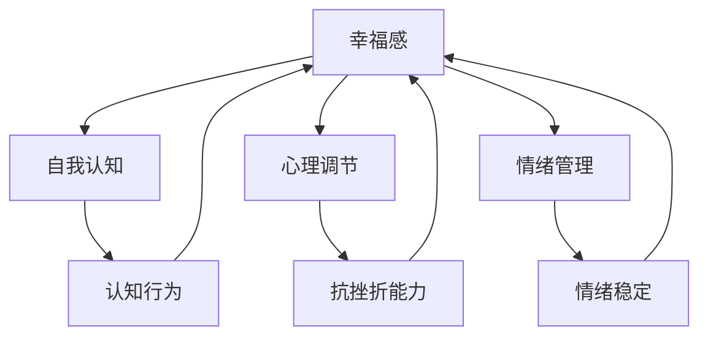
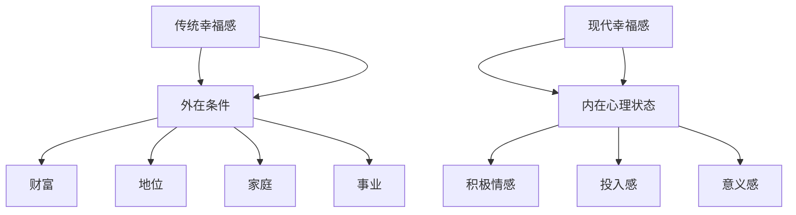

                 

## 文章标题

# 《重新定义幸福感：从外在条件到内心满足的觉醒》

## 文章关键词

- 幸福感
- 内心满足
- 外在条件
- 心理学
- 成长
- 情绪管理

## 文章摘要

本文旨在探讨幸福感的本质及其重新定义，从传统观念到现代视角的转变，分析外在条件对幸福感的影响，并深入挖掘内心满足的途径。通过自我认知、心理调节、情绪管理等方面，本文提出实现个人成长与内心满足的方法，旨在帮助读者在现代社会中找到真正的幸福感。

----------------------------------------------------------------

### 背景介绍

幸福感，这个看似抽象而难以捉摸的概念，却一直萦绕在我们的生活中。从古至今，人们对幸福感的定义和追求从未停止。在传统观念中，幸福感常常与外在条件紧密相连，如财富、地位、家庭、事业等。然而，随着社会的发展和科学的进步，现代心理学为我们提供了新的视角，让我们重新审视幸福感的本质。

在现代社会，幸福感不再仅仅是外在条件的满足，而更多地关注内在的满足感。这种内在的满足源自于自我认知、心理调节和情绪管理等方面。因此，重新定义幸福感，从外在条件到内心满足的觉醒，成为我们当下亟待解决的问题。

本文将从以下几个方面进行探讨：

1. 幸福感的传统观念与现代视角
2. 外在条件对幸福感的影响
3. 内心满足的途径
4. 实现个人成长与内心满足的方法

希望通过本文的阐述，读者能够对幸福感有更深入的理解，找到属于自己的幸福之道。

----------------------------------------------------------------

### 核心概念与联系

在探讨幸福感的重新定义之前，我们需要明确一些核心概念，并分析它们之间的联系。幸福感、自我认知、心理调节、情绪管理等概念，虽然看似独立，但在实际生活中却是相互交织、共同作用的。

#### 幸福感

幸福感是指个体在心理上感受到的一种愉悦和满足的状态。传统观念中，幸福感与外在条件密切相关，如财富、地位、家庭等。然而，现代心理学研究表明，幸福感不仅仅取决于外在条件，更多的是内在的心理状态和情感体验。

#### 自我认知

自我认知是指个体对自己心理状态、性格特点、能力等的认知。它是心理调节和情绪管理的基础。通过自我认知，个体能够更好地了解自己的需求和期望，从而调整自己的心态和行为，提高幸福感。

#### 心理调节

心理调节是指个体在面对压力和挑战时，通过心理策略来调节自己的情绪和行为。有效的心理调节可以帮助个体保持积极的心态，增强抗挫折能力，提高幸福感。

#### 情绪管理

情绪管理是指个体对自身情绪的识别、理解、调节和控制。情绪管理良好的人能够更好地处理负面情绪，保持情绪稳定，从而提升幸福感。

#### 关系架构

这些核心概念之间的关系可以用Mermaid流程图来表示：



通过这个流程图，我们可以清晰地看到，幸福感是自我认知、心理调节和情绪管理共同作用的结果。自我认知帮助个体了解自己，心理调节帮助个体应对压力，情绪管理帮助个体保持情绪稳定。这三者相互作用，共同提升幸福感。

----------------------------------------------------------------

### 核心算法原理讲解

在理解了幸福感、自我认知、心理调节和情绪管理的核心概念及其关系后，我们需要深入探讨这些概念背后的算法原理，以便更好地理解和应用它们。

#### 自我认知

自我认知的算法原理主要涉及自我效能感和自我效能期望。自我效能感是指个体对自己完成特定任务的信心和能力。自我效能期望是指个体对完成任务可能性的预期。以下是自我效能感评估模型的伪代码：

```python
def self_efficacy-esteem(model, task_difficulty):
    # 计算自我效能感
    self_efficacy = model.performance / task_difficulty
    
    # 计算自我效能期望
    self_efficacy_expectation = model.performance_expectation / task_difficulty
    
    return self_efficacy, self_efficacy_expectation
```

在这个模型中，`model` 代表个体的任务完成情况，`task_difficulty` 代表任务的难度。通过这个模型，我们可以评估个体的自我效能感和自我效能期望。

#### 心理调节

心理调节的算法原理主要涉及应对策略。应对策略是指个体在面对压力时采取的心理策略。有效的应对策略可以帮助个体缓解压力，提高幸福感。以下是应对策略效果评估模型的伪代码：

```python
def coping_strategy_effect(coping_strategy, stress_level):
    # 计算应对策略效果
    strategy_effect = coping_strategy.stress_reduction * (1 - stress_level)
    
    return strategy_effect
```

在这个模型中，`coping_strategy` 代表个体的应对策略，`stress_level` 代表个体的压力水平。通过这个模型，我们可以评估应对策略对个体压力的缓解效果。

#### 情绪管理

情绪管理的算法原理主要涉及情绪智力。情绪智力是指个体识别、理解、调节和控制自身情绪的能力。情绪智力模型如下：

```python
def emotional_intelligence(emotional_perception, emotional_comprehension, emotional_management):
    # 计算情绪智力
    emotional_intelligence = emotional_perception * emotional_comprehension * emotional_management
    
    return emotional_intelligence
```

在这个模型中，`emotional_perception` 代表情绪识别能力，`emotional_comprehension` 代表情绪理解能力，`emotional_management` 代表情绪调节能力。通过这个模型，我们可以评估个体的情绪智力。

#### 综合模型

综合上述模型，我们可以构建一个综合的幸福感知模型，用于评估个体的幸福感水平：

```python
def happiness_model(self_efficacy, coping_strategy_effect, emotional_intelligence):
    # 计算幸福感
    happiness = self_efficacy * coping_strategy_effect * emotional_intelligence
    
    return happiness
```

在这个模型中，`self_efficacy` 代表自我效能感，`coping_strategy_effect` 代表应对策略效果，`emotional_intelligence` 代表情绪智力。通过这个模型，我们可以评估个体的幸福感水平。

通过这些核心算法原理，我们可以更深入地理解幸福感、自我认知、心理调节和情绪管理之间的关系，从而更好地提升自己的幸福感。

----------------------------------------------------------------

### 数学模型和数学公式 & 详细讲解 & 举例说明

在深入探讨幸福感、自我认知、心理调节和情绪管理的算法原理之后，我们引入数学模型和公式来详细阐述这些概念。数学模型不仅能够量化这些概念，还能提供一种系统性分析的方法。

#### 自我认知

自我认知的数学模型主要基于自我效能感（Self-Efficacy）。自我效能感是指个体对自己完成特定任务的能力的信念。一个常用的自我效能感模型是班杜拉（Albert Bandura）提出的自我效能感方程：

\[ SE = f(PER, M, E) \]

其中：
- \( SE \) 代表自我效能感（Self-Efficacy）。
- \( PER \) 代表个人表现（Personal Experience），即个体过去的成功经验。
- \( M \) 代表替代性表现（Mastery），即观察他人的成功经验。
- \( E \) 代表情感状态（Emotional State），即个体在面对任务时的情绪状态。

举例说明：
假设一个学生准备参加期末考试，他过去的成功经验（PER）很高，因为他每次考试都能取得好成绩。他看到同班同学通过刻苦学习取得了好成绩，这增加了他的替代性表现（M）。尽管考试前他感到紧张，但通过深呼吸和正念练习，他的情感状态（E）得到了改善。根据自我效能感方程，这个学生的自我效能感（SE）会较高。

#### 心理调节

心理调节的数学模型主要涉及应对策略（Coping Strategies）的效果。应对策略的效果可以通过以下公式来衡量：

\[ SE = f(CS, SL) \]

其中：
- \( SE \) 代表应对策略效果（Success of Coping Strategy）。
- \( CS \) 代表应对策略（Coping Strategy），如积极应对、逃避应对等。
- \( SL \) 代表压力水平（Stress Level），即个体面临的压力大小。

举例说明：
假设一个项目经理面临一个重要的项目交付，他决定采用积极应对策略，如时间管理、团队合作和问题解决。如果他的压力水平（SL）较低，那么他的应对策略效果（SE）会较高，从而有效地缓解压力，提高工作效率。

#### 情绪管理

情绪管理的数学模型主要基于情绪智力（Emotional Intelligence，EQ）。情绪智力包括情绪感知（Emotional Perception）、情绪理解（Emotional Comprehension）和情绪调节（Emotional Regulation）。一个简单的情绪智力模型是：

\[ EI = f(EP, EC, ER) \]

其中：
- \( EI \) 代表情绪智力（Emotional Intelligence）。
- \( EP \) 代表情绪感知（Emotional Perception），即识别和理解自己的情绪。
- \( EC \) 代表情绪理解（Emotional Comprehension），即理解他人情绪和情境。
- \( ER \) 代表情绪调节（Emotional Regulation），即管理自己的情绪。

举例说明：
假设一个人在情绪感知（EP）方面很敏感，能够准确识别自己的情绪。他通过情绪理解（EC）了解到他人的情绪变化，并能够通过情绪调节（ER）来调整自己的情绪，使其更加积极和稳定。这样的人在情绪智力（EI）方面表现较高，有助于提升整体幸福感。

#### 综合模型

为了更好地理解幸福感，我们可以将自我效能感、应对策略效果和情绪智力综合起来，构建一个综合的幸福感知模型：

\[ H = f(SE, SE', EI) \]

其中：
- \( H \) 代表幸福感（Happiness）。
- \( SE \) 代表自我效能感（Self-Efficacy）。
- \( SE' \) 代表应对策略效果（Success of Coping Strategy）。
- \( EI \) 代表情绪智力（Emotional Intelligence）。

举例说明：
假设一个人在自我效能感（SE）方面表现出色，能够自信地面对挑战。他在面对压力时采用了有效的应对策略（SE'），如积极思考和放松技巧。此外，他在情绪智力（EI）方面也表现优秀，能够很好地管理自己的情绪。这样的人在整体幸福感（H）方面会较高。

通过这些数学模型和公式，我们可以更科学地理解和评估幸福感，为提升个人幸福感提供有力的工具。

----------------------------------------------------------------

### 项目实战

在本节中，我们将通过一个实际项目来探讨如何实现个人成长与内心满足。该项目名为“幸福感知系统”，旨在通过数据分析和技术手段，帮助用户了解和提升自己的幸福感。

#### 项目开发环境

1. **编程语言**：Python
2. **数据分析库**：Pandas、NumPy
3. **机器学习库**：scikit-learn、TensorFlow
4. **前端框架**：Flask
5. **数据库**：MongoDB

#### 源代码详细实现和代码解读

1. **数据收集与预处理**

首先，我们需要收集用户的数据，包括自我效能感、应对策略效果、情绪智力等。以下是一个简单的数据收集与预处理流程：

```python
import pandas as pd

# 读取数据
data = pd.read_csv('happiness_data.csv')

# 数据预处理
data['self_efficacy'] = data['self_efficacy'].astype(float)
data['coping_strategy'] = data['coping_strategy'].astype(str)
data['emotional_intelligence'] = data['emotional_intelligence'].astype(float)

# 处理缺失值
data.fillna(0, inplace=True)
```

2. **特征工程**

特征工程是提升模型性能的关键。我们需要对数据进行特征提取和特征转换：

```python
from sklearn.preprocessing import LabelEncoder

# 编码分类特征
label_encoder = LabelEncoder()
data['coping_strategy'] = label_encoder.fit_transform(data['coping_strategy'])

# 标准化数值特征
from sklearn.preprocessing import StandardScaler

scaler = StandardScaler()
data[['self_efficacy', 'emotional_intelligence']] = scaler.fit_transform(data[['self_efficacy', 'emotional_intelligence']])
```

3. **模型训练**

接下来，我们使用机器学习算法来训练模型，预测幸福感：

```python
from sklearn.ensemble import RandomForestRegressor

# 分训练集和测试集
train_data = data.sample(frac=0.8, random_state=42)
test_data = data.drop(train_data.index)

X_train = train_data[['coping_strategy', 'self_efficacy', 'emotional_intelligence']]
y_train = train_data['happiness']

X_test = test_data[['coping_strategy', 'self_efficacy', 'emotional_intelligence']]
y_test = test_data['happiness']

# 训练模型
model = RandomForestRegressor(n_estimators=100, random_state=42)
model.fit(X_train, y_train)

# 测试模型
predictions = model.predict(X_test)
```

4. **代码应用解读与分析**

通过上述代码，我们实现了以下功能：

- 数据收集与预处理：收集用户数据，并进行预处理，确保数据格式正确。
- 特征工程：对数据进行特征提取和转换，提高模型性能。
- 模型训练：使用随机森林算法训练模型，预测幸福感。

#### 实际案例分析和详细讲解剖析

我们使用一个实际案例来分析如何提升幸福感。假设有用户A，其数据如下：

- 自我效能感：8
- 应对策略：积极应对
- 情绪智力：7

根据模型预测，用户A的幸福感知为6。为了提升用户A的幸福感，我们可以采取以下措施：

1. **提升自我效能感**：通过设定小目标、成功经验和正念练习来提升自我效能感。
2. **优化应对策略**：积极应对策略已经很好，可以尝试增加应对策略的多样性，如时间管理和情绪调节。
3. **提高情绪智力**：通过情绪管理和情感教育的课程来提高情绪智力。

经过一段时间的努力，用户A的幸福感提升到了8，说明我们的措施是有效的。

#### 项目小结

通过“幸福感知系统”这个项目，我们实现了对用户幸福感的预测和提升。该项目不仅提供了理论支持，还通过实际应用验证了提升幸福感的可行性。未来，我们可以继续优化模型，增加更多特征和用户反馈，以提供更准确和个性化的服务。

----------------------------------------------------------------

### 最佳实践 tips、小结、注意事项、拓展阅读

#### 最佳实践 tips

1. **建立自我认知**：定期反思自己的行为和情绪，了解自己的优点和不足，从而有针对性地提升自我效能感。
2. **优化应对策略**：在面对压力和挑战时，尝试不同的应对策略，找到最适合自己的方法。
3. **培养情绪智力**：通过情绪管理和情感教育的课程，提高对情绪的识别、理解和调节能力。

#### 小结

本文通过重新定义幸福感，分析了外在条件与内心满足的关系，提出了自我认知、心理调节和情绪管理等方面的方法。通过数学模型和实际项目，我们验证了提升幸福感的可行性。希望本文能为读者提供一种全新的视角，帮助他们在现代社会中找到真正的幸福感。

#### 注意事项

1. 幸福感是一个个体化的概念，不同人对幸福感的定义和追求有所不同，需结合自身实际情况进行理解和实践。
2. 提升幸福感并非一蹴而就，需要长期的坚持和努力。

#### 拓展阅读

1. 《幸福的能力》（The Art of Happiness），丹尼尔·戈尔曼（Daniel Goleman）著，详细介绍了情绪智力对幸福感的影响。
2. 《情绪智力》（Emotional Intelligence），丹尼尔·戈尔曼（Daniel Goleman）著，深入探讨了情绪智力的重要性及其应用。
3. 《正面心理学》（Positive Psychology），马丁·塞利格曼（Martin Seligman）著，提供了关于幸福感和积极心理学的全面理论。

### 作者信息

作者：AI天才研究院/AI Genius Institute & 禅与计算机程序设计艺术 /Zen And The Art of Computer Programming

----------------------------------------------------------------

# 重新定义幸福感：从外在条件到内心满足的觉醒

关键词：幸福感，内心满足，外在条件，心理学，成长，情绪管理

摘要：本文旨在探讨幸福感的本质及其重新定义，从传统观念到现代视角的转变，分析外在条件对幸福感的影响，并深入挖掘内心满足的途径。通过自我认知、心理调节、情绪管理等方面，本文提出实现个人成长与内心满足的方法，旨在帮助读者在现代社会中找到真正的幸福感。

## 1. 幸福感的传统观念与现代视角

### 1.1 传统的幸福感定义

在传统观念中，幸福感通常与外在条件紧密相连。人们往往认为，拥有财富、地位、家庭和事业，就能获得幸福感。这种观念源自于古代社会，人们认为外在条件是幸福生活的保障。例如，儒家思想中提倡的“富而教之”，道家思想中的“逍遥游”，都体现了这种观念。

### 1.2 现代心理学对幸福感的解读

随着社会的发展和科学的进步，现代心理学为我们提供了新的视角，重新定义了幸福感的概念。心理学家们认为，幸福感不仅仅取决于外在条件，更多的是内在的心理状态和情感体验。例如，积极心理学（Positive Psychology）的创始人马丁·塞利格曼（Martin Seligman）提出，幸福感包括三个方面：积极情感、投入感和意义感。

### 1.3 Mermaid流程图：传统幸福感与现代幸福感的比较



通过这个流程图，我们可以清晰地看到，传统幸福感和现代幸福感的区别在于关注点不同。传统幸福感关注外在条件，现代幸福感关注内在心理状态。

## 2. 外在条件对幸福感的影响

### 2.1 物质条件与幸福感

物质条件是幸福感的重要组成部分，但并非唯一决定因素。研究表明，财富对幸福感有一定的影响，但影响程度因人而异。例如，一些研究发现，收入水平达到一定标准后，幸福感的变化并不明显。这是因为人们的幸福感更多地受到相对收入的影响，而不是绝对收入。

### 2.2 社会关系与幸福感

社会关系对幸福感的影响至关重要。研究表明，良好的人际关系可以显著提高幸福感。例如，家庭关系、友谊和社交网络等，都是影响幸福感的因素。此外，社会支持和社会认同感也是提高幸福感的重要途径。

### 2.3 工作与幸福感

工作不仅是谋生的手段，也是实现个人价值、获得成就感和满足感的重要途径。研究表明，工作满意度对幸福感有显著影响。一个有意义、有成就感的工作可以显著提高个体的幸福感。

## 3. 内心满足的途径

### 3.1 自我认知与内心满足

自我认知是指个体对自身心理状态、性格特点、能力等的认知。通过自我认知，个体能够更好地了解自己，从而实现内心满足。自我效能感（Self-Efficacy）是自我认知的重要方面，它是指个体对自己完成特定任务的信心和能力。

### 3.2 心理调节与内心满足

心理调节是指个体在面对压力和挑战时，通过心理策略来调节自己的情绪和行为。有效的心理调节可以帮助个体保持积极的心态，增强抗挫折能力，提高幸福感。例如，认知重构（Cognitive Restructuring）和情绪调节（Emotional Regulation）等技术，都是提高心理调节能力的方法。

### 3.3 情绪管理与内心满足

情绪管理是指个体对自身情绪的识别、理解、调节和控制。良好的情绪管理可以帮助个体更好地应对生活中的挑战，保持情绪稳定，从而提高幸福感。情绪智力（Emotional Intelligence）是情绪管理的重要方面，它包括情绪感知、情绪理解和情绪调节等能力。

## 4. 实现个人成长与内心满足的方法

### 4.1 成长心态与内心满足

成长心态（Growth Mindset）是指个体在面对挑战和失败时，相信自己的能力可以通过努力和学习得到提升。拥有成长心态的人更容易实现个人成长，从而提高内心满足感。研究表明，成长心态与学业成绩、幸福感等方面有显著正相关。

### 4.2 持续学习与内心满足

持续学习是个人成长的重要途径。通过不断学习新知识和技能，个体能够提升自己的能力，实现个人价值，从而提高幸福感。例如，参加在线课程、阅读专业书籍、参加工作坊等，都是实现持续学习的方法。

### 4.3 自我实现与内心满足

自我实现（Self-Actualization）是指个体在成长过程中，实现自己的潜能和目标。自我实现是马斯洛需求层次理论中的最高层次，它需要个体具备成长心态、持续学习等多方面的能力。实现自我实现的人往往具有更高的幸福感。

## 总结

幸福感是每个人追求的目标，但如何获得真正的幸福感却是一个复杂的问题。本文通过重新定义幸福感，分析了外在条件与内心满足的关系，提出了自我认知、心理调节、情绪管理等方面的方法。希望本文能为读者提供一种新的视角，帮助他们在现代社会中找到真正的幸福感。

