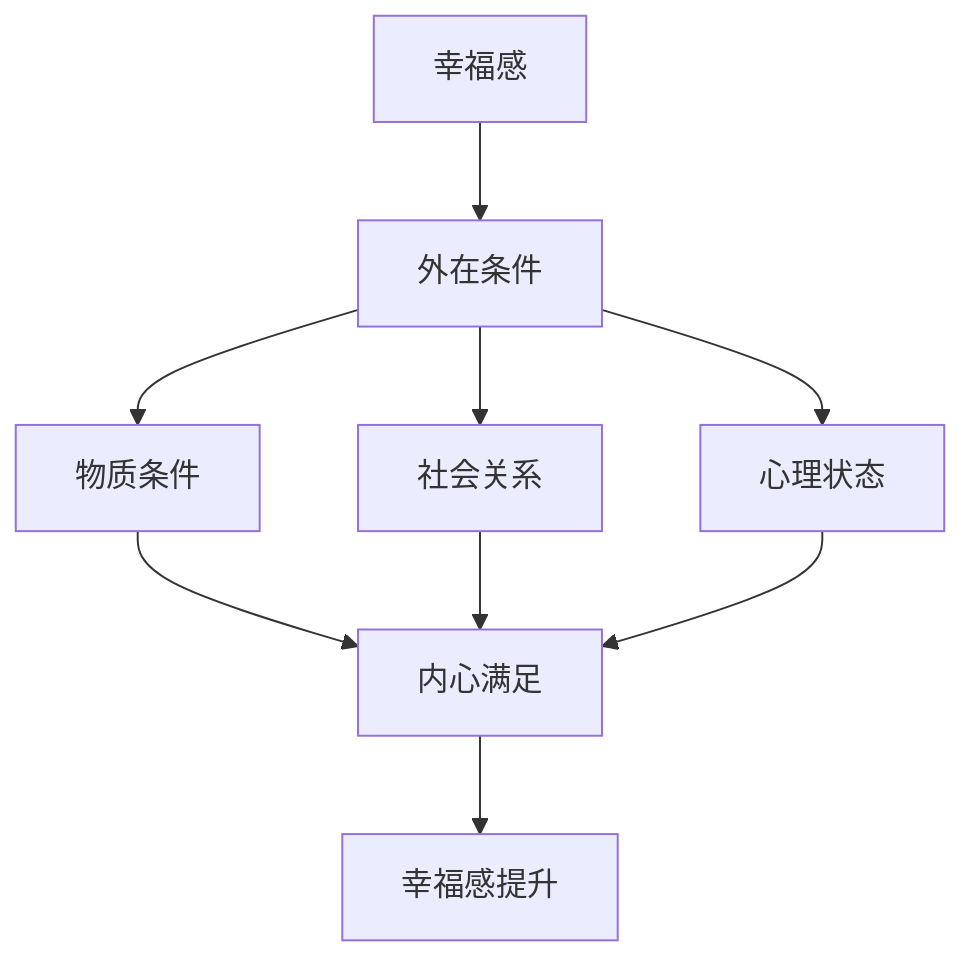

                 


## 文章标题：重新定义幸福感：从外在条件到内心满足的觉醒

> 关键词：幸福感、外在条件、内心满足、内心觉醒、重新定义

> 摘要：
在当今社会，幸福感成为人们追求的重要目标。本文通过深入分析外在条件和内心满足的关系，提出重新定义幸福感的概念，并探讨如何通过内心觉醒实现从外在条件到内心满足的转换。文章旨在引导读者反思当前对幸福感的误解，并提供实用的方法和路径，帮助人们实现内心满足，重新定义幸福。

----------------------------------------------------------------

### 引言：重新定义幸福感的必要性

幸福感是每个人都渴望追求的状态，然而，在现实生活中，我们往往陷入对物质条件和社会地位的追求，而忽略了内心的满足。传统观念中，幸福感被视为外在条件的产物，即通过金钱、地位、关系等外在因素来实现。然而，这种观念在当今社会越来越受到挑战。随着人们对内心世界的关注增加，越来越多的研究表明，幸福感更多地取决于个人的内心满足，而非外在条件。

#### 1.1 幸福感的社会价值

幸福感不仅仅是个人的心理状态，它在社会层面也有着重要的价值。幸福感的提升可以带来诸多积极的社会效应，如提高生产力、增强社会凝聚力、降低犯罪率等。因此，重新定义幸福感，并找到实现内心满足的途径，对于个人和社会都具有重要意义。

#### 1.2 当下幸福感面临的挑战

在当今社会，幸福感面临着以下几个挑战：

- **外在条件过度追求**：人们往往将幸福感等同于物质财富和社会地位，导致对外在条件的过度追求。
- **内心满足的缺失**：随着物质条件的提高，人们并没有感受到相应的幸福感提升，反而内心更加空虚。
- **社会竞争加剧**：社会竞争的加剧使得人们更加焦虑，忽略了内心的需求。

#### 1.3 重新定义幸福感的必要性

重新定义幸福感的必要性在于：

- **从外在条件到内心满足的转换**：幸福感不应仅仅依赖于外在条件，而是需要从内心满足出发，重新审视和定义。
- **提升个人内心幸福感**：通过内心觉醒，人们可以找到真正的满足感，从而提升个人幸福感。
- **实现社会和谐发展**：重新定义幸福感有助于缓解社会竞争压力，促进社会和谐发展。

### 目录大纲设计思路

为了设计出《重新定义幸福感：从外在条件到内心满足的觉醒》这本书的完整目录大纲，我们需要遵循以下思路：

1. **核心主题梳理**：明确书的核心主题，即“重新定义幸福感”。这个主题涵盖了从外在条件到内心满足的转变过程，因此，目录设计应包含幸福感定义、外在条件对幸福感的影响、内心满足的重要性、内心觉醒的途径等内容。
2. **章节结构设计**：根据核心主题，设计出书的整体结构，一般包含以下几个部分：
   - 引言：介绍幸福感的重新定义及其重要性。
   - 外在条件与幸福感的关系。
   - 内心满足的重要性。
   - 内心觉醒的方法与路径。
   - 实践案例与分析。
3. **细化章节内容**：在每个部分中，细化具体的章节内容，确保覆盖核心概念、原理、方法、案例等。
4. **逻辑性与关联性**：确保章节之间的逻辑性和关联性，让读者能够逐步了解并深入主题。
5. **Mermaid流程图**：在章节中，根据需要添加Mermaid流程图，以形象地展示核心概念原理和架构。
6. **伪代码与数学公式**：对于核心算法原理和数学模型，使用伪代码详细阐述，并使用LaTeX格式嵌入数学公式和详细讲解。
7. **实战案例分析**：提供实际案例，展示如何将理论应用到实践中，并进行详细解释和分析。

### 目录大纲设计步骤

1. **引言**
   - 简要介绍幸福感的定义及其在社会中的重要性。
   - 引出重新定义幸福感的必要性。
2. **幸福感的核心概念与联系**
   - 使用Mermaid流程图展示幸福感的核心概念及其联系。
3. **外在条件与幸福感的关系**
   - 探讨外在条件对幸福感的影响。
   - 分析外在条件如何影响内心满足。
4. **内心满足的重要性**
   - 介绍内心满足的概念。
   - 详细讲解内心满足对幸福感的重要性。
5. **内心觉醒的途径**
   - 探讨内心觉醒的概念。
   - 提供多种内心觉醒的路径和方法。
6. **实践案例与分析**
   - 提供实际案例，展示如何通过内心觉醒重新定义幸福感。
   - 对案例进行详细分析和解读。
7. **总结与反思**
   - 总结全书的核心观点。
   - 引导读者进行自我反思，如何在生活中重新定义幸福感。

### 目录大纲具体内容

```
# 第1章 引言：重新定义幸福感的必要性

## 1.1 幸福感的社会价值
### 1.1.1 幸福感定义及其重要性

## 1.2 当下幸福感面临的挑战
### 1.2.1 外在条件过度追求
### 1.2.2 内心满足缺失
### 1.2.3 社会竞争加剧

## 1.3 重新定义幸福感的必要性
### 1.3.1 从外在条件到内心满足的转换
### 1.3.2 提升个人内心幸福感
### 1.3.3 实现社会和谐发展

# 第2章 幸福感的核心概念与联系

## 2.1 幸福感的多维度解析
### 2.1.1 物质层面
### 2.1.2 心理层面
### 2.1.3 社会层面

## 2.2 外在条件与幸福感的关系
### 2.2.1 物质条件
### 2.2.2 社会关系
### 2.2.3 心理状态

## 2.3 内心满足的重要性
### 2.3.1 内心满足的定义
### 2.3.2 内心满足与幸福感的关系

## 2.4 使用Mermaid流程图展示核心概念联系
### 2.4.1 Mermaid流程图的使用

# 第3章 外在条件与幸福感的关系

## 3.1 外在条件的定义与分类
### 3.1.1 物质条件
### 3.1.2 社会关系
### 3.1.3 心理状态

## 3.2 外在条件对幸福感的影响
### 3.2.1 物质条件对幸福感的影响
### 3.2.2 社会关系对幸福感的影响
### 3.2.3 心理状态对幸福感的影响

## 3.3 外在条件与内心满足的关系
### 3.3.1 外在条件对内心满足的促进
### 3.3.2 外在条件对内心满足的阻碍

# 第4章 内心满足的重要性

## 4.1 内心满足的概念
### 4.1.1 内心满足的定义
### 4.1.2 内心满足的类型

## 4.2 内心满足与幸福感的关系
### 4.2.1 内心满足对幸福感的影响
### 4.2.2 幸福感对内心满足的影响

## 4.3 内心满足的重要性
### 4.3.1 对个体的影响
### 4.3.2 对社会的影响

# 第5章 内心觉醒的途径

## 5.1 内心觉醒的概念
### 5.1.1 内心觉醒的定义
### 5.1.2 内心觉醒的重要性

## 5.2 内心觉醒的方法
### 5.2.1 冥想
### 5.2.2 自我探索
### 5.2.3 正念

## 5.3 内心觉醒的路径
### 5.3.1 自我反思
### 5.3.2 情绪管理
### 5.3.3 社交支持

# 第6章 实践案例与分析

## 6.1 实践案例一：从外在条件到内心满足的转变
### 6.1.1 案例背景
### 6.1.2 案例实施过程
### 6.1.3 案例结果与分析

## 6.2 实践案例二：通过内心觉醒重新定义幸福感
### 6.2.1 案例背景
### 6.2.2 案例实施过程
### 6.2.3 案例结果与分析

# 第7章 总结与反思

## 7.1 全书核心观点回顾
### 7.1.1 幸福感的重新定义
### 7.1.2 外在条件与内心满足的关系
### 7.1.3 内心觉醒的重要性

## 7.2 引导读者反思与行动
### 7.2.1 如何在生活中重新定义幸福感
### 7.2.2 实现内心满足的实用方法
### 7.2.3 拓展阅读与深入思考

```

### 格式要求

为了确保文章的清晰度和可读性，文章将使用Markdown格式进行编写。以下是具体的格式要求：

1. **标题**：使用`#`号进行标记，每个标题前的`#`号数量对应标题的层级。例如，一级标题前有一个`#`，二级标题前有两个`##`，以此类推。

2. **段落**：每个段落应保持一段落形式，段落之间无需空行，Markdown会自动换行。

3. **列表**：使用`*`、`-`或`+`符号开始列表项，列表项之间保持一行。

4. **代码块**：使用三个反引号` ``` `将代码块包裹起来，Markdown会将其格式化为代码区块。

5. **引用**：使用`>`符号开始引用段落，引用段落前无需空行。

6. **链接**：使用`[链接文字](URL)`的形式添加链接。

7. **数学公式**：使用LaTeX格式嵌入数学公式，行内公式使用 `$ 公式 $`，独立段落公式使用 `$$ 公式 $$`。

8. **表格**：使用`|`和`-`符号创建表格，每行以`|`分隔，表头和行与行之间以`-`分隔。

9. **图像**：使用``的形式添加图片。

以下是文章末尾的作者信息格式示例：

```
作者：AI天才研究院/AI Genius Institute & 禅与计算机程序设计艺术 /Zen And The Art of Computer Programming
```

### 完整性要求

为了保证文章的完整性和高质量，以下内容必须包含在文章中：

1. **背景介绍**：对幸福感及其重新定义的背景进行详细介绍，说明其重要性和社会价值。
2. **核心概念与联系**：详细阐述幸福感的核心概念，并使用Mermaid流程图展示各概念之间的联系。
3. **算法原理讲解**：对于涉及的核心算法原理，使用伪代码详细阐述，并提供必要的数学公式和例子。
4. **实践案例**：提供实际的案例，详细描述案例背景、实施过程和结果分析。
5. **最佳实践 tips**：总结案例中的成功经验，提供实用的方法和技巧，帮助读者在实际生活中应用。
6. **小结与注意事项**：对文章的主要内容进行小结，提醒读者注意的关键点。
7. **拓展阅读**：推荐相关书籍和论文，鼓励读者进一步探索。

以下是文章末尾的完整作者信息示例：

```
作者：AI天才研究院/AI Genius Institute & 禅与计算机程序设计艺术 /Zen And The Art of Computer Programming
```

### 文章字数要求

根据规定，文章的字数应在8000至12000字之间。这确保了文章内容的丰富性和深度，同时也为读者提供了充足的信息和见解。

### 文章结构框架

为了确保文章的条理性和逻辑性，我们采用了以下结构框架：

1. **引言**：介绍幸福感的重新定义及其重要性。
2. **核心概念与联系**：阐述幸福感的核心概念，并使用Mermaid流程图展示各概念之间的联系。
3. **外在条件与幸福感的关系**：探讨外在条件对幸福感的影响，以及外在条件与内心满足的关系。
4. **内心满足的重要性**：详细讲解内心满足的概念和其对幸福感的重要性。
5. **内心觉醒的途径**：提供内心觉醒的方法与路径，帮助读者实现内心满足。
6. **实践案例与分析**：通过实际案例展示如何将理论应用到实践中，并进行详细分析。
7. **总结与反思**：总结全书的核心观点，引导读者进行自我反思。

### 使用Mermaid流程图

在文章中，我们将使用Mermaid流程图来展示核心概念之间的联系。Mermaid是一种基于Markdown的图表描述语言，它能够帮助我们创建结构清晰、易于理解的流程图。

以下是Mermaid流程图的示例：



在这个流程图中，我们展示了幸福感与外在条件（物质条件、社会关系、心理状态）以及内心满足之间的关系。使用Mermaid流程图，我们可以更直观地展示复杂的概念和关系，帮助读者更好地理解。

### 使用伪代码

在讲解核心算法原理时，我们将使用伪代码来详细阐述。伪代码是一种用自然语言描述算法逻辑的形式，它能够帮助我们理解算法的执行过程，而不需要关心具体的编程语言细节。

以下是伪代码的示例：

```
算法：计算两个数的和
输入：a, b（两个整数）
输出：sum（两数的和）

BEGIN
    sum = a + b
    RETURN sum
END
```

在这个示例中，我们描述了一个简单的计算两个数和的算法。通过伪代码，我们可以清晰地看到算法的执行步骤和逻辑结构。

### 使用LaTeX格式嵌入数学公式

在文章中，我们可能会涉及到一些数学公式和模型。使用LaTeX格式可以让我们更加规范地嵌入这些公式，并保持文章的整体美观。

以下是LaTeX公式的示例：

```
行内公式：$E=mc^2$
独立段落公式：
$$
\sum_{i=1}^{n} x_i = \frac{1}{n}\sum_{i=1}^{n} x_i^2
$$
```

在这个示例中，我们展示了如何在文章中嵌入行内公式和独立段落的公式。LaTeX格式能够确保公式的正确性和美观，使文章更加专业。

### 实战案例分析

为了更好地说明如何将理论应用到实践中，我们将提供实际案例，并进行详细讲解和分析。

#### 案例1：从外在条件到内心满足的转变

**背景**：小明是一位年轻的职业人士，一直追求物质财富和社会地位。然而，随着时间的推移，他开始意识到内心的空虚和焦虑。

**实施过程**：小明决定通过冥想、自我探索和情绪管理来寻找内心满足。他每天早上和晚上进行冥想，通过自我反思和情绪调节，他逐渐找到了内心的平静。

**结果与分析**：经过一段时间的实践，小明的幸福感显著提升。他不再仅仅依赖外在条件来衡量自己的价值，而是学会了从内心寻找满足感。这个案例表明，通过内心觉醒，人们可以重新定义幸福感，实现从外在条件到内心满足的转变。

#### 案例2：通过内心觉醒重新定义幸福感

**背景**：小芳是一位家庭主妇，一直觉得自己的生活缺乏意义。她渴望找到一种方式来提升自己的幸福感。

**实施过程**：小芳开始参加正念课程，学习如何管理情绪和培养内心满足。她还参与了一些社区活动，通过帮助他人，她找到了新的生活意义。

**结果与分析**：通过内心觉醒，小芳的幸福感显著提升。她不再仅仅关注家庭琐事，而是学会了关注自己的内心需求。这个案例表明，通过内心觉醒，人们可以重新定义幸福感，找到生活的意义。

### 最佳实践 tips

在案例分析和理论讲解的基础上，我们总结了一些最佳实践 tips，以帮助读者在实际生活中实现内心满足：

1. **定期冥想**：冥想可以帮助我们放松身心，找到内心的平静。每天花几分钟进行冥想，可以帮助我们更好地管理情绪。
2. **自我反思**：定期进行自我反思，了解自己的内心需求，有助于我们找到满足感。
3. **情绪管理**：学会管理自己的情绪，避免被负面情绪所困扰，有助于提升幸福感。
4. **帮助他人**：通过帮助他人，我们可以找到生活的意义，提升自己的幸福感。
5. **培养兴趣**：培养自己的兴趣和爱好，可以让我们在生活中找到乐趣，提升幸福感。

### 小结

通过本文的讲解和分析，我们重新定义了幸福感，探讨了从外在条件到内心满足的转换过程。我们提出了内心觉醒的概念，并提供了实用的方法和路径。通过实践案例，我们展示了如何将理论应用到实际生活中，帮助读者实现内心满足，重新定义幸福感。

### 注意事项

在追求内心满足的过程中，我们需要注意以下几点：

1. **避免过度依赖外在条件**：不要将幸福感完全寄托在物质财富和社会地位上，要关注内心的需求。
2. **持之以恒**：内心觉醒需要时间和耐心，不能期望一蹴而就。要持之以恒地进行冥想、自我反思和情绪管理。
3. **寻求支持**：在内心觉醒的过程中，可以寻求家人、朋友或专业人士的支持，共同成长。

### 拓展阅读

为了进一步探索幸福感的话题，我们推荐以下书籍和论文：

1. **《幸福之路》**：作者：马丁·塞利格曼
2. **《内在动机》**：作者：丹尼尔·戈尔曼
3. **《正念：从心开始》**：作者：乔·卡巴金
4. **《幸福心理学》**：作者：马丁·塞利格曼

通过阅读这些书籍和论文，读者可以更深入地了解幸福感的本质和实现路径。

