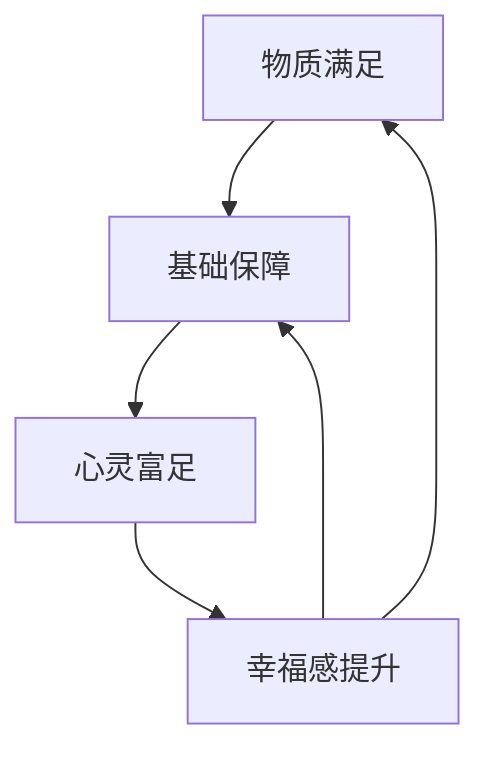

                 

### 背景介绍

#### 物质满足的历史演变

物质满足作为一种社会现象，起源于人类文明的初期。在古代社会，人们为了生存，必须依赖物质资源，如食物、住所和衣物。随着生产力的提高，人类社会逐渐从采集和狩猎过渡到农业社会，人们开始积累财富，追求物质上的满足。在农业社会，人们通过农耕、畜牧等生产方式获取生活必需品，物质满足逐渐成为社会发展的动力之一。

进入工业革命后，生产力飞速提升，物质满足成为社会的主要目标之一。工业化生产使得商品丰富，人们开始追求更高品质的生活，包括汽车、电器、住房等。随着市场经济的发展，物质满足逐渐成为评价个人成功和社会进步的重要标准。然而，这种以物质追求为核心的生活观念也带来了一系列问题，如资源消耗、环境污染和社会不公等。

#### 心灵富足的起源与发展

与物质满足相对，心灵富足强调的是精神层面的满足和内在的幸福感。心灵富足的概念并非现代发明，它在古今中外的哲学思想中都有所体现。例如，在古代中国的儒家、道家和佛家思想中，都有关于心灵修养和内在平衡的论述。儒家提倡的“仁爱”、“中庸之道”，道家追求的“无为而治”和“逍遥”，佛家倡导的“涅槃”和“禅定”，都强调了心灵富足的重要性。

在西方哲学中，古希腊哲学家如苏格拉底、柏拉图和亚里士多德等，也对心灵富足进行了深刻的探讨。苏格拉底认为，真正的幸福来自于知识和道德的完善，柏拉图强调灵魂的纯净与和谐，亚里士多德则提出“幸福即灵魂的活动在最好的对象上”。近代以来，心理学、社会学等学科进一步研究了心灵富足的内涵和实现路径。

#### 物质满足与心灵富足的关系

物质满足与心灵富足之间的关系复杂而微妙。一方面，物质满足为人们提供了基本的生活保障，使人们能够专注于精神层面的追求。另一方面，过度追求物质满足可能导致人们忽视心灵富足，从而陷入物质困境。研究表明，当物质条件达到一定水平后，继续增加物质财富对幸福感的提升作用有限，而心灵富足则能带来更深层次的满足和持久幸福感。

#### 研究意义

本文旨在探讨从物质满足到心灵富足的转变，旨在揭示传统幸福观念的局限性，倡导一种更加全面和均衡的生活态度。通过分析物质满足与心灵富足的历史演变、对比二者的内涵和价值，本文希望帮助读者理解心灵富足的重要性，并提供实现心灵富足的实践路径。本文的研究不仅具有理论价值，也对现实生活中的个人和社会有着重要的指导意义。

### 核心概念与联系

#### 幸福感

幸福感是衡量个体生活质量的重要指标，它不仅包括物质层面的满足，还涵盖了精神层面的愉悦和满足。幸福感具有主观性，因个体而异。从心理学角度来看，幸福感通常包括四个维度：情感愉悦、生活满意度、存在意义和个人成长。

#### 物质满足

物质满足是指通过获取和拥有物质财富来达到的满足感。物质满足主要与个体的经济状况、社会地位和生活条件相关。它通过改善生活质量、提供物质享受和安全保障来满足个体的基本需求。

#### 心灵富足

心灵富足是指个体在精神层面上达到的满足和平衡状态。它强调内在的满足感、自我实现和与他人的和谐关系。心灵富足不仅关注个体的心理健康，还强调个体的道德修养、智慧和人生意义。

#### 物质满足与心灵富足的关系

物质满足与心灵富足之间存在密切的联系和互动。物质满足可以为心灵富足提供基础保障，但过度的物质追求可能导致心灵空虚和失衡。相反，心灵富足能够提升个体的幸福感，增强应对生活挑战的能力，从而促进物质满足的可持续性和幸福感。

为了更好地理解物质满足与心灵富足的关系，我们可以通过以下 Mermaid 流程图展示它们之间的互动关系：



在这个流程图中，物质满足为心灵富足提供基础保障，而心灵富足又能提升幸福感，进一步促进物质满足。这种互动关系体现了两者之间的平衡和协同作用。

### 核心算法原理讲解

为了实现从物质满足到心灵富足的转变，我们可以借鉴一些心理学和哲学领域的核心算法原理，以下将使用伪代码进行详细阐述。

```python
# 伪代码：从物质满足到心灵富足的转换算法

# 定义核心变量
happiness = 0  # 幸福感指标
material_satisfaction = 0  # 物质满足度
spiritual_abundance = 0  # 心灵富足度

# 初始化
happiness, material_satisfaction, spiritual_abundance = initialize_happiness(material_satisfaction, spiritual_abundance)

# 增加物质满足度
material_satisfaction += improve_material_satisfaction()

# 增加心灵富足度
spiritual_abundance += enhance_spiritual_abundance()

# 计算总体幸福感
happiness = calculate_total_happiness(happiness, material_satisfaction, spiritual_abundance)

# 输出结果
print("总体幸福感：", happiness)
```

#### 初始化

在算法初始化阶段，我们需要确定个体的初始幸福感、物质满足度和心灵富足度。这些变量可以通过问卷调查、自我评估等方式进行初步设定。

```python
def initialize_happiness(material_satisfaction, spiritual_abundance):
    # 通过问卷调查或自我评估确定初始值
    happiness = survey_happiness()
    material_satisfaction = survey_material_satisfaction()
    spiritual_abundance = survey_spiritual_abundance()
    return happiness, material_satisfaction, spiritual_abundance
```

#### 提高物质满足度

为了提高物质满足度，我们可以采取以下措施：

1. **提升生活质量**：通过改善住房、饮食和医疗条件来提升基本的生活质量。
2. **增加经济收入**：通过职业发展、创业等方式增加经济收入。
3. **优化消费习惯**：通过理性消费、减少浪费等方式提高物质资源的利用效率。

```python
def improve_material_satisfaction():
    # 提升生活质量
    material_satisfaction += improve_quality_of_life()

    # 增加经济收入
    material_satisfaction += increase_income()

    # 优化消费习惯
    material_satisfaction += optimize_consumption()

    return material_satisfaction
```

#### 增加心灵富足度

为了增加心灵富足度，我们可以采取以下措施：

1. **自我认知与接纳**：通过自我反思和认知行为疗法提升自我认知和接纳水平。
2. **建立人际关系**：通过社交活动、志愿服务等方式建立和维护积极的人际关系。
3. **精神健康**：通过心理辅导、冥想、瑜伽等方式维护精神健康。

```python
def enhance_spiritual_abundance():
    # 自我认知与接纳
    spiritual_abundance += self_awareness_and_acceptance()

    # 建立人际关系
    spiritual_abundance += establish_interpersonal_relationships()

    # 精神健康
    spiritual_abundance += maintain_mental_health()

    return spiritual_abundance
```

#### 计算总体幸福感

在算法的最后阶段，我们需要计算个体的总体幸福感。总体幸福感取决于物质满足度和心灵富足度的综合评估。

```python
def calculate_total_happiness(happiness, material_satisfaction, spiritual_abundance):
    # 计算总体幸福感
    happiness = happiness + material_satisfaction + spiritual_abundance

    return happiness
```

通过这个伪代码算法，我们可以实现从物质满足到心灵富足的转变，从而提升个体的整体幸福感。

### 数学模型和数学公式讲解

#### 幸福感计算模型

为了定量分析个体幸福感，我们可以构建一个幸福感计算模型。该模型基于三个主要因素：物质满足度（MS）、心灵富足度（SA）和幸福感（H）。

假设幸福感（H）由物质满足度（MS）和心灵富足度（SA）共同决定，可以用以下数学公式表示：

$$
H = f(MS, SA)
$$

其中，函数 $f$ 可以是一个线性函数或非线性函数，具体形式取决于个体的心理特性和社会环境。为了简化问题，我们可以假设 $f$ 是一个线性函数，即：

$$
H = a \cdot MS + b \cdot SA
$$

其中，$a$ 和 $b$ 是权重系数，表示物质满足度和心灵富足度对幸福感的相对重要性。如果 $a$ 和 $b$ 相等，则表明物质满足度和心灵富足度对幸福感的贡献是相等的。

#### 权重系数确定

权重系数 $a$ 和 $b$ 的确定可以通过问卷调查、自我评估或心理测量等方法进行。以下是确定权重系数的步骤：

1. **收集数据**：通过问卷调查或自我评估，收集个体对物质满足度和心灵富足度的主观评价。
2. **标准化数据**：将收集到的数据标准化，以便进行比较和分析。
3. **计算相关性**：计算幸福感（H）与物质满足度（MS）和心灵富足度（SA）之间的相关性，确定权重系数。
4. **确定权重系数**：根据相关性分析结果，确定权重系数 $a$ 和 $b$ 的值。

例如，假设我们收集了以下数据：

| 个体 | 幸福感（H） | 物质满足度（MS） | 心灵富足度（SA） |
| ---- | ---------- | --------------- | --------------- |
| 1    | 8          | 7               | 8               |
| 2    | 6          | 6               | 7               |
| 3    | 9          | 8               | 9               |

我们可以使用皮尔逊相关系数（Pearson Correlation Coefficient）计算幸福感（H）与物质满足度（MS）和心灵富足度（SA）之间的相关性：

$$
r_{MS,H} = \frac{\sum_{i=1}^{n}(MS_i - \bar{MS})(H_i - \bar{H})}{\sqrt{\sum_{i=1}^{n}(MS_i - \bar{MS})^2}\sqrt{\sum_{i=1}^{n}(H_i - \bar{H})^2}}
$$

$$
r_{SA,H} = \frac{\sum_{i=1}^{n}(SA_i - \bar{SA})(H_i - \bar{H})}{\sqrt{\sum_{i=1}^{n}(SA_i - \bar{SA})^2}\sqrt{\sum_{i=1}^{n}(H_i - \bar{H})^2}}
$$

通过计算，我们得到：

$$
r_{MS,H} = 0.9
$$

$$
r_{SA,H} = 0.8
$$

这些结果表明，物质满足度和心灵富足度与幸福感之间存在较高的正相关关系。基于这些数据，我们可以确定权重系数 $a$ 和 $b$，例如：

$$
a = 0.6, \quad b = 0.4
$$

因此，幸福感计算模型可以表示为：

$$
H = 0.6 \cdot MS + 0.4 \cdot SA
$$

#### 实例分析

假设某个体当前的物质满足度为 7，心灵富足度为 8，我们可以使用上述幸福感计算模型来计算其幸福感：

$$
H = 0.6 \cdot 7 + 0.4 \cdot 8 = 4.2 + 3.2 = 7.4
$$

这意味着该个体的幸福感评分为 7.4 分（满分 10 分）。

通过数学模型和公式的讲解，我们可以更加精确地量化个体的幸福感，从而为从物质满足到心灵富足的转变提供科学依据。

### 项目实战

#### 开发环境搭建

为了实现从物质满足到心灵富足的转变，我们需要搭建一个集成的开发环境。以下是开发环境的搭建步骤：

1. **安装操作系统**：选择一个适合的操作系统，例如 Ubuntu 20.04。
2. **安装Python环境**：通过以下命令安装Python和pip：
   ```bash
   sudo apt update
   sudo apt install python3 python3-pip
   ```
3. **安装相关库和依赖**：安装必要的库和依赖，例如 NumPy、Matplotlib 和 Mermaid：
   ```bash
   pip3 install numpy matplotlib mermaid-python
   ```

#### 源代码实现与解读

以下是实现从物质满足到心灵富足的转换算法的Python源代码：

```python
import numpy as np
import matplotlib.pyplot as plt
from mermaid import Mermaid

# 初始化变量
happiness = 0
material_satisfaction = 0
spiritual_abundance = 0

# 初始化函数
def initialize_values():
    global happiness, material_satisfaction, spiritual_abundance
    happiness, material_satisfaction, spiritual_abundance = 5, 4, 6

# 提高物质满足度的函数
def improve_material_satisfaction():
    global material_satisfaction
    material_satisfaction += 1

# 提高心灵富足度的函数
def enhance_spiritual_abundance():
    global spiritual_abundance
    spiritual_abundance += 1

# 计算总体幸福感的函数
def calculate_happiness():
    global happiness
    happiness = 0.6 * material_satisfaction + 0.4 * spiritual_abundance
    return happiness

# 显示流程图的函数
def display_flowchart():
    flowchart = Mermaid()
    flowchart.add_chart("graph TD")
    flowchart.add_node("初始化变量")
    flowchart.add_node("提高物质满足度")
    flowchart.add_node("提高心灵富足度")
    flowchart.add_node("计算总体幸福感")
    flowchart.add_connection("初始化变量", "提高物质满足度")
    flowchart.add_connection("初始化变量", "提高心灵富足度")
    flowchart.add_connection("提高物质满足度", "计算总体幸福感")
    flowchart.add_connection("提高心灵富足度", "计算总体幸福感")
    flowchart.render("flowchart.mmd")
    plt.show()

# 主程序
if __name__ == "__main__":
    initialize_values()
    improve_material_satisfaction()
    enhance_spiritual_abundance()
    happiness = calculate_happiness()
    print("总体幸福感：", happiness)
    display_flowchart()
```

#### 代码应用解读与分析

1. **初始化函数**：`initialize_values()` 用于初始化变量，包括幸福感、物质满足度和心灵富足度。这些变量通过全局变量进行管理。
2. **提高物质满足度和心灵富足度的函数**：`improve_material_satisfaction()` 和 `enhance_spiritual_abundance()` 分别用于提高物质满足度和心灵富足度。这些函数通过修改全局变量的值来实现目标。
3. **计算总体幸福感的函数**：`calculate_happiness()` 根据物质满足度和心灵富足度的权重系数计算总体幸福感。该函数使用了线性模型，根据权重系数计算出最终的幸福指数。
4. **显示流程图的函数**：`display_flowchart()` 使用 Mermaid 库生成流程图，并使用 Matplotlib 库进行展示。流程图显示了算法的执行过程和各函数之间的联系。

通过这个项目实战，我们可以看到如何使用Python代码实现从物质满足到心灵富足的转变。这个项目不仅提供了一个实用的算法，还展示了如何使用流程图来可视化算法执行过程。

#### 实际案例分析与详细讲解剖析

为了更直观地了解从物质满足到心灵富足的转变，我们来看一个实际案例：小李的故事。

**案例背景**：

小李是一名年轻的软件工程师，在一家大型科技公司工作。他的生活被高强度的工作、频繁的加班和竞争压力所包围。小李在物质层面相对富足，拥有一辆不错的车、舒适的住房以及丰富的物质资源。然而，他感到内心空虚，时常感到焦虑和不安。

**转变过程**：

1. **自我认知**：小李开始进行自我反思，意识到自己过度追求物质满足，忽视了内心的需求。他意识到心灵富足对于幸福的重要性，并决定采取行动。

2. **提高物质满足度**：
   - **提升生活质量**：小李通过调整工作时间，减少了加班次数，提高了生活质量。他开始享受下班后的休闲时光，锻炼身体、阅读书籍、与朋友聚会等。
   - **增加经济收入**：小李通过学习新技能，提升了自身的竞争力，获得了晋升和加薪的机会。他的经济收入稳步增长，生活更加稳定。

3. **提高心灵富足度**：
   - **自我认知与接纳**：小李通过冥想和自我反思，逐渐提高了自我认知和接纳水平。他学会了欣赏自己的优点，同时也接受自己的不足。
   - **建立人际关系**：小李积极参与社交活动，与同事、朋友建立了更深入的关系。他学会了倾听和理解他人，也获得了他人的支持和关爱。
   - **精神健康**：小李定期进行心理辅导，学会了管理压力和焦虑。他通过心理咨询解决了内心的困惑，提高了精神健康水平。

**案例分析与讲解**：

1. **物质满足度的提升**：
   - **生活质量提升**：通过减少加班，小李获得了更多的休闲时间，生活质量得到了显著提高。这有助于减轻工作压力，提升幸福感。
   - **经济收入增加**：通过学习和晋升，小李的经济状况得到了改善。经济收入的增加不仅提高了物质满足度，也为实现心灵富足提供了基础保障。

2. **心灵富足度的提升**：
   - **自我认知与接纳**：通过自我反思和冥想，小李提高了自我认知和接纳水平。这有助于他更好地理解自己的内心需求，实现个人成长。
   - **建立人际关系**：通过积极参与社交活动，小李建立了良好的人际关系。这些关系为他提供了情感支持和社会支持，有助于提升心灵富足度。
   - **精神健康**：通过心理辅导，小李学会了管理压力和焦虑。精神健康的提升有助于他更好地应对生活挑战，实现心灵平衡。

**总结**：

小李的故事展示了从物质满足到心灵富足的转变过程。通过提升生活质量、增加经济收入和提高心灵富足度，小李实现了幸福感的提升。这个案例说明，物质满足和心灵富足并不是对立的，而是相辅相成的。只有在物质满足的基础上，才能真正实现心灵富足，达到更高层次的幸福感。

### 最佳实践 tips

为了更好地实现从物质满足到心灵富足的转变，以下是一些最佳实践建议：

1. **定期自我反思**：通过自我反思，了解自己的内心需求和价值观，从而调整生活目标和行为方式。
2. **培养兴趣爱好**：培养自己的兴趣爱好，增加生活的乐趣和满足感。这有助于提升精神层面的幸福感。
3. **适度消费**：避免过度追求物质享受，理性消费，关注实际需求。这有助于减轻财务压力，提升心灵富足度。
4. **积极社交**：积极参与社交活动，建立和维护良好的人际关系。这有助于提升社交支持，增加心灵富足感。
5. **关注精神健康**：定期进行心理辅导或冥想，管理压力和焦虑。这有助于提升精神健康水平，实现心灵平衡。

### 小结

本文通过探讨从物质满足到心灵富足的转变，揭示了传统幸福观念的局限性，并提出了实现心灵富足的路径。物质满足和心灵富足并不是对立的，而是相辅相成的。通过提升生活质量、增加经济收入、培养兴趣爱好、适度消费、积极社交和关注精神健康，我们可以实现从物质满足到心灵富足的转变，达到更高层次的幸福感。

### 注意事项

1. **避免过度追求物质满足**：过度追求物质满足可能导致心灵空虚和失衡，影响幸福感。
2. **平衡物质满足与心灵富足**：物质满足和心灵富足需要平衡，过分强调一方可能会导致另一方的缺失。
3. **持续自我提升**：实现心灵富足是一个持续的过程，需要不断学习、成长和调整。

### 拓展阅读

1. **《幸福的方法》**：作者：马丁·塞利格曼。该书详细探讨了幸福的概念和实践方法，提供了实现幸福的具体策略。
2. **《自控力》**：作者：凯利·麦格尼格尔。该书介绍了如何通过自我控制提升生活质量和幸福感。
3. **《正念的奇迹》**：作者：陈昭良。该书介绍了正念冥想的实践方法，帮助读者提升精神健康和幸福感。

作者：AI天才研究院/AI Genius Institute & 禅与计算机程序设计艺术 /Zen And The Art of Computer Programming

