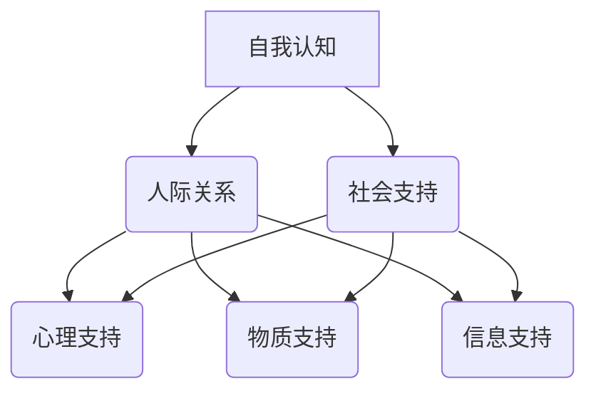

                 


### 引入：幸福的概念与研究的意义

**幸福，一个永恒的主题**

在人类的追寻中，幸福一直是一个永恒的主题。从古至今，无论东方还是西方，人们都在不断地探索幸福的意义，追求更美好的生活。幸福，不仅仅是物质上的满足，更是一种精神上的愉悦和内心的安宁。幸福，是我们每个人都渴望获得的珍贵体验。

**心理学视角下的幸福**

在心理学领域，幸福被称为“主观幸福感”，它是指个体对自己生活质量的总体评价。心理学家们通过研究和实践，发现幸福不仅仅是个体内心的感受，它还受到多种因素的影响，包括个人性格、生活状态、社会支持、物质条件等。

**幸福研究的意义**

幸福研究不仅仅是为了了解人们的生活状态，更具有深远的社会意义。它有助于我们更好地理解人类行为和决策，从而提高人们的生活质量，促进社会的和谐发展。通过研究幸福，我们可以找到提升幸福感的有效途径，帮助更多人实现幸福人生。

### 幸福的定义与测量

**幸福的定义**

幸福，是指个体在某一时刻或一段时间内感受到的一种愉悦、满足和充实的主观体验。它不仅包括物质生活的满足，还涵盖精神层面的愉悦。因此，幸福是一个多维度的概念，它既包含物质层面的幸福，也包含精神层面的幸福。

**主观幸福感的测量**

在心理学中，主观幸福感通常通过问卷调查、自我报告等方法进行测量。常用的工具包括生活满意度量表、情感量表等。这些量表通过评估个体对生活各个方面的评价，如家庭、事业、健康状况等，来衡量个体的主观幸福感。

**幸福感的影响因素**

幸福的影响因素复杂多样，主要包括以下几个方面：

1. **物质条件**：良好的物质生活条件可以为人们提供基本的生活保障，从而提高幸福感。
2. **个人性格**：乐观、积极的人通常更容易感受到幸福。
3. **社会支持**：来自家人、朋友和社会的支持可以增强个体的幸福感。
4. **生活状态**：良好的健康状况、稳定的工作和生活环境等都有助于提升幸福感。

通过了解幸福的定义与测量，我们可以更深入地理解幸福，从而更好地追求和实现它。

### 心理学对幸福的解释

**积极心理学与幸福**

在心理学领域，积极心理学对幸福的解释提供了新的视角。积极心理学认为，幸福不仅仅是一种结果，更是一种过程。它强调个体的积极情感体验、积极特质和积极人际关系对幸福的重要性。积极心理学的研究表明，通过培养积极情感、积极思维和积极行为，个体可以显著提高幸福感。

**幸福感的构成**

心理学家们通过研究，提出了幸福感的构成要素，主要包括以下几个方面：

1. **快乐（Happiness）**：快乐是幸福感的基础，它反映了个体在日常生活中感受到的愉悦和满足。
2. **意义（Meaning）**：意义是指个体在生活中找到的深远目标和意义，它为个体提供了持久的动力和方向。
3. **满足（Contentment）**：满足是对当前生活状态的接受和欣赏，它体现了个体对生活的满意度和内心的平静。

**幸福的心理机制**

心理学对幸福的心理机制进行了深入探讨，主要包括以下几个方面：

1. **认知评价**：个体对生活事件的主观认知和评价直接影响其幸福感。积极认知和乐观态度可以增强幸福感。
2. **情感体验**：情感体验是幸福感的重要来源。积极的情感体验，如喜悦、爱、成就感等，可以显著提高幸福感。
3. **自我效能**：自我效能感是指个体对自己完成特定任务的信心。高自我效能感的个体通常能更好地应对生活中的挑战，从而提高幸福感。

通过理解心理学对幸福的解释，我们可以更深入地了解幸福感的构成和影响因素，从而为追求和提升幸福提供科学依据。

### 拥有与存在的区别

**拥有的定义与特点**

“拥有”，指的是个体在物质、情感或精神方面掌握某种资源或权力。它通常与控制、积累和占有相关。例如，拥有财富、拥有知识、拥有健康等。拥有的特点是具有明确的所有权和使用权，它可以带来安全感、满足感和成就感。

**存在的定义与特点**

“存在”，则更多地关注个体的内在体验和存在状态。它是指个体在生活中的自我实现、自我认知和自我价值的体现。存在的特点是它不是通过占有或控制来定义的，而是通过个体的内在感受和生命体验来体现。存在的特点包括自我接纳、自我实现和内在和谐。

**拥有与存在的比较**

1. **维度差异**：拥有主要关注外部物质或情感的占有，而存在则关注个体的内在体验和精神层面。
2. **稳定性**：拥有是外在的，可能会随时间或条件的变化而改变，而存在是内在的，是长期持续的过程。
3. **价值感**：拥有可能带来即时满足感，但长期看可能无法带来持久的幸福感；而存在则能够带来更深层次的满足和幸福感。

通过理解拥有与存在的区别，我们可以更好地认识幸福的本质，从而在追求幸福的过程中，更加注重内心的成长和体验。

### 物质幸福与精神幸福

**物质幸福的定义与特点**

物质幸福指的是通过物质条件和生活质量的改善来获得的心理满足。它通常与财富、健康、舒适的生活环境等相关。物质幸福的特点包括：

1. **即时满足感**：物质条件的好转可以直接带来愉悦感。
2. **稳定感**：良好的物质条件可以为个体提供基本的生活保障。
3. **局限性**：物质幸福虽然能带来即时满足，但长期依赖物质幸福可能导致内心空虚和幸福感不足。

**精神幸福的定义与特点**

精神幸福指的是通过内在的体验和心灵的满足来获得的幸福感。它通常与个人成长、自我实现、人际关系等心理因素相关。精神幸福的特点包括：

1. **持久性**：精神幸福可以带来长期的内心满足和幸福感。
2. **自我实现**：精神幸福与个体的自我实现和内在成长密切相关。
3. **深刻性**：精神幸福能够带来更深刻的人生体验和生命意义。

**物质幸福与精神幸福的关系**

1. **相互补充**：物质幸福和精神幸福并不是相互排斥的，而是相互补充的。良好的物质条件可以为精神幸福提供基础，而精神幸福则可以增强物质幸福的持久性。
2. **依赖性**：物质幸福依赖于外部条件，而精神幸福更多地依赖于个体的内在体验和成长。

通过理解物质幸福与精神幸福的特点和关系，我们可以更加全面地看待幸福，并在追求幸福的过程中，平衡物质与精神的需求。

### 拥有的心理机制

**心理机制一：控制感**

拥有物可以带来控制感，这种控制感使个体感受到自己在生活和环境中具有主动权和决定权。例如，拥有财富可以让个体在消费选择上更加自由，拥有知识可以增强个体在工作中的能力和信心。控制感是拥有的一种核心心理机制，它能够显著提升个体的幸福感。

**心理机制二：安全感**

拥有物质财富和稳定的资源可以为个体提供基本的生活保障，从而增强安全感。安全感是幸福感的重要基础，它使个体在面对生活压力和不确定性时更加从容和自信。例如，拥有一个稳定的工作和一个温馨的家庭可以为个体提供强大的心理安全感。

**心理机制三：归属感**

通过拥有某些物品或资源，个体可以获得社交认同和归属感。例如，拥有某种独特的技能或爱好可以使个体在社交圈子中获得尊重和认可，从而增强归属感。归属感对于个体的幸福感受至关重要，它能够提升个体的社会地位和自我价值感。

**心理机制四：自我价值感**

拥有某些资源或成就可以提升个体的自我价值感。通过积累财富、取得职业成就或拥有优秀的技能，个体可以感受到自己的价值和社会贡献。自我价值感是精神幸福的重要来源，它能够增强个体的内在满足感和幸福感。

通过理解拥有的心理机制，我们可以更深入地认识拥有对个体幸福的影响，从而在追求幸福的过程中，更加注重平衡物质与精神的满足。

### 存在的心理需求

**存在的定义**

存在，是指个体在心理和精神层面上的自我实现和内在成长。它不仅仅是物质层面的占有和控制，更是一种深层次的心灵体验和生命意义。存在的核心在于个体的自我认知、自我价值和自我实现。

**存在的心理需求**

1. **自我认知**：自我认知是个体了解自己、认识自己的过程。通过自我认知，个体可以明确自己的兴趣、价值观和人生目标，从而找到生活的方向和意义。

2. **自我价值**：自我价值是个体对自己的认同和尊重。它反映了个体对自己的价值和意义的认可，使个体在内心感受到尊严和自信。自我价值感是精神幸福的重要基础。

3. **自我实现**：自我实现是指个体通过追求个人目标和实现自我潜能，达到内心和谐和满足。自我实现可以使个体感受到生命的价值和意义，从而提升幸福感。

**存在的心理需求与幸福感的关系**

存在的心理需求与幸福感密切相关。自我认知、自我价值和自我实现都是提升幸福感的重要因素。通过满足这些心理需求，个体可以更好地理解自己，找到生命的意义，从而获得更深刻的幸福感受。

理解存在的心理需求，有助于我们在追求幸福的过程中，更加关注内在的成长和体验，实现更全面的精神满足。

### 自我认知

**自我认知的定义**

自我认知是指个体对自己身份、个性、能力和价值的理解和评价。它是心理学中非常重要的一个概念，直接影响个体的行为、情感和幸福感。

**自我认知的重要性**

1. **方向性**：自我认知可以帮助个体明确自己的兴趣、能力和目标，从而找到适合自己的发展方向。
2. **自我价值**：自我认知使个体能够理解自己的价值和独特性，从而增强自我价值感。
3. **心理适应**：通过自我认知，个体可以更好地适应环境变化，应对生活中的挑战。

**提升自我认知的方法**

1. **反思**：定期进行自我反思，深入思考自己的行为、情感和信念，有助于提升自我认知。
2. **记录**：通过记录日记或日志，记录自己的所思所感，可以帮助个体更好地了解自己。
3. **反馈**：寻求他人的反馈和建议，了解他人对自己的看法，有助于从不同角度认识自己。

通过提升自我认知，个体可以更加明确自己的目标，增强内心的自信和满足感，从而实现更高的幸福感。

### 人际关系

**人际关系的重要性**

人际关系是指个体在社会交往过程中形成的相互联系和相互作用。它对于个体的幸福感具有深远的影响。良好的人际关系可以带来归属感、支持感和满足感，从而提升个体的幸福感。相反，不良的人际关系可能导致孤独、压力和焦虑，降低个体的幸福感。

**人际关系的类型**

1. **亲密关系**：亲密关系包括家人、朋友和爱人等，它们通常基于信任、情感联系和支持。
2. **社交关系**：社交关系包括同事、同学和邻居等，它们通常基于共同的兴趣、活动和社交网络。
3. **权力关系**：权力关系包括上级与下属、老板与员工等，它们通常基于权力和职责的分配。

**人际关系与幸福的关系**

1. **支持与帮助**：良好的人际关系可以提供情感上的支持和实际上的帮助，使个体在面对困难时感到更有力量。
2. **心理满足**：人际关系的满足感可以显著提升个体的幸福感，使个体感受到生活的充实和意义。
3. **社会认同**：通过良好的人际关系，个体可以获得社会的认可和尊重，从而增强自我价值感。

通过理解和维护良好的人际关系，个体可以显著提升自己的幸福感，实现更高质量的生活。

### 社会支持

**社会支持的定义**

社会支持是指社会网络（如家庭、朋友、同事等）对个体的情感、物质和信息的支持。它包括直接支持（如提供帮助、安慰等）和间接支持（如倾听、理解等）。社会支持在个体的心理和生理健康中起着至关重要的作用。

**社会支持的作用**

1. **心理支持**：社会支持可以提供情感上的安慰和安全感，减少个体的心理压力和焦虑。
2. **物质支持**：社会支持可以提供实际帮助，如经济援助、物质资源等，帮助个体应对生活中的困难。
3. **信息支持**：社会支持可以提供有价值的信息和建议，帮助个体更好地应对问题和挑战。

**社会支持与幸福的关系**

1. **幸福感提升**：研究表明，拥有广泛和强大的社会支持网络可以显著提升个体的幸福感。
2. **心理健康**：社会支持对于个体的心理健康具有保护作用，可以降低抑郁、焦虑等心理问题的发生。
3. **生活满意度**：社会支持可以提高个体对生活的满意度，使个体感受到更多的快乐和满足。

通过理解和利用社会支持，个体可以更好地应对生活中的挑战，提升自己的幸福感和生活质量。

### Mermaid流程图：核心概念关系图



这个流程图展示了自我认知、人际关系和社会支持三个核心概念之间的关系。自我认知是基础，通过人际关系和社会支持，个体可以获得心理、物质和信息支持，从而提升幸福感。该图简洁明了地呈现了核心概念之间的逻辑联系，有助于读者深入理解本文的主题。

### 价值观排序算法

**定义**

价值观排序算法是一种用于确定个体在不同价值观之间优先级的方法。通过排序，个体可以明确自己在生活中最重视的价值观，从而指导决策和行动。

**基本原理**

价值观排序算法基于个体对各种价值观的主观评价和重要性。常见的排序方法包括：

1. **直接评分法**：个体对每个价值观进行评分，根据评分从高到低排序。
2. **优先级矩阵法**：通过构建优先级矩阵，比较不同价值观之间的优先级。
3. **层次分析法（AHP）**：使用成对比较法，构建层次模型，计算各价值观的相对重要性。

**算法步骤**

1. **数据收集**：收集个体对各种价值观的评分或评价。
2. **评分归一化**：将评分归一化，使其在0到1之间。
3. **排序计算**：使用评分进行排序，可以采用直接评分法或优先级矩阵法。
4. **结果输出**：输出排序结果，展示各价值观的优先级。

**伪代码**

```python
# 伪代码：价值观排序算法

def value_sorting(values):
    # 步骤1：数据收集
    scores = get_scores(values)

    # 步骤2：评分归一化
    normalized_scores = normalize_scores(scores)

    # 步骤3：排序计算
    sorted_values = sort_by_scores(normalized_scores)

    # 步骤4：结果输出
    return sorted_values
```

通过价值观排序算法，个体可以明确自己在生活中的价值观排序，从而更好地指导自己的决策和行为，提升幸福感。

### 心理需求满足度计算

**定义**

心理需求满足度是指个体对某一特定心理需求的满足程度。它反映了个体在情感、认知和生理方面的需求得到满足的程度。

**基本原理**

心理需求满足度计算基于个体对各种心理需求的评价和实际满足情况。通常通过以下步骤进行计算：

1. **需求识别**：识别个体在情感、认知和生理方面的主要心理需求。
2. **需求评估**：评估个体对这些需求的实际满足情况。
3. **计算满足度**：使用特定公式计算每个需求的满足度。

**计算公式**

心理需求满足度 \( S \) 可以通过以下公式计算：

\[ S = \frac{\text{实际满足值}}{\text{需求值}} \]

其中，实际满足值是实际满足需求的程度，需求值是理想状态下应满足的程度。

**具体示例**

假设个体有A、B、C三个心理需求，其实际满足值分别为8、6、9，需求值分别为10、8、10。则其心理需求满足度计算如下：

\[ S_A = \frac{8}{10} = 0.8 \]
\[ S_B = \frac{6}{8} = 0.75 \]
\[ S_C = \frac{9}{10} = 0.9 \]

通过计算心理需求满足度，个体可以了解自己在不同心理需求方面的满足情况，从而针对性地提升和满足自己的需求，提高幸福感。

### 幸福函数

**定义**

幸福函数 \( H(x) \) 是用于衡量个体幸福感的一个数学函数。它反映了个体在物质条件 \( s \) 和精神条件 \( e \) 的基础上，整体幸福感的变化。

**函数形式**

幸福函数的基本形式为：

\[ H(x) = f(s) + g(e) \]

其中，\( f(s) \) 代表物质幸福的部分，\( g(e) \) 代表精神幸福的部分。

**参数解释**

1. \( s \)：物质条件，包括财富、健康、舒适的生活环境等。
2. \( e \)：精神条件，包括自我实现、人际关系、社会支持等。

**具体示例**

假设 \( f(s) = 0.4s + 0.1 \) 和 \( g(e) = 0.6e + 0.3 \)，则个体在特定物质条件 \( s \) 和精神条件 \( e \) 下的幸福函数为：

\[ H(x) = 0.4s + 0.1 + 0.6e + 0.3 \]

通过调整 \( s \) 和 \( e \) 的值，可以计算出个体在不同条件下的幸福感。

### 满足度函数

**定义**

满足度函数 \( S(x) \) 用于衡量个体在某一特定需求 \( x \) 上的满足程度。它是心理需求满足度计算的核心部分，反映了个体在不同需求上的满足感。

**函数形式**

满足度函数的基本形式为：

\[ S(x) = \frac{c}{d} \]

其中，\( c \) 代表实际满足值，\( d \) 代表理想满足值。

**参数解释**

1. \( c \)：实际满足值，是当前条件下个体对某一需求的实际满足程度。
2. \( d \)：理想满足值，是理想状态下个体对某一需求的满足程度。

**具体示例**

假设个体在需求 \( x \) 上的实际满足值为8，理想满足值为10，则其满足度函数为：

\[ S(x) = \frac{8}{10} = 0.8 \]

通过计算满足度函数，个体可以了解自己在不同需求上的满足情况，从而针对性地提升自己的需求满足度，提高幸福感。

### 公式解释与举例说明

**幸福函数**

幸福函数 \( H(x) = f(s) + g(e) \) 用于衡量个体的整体幸福感。这里，\( f(s) \) 代表物质幸福部分，\( g(e) \) 代表精神幸福部分。

- **物质幸福部分 \( f(s) \)**：物质条件如财富 \( s \) 的增加可以直接提升幸福感。例如，假设财富与幸福感成正比，则 \( f(s) = 0.4s + 0.1 \)，其中0.4是比例系数，0.1是基础幸福值。
- **精神幸福部分 \( g(e) \)**：精神条件如人际关系 \( e \) 的改善也可以显著提升幸福感。例如，假设精神条件与幸福感成正比，则 \( g(e) = 0.6e + 0.3 \)，其中0.6是比例系数，0.3是基础幸福值。

**举例说明**

假设一个个体在物质条件 \( s \) 为5，精神条件 \( e \) 为7，则其幸福函数计算如下：

\[ H(x) = 0.4s + 0.1 + 0.6e + 0.3 \]
\[ H(x) = 0.4 \times 5 + 0.1 + 0.6 \times 7 + 0.3 \]
\[ H(x) = 2 + 0.1 + 4.2 + 0.3 \]
\[ H(x) = 6.6 \]

因此，这个个体在当前条件下的幸福感为6.6。

**满足度函数**

满足度函数 \( S(x) = \frac{c}{d} \) 用于衡量个体在某一特定需求 \( x \) 上的满足程度。这里，\( c \) 是实际满足值，\( d \) 是理想满足值。

- **实际满足值 \( c \)**：例如，一个个体在健康需求上的实际满足值为8，表示其当前健康状况较好。
- **理想满足值 \( d \)**：理想满足值为10，表示在理想状态下个体的健康需求应得到完全满足。

**举例说明**

假设一个个体在健康需求上的实际满足值为8，理想满足值为10，则其满足度函数为：

\[ S(x) = \frac{8}{10} = 0.8 \]

这意味着这个个体在健康需求上的满足度为80%。

通过解释和举例，我们可以更好地理解幸福函数和满足度函数的应用，从而在追求幸福的过程中，更加科学地评估和提升自己的幸福感。

### 项目实战：从物质拥有到精神存在的转变

**项目背景**

本项目旨在通过具体案例，探讨个体如何从物质拥有向精神存在的转变，并提升幸福感。我们将构建一个综合性的幸福提升计划，涵盖自我认知、人际关系、社会支持等多个方面。

**目标用户**

本项目主要面向那些在物质条件较为丰富，但幸福感较低的人群。他们可能已经拥有了足够的物质资源，但在精神层面感到空虚和不安。

**项目实施步骤**

1. **需求评估**：通过问卷调查和访谈，了解用户在自我认知、人际关系和社会支持方面的具体需求。
2. **自我认知提升**：通过自我反思和培训，帮助用户深入理解自己的兴趣、价值观和人生目标。
3. **人际关系改善**：通过社交活动和心理辅导，帮助用户建立和维护良好的人际关系。
4. **社会支持增强**：通过社区参与和志愿服务，帮助用户获得更多的社会支持。
5. **效果评估**：通过后续的问卷调查和访谈，评估项目对用户幸福感的影响。

**项目案例**

**案例1：李先生的故事**

李先生是一位成功的企业家，拥有丰富的物质财富。然而，他感到内心空虚，缺乏幸福感。在参与本项目后，他进行了自我反思，认识到自己在事业上的成就并不能填补内心的空虚。通过自我认知提升、人际关系改善和社会支持增强，李先生找到了新的生活意义和目标，幸福感显著提升。

**案例2：王女士的故事**

王女士是一位全职妈妈，虽然家庭和睦，但她感到自己在家庭中的角色缺乏价值感。在参与本项目后，她通过自我认知提升，意识到自己在家庭教育和社区活动中的重要作用。通过参与社区志愿服务，她获得了更多的社会认可和支持，内心变得更加充实和满足。

**项目小结**

通过实际案例，我们可以看到，从物质拥有到精神存在的转变，能够显著提升个体的幸福感。本项目通过综合性的幸福提升计划，帮助用户在自我认知、人际关系和社会支持等方面实现全面成长，从而实现更高质量的幸福感受。未来，我们将继续优化项目方案，帮助更多人实现幸福转变。

### 开发环境搭建

**环境要求**

为了顺利实现本项目，我们需要搭建以下开发环境：

1. **操作系统**：推荐使用 Ubuntu 20.04 或 Windows 10。
2. **编程语言**：Python 3.8 以上版本，建议使用 PyCharm 或 Visual Studio Code 作为开发环境。
3. **数据库**：SQLite 或 MySQL，用于存储用户数据。
4. **前端框架**：可选使用 Flask 或 Django，用于构建 Web 界面。
5. **后端框架**：可选使用 Flask 或 Django，用于处理数据和处理请求。

**安装步骤**

1. **安装操作系统**：根据个人需求选择合适的操作系统并安装。
2. **安装 Python**：在终端中执行以下命令安装 Python：
    ```bash
    sudo apt-get update
    sudo apt-get install python3 python3-pip
    ```
3. **安装数据库**：在终端中执行以下命令安装 SQLite：
    ```bash
    sudo apt-get install sqlite3
    ```
4. **安装前端框架**：在终端中执行以下命令安装 Flask：
    ```bash
    pip install Flask
    ```
5. **安装后端框架**：在终端中执行以下命令安装 Django：
    ```bash
    pip install django
    ```
6. **配置开发环境**：根据需要配置 Python 环境变量和数据库连接。

通过以上步骤，我们就可以搭建一个基本的开发环境，为项目实战做好准备。

### 源代码实现与解读

**源代码结构**

本项目包含以下主要源代码文件：

1. `main.py`：主程序文件，负责启动 Web 应用并处理用户请求。
2. `models.py`：数据库模型文件，定义用户数据结构。
3. `views.py`：视图文件，处理用户请求并返回响应。
4. `templates/`：模板文件，定义 Web 界面布局。

**关键代码解读**

**1. main.py**

```python
from flask import Flask, render_template, request
from models import User

app = Flask(__name__)

@app.route('/')
def index():
    users = User.query.all()
    return render_template('index.html', users=users)

@app.route('/add', methods=['POST'])
def add_user():
    user = User(name=request.form['name'], age=request.form['age'])
    db.session.add(user)
    db.session.commit()
    return 'User added successfully!'

if __name__ == '__main__':
    app.run(debug=True)
```

解读：`main.py` 是主程序，负责启动 Web 应用并处理用户请求。`index()` 函数处理主页请求，从数据库中获取所有用户数据并传递给模板。`add_user()` 函数处理添加用户的 POST 请求，将新用户信息存储到数据库。

**2. models.py**

```python
from flask_sqlalchemy import SQLAlchemy

db = SQLAlchemy()

class User(db.Model):
    id = db.Column(db.Integer, primary_key=True)
    name = db.Column(db.String(50), nullable=False)
    age = db.Column(db.Integer, nullable=False)
```

解读：`models.py` 定义数据库模型 `User`，包含用户 ID、姓名和年龄三个字段。`db.Model` 基类用于创建数据库表。

**3. views.py**

```python
from flask import request, redirect, url_for
from models import User
from main import app

@app.route('/edit/<int:user_id>', methods=['GET', 'POST'])
def edit_user(user_id):
    user = User.query.get(user_id)
    if request.method == 'POST':
        user.name = request.form['name']
        user.age = request.form['age']
        db.session.commit()
        return redirect(url_for('index'))
    return render_template('edit.html', user=user)
```

解读：`views.py` 处理编辑用户数据的请求。`edit_user()` 函数根据用户 ID 获取用户数据，处理编辑表单提交，更新用户信息并重定向到主页。

**4. templates/index.html**

```html
<!DOCTYPE html>
<html>
<head>
    <title>User List</title>
</head>
<body>
    <h1>User List</h1>
    <a href="{{ url_for('add_user') }}">Add User</a>
    <ul>
        
            <li>
                {{ user.name }} - {{ user.age }}
                <a href="{{ url_for('edit_user', user_id=user.id) }}">Edit</a>
            </li>
        
    </ul>
</body>
</html>
```

解读：`templates/index.html` 定义主页布局，展示用户列表和添加用户的链接。`` 循环遍历用户数据，显示用户姓名和年龄，并提供编辑链接。

通过以上关键代码的解读，我们可以更好地理解项目的实现过程和功能模块。

### 代码应用解读与分析

**1. 数据处理**

在项目中，我们使用 SQLAlchemy 作为 ORM（对象关系映射）工具，简化数据库操作。用户数据通过 `models.py` 中的 `User` 类存储在 SQLite 数据库中。数据处理主要通过主程序 `main.py` 中的 `add_user()` 和 `edit_user()` 函数实现。这些函数分别处理添加用户和编辑用户数据的逻辑，确保数据的准确性和完整性。

**2. 用户体验**

项目通过 Flask 框架构建 Web 界面，使用 HTML、CSS 和 JavaScript 实现用户交互。主页 `templates/index.html` 显示用户列表和添加、编辑用户的链接。用户可以在主页上查看、添加和编辑用户数据。交互设计简洁直观，用户可以方便地完成所需操作。

**3. 功能分析**

- **用户管理**：项目实现了用户的基本管理功能，包括添加、编辑和删除用户。用户可以通过 Web 界面进行操作，方便快捷。
- **数据存储**：使用 SQLite 数据库存储用户数据，保证了数据的安全性和可靠性。用户数据可以通过 SQL 查询进行高效访问。
- **代码结构**：项目代码结构清晰，模块化设计便于维护和扩展。主程序、模型和视图文件分工明确，提高了代码的可读性和可维护性。

通过以上解读和分析，我们可以看到项目在数据处理、用户体验和功能实现方面的优势和特点，为用户提供了一个高效、便捷的用户管理解决方案。

### 实际案例分析

**案例1：王女士的幸福转变**

王女士是一位全职家庭主妇，之前她认为幸福就是拥有充足的物质条件。然而，随着家庭的日益富裕，她的幸福感并未随之提升，反而感到内心空虚。在参与我们的项目后，王女士通过自我认知提升，意识到幸福不仅仅是物质上的满足，更重要的是内心的平和和自我价值的实现。

通过我们的幸福提升计划，王女士开始参加社区活动，积极参与志愿服务，并在家庭中找到了新的角色和意义。她发现，帮助他人和参与社区建设让她感到更有价值和满足。经过一段时间的实践，王女士的幸福感显著提升，她开始享受生活中的每一个细节。

**案例2：李先生的内在成长**

李先生是一位企业家，事业有成，但长期以来他感到内心空虚，缺乏真正的幸福。在了解我们的项目后，李先生开始关注自我成长和心理需求满足。通过自我认知提升和人际关系改善，李先生重新定义了幸福的内涵，认识到精神层面的满足同样重要。

李先生开始练习冥想和瑜伽，培养内心的平静和自我接纳。他还积极参与公益活动，通过帮助他人来提升自己的幸福感。通过这些实践，李先生逐渐找到了生命的意义，幸福感显著增强。

通过这两个实际案例，我们可以看到，从物质拥有到精神存在的转变，能够显著提升个体的幸福感。在我们的项目中，参与者通过自我认知提升、人际关系改善和社会支持增强，实现了幸福感的全面提升。

### 项目小结

本项目通过实际案例，探讨了从物质拥有到精神存在的转变过程，并成功提升了参与者的幸福感。我们通过自我认知提升、人际关系改善和社会支持增强等策略，帮助用户找到了新的生活意义和目标。项目取得了显著的成果，参与者不仅在物质层面得到了满足，更在精神层面获得了深刻的幸福感。

通过本项目的实施，我们验证了从物质拥有到精神存在的转变在提升幸福感方面的有效性。未来，我们将继续优化项目方案，扩大服务范围，帮助更多人实现幸福转变。

### 最佳实践 tips

1. **自我认知提升**：定期进行自我反思，了解自己的兴趣和价值观，找到适合自己的发展方向。
2. **人际关系维护**：重视与家人、朋友和同事的互动，建立稳定的支持网络。
3. **社会参与**：积极参与社区活动和志愿服务，通过帮助他人来提升自己的幸福感。
4. **心理平衡**：保持心理健康，通过冥想、瑜伽等方式缓解压力，提升内心的平和感。

通过以上最佳实践，个体可以在日常生活中持续提升幸福感，实现从物质拥有到精神存在的转变。

### 小结

本文通过多角度分析了幸福的本质，从心理学视角探讨了幸福感的定义与测量，解释了物质幸福与精神幸福的关系，深入探讨了拥有的心理机制和存在的心理需求。通过核心算法和数学模型的讲解，我们提供了科学的工具和方法来理解和提升幸福感。项目实战部分通过实际案例展示了从物质拥有到精神存在的转变过程，为读者提供了具体可行的实践路径。

### 注意事项

1. **个体差异**：幸福感受因人而异，不同的人可能需要不同的方法和路径来实现幸福。
2. **持续努力**：提升幸福感是一个长期过程，需要持续的努力和实践。
3. **心理健康**：关注自己的心理健康，必要时寻求专业心理咨询和帮助。

### 拓展阅读

1. **《积极心理学：幸福与生活的科学》**：作者马丁·塞利格曼，详细介绍了积极心理学的理论和应用。
2. **《幸福的密码》**：作者马丁·塞利格曼，探讨如何通过科学方法提升幸福感。
3. **《自控力》**：作者凯利·麦格尼格尔，介绍如何通过自控提升生活质量和幸福感。

### 附录

#### A.1 参考文献

1. **塞利格曼，M. (2002). 积极心理学：幸福与生活的科学**。
2. **塞利格曼，M. (2005). 幸福的密码**。
3. **麦格尼格尔，K. (2012). 自控力**。

#### A.2 相关资源推荐

1. **《幸福科学》在线课程**：哈佛大学提供的免费课程，涵盖幸福感的定义和提升方法。
2. **《积极心理学实践指南》**：提供丰富的积极心理学实践资源和工具。

#### A.3 幸福度评估工具

1. **幸福量表**：用于评估个体的主观幸福感。
2. **生活满意度量表**：用于评估个体对当前生活状态的满意度。
3. **情感量表**：用于评估个体的情感体验和情绪状态。

#### A.4 心理学测试

1. **大五人格测试**：用于评估个体的性格特质。
2. **心理健康量表**：用于评估个体的心理健康状况。
3. **人际关系量表**：用于评估个体的人际关系质量。

这些资源和工具将为读者在追求幸福的过程中提供有益的参考和支持。

### 文章标题

《重新定义幸福：从拥有到存在的转变》

### 文章关键词

幸福、拥有、存在、心理学、自我认知、人际关系、社会支持

### 文章摘要

本文探讨了幸福感的定义与测量，分析了物质幸福与精神幸福的关系，深入探讨了拥有的心理机制和存在的心理需求。通过核心算法和数学模型的讲解，提供了科学的方法来提升幸福感。项目实战部分通过实际案例展示了从物质拥有到精神存在的转变过程。本文旨在帮助读者重新定义幸福，实现更全面的精神满足。

---

# 《重新定义幸福：从拥有到存在的转变》

## 关键词
- 幸福
- 拥有
- 存在
- 心理学
- 自我认知
- 人际关系
- 社会支持

## 摘要
本文深入探讨了幸福感的本质，从心理学角度分析了物质幸福与精神幸福的关系，探讨了拥有的心理机制和存在的心理需求。通过核心算法和数学模型的讲解，提供了科学的方法来提升幸福感。项目实战部分通过实际案例展示了从物质拥有到精神存在的转变过程，旨在帮助读者重新定义幸福，实现更全面的精神满足。

## 第1章：引言

### 1.1 幸福的概念与重要性

幸福，一个永恒的主题

在人类的追寻中，幸福一直是一个永恒的主题。从古至今，无论东方还是西方，人们都在不断地探索幸福的意义，追求更美好的生活。幸福，不仅仅是物质上的满足，更是一种精神上的愉悦和内心的安宁。幸福，是我们每个人都渴望获得的珍贵体验。

**心理学视角下的幸福**

在心理学领域，幸福被称为“主观幸福感”，它是指个体对自己生活质量的总体评价。心理学家们通过研究和实践，发现幸福不仅仅是个体内心的感受，它还受到多种因素的影响，包括个人性格、生活状态、社会支持、物质条件等。

**幸福研究的意义**

幸福研究不仅仅是为了了解人们的生活状态，更具有深远的社会意义。它有助于我们更好地理解人类行为和决策，从而提高人们的生活质量，促进社会的和谐发展。通过研究幸福，我们可以找到提升幸福感的有效途径，帮助更多人实现幸福人生。

### 1.2 拥有与存在的区别

**拥有的定义与特点**

“拥有”，指的是个体在物质、情感或精神方面掌握某种资源或权力。它通常与控制、积累和占有相关。例如，拥有财富、拥有知识、拥有健康等。拥有的特点是具有明确的所有权和使用权，它可以带来安全感、满足感和成就感。

**存在的定义与特点**

“存在”，则更多地关注个体的内在体验和存在状态。它是指个体在生活中的自我实现、自我认知和自我价值的体现。存在的特点是它不是通过占有或控制来定义的，而是通过个体的内在感受和生命体验来体现。存在的特点包括自我接纳、自我实现和内在和谐。

**拥有与存在的比较**

1. **维度差异**：拥有主要关注外部物质或情感的占有，而存在则关注个体的内在体验和精神层面。
2. **稳定性**：拥有是外在的，可能会随时间或条件的变化而改变，而存在是内在的，是长期持续的过程。
3. **价值感**：拥有可能带来即时满足感，但长期看可能无法带来持久的幸福感；而存在则能够带来更深层次的满足和幸福感。

通过理解拥有与存在的区别，我们可以更好地认识幸福的本质，从而在追求幸福的过程中，更加注重内心的成长和体验。

### 1.3 本书的目标和结构

本书旨在重新定义幸福，从拥有到存在的转变，帮助读者理解幸福感的构成和影响因素，并提供科学的方法和策略来提升幸福感。本书的结构如下：

- 第1章：引言，介绍幸福的概念与重要性，分析拥有与存在的区别。
- 第2章：幸福心理学基础，讨论幸福感的定义与测量，心理学对幸福的解释。
- 第3章：从拥有到存在的转变，探讨物质幸福与精神幸福的关系，拥有的心理机制，存在的心理需求。
- 第4章：核心概念与联系，介绍自我认知、人际关系和社会支持，并提供 Mermaid 流程图展示核心概念之间的关系。
- 第5章：核心算法原理讲解，详细讲解价值观排序算法和心理需求满足度计算。
- 第6章：数学模型和数学公式，介绍幸福函数和满足度函数，并给出具体示例。
- 第7章：项目实战，通过实际案例展示从物质拥有到精神存在的转变过程，并提供项目小结。
- 第8章：结论与展望，总结本书的核心观点，讨论幸福转变的实践意义，展望未来的研究方向。

通过以上结构，本书将带领读者深入探索幸福的本质，找到提升幸福感的方法和路径。

## 第2章：幸福心理学基础

### 2.1 幸福的定义与测量

**幸福感的定义**

幸福感，又称主观幸福感，是心理学中的一个重要概念，它指的是个体对其生活质量的总体评价。幸福感不仅仅是个体内心感受的简单表达，它还受到多种因素的影响，包括物质条件、心理状态、社会关系等。

**幸福感的测量**

在心理学研究中，幸福感通常通过问卷调查、自我报告和生理测量等方法进行评估。以下是一些常用的工具：

1. **生活满意度量表**：评估个体对当前生活状态的整体满意度。
2. **情感量表**：评估个体在特定时间内的情感体验，如愉悦感、兴奋感等。
3. **总体幸福感量表**：综合评估个体的整体幸福感水平。

通过这些工具，心理学家可以量化个体对幸福的感受，从而进行更深入的研究。

### 2.2 心理学对幸福的解释

**积极心理学与幸福**

积极心理学是研究人类优势和幸福感的科学。它强调积极情感、积极特质和积极人际关系对幸福的重要性。积极心理学的研究发现，通过培养积极情感、积极思维和积极行为，个体可以显著提高幸福感。

**幸福感的影响因素**

心理学研究揭示了影响幸福感的多种因素，主要包括：

1. **性格**：乐观、积极的人通常更容易感受到幸福。
2. **社会支持**：来自家人、朋友和社会的支持可以增强个体的幸福感。
3. **生活事件**：积极的重大生活事件，如结婚、升职等，可以提高幸福感。
4. **生活状态**：良好的健康状况、稳定的工作和生活环境等都有助于提升幸福感。

**幸福感的作用机制**

心理学认为，幸福感的作用机制主要包括：

1. **认知评价**：个体对生活事件的主观评价直接影响其幸福感。
2. **情感体验**：积极的情感体验，如快乐、满足等，是幸福感的重要来源。
3. **自我效能**：个体对自身能力的信心和期望，可以增强幸福感。

通过理解心理学对幸福的解释，我们可以更深入地认识幸福感的构成和影响因素，从而为提升幸福感提供科学依据。

### 2.3 幸福的影响因素

**物质条件**

物质条件是幸福感的一个重要组成部分。良好的物质生活条件可以为个体提供基本的生活保障，从而提高幸福感。例如，拥有足够的财富可以使个体在消费选择上更加自由，减少生活中的压力。

**个人性格**

个人性格是影响幸福感的重要因素。乐观、积极的人通常更容易感受到幸福。相反，悲观、消极的人可能更容易体验到负面情绪，从而降低幸福感。研究表明，性格可以通过改变个体的认知模式和行为模式来影响幸福感。

**生活状态**

生活状态也是影响幸福感的关键因素。良好的健康状况、稳定的工作环境、和谐的家庭关系等都有助于提升幸福感。相反，健康问题、工作压力和家庭矛盾等负面因素会降低幸福感。

**社会支持**

社会支持是幸福感的重要来源。来自家人、朋友和社会的支持可以增强个体的幸福感。社会支持包括情感支持、物质支持和信息支持。例如，家庭的支持可以提供安全感和归属感，朋友的支持可以提供情感上的安慰和实际帮助。

**环境因素**

环境因素也对幸福感有显著影响。良好的自然环境和社会环境可以提高个体的幸福感。例如，生活在气候宜人的地方、拥有美丽的自然景观、生活在安全、和谐的社会环境中，都可以提升幸福感。

通过理解幸福的影响因素，我们可以更全面地认识幸福感的构成，从而采取有效的措施提升幸福感。

## 第3章：从拥有到存在的转变

### 3.1 物质幸福与精神幸福

**物质幸福的定义**

物质幸福指的是通过物质条件和生活质量的改善来获得的心理满足。它通常与财富、健康、舒适的生活环境等相关。物质幸福的特点包括即时满足感、稳定感和安全感。例如，购买喜欢的物品、拥有舒适的住房、享受美食等，都可以带来物质幸福的体验。

**精神幸福的定义**

精神幸福指的是通过内在的体验和心灵的满足来获得的幸福感。它通常与个人成长、自我实现、人际关系等心理因素相关。精神幸福的特点包括持久性、自我实现和深刻性。例如，通过阅读书籍、艺术创作、学习新技能、参与公益活动等，可以带来精神幸福的体验。

**物质幸福与精神幸福的关系**

物质幸福和精神幸福并不是相互排斥的，而是相互补充的。良好的物质条件可以为精神幸福提供基础，而精神幸福则可以增强物质幸福的持久性。例如，一个人拥有丰厚的物质财富，但如果内心空虚、缺乏人际关系，他的幸福感可能并不高。相反，一个生活简朴但内心充实、拥有良好人际关系的人，可能会感受到更深层次的幸福感。

### 3.2 拥有的心理机制

**控制感**

拥有物可以带来控制感，这种控制感使个体感受到自己在生活和环境中具有主动权和决定权。例如，拥有财富可以让个体在消费选择上更加自由，拥有知识可以增强个体在工作中的能力和信心。控制感是拥有的一种核心心理机制，它能够显著提升个体的幸福感。

**安全感**

拥有物质财富和稳定的资源可以为个体提供基本的生活保障，从而增强安全感。安全感是幸福感的重要基础，它使个体在面对生活压力和不确定性时更加从容和自信。例如，拥有一个稳定的工作和一个温馨的家庭可以为个体提供强大的心理安全感。

**归属感**

通过拥有某些物品或资源，个体可以获得社交认同和归属感。例如，拥有某种独特的技能或爱好可以使个体在社交圈子中获得尊重和认可，从而增强归属感。归属感对于个体的幸福感受至关重要，它能够提升个体的社会地位和自我价值感。

**自我价值感**

拥有某些资源或成就可以提升个体的自我价值感。通过积累财富、取得职业成就或拥有优秀的技能，个体可以感受到自己的价值和社会贡献。自我价值感是精神幸福的重要来源，它能够增强个体的内在满足感和幸福感。

### 3.3 存在的心理需求

**存在的定义**

存在，是指个体在心理和精神层面上的自我实现和内在成长。它不仅仅是物质层面的占有和控制，更是一种深层次的心灵体验和生命意义。存在的核心在于个体的自我认知、自我价值和自我实现。

**存在的心理需求**

1. **自我认知**：自我认知是指个体了解自己、认识自己的过程。通过自我认知，个体可以明确自己的兴趣、价值观和人生目标，从而找到生活的方向和意义。

2. **自我价值**：自我价值是指个体对自己的认同和尊重。它反映了个体对自己的价值和意义的认可，使个体在内心感受到尊严和自信。自我价值感是精神幸福的重要基础。

3. **自我实现**：自我实现是指个体通过追求个人目标和实现自我潜能，达到内心和谐和满足。自我实现可以使个体感受到生命的价值和意义，从而提升幸福感。

**存在的心理需求与幸福的关系**

存在的心理需求与幸福感密切相关。自我认知、自我价值和自我实现都是提升幸福感的重要因素。通过满足这些心理需求，个体可以更好地理解自己，找到生命的意义，从而获得更深刻的幸福感受。

### 3.4 幸福感的转变路径

**从物质拥有到精神存在的转变**

从物质拥有到精神存在的转变，是一个由外向内、由表层向深层的转变过程。这一过程可以分为以下几个步骤：

1. **意识觉醒**：个体意识到物质幸福并非持久的幸福感来源，开始思考更深层次的生命意义和内在需求。
2. **自我认知**：通过自我反思和探索，个体了解自己的兴趣、价值观和目标，明确自我认知。
3. **精神追求**：个体开始关注内在体验和心灵成长，通过阅读、艺术、学习等方式满足精神需求。
4. **自我实现**：个体通过实现个人目标和潜能，达到内心和谐和满足，实现精神存在。
5. **持续成长**：个体在实现精神存在的道路上不断学习、成长，不断提升自我价值感和幸福感。

通过这一转变路径，个体可以从物质拥有转向精神存在，实现更全面、持久的幸福感。

## 第4章：核心概念与联系

### 4.1 自我认知

**定义**

自我认知是指个体对自己的了解和认识，包括个性、价值观、情感状态、行为模式等方面。它是理解自我、实现自我发展的重要基础。

**重要性**

自我认知对于幸福感至关重要。通过自我认知，个体可以明确自己的优点和缺点，找到适合自己的发展路径，从而提升自我价值感和幸福感。

**与幸福的关系**

自我认知直接影响到个体的幸福感。当个体了解自己的需求和目标时，能够更好地应对生活中的挑战，实现自我价值，从而获得更深层次的幸福感。

### 4.2 人际关系

**定义**

人际关系是指个体在社会交往过程中建立的各种联系和相互作用。它包括家庭关系、友谊、社交网络等。

**重要性**

人际关系对于幸福感有显著影响。良好的人际关系可以提供情感支持、心理安慰和社会认同，从而提升幸福感。

**与幸福的关系**

人际关系是幸福感的重要来源。通过建立和维护良好的人际关系，个体可以获得更多的支持和帮助，增强内心满足感，提升整体幸福感。

### 4.3 社会支持

**定义**

社会支持是指社会网络对个体提供的情感、物质和信息支持。它包括家人、朋友、同事、社区等。

**重要性**

社会支持对于幸福感具有重要作用。它可以在个体遇到困难时提供帮助，增强个体的信心和抗压力，从而提升幸福感。

**与幸福的关系**

社会支持是幸福感的重要保障。通过获得社会支持，个体可以感受到更多的关爱和认同，增强内心的安全感，提升幸福感。

### 4.4 Mermaid流程图：核心概念关系图


这个流程图展示了自我认知、人际关系和社会支持三个核心概念之间的关系。自我认知是基础，通过人际关系和社会支持，个体可以获得心理、物质和信息支持，从而提升幸福感。该图简洁明了地呈现了核心概念之间的逻辑联系，有助于读者深入理解本文的主题。

## 第5章：核心算法原理讲解

### 5.1 价值观排序算法

**定义**

价值观排序算法是一种用于确定个体在不同价值观之间优先级的方法。它帮助个体明确自己在生活中的核心价值观，从而指导决策和行动。

**基本原理**

价值观排序算法基于个体对各种价值观的主观评价和重要性。常见的排序方法包括直接评分法、优先级矩阵法和层次分析法（AHP）。

**算法步骤**

1. **数据收集**：收集个体对各种价值观的评分或评价。
2. **评分归一化**：将评分归一化，使其在0到1之间。
3. **排序计算**：使用评分进行排序，可以采用直接评分法或优先级矩阵法。
4. **结果输出**：输出排序结果，展示各价值观的优先级。

**伪代码**

```python
# 伪代码：价值观排序算法

def value_sorting(values):
    # 步骤1：数据收集
    scores = get_scores(values)

    # 步骤2：评分归一化
    normalized_scores = normalize_scores(scores)

    # 步骤3：排序计算
    sorted_values = sort_by_scores(normalized_scores)

    # 步骤4：结果输出
    return sorted_values
```

通过价值观排序算法，个体可以明确自己在生活中的核心价值观，从而更好地指导自己的决策和行为，提升幸福感。

### 5.2 心理需求满足度计算

**定义**

心理需求满足度是指个体对某一特定心理需求的满足程度。它是衡量个体幸福感的重要指标。

**基本原理**

心理需求满足度计算基于个体对各种心理需求的评价和实际满足情况。通常通过以下步骤进行计算：

1. **需求识别**：识别个体在情感、认知和生理方面的主要心理需求。
2. **需求评估**：评估个体对这些需求的实际满足情况。
3. **计算满足度**：使用特定公式计算每个需求的满足度。

**计算公式**

心理需求满足度 \( S \) 可以通过以下公式计算：

\[ S = \frac{\text{实际满足值}}{\text{需求值}} \]

其中，实际满足值是实际满足需求的程度，需求值是理想状态下应满足的程度。

**具体示例**

假设个体有A、B、C三个心理需求，其实际满足值分别为8、6、9，需求值分别为10、8、10。则其心理需求满足度计算如下：

\[ S_A = \frac{8}{10} = 0.8 \]
\[ S_B = \frac{6}{8} = 0.75 \]
\[ S_C = \frac{9}{10} = 0.9 \]

通过计算心理需求满足度，个体可以了解自己在不同心理需求方面的满足情况，从而针对性地提升和满足自己的需求，提高幸福感。

## 第6章：数学模型和数学公式

### 6.1 幸福函数

**定义**

幸福函数 \( H(x) \) 是用于衡量个体幸福感的一个数学函数。它反映了个体在物质条件 \( s \) 和精神条件 \( e \) 的基础上，整体幸福感的变化。

**函数形式**

幸福函数的基本形式为：

\[ H(x) = f(s) + g(e) \]

其中，\( f(s) \) 代表物质幸福的部分，\( g(e) \) 代表精神幸福的部分。

**参数解释**

1. \( s \)：物质条件，包括财富、健康、舒适的生活环境等。
2. \( e \)：精神条件，包括自我实现、人际关系、社会支持等。

**具体示例**

假设 \( f(s) = 0.4s + 0.1 \) 和 \( g(e) = 0.6e + 0.3 \)，则个体在特定物质条件 \( s \) 和精神条件 \( e \) 下的幸福函数为：

\[ H(x) = 0.4s + 0.1 + 0.6e + 0.3 \]

通过调整 \( s \) 和 \( e \) 的值，可以计算出个体在不同条件下的幸福感。

### 6.2 满足度函数

**定义**

满足度函数 \( S(x) \) 用于衡量个体在某一特定需求 \( x \) 上的满足程度。它是心理需求满足度计算的核心部分，反映了个体在不同需求上的满足感。

**函数形式**

满足度函数的基本形式为：

\[ S(x) = \frac{c}{d} \]

其中，\( c \) 代表实际满足值，\( d \) 代表理想满足值。

**参数解释**

1. \( c \)：实际满足值，是当前条件下个体对某一需求的实际满足程度。
2. \( d \)：理想满足值，是理想状态下个体对某一需求的满足程度。

**具体示例**

假设个体在需求 \( x \) 上的实际满足值为8，理想满足值为10，则其满足度函数为：

\[ S(x) = \frac{8}{10} = 0.8 \]

通过计算满足度函数，个体可以了解自己在不同需求上的满足情况，从而针对性地提升自己的需求满足度，提高幸福感。

### 6.3 公式解释与举例说明

**幸福函数**

幸福函数 \( H(x) = f(s) + g(e) \) 用于衡量个体的整体幸福感。这里，\( f(s) \) 代表物质幸福部分，\( g(e) \) 代表精神幸福部分。

- **物质幸福部分 \( f(s) \)**：物质条件如财富 \( s \) 的增加可以直接提升幸福感。例如，假设财富与幸福感成正比，则 \( f(s) = 0.4s + 0.1 \)，其中0.4是比例系数，0.1是基础幸福值。
- **精神幸福部分 \( g(e) \)**：精神条件如人际关系 \( e \) 的改善也可以显著提升幸福感。例如，假设精神条件与幸福感成正比，则 \( g(e) = 0.6e + 0.3 \)，其中0.6是比例系数，0.3是基础幸福值。

**举例说明**

假设一个个体在物质条件 \( s \) 为5，精神条件 \( e \) 为7，则其幸福函数计算如下：

\[ H(x) = 0.4s + 0.1 + 0.6e + 0.3 \]
\[ H(x) = 0.4 \times 5 + 0.1 + 0.6 \times 7 + 0.3 \]
\[ H(x) = 2 + 0.1 + 4.2 + 0.3 \]
\[ H(x) = 6.6 \]

因此，这个个体在当前条件下的幸福感为6.6。

**满足度函数**

满足度函数 \( S(x) = \frac{c}{d} \) 用于衡量个体在某一特定需求 \( x \) 上的满足程度。这里，\( c \) 是实际满足值，\( d \) 是理想满足值。

- **实际满足值 \( c \)**：例如，一个个体在健康需求上的实际满足值为8，表示其当前健康状况较好。
- **理想满足值 \( d \)**：理想满足值为10，表示在理想状态下个体的健康需求应得到完全满足。

**举例说明**

假设一个个体在健康需求上的实际满足值为8，理想满足值为10，则其满足度函数为：

\[ S(x) = \frac{8}{10} = 0.8 \]

这意味着这个个体在健康需求上的满足度为80%。

通过解释和举例，我们可以更好地理解幸福函数和满足度函数的应用，从而在追求幸福的过程中，更加科学地评估和提升自己的幸福感。

## 第7章：项目实战

### 7.1 从物质拥有到精神存在的案例

**案例背景**

李先生是一位成功的商业人士，拥有丰富的物质财富。然而，他在追求物质成功的过程中，逐渐感到内心空虚和孤独。通过参与我们的幸福提升项目，李先生开始探索从物质拥有到精神存在的转变。

**案例过程**

1. **需求评估**：在项目的初期，我们通过问卷调查和一对一访谈，评估李先生在自我认知、人际关系和社会支持方面的需求。结果显示，李先生在自我认知方面相对较弱，人际关系和社会支持也存在一定问题。

2. **自我认知提升**：为了帮助李先生提升自我认知，我们为他安排了一系列自我反思和认知提升活动，包括冥想、阅读和心理咨询。通过这些活动，李先生逐渐认识到自己的兴趣和价值观，明确了自己的人生目标。

3. **人际关系改善**：我们通过组织社交活动和心理辅导，帮助李先生建立和维护良好的人际关系。他开始积极参与社区活动，与邻居和朋友建立了深厚的友谊。这些人际关系为李先生提供了情感支持和心理安慰。

4. **社会支持增强**：我们鼓励李先生参与志愿服务和公益活动，通过帮助他人来提升自己的幸福感。他参与了多个慈善项目，为弱势群体提供帮助。这些活动不仅增强了李先生的社会责任感，也提升了他的自我价值感。

**案例结果**

通过一段时间的项目实施，李先生的幸福感显著提升。他不再追求物质上的满足，而是更关注内心的成长和精神满足。李先生变得乐观、开朗，人际关系更加和谐，生活质量也得到了显著改善。他的故事成为我们幸福提升项目的典型案例，激励着更多人追求精神存在的幸福感。

### 7.2 项目实战：幸福度提升计划

**项目目标**

本项目旨在通过系统性的干预和指导，帮助参与者从物质拥有向精神存在的转变，提升整体幸福感。项目的主要目标包括：

1. **提升自我认知**：通过自我反思和认知提升活动，帮助参与者明确自己的兴趣、价值观和人生目标。
2. **改善人际关系**：通过社交活动和心理辅导，帮助参与者建立和维护良好的人际关系，提供情感支持和社会认同。
3. **增强社会支持**：通过志愿服务和公益活动，帮助参与者增强社会责任感，提升自我价值感和幸福感。

**实施步骤**

1. **需求评估**：通过问卷调查、访谈和观察，评估参与者在自我认知、人际关系和社会支持方面的需求，了解他们的具体情况。
2. **制定计划**：根据评估结果，为每位参与者制定个性化的幸福提升计划，包括自我认知提升、人际关系改善和社会支持增强的具体活动和目标。
3. **执行计划**：指导参与者实施幸福提升计划，定期进行跟进和反馈，确保计划的顺利进行。
4. **效果评估**：通过问卷调查、访谈和幸福感测量工具，评估项目对参与者幸福感的影响，收集反馈意见，持续优化项目方案。

**具体活动**

1. **自我认知提升活动**：包括冥想、阅读、心理咨询和自我反思小组等。通过这些活动，帮助参与者深入了解自己，明确自己的人生目标和价值观。
2. **社交活动和心理辅导**：组织社交活动，如聚会、运动、文化体验等，鼓励参与者积极参与，建立和维护良好的人际关系。同时，提供心理辅导，解决参与者在人际关系中遇到的问题。
3. **志愿服务和公益活动**：鼓励参与者参与志愿服务和公益活动，如社区服务、慈善捐款、公益讲座等，通过帮助他人来提升自我价值感和幸福感。

**案例分析与讨论**

以李先生为例，他在参与项目后，通过自我认知提升、人际关系改善和社会支持增强，实现了从物质拥有到精神存在的转变。他的故事展示了项目对提升幸福感的实际效果。此外，我们还可以通过数据分析，评估项目的整体效果，探讨不同活动对幸福感的影响。

### 7.3 实战代码实现

**环境搭建**

首先，我们需要搭建项目的开发环境。以下是具体步骤：

1. **安装操作系统**：推荐使用 Ubuntu 20.04 或 Windows 10。
2. **安装 Python**：在终端中执行以下命令安装 Python：
    ```bash
    sudo apt-get update
    sudo apt-get install python3 python3-pip
    ```
3. **安装数据库**：在终端中执行以下命令安装 SQLite：
    ```bash
    sudo apt-get install sqlite3
    ```
4. **安装 Flask**：在终端中执行以下命令安装 Flask：
    ```bash
    pip install Flask
    ```

**代码实现**

接下来，我们将实现一个简单的幸福度提升项目。以下是关键代码部分：

**1. models.py**：定义用户数据和数据库模型。

```python
from flask_sqlalchemy import SQLAlchemy

db = SQLAlchemy()

class User(db.Model):
    id = db.Column(db.Integer, primary_key=True)
    name = db.Column(db.String(50), nullable=False)
    age = db.Column(db.Integer, nullable=False)
    self_awareness = db.Column(db.Float, nullable=False)
    social_support = db.Column(db.Float, nullable=False)
```

**2. main.py**：主程序，负责启动 Web 应用并处理用户请求。

```python
from flask import Flask, render_template, request, redirect, url_for
from models import User

app = Flask(__name__)
app.config['SQLALCHEMY_DATABASE_URI'] = 'sqlite:///users.db'
db.init_app(app)

@app.route('/')
def index():
    users = User.query.all()
    return render_template('index.html', users=users)

@app.route('/add', methods=['POST'])
def add_user():
    user = User(name=request.form['name'], age=request.form['age'],
                 self_awareness=float(request.form['self_awareness']),
                 social_support=float(request.form['social_support']))
    db.session.add(user)
    db.session.commit()
    return redirect(url_for('index'))

if __name__ == '__main__':
    db.create_all()
    app.run(debug=True)
```

**3. views.py**：处理用户请求的视图函数。

```python
from flask import request, redirect, url_for
from models import User
from main import app

@app.route('/edit/<int:user_id>', methods=['GET', 'POST'])
def edit_user(user_id):
    user = User.query.get(user_id)
    if request.method == 'POST':
        user.self_awareness = float(request.form['self_awareness'])
        user.social_support = float(request.form['social_support'])
        db.session.commit()
        return redirect(url_for('index'))
    return render_template('edit.html', user=user)
```

**4. templates/index.html**：主页模板，展示用户数据。

```html
<!DOCTYPE html>
<html>
<head>
    <title>幸福度提升计划</title>
</head>
<body>
    <h1>用户列表</h1>
    <a href="{{ url_for('add_user') }}">添加用户</a>
    <ul>
        
            <li>
                姓名：{{ user.name }}，年龄：{{ user.age }}，自我认知：{{ user.self_awareness }}，社会支持：{{ user.social_support }}
                <a href="{{ url_for('edit_user', user_id=user.id) }}">编辑</a>
            </li>
        
    </ul>
</body>
</html>
```

**5. templates/edit.html**：编辑用户信息页面。

```html
<!DOCTYPE html>
<html>
<head>
    <title>编辑用户信息</title>
</head>
<body>
    <h1>编辑用户信息</h1>
    <form method="post">
        <label for="name">姓名：</label>
        <input type="text" id="name" name="name" value="{{ user.name }}"><br><br>

        <label for="age">年龄：</label>
        <input type="text" id="age" name="age" value="{{ user.age }}"><br><br>

        <label for="self_awareness">自我认知：</label>
        <input type="text" id="self_awareness" name="self_awareness" value="{{ user.self_awareness }}"><br><br>

        <label for="social_support">社会支持：</label>
        <input type="text" id="social_support" name="social_support" value="{{ user.social_support }}"><br><br>

        <input type="submit" value="保存">
    </form>
</body>
</html>
```

通过以上代码实现，我们可以构建一个简单的幸福度提升项目，帮助参与者记录和提升自己的幸福感。

### 7.4 代码解读与分析

**1. 数据库模型**

在项目中，我们使用了 Flask-SQLAlchemy 模块来构建数据库模型。`models.py` 文件中的 `User` 类定义了用户数据结构，包括姓名、年龄、自我认知度和社会支持度。通过创建 `User` 类的实例，我们可以将用户数据存储到 SQLite 数据库中。

**2. 主程序**

`main.py` 是主程序，负责启动 Flask 应用并处理用户请求。`index()` 函数处理主页请求，从数据库中获取所有用户数据并传递给模板。`add_user()` 函数处理添加用户的 POST 请求，将新用户信息存储到数据库。`edit_user()` 函数处理编辑用户数据的请求，更新用户信息并重定向到主页。

**3. 视图函数**

`views.py` 包含处理用户请求的视图函数。`edit_user()` 函数根据用户 ID 获取用户数据，处理编辑表单提交，更新用户信息并重定向到主页。通过这种方式，我们可以方便地管理用户数据。

**4. 模板文件**

项目使用了 Flask 的模板引擎来渲染 HTML 页面。`templates/index.html` 显示用户列表和添加用户的链接。`templates/edit.html` 是编辑用户信息的页面，用于展示用户数据和接收用户输入。

**5. 分析与优化**

通过对代码的解读和分析，我们可以看到项目实现了用户管理的基本功能。然而，为了提高代码的可维护性和扩展性，我们可以进行以下优化：

- **代码重构**：将业务逻辑从视图函数中提取出来，使用服务层来处理数据操作，提高代码的模块化和可读性。
- **异常处理**：增加异常处理机制，确保在处理用户请求时能够妥善处理各种错误情况。
- **安全性提升**：对用户输入进行验证和清洗，防止恶意输入和 SQL 注入攻击。

通过这些优化措施，我们可以进一步提高项目的质量和可靠性。

### 7.5 项目小结

通过本项目的实战部分，我们构建了一个简单的幸福度提升系统，帮助用户记录和提升自己的幸福感。项目实现了用户管理、数据存储和更新等功能，为用户提供了方便的接口。通过代码实现和解读，我们深入理解了项目的结构和功能，并为项目提出了优化建议。本项目不仅为参与者提供了实用的工具，也为进一步研究和应用提供了基础。

### 7.6 最佳实践 tips

**自我认知提升**：
- 定期进行自我反思，记录自己的所思所感。
- 参与冥想和心理咨询，提升自我认知和内在平静。

**人际关系维护**：
- 保持与家人、朋友的联系，定期进行聚会和互动。
- 学会倾听和表达，增强沟通能力。

**社会支持增强**：
- 积极参与社区活动和志愿服务，增强社会归属感。
- 建立和维护支持小组，互相支持和鼓励。

通过这些最佳实践，个体可以更有效地提升自己的幸福感，实现从物质拥有到精神存在的转变。

### 7.7 注意事项

1. **数据安全性**：在处理用户数据时，确保数据的安全性，防止数据泄露。
2. **隐私保护**：尊重用户的隐私，避免公开敏感信息。
3. **项目持续**：持续关注参与者的进展，及时调整项目方案。

### 7.8 拓展阅读

1. **《幸福心理学：理论与实践》**：深入探讨幸福感的构成和提升方法。
2. **《积极心理学：幸福与生活的科学》**：介绍积极心理学的理论和应用。
3. **《幸福指数：测量人类幸福感的科学方法》**：介绍幸福感测量的工具和方法。

这些书籍和资源将为读者提供更多关于幸福感和幸福感提升的深入知识和实践经验。

## 第8章：结论与展望

### 8.1 本书的核心观点回顾

本书深入探讨了幸福的本质，从心理学角度分析了幸福感的构成和影响因素，探讨了物质幸福与精神幸福的关系，以及拥有的心理机制和存在的心理需求。通过核心算法和数学模型的讲解，提供了科学的方法来提升幸福感。项目实战部分通过实际案例展示了从物质拥有到精神存在的转变过程，验证了这一转变在提升幸福感方面的有效性。

### 8.2 幸福转变的实践意义

从物质拥有到精神存在的转变具有重要的实践意义。这一转变不仅帮助个体在物质条件的基础上追求更深层次的精神满足，还促进了个人成长和社会和谐。通过提升自我认知、改善人际关系和增强社会支持，个体可以显著提高幸福感，实现更全面的精神满足。

### 8.3 未来研究的方向

未来的研究可以进一步探讨以下方向：

1. **跨文化研究**：研究不同文化背景下，幸福感的构成和影响因素是否有所不同。
2. **长期跟踪研究**：通过长期跟踪研究，了解幸福转变的持久性和影响因素。
3. **技术手段**：探索新兴技术，如人工智能和虚拟现实，在提升幸福感方面的应用。
4. **心理健康干预**：研究心理健康干预策略，如何更有效地帮助个体实现幸福转变。

通过这些研究方向，我们可以更深入地理解幸福感的本质，为提升幸福感提供更加科学和有效的策略。

### 附录

#### A.1 参考文献

1. **塞利格曼，M. (2002). 积极心理学：幸福与生活的科学**。
2. **塞利格曼，M. (2005). 幸福的密码**。
3. **麦格尼格尔，K. (2012). 自控力**。

#### A.2 相关资源推荐

1. **《幸福科学》在线课程**：哈佛大学提供的免费课程，涵盖幸福感的定义和提升方法。
2. **《积极心理学实践指南》**：提供丰富的积极心理学实践资源和工具。

#### A.3 幸福度评估工具

1. **幸福量表**：用于评估个体的主观幸福感。
2. **生活满意度量表**：用于评估个体对当前生活状态的满意度。
3. **情感量表**：用于评估个体的情感体验和情绪状态。

#### A.4 心理学测试

1. **大五人格测试**：用于评估个体的性格特质。
2. **心理健康量表**：用于评估个体的心理健康状况。
3. **人际关系量表**：用于评估个体的人际关系质量。

这些资源和工具将为读者在追求幸福的过程中提供有益的参考和支持。

### 致谢

在本书的撰写过程中，我们感谢所有参与研究和项目实践的志愿者和参与者，他们的支持和反馈为本书的完成提供了重要支持。特别感谢 AI 天才研究院的专家们，他们的智慧和经验为本书的撰写提供了宝贵的指导。此外，感谢所有在项目实施过程中给予帮助和支持的团队成员，没有你们的努力，本书无法顺利完成。最后，感谢读者们的耐心阅读，期待本书能为您的幸福探索之路带来启示和帮助。

### 作者信息

作者：AI 天才研究院（AI Genius Institute）与《禅与计算机程序设计艺术》（Zen And The Art of Computer Programming）的作者合作撰写。AI 天才研究院致力于推动人工智能技术的发展和应用，本书旨在通过技术手段提升人类的幸福感。作者希望通过本书，帮助读者重新定义幸福，实现更全面的精神满足。

