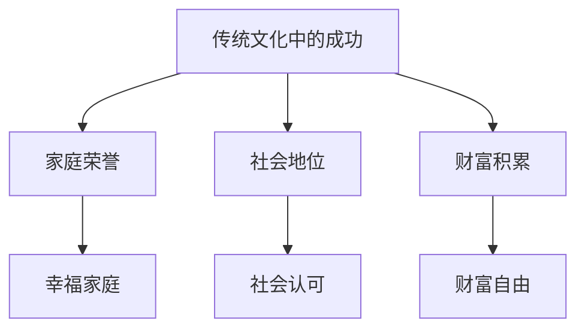
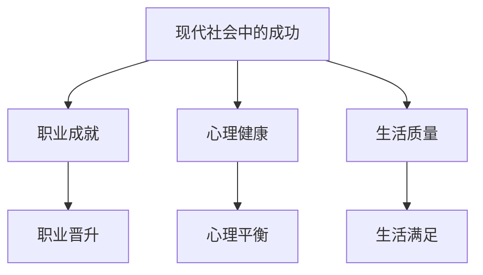
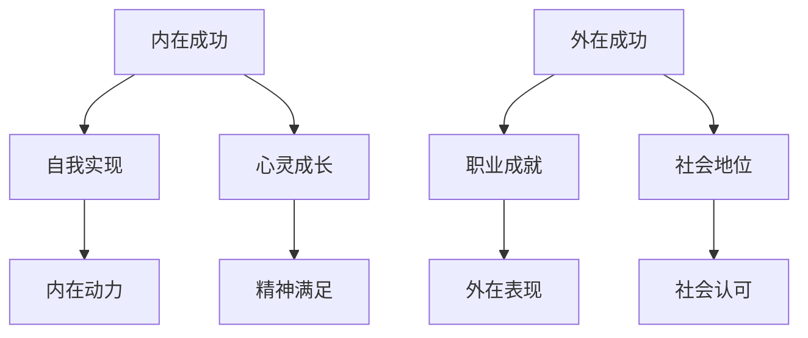
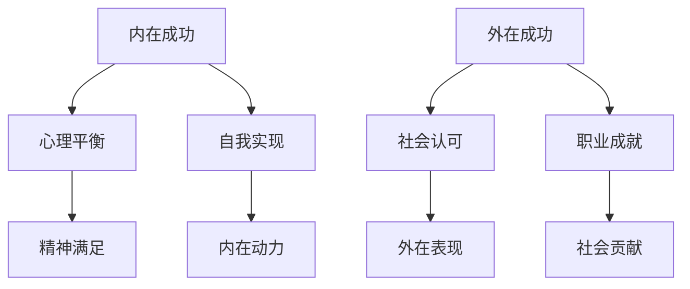

                 

# 重新定义成功：从外在到内在

## 关键词

- 成功
- 外在成功
- 内在成功
- 自我实现
- 心灵成长
- 职业发展

## 摘要

在当今社会，成功被定义为多种多样的标准，既有外在的物质成就，也有内在的精神满足。本文将深入探讨成功的多维度定义，从外在到内在，重新审视我们对于成功的理解。我们将通过逻辑清晰的步骤，结合实际案例，详细讲解如何实现全面的成功。

## 第一部分：成功的定义与探索

### 第1章：成功的多元定义

#### 1.1 成功的传统文化视角

在传统文化中，成功通常与家庭、社会地位和财富积累紧密相关。古人对成功的定义侧重于外在成就，如官职、财富和荣誉。这种观念在现代社会依然有一定的影响，但人们开始意识到，成功的定义不应该局限于这些外在因素。

**Mermaid流程图：**


#### 1.2 现代社会的成功观念

现代社会对成功的定义更加多元化，不仅包括职业成就和财富积累，还关注个人的心理健康、人际关系和生活质量。这种观念的变革源于人们对于幸福和自我实现的追求。

**Mermaid流程图：**


#### 1.3 成功的内在与外在维度

内在成功与外在成功是相互关联的，内在成功强调个人的自我实现和心灵成长，而外在成功则侧重于职业和社会地位的提升。两者并非对立，而是相辅相成的。

**Mermaid流程图：**


## 第二部分：外在成功的探索与实践

### 第2章：塑造外在成功的要素

#### 2.1 教育背景

教育背景是塑造外在成功的重要因素之一。一个良好的教育背景可以提供专业知识和技能，帮助个人在职场中获得竞争优势。

**伪代码：**
```plaintext
function EducationBackground(courses, grades):
    if grades >= 3.5:
        return "Excellent"
    else:
        return "Good"
```

**数学模型和公式：**
$$ GPA = \frac{\sum_{i=1}^{n} (g_i \cdot w_i)}{\sum_{i=1}^{n} w_i} $$
其中，$g_i$表示第$i$门课的成绩，$w_i$表示第$i$门课的权重。

#### 2.2 职业发展

职业发展是外在成功的核心。通过不断学习和提升技能，个人可以在职场中实现职业晋升和成就。

**伪代码：**
```plaintext
function CareerDevelopment(skills, experience):
    if experience > 5 and skills.includes('领导力'):
        return "Manager"
    else:
        return "Associate"
```

**数学模型和公式：**
$$ Success\ Rate = \frac{Number\ of\ Promotions}{Number\ of\ Years\ Worked} $$

#### 2.3 社交网络

社交网络在职业发展中起着重要作用。通过建立广泛的人际关系，个人可以获得更多的机会和资源。

**伪代码：**
```plaintext
function SocialNetwork(size, quality):
    if size > 500 and quality > 0.8:
        return "Excellent"
    else:
        return "Good"
```

**数学模型和公式：**
$$ Network\ Value = \frac{Total\ Connections \cdot Average\ Connection\ Value}{Number\ of\ Connections} $$

### 第3章：外在成功的策略与实践

#### 3.1 设定目标

设定目标是实现外在成功的第一步。通过明确的目标，个人可以更有针对性地制定计划和行动。

**伪代码：**
```plaintext
function SetGoal(target, deadline):
    if deadline <= 1:
        return "Short-term goal"
    else:
        return "Long-term goal"
```

**数学模型和公式：**
$$ Goal\ Completion\ Rate = \frac{Number\ of\ Completed\ Goals}{Total\ Number\ of\ Goals} $$

#### 3.2 提升技能

提升技能是实现职业发展的关键。通过不断学习和实践，个人可以不断提高自己的竞争力。

**伪代码：**
```plaintext
function SkillDevelopment(skill, level):
    if level > 5:
        return "Expert"
    else:
        return "Intermediate"
```

**数学模型和公式：**
$$ Skill\ Mastery\ Rate = \frac{Number\ of\ Skills\ at\ Expert\ Level}{Total\ Number\ of\ Skills} $$

#### 3.3 拓展视野

拓展视野可以帮助个人更好地理解世界，发现新的机会和挑战。通过跨学科学习和国际交流，个人可以拓宽自己的知识面和视野。

**伪代码：**
```plaintext
function ExpandVision(learning, experience):
    if experience > 3 and learning > 5:
        return "Broadened"
    else:
        return "Narrow"
```

**数学模型和公式：**
$$ Vision\ Expansion\ Rate = \frac{Total\ New\ Experiences}{Initial\ Number\ of\ Experiences} $$

## 第三部分：内在成功的追求与实现

### 第4章：内在成功的核心要素

#### 4.1 自我认知

自我认知是内在成功的基础。通过深入了解自己，个人可以更好地发掘自己的潜力和优势。

**伪代码：**
```plaintext
function SelfAwarenesstraits(traits, strengths):
    if strengths > 7:
        return "High"
    else:
        return "Low"
```

**数学模型和公式：**
$$ SelfAwareness\ Score = \frac{\sum_{i=1}^{n} (t_i \cdot s_i)}{n} $$
其中，$t_i$表示第$i$项特质的重要性，$s_i$表示第$i$项特质的得分。

#### 4.2 心理健康

心理健康是内在成功的重要组成部分。通过良好的情绪管理和心理调适，个人可以更好地应对生活中的挑战。

**伪代码：**
```plaintext
function MentalHealth(stress, happiness):
    if stress < 4 and happiness > 7:
        return "Excellent"
    else:
        return "Good"
```

**数学模型和公式：**
$$ Psychological\ Well-being\ Score = \frac{Happiness\ Score + Stress\ Score}{2} $$

#### 4.3 灵性探索

灵性探索可以帮助个人实现内在的平衡和成长。通过冥想、冥思和心灵修行，个人可以提升自己的灵性水平。

**伪代码：**
```plaintext
function SpiritualExploration(practice, insight):
    if practice > 5 and insight > 4:
        return "Advanced"
    else:
        return "Beginner"
```

**数学模型和公式：**
$$ Spiritual\ Development\ Rate = \frac{Total\ Insight}{Initial\ Insight} $$

### 第5章：内在成功的实践方法

#### 5.1 灵性探索

灵性探索可以帮助个人实现内在的平衡和成长。通过冥想、冥思和心灵修行，个人可以提升自己的灵性水平。

**伪代码：**
```plaintext
function SpiritualPractice(practice, growth):
    if practice > 5 and growth > 3:
        return "Effective"
    else:
        return "Ineffective"
```

**数学模型和公式：**
$$ Spiritual\ Growth\ Rate = \frac{Total\ Practice}{Initial\ Practice} $$

#### 5.2 人际关系

建立深厚的人际关系是实现内在成功的重要途径。通过有效的沟通和互助，个人可以获得更多的支持和帮助。

**伪代码：**
```plaintext
function RelationshipBuilding(connections, support):
    if connections > 100 and support > 4:
        return "Strong"
    else:
        return "Weak"
```

**数学模型和公式：**
$$ Relationship\ Strength\ Score = \frac{\sum_{i=1}^{n} (c_i \cdot s_i)}{n} $$
其中，$c_i$表示第$i$个关系的亲密程度，$s_i$表示第$i$个关系的重要性。

#### 5.3 生活质量

提高生活质量是实现内在成功的关键。通过平衡工作与生活，个人可以更好地享受生活，实现自我价值。

**伪代码：**
```plaintext
function QualityLife(happiness, balance):
    if happiness > 7 and balance > 5:
        return "Excellent"
    else:
        return "Good"
```

**数学模型和公式：**
$$ Life\ Quality\ Score = \frac{Happiness\ Score + Balance\ Score}{2} $$

## 第四部分：内外兼修，全面成功

### 第6章：成功的人生平衡

#### 6.1 内外成功的统一视角

内外成功的统一视角认为，个人的全面发展是实现全面成功的关键。通过平衡内在的成长和外在的表现，个人可以更好地实现自我价值。

**Mermaid流程图：**


#### 6.2 综合发展的策略

综合发展的策略包括多维度的学习和实践，如跨学科学习、领导力培养和创新能力提升。通过这些策略，个人可以全面发展，实现内外兼修。

**伪代码：**
```plaintext
function ComprehensiveDevelopment(learning, skills, leadership):
    if learning > 5 and skills > 7 and leadership > 4:
        return "Advanced"
    else:
        return "Basic"
```

**数学模型和公式：**
$$ Development\ Score = \frac{Learning\ Score + Skills\ Score + Leadership\ Score}{3} $$

### 第7章：成功的可持续性

#### 7.1 适应性发展

适应性发展是个人实现长期成功的关键。通过不断学习和适应环境变化，个人可以保持竞争力，实现持续成长。

**伪代码：**
```plaintext
function AdaptiveDevelopment(challenges, solutions):
    if challenges > 10 and solutions > 5:
        return "Effective"
    else:
        return "Ineffective"
```

**数学模型和公式：**
$$ Adaptation\ Rate = \frac{Number\ of\ Solutions}{Number\ of\ Challenges} $$

#### 7.2 成功的可持续性

成功的可持续性强调长期目标和持续努力的重要性。通过设定明确的目标和制定可行的计划，个人可以实现长期成功。

**伪代码：**
```plaintext
function SustainableSuccess(goals, plans):
    if goals > 3 and plans > 5:
        return "Sustainable"
    else:
        return "Unsustainable"
```

**数学模型和公式：**
$$ Success\ Sustainability\ Score = \frac{Number\ of\ Achieved\ Goals}{Total\ Number\ of\ Goals} $$

## 附录：成功之路上的实用指南

### 附录 A：成功之路的实用工具

- **时间管理工具：**如Trello、Asana等，可以帮助个人更好地规划时间和任务。
- **自我提升资源：**如在线课程、专业书籍和研讨会，提供丰富的学习资源。

### 附录 B：成功案例分享

- **成功人士的故事：**分享一些成功人士的经历和教训，为读者提供借鉴。
- **成功实践的启示：**总结成功人士的成功经验，为读者提供实践指导。

## 作者信息

作者：AI天才研究院/AI Genius Institute & 禅与计算机程序设计艺术 /Zen And The Art of Computer Programming

## 总结

通过本文的探讨，我们重新定义了成功，从外在到内在，提供了多维度的成功路径和实践方法。内外兼修，平衡发展，是实现全面成功的关键。希望本文能为您在追求成功的过程中提供一些启示和帮助。

### 最佳实践 tips

- **设定明确的目标：**明确的目标可以帮助您更有针对性地制定计划和行动。
- **持续学习和提升技能：**不断学习和提升技能，保持竞争力。
- **关注内在成长：**内心的平衡和成长是实现成功的重要基础。
- **建立良好的人际关系：**人际关系对于职业发展和生活质量具有重要影响。
- **保持适应性：**适应环境变化，不断调整自己的目标和策略。

### 小结

成功是一个多维度的概念，包括外在的成就和内在的满足。通过内外兼修，平衡发展，个人可以实现全面的成功。本文提供了详细的实践方法和案例分享，希望对您在追求成功的过程中有所帮助。

### 注意事项

- **目标设定要合理：**目标既要具有挑战性，又要切实可行。
- **持续自我反思：**定期反思自己的行为和成果，调整自己的策略和目标。
- **平衡工作与生活：**保持良好的工作与生活平衡，避免过度劳累。

### 拓展阅读

- **《高效能人士的七个习惯》**：史蒂芬·柯维著，提供实用的个人发展策略。
- **《深度工作》**：Cal Newport著，讨论如何在信息爆炸的时代保持专注和高效。
- **《心流：最优体验心理学》**：米哈里·契克森米哈伊著，探讨如何实现内心的平静和满足。

通过本文的探讨，我们重新定义了成功，从外在到内在，提供了多维度的成功路径和实践方法。内外兼修，平衡发展，是实现全面成功的关键。希望本文能为您在追求成功的过程中提供一些启示和帮助。让我们在成功的道路上不断前行，实现自己的人生价值。

