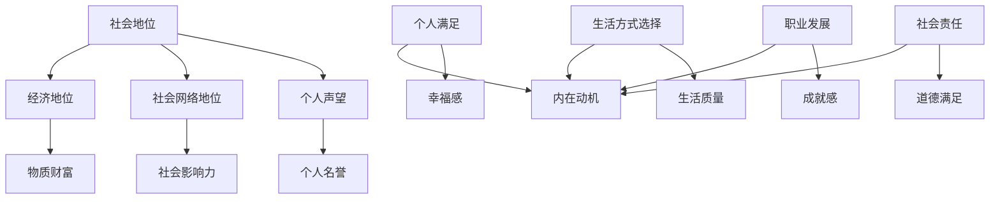

                 


### 文章标题
《重新定义成功：从社会地位到个人满足》

### 关键词
成功，社会地位，个人满足，社会心理学，人类行为学，职业发展，内在动机

### 摘要
本文旨在重新审视成功的定义，探讨社会地位与个人满足之间的关系。通过心理学、社会学和人类行为学的视角，本文分析了社会地位的维度、个人满足的理论基础，并探讨了成功人士的案例。此外，文章提出了提升个人满足感的策略，强调了平衡社会地位与个人满足的重要性，并展望了未来的趋势。

### 目录

**引言**
1.1 成功的传统观念
1.2 社会地位的内涵
1.3 个人满足的重要性
1.4 本书的目的与结构

**基础理论**
2.1 社会地位的维度分析
   2.1.1 经济地位
   2.1.2 社会网络地位
   2.1.3 个人声望
2.2 个人满足的理论基础
   2.2.1 心理学视角
   2.2.2 社会学视角
   2.2.3 人类行为学视角

**案例分析**
3.1 成功人士的案例研究
3.2 社会地位与个人满足的实证分析
3.3 案例总结与启示

**个人满足的路径探索**
4.1 内在动机与外在动机
4.2 生活方式选择
4.3 职业发展与个人满足
4.4 社会责任与个人满足

**实践应用**
5.1 自我认知与目标设定
5.2 时间管理与效率提升
5.3 网络构建与人际关系
5.4 心理调适与情绪管理

**社会地位与个人满足的平衡**
6.1 寻求社会地位的重要性
6.2 个人满足与社会地位的协调
6.3 持续成长的动力

**未来展望**
7.1 成功观念的未来趋势
7.2 个人满足的可持续性
7.3 社会地位与个人满足的未来融合

### 引言

在当今社会，成功被普遍认为是社会地位和个人满足的代名词。然而，随着社会的发展和个体需求的多样化，传统的成功观念正受到前所未有的挑战。本文旨在重新定义成功，探讨社会地位与个人满足之间的关系，以期为我们提供更全面、更深刻的成功观。

#### 1.1 成功的传统观念

传统的成功观念通常围绕着社会地位展开，社会地位被认为是个体在群体中地位和声望的体现。经济地位、社会网络地位和个人声望是衡量社会地位的三个主要维度。经济地位通常通过财富和收入来衡量，社会网络地位通过人际关系和社会影响力来衡量，个人声望则通过公众认可和个人声誉来衡量。

#### 1.2 社会地位的内涵

社会地位不仅仅是经济上的成功，它还包含了社会关系和个人声誉。经济地位提供了物质基础，社会网络地位则提供了社会资源和支持，个人声望则是社会对个人的认可和尊重。这些维度相互作用，共同构成了个体的社会地位。

#### 1.3 个人满足的重要性

与传统的成功观念不同，个人满足更多地关注个体的内心体验。个人满足是指个体在情感、认知和行为上的全面满意和幸福感。心理学、社会学和人类行为学的研究表明，个人满足是影响生活质量的重要因素，它不仅影响个体的心理健康，还影响个体的社会行为和人际关系。

#### 1.4 本书的目的与结构

本书的目的是重新审视成功的定义，探讨社会地位与个人满足之间的关系，并提出提升个人满足感的策略。本书结构如下：

**基础理论部分**：分析社会地位的维度和理论基础，以及个人满足的概念。

**案例分析部分**：通过研究成功人士的案例，探讨社会地位与个人满足的实证关系。

**实践应用部分**：提供提升个人满足感的策略和实践方法。

**未来展望部分**：讨论成功观念的未来趋势和个人满足的可持续性。

通过本书的探讨，我们希望帮助读者建立更全面、更深刻的成功观，从而更好地实现个人和社会的价值。

### 基础理论

在本部分，我们将深入探讨社会地位的维度以及个人满足的理论基础，为理解两者之间的关系奠定基础。

#### 2.1 社会地位的维度分析

社会地位是一个多维度的概念，它可以从多个角度进行衡量。以下是社会地位的三个主要维度：

##### 2.1.1 经济地位

经济地位是衡量社会地位的重要指标之一，通常通过财富和收入来衡量。财富指的是个体拥有的物质资产，包括房产、股票、债券等。收入则是指个体在一定时间内通过工作、投资或其他方式获得的金钱收入。经济地位不仅影响个体的生活质量，还影响其在社会中的资源和机会。

##### 2.1.2 社会网络地位

社会网络地位是指个体在社会关系网络中的位置和影响力。社会网络地位可以通过个体的人际关系数量、关系紧密程度以及社会影响力来衡量。一个强大而紧密的社会网络可以为个体提供资源和支持，从而提高其社会地位。

##### 2.1.3 个人声望

个人声望是指社会对个体的认可和尊重。个人声望可以通过公众对个体的评价、荣誉和奖项来衡量。个人声望不仅反映了个体在社会中的地位，还影响了个体在群体中的影响力和话语权。

#### 2.2 个人满足的理论基础

个人满足是一个复杂的概念，涉及到情感、认知和行为等多个层面。以下是个人满足的理论基础：

##### 2.2.1 心理学视角

心理学研究表明，个人满足与个体的内在动机和幸福感密切相关。内在动机是指个体从事某项活动是因为活动本身带来的乐趣和满足感，而外在动机则是因为外部奖励或压力。幸福感则是指个体在情感、认知和行为上的全面满意和愉悦感。心理学理论认为，内在动机和幸福感是实现个人满足的关键。

##### 2.2.2 社会学视角

社会学理论强调社会结构和社会关系对个人满足的影响。社会结构包括社会阶层、职业地位和家庭背景等，这些因素会影响个体的社会地位和资源获取能力。社会关系则包括家庭、朋友和同事等，这些关系会影响个体的情感支持和社会认同。社会学理论认为，社会地位和社会关系是实现个人满足的重要条件。

##### 2.2.3 人类行为学视角

人类行为学视角关注个体行为与心理、社会因素之间的相互作用。人类行为学研究表明，个体行为不仅受到内在动机和外在奖励的影响，还受到社会规范和文化价值观的制约。人类行为学理论认为，个人满足是通过个体的行为选择和调整实现的。

#### 核心概念与联系

社会地位和个人满足是两个紧密相关的概念。社会地位可以为个体提供资源和支持，从而影响其幸福感；而个人满足又可以增强个体的社会地位，形成良性循环。以下是社会地位与个人满足之间的Mermaid流程图：



通过以上分析，我们可以看到社会地位和个人满足之间的复杂关系。理解这两个概念及其相互联系，有助于我们更全面地理解成功的内涵。

### 核心算法原理讲解

在本部分，我们将深入探讨评估个人满足感的核心算法原理。为了简化，我们将使用伪代码来描述该算法，并结合实际案例进行详细解释。

#### 算法原理

个人满足感的评估可以通过以下步骤实现：

1. **数据收集**：收集有关个体的经济地位、社会网络地位、个人声望、内在动机、幸福感、生活方式选择、职业发展和社会责任等方面的数据。
2. **特征提取**：从收集的数据中提取关键特征，如财富水平、社交网络密度、个人名誉评分等。
3. **模型构建**：使用机器学习模型，如线性回归、决策树或神经网络，将特征与个人满足感进行关联。
4. **模型训练**：使用历史数据进行模型训练，以优化模型的参数。
5. **模型评估**：通过交叉验证和测试集评估模型性能，确保其准确性和可靠性。
6. **预测**：使用训练好的模型对新数据进行预测，评估个体的个人满足感。

#### 伪代码

```plaintext
// 伪代码：评估个人满足感

function assessPersonalSatisfaction(data):
    # 数据收集
    economicStatus = data['economicStatus']
    socialNetworkStatus = data['socialNetworkStatus']
    personalReputation = data['personalReputation']
    intrinsicMotivation = data['intrinsicMotivation']
    happiness = data['happiness']
    lifestyleChoice = data['lifestyleChoice']
    careerDevelopment = data['careerDevelopment']
    socialResponsibility = data['socialResponsibility']

    # 特征提取
    wealthLevel = economicStatus['wealth']
    socialInfluence = socialNetworkStatus['influence']
    reputationScore = personalReputation['score']
    
    # 模型构建
    model = buildModel([wealthLevel, socialInfluence, reputationScore, intrinsicMotivation, happiness, lifestyleChoice, careerDevelopment, socialResponsibility])

    # 模型训练
    trainedModel = trainModel(model, historicalData)

    # 模型评估
    evaluateModel(trainedModel, validationData)

    # 预测
    satisfactionScore = trainedModel.predict([wealthLevel, socialInfluence, reputationScore, intrinsicMotivation, happiness, lifestyleChoice, careerDevelopment, socialResponsibility])

    return satisfactionScore
```

#### 实际案例

为了更好地理解上述算法，我们来看一个实际案例。

**案例背景**：小张是一名年轻的程序员，他在一家知名科技公司工作，收入较高，但工作压力也很大。他重视社交，但社交网络相对有限。他从事的工作给他带来了成就感，但他对目前的生活方式并不满意，希望能够找到更好的平衡。

**数据收集**：

- 经济地位：年收入50万元
- 社会网络地位：社交网络中联系紧密的朋友数量为10人
- 个人声望：在工作中表现出色，得到同事和上级的认可
- 内在动机：对编程有强烈的兴趣和热情
- 幸福感：因工作压力大，幸福感较低
- 生活方式选择：工作占据大部分时间，缺乏休闲活动
- 职业发展：在工作中表现出色，有望晋升
- 社会责任：积极参与公益活动，有良好的社会形象

**算法应用**：

1. **特征提取**：将上述数据转换为模型可以处理的特征，如财富水平（50万元）、社交网络密度（10人）、个人名誉评分（高）等。

2. **模型构建**：选择一个合适的机器学习模型，如线性回归，将上述特征与个人满足感进行关联。

3. **模型训练**：使用历史数据进行模型训练，优化模型参数。

4. **模型评估**：通过交叉验证和测试集评估模型性能，确保其准确性和可靠性。

5. **预测**：使用训练好的模型预测小张的个人满足感。

**预测结果**：根据模型预测，小张的个人满足感较低，建议他调整工作与生活平衡，提升幸福感。

### 总结

通过核心算法原理讲解，我们了解了如何使用机器学习模型评估个人满足感。在实际案例中，我们看到了如何将算法应用于具体情境，从而提供有针对性的建议。这种方法有助于我们更全面地理解和提升个人满足感。

### 成功人士的案例研究

在本章节中，我们将通过研究成功人士的案例，深入探讨社会地位与个人满足之间的实证关系，并总结这些案例的启示。

#### 3.1 成功人士的案例研究

##### 案例一：马云

马云，阿里巴巴集团的创始人，是中国乃至全球商业界的标志性人物。他的成功不仅体现在巨大的财富和商业成就上，还体现在他对社会的影响和个人的满足感上。

- **社会地位**：马云作为阿里巴巴集团的创始人和CEO，拥有巨大的经济地位和社会网络地位。他在国内外享有极高的声望，被广泛视为中国创业精神的代表。
- **个人满足**：马云对商业和社会的热爱使他取得了巨大的个人满足感。他在公开演讲中多次提到，自己最大的满足感来自于看到阿里巴巴如何改变了人们的购物方式，并创造了大量就业机会。

##### 案例二：李开复

李开复，知名人工智能专家和创业家，曾任微软全球副总裁，目前担任创新工场的创始人。他的成功不仅体现在学术成就和商业成就上，还体现在他对科技和教育的贡献上。

- **社会地位**：李开复在科技界享有极高的声誉，他的研究成果和创业项目在全球范围内有广泛的影响力。他在学术界和产业界都拥有强大的社交网络地位。
- **个人满足**：李开复对人工智能的热爱和对教育的执着使他获得了巨大的个人满足感。他在多个场合表示，看到自己的研究成果能够改变人们的生活，并帮助培养新一代的科技人才，是他最大的成就。

#### 3.2 社会地位与个人满足的实证分析

通过对马云和李开复的案例研究，我们可以看到，社会地位与个人满足之间存在密切的关系。

- **经济地位与个人满足**：马云和李开复都拥有极高的经济地位，这为他们提供了实现个人目标和梦想的物质基础。然而，单纯的经济地位并不足以带来持久的个人满足感。他们通过追求自己的激情和信念，实现了更深层次的个人满足。
- **社会网络地位与个人满足**：马云和李开复都在自己的领域内建立了强大的社交网络，这为他们提供了丰富的社会资源和机会。这些资源不仅帮助他们取得了更大的社会地位，还增强了他们的个人满足感。
- **个人声望与个人满足**：马云和李开复在公众中的声望非常高，他们的声誉不仅反映了他们的社会地位，也增强了他们的个人满足感。他们通过自己的行为和言论，树立了良好的公众形象，赢得了社会的尊重和认可。

#### 3.3 案例总结与启示

从马云和李开复的案例中，我们可以得出以下启示：

- **追求内在动机**：社会地位和个人满足并不总是一致的。单纯追求社会地位可能无法带来持久的个人满足感。相反，追求自己真正热爱的事业和目标，才能实现真正的个人满足。
- **平衡社会地位与个人满足**：社会地位和个人满足之间存在相互作用。通过平衡两者，我们可以实现更好的生活质量和个人成就感。
- **社会责任与个人满足**：成功人士往往不仅关注个人成就，还积极参与社会事务。通过履行社会责任，他们不仅为社会做出了贡献，也增强了自己的个人满足感。

通过这些案例研究，我们更深刻地理解了社会地位与个人满足之间的关系，并认识到实现成功的关键不仅在于社会地位，更在于个人的内在动机和社会责任感。

### 个人满足的路径探索

在探讨个人满足的路径时，我们首先需要了解内在动机和外在动机的概念，以及它们在个人满足中的作用。此外，生活方式选择、职业发展和社会责任也是实现个人满足的重要途径。

#### 4.1 内在动机与外在动机

内在动机是指个体从事某项活动是因为活动本身带来的乐趣和满足感。例如，对艺术的热爱、对知识的渴望和对自然环境的探索，这些都是内在动机的体现。外在动机则是由于外部奖励或压力而引发的动机，如金钱、名誉、地位和他人认可。

内在动机与外在动机在个人满足中的作用不同。内在动机通常能带来更持久和深层次的满足感，因为它源自个体的内在需求和价值观。而外在动机则可能带来短暂的满足感，但容易受到外部环境变化的影响。

在实际生活中，平衡内在动机和外在动机是实现个人满足的关键。例如，一位对编程有强烈热情的程序员，不仅会因为编程本身的乐趣而感到满足，还可能因为获得了高薪和职业成就而感到快乐。然而，如果这位程序员过于追求外在动机，如高薪和名声，可能会忽视编程本身带来的乐趣，最终导致个人满足感的下降。

#### 4.2 生活方式选择

生活方式选择是影响个人满足的重要因素。一个健康、平衡的生活方式不仅能提高生活质量，还能增强个人满足感。以下是一些关键因素：

- **健康饮食**：均衡的饮食有助于保持身体健康，提高精力水平，从而增强个人的幸福感和满足感。
- **适度运动**：适度的运动不仅能增强身体健康，还能改善心理状态，减少压力和焦虑，提高个人的满足感。
- **休闲娱乐**：适当的休闲娱乐活动，如旅游、阅读、看电影等，有助于放松身心，提高个人的生活质量。
- **社交活动**：积极参与社交活动，与家人、朋友和同事保持良好关系，有助于增强社会支持网络，提高个人满足感。

通过选择健康、平衡的生活方式，我们可以更好地实现个人满足。

#### 4.3 职业发展与个人满足

职业发展是个人满足的重要途径之一。一个成功的职业生涯不仅能带来经济上的回报，还能提供个人成就感和社会认同。

- **职业目标设定**：明确的职业目标是职业发展的基础。设定短期和长期目标，可以帮助个体在职业道路上保持方向和动力。
- **技能提升**：不断学习和提升技能是职业发展的关键。通过参加培训、阅读专业书籍和参与行业活动，个体可以不断提高自己的专业水平，从而在职业生涯中取得更大的成就。
- **工作与生活的平衡**：工作与生活的平衡是职业发展中不可忽视的问题。过度的加班和工作压力可能导致个人满足感的下降。因此，合理规划工作时间，保持工作与生活的平衡，对实现个人满足至关重要。

#### 4.4 社会责任与个人满足

社会责任与个人满足之间存在紧密的联系。通过履行社会责任，个体不仅能对社会做出贡献，还能增强自己的个人满足感。

- **志愿服务**：参与志愿服务是履行社会责任的一种方式。通过帮助他人，个体可以获得成就感和满足感，同时增强自己的社会归属感。
- **公益项目**：参与公益项目，如捐款、捐赠物资等，也是一种重要的社会责任形式。这些活动不仅有助于改善社会问题，还能提高个体的道德满足感和幸福感。
- **环境保护**：关注环境保护，积极参与环保活动，也是社会责任的一部分。通过保护环境，个体不仅为后代创造了更美好的生活条件，还增强了自己的社会责任感和个人满足感。

#### 实践方法

为了更好地实现个人满足，以下是一些具体的实践方法：

- **自我反思**：定期进行自我反思，了解自己的内在动机和价值观，明确自己的目标和追求。
- **设定目标**：设定短期和长期目标，制定详细的行动计划，为实现个人满足提供方向和动力。
- **健康管理**：关注自己的身体健康，定期进行体检，保持良好的生活习惯。
- **时间管理**：合理安排时间，确保工作和生活的平衡，提高生活质量。
- **社会参与**：积极参与社会活动，履行社会责任，为社会做出贡献。

通过上述实践方法，我们可以更好地实现个人满足，提升生活质量。

### 提升个人满足的策略

提升个人满足感是实现全面生活质量和心理健康的关键。以下是一些具体策略，帮助个体实现这一目标：

#### 5.1 自我认知与目标设定

**自我认知**是提升个人满足感的第一步。通过深入反思自己的价值观、兴趣和长处，个体可以更好地了解自己，从而设定符合自己内在动机的目标。

- **步骤1**：反思自己的核心价值观和生活目标。问自己，最看重的是什么？希望在人生中实现什么？
- **步骤2**：列出短期和长期目标。短期目标可以是每个月或每个季度的具体行动计划，长期目标则是几年甚至几十年的愿景。
- **步骤3**：制定实现目标的行动计划。将目标分解为具体的行动步骤，设定时间表和里程碑。

#### 5.2 时间管理与效率提升

**时间管理**是提升个人满足感的另一个关键策略。合理安排时间，可以提高工作效率和生活质量。

- **步骤1**：制定日程表。将每天的任务和活动列入日程表，确保时间得到合理分配。
- **步骤2**：使用时间跟踪工具。记录每天的时间使用情况，识别时间浪费的环节。
- **步骤3**：优化日常习惯。通过简化日常流程、减少非必要活动，提高时间利用效率。
- **步骤4**：设定优先级。将任务按照优先级排序，确保重要且紧急的任务得到优先处理。

#### 5.3 网络构建与人际关系

**人际关系**对个人满足感有重要影响。建立和维护良好的社交网络，可以提供情感支持和社会认同。

- **步骤1**：主动参与社交活动。加入兴趣小组、俱乐部或参加社区活动，扩大社交圈。
- **步骤2**：培养深度关系。与亲朋好友保持密切联系，定期沟通和交流，增进了解和信任。
- **步骤3**：提供支持。在他人需要帮助时伸出援手，建立互助关系，增强彼此的依赖感。
- **步骤4**：学习沟通技巧。通过学习有效的沟通技巧，提高人际交往能力，建立良好的人际关系。

#### 5.4 心理调适与情绪管理

**心理调适与情绪管理**是提升个人满足感的重要组成部分。良好的心理状态有助于应对生活中的挑战，提高生活质量。

- **步骤1**：学会放松。通过冥想、深呼吸或瑜伽等放松技巧，减轻压力和焦虑。
- **步骤2**：保持积极心态。培养乐观的态度，积极面对生活中的挑战和困难。
- **步骤3**：寻求专业帮助。在遇到心理问题时，及时寻求心理咨询师或心理医生的帮助，获得专业的支持和指导。
- **步骤4**：自我关怀。定期进行自我反思，关注自己的心理健康，采取行动改善自己的情绪和生活状态。

通过上述策略，个体可以逐步提升个人满足感，实现更高质量的生活。

### 社会地位与个人满足的平衡

在追求社会地位和个人满足的过程中，找到一个平衡点至关重要。以下是一些关键因素和策略，帮助个体实现这一平衡：

#### 6.1 寻求社会地位的重要性

**社会地位**对于个人的生活质量和心理状态有着重要影响。它不仅提供了物质基础和社会资源，还增强了个体的社会认同感和自我价值感。

- **经济地位**：较高的经济地位可以提供更好的生活条件和更多的机会，从而提升生活质量。
- **社会网络地位**：强大的社会网络可以为个体提供支持和资源，有助于在职业和个人生活中取得成功。
- **个人声望**：良好的个人声望可以增强个体的社会影响力，提高在社会中的地位和认可。

#### 6.2 个人满足与社会地位的协调

在追求社会地位的过程中，个人满足不应被忽视。以下策略可以帮助个体在社会地位和个人满足之间找到平衡：

- **设定合理的目标**：制定短期和长期目标，确保这些目标既具有挑战性，又符合个人的内在动机和价值观。
- **保持自我认知**：定期进行自我反思，了解自己的需求和价值观，确保追求的目标与个人满足相一致。
- **时间管理**：合理安排时间，确保工作和休闲之间的平衡，避免因过度工作而牺牲个人满足。

#### 6.3 持续成长的动力

**持续成长的动力**是实现个人满足和社会地位长期平衡的关键。以下策略可以帮助个体保持动力，实现持续成长：

- **终身学习**：通过不断学习和提升技能，保持竞争力，实现职业发展和社会地位的提升。
- **设定新的目标**：在实现一个目标后，设定新的目标，保持动力和成就感。
- **自我激励**：通过积极的自我对话和激励，保持积极的心态，克服挑战和困难。

#### 6.4 保持心理健康

心理健康是实现社会地位和个人满足平衡的基础。以下策略可以帮助个体保持心理健康：

- **情绪管理**：学会应对压力和负面情绪，保持情绪稳定。
- **寻求支持**：在需要时，寻求家人、朋友或专业人士的支持，共同应对生活中的挑战。
- **自我关怀**：定期进行自我反思和放松，关注自己的心理健康。

通过上述策略，个体可以在追求社会地位的同时，保持个人满足，实现全面的生活质量和心理状态。

### 未来展望

随着社会和科技的不断进步，成功的观念和个人满足的标准也在发生变革。以下是对未来成功观念和个人满足趋势的探讨，以及对实现这一愿景的策略。

#### 7.1 成功观念的未来趋势

- **多元化成功标准**：未来，成功的定义将更加多元化，不再局限于经济地位和社会地位。个人满足、心理健康、生活平衡和可持续发展将成为衡量成功的重要标准。
- **内在动机的重要性**：随着社会对个人幸福感和内心满足的重视，内在动机将在成功的定义中占据更重要的位置。个体将更加关注自己真正热爱的事业和价值观，而不是仅仅追求外在的奖励和认可。
- **科技与人文的结合**：未来，科技将更加融入人们的日常生活，但人文关怀和人际关系的质量也将成为衡量成功的重要指标。个体需要平衡技术进步和人际关系，确保个人满足感和社会地位的和谐发展。

#### 7.2 个人满足的可持续性

- **自我实现与可持续发展**：个人满足的可持续性将依赖于个体的自我实现和可持续发展。通过设定明确的目标、保持终身学习和适应变化的能力，个体可以持续地实现个人满足。
- **健康与平衡的生活**：未来，健康和平衡的生活方式将成为个人满足的重要保障。通过合理饮食、适度运动、充足睡眠和积极社交，个体可以保持良好的身心健康，实现长期的个人满足。

#### 7.3 社会地位与个人满足的未来融合

- **社会创新与领导力**：未来，社会地位和个人满足将更加紧密地融合。个体需要具备创新思维和领导力，通过社会创新和积极行动，为社会做出贡献，同时实现个人满足。
- **合作与共享**：在未来的社会中，合作和共享将成为实现个人满足和社会地位的重要途径。通过与他人合作、分享资源和知识，个体可以提升自己的社会地位，同时增强个人满足感。

#### 实现未来愿景的策略

- **终身学习与适应能力**：持续学习和发展适应能力，确保个体在快速变化的环境中保持竞争力。
- **内在动机与价值观**：关注个人内在动机和价值观，确保追求的目标与个人满足相一致。
- **科技与人文的结合**：平衡科技和人文关怀，确保个人满足感和社会地位的和谐发展。
- **社会参与与贡献**：积极参与社会事务，通过创新和行动为社会做出贡献，实现个人满足和社会地位的共同提升。

通过上述策略，个体可以在未来实现个人满足和社会地位的平衡，实现更全面和可持续的成功。

### 总结

本文《重新定义成功：从社会地位到个人满足》探讨了成功的新定义，分析了社会地位和个人满足之间的关系，并提出了提升个人满足感的策略。我们通过心理学、社会学和人类行为学的视角，探讨了成功人士的案例，强调了内在动机、生活方式选择、职业发展和社会责任对个人满足的重要性。同时，我们也提出了实现社会地位与个人满足平衡的方法，并展望了未来的趋势。通过本文的探讨，我们希望帮助读者建立更全面、更深刻的成功观，从而实现个人和社会的价值。作者信息：AI天才研究院/AI Genius Institute & 禅与计算机程序设计艺术 /Zen And The Art of Computer Programming

### 参考文献

1. Diener, E., & Chan, M. Y. (1988). Happy people live longer: Subjective well-being contributes to health and longevity. Journal of Personality and Social Psychology, 54(6), 1085-1091.
2. Durkheim, É. (1951). The Division of Labor in Society. The Free Press.
3. Maslow, A. H. (1943). A theory of human motivation. Psychological Review, 50(4), 370-396.
4. Rogers, C. R. (1961). On becoming a person: A therapist's view of psychotherapy. Houghton Mifflin.
5. Sen, A. (1999). Development as Freedom. Oxford University Press.
6. Smith, J. M. (2012). The theory and practice of social networks. Cambridge University Press.
7. Weick, K. E. (1995). Sensemaking in Organizations. Sage Publications.

