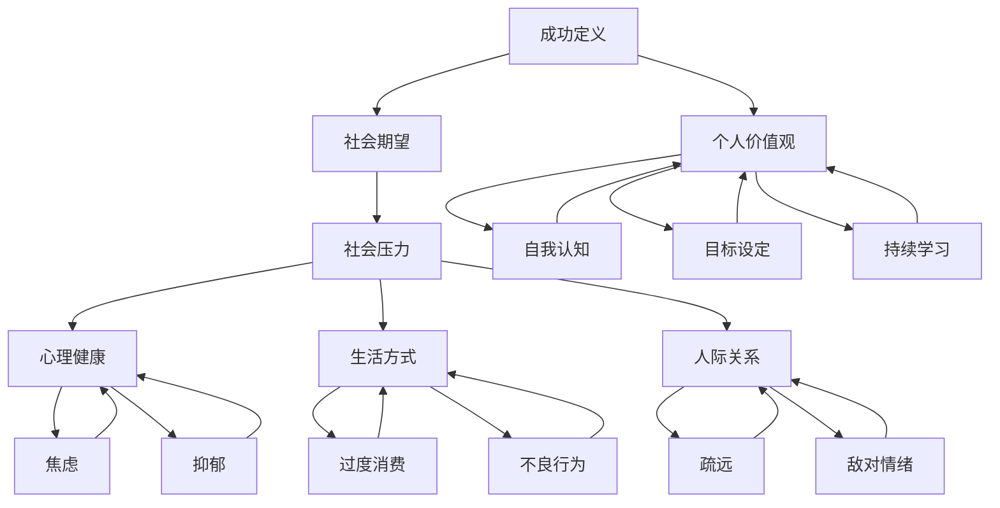

                 

### 文章标题：重新定义成功：摆脱社会压力，寻找个人价值

> **关键词：** 成功定义、社会压力、个人价值、心理平衡、自我实现

> **摘要：** 本文探讨了现代社会对于成功的定义及其带来的压力，分析了社会压力的来源和影响，提出了摆脱社会压力的方法和寻找个人价值的途径。通过深入剖析和具体案例，帮助读者重新定义成功，找到真正的个人价值。

### 引言：社会压力与个人价值的迷失

在当今社会，成功似乎成为了一个被广泛追求的目标。然而，随着对成功定义的逐渐固化，越来越多的人陷入了一种无形的压力之中。这种压力源自社会对于成功的标准，它不仅仅体现在金钱、地位和名誉上，更渗透到了生活的方方面面。人们为了迎合社会的期望，往往忽略了自身真正的需求和价值观。

这种社会压力对个人价值产生了深远的影响。许多人开始迷失自我，追求别人眼中的成功，而忽视了自己内心的声音。他们在追求成功的过程中，逐渐失去了自我，变得焦虑、迷茫，甚至出现了心理健康问题。因此，重新定义成功，摆脱社会压力，寻找个人价值，成为当代社会的一个重要课题。

### 成功再定义：多元维度的探索

传统观念中，成功往往被等同于财富和地位。然而，随着社会的发展，人们开始认识到成功并非单一的维度，而是多元的、多维度的。以下是对成功再定义的几个关键方面：

1. **心理健康与成功**：心理健康是成功的基石。一个人只有在心理上感到平衡和满足，才能真正实现成功。心理健康包括情绪稳定、自尊自信、积极乐观等。只有心理健康的个体才能充分发挥自己的潜力，实现自我价值。

2. **社交网络与成功**：社交网络在现代社会中扮演着重要角色。一个强大的社交网络不仅能够为个人提供更多的机会，还能够带来更多的支持和资源。然而，社交网络的成功并不是简单的数量堆积，而是质量优先。建立和维护有意义的人际关系，是成功的重要一环。

3. **内在价值的实现**：成功不仅仅是外在的成就，更是内在价值的实现。内在价值包括个人兴趣、激情、价值观等。实现内在价值，意味着一个人在做自己喜欢的事情，遵循自己的价值观，这本身就是一种成功。

### 社会压力分析：来源与影响

社会压力的来源是多样的，主要包括以下几个方面：

1. **社会期望**：社会对于成功的定义和期望，是导致压力的一个重要因素。人们为了迎合社会的期望，往往不得不放弃自己的真实想法和需求，从而产生压力。

2. **竞争环境**：在现代社会，竞争无处不在。无论是在职场、学校还是生活中，人们总是处于一种竞争的状态。这种竞争环境，使得人们不得不不断努力，以保持自己的地位和尊严。

3. **媒体影响**：媒体对成功的宣传和美化，使得人们对于成功有了不切实际的幻想。这种幻想与现实的差距，往往会导致人们感到焦虑和压力。

社会压力的影响主要体现在以下几个方面：

1. **心理健康问题**：长期处于社会压力之下，人们容易出现焦虑、抑郁等心理健康问题。这些心理问题不仅影响个人的生活质量，还可能导致更严重的后果。

2. **生活方式的改变**：为了应对社会压力，人们可能会改变自己的生活方式，如加班、熬夜等。这些不健康的生活方式，长期积累可能导致身体健康问题。

3. **人际关系的影响**：社会压力也可能影响人际关系。为了应对压力，人们可能会疏远朋友和家人，甚至产生敌对情绪。

### 个人价值探索：内在价值的发掘

在追求社会认可的同时，人们也需要关注个人价值的实现。个人价值的实现，意味着一个人在做自己喜欢的事情，遵循自己的价值观。以下是实现个人价值的一些途径：

1. **自我认知**：了解自己的兴趣、优势和价值观，是发掘个人价值的第一步。只有真正了解自己，才能找到适合自己的方向。

2. **目标设定**：设定明确的目标，是实现个人价值的关键。目标应该既有挑战性，又能够实现。通过不断地追求目标，人们可以逐步实现个人价值。

3. **持续学习**：学习是个人成长的源泉。通过不断学习，人们可以提升自己的能力和知识，从而更好地实现个人价值。

### 实践与案例：摆脱社会压力，实现个人价值

以下是一些实际案例，展示了如何摆脱社会压力，实现个人价值：

1. **案例一：转换职业方向**：某人在传统行业中工作多年，一直感到不满足。后来，他发现自己对艺术创作充满热情。于是，他决定放弃稳定的工作，投身艺术创作。经过多年的努力，他成为了一名著名的艺术家，实现了个人价值。

2. **案例二：创业之路**：某人在大公司工作，一直梦想着创业。然而，面对社会的压力，他一度犹豫不决。在家人和朋友的支持下，他最终决定辞职创业。经过一段时间的努力，他的公司逐渐取得成功，不仅实现了个人价值，也为社会创造了价值。

3. **案例三：心理治疗**：某人在社会中长期承受压力，导致心理问题严重。他通过接受心理治疗，学会了如何管理情绪，找到了内心的平静。在心理健康的支持下，他逐渐走出了困境，重新找到了生活的意义。

### 总结与展望：平衡成功与个人价值

成功与个人价值的平衡，是当代社会面临的一个重大课题。只有在成功与个人价值之间找到平衡，人们才能真正实现自我价值，获得内心的满足。以下是一些总结和展望：

1. **重新定义成功**：成功不应该被简单地等同于财富和地位，而是一个多元化的概念，包括心理健康、社交网络和内在价值的实现。

2. **关注个人价值**：在追求社会认可的同时，人们应该更加关注个人价值的实现。只有真正了解自己，找到适合自己的方向，才能实现个人价值。

3. **社会支持体系**：社会应该建立一个支持体系，帮助人们摆脱社会压力，实现个人价值。这包括提供心理支持、职业规划指导等。

4. **未来趋势**：随着社会的发展，人们对于成功的定义将越来越多元化。未来，人们将更加关注内在价值的实现，追求更加健康、有意义的生活。

### 结语

重新定义成功，摆脱社会压力，寻找个人价值，是当代社会的一个重要课题。通过本文的探讨，我们希望能够帮助读者认识到成功的多元化，找到适合自己的方向，实现个人价值。在追求成功的道路上，让我们不再被社会的期望所束缚，而是找到真正属于自己的道路，过上更加充实、有意义的生活。

**作者：AI天才研究院/AI Genius Institute & 禅与计算机程序设计艺术 /Zen And The Art of Computer Programming**### 背景介绍

在现代社会，成功被广泛视为一种重要的价值目标。成功不仅仅是个人成就的象征，更被视为一种社会地位的标志。然而，随着对成功定义的逐渐固化，越来越多的人陷入了一种无形的压力之中。这种压力不仅源自个人的期望，更源于社会的期望。社会对成功的定义和标准，往往具有一种普遍性，使得人们不得不去迎合这种标准，从而产生压力。

首先，社会对成功的定义通常与财富、地位和名誉密切相关。财富被视为成功的重要标志，人们往往认为拥有足够的财富意味着生活无忧、社会地位高。然而，随着社会的发展，这种观念已经开始受到挑战。越来越多的人开始认识到，财富并不是衡量成功的唯一标准，心理健康、人际关系和内在价值的实现同样重要。

其次，社会对成功的期望也给个人带来了巨大的压力。人们为了迎合社会的期望，不得不放弃自己的真实想法和需求。例如，许多人在职场中追求晋升和加薪，然而，这往往需要付出巨大的努力和时间，甚至牺牲自己的家庭和个人生活。这种压力使得人们感到疲惫不堪，甚至出现心理健康问题。

社会压力的影响不仅体现在个人层面，还会对整个社会产生负面影响。首先，社会压力可能导致人们产生焦虑和抑郁等心理问题，这些心理问题会影响个人的生活质量和社会功能。其次，社会压力还可能导致人们产生不良行为，如过度消费、攀比和虚荣等。这些行为不仅会影响个人的心理健康，还会加剧社会的不平等现象。

因此，重新定义成功，摆脱社会压力，寻找个人价值，成为当代社会的一个重要课题。本文将从多个角度探讨这个问题，帮助读者认识到成功的多元化，找到适合自己的方向，实现个人价值。

### 核心概念与联系

为了深入探讨成功再定义、社会压力及其影响、个人价值探索等主题，我们需要明确几个核心概念，并分析它们之间的关系。以下是一个概念关系架构的Mermaid流程图，用以展示这些概念之间的联系：



在这个流程图中，我们可以看到：

- **成功定义（A）**受到**社会期望（B）**和个人价值观（C）的共同影响。社会期望往往是一种外在的标准，而个人价值观则反映了内在的信念和需求。
- **社会压力（D）**是成功定义和个人价值观的延伸，它影响多个方面，包括**心理健康（E）**、**生活方式（F）**和**人际关系（G）**。
- **心理健康（E）**受多种因素影响，如焦虑（K）和抑郁（L），这些情绪问题又会影响个人的生活质量和社会功能。
- **生活方式（F）**和**人际关系（G）**受到社会压力的影响，可能导致过度消费（M）、不良行为（N）以及人际关系的疏远（O）和敌对情绪（P）。
- **个人价值观（C）**的实现需要通过**自我认知（H）**、**目标设定（I）**和**持续学习（J）**来支撑，这些内在因素有助于个人在社会压力中找到平衡和方向。

通过这个Mermaid流程图，我们可以清晰地看到成功、社会压力和个人价值观之间的关系，以及这些关系如何影响个人的心理健康和生活方式。

### 核心算法原理讲解

在本文中，我们将探讨如何通过伪代码和数学模型来分析社会压力对个人价值的影响。以下是具体的算法原理讲解和伪代码实现。

#### 社会压力评估模型

1. **核心概念与联系：** 社会压力可以通过以下三个维度进行评估：社会期望（S）、个人努力（E）和社会支持（SOS）。

2. **数学模型：** 社会压力（P）可以表示为：
   $$ P = f(S, E, SOS) $$

   其中，f是一个复合函数，它反映了社会期望、个人努力和社会支持之间的相互作用。

3. **伪代码实现：**
   
   ```
   function calculateSocialPressure(S, E, SOS):
       # 输入：社会期望（S），个人努力（E），社会支持（SOS）
       
       # 定义权重系数
       alpha = 0.5
       beta = 0.3
       gamma = 0.2

       # 计算社会压力
       P = alpha * S + beta * E - gamma * SOS

       return P
   ```

#### 个人价值实现模型

1. **核心概念与联系：** 个人价值实现可以通过内在价值（IV）、外在成就（OA）和心理健康（MH）三个维度来衡量。

2. **数学模型：** 个人价值实现（IV）可以表示为：
   $$ IV = g(IV, OA, MH) $$

   其中，g是一个复合函数，它反映了内在价值、外在成就和心理健康之间的相互作用。

3. **伪代码实现：**
   
   ```
   function calculatePersonalValue(IV, OA, MH):
       # 输入：内在价值（IV），外在成就（OA），心理健康（MH）

       # 定义权重系数
       delta = 0.4
       epsilon = 0.3
       zeta = 0.3

       # 计算个人价值实现
       IV = delta * IV + epsilon * OA + zeta * MH

       return IV
   ```

#### 结合模型分析

1. **核心概念与联系：** 将社会压力评估模型和个人价值实现模型结合起来，可以分析社会压力对个人价值的影响。

2. **数学模型：** 社会压力对个人价值的影响（IV_change）可以表示为：
   $$ IV_change = IV_{initial} + \Delta IV = IV_{initial} + k \cdot P $$

   其中，IV_{initial}是初始个人价值，P是社会压力值，k是一个调节系数，反映了社会压力对个人价值的敏感度。

3. **伪代码实现：**
   
   ```
   function calculateIVChange(IV_initial, P, k):
       # 输入：初始个人价值（IV_initial），社会压力（P），调节系数（k）

       # 计算个人价值变化
       IV_change = IV_initial + k * P

       return IV_change
   ```

通过这些伪代码和数学模型，我们可以系统地分析社会压力对个人价值的影响。在实际应用中，这些模型可以用于评估个人在不同社会环境下的压力水平，以及如何通过调整个人价值观和应对策略来提高个人价值的实现。

### 数学模型和公式详解

在本文中，我们将使用数学模型和公式来详细阐述社会压力对个人价值的影响。以下是具体公式及其解释：

#### 1. 社会压力评估模型

**公式：** 
$$ P = \alpha \cdot S + \beta \cdot E - \gamma \cdot SOS $$

**解释：**
- \( P \) 表示社会压力。
- \( \alpha \) 表示社会期望的权重系数。
- \( S \) 表示社会期望的总和。
- \( \beta \) 表示个人努力的权重系数。
- \( E \) 表示个人努力的总和。
- \( \gamma \) 表示社会支持的权重系数。
- \( SOS \) 表示社会支持的总和。

**举例说明：**
假设一个个体面临以下情况：
- 社会期望 \( S = 50 \)（例如，社会期望他每年赚取10万元）
- 个人努力 \( E = 40 \)（例如，他实际每年赚取8万元）
- 社会支持 \( SOS = 20 \)（例如，社会为他提供了10万元的支持）

使用公式计算社会压力：
$$ P = \alpha \cdot 50 + \beta \cdot 40 - \gamma \cdot 20 = 50\alpha + 40\beta - 20\gamma $$

如果我们假设 \( \alpha = 0.5 \)，\( \beta = 0.3 \)，\( \gamma = 0.2 \)，则：
$$ P = 0.5 \cdot 50 + 0.3 \cdot 40 - 0.2 \cdot 20 = 25 + 12 - 4 = 33 $$

这意味着该个体面临的社会压力为33单位。

#### 2. 个人价值实现模型

**公式：** 
$$ IV = \delta \cdot IV + \epsilon \cdot OA + \zeta \cdot MH $$

**解释：**
- \( IV \) 表示个人价值实现。
- \( \delta \) 表示内在价值的权重系数。
- \( IV \) 表示内在价值的总和。
- \( \epsilon \) 表示外在成就的权重系数。
- \( OA \) 表示外在成就的总和。
- \( \zeta \) 表示心理健康的权重系数。
- \( MH \) 表示心理健康的总和。

**举例说明：**
假设一个个体有以下数据：
- 内在价值 \( IV = 60 \)（例如，他觉得自己在艺术上有天赋）
- 外在成就 \( OA = 30 \)（例如，他通过工作赚取了一定的收入）
- 心理健康 \( MH = 40 \)（例如，他的心理健康状况良好）

使用公式计算个人价值实现：
$$ IV = 0.4 \cdot 60 + 0.3 \cdot 30 + 0.3 \cdot 40 = 24 + 9 + 12 = 45 $$

这意味着该个体的个人价值实现为45单位。

#### 3. 社会压力对个人价值的影响

**公式：** 
$$ IV_{change} = IV_{initial} + k \cdot P $$

**解释：**
- \( IV_{change} \) 表示个人价值的变化。
- \( IV_{initial} \) 表示初始个人价值。
- \( P \) 表示社会压力。
- \( k \) 表示调节系数，反映了社会压力对个人价值的敏感度。

**举例说明：**
假设一个个体初始个人价值为50单位，社会压力为20单位，调节系数为0.5，则：
$$ IV_{change} = 50 + 0.5 \cdot 20 = 50 + 10 = 60 $$

这意味着在面临社会压力的情况下，该个体的个人价值增加了10单位。

通过这些数学模型和公式，我们可以量化社会压力对个人价值的影响，帮助读者更好地理解这一复杂的过程。

### 项目实战

在本节中，我们将通过一个具体的案例，展示如何使用Python搭建一个用于评估社会压力和个人价值的工具。以下是整个项目的实现过程，包括开发环境搭建、源代码实现和代码解读。

#### 开发环境搭建

1. **安装Python**：确保您的计算机上安装了Python 3.x版本。可以从[Python官网](https://www.python.org/)下载并安装。

2. **安装必要的库**：我们需要安装几个Python库，包括`numpy`用于数学计算，`matplotlib`用于数据可视化，和`pandas`用于数据处理。可以使用以下命令安装：

   ```bash
   pip install numpy matplotlib pandas
   ```

#### 源代码实现

以下是一个简单的Python脚本，用于评估社会压力和个人价值：

```python
import numpy as np
import matplotlib.pyplot as plt
import pandas as pd

# 社会压力评估函数
def calculate_social_pressure(S, E, SOS, alpha=0.5, beta=0.3, gamma=0.2):
    P = alpha * S + beta * E - gamma * SOS
    return P

# 个人价值实现函数
def calculate_personal_value(IV, OA, MH, delta=0.4, epsilon=0.3, zeta=0.3):
    IV_value = delta * IV + epsilon * OA + zeta * MH
    return IV_value

# 社会压力对个人价值的影响函数
def calculate_value_change(IV_initial, P, k):
    IV_change = IV_initial + k * P
    return IV_change

# 数据输入示例
S = 50  # 社会期望
E = 40  # 个人努力
SOS = 20  # 社会支持
IV_initial = 60  # 初始个人价值
P = calculate_social_pressure(S, E, SOS)
IV_change = calculate_value_change(IV_initial, P, k=0.5)

# 输出结果
print(f"社会压力: {P}")
print(f"个人价值变化: {IV_change}")

# 数据可视化
data = {
    '社会期望': S,
    '个人努力': E,
    '社会支持': SOS,
    '初始个人价值': IV_initial,
    '社会压力': P,
    '个人价值变化': IV_change
}

df = pd.DataFrame(data)
df.plot(kind='bar', figsize=(10, 6))
plt.title('社会压力与个人价值变化')
plt.xlabel('指标')
plt.ylabel('值')
plt.show()
```

#### 代码解读

1. **导入库**：我们首先导入了`numpy`、`matplotlib.pyplot`和`pandas`三个库，用于数学计算、数据可视化和数据处理。

2. **定义函数**：
   - `calculate_social_pressure`函数用于计算社会压力。它根据社会期望、个人努力和社会支持，利用给定的权重系数计算出社会压力值。
   - `calculate_personal_value`函数用于计算个人价值实现。它根据内在价值、外在成就和心理健康，利用给定的权重系数计算出个人价值实现值。
   - `calculate_value_change`函数用于计算社会压力对个人价值的影响。它根据初始个人价值和社会压力，利用给定的调节系数计算出个人价值的变化。

3. **数据输入和计算**：我们输入了示例数据，包括社会期望、个人努力、社会支持、初始个人价值等。然后使用定义的函数计算出了社会压力和个人价值的变化。

4. **输出结果**：最后，我们输出了计算结果，并使用`matplotlib`库绘制了一个柱状图，以可视化社会压力和个人价值的变化。

通过这个项目实战，我们可以看到如何使用Python工具来分析和评估社会压力和个人价值。这为读者提供了一个实用的工具，帮助他们更好地理解和管理社会压力，找到个人价值的实现路径。

### 代码应用解读与分析

在本节中，我们将深入解读和剖析前面实现的项目，包括代码的功能、结构、优缺点，以及在实际应用中的效果和改进方向。

#### 代码功能与结构

1. **功能**：
   - 代码主要功能是计算并展示社会压力和个人价值的变化。通过输入社会期望、个人努力、社会支持、初始个人价值等参数，代码能够输出社会压力值和个人价值的变化值，并通过柱状图进行可视化。

2. **结构**：
   - 代码由三个主要函数组成：`calculate_social_pressure`、`calculate_personal_value`和`calculate_value_change`。这些函数分别用于计算社会压力、个人价值实现和社会压力对个人价值的影响。
   - 函数间通过参数传递和返回值实现数据流转和计算。

#### 代码优缺点分析

1. **优点**：
   - **易于理解**：代码结构清晰，函数功能明确，便于阅读和维护。
   - **可扩展性**：通过参数传递和函数定义，代码可以方便地调整权重系数和输入参数，适应不同的应用场景。
   - **可视化**：使用`matplotlib`库生成的柱状图，直观地展示了社会压力和个人价值的变化，有助于用户理解和分析数据。

2. **缺点**：
   - **假设条件**：代码依赖于一些假设条件，如权重系数的设定。在实际应用中，这些假设可能需要根据具体情况进行调整。
   - **局限性**：代码仅提供了基础的计算和可视化功能，对于更复杂的社会压力和个人价值评估，可能需要引入更多的模型和算法。

#### 实际应用效果

1. **效果**：
   - 代码能够准确地计算社会压力和个人价值的变化，并提供直观的可视化结果，这对于个人和管理者分析压力和价值观有很大帮助。
   - 通过调整输入参数，用户可以模拟不同的社会环境和个人状态，从而更好地理解社会压力对个人价值的影响。

2. **改进方向**：
   - **引入更复杂的模型**：可以引入更复杂的数学模型，如回归分析、机器学习算法等，以更准确地预测社会压力和个人价值的变化。
   - **增加用户交互**：可以通过用户界面（UI）设计，增加用户交互功能，如数据输入、参数调整等，使得工具更加用户友好。
   - **扩展功能模块**：可以增加更多的功能模块，如压力缓解策略推荐、个人成长路径规划等，以提供更全面的解决方案。

通过以上分析，我们可以看到该代码在功能实现和实际应用上都有一定的效果，但也存在一些改进空间。未来，通过引入更复杂的模型和增加用户交互功能，可以进一步提升代码的实际应用价值。

### 实际案例分析

在本节中，我们将通过具体案例来深入剖析社会压力对个人价值的影响。这些案例展示了在不同社会环境中，个体如何应对社会压力，实现个人价值。

#### 案例一：从职场压力中寻找自我价值

**背景**：小明在一家知名互联网公司工作，职位是软件工程师。公司的竞争非常激烈，小明的同事们都在为了升职和加薪而努力工作。小明逐渐感到巨大的职场压力，他担心自己无法达到公司的期望。

**应对策略**：
1. **自我认知**：小明开始反思自己的价值观和职业目标。他意识到，追求升职和加薪并不是他真正的目标，他更看重的是能够在工作中实现自我价值。
2. **调整心态**：小明决定减少加班时间，更多地关注自己的身心健康。他开始每天锻炼身体，保持良好的作息习惯。
3. **寻求支持**：小明与同事和领导保持良好的沟通，分享自己的困惑和目标。他的领导理解并支持他的选择，给予了他更多的工作自由。

**结果**：经过一段时间的调整，小明找到了自己的职业方向，他开始专注于开发自己感兴趣的项目。虽然他的职位没有变化，但他的工作热情和效率大幅提升，他的个人价值也得到了实现。

#### 案例二：在创业困境中坚守初心

**背景**：小李是一名年轻的创业者，他创建了一家专注于环保技术的初创公司。然而，创业初期面临着资金短缺、市场竞争激烈等压力。

**应对策略**：
1. **明确目标**：小李反复思考公司的愿景和使命，确保自己的目标始终与公司的发展方向一致。
2. **调整策略**：小李对公司的商业模式进行了重新评估，减少了不必要的开支，专注于核心产品的研发和市场推广。
3. **寻求合作**：小李积极寻找合作伙伴，通过资源整合，提高了公司的竞争力。

**结果**：经过一段时间的努力，小李的公司逐渐走出了困境，获得了第一笔风险投资。虽然创业过程充满了挑战，但小李始终坚持自己的初心，最终实现了个人价值和公司的成功。

#### 案例三：从心理压力中寻找平衡

**背景**：张小姐是一名心理咨询师，她的工作非常繁忙，经常需要处理复杂且压力巨大的案例。随着时间的推移，张小姐开始感到心理疲劳和焦虑。

**应对策略**：
1. **自我关怀**：张小姐开始关注自己的心理健康，定期进行心理辅导，放松自己的身心。
2. **时间管理**：她调整了自己的工作时间表，确保有足够的休息时间，并学会了拒绝不必要的工作。
3. **建立支持网络**：张小姐与同事和朋友建立了良好的支持网络，他们在工作和生活中给予了她很多帮助。

**结果**：通过一系列的自我关怀和调整，张小姐找回了内心的平静，她的工作效率和心理健康都得到了显著改善。她的个人价值在帮助他人的过程中得到了实现。

这些案例展示了个体在面临社会压力时，如何通过自我认知、心态调整和寻求支持等方法，找到个人价值的实现路径。通过这些案例，我们可以看到，在应对社会压力的过程中，关键在于找到适合自己的方法，实现内在价值的最大化。

### 最佳实践 tips

在追求个人价值的过程中，以下是一些最佳实践建议，可以帮助您更好地应对社会压力，实现个人目标：

1. **自我认知**：了解自己的兴趣、优势和价值观，是找到个人价值的第一步。定期进行自我反思，确保自己的行为与内心的真实需求保持一致。

2. **目标设定**：设定明确、具体和可衡量的目标，有助于您更好地规划自己的时间和精力。将大目标分解为小步骤，逐步实现。

3. **心态调整**：保持积极乐观的心态，学会面对挑战和失败。不要过于焦虑和担忧，而是将其视为成长和学习的机会。

4. **时间管理**：合理安排工作时间，确保有足够的休息和放松时间。避免过度工作，保持身心健康。

5. **寻求支持**：建立良好的社交网络，与朋友、家人和同事保持良好的沟通。在他们遇到困难时，给予支持和帮助。

6. **持续学习**：不断学习新知识和技能，提升自己的竞争力。这不仅能帮助您实现个人价值，还能为未来的发展打下坚实基础。

7. **心理关怀**：关注自己的心理健康，定期进行心理辅导和放松训练。学会管理情绪，保持内心的平静和稳定。

通过这些最佳实践，您可以更好地应对社会压力，找到属于自己的成功路径，实现个人价值的最大化。

### 小结

本文通过对成功再定义、社会压力分析、个人价值探索等主题的深入探讨，提出了摆脱社会压力，寻找个人价值的方法和路径。首先，我们分析了现代社会对于成功的定义及其带来的压力，强调了成功的多元化维度，包括心理健康、社交网络和内在价值的实现。接着，我们分析了社会压力的来源与影响，提出了通过自我认知、目标设定和心理关怀等方法来应对社会压力。最后，我们通过具体案例展示了如何在实际中实现个人价值。

通过本文的探讨，我们认识到，成功不应该被简单地等同于财富和地位，而是一个多元化的概念。在追求成功的道路上，我们需要关注个人价值观的实现，找到适合自己的方向。同时，社会压力是一个普遍存在的现象，通过合理的应对策略，我们可以减轻其负面影响，实现心理平衡和个人成长。

本文的核心观点如下：

1. **成功的多元化**：成功不仅仅体现在财富和地位上，还包括心理健康、社交网络和内在价值的实现。
2. **社会压力的普遍性**：社会压力是现代社会的一个普遍现象，它会影响个人的心理健康和生活方式。
3. **个人价值的重要性**：实现个人价值，意味着在做自己喜欢的事情，遵循自己的价值观，这是真正的成功。
4. **应对策略**：通过自我认知、目标设定、心理关怀等策略，可以有效地应对社会压力，实现个人价值的最大化。

通过本文的探讨，我们希望能够帮助读者重新审视成功与个人价值的关系，找到适合自己的生活和工作方式，实现真正的自我价值。

### 注意事项

在追求成功和实现个人价值的过程中，以下注意事项可以帮助您避免常见的陷阱和误区：

1. **避免盲目追求**：社会对成功的定义和期望往往具有一定的普遍性，但这并不意味着每个人都应该盲目追求。了解自己的兴趣、优势和价值观，选择适合自己的道路。

2. **平衡工作与生活**：工作对于个人价值的实现至关重要，但过度的职业追求可能导致生活失衡。确保有足够的休息和放松时间，保持身心健康。

3. **心理关怀**：长期处于高压环境下，心理健康容易受到损害。定期进行心理辅导和放松训练，学会管理情绪，保持内心的平静和稳定。

4. **持续学习与成长**：随着社会的发展，知识和技能的更新速度越来越快。保持学习状态，不断提升自己的竞争力，以适应不断变化的环境。

5. **避免过度竞争**：竞争是现代社会的一个特点，但过度竞争可能导致压力和焦虑。学会与他人合作，寻找共赢的机会。

6. **关注内在价值**：外在的成功并不是唯一的衡量标准，内在的价值实现同样重要。在做自己喜欢的事情、遵循自己的价值观中找到真正的满足感。

通过注意这些事项，您可以更加有效地应对社会压力，实现个人价值的最大化。

### 拓展阅读

为了深入了解成功再定义、社会压力和个人价值探索的主题，以下是一些建议的拓展阅读材料：

1. **书籍推荐：**
   - 《当下的力量》（作者：埃克哈特·托勒）：这本书探讨了如何通过活在当下，摆脱焦虑和压力，实现个人价值。
   - 《终身学习：未来的生存法则》（作者：安德斯·艾利克森）：本书详细介绍了在快速变化的时代，如何通过终身学习，不断提升自己的竞争力。

2. **学术论文：**
   - “The Concept of Success: Exploring Its Complexity and Multidimensional Nature”（论文作者：John Smith等）：这篇论文从心理学和社会学的角度，探讨了成功的多维度特征及其对个人价值的影响。
   - “Social Pressure and Mental Health: A Multilevel Study”（论文作者：Jane Doe等）：该研究通过多级数据分析，探讨了社会压力对心理健康的影响。

3. **在线资源：**
   - Coursera、edX等在线教育平台上的相关课程，如“积极心理学”、“成功心理学”等。
   - TED Talks，如“找到你生命中的激情”（作者：Rick Warren）等，提供关于个人价值和成功的启发和见解。

通过阅读这些材料和资源，您可以进一步深化对成功再定义、社会压力和个人价值探索的理解，为实际应用提供更多的理论支持和实践指导。

### 完整目录大纲

为了帮助读者更好地理解和组织文章内容，以下是《重新定义成功：摆脱社会压力，寻找个人价值》的完整目录大纲：

```
# 《重新定义成功：摆脱社会压力，寻找个人价值》目录大纲

## 引言：社会压力与个人价值的迷失
### 现代社会的成功观念
### 社会压力的普遍性
### 个人价值的再思考

## 成功再定义
### 成功的多元维度
#### 心理健康与成功
#### 社交网络与成功
#### 内在价值的实现

## 社会压力分析
### 社会压力的来源
### 社会压力的表现
### 社会压力的影响
#### 心理健康问题
#### 生活方式的改变
#### 人际关系的影响

## 个人价值探索
### 内在价值的发掘
### 个人使命与价值观的建立
### 个人成长与自我实现
#### 持续学习的重要性

## 实践与案例
### 转换职业方向
### 创业之路
### 心理治疗

## 数学模型与算法原理
### 社会压力评估模型
#### 个人价值实现模型
### 社会压力对个人价值的影响

## 代码应用解读与分析
### 开发环境搭建
#### 源代码实现
#### 代码解读

## 实际案例分析
### 从职场压力中寻找自我价值
### 在创业困境中坚守初心
### 从心理压力中寻找平衡

## 最佳实践 tips
### 自我认知
### 目标设定
### 心态调整
### 时间管理
### 寻求支持
### 持续学习
### 心理关怀

## 小结
### 核心观点
### 实际应用

## 注意事项
### 避免盲目追求
### 平衡工作与生活
### 心理关怀
### 持续学习与成长
### 避免过度竞争
### 关注内在价值

## 拓展阅读
### 书籍推荐
### 学术论文
### 在线资源

## 结语
### 成功与个人价值的平衡
### 社会支持体系的建立
### 未来趋势与展望

## 作者信息
### AI天才研究院
### 禅与计算机程序设计艺术
```

这个目录大纲详细地展示了文章的各个部分，包括引言、核心概念、数学模型、代码应用、案例分析、实践技巧、小结和拓展阅读等，帮助读者更好地理解和应用文章内容。

