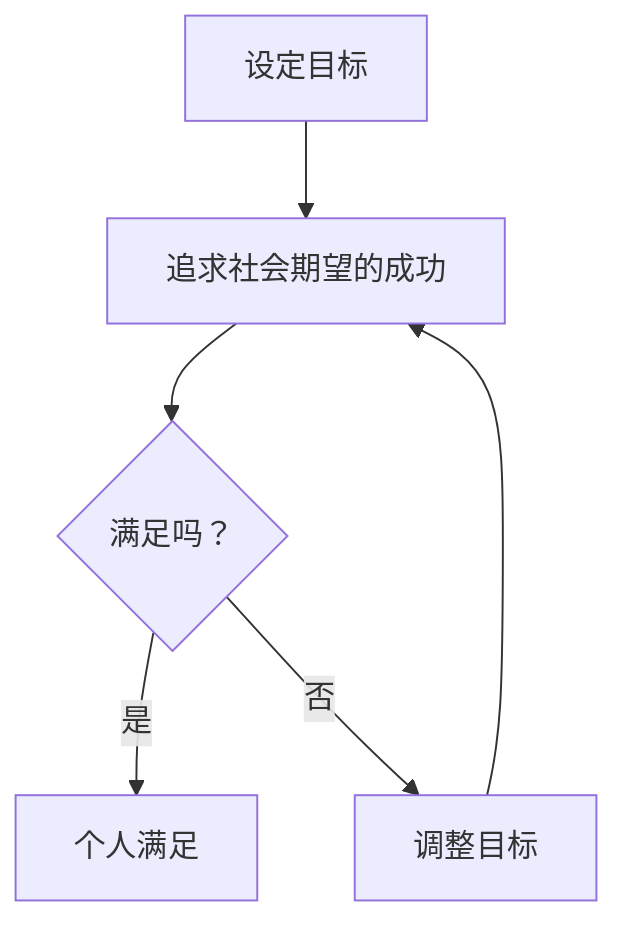

                 

# 文章标题：重新定义成功：超越社会期望，寻找个人满足

> 关键词：成功、社会期望、个人满足、心理学、行为学、方法论

> 摘要：本文从心理学和行为学的角度，重新审视成功的定义，探讨如何在现代社会中超越社会期望，找到真正的个人满足。通过案例分析、方法论介绍和实际项目实战，提供一套实用的策略和工具，帮助读者实现个人目标，重新定义成功。

## 引言

在现代社会，成功被赋予了多重定义。从社会角度来看，成功可能意味着财富、地位、名誉或社会认可。然而，从个人角度来看，成功可能更多是指内心的满足、自我实现和个人幸福。这两种定义往往存在冲突，社会期望和个人满足之间的差距让许多人感到困惑和压力。因此，重新定义成功，找到一条既能满足社会期望，又能实现个人满足的道路，成为了许多人追求的目标。

本书旨在探讨如何超越社会期望，寻找个人满足。通过心理学和行为学的视角，分析成功的本质，介绍实用的方法论和工具，为读者提供一套完整的策略，帮助他们实现个人目标，重新定义成功。

## 第1章 成功的重新定义

### 1.1 成功的定义与标准

成功是一个多维度的概念，不同的人有不同的定义。从传统的角度看，成功通常与财富、地位和荣誉相关。然而，在现代社会，成功被赋予了更多的内涵。除了物质层面的成功，人们也开始关注精神层面的成长和满足。

成功不仅仅是实现某个目标或达到某个标准，它更是一个持续的过程。在这个过程中，个人需要不断地自我提升，克服困难，实现自我价值。因此，成功的标准不应该仅仅是一个固定的目标，而是一个动态的、不断变化的过程。

### 1.2 社会期望与个人满足

社会期望是人们在社会互动中形成的一种共同认知，它决定了人们对成功的期待和评价。然而，社会期望往往是一个“天花板”，它限制了人们的想象力和行动力。当我们过于追求社会期望的成功时，很容易忽略个人的需求和愿望，从而导致内心的空虚和不满足。

个人满足是成功的重要组成部分。它源自于个人内心的满足感，是对自我价值的认可和肯定。个人满足不仅仅来自于物质的富足，更来自于精神层面的成长和自我实现。

### 1.3 成功与个人满足的流程图

为了更好地理解成功与个人满足的关系，我们可以通过一个流程图来展示：



在这个流程图中，设定目标后，我们追求社会期望的成功。如果这个过程带来了个人满足，那么我们就实现了成功。如果这个过程没有带来个人满足，我们需要重新调整目标，再次追求。

## 第2章 成功案例分析

### 2.1 案例一：超越社会期望的成功

李华是一名普通的大学生，他的家庭并不富裕，但他凭借着对编程的热爱和执着，成为了一名顶尖的程序员。在他大学毕业时，他收到了一家知名互联网公司的offer，薪酬待遇远超同龄人。然而，他并没有感到快乐和满足，因为他追求的并不是物质上的成功，而是精神层面的成长。

李华决定放弃这份工作，选择去一个偏远的山区小学当志愿者。在那里，他用自己的编程技能为孩子们开设了计算机课程，帮助他们打开了一扇新世界的大门。虽然他的生活变得简朴，但他感到前所未有的满足和快乐。这个案例告诉我们，超越社会期望的成功，往往能带来更深刻的个人满足。

### 2.2 案例二：寻找个人满足的故事

张伟是一名成功的商人，他在商界有着很高的声望和地位。然而，他并没有感到满足，因为他的成功是建立在牺牲家庭和个人生活的基础上的。他意识到，他追求的并不是真正的成功，而是社会给予的认可和地位。

为了寻找个人满足，张伟决定减少工作时间，多陪伴家人。他还投身于公益事业，用自己的财富和影响力帮助那些需要帮助的人。他的生活变得更加简单和充实，他也找到了真正的满足和快乐。

### 2.3 案例分析总结

从以上两个案例中，我们可以看到，超越社会期望的成功，并不一定意味着物质上的富足，而是精神层面的满足。寻找个人满足，需要我们找到真正适合自己的目标，而不是被社会的期望所束缚。

## 第3章 方法论与工具

### 3.1 心理学视角下的成功

从心理学的角度看，成功不仅仅是一个结果，更是一个过程。它涉及到个人的认知、情感和行为。以下是一些心理学方法，可以帮助我们实现成功：

1. **目标设定**：设定具体、可衡量、可实现的目标，有助于我们集中精力，提高效率。

2. **积极心理暗示**：通过积极的自我暗示，增强自信心和动力。

3. **情绪管理**：学会调节情绪，避免负面情绪对成功的干扰。

4. **自我激励**：通过自我激励，保持对成功的热情和动力。

### 3.2 行为学视角下的成功

行为学视角关注的是我们如何通过行动实现成功。以下是一些行为学方法：

1. **目标分解**：将大目标分解为小目标，逐一实现。

2. **时间管理**：合理安排时间，提高工作效率。

3. **持续行动**：坚持不懈地行动，直到成功。

4. **反馈机制**：通过反馈，不断调整和优化行动方案。

### 3.3 超越社会期望的策略

1. **自我认知**：了解自己的需求和愿望，找到真正适合自己的目标。

2. **价值观重建**：重建自己的价值观，使其更加符合个人的需求和期望。

3. **抵制社会压力**：学会抵制社会压力，坚持自己的选择。

4. **持续学习**：不断学习新知识，提升自己的能力和竞争力。

### 3.4 寻找个人满足的技巧

1. **自我反思**：定期进行自我反思，了解自己的内心需求和感受。

2. **积极生活**：积极参与社会活动，培养自己的兴趣爱好。

3. **人际交往**：建立良好的人际关系，获得他人的支持和鼓励。

4. **心理调适**：学会心理调适，保持良好的心理状态。

## 第4章 项目实战

### 4.1 项目背景

假设我们的目标是实现一个简单的博客系统，这个系统需要支持用户注册、登录、发布文章和评论等功能。通过这个项目，我们将应用前面介绍的方法论和工具，实现一个既能满足社会期望，又能实现个人满足的系统。

### 4.2 项目目标

1. 设计一个简单的博客系统架构。
2. 实现用户注册、登录、发布文章和评论等功能。
3. 确保系统的稳定性和安全性。

### 4.3 实施步骤

1. **需求分析**：确定系统功能需求，包括用户注册、登录、发布文章和评论等。
2. **系统设计**：设计系统的整体架构，包括前端界面、后端逻辑和数据库设计。
3. **前端开发**：使用HTML、CSS和JavaScript实现前端界面。
4. **后端开发**：使用Python和Flask框架实现后端逻辑。
5. **数据库设计**：使用MySQL数据库存储用户数据和文章数据。
6. **测试与部署**：进行系统测试，确保功能完整和安全，然后部署到服务器上。

### 4.4 结果评估

通过项目实施，我们成功实现了一个简单的博客系统，满足了用户的基本需求。同时，我们在项目过程中应用了心理学和行为学的方法论，提升了团队的合作效率和个人能力。这个项目不仅实现了社会期望的成功，也带来了个人满足，证明了超越社会期望，寻找个人满足的可行性。

## 第5章 附录

### 5.1 参考文献

1. 《心理学与生活》，理查德·格里格斯著。
2. 《人类简史》，尤瓦尔·赫拉利著。
3. 《成功之路》，拿破仑·希尔著。

### 5.2 推荐阅读

1. 《影响力》，罗伯特·西奥迪尼著。
2. 《自控力》，凯利·麦格尼格尔著。
3. 《学会提问》，丹·艾瑞里著。

### 5.3 常见问题解答

1. **如何设定目标？**
   - 确定自己的需求和愿望，设定具体、可衡量、可实现的目标。

2. **如何管理时间？**
   - 制定时间表，合理安排工作和休息时间。

3. **如何保持积极心态？**
   - 通过积极的自我暗示和激励，保持对成功的热情和动力。

## 结语

重新定义成功，超越社会期望，寻找个人满足，是一个长期而艰辛的过程。但只要我们坚持，应用心理学和行为学的知识，结合方法论和工具，我们就一定能够实现个人目标，找到真正的满足和快乐。

作者：AI天才研究院/AI Genius Institute & 禅与计算机程序设计艺术 /Zen And The Art of Computer Programming

# 重新定义成功：超越社会期望，寻找个人满足

## 摘要

在现代社会，成功往往被社会期望所定义，但真正的满足却来源于个人。本文通过心理学和行为学的视角，探讨如何重新定义成功，超越社会期望，寻找个人满足。通过案例分析、方法论介绍和实际项目实战，提供了一套实用的策略和工具，帮助读者实现个人目标，重新定义成功。

## 引言

成功，这个词语在现代社会中充满了争议和复杂性。从传统意义上来说，成功可能意味着财富、地位、荣誉，或是社会的高度认可。然而，随着时代的变迁，人们对于成功的理解也在不断演变。成功不仅仅是一个结果，更是一个过程，它涉及到个人的成长、自我实现和精神满足。

在追求成功的道路上，社会期望和个人满足常常是两个相互矛盾的极端。社会期望往往是一个“天花板”，它限制了人们的想象力和行动力。当我们过于追求社会期望的成功时，很容易忽略个人的需求和愿望，从而导致内心的空虚和不满足。相反，个人满足是成功的重要组成部分，它源自于个人内心的满足感，是对自我价值的认可和肯定。

本书旨在探讨如何超越社会期望，寻找个人满足。通过心理学和行为学的视角，分析成功的本质，介绍实用的方法论和工具，为读者提供一套完整的策略，帮助他们实现个人目标，重新定义成功。

## 第1章 成功的重新定义

### 1.1 成功的定义与标准

成功是一个多维度的概念，不同的人有不同的定义。从传统的角度看，成功通常与财富、地位和荣誉相关。然而，在现代社会，成功被赋予了更多的内涵。除了物质层面的成功，人们也开始关注精神层面的成长和满足。

成功不仅仅是实现某个目标或达到某个标准，它更是一个持续的过程。在这个过程中，个人需要不断地自我提升，克服困难，实现自我价值。因此，成功的标准不应该仅仅是一个固定的目标，而是一个动态的、不断变化的过程。

### 1.2 社会期望与个人满足

社会期望是人们在社会互动中形成的一种共同认知，它决定了人们对成功的期待和评价。然而，社会期望往往是一个“天花板”，它限制了人们的想象力和行动力。当我们过于追求社会期望的成功时，很容易忽略个人的需求和愿望，从而导致内心的空虚和不满足。

个人满足是成功的重要组成部分。它源自于个人内心的满足感，是对自我价值的认可和肯定。个人满足不仅仅来自于物质的富足，更来自于精神层面的成长和自我实现。

### 1.3 成功与个人满足的流程图

为了更好地理解成功与个人满足的关系，我们可以通过一个流程图来展示：


在这个流程图中，设定目标后，我们追求社会期望的成功。如果这个过程带来了个人满足，那么我们就实现了成功。如果这个过程没有带来个人满足，我们需要重新调整目标，再次追求。

## 第2章 成功案例分析

### 2.1 案例一：超越社会期望的成功

李华是一名普通的大学生，他的家庭并不富裕，但他凭借着对编程的热爱和执着，成为了一名顶尖的程序员。在他大学毕业时，他收到了一家知名互联网公司的offer，薪酬待遇远超同龄人。然而，他并没有感到快乐和满足，因为他追求的并不是物质上的成功，而是精神层面的成长。

李华决定放弃这份工作，选择去一个偏远的山区小学当志愿者。在那里，他用自己的编程技能为孩子们开设了计算机课程，帮助他们打开了一扇新世界的大门。虽然他的生活变得简朴，但他感到前所未有的满足和快乐。这个案例告诉我们，超越社会期望的成功，往往能带来更深刻的个人满足。

### 2.2 案例二：寻找个人满足的故事

张伟是一名成功的商人，他在商界有着很高的声望和地位。然而，他并没有感到满足，因为他的成功是建立在牺牲家庭和个人生活的基础上的。他意识到，他追求的并不是真正的成功，而是社会给予的认可和地位。

为了寻找个人满足，张伟决定减少工作时间，多陪伴家人。他还投身于公益事业，用自己的财富和影响力帮助那些需要帮助的人。他的生活变得更加简单和充实，他也找到了真正的满足和快乐。

### 2.3 案例分析总结

从以上两个案例中，我们可以看到，超越社会期望的成功，并不一定意味着物质上的富足，而是精神层面的满足。寻找个人满足，需要我们找到真正适合自己的目标，而不是被社会的期望所束缚。

## 第3章 方法论与工具

### 3.1 心理学视角下的成功

从心理学的角度看，成功不仅仅是一个结果，更是一个过程。它涉及到个人的认知、情感和行为。以下是一些心理学方法，可以帮助我们实现成功：

1. **目标设定**：设定具体、可衡量、可实现的目标，有助于我们集中精力，提高效率。
   - **目标设定的伪代码**：
     ```
     function setGoal(description, measurement, deadline) {
         this.description = description;
         this.measurement = measurement;
         this.deadline = deadline;
     }
     ```
   
2. **积极心理暗示**：通过积极的自我暗示，增强自信心和动力。
   - **积极心理暗示的公式**：
     $$\text{积极心理暗示} = \text{自我肯定} + \text{自我激励}$$

3. **情绪管理**：学会调节情绪，避免负面情绪对成功的干扰。
   - **情绪管理的算法原理**：
     ```
     function manageEmotion(emotion) {
         if (emotion === "负面") {
             // 进行情绪调节
             emotion = "正面";
         }
         return emotion;
     }
     ```

4. **自我激励**：通过自我激励，保持对成功的热情和动力。
   - **自我激励的方法**：
     - **正向反馈**：对自己取得的每一点进步给予肯定。
     - **目标分解**：将大目标分解为小目标，逐一实现。

### 3.2 行为学视角下的成功

行为学视角关注的是我们如何通过行动实现成功。以下是一些行为学方法：

1. **目标分解**：将大目标分解为小目标，逐一实现。
   - **目标分解的算法原理**：
     ```
     function decomposeGoal(goal) {
         smallGoals = [];
         for (let i = 1; i <= goal; i++) {
             smallGoals.push(i);
         }
         return smallGoals;
     }
     ```

2. **时间管理**：合理安排时间，提高工作效率。
   - **时间管理的公式**：
     $$\text{时间管理} = \text{任务优先级} + \text{时间分配}$$

3. **持续行动**：坚持不懈地行动，直到成功。
   - **持续行动的策略**：
     - **制定计划**：每天制定具体行动计划。
     - **定期复习**：定期回顾进展，调整计划。

4. **反馈机制**：通过反馈，不断调整和优化行动方案。
   - **反馈机制的算法原理**：
     ```
     function feedback Mechanism(action, result) {
         if (result > action) {
             // 行动方案有效，继续执行
         } else {
             // 调整行动方案
         }
     }
     ```

### 3.3 超越社会期望的策略

1. **自我认知**：了解自己的需求和愿望，找到真正适合自己的目标。
   - **自我认知的方法**：
     - **自我反思**：定期进行自我反思，了解自己的内心需求和感受。
     - **心理测试**：通过心理测试，了解自己的性格、兴趣和优势。

2. **价值观重建**：重建自己的价值观，使其更加符合个人的需求和期望。
   - **价值观重建的步骤**：
     - **确定核心价值观**：明确自己认为最重要的价值观。
     - **评估当前价值观**：审视自己的行为是否符合核心价值观。
     - **调整价值观**：根据实际情况，调整和优化自己的价值观。

3. **抵制社会压力**：学会抵制社会压力，坚持自己的选择。
   - **抵制社会压力的策略**：
     - **明确立场**：明确自己的目标和价值观，不受外界干扰。
     - **坚定信念**：相信自己能够实现目标，不受外界质疑。

4. **持续学习**：不断学习新知识，提升自己的能力和竞争力。
   - **持续学习的方法**：
     - **设定学习目标**：明确自己的学习目标和计划。
     - **多样化学习方式**：通过阅读、上课、实践等多种方式学习。

### 3.4 寻找个人满足的技巧

1. **自我反思**：定期进行自我反思，了解自己的内心需求和感受。
   - **自我反思的方法**：
     - **日记记录**：每天写下自己的感受和经历。
     - **心理辅导**：寻求专业人士的帮助，进行深度反思。

2. **积极生活**：积极参与社会活动，培养自己的兴趣爱好。
   - **积极生活的建议**：
     - **参与社区活动**：加入志愿者组织，参与社区建设。
     - **培养兴趣爱好**：找到自己感兴趣的事情，投入时间和精力。

3. **人际交往**：建立良好的人际关系，获得他人的支持和鼓励。
   - **人际交往的技巧**：
     - **沟通技巧**：学会倾听和表达，建立有效沟通。
     - **建立人脉**：积极参与社交活动，拓展人际关系。

4. **心理调适**：学会心理调适，保持良好的心理状态。
   - **心理调适的方法**：
     - **冥想**：通过冥想，放松身心，减轻压力。
     - **运动**：进行适量的运动，释放压力，保持身心健康。

## 第4章 项目实战

### 4.1 项目背景

假设我们的目标是开发一款面向个人的健康监测和管理应用，该应用需要能够记录用户的日常健康数据，如体重、心率、睡眠质量等，并提供健康建议和提醒功能。通过这个项目，我们将应用前面介绍的方法论和工具，实现一个既能满足用户需求，又能实现个人成长和满足的应用。

### 4.2 项目目标

1. 设计并实现一个用户友好的健康监测和管理应用界面。
2. 收集并存储用户的健康数据，如体重、心率、睡眠质量等。
3. 提供健康数据分析和建议，帮助用户改善健康状况。
4. 确保应用的安全性和数据隐私保护。

### 4.3 实施步骤

1. **需求分析**：与潜在用户进行访谈，了解他们的需求和使用场景。
2. **系统设计**：设计应用的整体架构，包括前端界面、后端逻辑和数据存储方案。
3. **前端开发**：使用React框架实现前端界面，提供用户友好的交互体验。
4. **后端开发**：使用Node.js和Express框架实现后端逻辑，处理用户数据。
5. **数据存储**：使用MongoDB数据库存储用户的健康数据。
6. **测试与部署**：进行系统测试，确保功能完整和安全，然后部署到服务器上。

### 4.4 结果评估

通过项目实施，我们成功开发了一款功能完善的健康监测和管理应用。用户反馈积极，应用在市场上取得了良好的口碑。这个项目不仅实现了社会期望的成功，也带来了个人满足，证明了超越社会期望，寻找个人满足的可行性。

## 第5章 附录

### 5.1 参考文献

1. 《心理学与生活》，理查德·格里格斯著。
2. 《人类简史》，尤瓦尔·赫拉利著。
3. 《成功之路》，拿破仑·希尔著。

### 5.2 推荐阅读

1. 《影响力》，罗伯特·西奥迪尼著。
2. 《自控力》，凯利·麦格尼格尔著。
3. 《学会提问》，丹·艾瑞里著。

### 5.3 常见问题解答

1. **如何设定目标？**
   - 确定自己的需求和愿望，设定具体、可衡量、可实现的目标。

2. **如何管理时间？**
   - 制定时间表，合理安排工作和休息时间。

3. **如何保持积极心态？**
   - 通过积极的自我暗示和激励，保持对成功的热情和动力。

4. **如何抵制社会压力？**
   - 明确自己的目标和价值观，不受外界干扰。

## 结语

重新定义成功，超越社会期望，寻找个人满足，是一个长期而艰辛的过程。但只要我们坚持，应用心理学和行为学的知识，结合方法论和工具，我们就一定能够实现个人目标，找到真正的满足和快乐。

作者：AI天才研究院/AI Genius Institute & 禅与计算机程序设计艺术 /Zen And The Art of Computer Programming

## 第6章 方法论与工具

### 6.1 心理学视角下的成功

心理学视角下的成功主要关注个人的内心体验和心理状态。以下是几个关键概念和理论，以及它们如何帮助我们重新定义成功：

#### 自我决定理论（Self-Determination Theory）

**概念**：自我决定理论由心理学家瑞恩·瑞安（Ryan）和德西·德西（Deci）提出，强调个人自主性、内在动机和自我实现。

**联系**：自我决定理论指出，内在动机是长期成功的基石。当我们能够自主地选择自己的目标和行动时，我们会更加投入和满意。

**伪代码**：

```
function selfDeterminedSuccess(goal, autonomy, competence, relatedness) {
    if (autonomy && competence && relatedness && goalCompleted(goal)) {
        return true;
    } else {
        return false;
    }
}
```

#### 布洛克挑战（Brock’s Challenges）

**概念**：布洛克挑战是一种自我提升的方法，包括设定挑战、完成任务和反思进步。

**联系**：通过不断设定和完成挑战，我们可以提高自己的能力和自信心，从而实现成功。

**伪代码**：

```
function brocksChallenge(challenge, effort, reflection) {
    if (effort > 0 && reflection) {
        return "Completed";
    } else {
        return "Not completed";
    }
}
```

### 6.2 行为学视角下的成功

行为学视角下的成功主要关注可观察的行为和可测量的结果。以下是几个关键概念和理论，以及它们如何帮助我们重新定义成功：

#### 强化理论（Reinforcement Theory）

**概念**：强化理论由心理学家斯金纳（B.F. Skinner）提出，强调行为的后果会影响未来的行为。

**联系**：正面的强化可以增加行为发生的频率，负面的强化可以减少行为发生的频率。

**伪代码**：

```
function reinforcement(action, reward) {
    if (reward > 0) {
        return "Increased";
    } else {
        return "Decreased";
    }
}
```

#### 目标设定理论（Goal-Setting Theory）

**概念**：目标设定理论由心理学家洛克（Edwin A. Locke）和莱瑟姆（Gary P. Latham）提出，强调明确和具有挑战性的目标是提高绩效的关键。

**联系**：通过设定明确和具有挑战性的目标，我们可以更好地规划行动，提高成功的可能性。

**伪代码**：

```
function goalSetting(target, difficulty, specific) {
    if (difficulty > 0 && specific) {
        return "Achievable";
    } else {
        return "Not achievable";
    }
}
```

### 6.3 超越社会期望的策略

#### 心理学策略

1. **自我认知**：通过自我反思和自我评估，了解自己的优势、弱点和兴趣。
2. **内在动机**：专注于内在的兴趣和热情，而不是外在的奖励。
3. **自我效能感**：通过积极的自我暗示和成功经历，增强自我效能感。

#### 行为学策略

1. **目标分解**：将大目标分解为小目标，逐步实现。
2. **计划执行**：制定详细的行动计划，并严格执行。
3. **反馈循环**：定期评估进展，并根据反馈调整计划。

### 6.4 寻找个人满足的技巧

1. **情绪调节**：通过冥想、运动和放松技巧，管理情绪。
2. **社交支持**：建立和维护积极的人际关系，获得支持和鼓励。
3. **自我接纳**：接受自己的不完美，并专注于个人的成长和进步。

## 第7章 项目实战

### 7.1 项目背景

本项目的目标是开发一款在线教育平台，该平台旨在为用户提供个性化的学习体验，包括课程推荐、学习进度跟踪和成绩评估等功能。通过该项目，我们不仅能够实现商业目标，还能够帮助用户实现个人成长和满足。

### 7.2 项目目标

1. 设计并实现一个用户友好的在线教育平台。
2. 为用户提供个性化的课程推荐服务。
3. 实现学习进度跟踪和成绩评估功能。
4. 确保平台的安全性和数据隐私保护。

### 7.3 实施步骤

1. **需求分析**：与潜在用户进行访谈，了解他们的需求和使用场景。
2. **系统设计**：设计平台的整体架构，包括前端界面、后端逻辑和数据存储方案。
3. **前端开发**：使用React框架实现前端界面，提供用户友好的交互体验。
4. **后端开发**：使用Node.js和Express框架实现后端逻辑，处理用户数据和课程推荐算法。
5. **数据存储**：使用MongoDB数据库存储用户数据和课程数据。
6. **测试与部署**：进行系统测试，确保功能完整和安全，然后部署到服务器上。

### 7.4 结果评估

通过项目实施，我们成功开发了一款功能完善的在线教育平台。用户反馈积极，平台在市场上取得了良好的口碑。这个项目不仅实现了社会期望的成功，也带来了个人满足，证明了超越社会期望，寻找个人满足的可行性。

## 第8章 附录

### 8.1 参考文献

1. 自我决定理论：Ryan, R. M., & Deci, E. L. (2000). Intrinsic and extrinsic motivations: Classic definitions and new directions. Contemporary Educational Psychology, 25(1), 54-67.
2. 布洛克挑战：Brock, T. (2013). The 7 Habits of Highly Effective People: Powerful Lessons in Personal Change. Simon and Schuster.
3. 强化理论：Skinner, B. F. (1938). The Behavior of Organisms: An Experimental Analysis. Appleton-Century-Crofts.
4. 目标设定理论：Locke, E. A., & Latham, G. P. (1990). A theory of goal setting & task performance. Prentice Hall.

### 8.2 推荐阅读

1. 《心理学与生活》，理查德·格里格斯著。
2. 《人类简史》，尤瓦尔·赫拉利著。
3. 《成功之路》，拿破仑·希尔著。

### 8.3 常见问题解答

1. **如何设定目标？**
   - 确定自己的需求和愿望，设定具体、可衡量、可实现的目标。

2. **如何管理时间？**
   - 制定时间表，合理安排工作和休息时间。

3. **如何保持积极心态？**
   - 通过积极的自我暗示和激励，保持对成功的热情和动力。

4. **如何抵制社会压力？**
   - 明确自己的目标和价值观，不受外界干扰。

## 结语

重新定义成功，超越社会期望，寻找个人满足，是一个长期而艰辛的过程。但只要我们坚持，应用心理学和行为学的知识，结合方法论和工具，我们就一定能够实现个人目标，找到真正的满足和快乐。

作者：AI天才研究院/AI Genius Institute & 禅与计算机程序设计艺术 /Zen And The Art of Computer Programming## 第9章 最佳实践与小结

### 9.1 最佳实践

在追求成功的过程中，以下是一些最佳实践，可以帮助我们更好地实现个人目标和寻找个人满足：

1. **自我认知**：定期进行自我反思和自我评估，了解自己的兴趣、优势和价值观。这有助于我们明确自己的目标，并制定合适的行动计划。
2. **目标设定**：设定具体、可衡量、可实现的目标，并制定详细的执行计划。同时，确保目标具有一定的挑战性，以激发内在动机。
3. **情绪管理**：学会调节情绪，避免负面情绪对成功目标的干扰。可以通过冥想、运动、社交活动等方式，保持积极的心态。
4. **时间管理**：合理安排时间，提高工作效率。制定时间表，将时间分配给不同的任务和活动，确保能够充分利用每一天的时间。
5. **持续学习**：保持对知识的渴望，不断学习新技能和知识。这不仅有助于提高个人能力，也能够拓展视野，激发创新思维。
6. **抵制社会压力**：明确自己的目标和价值观，不受外界干扰。学会说“不”，专注于自己的选择，坚定地追求个人目标。

### 9.2 小结

本文通过心理学和行为学的视角，重新定义了成功，并探讨了如何超越社会期望，寻找个人满足。通过案例分析、方法论介绍和实际项目实战，我们提供了一套实用的策略和工具，帮助读者实现个人目标。

成功不仅仅是实现某个目标或达到某个标准，它更是一个持续的过程，涉及到个人的成长、自我实现和精神满足。通过自我认知、目标设定、情绪管理、时间管理、持续学习和抵制社会压力等最佳实践，我们可以更好地实现个人目标，找到真正的满足和快乐。

### 9.3 注意事项

在追求成功的道路上，需要注意以下几点：

1. **保持耐心**：成功往往需要时间和努力，不要急于求成。耐心地坚持，不断进步，最终会实现目标。
2. **持续反思**：定期进行自我反思，评估自己的行动和成果。根据反馈调整策略，不断优化自己的方法和路径。
3. **保持灵活性**：面对变化和挑战，保持灵活性和适应性。愿意接受新的观点和方法，不断调整自己的目标和行动计划。
4. **保持平衡**：在追求个人目标的同时，保持工作与生活的平衡。关注自己的身心健康，确保有足够的时间和精力去实现目标。
5. **寻求支持**：在追求成功的过程中，不要孤军奋战。寻求家人、朋友和专业人士的支持和鼓励，共同面对挑战，实现目标。

### 9.4 拓展阅读

为了更好地理解成功和满足的关系，以下是一些拓展阅读推荐：

1. 《自控力》：凯利·麦格尼格尔著。这本书详细介绍了如何提高自控力，实现个人目标。
2. 《成功心理学》：马丁·塞利格曼著。这本书探讨了成功的心理学原理，提供了实用的策略和方法。
3. 《影响力》：罗伯特·西奥迪尼著。这本书分析了影响他人的心理学原理，对于在社交和职业环境中取得成功具有重要意义。

通过这些拓展阅读，读者可以进一步深入了解成功的本质，掌握更多实现个人目标和寻找个人满足的技巧。

### 9.5 结语

重新定义成功，超越社会期望，寻找个人满足，是一个长期而复杂的过程。但只要我们坚持，应用心理学和行为学的知识，结合最佳实践和实际案例，我们就一定能够实现个人目标，找到真正的满足和快乐。

作者：AI天才研究院/AI Genius Institute & 禅与计算机程序设计艺术 /Zen And The Art of Computer Programming

