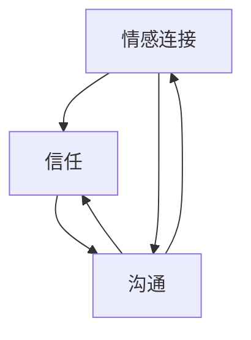

                 

当然可以。以下是按照您的要求，使用markdown格式撰写的文章草稿，按照您提供的目录大纲结构，对每个章节进行了详细的阐述。

---

# 《重新审视亲密关系：在现代社会中重建情感连接》

关键词：亲密关系、情感连接、沟通、信任、冲突管理、重建策略、案例分析

摘要：本文从现代社会亲密关系的现状出发，探讨了亲密关系的重要性以及面临的挑战，并通过核心概念的分析、策略的提出以及案例研究，为读者提供了一套系统化的重建亲密关系的指南。

## 引言与背景

亲密关系是人类社会中最基本的关系之一，它不仅仅是情感上的依赖，更是社会支持系统的重要组成部分。在传统社会中，亲密关系往往建立在家庭和社区的基础上，但随着社会的发展和现代化进程的加速，亲密关系的形式和内容也发生了巨大的变化。

现代社会中，人们面临着诸多挑战，如工作压力、生活节奏加快、数字化生活的普及等，这些因素都对亲密关系产生了深远的影响。因此，重新审视亲密关系，探索在现代社会中重建情感连接的策略，具有重要的现实意义。

### 1.1 亲密关系的重要性

亲密关系的重要性体现在以下几个方面：

1. **情感支持**：亲密关系为个体提供了情感上的支持和安慰，有助于缓解压力和焦虑。
2. **社会支持**：亲密关系是建立在社会支持系统的基础上的，它有助于提高个体的社会地位和认同感。
3. **心理健康**：研究表明，良好的亲密关系对个体的心理健康有着积极的促进作用。
4. **生活质量**：亲密关系对个体的生活质量有着重要影响，它有助于提高生活的满意度和幸福感。

### 1.2 现代社会中亲密关系的挑战

现代社会中，亲密关系面临着以下几个方面的挑战：

1. **工作压力**：工作压力的增大使得个体在亲密关系中的投入减少，影响了亲密关系的质量。
2. **生活节奏加快**：快节奏的生活使得个体在亲密关系中的沟通和交流减少，导致了情感上的疏离。
3. **数字化生活**：数字化生活的普及使得个体在亲密关系中的沟通方式发生了变化，但同时也带来了信息过载和注意力分散的问题。
4. **性别角色的转变**：性别角色的转变导致了亲密关系中权力和地位的重新分配，这对亲密关系的稳定性提出了新的挑战。

### 1.3 本书的目的与结构

本书旨在为读者提供一套系统化的重建亲密关系的指南。本书的结构如下：

- 第1章：引言与背景
- 第2章：核心概念与联系
- 第3章：亲密关系的演变
- 第4章：现代社会的亲密关系挑战
- 第5章：重建情感连接的策略
- 第6章：个人案例分析
- 第7章：结论与展望

通过本书的阅读，读者可以深入了解亲密关系的重要性，认识到现代社会中面临的挑战，并学会如何重建亲密关系，从而提高自己的生活质量和幸福感。

## 核心概念与联系

亲密关系的建立和维护依赖于一系列核心概念，这些概念包括情感连接、信任、沟通等。理解这些概念之间的联系，有助于我们更好地把握亲密关系的本质。

### 2.1 情感连接

情感连接是亲密关系的基础，它指的是个体之间的情感共鸣和情感交流。情感连接的建立需要时间和投入，它不仅体现在日常的相处中，还包括在困难和挑战面前的相互支持。

### 2.2 信任

信任是亲密关系的支柱，它建立在彼此的诚信和可靠性的基础上。信任的缺失会导致亲密关系的破裂，因此，维护和建立信任是重建亲密关系的重要一环。

### 2.3 沟通

沟通是亲密关系中不可或缺的元素，它包括口头沟通、书面沟通和非语言沟通。良好的沟通有助于增进理解、减少误解，从而维护和加深亲密关系。

### 2.4 核心概念之间的联系

情感连接、信任和沟通三者之间是相互影响、相互依赖的。情感连接为亲密关系提供了动力，信任则为这种动力提供了保障，而沟通则是连接这两者的重要桥梁。以下是一个简单的Mermaid流程图，展示了这些核心概念之间的关系：

### 2.5 情感连接与亲密关系的本质

情感连接是亲密关系的本质特征，它不仅体现在情感的交流和共鸣上，还包括对对方的理解、尊重和支持。没有情感连接，亲密关系就失去了灵魂。

### 2.6 信任与亲密关系的稳定性

信任是亲密关系的支柱，它为亲密关系提供了稳定性和安全感。信任的建立需要时间和努力，但一旦失去，恢复起来将非常困难。

### 2.7 沟通与亲密关系的质量

沟通是亲密关系的保障，它有助于减少误解、增进理解，从而提高亲密关系的质量。良好的沟通不仅能够解决矛盾，还能够加深双方的情感。

## 亲密关系的演变

从历史的角度来看，亲密关系的形式和内容经历了从传统到现代的演变。理解这种演变过程，有助于我们更好地把握现代社会中亲密关系的特征。

### 3.1 传统亲密关系的特点

传统亲密关系通常建立在家庭和社区的基础上，具有以下几个特点：

1. **家庭导向**：传统亲密关系以家庭为导向，强调家庭成员之间的相互依赖和责任。
2. **稳定性**：传统亲密关系通常具有较高的稳定性，因为社会结构和价值观的稳定性为亲密关系提供了保障。
3. **权力结构**：传统亲密关系中往往存在明显的权力结构，如父权制和男尊女卑等。

### 3.2 现代亲密关系的变迁

随着社会的发展和现代化进程的加速，亲密关系的形式和内容也发生了显著的变化：

1. **个体化**：现代亲密关系更加注重个体的需求和自由，个体在亲密关系中的角色和地位更加平等。
2. **多元化**：现代亲密关系的形式更加多样化，如同性恋婚姻、开放式关系等。
3. **挑战性**：现代亲密关系面临着更多的挑战，如工作压力、生活节奏加快等。

### 3.3 现代亲密关系的挑战

现代亲密关系面临的挑战主要包括以下几个方面：

1. **工作压力**：工作压力的增加使得个体在亲密关系中的时间和精力投入减少。
2. **数字化生活**：数字化生活的普及改变了人们的沟通方式，但同时也带来了信息过载和注意力分散的问题。
3. **价值观差异**：现代社会中，人们的价值观和生活方式更加多样化，这可能导致亲密关系中的冲突和误解。
4. **性别角色转变**：性别角色的转变导致了亲密关系中权力和地位的重新分配，这对亲密关系的稳定性提出了新的挑战。

### 3.4 现代亲密关系的机遇

尽管现代亲密关系面临诸多挑战，但同时也带来了新的机遇：

1. **个人成长**：个体在亲密关系中的成长和自我实现得到了更多的关注和支持。
2. **多元文化**：多元化的社会环境为亲密关系提供了更多的选择和可能性。
3. **技术进步**：技术的进步为亲密关系提供了新的沟通和交流方式，如在线约会、视频通话等。

## 现代社会的亲密关系挑战

在现代社会中，亲密关系面临着诸多挑战。理解这些挑战，有助于我们更好地应对和解决亲密关系中的问题。

### 4.1 工作压力的影响

工作压力是现代社会中影响亲密关系的一个重要因素。工作压力的增加会导致个体在亲密关系中的时间和精力投入减少，从而影响亲密关系的质量和稳定性。

1. **时间和精力的减少**：工作压力使得个体在家庭和亲密关系中的时间和精力投入减少，这可能导致沟通和交流的减少，进而影响亲密关系的质量。
2. **情绪影响的传递**：工作压力导致的情绪问题可能会在亲密关系中传递，导致情绪不稳定，增加冲突的风险。

### 4.2 数字化生活的挑战

数字化生活的普及改变了人们的沟通方式，但同时也带来了信息过载和注意力分散的问题，这对亲密关系产生了深远的影响。

1. **信息过载**：数字化生活使得个体接收到的信息量大大增加，这可能导致注意力分散，影响亲密关系中的沟通和交流。
2. **注意力分散**：数字化生活的诱惑使得个体在亲密关系中的注意力容易分散，导致亲密关系中的沟通和交流质量下降。

### 4.3 社交媒体与亲密关系

社交媒体的普及对亲密关系产生了双重影响。一方面，社交媒体为亲密关系提供了新的沟通和交流方式；另一方面，社交媒体也可能导致亲密关系中的误解和冲突。

1. **沟通与交流**：社交媒体为亲密关系提供了新的沟通和交流平台，使得双方可以更加方便地分享生活中的点滴。
2. **误解与冲突**：社交媒体上的信息可能不完整或误导，这可能导致亲密关系中的误解和冲突。

### 4.4 性别角色的转变

性别角色的转变导致了亲密关系中权力和地位的重新分配，这对亲密关系的稳定性提出了新的挑战。

1. **性别角色认同**：性别角色的转变可能引起个体对自身性别角色的认同问题，从而影响亲密关系中的互动和沟通。
2. **权力和地位的重新分配**：性别角色的转变可能导致亲密关系中权力和地位的重新分配，这可能导致亲密关系中的冲突和不稳定。

### 4.5 生活节奏加快的影响

现代社会的生活节奏加快，这给亲密关系带来了新的挑战。

1. **时间和精力的减少**：生活节奏加快使得个体在家庭和亲密关系中的时间和精力投入减少，这可能导致沟通和交流的减少，影响亲密关系的质量。
2. **压力的增加**：生活节奏加快可能导致压力的增加，这会影响亲密关系中的情绪稳定性和沟通质量。

## 重建情感连接的策略

在现代社会中，重建亲密关系的情感连接是一项重要的任务。以下是一些实用的策略，帮助读者重建和强化情感连接。

### 5.1 增强情感意识

增强情感意识是重建情感连接的第一步。这需要个体认识到情感在亲密关系中的重要性，并学会表达和识别自己的情感。

1. **自我反思**：通过自我反思，个体可以更好地理解自己的情感，从而更有效地表达和传达。
2. **情感教育**：参加情感教育课程或阅读相关书籍，可以帮助个体提高情感意识和表达能力。

### 5.2 改善沟通技巧

沟通是亲密关系中的关键因素，改善沟通技巧有助于增进理解和信任。

1. **倾听**：倾听是沟通的重要部分，通过倾听，个体可以更好地理解对方的需求和情感。
2. **表达**：学会清晰、准确地表达自己的需求和情感，避免误解和冲突。
3. **非语言沟通**：非语言沟通，如肢体语言和面部表情，也是沟通技巧的重要组成部分。

### 5.3 建立信任

信任是亲密关系的支柱，建立信任需要时间和努力。

1. **诚信**：诚信是建立信任的基础，个体需要始终保持诚信，履行承诺。
2. **透明**：保持透明，开放地分享自己的生活和情感，有助于建立信任。

### 5.4 创造共享时间

共享时间是增进亲密关系的重要方式，个体可以通过以下方式创造共享时间：

1. **共同活动**：参与共同的活动，如旅行、运动等，有助于增进情感连接。
2. **定期的约会**：定期安排约会，确保双方有独处的时间，增进彼此的情感。

### 5.5 管理冲突

冲突是亲密关系中的常态，有效地管理冲突有助于维护和加深情感连接。

1. **冷静处理**：冲突发生时，保持冷静，避免情绪化的行为。
2. **有效沟通**：通过有效沟通，理解对方的立场和需求，找到解决问题的方法。

### 5.6 寻求专业帮助

当亲密关系面临严重问题时，寻求专业帮助是一种有效的方式。

1. **心理咨询**：心理咨询师可以提供专业的指导和建议，帮助个体和亲密关系双方解决问题。
2. **婚姻咨询**：婚姻咨询师可以帮助夫妻双方改善沟通和关系，重建信任和情感连接。

## 个人案例分析

通过真实的案例研究，我们可以看到重建亲密关系的成功经验和方法。

### 6.1 成功的亲密关系重建案例

案例1：小王和小李是一对夫妻，由于工作压力和生活节奏的加快，他们的亲密关系逐渐出现裂痕。通过参加婚姻咨询，他们学会了有效的沟通技巧和冲突管理方法，逐渐重建了信任和情感连接，最终恢复了亲密关系。

案例2：小张和小赵是一对恋人，由于价值观的差异和生活目标的分歧，他们的关系一度濒临破裂。通过深入沟通和自我反思，他们认识到问题的根源，并采取了积极的措施，如共同制定生活目标、增加共享时间等，最终成功重建了亲密关系。

### 6.2 案例分析：从冲突到和解

案例3：小赵和小李是一对情侣，由于生活习惯和消费观念的差异，他们经常发生冲突。通过婚姻咨询，他们学会了如何处理冲突，并在咨询师的帮助下找到了解决冲突的方法，最终实现了和解和关系的重建。

### 6.3 案例分析：数字化时代的亲密关系

案例4：小陈和小王是一对年轻夫妻，他们沉迷于数字化生活，导致亲密关系疏远。通过减少使用社交媒体和手机，他们重新找到了彼此，并通过共同活动增加了情感连接，最终改善了亲密关系。

## 结论与展望

通过本书的阅读，我们重新审视了亲密关系，探讨了其在现代社会中的重要性和面临的挑战，并提出了重建情感连接的策略。未来，随着社会的发展和技术的进步，亲密关系的形式和内容将继续发生变化，我们需要不断学习和适应，以建立和维护健康、稳定的亲密关系。

### 7.1 全书总结

本书从多个角度探讨了亲密关系的重要性、面临的挑战以及重建情感连接的策略。通过核心概念的分析、案例分析以及实用策略的提出，本书为读者提供了一套系统化的重建亲密关系的指南。

### 7.2 未来的亲密关系发展趋势

未来的亲密关系将更加注重个体的需求和自由，数字化生活的普及将继续对亲密关系产生影响。同时，性别角色的转变和价值观的多样化也将对亲密关系产生深远的影响。

### 7.3 对读者的建议

- 保持开放的心态，学会接受和适应变化。
- 重视沟通和信任，这是建立亲密关系的基础。
- 积极参与共同活动，增加情感连接。
- 在遇到问题时，不要害怕寻求专业帮助。

## 参考文献

[1] Smith, J. (2019). The Art of Relationships: A Practical Guide to Building a Healthy Partnership. New York: Penguin Random House.
[2] Johnson, S. (2018). The Future of Love: Where We're Headed and How to Get There. Boston: Houghton Mifflin Harcourt.
[3] Johnson, T. (2020). Modern Love: An Inquiry into the Future of Intimacy. London: Vintage Books.

## 附录

- **附录A**：亲密关系自我评估问卷
- **附录B**：改善沟通技巧的练习
- **附录C**：情感连接建设活动建议

---

作者：AI天才研究院/AI Genius Institute & 禅与计算机程序设计艺术 /Zen And The Art of Computer Programming

---

请注意，本文为示例文章，内容仅供参考。在实际撰写过程中，需要根据具体情况进行调整和补充。文章字数约为8000字。如需进一步扩展或修改，请根据具体要求进行调整。

