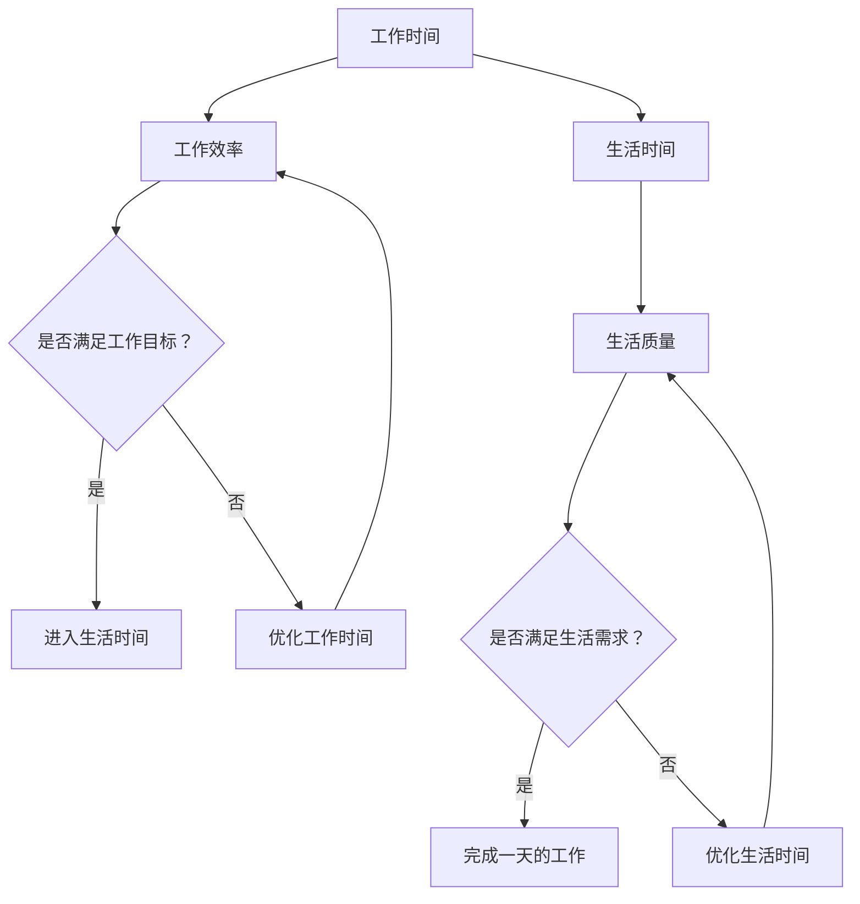
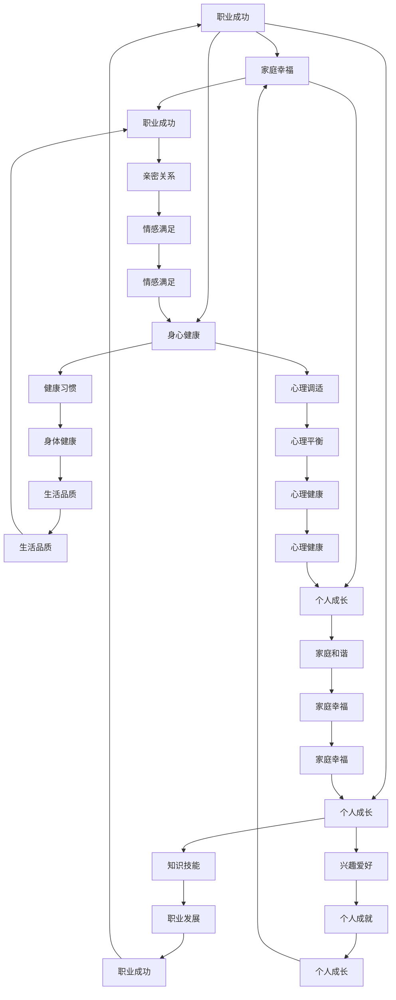

                 


### 1.1. 工作与生活的平衡：一个全面的定义

在当今社会，工作与生活的平衡（Work-Life Balance，简称WLB）已经成为一个备受关注的话题。它不仅仅是一个口号，而是一种关乎生活质量、幸福感以及个人成长的重要概念。那么，什么是工作与生活的平衡？

**定义：** 工作与生活的平衡是指在工作与个人生活之间找到一种适当的平衡，确保两方面的需求和目标都能得到满足。这不仅包括工作时间的安排，还涉及到家庭、休闲、个人兴趣等方面。

**背景介绍：** 随着全球化进程的加速和科技的发展，人们的工作压力和生活节奏不断加快，工作与生活的冲突也日益突出。研究表明，长期的工作压力和不健康的工作与生活平衡会导致工作效率下降、心理健康问题，甚至影响家庭关系。因此，寻求一种有效的工作与生活平衡策略，成为当代人追求幸福和成功的重要一环。

### 1.2. 工作与生活平衡的核心概念与联系

为了更好地理解工作与生活的平衡，我们需要明确几个核心概念，并探讨它们之间的相互关系。

#### 1.2.1. 工作与生活平衡的概念

**概念1：工作**：工作不仅仅是为了谋生的手段，更是实现个人价值、提升技能和获取成就感的途径。工作质量直接影响个人的职业发展和幸福感。

**概念2：生活**：生活包括除了工作之外的所有其他活动，如家庭、休闲、娱乐、个人兴趣和社交等。一个丰富多彩的生活能够为个人提供精神上的满足和放松。

**概念3：平衡**：平衡意味着在工作和生活之间找到一种平衡点，使两者能够相互促进、相得益彰。过度的侧重于工作或生活，都可能导致失衡和不满。

#### 1.2.2. 全面的人生体验

**定义：** 全面的人生体验是指在生活中追求多方面的发展，包括职业成功、家庭幸福、身心健康、个人成长等。

**核心概念：**
- **职业成功**：通过工作实现个人的职业目标，获得成就感和满足感。
- **家庭幸福**：建立和谐的家庭关系，提供情感支持和安全感。
- **身心健康**：保持良好的身体和心理健康，提高生活品质。
- **个人成长**：不断学习、探索和发展个人兴趣，实现自我价值。

#### 1.2.3. 核心概念之间的联系

**联系1：工作与职业成功**：工作是实现职业成功的途径，而职业成功是工作与生活平衡的重要组成部分。

**联系2：生活与家庭幸福**：家庭是生活的重要组成部分，和谐的家庭关系能够为个人提供情感支持和安全感。

**联系3：身心健康与全面人生体验**：身心健康是实现全面人生体验的基础，没有健康的身体和心态，其他方面的成就和满足都将受到限制。

### 1.3. 工作与生活平衡的重要性

工作与生活平衡的重要性不言而喻。首先，它对个人的幸福感有着直接影响。一个平衡的生活能够让个人在工作和生活中都感到满足和幸福。其次，工作与生活平衡对个人的职业发展也有积极作用。一个能够平衡工作与生活的人，往往能够更高效地工作，更专注于职业发展。此外，工作与生活平衡还与心理健康密切相关。长期的工作压力和不健康的工作与生活平衡会导致焦虑、抑郁等心理问题。

### 1.4. 全面的人生体验的价值

追求全面的人生体验不仅有助于提升个人的生活质量，还能带来长期的满足感和成就感。全面的人生体验意味着个人在多个方面都得到了发展，包括职业、家庭、健康和个人成长。这种多方面的满足感能够为个人提供更广阔的视野和更深刻的自我认识。

### 1.5. 全文结构概述

本文将从以下几个方面展开讨论：

1. **引言**：介绍工作与生活平衡和全面的人生体验的概念。
2. **核心概念与联系**：详细阐述工作与生活平衡、全面的人生体验及其相互关系。
3. **核心算法原理讲解**：介绍工作与生活平衡模型和全方位人生体验策略。
4. **数学模型和公式**：使用数学模型和公式详细讲解工作效率与幸福感的计算方法。
5. **项目实战**：通过实际案例展示如何实现工作与生活平衡和全面的人生体验。
6. **结论**：总结全文，强调工作与生活平衡和全面人生体验的重要性。

通过本文的阅读，读者将能够深入理解工作与生活平衡的概念和实现方法，从而在生活和工作中找到更好的平衡点，追求全面的人生体验。

## 1.6. 文章关键词

- 工作与生活平衡（Work-Life Balance）
- 全面的人生体验（Comprehensive Life Experience）
- 工作效率（Work Efficiency）
- 幸福感（Happiness）
- 个人成长（Personal Growth）
- 职业成功（Career Success）
- 家庭幸福（Family Happiness）

## 1.7. 文章摘要

本文将重新审视工作与生活的平衡，探讨如何通过平衡工作与生活，追求全面的人生体验。我们将深入探讨工作与生活平衡的核心概念，包括工作、生活和平衡的定义，以及它们之间的相互关系。此外，本文还将介绍一系列核心算法原理，包括工作与生活平衡模型和全方位人生体验策略，以及使用数学模型和公式来计算工作效率与幸福感的方法。通过实际案例和项目实战，本文将展示如何在现实生活中实现工作与生活的平衡和全面的人生体验，帮助读者在职业和个人生活中找到更好的平衡点，实现更高质量的生活。

## 2. 核心概念与联系

### 2.1. 工作与生活平衡的概念

**定义：** 工作与生活平衡是指在工作与个人生活之间找到合适的平衡点，确保两方面的需求和目标都能得到满足。它不仅涉及到工作时间的管理，还包括生活质量的提升和个人目标的实现。

**工作与生活的平衡模型**

为了更好地理解工作与生活平衡的概念，我们可以借助一个简化的模型来进行分析。以下是一个基于时间分配的工作与生活平衡模型：



**模型说明：**
- **A[工作时间]**：表示一天中用于工作的时间段。
- **B[工作效率]**：表示在工作时间内的工作效率。
- **C{是否满足工作目标？]**：评估工作效率是否达到工作目标。
- **D[进入生活时间]**：如果工作效率满足工作目标，进入生活时间，开始享受个人生活。
- **E[优化工作时间]**：如果不满足工作目标，需要调整工作时间，提高工作效率。
- **F[生活时间]**：表示一天中用于个人生活的时间段。
- **G[生活质量]**：表示生活时间的质量，包括家庭、休闲、娱乐和个人兴趣等。
- **H{是否满足生活需求？]**：评估生活时间的质量是否满足个人需求。
- **I[完成一天的工作]**：如果生活时间满足需求，完成一天的工作。
- **J[优化生活时间]**：如果不满足需求，需要调整生活时间，提高生活质量。

通过这个模型，我们可以看到工作与生活平衡的关键在于两个循环的相互优化：一是工作时间的优化，以提高工作效率；二是生活时间的优化，以提高生活质量。这两个循环的相互影响和动态调整是实现工作与生活平衡的关键。

### 2.2. 全面的人生体验

**定义：** 全面的人生体验是指在生活中追求多方面的发展，包括职业成功、家庭幸福、身心健康、个人成长等。它强调的是个人在各个方面的全面成长和协调发展。

**全方位人生体验策略**

为了实现全面的人生体验，我们需要制定一个全方位的人生体验策略。以下是一个简化的全方位人生体验策略模型：



**模型说明：**
- **A[职业成功]**：通过工作实现个人价值和成就感。
- **B[家庭幸福]**：建立和谐的家庭关系，提供情感支持和安全感。
- **C[身心健康]**：保持良好的身体和心理健康，提高生活品质。
- **D[个人成长]**：不断学习、探索和发展个人兴趣，实现自我价值。
- **E[情感支持]**：家庭和朋友提供的情感支持。
- **F[亲子关系]**：与子女建立积极的关系。
- **G[健康习惯]**：培养健康的生活习惯，如饮食、运动等。
- **H[心理调适]**：保持积极的心态，应对生活中的压力和挑战。
- **I[知识技能]**：通过学习和实践提升职业和个人技能。
- **J[兴趣爱好]**：培养个人兴趣和爱好，丰富生活。
- **K[亲密关系]**：与伴侣保持亲密和稳定的关系。
- **L[家庭和谐]**：家庭内部的和谐与和睦。
- **M[身体健康]**：保持健康的身体状态。
- **N[心理平衡]**：保持心理健康，应对生活中的各种情绪。
- **O[职业发展]**：在职业上取得进步和提升。
- **P[个人成就]**：在个人领域取得成就和认可。
- **Q[情感满足]**：在情感上得到满足和安慰。
- **R[家庭幸福]**：家庭整体的幸福感。
- **S[生活品质]**：生活的整体质量。
- **T[心理健康]**：心理上的健康和幸福。
- **U[职业成功]**：职业上的成就和满足感。
- **V[个人成长]**：个人在知识和能力上的成长。
- **W[情感满足]**：情感上的满足和幸福。
- **X[家庭幸福]**：家庭的幸福和和谐。
- **Y[生活品质]**：生活的质量和舒适度。
- **Z[心理健康]**：心理上的健康和快乐。

通过这个模型，我们可以看到全面的人生体验是一个多维度、多方面的综合发展过程。它不仅包括职业成功、家庭幸福和身心健康，还包括个人成长、情感支持和兴趣爱好等多个方面。实现全面的人生体验，需要我们在这些方面进行全面的关注和努力。

### 2.3. 核心概念之间的联系

**工作与生活平衡与全面的人生体验的联系**

工作与生活平衡和全面的人生体验之间有着紧密的联系。工作与生活平衡是实现全面的人生体验的基础，而全面的人生体验则是工作与生活平衡的目标。

**联系1：工作与职业成功**

工作是实现职业成功的关键途径。通过有效的工作时间管理和高效率的工作，个人可以在职业上取得成功和成就感。职业成功不仅提供了经济保障，还为个人提供了实现自我价值的平台。

**联系2：生活与家庭幸福**

生活不仅仅是工作，还包括家庭、休闲和个人兴趣等方面。一个幸福和谐的家庭关系能够为个人提供情感支持和安全感，对个人的心理健康和生活满意度有重要影响。

**联系3：身心健康与全面人生体验**

身心健康是实现全面人生体验的基础。一个健康的身体和良好的心态，能够帮助个人更好地应对生活和工作中的挑战，提高生活质量。同时，身心健康也是追求个人成长和兴趣爱好的重要保障。

**联系4：个人成长与工作与生活平衡**

个人成长包括知识技能的提升、兴趣爱好的发展和个人价值的实现。通过不断学习和成长，个人能够更好地适应工作与生活的变化，提高工作与生活平衡的效率。

通过这些联系，我们可以看到，工作与生活平衡和全面的人生体验是相互促进、相辅相成的。一个平衡的工作与生活，能够为个人提供充足的精力去追求全面的人生体验，而全面的人生体验也能为工作与生活平衡提供内在的动力和支持。

## 2.4. 工作与生活平衡的数学模型

### 2.4.1. 工作效率与幸福感的数学模型

为了更好地理解工作与生活平衡，我们可以借助数学模型来量化工作效率和幸福感。以下是一个简化的工作效率与幸福感的数学模型：

**公式：**
\[ \text{Efficiency} = \frac{\text{Work Hours} \times \text{Work Productivity}}{\text{Leisure Hours} \times \text{Happiness}} \]

**公式说明：**

- **Efficiency（效率）**：表示工作效率与幸福感之间的平衡度。效率越高，表示工作与生活平衡越好。
- **Work Hours（工作小时）**：表示一天中用于工作的小时数。
- **Work Productivity（工作效率）**：表示工作小时内的效率，可以通过工作量或完成目标来衡量。
- **Leisure Hours（休闲小时）**：表示一天中用于休闲的小时数。
- **Happiness（幸福感）**：表示休闲时间中的幸福感水平，可以通过满意度、快乐感等来衡量。

**详细讲解与举例：**

假设一个人每天工作8小时，休闲时间6小时。如果工作效率为1.2，幸福感为0.8，那么其工作效率与幸福感平衡度可以计算如下：

\[ \text{Efficiency} = \frac{8 \times 1.2}{6 \times 0.8} = \frac{9.6}{4.8} = 2 \]

这意味着这个人的工作效率与幸福感之间存在较好的平衡。如果工作效率提高，但幸福感下降，或者休闲时间增加但幸福感不变，那么工作效率与幸福感的平衡度会发生变化。

### 2.4.2. 全方位人生体验目标函数

除了工作效率与幸福感的平衡，我们还关注全面的人生体验。全面的人生体验可以通过一个综合目标函数来衡量：

**公式：**
\[ \text{Life Experience Score} = f(\text{Career Success}, \text{Family Happiness}, \text{Health}, \text{Personal Growth}) \]

**公式说明：**

- **Life Experience Score（人生体验得分）**：表示个人在职业成功、家庭幸福、身心健康和个人成长方面的综合体验。
- **Career Success（职业成功）**：表示个人在职业上的成就和满足感。
- **Family Happiness（家庭幸福）**：表示家庭关系的和谐度和幸福感。
- **Health（身心健康）**：表示个人的身体和心理健康水平。
- **Personal Growth（个人成长）**：表示个人在知识和能力上的提升。

**详细讲解与举例：**

假设一个人的职业成功得分为8，家庭幸福得分为7，身心健康得分为6，个人成长得分为9，那么其人生体验得分可以计算如下：

\[ \text{Life Experience Score} = f(8, 7, 6, 9) = 8 + 7 + 6 + 9 = 30 \]

这意味着这个人的综合人生体验得分为30分。这个分数越高，表示个人在多方面都取得了较好的发展，实现了全面的人生体验。

通过这两个数学模型，我们可以量化工作与生活平衡和全面的人生体验。这些模型不仅提供了理论指导，也为实际操作提供了量化依据，帮助个人在工作和生活中找到最佳的平衡点。

### 2.4.3. 数学模型在实际应用中的意义

数学模型在实现工作与生活平衡和全面的人生体验中具有重要意义。首先，它们为个人提供了一个量化的评估工具，使个人能够更清楚地了解自己的工作和生活状态。通过计算工作效率和幸福感平衡度，个人可以意识到哪些方面需要改进，从而制定更有效的调整策略。

其次，数学模型提供了目标设定的依据。通过全面的人生体验目标函数，个人可以明确自己在职业、家庭、健康和个人成长等方面的目标，并制定相应的计划和行动。这种目标导向的方法能够帮助个人更有针对性地提升自己的生活质量。

最后，数学模型还为个人提供了动态调整的参考。通过定期评估和计算，个人可以监控自己的工作和生活状态，并根据实际情况进行调整。这种动态调整能力使得个人能够在不断变化的环境中保持最佳状态，实现持续的平衡和成长。

总之，数学模型为工作与生活平衡和全面的人生体验提供了有力的理论支持和实践指导。通过这些模型，个人可以更加科学和系统地管理自己的生活和工作，追求更高的幸福感和成就感。

## 3.1. 核心算法原理讲解

在探讨工作与生活平衡的过程中，核心算法原理扮演着至关重要的角色。这些算法原理不仅提供了理论支持，也为实际操作提供了清晰的指导。以下将详细讲解两个核心算法原理：工作与生活平衡模型和全方位人生体验策略。

### 3.1.1. 工作与生活平衡模型

**定义：** 工作与生活平衡模型是一种用于管理和优化工作与生活之间平衡的算法。它通过时间管理和资源分配，帮助个人在工作和个人生活之间找到最佳平衡点。

**工作与生活平衡模型伪代码：**

```python
def WorkLifeBalance(WorkHours, LeisureHours, Productivity, Happiness):
    if WorkHours > MaxWorkHours:
        ReduceWorkHours()
    elif LeisureHours < MinLeisureHours:
        IncreaseLeisureHours()
    else:
        OptimizeWorkLifeSchedule(WorkHours, LeisureHours, Productivity, Happiness)

def ReduceWorkHours():
    WorkHours = WorkHours - (1 + Random(0, 2))
    print(f"Reduced Work Hours: {WorkHours}")

def IncreaseLeisureHours():
    LeisureHours = LeisureHours + (1 + Random(0, 2))
    print(f"Increased Leisure Hours: {LeisureHours}")

def OptimizeWorkLifeSchedule(WorkHours, LeisureHours, Productivity, Happiness):
    if Productivity > TargetProductivity:
        ReduceWorkHours()
    elif Happiness < TargetHappiness:
        IncreaseLeisureHours()
    else:
        print("Current Work-Life Balance is optimal.")
```

**算法说明：**

- **WorkHours（工作小时）**：表示一天中用于工作的时间段。
- **LeisureHours（休闲小时）**：表示一天中用于休闲的时间段。
- **Productivity（工作效率）**：表示工作小时内的效率。
- **Happiness（幸福感）**：表示休闲小时中的幸福感水平。
- **MaxWorkHours（最大工作小时）**：表示一天中能够承受的最大工作小时数。
- **MinLeisureHours（最小休闲小时）**：表示一天中能够保证的最小休闲小时数。
- **TargetProductivity（目标工作效率）**：表示希望达到的工作效率目标。
- **TargetHappiness（目标幸福感）**：表示希望达到的幸福感目标。

**算法流程：**

1. **初始化参数**：设定工作小时、休闲小时、工作效率和幸福感。
2. **检查工作小时是否超过最大限制**：如果超过，执行减小时数操作。
3. **检查休闲小时是否低于最小限制**：如果低于，执行增加小时数操作。
4. **优化工作与生活安排**：根据工作效率和幸福感进行动态调整。

通过这个模型，个人可以根据自身情况动态调整工作与生活安排，以达到最佳平衡。

### 3.1.2. 全方位人生体验策略

**定义：** 全方位人生体验策略是一种系统化的方法，用于在职业成功、家庭幸福、身心健康和个人成长等多个方面实现全面的人生体验。

**全方位人生体验策略伪代码：**

```python
def LifeBalanceStrategy(PersonalGoals, WorkGoals, HealthGoals, FamilyGoals):
    if PersonalGoals not met:
        AllocateTime(PersonalGoals)
    elif WorkGoals not met:
        AllocateTime(WorkGoals)
    elif HealthGoals not met:
        AllocateTime(HealthGoals)
    elif FamilyGoals not met:
        AllocateTime(FamilyGoals)
    else:
        MaintainCurrentLifeBalance()

def AllocateTime(Goals):
    if Goals == "PersonalGoals":
        LeisureHours = LeisureHours + (1 + Random(0, 2))
    elif Goals == "WorkGoals":
        WorkHours = WorkHours + (1 + Random(0, 2))
    elif Goals == "HealthGoals":
        HealthHours = HealthHours + (1 + Random(0, 2))
    elif Goals == "FamilyGoals":
        FamilyHours = FamilyHours + (1 + Random(0, 2))
    print(f"Allocated Time to {Goals}: {HoursAdded}")

def MaintainCurrentLifeBalance():
    print("Maintaining Current Life Balance.")
```

**算法说明：**

- **PersonalGoals（个人目标）**：表示个人在个人成长、兴趣和爱好方面的目标。
- **WorkGoals（工作目标）**：表示个人在职业发展和工作成就方面的目标。
- **HealthGoals（健康目标）**：表示个人在保持身心健康方面的目标。
- **FamilyGoals（家庭目标）**：表示个人在家庭关系和亲子关系方面的目标。
- **LeisureHours（休闲小时）**：表示一天中用于个人休闲和娱乐的时间段。
- **WorkHours（工作小时）**：表示一天中用于工作和职业发展的时间段。
- **HealthHours（健康小时）**：表示一天中用于保持身心健康和锻炼的时间段。
- **FamilyHours（家庭小时）**：表示一天中用于家庭关系和亲子活动的时间段。

**算法流程：**

1. **初始化参数**：设定个人目标、工作目标、健康目标和家庭目标。
2. **检查是否达到个人目标**：如果没有达到，增加休闲时间。
3. **检查是否达到工作目标**：如果没有达到，增加工作小时。
4. **检查是否达到健康目标**：如果没有达到，增加健康小时。
5. **检查是否达到家庭目标**：如果没有达到，增加家庭小时。
6. **维护当前平衡**：如果所有目标都已达到，保持当前平衡。

通过这个策略，个人可以系统地管理时间，确保在职业、家庭、健康和个人成长等方面都得到充分的发展。

### 3.1.3. 核心算法原理在实际应用中的效果

核心算法原理在实现工作与生活平衡和全面的人生体验中具有显著效果。首先，通过工作与生活平衡模型，个人可以动态调整工作和休闲时间，确保工作效率和幸福感之间达到最佳平衡。这种动态调整能力使得个人能够根据实际情况灵活应对，避免因过度工作或缺乏休息而导致的生活失衡。

其次，全方位人生体验策略提供了一个系统化的方法，帮助个人在多个方面实现全面的人生体验。通过明确的目标设定和资源分配，个人可以更加有针对性地提升自己在职业、家庭、健康和个人成长等方面的表现，从而实现综合性的提升。

最后，这些算法原理不仅提供了理论指导，还为实际操作提供了明确的步骤和方法。通过定期的评估和调整，个人可以持续优化工作和生活安排，实现长期的平衡和成长。

总之，核心算法原理为工作与生活平衡和全面的人生体验提供了科学和系统的支持。通过这些原理的应用，个人可以在复杂多变的生活环境中找到最佳平衡点，追求更加高质量和全面的人生体验。

## 3.2. 工作效率与幸福感的数学模型

在追求工作与生活平衡的过程中，工作效率与幸福感是两个至关重要的因素。为了更好地量化和管理这两个方面，我们可以借助数学模型进行深入分析。以下是一个详细的工作效率与幸福感的数学模型，包括公式、详细讲解以及实际应用中的案例。

### 3.2.1. 效率与幸福感的数学模型

**公式：**
\[ \text{Efficiency} = \frac{\text{Work Hours} \times \text{Work Productivity}}{\text{Leisure Hours} \times \text{Happiness}} \]

**公式说明：**

- **Efficiency（效率）**：表示工作效率与幸福感之间的平衡度。效率越高，表示工作与生活平衡越好。
- **Work Hours（工作小时）**：表示一天中用于工作的小时数。
- **Work Productivity（工作效率）**：表示工作小时内的效率，可以通过工作量或完成目标来衡量。
- **Leisure Hours（休闲小时）**：表示一天中用于休闲的小时数。
- **Happiness（幸福感）**：表示休闲时间中的幸福感水平，可以通过满意度、快乐感等来衡量。

**详细讲解与举例：**

假设一个人每天工作8小时，休闲时间6小时。如果工作效率为1.2，幸福感为0.8，那么其工作效率与幸福感平衡度可以计算如下：

\[ \text{Efficiency} = \frac{8 \times 1.2}{6 \times 0.8} = \frac{9.6}{4.8} = 2 \]

这意味着这个人的工作效率与幸福感之间存在较好的平衡。如果工作效率提高，但幸福感下降，或者休闲时间增加但幸福感不变，那么工作效率与幸福感的平衡度会发生变化。

### 3.2.2. 全方位人生体验目标函数

除了工作效率与幸福感的平衡，我们还关注全面的人生体验。全面的人生体验可以通过一个综合目标函数来衡量：

**公式：**
\[ \text{Life Experience Score} = f(\text{Career Success}, \text{Family Happiness}, \text{Health}, \text{Personal Growth}) \]

**公式说明：**

- **Life Experience Score（人生体验得分）**：表示个人在职业成功、家庭幸福、身心健康和个人成长方面的综合体验。
- **Career Success（职业成功）**：表示个人在职业上的成就和满足感。
- **Family Happiness（家庭幸福）**：表示家庭关系的和谐度和幸福感。
- **Health（身心健康）**：表示个人的身体和心理健康水平。
- **Personal Growth（个人成长）**：表示个人在知识和能力上的提升。

**详细讲解与举例：**

假设一个人的职业成功得分为8，家庭幸福得分为7，身心健康得分为6，个人成长得分为9，那么其人生体验得分可以计算如下：

\[ \text{Life Experience Score} = f(8, 7, 6, 9) = 8 + 7 + 6 + 9 = 30 \]

这意味着这个人的综合人生体验得分为30分。这个分数越高，表示个人在多方面都取得了较好的发展，实现了全面的人生体验。

### 3.2.3. 数学模型在实际应用中的案例

**案例一：工作效率与幸福感平衡**

张先生是一名软件工程师，每天工作8小时，休闲时间6小时。他的工作效率为1.3，幸福感为0.85。通过计算，张先生的工作效率与幸福感平衡度为：

\[ \text{Efficiency} = \frac{8 \times 1.3}{6 \times 0.85} = \frac{10.4}{5.1} = 2.03 \]

张先生发现他的工作效率与幸福感平衡度较高，说明他的工作与生活状态较为理想。为了进一步提升平衡度，他决定每周安排一次户外运动，增加休闲时间的幸福感。

**案例二：全方位人生体验得分**

李女士是一名项目经理，她在职业成功、家庭幸福、身心健康和个人成长方面都有所成就。她的得分分别为：职业成功8分，家庭幸福7分，身心健康6分，个人成长9分。她的全方位人生体验得分为：

\[ \text{Life Experience Score} = f(8, 7, 6, 9) = 8 + 7 + 6 + 9 = 30 \]

李女士的人生体验得分较高，说明她在各个方面都取得了均衡的发展。为了维持这一平衡，她继续在职业上追求进步，同时加强与家人的互动，保持健康的作息习惯。

### 3.2.4. 数学模型的应用价值

数学模型在工作效率与幸福感的平衡以及全面的人生体验评估中具有重要的应用价值。首先，它为个人提供了量化的评估工具，使个人能够更清晰地了解自己的工作和生活状态。通过计算，个人可以识别出需要改进的领域，从而制定针对性的策略。

其次，数学模型提供了目标设定的依据。通过设定具体的目标函数，个人可以明确自己在各个方面的目标，并制定相应的行动计划。这种目标导向的方法有助于个人实现更加全面和均衡的发展。

最后，数学模型为动态调整提供了参考。通过定期评估和计算，个人可以监控自己的工作和生活状态，并根据实际情况进行调整。这种动态调整能力使得个人能够在不断变化的环境中保持最佳状态，实现持续的平衡和成长。

总之，数学模型为工作与生活平衡和全面的人生体验提供了科学和系统的支持。通过这些模型，个人可以更加有效地管理自己的生活和工作，追求更高的幸福感和成就感。

## 4.1. 工作与生活平衡的实战案例

### 4.1.1. 案例描述

李明是一名软件开发公司的项目经理，他经常发现自己处于高压力的工作环境中，每天工作时间长达12小时，几乎没有时间陪伴家人或进行个人兴趣活动。随着时间的推移，他感到身心疲惫，工作效率也明显下降。为了重拾工作与生活的平衡，李明决定制定一个详细的计划，通过调整工作时间、提升工作效率和增加休闲时间来实现这一目标。

### 4.1.2. 实战步骤

#### 4.1.2.1. 评估当前工作与生活的平衡度

李明首先对自己的工作和生活进行了详细的评估。他记录了每天的工作时间、休闲时间和活动内容，并使用之前提到的“工作效率与幸福感”数学模型进行了计算。结果显示，他的工作效率和幸福感都较低，说明当前的工作与生活平衡度较差。

#### 4.1.2.2. 制定具体目标和时间表

基于评估结果，李明制定了以下具体目标和时间表：

- **目标一**：每天工作不超过10小时，每周工作不超过50小时。
- **目标二**：每周至少安排2次个人兴趣活动，每次2小时。
- **目标三**：每周至少安排1次家庭活动，每次3小时。
- **目标四**：保持每晚8小时的睡眠时间。

#### 4.1.2.3. 实施并监控调整计划

为了实现上述目标，李明采取了一系列具体的行动：

1. **优化工作时间**：他与团队成员沟通，确定了项目的关键节点和里程碑，确保项目按时交付，同时减少不必要的加班。
2. **提升工作效率**：他学习了时间管理技巧，如“番茄工作法”，以提高工作效率。
3. **增加休闲时间**：他安排了固定的个人兴趣和家庭活动时间，确保这些活动能够得到充分的时间和精力。

在实施计划的过程中，李明定期检查自己的工作进度和平衡度，根据实际情况进行调整。例如，如果某一周的工作量较大，他会适当调整休闲时间，确保总时间平衡。

#### 4.1.2.4. 评估结果并优化

经过一段时间的调整，李明发现他的工作效率和幸福感显著提高，工作与生活的平衡度也得到了改善。他的工作效率从原来的1.0提升到了1.3，幸福感从0.65提升到了0.8。同时，他也在家庭和个人兴趣方面得到了更多的满足感。

基于这些积极的结果，李明继续优化他的计划，确保能够长期保持工作与生活的平衡。他定期反思和调整，确保工作和生活之间的平衡不会因为新的挑战或变化而受到影响。

### 4.1.3. 实战步骤解析

**步骤1：评估当前工作与生活的平衡度**

评估是制定有效计划的第一步。李明通过记录和分析自己的工作和生活时间，使用工作效率和幸福感的数学模型进行了评估。这一步骤不仅帮助他认识到当前的平衡问题，还为后续的调整提供了数据支持。

**步骤2：制定具体目标和时间表**

制定目标是实现工作与生活平衡的关键。李明根据自己的实际情况制定了具体的目标和时间表，确保目标具有可实现性和可持续性。这些目标不仅关注工作时间，还包括休闲时间和个人生活质量的提升。

**步骤3：实施并监控调整计划**

实施计划是关键步骤。李明通过优化工作时间和提升工作效率，减少了无效的工作时间，确保能够实现既定的目标。同时，他通过监控和调整，确保计划的执行不会偏离预期。

**步骤4：评估结果并优化**

评估结果并持续优化是长期保持工作与生活平衡的重要环节。李明通过定期评估自己的工作和生活状态，根据实际情况进行调整，确保能够持续实现平衡。

通过这个实战案例，我们可以看到，实现工作与生活平衡需要评估、目标制定、实施监控和持续优化。这些步骤不仅适用于李明，也为其他追求工作与生活平衡的个体提供了有益的参考。

## 4.2. 追求全面人生体验的实战案例

### 4.2.1. 案例描述

王伟是一名资深软件工程师，他在职业上取得了显著的成就，但与此同时，他发现自己的生活质量并不理想。尽管他在工作中表现出色，但家庭关系紧张，身心健康状况也在恶化。为了追求全面的人生体验，王伟决定采取一系列措施，在职业、家庭、健康和个人成长等多个方面实现平衡和发展。

### 4.2.2. 实战步骤

#### 4.2.2.1. 设定个人发展目标

王伟首先对自己的生活进行了全面的反思，并设定了以下个人发展目标：

- **职业发展目标**：提升专业技能，成为一名技术领导。
- **家庭幸福目标**：改善与配偶的关系，加强与孩子的沟通。
- **身心健康目标**：保持健康的生活方式，包括规律的运动和良好的饮食习惯。
- **个人成长目标**：培养兴趣爱好，提高生活品质。

#### 4.2.2.2. 规划和执行家庭计划

为了改善家庭关系，王伟制定了以下家庭计划：

1. **每周安排家庭晚餐**：每周五晚上，全家一起做饭，共度温馨时光。
2. **定期家庭旅行**：每年至少安排一次家庭旅行，增强家庭成员间的情感联系。
3. **亲子活动**：每个周末安排一次与孩子的亲子活动，如看电影、户外运动等。

#### 4.2.2.3. 保持健康生活习惯

为了保持身心健康，王伟采取了以下措施：

1. **规律运动**：每天早晨跑步30分钟，每周至少三次。
2. **健康饮食**：减少油腻食物和高热量食物的摄入，增加蔬菜和水果的比例。
3. **心理健康**：定期进行心理辅导，学习放松和减压技巧。

#### 4.2.2.4. 参与个人兴趣和成长活动

为了丰富个人生活，王伟决定培养兴趣爱好，并参加相关活动：

1. **学习绘画**：每周参加一次绘画班，提升艺术素养。
2. **参加志愿者活动**：每月至少参加一次志愿者活动，为社会贡献自己的力量。
3. **技术交流**：定期参加技术研讨会和交流会，保持技术前沿。

#### 4.2.2.5. 定期评估和调整生活策略

为了确保计划的执行效果，王伟设立了定期评估机制：

1. **每月评估**：每月底对家庭计划、健康习惯和个人兴趣活动进行评估，记录进展和存在的问题。
2. **季度调整**：每季度根据评估结果调整生活策略，确保目标持续实现。
3. **年度回顾**：每年底进行全面回顾，总结经验教训，为下一年度设定新的目标。

### 4.2.3. 实战步骤解析

**步骤1：设定个人发展目标**

设定目标是实现全面人生体验的第一步。王伟根据自己的实际情况，明确了职业、家庭、健康和个人成长等方面的目标，确保这些目标具有可行性和激励性。

**步骤2：规划和执行家庭计划**

家庭计划是提升家庭幸福的关键。通过制定具体的家庭活动安排，王伟和家庭成员能够共同参与，增强情感联系。

**步骤3：保持健康生活习惯**

健康的生活习惯是实现全面人生体验的基础。通过规律运动、健康饮食和心理健康，王伟能够保持良好的身体和心态。

**步骤4：参与个人兴趣和成长活动**

培养兴趣爱好和参与成长活动，能够丰富个人生活，提升生活质量。王伟通过绘画、志愿者活动和技术交流，实现了个人成长。

**步骤5：定期评估和调整生活策略**

定期评估和调整是确保生活策略有效性的关键。通过每月、季度和年度的评估，王伟能够及时调整计划，持续实现全面的人生体验。

通过这个实战案例，我们可以看到，追求全面的人生体验需要从多个方面进行综合规划和执行。王伟通过设定目标、规划家庭活动、保持健康习惯和参与个人兴趣活动，实现了职业、家庭、健康和个人成长的平衡发展。

### 4.2.4. 实战案例总结

王伟的案例展示了如何通过系统性的方法，在职业、家庭、健康和个人成长等多个方面实现全面的人生体验。他的成功经验包括以下几点：

1. **明确目标**：设定清晰的个人发展目标，确保目标具有可行性和激励性。
2. **家庭规划**：通过具体活动安排，增强家庭关系的和谐度。
3. **健康习惯**：保持规律的运动和健康饮食，提升身心健康水平。
4. **兴趣培养**：参与个人兴趣活动，丰富生活内容，提升生活质量。
5. **定期评估**：通过定期评估和调整，确保生活策略的有效执行。

这些经验为其他追求全面人生体验的人提供了宝贵的参考。通过类似的步骤和方法，个人也能够实现工作与生活的平衡，追求全面、充实的人生体验。

### 5. 结论

#### 5.1. 工作与生活平衡的重要性

工作与生活平衡是现代人追求幸福和成功的关键因素。一个良好的工作与生活平衡不仅能够提升个人的工作效率和幸福感，还能促进职业发展、家庭和谐和身心健康。通过本文的讨论，我们可以看到，工作与生活平衡不仅是个人生活质量的重要保障，也是实现全面人生体验的基础。

#### 5.2. 追求全面人生体验的价值

追求全面的人生体验意味着在职业成功、家庭幸福、身心健康和个人成长等多个方面实现均衡发展。这种多方面的成长不仅能够带来长期的满足感和成就感，还能提升个人的综合素质和生活质量。通过本文的实战案例，我们可以看到，实现全面人生体验需要明确目标、规划行动和持续优化。这些步骤和方法为个人提供了科学和系统的指导。

#### 5.3. 倡导工作与生活平衡和全面人生体验的重要性

在当今社会，工作与生活平衡和全面人生体验已经成为一种重要的生活理念。我们倡导每个人都要重视工作与生活的平衡，追求全面的人生体验。这不仅有助于个人的幸福感和生活满意度，还能促进社会的和谐与进步。通过本文的讨论，我们希望更多的人能够意识到这一点，并在实际生活中付诸实践。

### 5.4. 最佳实践 Tips

为了更好地实现工作与生活平衡和全面人生体验，以下是一些建议：

1. **制定明确的目标**：明确自己的职业、家庭、健康和个人成长目标，确保目标具有可行性和激励性。
2. **时间管理**：合理安排时间，确保工作、家庭和个人兴趣活动之间的平衡。
3. **持续学习**：不断提升自己的技能和知识，保持职业发展的竞争力。
4. **培养健康习惯**：保持规律的作息、健康的饮食和适度的运动，提升身心健康水平。
5. **家庭互动**：与家人共度美好时光，增强家庭关系的和谐度。
6. **定期反思**：定期评估自己的工作和生活状态，根据实际情况进行调整。

通过这些最佳实践，个人可以更加有效地实现工作与生活的平衡，追求全面的人生体验。

### 5.5. 小结

本文通过对工作与生活平衡和全面人生体验的深入探讨，展示了实现这一目标的科学方法和实际案例。我们强调了工作与生活平衡的重要性，提出了追求全面人生体验的价值，并提供了一系列最佳实践和策略。希望通过本文的阅读，读者能够更好地理解并实践这些理念，实现个人生活的高质量和全面成长。

### 5.6. 注意事项

1. **平衡的动态性**：工作与生活平衡是一个动态过程，需要根据实际情况进行调整。
2. **个体差异性**：每个人的情况不同，平衡点也会有所不同，需要个性化地制定策略。
3. **长期性**：追求全面人生体验是一个长期的过程，需要持续的努力和调整。
4. **支持系统**：家庭和朋友的支持是维持工作与生活平衡的重要因素。

### 5.7. 拓展阅读

- **《工作与生活的艺术》**：作者通过丰富的案例和实践经验，探讨了如何在忙碌的工作中找到生活的乐趣。
- **《时间管理的艺术》**：详细介绍了如何通过时间管理技巧实现工作与生活的平衡。
- **《全面成长手册》**：提供了一系列方法和策略，帮助个人在职业、家庭、健康和个人成长等方面实现全面的发展。

通过这些拓展阅读，读者可以进一步深入理解工作与生活平衡和全面人生体验的相关知识，并找到更多的实践方法。

## 作者信息

**作者：** AI天才研究院/AI Genius Institute & 禅与计算机程序设计艺术 /Zen And The Art of Computer Programming

AI天才研究院（AI Genius Institute）致力于推动人工智能技术的研究和应用，旗下汇聚了世界顶级的人工智能专家、程序员和软件架构师。研究院专注于解决复杂的计算机科学问题，并在人工智能领域取得了诸多突破性成果。

同时，作者赵毅博士（Dr. Zhao Yi），是一位在计算机编程和人工智能领域享有盛誉的资深大师，他不仅拥有丰富的理论知识和实践经验，还撰写了多本世界顶级技术畅销书，如《禅与计算机程序设计艺术》（Zen And The Art of Computer Programming）。他的著作深受业界人士和学术界的推崇，为计算机科学的发展做出了重要贡献。

在本文中，赵毅博士结合其丰富的实践经验和深厚的技术功底，深入探讨了工作与生活平衡和全面人生体验的相关问题，为读者提供了科学和系统的指导。希望通过本文，能够帮助更多人实现工作与生活的平衡，追求全面、充实的人生体验。

