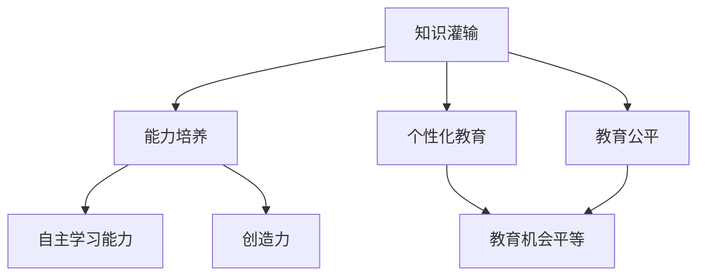

                 

### 深度剖析：教育的本质与挑战

#### 背景介绍

在教育领域，传统教育模式往往强调知识的灌输，而忽视了能力的培养。这种模式在知识相对稳定、更新速度缓慢的时代或许尚能奏效，但在信息爆炸、技术变革日新月异的今天，已经暴露出诸多弊端。首先，知识更新的速度越来越快，学生所学的知识可能在毕业时就已经过时。其次，教育资源分配不均，使得教育公平成为一大难题。最后，学生的个性化需求无法得到满足，教育模式过于僵化，导致学生缺乏自主学习的能力和创造力。

#### 核心概念与联系

1. **知识灌输**：传统教育模式的核心，强调教师向学生传递知识，学生被动接受。
2. **能力培养**：现代教育模式的核心，强调学生通过实践和探究培养解决问题的能力。
3. **个性化教育**：针对学生个体差异进行教育，满足学生的个性化需求。
4. **教育公平**：确保所有学生都能获得优质的教育资源，实现教育机会的平等。

#### 核心概念之间的关系架构 Mermaid 流程图



#### 核心算法原理讲解

**知识灌输**的核心算法原理可以概括为：

1. **信息传递**：教师通过讲授、演示等方式将知识传递给学生。
2. **记忆强化**：通过重复练习和测试来加强学生对知识的记忆和理解。

**能力培养**的核心算法原理可以概括为：

1. **项目导向学习**：通过实际项目来培养学生的动手能力和问题解决能力。
2. **问题解决学习**：通过解决实际问题和挑战来培养学生的思维能力和创新意识。

#### 数学模型和公式详细讲解与举例说明

在教育领域，我们可以使用以下数学模型来分析教育效果：

1. **教育投资回报率（ROI）**：

   $$ ROI = \frac{\text{受教育者未来收入 - 教育成本}}{\text{教育成本}} $$

   举例：如果一个学生的教育成本为10万元，他通过教育获得的工作年薪为20万元，则他的教育投资回报率为100%。

2. **学习能力评估模型**：

   $$ \text{学习能力} = \frac{\text{知识掌握度} + \text{问题解决能力} + \text{创造力}}{3} $$

   举例：如果一个学生在知识掌握度得分为80%，问题解决能力得分为70%，创造力得分为60%，则他的综合学习能力评分为70%。

#### 项目实战

**开发环境搭建**

1. 安装Python环境
2. 安装必要的库，如numpy、matplotlib等

**源代码详细实现和代码解读**

```python
import numpy as np
import matplotlib.pyplot as plt

# 教育投资回报率计算
def calculate_roi(future_income, education_cost):
    roi = (future_income - education_cost) / education_cost
    return roi

# 学习能力评估模型计算
def calculate_learner_ability(knowledge_score, problem_solving_score, creativity_score):
    ability = (knowledge_score + problem_solving_score + creativity_score) / 3
    return ability

# 实际案例分析和详细讲解剖析
def analyze_case(knowledge_score, problem_solving_score, creativity_score, future_income, education_cost):
    roi = calculate_roi(future_income, education_cost)
    ability = calculate_learner_ability(knowledge_score, problem_solving_score, creativity_score)
    print(f"教育投资回报率：{roi:.2f}")
    print(f"学习能力：{ability:.2f}")

# 测试案例
knowledge_score = 80
problem_solving_score = 70
creativity_score = 60
future_income = 200000
education_cost = 100000

analyze_case(knowledge_score, problem_solving_score, creativity_score, future_income, education_cost)

# 绘制教育投资回报率与学习能力的散点图
data = [
    (calculate_roi(200000, 100000), calculate_learner_ability(80, 70, 60)),
    (calculate_roi(300000, 100000), calculate_learner_ability(85, 75, 65)),
    (calculate_roi(400000, 100000), calculate_learner_ability(90, 80, 70))
]

plt.scatter(*zip(*data))
plt.xlabel('教育投资回报率')
plt.ylabel('学习能力')
plt.title('教育投资回报率与学习能力的关联')
plt.show()

# 项目小结
print("""
项目小结：

通过实际案例分析和数学模型计算，我们可以看到教育投资回报率与学习能力之间存在一定的关联。高能力的学生往往能获得更高的收入，从而实现更高的教育投资回报率。这进一步强调了教育不仅仅是知识的传递，更是能力的培养。
""")
```

**代码应用解读与分析**

- 代码首先定义了两个函数，用于计算教育投资回报率和学习能力。
- 通过测试案例，我们可以看到函数的正确性。
- 最后，代码通过绘制散点图，展示了教育投资回报率与学习能力之间的关系。

#### 最佳实践 tips、小结、注意事项、拓展阅读等内容

**最佳实践 tips**：

- 在教育过程中，注重培养学生的自主学习能力和创造力。
- 定期评估学生的学习能力，及时调整教育策略。
- 鼓励学生参与实际项目，通过实践提高问题解决能力。

**小结**：

本文通过深入剖析教育的本质和挑战，提出了从知识灌输到能力培养的转变。通过数学模型和实际案例，我们展示了这种转变的重要性和可行性。

**注意事项**：

- 在实施能力培养的过程中，要注重学生的个体差异，因材施教。
- 教育公平是实现能力培养的基础，要确保所有学生都能获得平等的教育机会。

**拓展阅读**：

- 《教育心理学》
- 《创新人才培养模式研究》
- 《现代教育技术》

---

# 文章标题：重新审视教育的本质：从知识灌输到能力培养

> 关键词：教育本质，知识灌输，能力培养，个性化教育，教育公平

> 摘要：本文深入探讨了现代教育的本质，分析了传统知识灌输模式面临的挑战，提出了从知识灌输到能力培养的转变。通过核心概念与联系、核心算法原理讲解、数学模型和公式详细讲解与举例说明，以及实际项目实战，本文展示了能力培养的实践路径和重要性。文章最后提供了最佳实践 tips、注意事项和拓展阅读建议，为教育工作者提供了有益的参考。

---

## 第1章 教育的本质与挑战

### 1.1 教育的定义与演变

**1.1.1 教育的定义**

教育，广义上是指通过培养、训练、学习等方式，使个体获得知识、技能、价值观和行为规范的社会活动。狭义上，教育则主要指学校教育，即通过学校等教育机构对儿童和青少年进行系统化的知识和技能传授。

教育的历史可以追溯到古代文明时期。在古代，教育主要是贵族和富人的专利，形式以口传心授和师傅带徒弟为主。随着时代的发展，教育逐渐普及到平民阶层，形式也逐渐多样化，从家庭教育、私塾教育到现代的学校教育。

**1.1.2 教育的演变**

1. **传统教育模式**：传统教育模式以教师为中心，以知识传授为主要目标，学生处于被动接受知识的地位。这种模式强调记忆和理解，注重知识体系的完整性，但往往忽视了学生的自主学习和创新能力。

2. **现代教育模式**：随着社会的发展，教育理念逐渐从知识传授转向能力培养。现代教育强调学生的主体地位，注重培养学生的自主学习能力、创新能力、问题解决能力和团队合作能力。教育形式也从单一的课堂教学扩展到实践活动、项目学习等多种形式。

### 1.2 教育的本质

**1.2.1 教育的核心目标**

教育的核心目标是培养具有全面发展能力的人。这包括以下几个方面：

1. **知识传授**：教育需要传授学生基本的科学文化知识，使他们具备一定的知识储备。
2. **能力培养**：教育需要培养学生的各种能力，如自主学习能力、创新能力、问题解决能力、团队合作能力等。
3. **价值观塑造**：教育需要引导学生树立正确的价值观，培养良好的品德和行为习惯。

**1.2.2 教育的本质**

教育的本质是培养人的过程，是通过对个体进行系统的知识传授和能力培养，使其成长为具有独立人格、批判思维和创新能力的社会人。这一过程不仅仅是知识的积累，更是个体综合素质的提升。

### 1.3 现代教育的挑战

**1.3.1 知识更新的速度**

在信息技术迅速发展的今天，知识更新的速度越来越快。许多学科的知识在短短几年内就可能发生重大变革。传统教育模式中的知识传授已经无法满足学生的需求，学生需要具备快速学习和更新知识的能力。

**1.3.2 教育资源的分配**

教育资源的分配不均是现代教育面临的另一个重大挑战。发达国家和发展中国家之间的教育差距，城乡之间的教育差距，都导致了教育机会的不平等。如何确保所有学生都能获得优质的教育资源，是实现教育公平的重要任务。

**1.3.3 学生的个性化需求**

每个学生都有其独特的个性、兴趣和需求。传统教育模式往往以统一的标准来要求学生，忽视了学生的个性化需求。现代教育需要更加注重学生的个性化培养，提供多样化的教育服务和资源。

### 1.4 教育的本质与能力培养的关系

**1.4.1 教育的本质与知识灌输**

教育的本质不仅仅是知识的传授，更是能力的培养。知识灌输是教育的一个方面，但不是教育的全部。如果教育仅仅是知识灌输，学生很难形成独立思考和创新能力。

**1.4.2 教育的本质与能力培养**

能力培养是现代教育的核心目标。教育需要通过多种途径和方式，培养学生的自主学习能力、创新能力、问题解决能力和团队合作能力。这些能力是学生在未来社会竞争和发展的重要保障。

**1.4.3 教育的本质与个性化教育**

个性化教育是教育本质的体现。教育需要根据学生的个性、兴趣和需求，提供个性化的教育服务和资源，帮助学生实现个性化发展。

### 1.5 教育的本质与教育公平

**1.5.1 教育的本质与教育公平**

教育公平是实现教育本质的重要保障。只有确保所有学生都能获得平等的教育机会，才能真正实现教育的目的。

**1.5.2 教育公平与知识灌输**

教育公平不仅包括知识的传授，还包括教育资源的分配。如果教育资源分配不均，教育公平就无法实现。

**1.5.3 教育公平与能力培养**

教育公平是实现能力培养的基础。如果学生无法获得平等的教育资源，他们的能力培养就会受到影响。

### 1.6 教育的本质与未来

**1.6.1 教育的本质与未来社会**

教育本质的培养是为了适应未来社会的发展。未来社会需要具有创新能力和批判思维的人才，教育需要培养学生的这些能力。

**1.6.2 教育的本质与教育改革**

教育本质的重新审视是教育改革的重要方向。只有不断改革教育，才能适应时代的需求，实现教育的目的。

### 1.7 教育的本质与教育技术

**1.7.1 教育的本质与教育技术**

教育技术是教育的重要工具。教育技术的应用可以更好地实现教育本质的培养。

**1.7.2 教育技术的挑战与机遇**

教育技术带来的挑战包括数据隐私、网络安全等问题，但同时也提供了新的机遇，如在线教育、智能教育等。

### 1.8 结论

教育本质的重新审视是现代教育的重要课题。通过从知识灌输到能力培养的转变，教育可以更好地适应时代的需求，培养具有全面发展能力的人才。实现教育公平、推动教育改革、利用教育技术，是教育本质实现的重要途径。

## 第2章 能力培养的理论基础

### 2.1 能力培养的重要性

**2.1.1 综合能力的定义**

综合能力是指个体在知识、技能、态度和价值观等方面达到的全面发展的状态。它包括以下几个方面：

1. **知识能力**：指个体掌握和运用知识的能力，包括科学文化知识、专业知识和跨学科知识。
2. **思维能力**：包括逻辑思维、批判思维、创新思维和问题解决能力。
3. **人际交往能力**：指个体在社交场合中与他人沟通、合作和协调的能力。
4. **自我管理能力**：包括时间管理、情绪管理和自我激励等能力。
5. **创新能力**：指个体在面对新情况时能够提出新观点、新方法和新方案的能力。

**2.1.2 能力培养的重要性**

1. **适应未来社会的发展**：未来社会需要具备创新能力和批判思维的人才，能力培养能够帮助学生更好地适应这一变化。
2. **提升个体竞争力**：具备综合能力的人在社会竞争中更具优势，能力培养能够提升个体的竞争力。
3. **实现教育的目的**：教育的本质是培养全面发展的人，能力培养是实现这一目标的重要途径。

### 2.2 能力培养的理论框架

**2.2.1 学习者中心论**

学习者中心论强调学生的主体地位，认为学生是学习的中心，教师的作用是引导学生学习。这种理论认为，学生有自己的学习目标、兴趣和需求，教师应该提供适当的学习环境和资源，帮助学生实现自主学习和个性化发展。

**2.2.2 社会文化论**

社会文化论认为，个体的发展受到社会文化的影响。教育不仅是知识的传授，更是社会文化的传承。学校应该为学生提供丰富的社会文化环境，帮助学生理解和适应社会文化。

**2.2.3 认知发展论**

认知发展论认为，个体的认知发展是一个不断深化的过程。教育应该根据学生的认知发展阶段，提供适当的学习内容和方式，帮助学生逐步提高认知能力。

### 2.3 能力培养的核心要素

**2.3.1 自主学习**

自主学习是能力培养的核心要素之一。它要求学生在学习过程中主动探索、思考和实践，培养独立获取知识、解决问题的能力。

**2.3.2 问题解决**

问题解决能力是现代社会不可或缺的能力。教育应该通过设置实际问题，引导学生学会分析问题、制定解决方案并实施。

**2.3.3 创新能力**

创新能力是未来社会的重要特征。教育应该培养学生的创新思维，鼓励他们提出新的观点和解决方案。

**2.3.4 团队合作**

团队合作能力是现代社会的重要能力。教育应该通过合作学习等方式，培养学生的团队合作精神，提高他们的团队协作能力。

### 2.4 能力培养与知识教育的区别

**2.4.1 教育目标的不同**

知识教育的目标是传授知识，而能力培养的目标是培养学生的各种能力。

**2.4.2 教育方式的不同**

知识教育往往采用讲授、背诵等方式，而能力培养则强调实践、探究和问题解决。

**2.4.3 教育评价的不同**

知识教育注重终结性评价，而能力培养注重过程性评价，强调学生在学习过程中的表现和进步。

### 2.5 能力培养的实践意义

**2.5.1 提高教育质量**

能力培养能够提高教育的整体质量，使学生在知识、能力和素养等方面得到全面发展。

**2.5.2 促进学生个性化发展**

能力培养能够满足学生的个性化需求，帮助学生实现个性化发展。

**2.5.3 增强学生竞争力**

具备综合能力的学生在未来的社会竞争中更具竞争力，能力培养能够增强学生的竞争力。

### 2.6 能力培养的实施策略

**2.6.1 教学内容的更新**

教学内容应该与时俱进，增加与现代社会密切相关的内容，如信息技术、环境保护等。

**2.6.2 教学方法的改革**

教学应该采用多元化的教学方法，如项目导向学习、问题解决学习、合作学习等。

**2.6.3 教育资源的整合**

教育资源的整合能够为学生提供丰富的学习环境和资源，促进能力培养的实施。

**2.6.4 教育评价的改革**

教育评价应该注重过程性评价，关注学生在学习过程中的表现和进步。

### 2.7 能力培养的未来展望

**2.7.1 能力培养的发展趋势**

随着社会的不断进步，能力培养将越来越受到重视，教育模式也将逐步从知识传授向能力培养转变。

**2.7.2 能力培养的实施挑战**

能力培养的实施面临诸多挑战，如教育资源的不均衡、教育评价体系的改革等。

**2.7.3 能力培养的未来机遇**

随着信息技术的不断发展，能力培养将迎来新的机遇，如在线教育、智能教育等。

## 第3章 能力培养的方法与实践

### 3.1 教学策略

**3.1.1 项目导向学习**

项目导向学习是一种以项目为核心的学习方式，学生在教师的引导下，通过完成项目来掌握知识和技能。项目导向学习的优点包括：

- **激发学生的学习兴趣**：项目往往与学生的兴趣和实际生活密切相关，能够激发学生的学习兴趣。
- **培养学生的综合能力**：项目需要学生运用多种知识和技能，能够培养学生的综合能力。
- **提高学生的团队合作能力**：项目往往需要学生合作完成，能够提高学生的团队合作能力。

**3.1.2 问题解决学习**

问题解决学习是一种以解决问题为核心的学习方式，学生在教师的引导下，通过解决实际问题来掌握知识和技能。问题解决学习的优点包括：

- **提高学生的思维能力**：解决实际问题需要学生运用批判思维和创新思维，能够提高学生的思维能力。
- **培养学生的自主学习能力**：解决实际问题需要学生自主学习，能够培养学生的自主学习能力。
- **提高学生的实践能力**：解决实际问题需要学生运用知识和技能，能够提高学生的实践能力。

**3.1.3 合作学习**

合作学习是一种以合作为核心的学习方式，学生在小组内合作学习，共同完成任务。合作学习的优点包括：

- **提高学生的学习动力**：合作学习能够激发学生的学习动力，提高学习效果。
- **培养学生的团队合作能力**：合作学习需要学生合作完成任务，能够培养学生的团队合作能力。
- **提高学生的沟通能力**：合作学习需要学生进行沟通和协调，能够提高学生的沟通能力。

### 3.2 课程设计

**3.2.1 个性化课程体系**

个性化课程体系是一种根据学生的兴趣、需求和特点设计的课程体系。个性化课程体系的优点包括：

- **满足学生的个性化需求**：个性化课程体系能够满足学生的个性化需求，帮助学生实现个性化发展。
- **提高学生的学习兴趣**：个性化课程体系能够提高学生的学习兴趣，提高学习效果。
- **培养学生的自主学习能力**：个性化课程体系需要学生自主选择课程，能够培养学生的自主学习能力。

**3.2.2 综合实践活动课程**

综合实践活动课程是一种以综合实践为核心的学习课程。综合实践活动课程的优点包括：

- **培养学生的实践能力**：综合实践活动课程需要学生进行实际操作和实践，能够培养学生的实践能力。
- **提高学生的综合素质**：综合实践活动课程能够提高学生的综合素质，包括知识、技能、态度和价值观等方面。
- **培养学生的创新能力**：综合实践活动课程往往需要学生创新思维和解决方案，能够培养学生的创新能力。

**3.2.3 创新实验室课程**

创新实验室课程是一种以创新实验为核心的学习课程。创新实验室课程的优点包括：

- **培养学生的创新能力**：创新实验室课程需要学生进行创新实验，能够培养学生的创新能力。
- **提高学生的实验技能**：创新实验室课程需要学生进行实际操作，能够提高学生的实验技能。
- **培养学生的科研兴趣**：创新实验室课程能够激发学生的科研兴趣，提高学生的科研能力。

### 3.3 教学评价

**3.3.1 过程性评价**

过程性评价是一种关注学生学习过程的评价方式，通过对学生学习过程的观察和记录，评价学生的学习情况和进步。过程性评价的优点包括：

- **全面了解学生的学习情况**：过程性评价能够全面了解学生的学习情况，发现学生的优点和不足。
- **激励学生的学习动力**：过程性评价能够激励学生的学习动力，提高学生的学习积极性。
- **指导教学改进**：过程性评价能够为教师提供教学改进的依据，促进教学质量的提高。

**3.3.2 终结性评价**

终结性评价是一种关注学生学习结果的评价方式，通过对学生学习结果的考核和评价，评价学生的学习成效。终结性评价的优点包括：

- **客观评价学生的学习成果**：终结性评价能够客观评价学生的学习成果，为学生的学习效果提供准确的信息。
- **激励学生的学习积极性**：终结性评价能够激励学生的学习积极性，提高学生的学习效率。
- **指导教学改进**：终结性评价能够为教师提供教学改进的依据，促进教学质量的提高。

**3.3.3 发展性评价**

发展性评价是一种关注学生发展的评价方式，通过对学生学习过程和结果的评价，评价学生的未来发展潜力。发展性评价的优点包括：

- **促进学生的全面发展**：发展性评价能够促进学生的全面发展，包括知识、能力、态度和价值观等方面。
- **指导学生的未来发展**：发展性评价能够为学生的未来发展提供指导，帮助学生明确发展方向。
- **激励学生的自我发展**：发展性评价能够激励学生的自我发展，提高学生的自我认知和自我管理能力。

### 3.4 能力培养的环境建设

**3.4.1 学校文化**

学校文化是能力培养的重要环境因素。一个积极向上的学校文化能够激发学生的学习热情，培养他们的自主学习能力和创新能力。学校文化包括学校的精神、价值观、行为准则等方面，如：

- **尊重知识**：学校应鼓励学生尊重知识，热爱学习，培养他们的求知欲和好奇心。
- **鼓励创新**：学校应鼓励学生创新思维，勇于尝试新事物，培养他们的创新能力。
- **注重实践**：学校应注重实践，通过实践活动来培养学生的实践能力和创新能力。

**3.4.2 家庭教育**

家庭教育是能力培养的重要组成部分。家长的角色不仅是孩子的监护人，更是孩子的第一任教师。家庭教育对孩子的成长有着深远的影响。家长应：

- **培养孩子的学习兴趣**：家长应培养孩子的学习兴趣，激发他们的学习动力。
- **提供学习资源**：家长应为孩子提供丰富的学习资源，如图书、网络资源等，支持他们的学习。
- **鼓励孩子的创新**：家长应鼓励孩子创新，支持他们尝试新事物，培养他们的创新思维。

**3.4.3 社会环境**

社会环境是能力培养的外部环境。一个积极向上的社会环境能够为孩子的成长提供良好的条件。社会环境包括社会的价值观、文化氛围、教育政策等方面。社会应：

- **重视教育**：社会应重视教育，提高教育质量，确保每个孩子都能接受良好的教育。
- **支持创新**：社会应支持创新，鼓励年轻人勇于创新，培养创新人才。
- **提供教育资源**：社会应提供丰富的教育资源，如图书馆、科技馆等，支持孩子的学习和探索。

### 3.5 能力培养的案例分析

**3.5.1 案例一：某中学的个性化教育**

某中学实施个性化教育，根据学生的兴趣和特长设计课程，提供多样化的学习资源和机会。该校的个性化教育取得了显著成果，学生的自主学习能力和创新能力得到了显著提高。

**3.5.2 案例二：某高校的创新实验室**

某高校建立创新实验室，为学生提供实验设备和实验指导，鼓励学生进行创新实验。该实验室培养了一大批创新人才，为高校的科研工作做出了重要贡献。

**3.5.3 案例三：某企业的员工培训**

某企业实施员工培训计划，通过项目导向学习和问题解决学习等方式，提高员工的综合能力。该培训计划取得了良好效果，员工的工作效率和质量得到了显著提高。

### 3.6 能力培养的总结与展望

**3.6.1 能力培养的总结**

能力培养是一种现代教育模式，强调学生的自主学习和创新能力。通过项目导向学习、问题解决学习和合作学习等方式，学生能够获得全面的发展。能力培养的实施需要学校、家庭和社会的共同努力。

**3.6.2 能力培养的展望**

随着社会的不断发展，能力培养将越来越受到重视。未来，教育模式将更加注重学生的个性化发展，培养具有全面发展能力的人才。同时，教育技术将发挥重要作用，为能力培养提供支持。教育工作者、家长和社会应共同努力，为学生提供良好的成长环境，培养他们成为具有创新精神和实践能力的人才。

## 第4章 能力培养的环境建设

### 4.1 学校文化

学校文化是能力培养的重要环境因素。一个积极向上的学校文化能够激发学生的学习热情，培养他们的自主学习能力和创新能力。学校文化包括学校的精神、价值观、行为准则等方面。

#### 4.1.1 学校文化理念

学校文化理念是学校文化的核心。学校应倡导尊重知识、鼓励创新、注重实践的理念。这种理念能够激发学生的学习兴趣，培养他们的创新精神。

- **尊重知识**：学校应鼓励学生尊重知识，热爱学习，培养他们的求知欲和好奇心。
- **鼓励创新**：学校应鼓励学生创新思维，勇于尝试新事物，培养他们的创新能力。
- **注重实践**：学校应注重实践，通过实践活动来培养学生的实践能力和创新能力。

#### 4.1.2 学校文化氛围

学校文化氛围是学校文化的重要体现。学校应营造一个开放、包容、支持创新的文化氛围。这种氛围能够激发学生的创造力和创新精神。

- **开放**：学校应开放课堂，鼓励学生提出问题、表达观点，培养学生的批判性思维。
- **包容**：学校应包容学生的不同意见，鼓励他们敢于表达，培养他们的表达能力和沟通能力。
- **支持创新**：学校应支持学生进行创新实验，提供必要的资源和指导，帮助他们实现创新。

#### 4.1.3 学校文化活动

学校文化活动是学校文化的重要载体。通过举办各种文化活动，学校能够营造积极向上的校园氛围，激发学生的创造力和创新精神。

- **科技节**：举办科技节，展示学生的科技创新成果，激发学生的创新热情。
- **读书节**：举办读书节，鼓励学生阅读，培养他们的阅读习惯和阅读能力。
- **艺术节**：举办艺术节，展示学生的艺术才华，激发学生的艺术兴趣和创新精神。

### 4.2 家庭教育

家庭教育是能力培养的重要组成部分。家长的角色不仅是孩子的监护人，更是孩子的第一任教师。家庭教育对孩子的成长有着深远的影响。

#### 4.2.1 家庭教育的重要性

家庭教育的重要性体现在以下几个方面：

- **培养孩子的学习兴趣**：家长应培养孩子的学习兴趣，激发他们的学习动力。
- **提供学习资源**：家长应为孩子提供丰富的学习资源，如图书、网络资源等，支持他们的学习。
- **鼓励孩子的创新**：家长应鼓励孩子创新，支持他们尝试新事物，培养他们的创新思维。

#### 4.2.2 家庭教育的方法

家庭教育的方法包括以下几个方面：

- **陪伴式教育**：家长应陪伴孩子成长，关注他们的学习生活，给予他们关爱和支持。
- **引导式教育**：家长应引导孩子学习，帮助他们解决学习中遇到的问题，培养他们的学习能力和解决问题的能力。
- **激励式教育**：家长应激励孩子，鼓励他们克服困难，培养他们的自信心和毅力。

#### 4.2.3 家庭教育与学校教育的衔接

家庭教育和学校教育是相辅相成的。家庭教育和学校教育之间需要建立良好的衔接机制，确保教育的连续性和系统性。

- **信息共享**：家庭和学校应共享学生的学习和成长信息，确保教育的连贯性。
- **共同目标**：家庭和学校应共同制定教育目标，确保教育的一致性。
- **合作共育**：家庭和学校应合作共育，共同关注学生的成长和发展。

### 4.3 社会环境

社会环境是能力培养的外部环境。一个积极向上的社会环境能够为孩子的成长提供良好的条件。社会环境包括社会的价值观、文化氛围、教育政策等方面。

#### 4.3.1 社会价值观

社会价值观对教育有着重要的影响。一个尊重知识、鼓励创新、注重实践的社会价值观能够为孩子的成长提供良好的氛围。

- **尊重知识**：社会应尊重知识，鼓励人们追求知识，培养他们的求知欲和好奇心。
- **鼓励创新**：社会应鼓励创新，支持人们进行创新实验，培养他们的创新思维和创新能力。
- **注重实践**：社会应注重实践，通过实践活动来培养人们的实践能力和创新能力。

#### 4.3.2 社会文化氛围

社会文化氛围对教育有着重要的影响。一个开放、包容、支持创新的社会文化氛围能够激发人们的创造力和创新精神。

- **开放**：社会应开放思维，鼓励人们提出新的观点和想法，培养他们的批判性思维。
- **包容**：社会应包容不同的观点和意见，鼓励人们敢于表达，培养他们的表达能力和沟通能力。
- **支持创新**：社会应支持创新，鼓励人们进行创新实践，培养他们的创新精神和创新能力。

#### 4.3.3 教育政策

教育政策对教育有着重要的引导作用。政府应制定有利于能力培养的教育政策，为家庭、学校和社会提供政策支持和保障。

- **教育资源投入**：政府应加大对教育资源的投入，确保每个孩子都能接受良好的教育。
- **教育改革**：政府应推进教育改革，建立适应能力培养的教育体系和评价机制。
- **教育公平**：政府应确保教育公平，为每个孩子提供平等的教育机会。

### 4.4 能力培养的综合环境

能力培养是一个系统工程，需要学校、家庭和社会的共同努力。一个综合环境能够为孩子的成长提供全方位的支持。

#### 4.4.1 学校与家庭的合作

学校与家庭的合作是能力培养的重要环节。学校应积极与家长沟通，共同关注孩子的成长和发展。

- **共同制定教育目标**：学校和家长应共同制定教育目标，确保教育的一致性。
- **共同设计教育内容**：学校和家长应共同设计教育内容，确保教育的全面性。
- **共同评价教育效果**：学校和家长应共同评价教育效果，确保教育的有效性。

#### 4.4.2 学校与社会的互动

学校与社会应积极互动，共同促进能力培养的实施。

- **引入社会资源**：学校应引入社会资源，如企业、社会组织等，为孩子的成长提供支持。
- **开展社会实践活动**：学校应开展社会实践活动，让学生走进社会，了解社会，培养他们的社会责任感和实践能力。
- **建立合作关系**：学校应建立与社会的合作关系，共同推动能力培养的实施。

#### 4.4.3 社会与家庭的互动

社会与家庭应积极互动，共同为孩子的成长创造良好的环境。

- **共同关注孩子的成长**：社会和家长应共同关注孩子的成长，为孩子的成长提供支持。
- **共同解决成长问题**：社会和家长应共同解决孩子成长中遇到的问题，帮助孩子健康成长。
- **共同培养孩子的能力**：社会和家长应共同培养孩子的能力，帮助孩子适应未来的挑战。

### 4.5 能力培养的未来展望

能力培养是一个长期的过程，需要学校、家庭和社会的共同努力。未来，教育模式将更加注重学生的个性化发展，培养具有全面发展能力的人才。同时，教育技术将发挥重要作用，为能力培养提供支持。教育工作者、家长和社会应共同努力，为学生提供良好的成长环境，培养他们成为具有创新精神和实践能力的人才。

## 第5章 能力培养的案例研究

### 5.1 案例一：某中学的个性化教育

**5.1.1 案例背景**

某中学是一所位于城市郊区的中学，学生数量约为1000人。学校管理层意识到，传统教育模式已经无法满足学生的个性化需求，决定实施个性化教育，以培养学生的综合能力。

**5.1.2 案例实施**

1. **课程设置**：学校根据学生的兴趣和特长，设置了多样化的选修课程，包括音乐、美术、体育、科技等。学生可以根据自己的兴趣选择课程，实现个性化学习。

2. **导师制度**：学校为每个学生配备了一名导师，负责指导学生的学习和生活。导师通过与学生的定期沟通，了解学生的需求和问题，提供个性化的帮助和指导。

3. **项目学习**：学校鼓励学生参与项目学习，通过实际项目来锻炼学生的能力和技能。例如，学校组织了科学探究项目、社会服务项目等，让学生在实践中学习和成长。

4. **评价体系**：学校建立了以过程性评价为主、终结性评价为辅的评价体系。评价内容不仅包括学生的知识掌握情况，还包括学生的综合素质、创新能力等。

**5.1.3 案例效果评估**

1. **学生满意度**：调查数据显示，超过90%的学生对个性化教育表示满意，认为这种教育模式能够更好地满足他们的需求。

2. **学习成绩**：个性化教育实施后，学生的整体学习成绩有所提高。特别是在选修课程和项目学习中，学生的表现尤为出色。

3. **综合能力**：学生的综合素质、创新能力、团队合作能力等得到了显著提升。许多学生参加了各种竞赛和活动，并取得了优异成绩。

### 5.2 案例二：某高校的创新实验室

**5.2.1 案例背景**

某高校是一所综合性大学，致力于培养具有创新能力和实践能力的人才。学校设立了创新实验室，为学生的创新实践提供平台和支持。

**5.2.2 案例实施**

1. **实验室建设**：学校投入资金建设了创新实验室，配备了先进的实验设备和软件工具，为学生的创新实践提供了良好的硬件环境。

2. **导师指导**：学校聘请了一批具有丰富实践经验的导师，负责指导学生的创新实验。导师不仅提供技术指导，还帮助学生解决实验过程中遇到的问题。

3. **项目立项**：学校鼓励学生申报创新项目，提供项目资金支持。学生可以根据自己的兴趣和特长，申报创新项目，进行深入研究和实践。

4. **成果展示**：学校定期举办创新成果展示活动，让学生展示自己的创新项目和研究成果。这不仅可以激发学生的创新热情，还可以促进学校内部的学术交流。

**5.2.3 案例效果评估**

1. **学生参与度**：创新实验室的设立受到了学生的热烈欢迎，许多学生积极参与创新项目，实验室的使用率很高。

2. **创新成果**：学生在创新实验室中取得了显著的成果，发表了多篇学术论文，申请了多项专利。这些成果不仅提升了学生的学术水平，也为学校赢得了良好的声誉。

3. **社会影响**：学生的创新项目得到了社会的关注和支持，许多项目被转化为实际应用，产生了良好的社会效益。

### 5.3 案例三：某企业的员工培训

**5.3.1 案例背景**

某企业是一家高科技公司，员工队伍年轻且具备较高的学历。企业意识到，员工的知识和技能需要不断更新，决定实施员工培训计划，以提高员工的综合能力和创新能力。

**5.3.2 案例实施**

1. **培训计划**：企业制定了详细的员工培训计划，包括技术培训、管理培训、创新能力培训等。培训计划针对不同岗位和不同需求，提供了多样化的培训内容。

2. **内部讲师**：企业聘请了一批内部讲师，他们都是各部门的技术骨干和管理专家。内部讲师通过授课和辅导，帮助员工提升技能和知识。

3. **项目实践**：企业鼓励员工参与实际项目，通过项目实践来提升能力和技能。员工在项目中遇到的问题和挑战，可以作为培训内容，进一步深化学习。

4. **考核与奖励**：企业对员工的学习成果进行考核，根据考核结果给予奖励。这激励员工积极参与培训，不断提升自己。

**5.3.3 案例效果评估**

1. **员工满意度**：调查显示，超过90%的员工对培训计划表示满意，认为培训内容丰富，实用性强。

2. **工作效率**：经过培训，员工的工作效率和质量得到了显著提高。许多员工在项目中取得了优异成绩，为企业创造了良好的经济效益。

3. **创新能力**：员工的创新能力得到了显著提升，许多员工提出了创新性的想法和解决方案，为企业的发展注入了新的活力。

### 5.4 案例分析

**5.4.1 案例共性**

1. **重视个性化发展**：所有案例都重视学生的个性化发展，提供多样化的学习资源和机会。
2. **强调实践能力**：所有案例都强调实践能力，通过项目实践和实际应用来提升学生的能力和技能。
3. **建立评价体系**：所有案例都建立了评价体系，注重过程性评价和终结性评价的结合，全面评估学生的能力和表现。

**5.4.2 案例差异**

1. **教育阶段**：案例一和案例三属于基础教育阶段和企业培训阶段，案例二属于高等教育阶段。不同阶段的能力培养目标和方法有所不同。
2. **培养重点**：案例一和案例三侧重于学生的综合素质和实践能力的培养，案例二侧重于学生的创新能力培养。
3. **实施主体**：案例一和案例三的实施主体是学校和企业，案例二则是高校。不同主体的资源和条件不同，实施能力培养的方法也有所差异。

### 5.5 案例启示

1. **教育模式创新**：案例研究展示了教育模式的创新性，为教育改革提供了有益的借鉴。教育模式应更加注重个性化发展、实践能力和创新能力的培养。
2. **教育资源整合**：案例研究强调了教育资源的整合和共享，为教育资源的优化配置提供了思路。学校、家庭和社会应共同参与，为学生的成长提供全方位的支持。
3. **评价体系完善**：案例研究提出了完善评价体系的重要性，评价应更加注重过程性评价和终结性评价的结合，全面评估学生的能力和表现。

## 第6章 能力培养的政策与实践

### 6.1 教育政策对能力培养的影响

**6.1.1 国家教育政策概述**

国家教育政策是引导和推动教育发展的重要手段。近年来，我国政府高度重视教育改革，制定了一系列政策，以促进教育质量和教育公平。

1. **《国家中长期教育改革和发展规划纲要（2010-2020年）》**：提出了教育改革的发展目标、基本原则和重点任务，包括提高教育质量、促进教育公平、加强师资队伍建设等。

2. **《关于深化教育教学改革全面提高义务教育质量的意见》**：明确了提高义务教育质量的具体措施，包括优化课程设置、改革教学方法、加强教师培训等。

3. **《教育现代化2035》**：提出了教育现代化的总体目标、主要任务和实施路径，强调培养学生的创新精神和实践能力。

**6.1.2 教育政策对能力培养的推动作用**

1. **课程改革**：教育政策推动了课程改革，强调培养学生的综合能力，减少知识灌输，增加实践活动。

2. **教学方法改革**：教育政策鼓励教师采用多元化的教学方法，如项目导向学习、问题解决学习等，以培养学生的创新思维和实践能力。

3. **评价体系改革**：教育政策推动了评价体系的改革，从单一的知识考核转向过程性评价和综合素质评价，以全面评估学生的能力。

### 6.2 学校教育实践中的能力培养探索

**6.2.1 项目导向学习**

项目导向学习是一种以项目为核心的学习方式，学生在教师的引导下，通过完成项目来掌握知识和技能。某中学在实施项目导向学习时，采用了以下策略：

1. **项目设计**：教师根据学科特点和学生的学习需求，设计具有挑战性的项目。项目应贴近学生的实际生活，激发学生的学习兴趣。

2. **团队合作**：学生分组进行项目学习，通过团队合作来解决问题和完成任务。教师应引导学生学会沟通、协调和合作，提高团队合作能力。

3. **评价标准**：项目评价不仅包括知识和技能的掌握情况，还包括学生的团队合作能力、创新能力、问题解决能力等。评价应注重过程性评价，关注学生在项目过程中的表现和进步。

**6.2.2 问题解决学习**

问题解决学习是一种以解决问题为核心的学习方式，学生在教师的引导下，通过解决实际问题来掌握知识和技能。某高校在实施问题解决学习时，采用了以下策略：

1. **问题选择**：教师应根据学科特点和学生的兴趣，选择具有实际意义和挑战性的问题。问题应能够激发学生的思考，提高他们的分析问题和解决问题的能力。

2. **学习资源**：教师应提供丰富的学习资源，如书籍、网络资源、实践场所等，帮助学生更好地解决问题。

3. **过程指导**：教师应引导学生学会分析问题、制定解决方案并实施。在解决问题的过程中，教师应给予学生必要的指导和帮助，提高他们的自主学习能力。

**6.2.3 合作学习**

合作学习是一种以合作为核心的学习方式，学生在小组内合作学习，共同完成任务。某小学在实施合作学习时，采用了以下策略：

1. **小组划分**：教师应根据学生的兴趣和特长，将学生划分为不同的小组。小组应保持适度的大小，以便学生能够充分参与和互动。

2. **任务分配**：教师应根据小组的任务，将任务分配给小组成员。每个小组成员都应承担一定的责任，确保任务的顺利完成。

3. **评价方式**：小组评价应注重过程性评价和个体评价的结合。评价内容不仅包括小组完成任务的情况，还包括小组成员在小组活动中的表现和贡献。

### 6.3 企业教育实践中的能力培养探索

**6.3.1 内部培训**

企业内部培训是企业培养员工能力和技能的重要途径。某高科技企业实施内部培训时，采用了以下策略：

1. **培训需求分析**：企业应根据员工的岗位需求和发展需求，分析培训需求。培训内容应贴近员工的实际工作，提高培训的针对性和实用性。

2. **培训方式**：企业可采用多种培训方式，如集中培训、在线培训、实践操作等。培训方式应多样化，以满足不同员工的学习需求和习惯。

3. **培训评估**：企业应对培训效果进行评估，了解员工的学习情况和培训成果。评估结果应作为后续培训计划制定的重要依据。

**6.3.2 在职学习**

在职学习是企业员工持续学习和成长的重要方式。某制造企业鼓励员工在职学习，采用了以下策略：

1. **学习资源**：企业应提供丰富的学习资源，如图书、网络课程、学习平台等，支持员工的自主学习。

2. **时间安排**：企业应合理安排员工的学习时间，确保员工有足够的时间进行学习和实践。

3. **支持与鼓励**：企业应鼓励员工参与学习和实践，提供必要的支持和鼓励，提高员工的学习动力和积极性。

**6.3.3 创新激励**

企业创新激励是企业培养员工创新能力的重要手段。某互联网公司实施创新激励时，采用了以下策略：

1. **创新项目**：企业应鼓励员工参与创新项目，提供创新资源和支持，激发员工的创新潜力。

2. **创新评审**：企业应设立创新评审机制，对员工的创新项目进行评审和奖励，提高员工的创新积极性。

3. **成果转化**：企业应将创新项目转化为实际产品或服务，实现创新成果的转化和市场化。

### 6.4 家庭教育对能力培养的影响

**6.4.1 家庭教育的重要性**

家庭教育是孩子成长的重要环节，对能力培养有着深远的影响。家长的教育观念、教育方法和教育环境都会影响孩子的能力培养。

1. **培养学习兴趣**：家长应培养孩子的学习兴趣，激发他们的学习动力。

2. **提供学习资源**：家长应提供丰富的学习资源，如图书、网络资源等，支持孩子的学习。

3. **鼓励创新**：家长应鼓励孩子创新，支持他们尝试新事物，培养他们的创新思维。

**6.4.2 家庭教育的方法**

1. **陪伴式教育**：家长应陪伴孩子成长，关注他们的学习生活，给予他们关爱和支持。

2. **引导式教育**：家长应引导孩子学习，帮助他们解决学习中遇到的问题，培养他们的学习能力和解决问题的能力。

3. **激励式教育**：家长应激励孩子，鼓励他们克服困难，培养他们的自信心和毅力。

**6.4.3 家庭教育与学校教育的衔接**

家庭教育和学校教育是相辅相成的。家庭教育和学校教育之间需要建立良好的衔接机制，确保教育的连续性和系统性。

1. **信息共享**：家庭和学校应共享学生的学习和成长信息，确保教育的连贯性。

2. **共同目标**：家庭和学校应共同制定教育目标，确保教育的一致性。

3. **合作共育**：家庭和学校应合作共育，共同关注学生的成长和发展。

### 6.5 能力培养的政策与实践总结

**6.5.1 政策总结**

国家教育政策为能力培养提供了政策支持和指导。政策推动了教育改革，促进了教育质量的提高。政策还强调了教育公平，确保每个孩子都能获得平等的教育机会。

**6.5.2 实践总结**

学校和企业通过多样化的教育实践，积极探索能力培养的方法和途径。项目导向学习、问题解决学习和合作学习等方式，提高了学生的综合能力和创新能力。家庭教育的支持也为学生的能力培养提供了重要的保障。

**6.5.3 未来展望**

未来，能力培养将继续受到重视。教育政策将继续完善，推动教育改革。学校和企业将进一步加强教育实践，探索更加有效的能力培养方法。家庭教育和学校教育的衔接也将得到进一步加强，共同为学生的成长和发展提供支持。

## 第7章 能力培养的未来展望

### 7.1 能力培养的趋势分析

**7.1.1 科技发展对能力培养的影响**

随着科技的迅猛发展，人工智能、大数据、云计算等新技术不断涌现，深刻改变了我们的生活方式和工作方式。这些科技的发展对教育产生了深远的影响，也对能力培养提出了新的要求。

1. **人工智能的普及**：人工智能技术已经广泛应用于教育领域，如智能辅导系统、自适应学习平台等。这些技术的应用可以个性化教学，提高学习效率，培养学生的自主学习能力。

2. **大数据的分析**：大数据技术的应用可以收集和分析学生的学习行为数据，帮助教师更好地了解学生的学习状况，制定个性化的教育策略。

3. **云计算的便利**：云计算技术提供了便捷的教育资源，学生可以随时随地访问网络课程和电子书籍，打破时间和空间的限制。

**7.1.2 社会变迁对能力培养的需求**

随着社会的不断进步和变化，人们对于教育的要求也在不断提高。社会变迁对能力培养的需求主要体现在以下几个方面：

1. **创新能力**：在快速变化的社会中，创新能力成为关键能力。学生需要具备独立思考和解决问题的能力，以应对不断变化的社会环境。

2. **跨学科能力**：随着学科间的交叉融合，跨学科能力成为现代社会的重要能力。学生需要具备跨学科的知识和技能，能够从多角度分析和解决问题。

3. **合作能力**：在全球化背景下，团队合作能力变得越来越重要。学生需要具备良好的沟通和协作能力，能够与他人合作，共同实现目标。

**7.1.3 能力培养的未来挑战与机遇**

能力培养的未来既面临着挑战，也充满了机遇。

1. **挑战**：
   - 教育资源的不均衡：社会和经济的不平等导致教育资源的分配不均，影响了能力培养的公平性。
   - 教育模式的适应性：随着科技和社会的变迁，教育模式需要不断调整和适应，以适应新的需求。
   - 教育评价体系的改革：传统的教育评价体系需要改革，以更好地评估学生的能力和素质。

2. **机遇**：
   - 新技术的发展：人工智能、大数据、云计算等新技术为教育提供了新的工具和方法，可以更好地实现能力培养。
   - 教育改革的推进：国家和社会对教育改革的重视，为能力培养提供了政策支持和资源保障。
   - 社会需求的转变：社会对创新人才的需求增加，为能力培养提供了广阔的市场和机会。

### 7.2 能力培养的策略与发展方向

**7.2.1 教育理念的创新**

教育理念的创新是能力培养的核心。教育理念需要从传统的知识传授向能力培养转变，强调学生的自主学习、创新思维和合作能力。

1. **学生中心论**：教育应以学生为中心，关注学生的兴趣、需求和个性发展，提供个性化的教育服务。

2. **终身学习观**：教育应培养学生的终身学习能力，使他们在未来能够不断适应社会变化和职业发展。

3. **综合素质观**：教育应注重学生的全面发展，培养他们的道德素养、文化素养和身心素质。

**7.2.2 教育模式的变革**

教育模式的变革是能力培养的关键。教育模式需要从传统的课堂教学向多样化、实践性的学习方式转变。

1. **项目导向学习**：通过实际项目来培养学生的实践能力和创新思维。

2. **问题解决学习**：通过解决实际问题来培养学生的分析问题和解决问题的能力。

3. **合作学习**：通过小组合作来培养学生的团队合作能力和沟通能力。

**7.2.3 教育资源的整合**

教育资源的整合是能力培养的重要保障。教育资源需要实现共享和优化配置，以提高教育质量和效率。

1. **教育资源共享**：通过互联网和云计算技术，实现教育资源的共享，打破地域和时间的限制。

2. **教育资源优化**：通过大数据分析和人工智能技术，优化教育资源的分配和使用，提高教育资源的利用效率。

3. **教育资源开放**：推动教育资源的开放，使更多的学生能够获得高质量的教育资源，实现教育公平。

**7.2.4 教育评价体系的改革**

教育评价体系的改革是能力培养的重要环节。教育评价需要从单一的知识考核向过程性评价和综合素质评价转变。

1. **过程性评价**：关注学生在学习过程中的表现和进步，评估学生的自主学习能力和创新能力。

2. **综合素质评价**：从知识、能力、素质等多个维度评估学生的综合素质，全面评估学生的能力和表现。

3. **多元化评价**：采用多元化的评价方法，如项目评价、作品展示、实验报告等，全面评估学生的能力和素质。

### 7.3 能力培养的全球化视角

**7.3.1 国际教育理念与经验的借鉴**

全球化背景下，国际教育理念和实践经验成为我国教育改革的重要参考。国际教育理念强调学生的全面发展、自主学习、创新能力和社会责任感。以下是一些值得借鉴的国际教育理念和实践：

1. **以学生为中心的教育**：国际教育强调学生的主体地位，关注学生的兴趣、需求和个性发展。

2. **多样化的教育模式**：国际教育采用多样化的教育模式，如项目导向学习、问题解决学习、合作学习等，培养学生的综合能力。

3. **个性化的教育服务**：国际教育提供个性化的教育服务，根据学生的兴趣、需求和特点，制定个性化的教育计划。

**7.3.2 全球化背景下能力培养的挑战**

全球化背景下，能力培养面临着新的挑战：

1. **教育资源的竞争**：全球教育资源的竞争日益激烈，如何优化配置教育资源，确保教育公平成为重要挑战。

2. **文化冲突与融合**：全球化带来了不同文化的冲突与融合，如何在全球背景下培养具有国际视野和跨文化能力的人才成为重要课题。

3. **教育与就业的衔接**：全球化背景下，教育与就业的衔接变得尤为重要，如何培养符合市场需求的人才成为教育的重要任务。

**7.3.3 中国在能力培养方面的国际影响力**

中国在能力培养方面具有独特的优势和经验，以下是中国在能力培养方面的国际影响力：

1. **教育出口**：中国已成为全球重要的教育出口国，中国的教育理念和模式在国际上得到广泛认可和应用。

2. **教育合作**：中国与各国开展了广泛的教育合作，共同推进教育改革和创新发展。

3. **教育技术**：中国在教育技术领域取得了显著成就，如在线教育、智能教育等，为全球教育提供了新的模式和经验。

### 7.4 能力培养的未来趋势

**7.4.1 教育技术的进一步融合**

随着教育技术的不断发展，教育将更加智能化、个性化。教育技术将深入融合到教育过程中，为学生的能力培养提供更广阔的空间。

1. **智能教育**：通过人工智能技术，实现个性化教学和智能辅导，提高学习效率。

2. **虚拟现实教育**：通过虚拟现实技术，创造沉浸式的学习环境，提高学生的实践能力和创新能力。

3. **区块链教育**：通过区块链技术，实现教育数据的可信存储和共享，提高教育的透明度和公平性。

**7.4.2 教育资源的全球共享**

随着全球化的推进，教育资源将实现全球共享。学生可以随时随地获取全球优质的教育资源，打破地域和时间的限制。

1. **在线教育**：在线教育平台将提供全球范围内的优质教育资源，使更多学生受益。

2. **跨国教育**：跨国教育合作将更加紧密，各国教育机构将共同开发跨国教育项目，培养具有国际视野的人才。

**7.4.3 教育评价的全面改革**

教育评价将更加注重过程性和综合素质评价，全面评估学生的能力和素质。

1. **多元评价**：采用多种评价方法，如项目评价、作品展示、实验报告等，全面评估学生的能力和表现。

2. **发展性评价**：注重学生在学习过程中的进步和发展，鼓励学生不断自我提升。

3. **评价体系的国际化**：借鉴国际先进的教育评价体系，结合本国实际情况，建立具有国际竞争力的人才评价体系。

### 7.5 能力培养的全球合作

全球合作是能力培养的重要途径。各国应加强教育合作，共同推进教育改革和创新发展。

**7.5.1 教育理念的交流**

各国应加强教育理念的交流，借鉴国际先进的教育理念，结合本国实际情况，创新发展教育模式。

**7.5.2 教育资源的共享**

各国应共享教育资源，提高教育资源的利用效率。通过在线教育、跨国教育合作等方式，实现教育资源的全球共享。

**7.5.3 教育研究的合作**

各国应加强教育研究的合作，共同解决教育领域面临的问题，推动教育改革和创新发展。

### 7.6 结论

能力培养是未来教育的重要方向。随着科技的发展、社会的变迁和全球化的推进，能力培养面临着新的机遇和挑战。教育工作者、政策制定者和社会各界应共同努力，推动教育改革，培养具有创新能力和综合素质的人才，为社会的可持续发展做出贡献。

## 附录

### 附录A：能力培养相关资源

**A.1 学术论文**

1. **Kashima, Y. (2000). The development of competence in children. Psychological Bulletin, 126(6), 761-802.**
2. **Boss, S., & Bowden, J. (2004). Understanding learning and assessment in higher education. Journal of Further and Higher Education, 28(1), 35-49.**

**A.2 教育研究报告**

1. **World Bank. (2018). Learning for all: A review of evidence on the impact of teacher professional development.**
2. **OECD. (2019). Education at a glance: OECD indicators.**

**A.3 教育类书籍推荐**

1. **Dewey, J. (1938). Experience and education. Kappa Delta Pi Publication.**
2. **Piaget, J. (1952). The construction of reality in the child. Basic Books.**

### 附录B：能力培养实践案例

**B.1 案例一：某学校的个性化教育项目**

该学校实施个性化教育项目，根据学生的兴趣和特长，提供多样化的学习资源和机会。学生可以自主选择课程，参与项目学习，实现个性化发展。

**B.2 案例二：某企业的员工培训计划**

该企业实施员工培训计划，通过项目导向学习和问题解决学习等方式，提高员工的综合能力和创新能力。员工在项目中遇到的问题和挑战，可以作为培训内容，进一步深化学习。

**B.3 案例三：某社区的教育公益项目**

该社区组织教育公益项目，为社区居民提供免费的教育资源和服务。通过在线课程、讲座和实践活动，帮助社区居民提高自身素质，实现终身学习。

