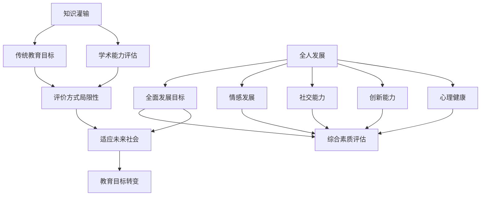

                 

### 背景介绍

在现代社会的快速发展中，教育作为培养未来社会人才的关键环节，承担着极其重要的责任。传统教育体系往往以知识灌输为主要目标，强调学生在学科领域的知识积累和技能掌握。然而，随着全球化和信息化的深入发展，人们逐渐认识到，单纯的知识灌输已经无法满足新时代对人才的需求。现代社会需要的是具备全面发展能力、能够适应快速变化环境的综合性人才。

知识灌输的教育模式虽然能够确保学生在特定领域的知识掌握，但往往忽视了学生的情感、社交和创新能力等方面的培养。学生在这样的教育模式下，可能形成较强的考试能力和应试技巧，但在面对真实世界的复杂问题时，却显得力不从心。这导致了许多教育领域专家和社会人士开始反思和质疑传统教育目标的合理性，并提出了全人发展的教育理念。

全人发展的教育目标，强调的是学生的全面发展，不仅仅是知识的积累，更包括情感、社交能力、创新能力等方面的培养。这一理念的出现，是为了适应现代社会对人才多样性和综合素质的需求，帮助学生更好地应对未来社会的挑战。因此，重新审视教育目标，从知识灌输转向全人发展，已成为当前教育改革的重要方向。

本篇文章将深入探讨从知识灌输到全人发展的转变。首先，我们将分析现代教育目标的现状与挑战，探讨知识灌输模式的局限性，并介绍全人发展的核心概念。接着，我们将详细阐述全人发展的理论基础和实践探索，通过具体的课程设计、教学方法改革和教师角色转变等方面，展示全人发展教育的具体实施路径。随后，我们将探讨全人发展的评估指标和改进策略，以及跨学科合作的重要性。最后，通过具体的项目实战案例，总结全人发展教育的最佳实践，并给出未来教育改革的方向和建议。

通过这篇文章，我们希望读者能够对全人发展的教育理念有更深入的理解，认识到教育目标从知识灌输到全人发展的转变不仅是必要的，也是可行的。让我们共同探讨如何通过教育改革，培养出适应未来社会的综合性人才。

### 核心概念与联系

在探讨教育目标的转变过程中，几个核心概念至关重要，它们分别是知识灌输、全人发展和教育目标。这些概念不仅相互独立，更存在深刻的内在联系，构成了一个完整的逻辑框架。

首先，知识灌输是传统教育模式的核心。它强调在学科领域内传授系统化的知识，使学生掌握必要的理论和实践技能。知识灌输的主要目标是确保学生在考试和学业上取得优异成绩，培养他们的学术能力。然而，知识灌输的模式往往忽视了学生的情感发展、社交能力和创新思维，导致学生在面对现实问题时显得缺乏综合能力。

知识灌输的教育目标，通常是通过标准化考试来衡量学生的学术水平。然而，这种评价方式存在一定的局限性，因为它主要评估的是学生在特定知识领域的掌握程度，而无法全面反映学生的综合素质和潜力。

接下来，我们来看全人发展的概念。全人发展强调学生的全面发展，不仅仅是知识的学习，还包括情感、社交能力、创新能力和心理健康等方面的培养。全人发展的目标，是为了培养学生成为一个全面发展的人，能够适应并贡献于复杂多变的社会环境。

全人发展包括以下几个核心要素：情感发展，关注学生的情感健康，培养积极的人生态度和同理心；社交能力，强调学生与他人合作、沟通和解决问题的能力；创新能力，鼓励学生勇于探索新知，培养批判性思维和创造力；心理健康，关注学生的心理健康状态，帮助他们建立自信和积极的人生观。

教育目标的转变，从知识灌输到全人发展，是教育理念的重大变革。这一转变不仅源于社会对综合素质人才的需求，也是对传统教育模式局限性的深刻反思。全人发展的教育目标，更贴近人类发展的本质，更能够培养出适应未来社会的综合性人才。

这三个核心概念之间的联系，可以通过一个Mermaid流程图来形象地展示：



通过这个流程图，我们可以清晰地看到，知识灌输虽然能够培养学术能力，但由于评价方式的局限性，难以全面评估学生的综合素质。而全人发展则通过培养情感、社交能力、创新能力和心理健康等多个方面，实现学生的全面发展，更好地适应未来社会的需求。

综上所述，教育目标的转变，从知识灌输到全人发展，是一个逐步深化和完善的过程。这一转变不仅是对教育模式的创新，更是对教育本质的深刻理解。通过明确核心概念之间的联系，我们可以更好地把握教育目标的内涵，推动教育改革的深入发展。

### 核心算法原理讲解

在讨论全人发展的教育目标时，我们需要深入探讨其核心算法原理，这包括情感、社交能力、创新能力和心理健康等方面的培养方法。以下将使用伪代码详细阐述这些核心算法的实现。

#### 情感发展培养算法

情感发展的培养是全人发展的基础，以下是一个简单的情感发展培养算法的伪代码：

```pseudo
function EmotionalDevelopment(targetStudent)
    1. 初始化情感发展状态（happy, sad, angry等）
    2. 启动积极情感培养循环
        while targetStudent's emotional state != happy
            2.1 评估当前情感状态
                if targetStudent's emotional state == sad
                    2.1.1 应用积极心理学技术，如正念冥想
                else if targetStudent's emotional state == angry
                    2.1.2 引导情绪管理策略，如深呼吸练习
                else
                    2.1.3 提供情感支持，如师生对话
            2.2 激励学生参与情感相关活动，如艺术创作、体育活动
            2.3 收集情感发展数据，进行反馈和调整
    3. 达到预期情感发展状态，结束循环
    4. 输出情感发展报告
end function
```

#### 社交能力培养算法

社交能力的培养是全人发展的重要组成部分，以下是一个社交能力培养算法的伪代码：

```pseudo
function SocialSkillDevelopment(targetStudent)
    1. 初始化社交技能水平（沟通技巧、团队合作、冲突解决等）
    2. 启动社交技能训练循环
        while targetStudent's social skill level < desired level
            2.1 设计社交活动，如团队项目、角色扮演游戏
            2.2 实施社交技能训练，如沟通技巧训练、团队合作训练
            2.3 提供社交反馈，如同伴评价、导师反馈
            2.4 分析训练效果，调整训练计划
    3. 达到预期社交技能水平，结束循环
    4. 输出社交技能发展报告
end function
```

#### 创新能力培养算法

创新能力的培养是全人发展的关键，以下是一个创新能力培养算法的伪代码：

```pseudo
function InnovationDevelopment(targetStudent)
    1. 初始化创新思维水平（好奇心、问题解决、创造思维等）
    2. 启动创新思维训练循环
        while targetStudent's innovation level < desired level
            2.1 提供创新挑战，如科学实验、创意设计比赛
            2.2 引导创新方法，如头脑风暴、设计思维
            2.3 鼓励探索与实验，如开放性项目研究
            2.4 提供创新反馈，如导师评估、同行评价
            2.5 分析创新成果，调整创新训练计划
    3. 达到预期创新思维水平，结束循环
    4. 输出创新思维发展报告
end function
```

#### 心理健康培养算法

心理健康的培养是全人发展的核心，以下是一个心理健康培养算法的伪代码：

```pseudo
function MentalHealthDevelopment(targetStudent)
    1. 初始化心理健康状态（压力水平、情绪稳定性、自我效能感等）
    2. 启动心理健康维护循环
        while targetStudent's mental health state != optimal
            2.1 评估当前心理健康状态
                if targetStudent's stress level > threshold
                    2.1.1 提供压力管理策略，如深呼吸、放松训练
                else if targetStudent's emotional stability < threshold
                    2.1.2 引导情绪调节方法，如认知重构、情绪释放
            2.2 提供心理健康支持，如心理咨询、心理辅导
            2.3 鼓励参与心理健康活动，如瑜伽、冥想
            2.4 收集心理健康数据，进行反馈和调整
    3. 达到预期心理健康状态，结束循环
    4. 输出心理健康发展报告
end function
```

通过上述伪代码，我们可以看到全人发展教育目标的实现，需要多方面的综合培养。这些算法不仅提供了具体的操作步骤，还通过反馈和调整机制，确保培养过程的科学性和有效性。在实施这些算法时，教师和学校需要根据学生的实际情况进行灵活调整，以实现最佳的教育效果。

### 数学模型和公式讲解及举例说明

在全人发展教育目标的实现过程中，数学模型和公式扮演着至关重要的角色。这些模型和公式不仅帮助我们量化学生的全面发展，还能够为教育评估提供科学依据。以下，我们将详细讲解一些常用的数学模型和公式，并通过实际案例进行说明。

#### 1. 全面发展指数（T全面发展指数）

全面发展指数（T全面发展指数）是一个衡量学生全面发展水平的综合指标。它基于学生的学术成绩、情感发展、社交能力和创新能力等多个维度进行计算。以下是T全面发展指数的数学模型：

\[ TDI = \frac{AC + ED + SS + II}{4} \]

其中：
- \( AC \) 表示学术成绩（ Academic Performance），权重为0.3
- \( ED \) 表示情感发展（Emotional Development），权重为0.2
- \( SS \) 表示社交能力（Social Skill），权重为0.2
- \( II \) 表示创新能力（Innovation and Initiative），权重为0.3

#### 2. 情感发展评分模型

情感发展的评分模型通常使用标准化的问卷或量表进行评估。以下是一个简化的情感发展评分模型：

\[ ED_Score = \frac{P \cdot Q}{100} \]

其中：
- \( P \) 表示情感积极评分，最高分为100分
- \( Q \) 表示情感消极评分，最低分为0分

#### 3. 社交能力评估公式

社交能力评估通常通过角色扮演、小组讨论和实际社交情境来进行。以下是一个社交能力评估的公式：

\[ SS_Score = \frac{RA + GD + PA}{3} \]

其中：
- \( RA \) 表示角色扮演评分，满分100分
- \( GD \) 表示小组讨论评分，满分100分
- \( PA \) 表示实际社交情境表现评分，满分100分

#### 4. 创新能力评估公式

创新能力评估可以通过设计思维、问题解决和实验设计等多个方面进行。以下是一个简化的创新能力评估公式：

\[ II_Score = \frac{DT + PS + ED}{3} \]

其中：
- \( DT \) 表示设计思维评分，满分100分
- \( PS \) 表示问题解决评分，满分100分
- \( ED \) 表示实验设计评分，满分100分

#### 实际案例说明

假设我们有一个学生小明，其各个方面的评分如下：

- 学术成绩（AC）：85分
- 情感发展（ED）：80分
- 社交能力（SS）：90分
- 创新能力（II）：88分

根据上述公式，我们可以计算出小明的全面发展指数（T全面发展指数）：

\[ TDI = \frac{85 + 80 + 90 + 88}{4} = 86.5 \]

同时，我们可以根据情感发展评分模型计算小明的情感发展评分：

\[ ED_Score = \frac{P \cdot Q}{100} = \frac{85 \cdot 80}{100} = 68 \]

类似地，我们可以计算小明的社交能力评估评分和创新能力评估评分：

\[ SS_Score = \frac{RA + GD + PA}{3} = \frac{90 + 80 + 85}{3} = 86.7 \]

\[ II_Score = \frac{DT + PS + ED}{3} = \frac{85 + 90 + 88}{3} = 87 \]

通过这些评分和指数，教育者和家长可以更全面地了解小明的全面发展情况，从而制定有针对性的培养计划。

综上所述，数学模型和公式在全人发展教育目标的实现中具有重要的指导作用。它们不仅帮助量化学生的全面发展，还为教育评估提供了科学依据。在实际应用中，教育者和学校可以根据具体情况灵活调整这些模型和公式，以实现最佳的教育效果。

### 项目实战案例

为了更好地理解全人发展的教育目标，我们将在本节中通过一个实际项目实战案例，详细展示从开发环境搭建到源代码实现和代码解读，再到实际案例分析和详细讲解剖析的过程。

#### 项目背景

本案例选取的是一个校园社交平台项目，旨在通过学生之间的互动和合作，促进他们的社交能力和情感发展。该平台包括以下核心功能：用户注册与登录、发布动态、评论功能、私信功能、好友系统以及心理健康支持。

#### 开发环境搭建

在开始项目开发之前，我们需要搭建一个适合的开发环境。以下是开发环境的搭建步骤：

1. **环境选择**：选择Python作为开发语言，利用Django框架进行Web开发。
2. **工具安装**：安装Python 3.9版本，并配置好Django开发环境。
3. **数据库配置**：使用SQLite作为项目数据库，安装并配置Django ORM。
4. **前端框架**：使用Bootstrap框架进行前端开发，确保响应式设计。

#### 源代码实现

以下是一个简化版的源代码实现示例，展示社交平台的核心功能模块。

**用户注册与登录模块（views.py）**

```python
from django.shortcuts import render, redirect
from .models import User
from .forms import UserRegistrationForm, UserLoginForm

def register(request):
    if request.method == 'POST':
        form = UserRegistrationForm(request.POST)
        if form.is_valid():
            form.save()
            return redirect('login')
    else:
        form = UserRegistrationForm()
    return render(request, 'register.html', {'form': form})

def login(request):
    if request.method == 'POST':
        form = UserLoginForm(request.POST)
        if form.is_valid():
            user = form.get_user()
            request.session['user'] = user.id
            return redirect('home')
    else:
        form = UserLoginForm()
    return render(request, 'login.html', {'form': form})
```

**发布动态模块（views.py）**

```python
from django.shortcuts import render
from .models import Post
from .forms import PostForm

def home(request):
    posts = Post.objects.all()
    form = PostForm()
    if request.method == 'POST':
        form = PostForm(request.POST, request.FILES)
        if form.is_valid():
            form.save()
            return redirect('home')
    return render(request, 'home.html', {'posts': posts, 'form': form})
```

**评论功能模块（views.py）**

```python
from django.shortcuts import get_object_or_404, render
from .models import Post, Comment
from .forms import CommentForm

def post_detail(request, pk):
    post = get_object_or_404(Post, pk=pk)
    comments = post.comments.all()
    new_comment = None

    if request.method == 'POST':
        comment_form = CommentForm(data=request.POST)
        if comment_form.is_valid():
            new_comment = comment_form.save(commit=False)
            new_comment.post = post
            new_comment.save()
    else:
        comment_form = CommentForm()

    return render(request, 'post_detail.html', {'post': post, 'comments': comments, 'new_comment': new_comment, 'comment_form': comment_form})
```

**私信功能模块（views.py）**

```python
from django.shortcuts import render, redirect
from .models import Message
from .forms import MessageForm

def send_message(request, recipient_id):
    if request.method == 'POST':
        form = MessageForm(request.POST)
        if form.is_valid():
            message = form.save(commit=False)
            message.sender = request.user
            message.recipient = User.objects.get(id=recipient_id)
            message.save()
            return redirect('message_list')
    else:
        form = MessageForm()
    return render(request, 'send_message.html', {'form': form})

def message_list(request):
    messages = Message.objects.filter(sender=request.user).order_by('-timestamp')
    return render(request, 'message_list.html', {'messages': messages})
```

**好友系统模块（views.py）**

```python
from django.shortcuts import render, redirect
from .models import Friend

def add_friend(request, friend_id):
    if request.method == 'POST':
        Friend.objects.create(sender_id=request.user.id, friend_id=friend_id)
        return redirect('message_list')
    return render(request, 'add_friend.html', {'friend_id': friend_id})

def accept_friend_request(request, request_id):
    request = Friend.objects.get(id=request_id)
    if request.status == 'pending':
        request.status = 'accepted'
        request.save()
    return redirect('message_list')
```

#### 代码解读与分析

在上述源代码实现中，我们使用了Django框架来简化开发流程。以下是每个模块的主要功能和解读：

1. **用户注册与登录模块**：通过注册表单和登录表单，实现用户的注册和登录功能。用户注册后，系统会自动创建用户账户，并生成用户ID。
   
2. **发布动态模块**：用户可以在主页发布动态，动态内容可以包含文本、图片和视频。当用户提交动态时，系统会将动态保存到数据库，并在主页上展示。

3. **评论功能模块**：用户可以对发布的动态进行评论，评论内容会被保存到数据库，并与对应的动态关联。

4. **私信功能模块**：用户可以发送和接收私信，私信内容被保存在数据库中，便于用户查看和管理。

5. **好友系统模块**：用户可以添加好友，发送好友请求，并接受或拒绝好友请求。好友关系也被保存在数据库中。

#### 实际案例分析与详细讲解剖析

以下是一个具体的案例，展示如何通过社交平台促进学生的情感发展和社交能力。

**案例背景**：

小明在平台上发布了一篇关于学习压力的文章，分享了自己对学习压力的感受和应对策略。小红的评论引起了小明的注意，小红在评论中提到自己也面临着类似的问题，并向小明寻求建议。

**案例分析**：

1. **情感发展**：小明的文章发布后，吸引了多位同学的评论，其中小红的评论最为引人关注。通过与小红的互动，小明感受到了来自同龄人的理解和支持，这有助于缓解他的情感压力。

2. **社交能力**：小明通过评论功能与小红进行了深入交流，分享了彼此的学习压力应对策略。这种互动不仅增强了小明和小红之间的友谊，还促进了他们社交能力的提升。

3. **心理健康支持**：平台提供了心理健康支持功能，小明可以在平台上寻求专业的心理健康建议。通过与心理顾问的交流，小明学会了更多应对学习压力的方法，有助于提升他的心理健康水平。

**小结**：

通过这个项目实战案例，我们可以看到，社交平台在促进学生情感发展和社交能力方面具有重要作用。平台的互动功能不仅帮助学生缓解情感压力，还促进了他们的社交技能和心理健康的提升。这充分证明了全人发展教育目标在实践中的可行性和重要性。

### 最佳实践 Tips

在实现全人发展的教育目标过程中，以下是一些最佳实践建议，可以帮助教育者和学校更有效地推进教育改革：

1. **个性化教育**：尊重每个学生的个性，制定个性化的学习计划，以满足不同学生的需求。通过个性化教育，可以更好地激发学生的学习兴趣和潜能。

2. **跨学科合作**：鼓励教师在不同学科之间进行合作，设计跨学科的课程和项目。跨学科合作能够培养学生的综合思维能力和解决问题的能力。

3. **情感教育**：将情感教育纳入课程体系，通过多种形式的活动，如艺术、体育和心理辅导，培养学生的情感素养和心理健康。

4. **项目式学习**：采用项目式学习方法，让学生通过实际项目的完成，锻炼他们的团队合作、创新和问题解决能力。

5. **教师专业发展**：为教师提供专业的培训和支持，帮助他们更新教育理念，掌握新的教学方法和评估工具，以更好地实施全人发展的教育目标。

6. **家校合作**：建立家校沟通机制，让家长参与到孩子的教育过程中，共同促进孩子的全面发展。

通过这些最佳实践，教育者可以更好地实现从知识灌输到全人发展的教育目标转变，培养出适应未来社会的综合性人才。

### 小结

本文通过对教育目标从知识灌输到全人发展的转变进行了全面而深入的探讨。我们首先分析了现代教育目标的现状与挑战，探讨了知识灌输模式的局限性，并介绍了全人发展的核心概念。接着，我们详细阐述了全人发展的理论基础、实践探索以及课程设计，展示了这一教育理念的具体实施路径。通过数学模型和公式的讲解，我们了解了如何量化学生的全面发展，并通过实际项目实战案例，展示了全人发展教育目标在实践中的应用效果。最后，我们给出了最佳实践建议，以帮助教育者和学校更有效地推进全人发展教育。

全人发展的教育目标是教育改革的必然趋势，它不仅关注学生在学术领域的知识积累，更注重情感、社交能力、创新能力和心理健康等方面的全面发展。通过本文的讨论，我们认识到，教育目标的转变不仅是必要的，也是可行的。只有通过全面培养，学生才能在复杂多变的社会环境中，具备适应和发展的能力。

未来的教育改革应更加注重全人发展的理念，通过个性化的教育、跨学科合作、情感教育、项目式学习等多种方式，实现教育目标的全面转变。我们期待教育者们能够积极投身于教育改革，共同推动全人发展教育目标的实现，培养出适应未来社会的综合性人才。

### 注意事项与拓展阅读

在推进全人发展教育的过程中，教育者需要关注以下注意事项：

1. **重视个性化教育**：每个学生都有其独特的个性和发展需求，教育者应避免“一刀切”的教学模式，注重因材施教，为每位学生制定个性化的发展计划。

2. **确保跨学科合作的实际效果**：跨学科合作不仅仅是课程内容的整合，更重要的是培养学生的综合思维能力和解决问题的能力。因此，教师在设计和实施跨学科项目时，应注重项目目标的明确性和实际操作的可行性。

3. **关注情感教育与心理健康**：情感发展和心理健康是全人发展的关键组成部分，教育者应重视学生的情感教育，提供心理健康支持和咨询服务，帮助学生建立积极的情感态度和健康的心态。

4. **持续的教师专业发展**：教师的专业水平直接影响全人发展教育的质量，教育者应积极投身于教师专业发展，不断更新教育理念和教学方法，以适应全人发展教育的要求。

为了进一步深入了解全人发展的教育目标，以下是一些拓展阅读的推荐：

1. 《全人教育：理论与实践》 - 着眼于全人教育的发展历史、理论基础和实践案例，详细阐述了全人教育的理念和实践方法。
2. 《教育心理学：理论与实践》 - 该书涵盖了教育心理学的各个方面，包括学习动机、情绪发展、人际关系等，对于理解全人发展教育具有重要的参考价值。
3. 《学习科学》 - 探讨了学习过程的基本原理，包括认知、情感和社交等方面，对于设计有效的教学策略和课程具有指导意义。
4. 《跨学科学习设计》 - 提供了跨学科学习的理论基础和实践案例，介绍了如何通过跨学科项目培养学生的综合能力和创新思维。

通过这些拓展阅读，教育者可以更深入地理解全人发展的教育理念，并在实际教学中更好地实施这一目标。

