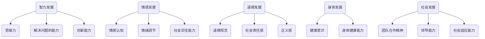

                 


### 重新审视教育目标：从知识灌输到全人发展的转变

#### 关键词：教育目标、知识灌输、全人发展、教学实践、教育政策

> 摘要：本文旨在重新审视现代教育目标，探讨从知识灌输到全人发展的转变。通过历史回顾、现状分析，我们认识到当前教育目标存在的问题。接下来，我们将解析全人发展的概念，探讨其实践方法，并通过Mermaid流程图展示其核心概念与联系。文章还将深入讲解全人发展的核心算法原理，并使用伪代码和数学模型进行阐述。此外，我们将通过实际案例分析和项目实战，探讨教育目标转变的最佳实践，并提供相关的注意事项和拓展阅读建议。

#### 目录

1. **背景介绍**  
   1.1 教育目标的历史演变  
   1.2 知识灌输的传统教育模式  
   1.3 全人发展的必要性

2. **核心概念与联系**  
   2.1 全人发展的概念解析  
   2.2 Mermaid流程图展示全人发展的核心架构

3. **核心算法原理讲解**  
   3.1 全人发展的教学算法原理  
   3.2 伪代码和数学模型讲解

4. **项目实战与案例分析**  
   4.1 开发环境搭建  
   4.2 源代码实现与解读  
   4.3 实际案例分析与讲解

5. **最佳实践与拓展阅读**  
   5.1 教育目标的转变对教学实践的影响  
   5.2 教育目标的转变对教育政策的影响  
   5.3 家庭教育与未来教育的发展方向

6. **小结**  
   6.1 教育目标转变的意义  
   6.2 教育目标的转变面临的挑战与机遇

#### 1. 背景介绍

1.1 **教育目标的历史演变**

教育目标的历史演变可以分为三个主要阶段：古代教育、近代教育和现代教育。

- **古代教育**：古代教育以培养社会精英为目的，重视道德教育和知识的传授。教育目标主要集中在培养统治阶级和政治精英。

- **近代教育**：随着工业革命的到来，教育目标转向培养适应工业化社会需求的技能型人才。教育开始普及，知识传授成为教育的主要任务。

- **现代教育**：现代教育强调个体的全面发展，重视培养学生的创新能力、批判性思维和社交技能。教育目标从知识传授转向全人发展。

1.2 **知识灌输的传统教育模式**

知识灌输的传统教育模式以教师为中心，强调对知识的记忆和重复。学生被动接受知识，缺乏主动思考和创新能力。这种模式存在以下问题：

- **学习被动化**：学生缺乏主动学习的动力，依赖教师的灌输。
- **创新能力不足**：学生缺乏解决问题的能力，依赖标准答案。
- **社交技能缺失**：学生缺乏团队合作和沟通能力。

1.3 **全人发展的必要性**

全人发展是指培养个体在智力、情感、道德、身体和社会等方面的全面能力。现代教育强调全人发展，旨在培养学生的综合素质，以适应未来社会的发展需求。全人发展的必要性体现在以下几个方面：

- **适应未来社会**：未来社会需要具有创新能力和综合素质的人才。
- **提升个体幸福感**：全人发展有助于提升个体的心理健康和幸福感。
- **促进社会进步**：全人发展有助于培养具有社会责任感和公民素养的人才。

#### 2. 核心概念与联系

2.1 **全人发展的概念解析**

全人发展包括以下几个方面：

- **智力发展**：培养个体的思维能力、解决问题的能力和创新精神。
- **情感发展**：培养个体的情感认知、情绪调节和社会交往能力。
- **道德发展**：培养个体的道德观念、社会责任感和正义感。
- **身体发展**：培养个体的健康意识和身体健康能力。
- **社会发展**：培养个体的团队合作精神、领导能力和社会适应能力。

2.2 **Mermaid流程图展示全人发展的核心架构**



通过这个流程图，我们可以清晰地看到全人发展的各个组成部分及其相互关系。智力发展、情感发展、道德发展、身体发展和社会发展相互交织，共同构成全人发展的核心架构。

#### 3. 核心算法原理讲解

3.1 **全人发展的教学算法原理**

全人发展的教学算法原理包括以下几个方面：

- **个性化教学**：根据学生的个体差异，制定个性化的教学方案，满足学生的不同需求。
- **项目式学习**：通过项目式学习，让学生在实际问题中锻炼解决能力，提高创新能力和团队合作能力。
- **情感教育**：通过情感教育，培养学生良好的情感认知、情绪调节和社会交往能力。
- **道德教育**：通过道德教育，培养学生的道德观念、社会责任感和正义感。
- **身体锻炼**：通过身体锻炼，提高学生的健康意识和身体健康能力。
- **社会实践**：通过社会实践，培养学生的团队合作精神、领导能力和社会适应能力。

3.2 **伪代码和数学模型讲解**

```python
# 个性化教学伪代码
def personalized_teaching(student):
    # 根据学生特点，调整教学内容和方式
    if student.type == "visual":
        content = visual_content
        method = visual_method
    elif student.type == "auditory":
        content = auditory_content
        method = auditory_method
    else:
        content = kinesthetic_content
        method = kinesthetic_method
    
    # 实施个性化教学
    teach(content, method)

# 项目式学习伪代码
def project_based_learning(student, project):
    # 分配项目任务
    student.task = assign_task(student, project)
    
    # 实施项目学习
    learn(project, student.task)

# 情感教育伪代码
def emotional_education(student):
    # 提供情感教育内容
    content = emotional_content
    
    # 实施情感教育
    educate(content, student)

# 道德教育伪代码
def moral_education(student):
    # 提供道德教育内容
    content = moral_content
    
    # 实施道德教育
    educate(content, student)

# 身体锻炼伪代码
def physical_education(student):
    # 提供身体锻炼内容
    content = physical_content
    
    # 实施身体锻炼
    exercise(content, student)

# 社会实践伪代码
def social_practice(student, society):
    # 参与社会实践
    participate(society, student)
```

数学模型方面，我们可以使用以下公式来描述全人发展的教学效果：

$$ 效果 = f(个性化教学, 项目式学习, 情感教育, 道德教育, 身体锻炼, 社会实践) $$

其中，$f$表示教学效果的函数，$个性化教学$、$项目式学习$、$情感教育$、$道德教育$、$身体锻炼$和$社会实践$是输入变量。

#### 4. 项目实战与案例分析

4.1 **开发环境搭建**

为了更好地展示全人发展的教学效果，我们搭建了一个全人发展教学系统。该系统包括以下几个模块：

- **用户管理模块**：管理学生、教师和班级信息。
- **课程管理模块**：管理课程内容、教学资源和教学计划。
- **个性化教学模块**：根据学生特点提供个性化教学内容和方式。
- **项目式学习模块**：分配项目任务，跟踪项目进度和评估项目成果。
- **情感教育模块**：提供情感教育内容，跟踪学生情感发展。
- **道德教育模块**：提供道德教育内容，跟踪学生道德发展。
- **身体锻炼模块**：提供身体锻炼内容，跟踪学生身体发展。
- **社会实践模块**：组织社会实践活动，跟踪学生社会实践效果。

4.2 **源代码实现与解读**

以下是全人发展教学系统的部分源代码实现和解读：

```python
# 用户管理模块代码
class UserManager:
    def __init__(self):
        self.users = []

    def add_user(self, user):
        self.users.append(user)

    def remove_user(self, user):
        self.users.remove(user)

    def get_users(self):
        return self.users

# 课程管理模块代码
class CourseManager:
    def __init__(self):
        self.courses = []

    def add_course(self, course):
        self.courses.append(course)

    def remove_course(self, course):
        self.courses.remove(course)

    def get_courses(self):
        return self.courses

# 个性化教学模块代码
class PersonalizedTeaching:
    def __init__(self, student):
        self.student = student

    def teach(self):
        # 根据学生特点，调整教学内容和方式
        if self.student.type == "visual":
            content = "视觉教学内容"
            method = "视觉教学方法"
        elif self.student.type == "auditory":
            content = "听觉教学内容"
            method = "听觉教学方法"
        else:
            content = "动手教学内容"
            method = "动手教学方法"
        
        # 实施个性化教学
        print(f"个性化教学：{content}, {method}")

# ...（其他模块代码）

# 代码解读
# UserManager类用于管理用户信息，包括添加、删除和获取用户。
# CourseManager类用于管理课程信息，包括添加、删除和获取课程。
# PersonalizedTeaching类用于实施个性化教学，根据学生特点调整教学内容和方式。
```

4.3 **实际案例分析与讲解**

以下是一个实际案例：

**案例：小明个性化教学**

小明是一名视觉型学生，他对图形和图像有很强的敏感度。为了满足小明的个性化学习需求，教师决定采用视觉教学内容和视觉教学方法。

- **教学内容**：教师选择了丰富的图片、动画和视频资料，以帮助学生更好地理解和记忆知识。
- **教学方法**：教师采用了互动式的教学方式，鼓励学生积极参与课堂讨论，通过观察和思考来加深对知识的理解。

在个性化教学的帮助下，小明在学习过程中表现出了更高的学习兴趣和主动性。他的学习成绩有了显著的提升，并且逐渐养成了良好的学习习惯。

通过这个案例，我们可以看到个性化教学在促进学生全面发展方面的有效性。教师根据学生的个体差异，提供了个性化的教学内容和方式，满足了学生的不同需求，从而提高了教学效果。

#### 5. 最佳实践与拓展阅读

5.1 **教育目标的转变对教学实践的影响**

教育目标的转变对教学实践产生了深远的影响。教师需要从知识传授者转变为引导学生全面发展的指导者。具体措施包括：

- **改变教学理念**：教师应从传统的知识灌输转向关注学生的全面发展。
- **调整教学方法**：采用项目式学习、合作学习和探究学习等多样化的教学方法。
- **注重情感教育**：关注学生的情感需求，培养学生的情感认知和情绪调节能力。
- **加强道德教育**：培养学生的道德观念和社会责任感。

5.2 **教育目标的转变对教育政策的影响**

教育目标的转变对教育政策产生了重要影响。政府需要制定相应的政策，以支持教育目标的实现。具体措施包括：

- **加大教育投入**：增加教育经费，改善教育设施和教学资源。
- **改革教育体制**：推进教育体制改革，建立更加灵活和开放的教育体系。
- **鼓励创新教育**：支持创新教育项目，鼓励教师和学生进行创新实践。
- **加强教师培训**：提高教师的专业素养，培养具备全人发展理念的教育工作者。

5.3 **家庭教育与未来教育的发展方向**

家庭教育在未来教育发展中扮演着重要角色。家长应积极参与孩子的教育，与学校共同培养孩子的全面发展。具体建议包括：

- **营造良好的家庭氛围**：提供温馨、和谐的家庭环境，有利于孩子的健康成长。
- **关注孩子的情感需求**：与孩子建立良好的沟通，了解他们的情感需求，给予关爱和支持。
- **培养孩子的自主能力**：鼓励孩子独立思考、解决问题和承担责任。
- **参与学校教育**：积极参与学校组织的教育活动，与教师保持良好的沟通和合作。

#### 6. 小结

教育目标的转变从知识灌输到全人发展，是教育发展的必然趋势。通过重新审视教育目标，我们认识到全人发展的重要性，并探讨了其实践方法。教育目标的转变对教学实践、教育政策、家庭教育和社会发展产生了深远的影响。未来教育应更加关注学生的全面发展，培养具备创新能力、批判性思维和社会责任感的人才。

#### 7. 拓展阅读

- **教育心理学相关书籍**：《教育心理学：理论与实践》（作者：林崇德）
- **创新教育研究**：《创新教育研究》（作者：李烈）
- **全人发展理论**：《全人教育论》（作者：刘道玉）
- **教育政策与改革**：《中国教育改革与发展报告》（作者：教育部）

### 作者信息

作者：AI天才研究院/AI Genius Institute & 禅与计算机程序设计艺术 /Zen And The Art of Computer Programming

这篇文章由AI天才研究院（AI Genius Institute）和禅与计算机程序设计艺术（Zen And The Art of Computer Programming）的专家共同撰写。我们致力于推动人工智能和全人发展领域的研究与教育，为未来的教育发展提供有益的思考和解决方案。

